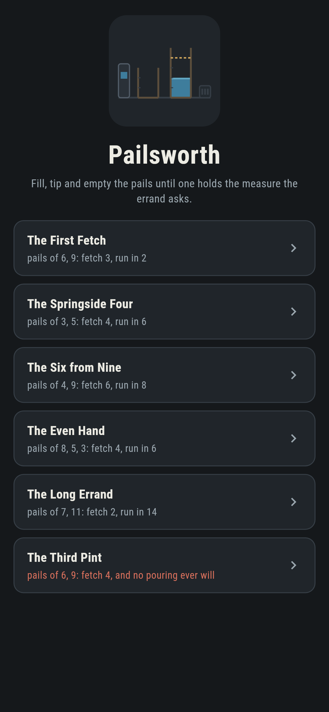
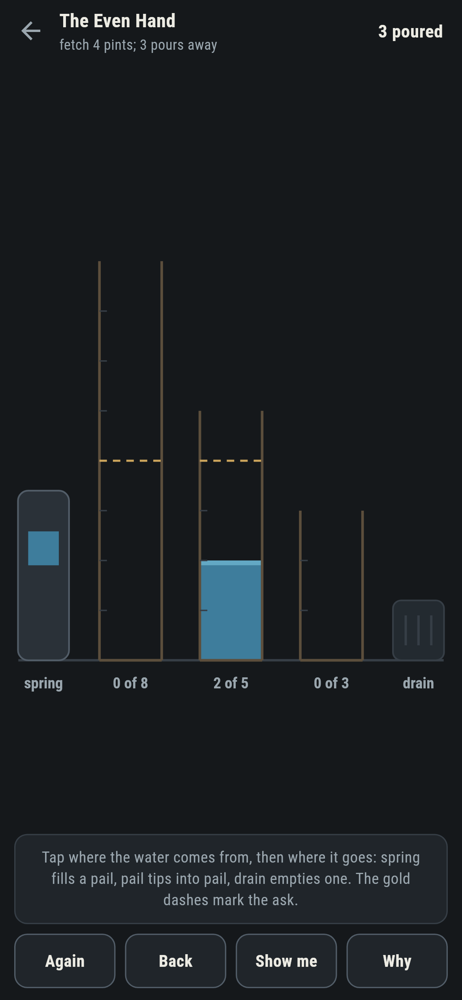
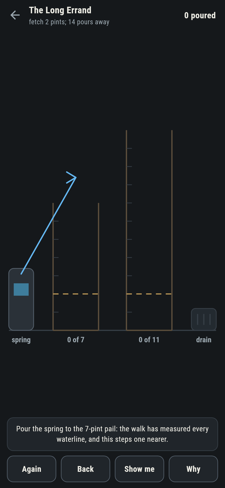
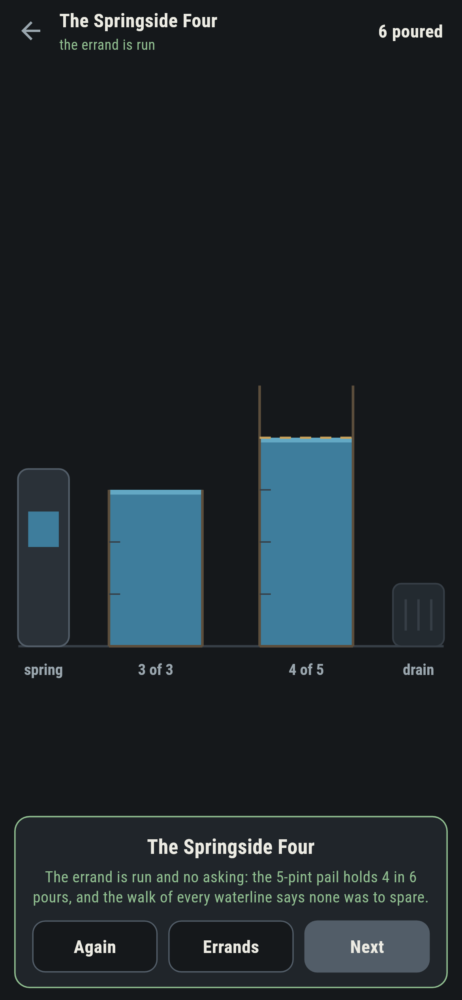
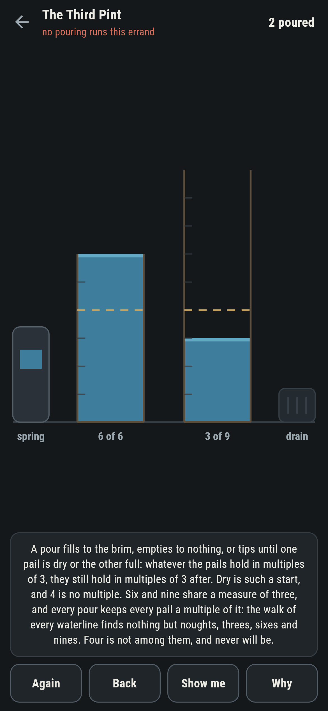
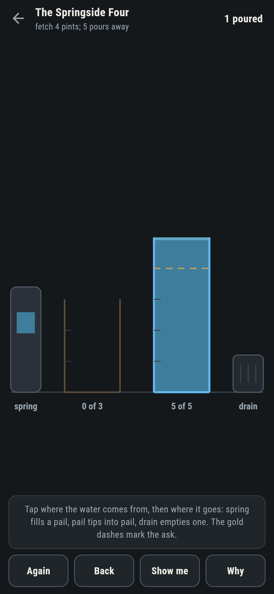

# Pailsworth

A water-fetching puzzle for phones, in Flutter, for Android and iOS.

Pails of known measure, a spring, and a drain. A pour fills a pail to
the brim, empties one to nothing, or tips one into another until the
first is dry or the second full. Fetch the measure the errand asks.
These are the old decanting puzzles, and every number the game states
about one has been walked, not remembered.

| | | | |
|---|---|---|---|
|  |  |  |  |

## The walk

The suite stands on every waterline a set of pails can reach, walking
breadth first from all-dry, and writes down the pours to and from
each. The famous answers fall out rather than being quoted: four
pints from a three and a five in six pours, the even hand of the old
eight-five-three table in six, two pints from a seven and an eleven
in a stubborn fourteen. The game plays from the same walk, so the
live count of pours-to-go is exact and **Show me** is never folklore.

```
$ make errands
 1 The First Fetch     pails 6/9  ask 3  70 waterlines walked  run in 2 pours, none to spare
 2 The Springside Four pails 3/5  ask 4  24 waterlines walked  run in 6 pours, none to spare
 3 The Six from Nine   pails 4/9  ask 6  50 waterlines walked  run in 8 pours, none to spare
 4 The Even Hand       pails 8/5/3  ask 4  216 waterlines walked  run in 6 pours, none to spare
 5 The Long Errand     pails 7/11  ask 2  96 waterlines walked  run in 14 pours, none to spare
 6 The Third Pint      pails 6/9  ask 4  70 waterlines walked  never runs: the measure is 3 and the ask 4
```

## The third pint

Six and nine share a measure of three, and every pour keeps it: a
fill lands a full capacity, an emptying lands nothing, and a tip
moves water without making any. Whatever the pails hold in multiples
of three, they hold in multiples of three after, and dry is such a
start. Four is not a multiple, so the errand ships labelled, in the
house tradition of maps nobody can win, with the sweep of every
reachable waterline standing behind the words: nothing but noughts,
threes, sixes and nines, ever.



## The live waterline

The gold dashes mark the ask on every pail tall enough to hold it,
and the ledger counts the pours still needed from the water as it
stands. A pour that raises that count is called out the moment it
lands, with **Back** waiting.



## Building

```
make deps     # fetch packages
make check    # analyze + every test
make errands  # walk every waterline, sweep the measure, print the ledger
make shots    # render the screenshots and redraw the icons
make apk      # Android release build
make ios      # iOS release build (unsigned)
```

The logo and every app icon are drawn by the game's own painter in
`test/mark_test.dart`. There is no image in this repository that was not
produced by code in it.

## How it is put together

```
lib/pail/rules.dart      pours, the walk, the shared measure
lib/pail/errand.dart     an errand: pails, the ask, its fewest
lib/pail/errands.dart    the six errands that ship
lib/pail/play.dart       an errand being run: pours, take-back, the
                         live count
lib/ui/                  the painter, the screens, the mark
tool/check_errands.dart  the walks, the sweeps, the ledger above
```

The tests pour single waterlines by hand at the brims, hold the walk
to the famous answers, sweep the shared-measure invariant over every
reachable waterline, watch the third pint stay dry of fours however
the water moves, run every winnable errand by following the game's
own pointer, and hold the pictures against the real widget tree. If
any of that drifts, `make check` goes red before anything leaves the
machine.
