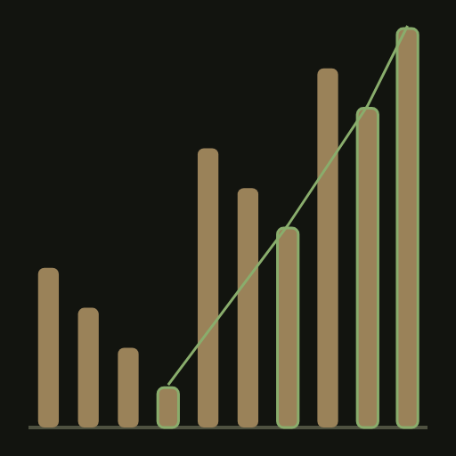
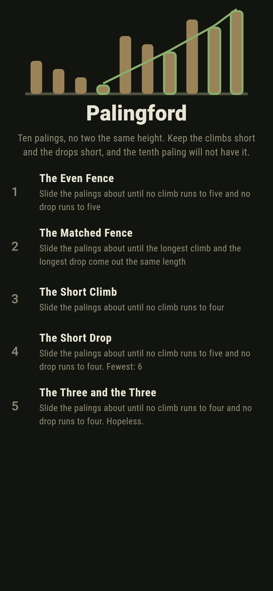
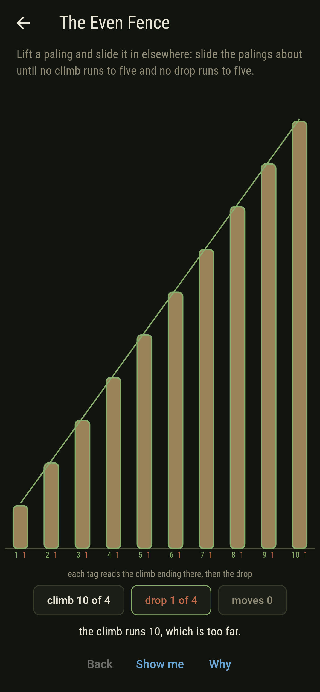
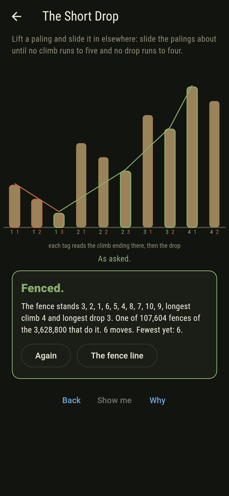
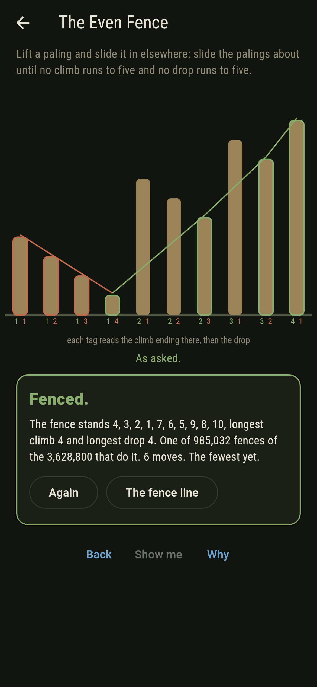
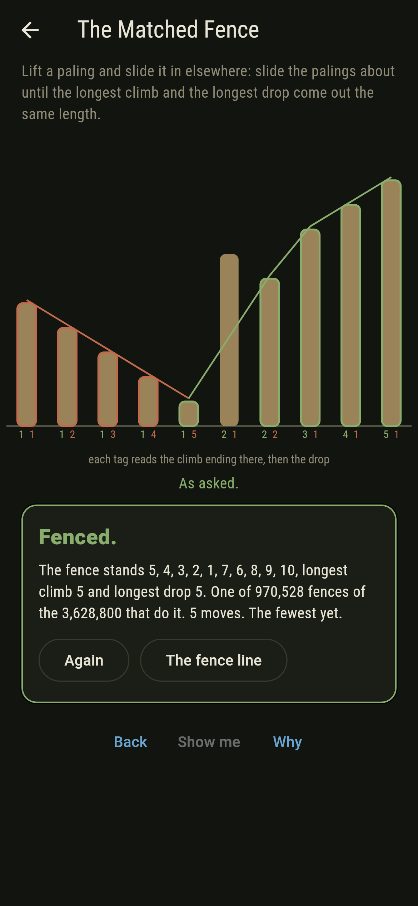
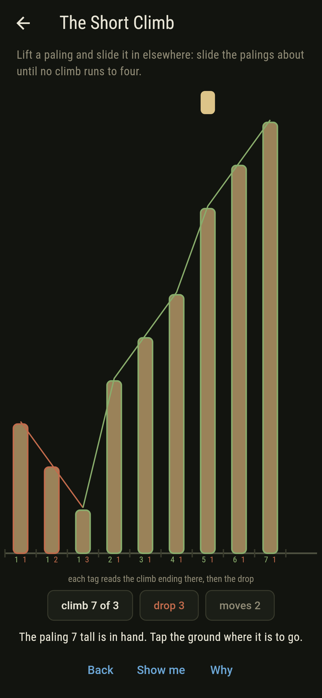
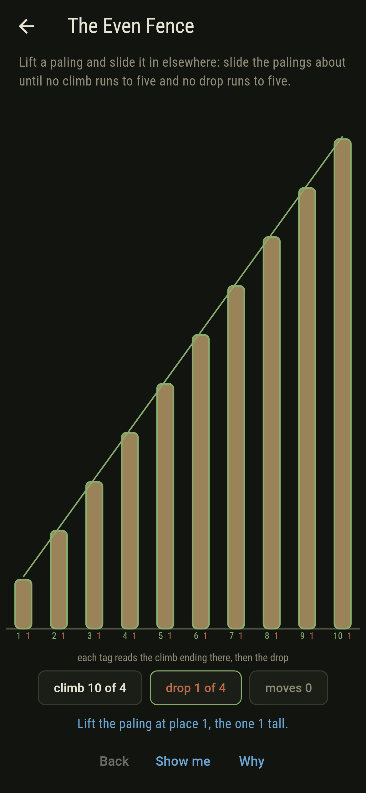
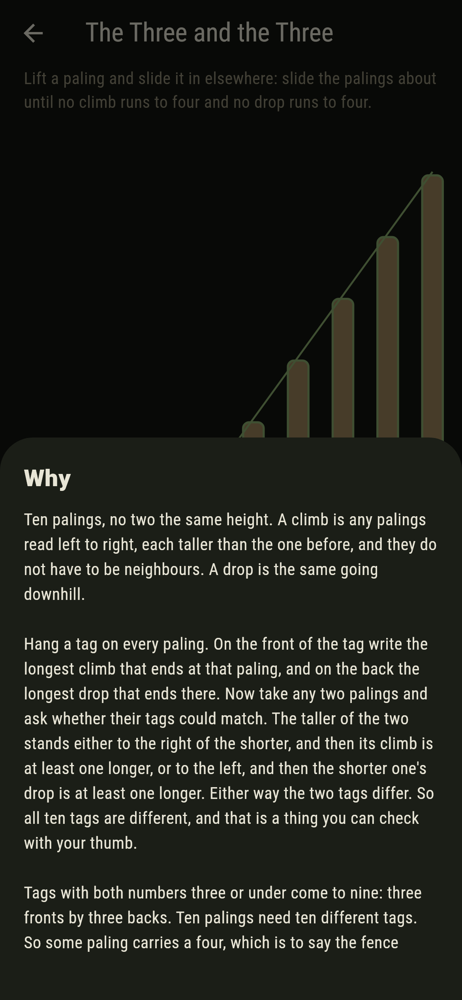
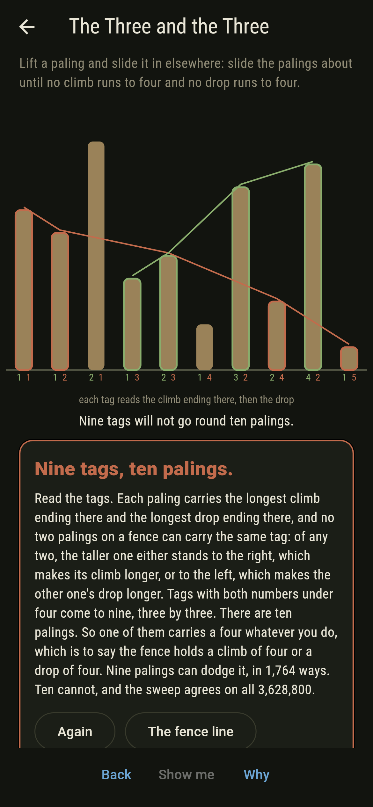

# Palingford



Ten palings in a fence, no two the same height. A climb is any
palings read left to right, each taller than the one before, and
they do not have to be neighbours. A drop is the same going
downhill. Lift a paling out, slide it back in somewhere else, and
try to hold both the longest climb and the longest drop down to
three. You cannot. Hang a tag on every paling reading the longest
climb ending there and the longest drop ending there. Take any two
palings: the taller one either stands to the right, which makes its
climb at least one longer, or to the left, which makes the other
one's drop at least one longer. So no two tags on a fence match.
Tags with both numbers under four come to nine, three by three, and
there are ten palings. That is the theorem of Erdos and Szekeres,
and the tags are printed under the fence while you play.

## The asks

1. **The Even Fence** - slide the palings about until no climb runs to five and no drop runs to five
2. **The Matched Fence** - slide the palings about until the longest climb and the longest drop come out the same length
3. **The Short Climb** - slide the palings about until no climb runs to four
4. **The Short Drop** - slide the palings about until no climb runs to five and no drop runs to four
5. **The Three and the Three** - slide the palings about until no climb runs to four and no drop runs to four

The fence starts shortest to tallest, one climb the whole way and no
drop at all, so every ask is a matter of breaking it up. They land
985,032, 970,528, 586,590 and 107,604 of the 3,628,800 orders, the
nearest 6, 5, 7 and 6 moves away. Four and three cannot be
tightened: take the climb down and it is three and three, take the
drop down and it is a box of eight tags for ten palings. The Matched
Fence comes out four and four or five and five and nothing else,
because three and three is impossible and a climb and a drop can
share only one paling, so six of each would want eleven. The Three
and the Three is labeled hopeless on its tile, and the tags are the
why.

## Two voices

The game never asserts what it has not computed, and it computes
everything at least twice:

* **The sweep** takes all 3,628,800 orders in turn, works out the
  longest climb ending at each paling and the longest drop ending at
  each, and reads the two longest runs off those. Every count on the
  tile and the card is its.
* **The shapes** writes no fence down at all. Robinson and Schensted
  matched every order with a shape whose top row is the longest
  climb and whose depth is the longest drop, the hook length formula
  says how many ways a shape can be filled in, and a shape stands for
  as many orders as it has fillings multiplied by themselves. There
  are 42 shapes of ten to add up. No shape of ten fits in a box three
  wide and three deep, because such a box holds nine.

`tool/check_palings.dart` runs the lot and refuses the bake on any
disagreement. The two ways of counting agree on all 100 boxes of
limits, not just the one the game turns on. The checker also reads
the tags on every one of the 3,628,800 fences and finds none with
two palings carrying the same tag, which is the proof rather than an
illustration of it. And it holds the player's move to account: at
six palings it walks all 518,400 ordered pairs of orders out in
full, and the walk came to six less the palings that keep their
order every time. That is the count on the moves chip, and the
fewest on each tile rests on it.

Crookmarsh in this collection comes out of the same paper. Erdos and
Szekeres wrote it in 1935 about points in the plane, asking how many
you need before four of them stand at the corners of a quadrilateral
with nothing tucked inside; the five-point case Crookmarsh turns on
was Esther Klein's, and it is what set the two of them off. The
monotone runs here are the other result in that paper. The two
proofs share nothing at all. Crookmarsh's is geometry, and this one
is nine tags and ten palings.

Staplemere works the same raw material and gets
something else out of it. Bales come up a lane in an order the carter
chose and go into piles, a pile read from the ground up is a falling
run, and the fewest piles the morning allows is exactly the longest
rising run, which is Dilworth's theorem in a farmyard. There the two
kinds of run are counted against each other and the answer comes out
exact. Here neither is being counted. The question is only how short
both can be made at once, and the answer is that on ten palings one
of them reaches four.

Evenmoor is the pigeonhole in its plainest clothes: four pegs can
take the four kinds of hole one apiece and five cannot. This is the
same shape of argument with the holes hidden. Nobody hands you nine
pigeonholes here. You have to notice that the tag on a paling is
one, and that two palings can never share theirs.

## The checker's ledger

What `dart run tool/check_palings.dart` printed for the build this
README shipped with, word for word:

```
every order of the ten palings tried, all 3,628,800 of them, each tagged paling by paling with the longest climb ending there and the longest drop ending there: no fence anywhere has two palings carrying the same tag; not one of the 3,628,800 keeps both runs under four, while 107,604 keep the climb under five with the drop under four, and that pair of limits cannot be tightened: take either number down by one and nothing is left; a second voice counts the same orders from shapes and writes no fence down, 42 shapes of ten with the hook length formula for each, and the two agree on all 100 boxes of limits; the player's move was walked out in full at six palings, all 518,400 ordered pairs of orders, and the walk came to six less the palings that keep their order every time; the moves home from any fence of ten come to ten less its longest climb, checked on all 3,628,800; nine palings can hold both runs under four, in 1,764 ways, which is the 42 fillings of the one shape that fits a three by three box multiplied by themselves, and ten palings in none

 1 The Even Fence          slide the palings about until no climb runs to five and no drop runs to five: 985,032 of the 3,628,800 fences do it, the nearest 6 moves away
 2 The Matched Fence       slide the palings about until the longest climb and the longest drop come out the same length: 970,528 of the 3,628,800 fences do it, the nearest 5 moves away
 3 The Short Climb         slide the palings about until no climb runs to four: 586,590 of the 3,628,800 fences do it, the nearest 7 moves away
 4 The Short Drop          slide the palings about until no climb runs to five and no drop runs to four: 107,604 of the 3,628,800 fences do it, the nearest 6 moves away
 5 The Three and the Three slide the palings about until no climb runs to four and no drop runs to four: none of the 3,628,800, and nine tags cannot go round ten palings
```

## Screenshots

| The fence line | An ask as it opens | The short drop |
| --- | --- | --- |
|  |  |  |

| The even fence | The matched fence | A paling in hand | Show me | The why | Nine tags, ten palings |
| --- | --- | --- | --- | --- | --- |
|  |  |  |  |  |  |

The tags under the palings are the proof, so they are drawn in the
colours of the runs they count: the climb in green, the drop in
rust. Read along the row on any fence in these pictures and no two
of them are the same.

Screenshots are drawn by `test/showcase_test.dart` at real phone
sizes with the app's own painter, then copied into `docs/` as they
came out; every paling in them was lifted and slid in a tap at a
time, so nothing pictured is a fence the game could not reach. The
logo and every launcher icon come out of `test/mark_test.dart` the
same way: the mark is a fence of ten with the longest climb marked,
four falling runs of four, three, two and one that step up as they
go, which puts both runs at four, the shortest either can be made.

## Building

```
flutter test          # 57 tests, both voices among them
dart run tool/check_palings.dart
flutter build apk     # or: flutter build ios
```
