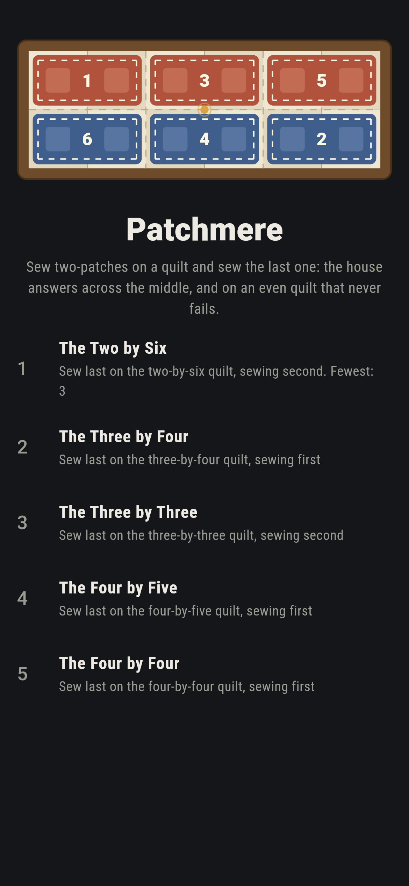
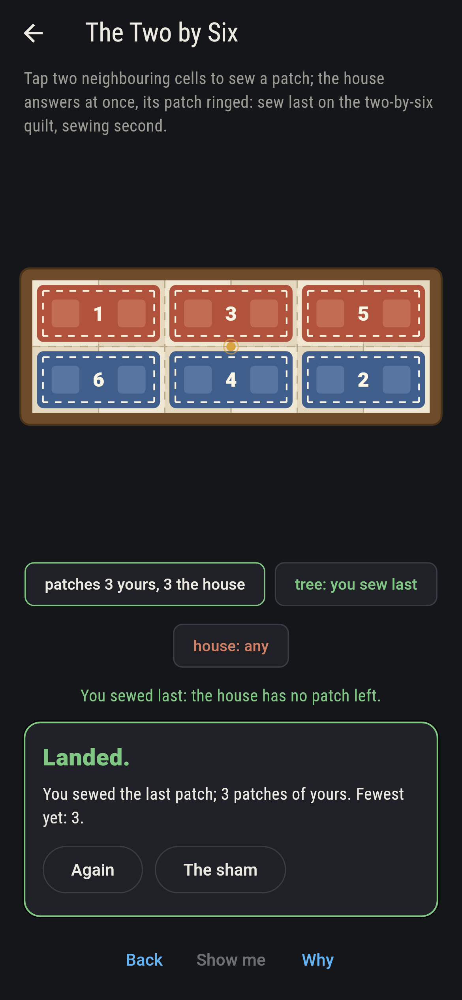
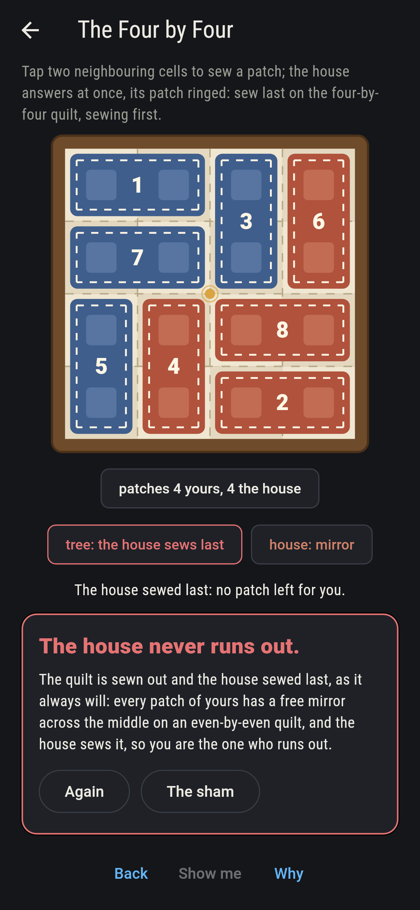
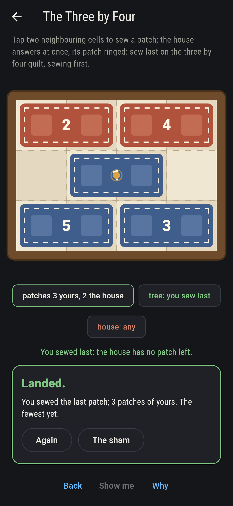
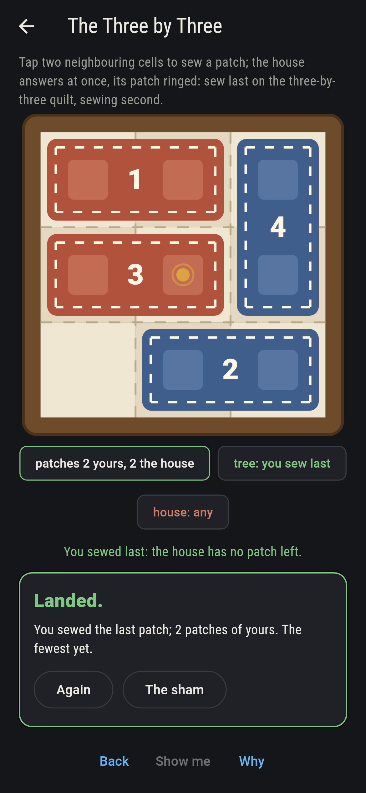
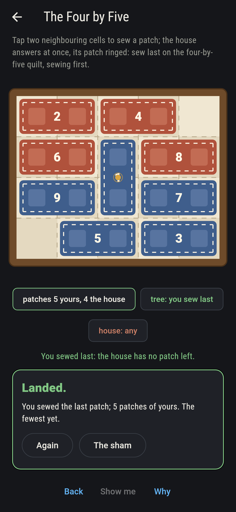
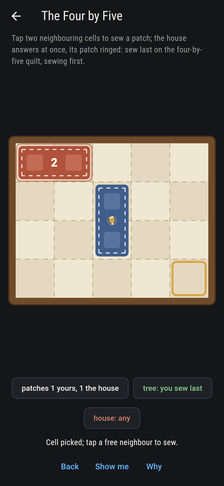
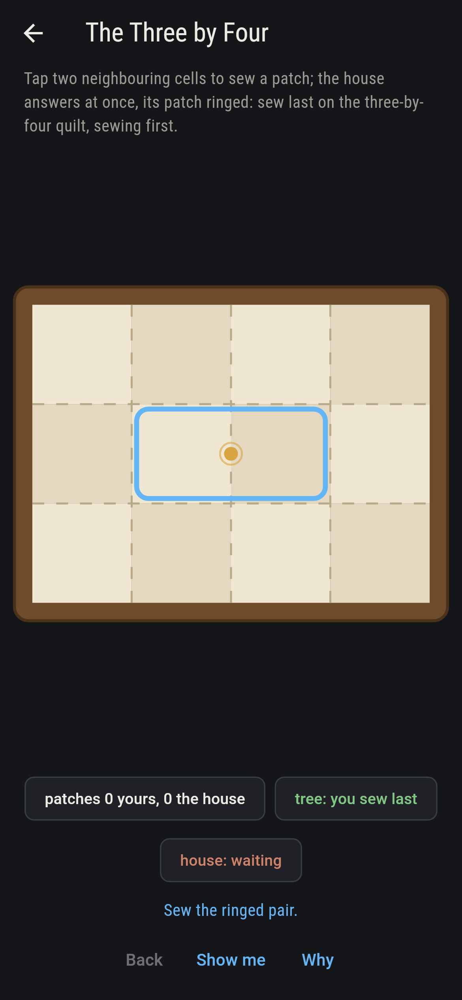
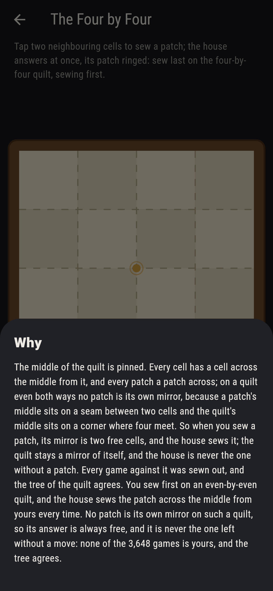

# Patchmere


Cram on a calico quilt: two sewers take turns sewing a two-patch
on any two free neighbouring cells, and whoever sews the last
patch wins. The middle of the quilt is pinned, and every patch
has a patch across the middle from it. On a quilt even both ways
no patch is its own mirror, so the second sewer can answer every
patch with its mirror and can never be the one left without a
move; on a quilt with one side odd there is exactly one patch
that is its own mirror, the middle one, and the first sewer takes
it and then mirrors. The tree of every small quilt is walked and
agrees. Both sides odd, no mirror trick decides it, and the tree
alone says the three-by-three is lost for the first sewer.

## The quilts

1. **The Two by Six** - sew last on the two-by-six quilt, sewing second
2. **The Three by Four** - sew last on the three-by-four quilt, sewing first
3. **The Three by Three** - sew last on the three-by-three quilt, sewing second
4. **The Four by Five** - sew last on the four-by-five quilt, sewing first
5. **The Four by Four** - sew last on the four-by-four quilt, sewing first

The house sews across the middle where the mirror is its to
play, takes the middle patch where that is, and plays the tree
elsewhere. Every game against it is sewn out from every quilt:
7 of the 50 on the two-by-six are yours, 34 of 324 on the
three-by-four, 8 of 10 on the three-by-three, 2,909 of 64,546 on
the four-by-five, and none of the 3,648 on the four-by-four,
where the house mirrors you to the end. The Four by Four is
labeled hopeless on its tile, and the why pins the middle.

## Two voices

The game never asserts what it has not computed, and it computes
everything at least twice:

* **The mirror** is played out, not argued: on the six even-by-
  even quilts of up to twenty cells the second sewer answers
  across the middle through every game the first can sew, and
  the answer always fits and always comes last; on the eight
  quilts with one side odd the first sewer takes the middle patch
  and mirrors after, the same way. Which patches are their own
  mirror is counted on every quilt up to five by five.
* **The tree** values every position of every quilt that ships,
  the sewer to move winning or losing with best play, and it
  agrees with the mirror on every quilt where the mirror plays,
  reads the odd-by-odd quilts on its own, and counts the winning
  openings: seven of seventeen on the three-by-four, five of
  thirty-one on the four-by-five, the middle patch among them
  both times.

`tool/check_quilts.dart` runs the lot and refuses the bake on any
disagreement.

## The checker's ledger

What `dart run tool/check_quilts.dart` printed for the build this
README shipped with, word for word:

```
every game of Cram against the house sewn out on every quilt, and the mirror held to the tree on every quilt of up to twenty cells: on the even-by-even quilts, six of them, the second sewer answering across the middle always finds the patch free and always sews last through all 65,756 games, and the tree agrees the first sewer loses; on the eight quilts with one side odd the first sewer takes the one patch that is its own mirror and then answers across it, always fitting, always last, through 11,739 games, and the tree agrees the first sewer wins; the places for a patch counted two ways on every quilt up to five by five, the three-by-three read as a loss for the first sewer and the three-by-five a win by the tree alone

 1 The Two by Six     sew last on the two-by-six quilt, sewing second: 7 of the 50 games against the house are yours
 2 The Three by Four  sew last on the three-by-four quilt, sewing first: 34 of the 324 games against the house are yours
 3 The Three by Three sew last on the three-by-three quilt, sewing second: 8 of the 10 games against the house are yours
 4 The Four by Five   sew last on the four-by-five quilt, sewing first: 2,909 of the 64,546 games against the house are yours
 5 The Four by Four   sew last on the four-by-four quilt, sewing first: none of the 3,648, and the mirror said so first
```

## Screenshots

| The sham | The two by six sewn out | The four by four admitted |
| --- | --- | --- |
|  |  |  |

| The three by four | The three by three | The four by five | Mid-sewing | Show me | The why |
| --- | --- | --- | --- | --- | --- |
|  |  |  |  |  |  |

Screenshots are drawn by `test/showcase_test.dart` at real phone
sizes with the app's own painter, then copied into `docs/` as they
came out; every patch in them was sewn by taps or by the house's
answer to one, so nothing pictured is a quilt the game could not
reach. The logo and every launcher icon come out of
`test/mark_test.dart` the same way: the mark is the two-by-six
sewn out, three house patches each answered across the middle.

## Building

```
flutter test          # 48 tests, the mirror and the tree among them
dart run tool/check_quilts.dart
flutter build apk     # or: flutter build ios
```
