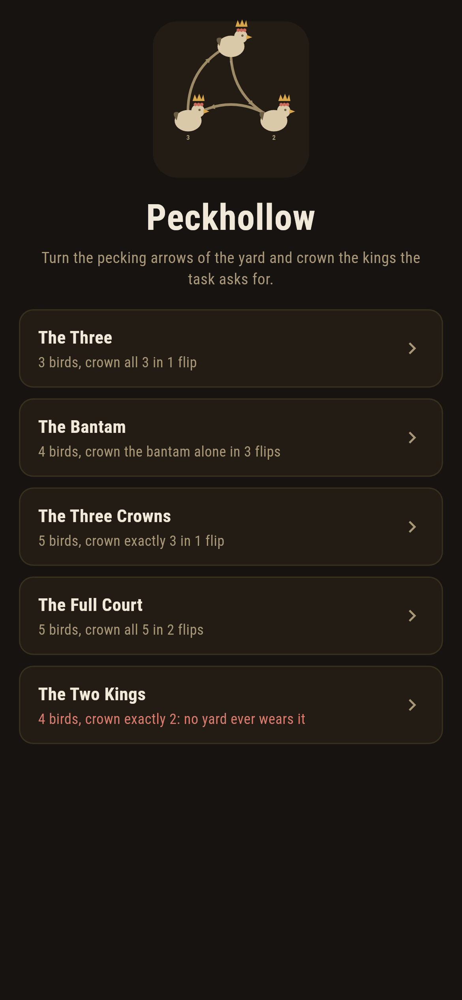
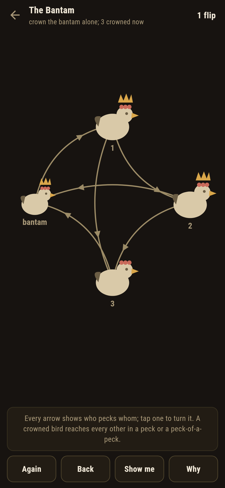
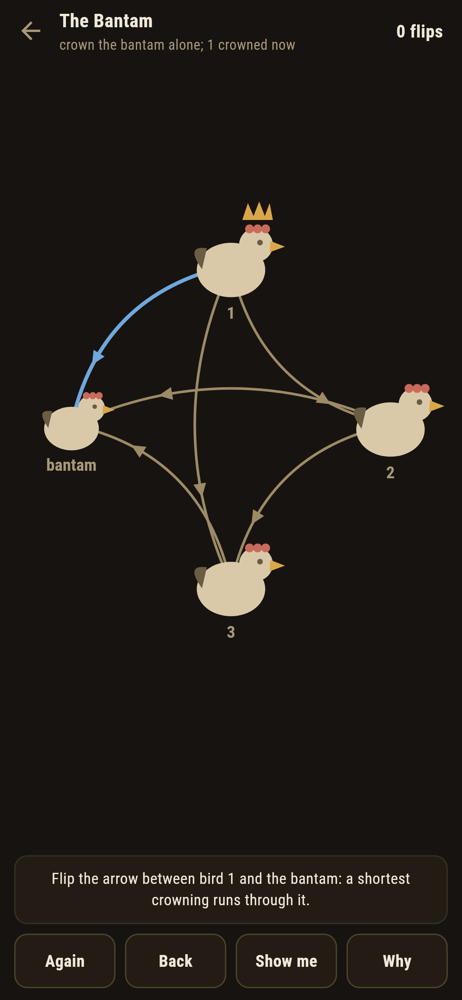
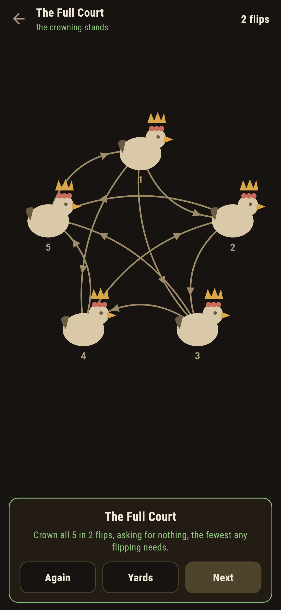
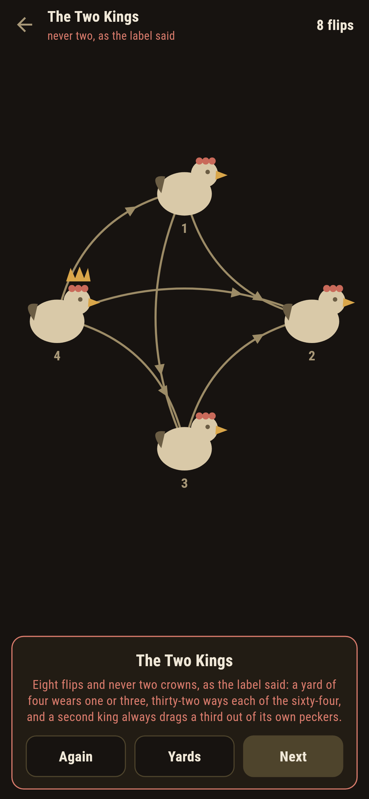
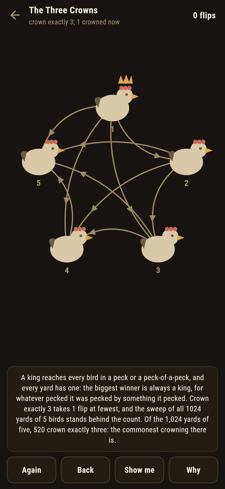

# Peckhollow

A pecking-order puzzle for phones, in Flutter, for Android and iOS.

Every two birds in the yard have settled who pecks whom, one arrow a
pair, and a king is a bird that reaches every other in a peck or a
peck-of-a-peck. Tap an arrow to turn it, and crown the kings the
task asks: all of them, exactly three, the bantam alone. This is
tournament theory scratched into a hen yard, and the games carry its
three little theorems whole: every yard has a king, the biggest
winner is always one, and no yard anywhere crowns exactly two.

| | | | |
|---|---|---|---|
|  |  |  |  |

## Two ways of knowing

The suite knows every yard more ways than one, and none of them
shares anything with the others. The biggest winner is always a king
because whatever pecked it was pecked by something it pecked, an
argument three lines long; any king's peckers hide another king
among themselves, which is why a second crown always drags a third;
and the sweep flips through every yard there is, all 8, 64 and 1,024
of three, four and five birds, and counts the crowns on each. Every
written count below is the sweep's own.

```
$ make yards
every yard has a king, the biggest winner being one: whatever pecked it was pecked by something it pecked; any king's peckers hide another king; and no yard crowns exactly two, swept over all 8, 64 and 1,024 yards of three, four and five birds

 1 The Three        3 birds  crown all 3: 1 flip from the pecking order
 2 The Bantam       4 birds  crown the bantam alone: 3 flips from the pecking order
 3 The Three Crowns 5 birds  crown exactly 3: 1 flip from the pecking order
 4 The Full Court   5 birds  crown all 5: 2 flips from the pecking order
 5 The Two Kings    4 birds  crown exactly 2: no flipping of any yard does
```

## The two kings

One yard ships labelled hopeless in the house tradition of maps
nobody can win: crown exactly two. A second crown always drags a
third out of its own peckers, so a yard of four wears one crown or
three, thirty-two ways each of the sixty-four, and never two, never
all four. The game says so on the way in, keeps the crowns counted
live while you flip, and after eight flips writes the futility down
rather than let anyone grind at it.



## The crowns that count themselves

Nothing about the kings is folklore here. The crowns sit on the
birds and move the moment an arrow turns, the ledger counts them,
and **Why** speaks the winner-king argument over the yard in front
of you. **Show me** lights an arrow a shortest crowning runs
through, and a flip that brings the task no nearer is called out
the moment it lands, with the fewest still needed named.



## Building

```
make deps      # fetch packages
make check     # analyze + every test
make yards     # sweep every yard and prove the king theorems
make shots     # render the screenshots and redraw the icons
make apk       # Android release build
make ios       # iOS release build (unsigned)
```

The logo and every app icon are drawn by the game's own painter in
`test/mark_test.dart`. There is no image in this repository that was not
produced by code in it.

## How it is put together

```
lib/yard/rules.dart      the kings, the sweep of every yard, the
                         walk of every flipping
lib/yard/yard.dart       a yard: its birds, its arrows, its asking
lib/yard/yards.dart      the five yards that ship
lib/yard/play.dart       a yard being reflipped: flips, take-back
lib/ui/                  the painter, the screens, the mark
tool/check_yards.dart    the sweeps and the ledger above
```

The tests crown yards by hand against written-out arrows, sweep
every yard of three, four and five birds for the winner-king, the
hidden king and the never-two, land every winnable task in exactly
its par by following the game's own pointer, watch a wandered flip
get called out, watch the two kings never come and the yard admit
it, and hold the pictures against the real widget tree. If any of
that drifts, `make check` goes red before anything leaves the
machine.
