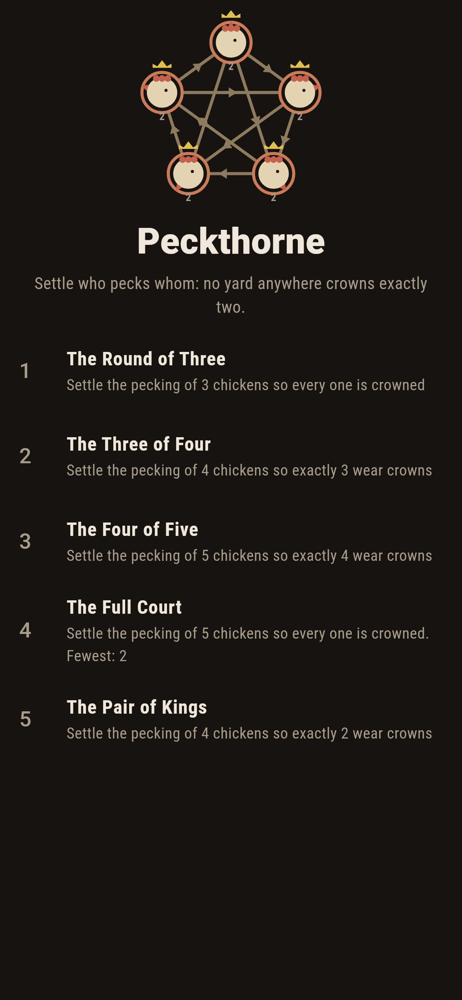
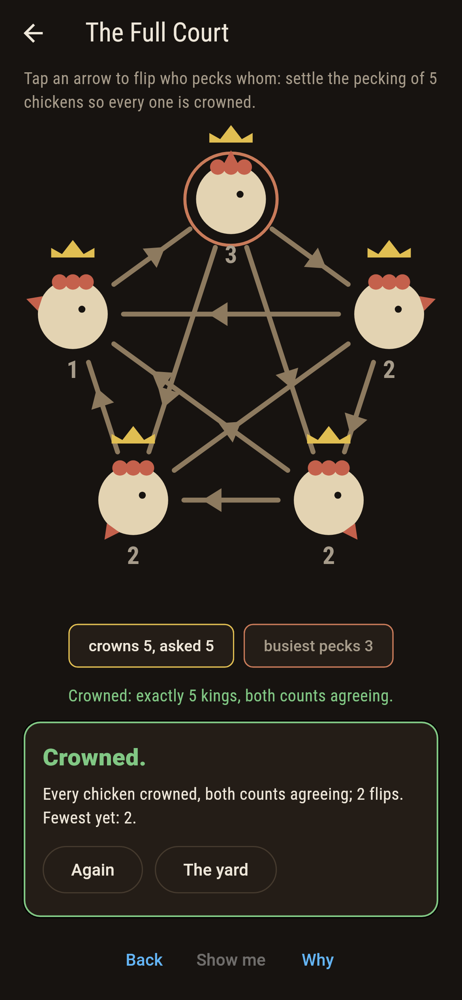
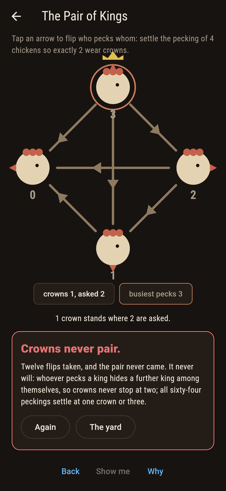
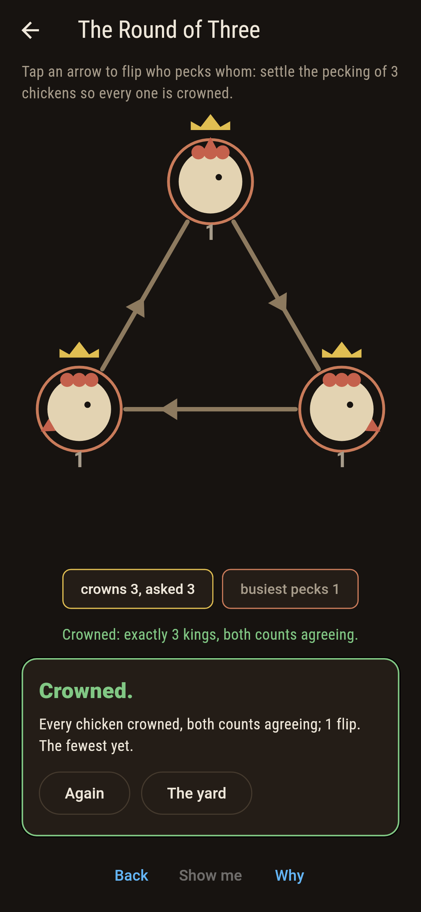
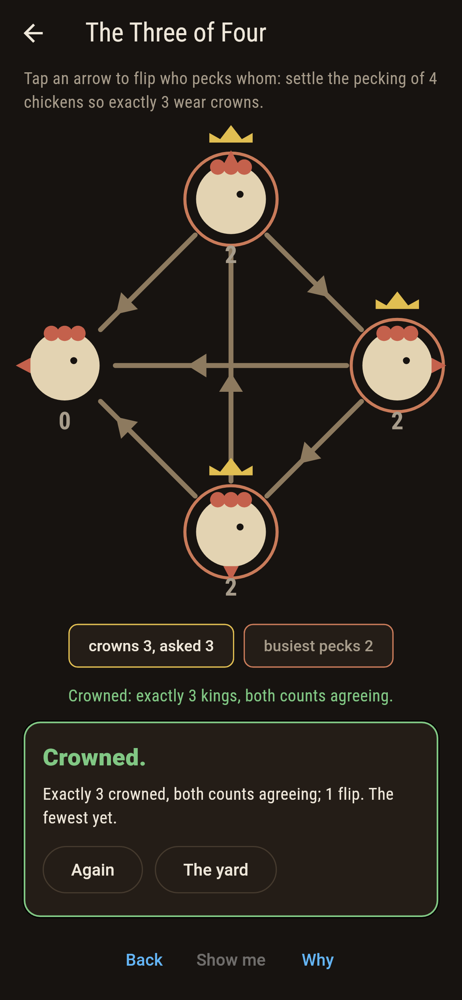
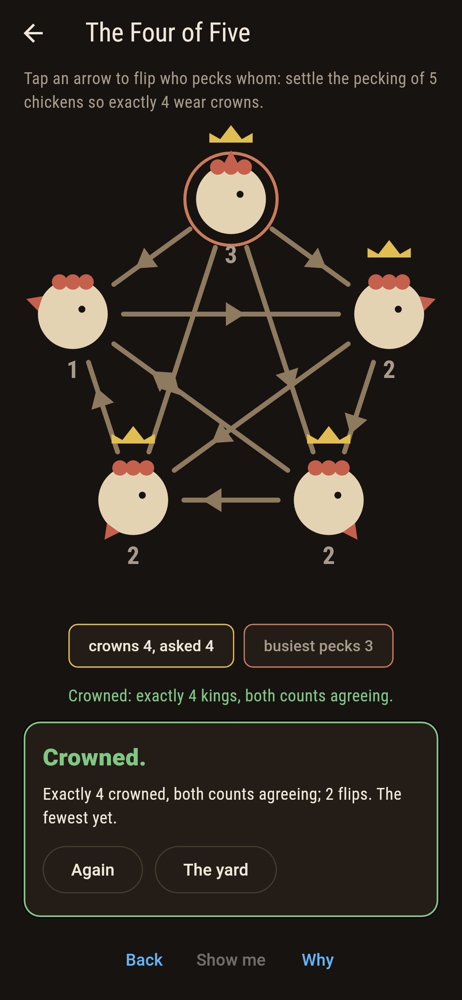
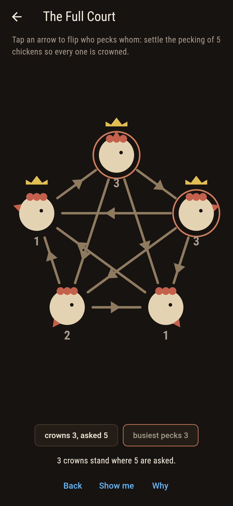
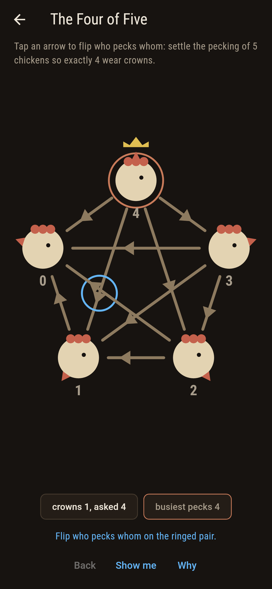
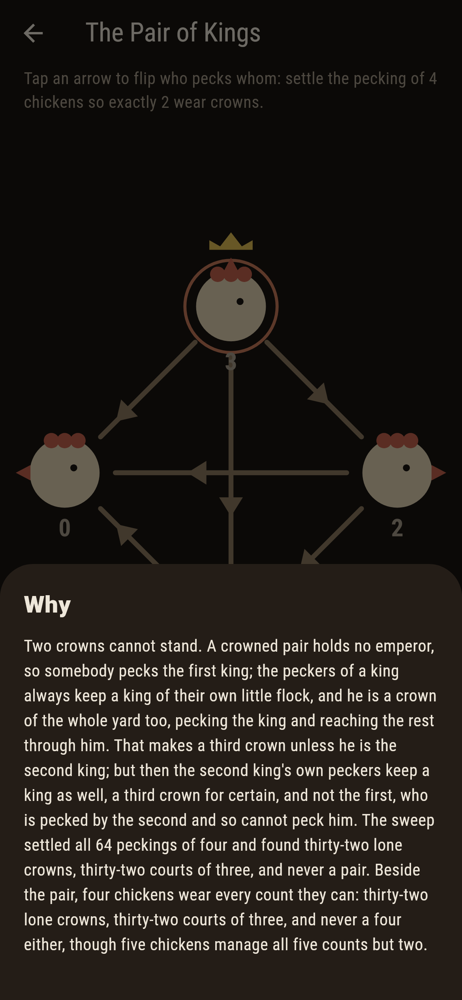

# Peckthorne


Chickens in a yard, every pair settled on who pecks whom. A king
pecks every other chicken in two steps at most: outright, or
through one middleman. Every pecking crowns somebody, the
busiest pecker always among them, a lone king is always an
emperor, and no pecking of any yard anywhere crowns exactly
two. Tap the arrows and try.

## The flocks

1. **The Round of Three** - settle 3 chickens so every one is crowned
2. **The Three of Four** - settle 4 chickens so exactly 3 wear crowns
3. **The Four of Five** - settle 5 chickens so exactly 4 wear crowns
4. **The Full Court** - settle 5 chickens so every one is crowned
5. **The Pair of Kings** - settle 4 chickens so exactly 2 wear crowns

Only the two round-robins crown all of three. The sixty-four
peckings of four split into thirty-two lone emperors and
thirty-two courts of exactly three, with a full court of four
nowhere in them. Five chickens manage one, three, four and five
crowns across their 1,024 peckings, and nothing anywhere
manages two: The Pair of Kings is labeled hopeless on its tile,
and the why walks the argument.

## Two voices

The game never asserts what it has not computed, and it computes
everything at least twice:

* **The middleman walk** crowns a chicken by the definition:
  every other chicken checked for a direct peck or one
  go-between.
* **The squared table** crowns by boolean arithmetic instead,
  the whole pecking table squared and read off row by row. The
  sweep settles all 8, 64 and 1,024 peckings and the two counts
  agree on every one, with the busiest-pecker law, the
  lone-king law and the no-pair law held on each.

`tool/check_pecks.dart` runs the lot and refuses the bake on
any disagreement.

## The checker's ledger

What `dart run tool/check_pecks.dart` printed for the build
this README shipped with, word for word:

```
every pecking of every yard settled, 8 and 64 and 1,024: the two crown counts agree on all of them, the busiest pecker is crowned in each, a lone king is always an emperor and an emperor always alone, no pecking of four crowns four, and none anywhere crowns exactly two

 1 The Round of Three settle the pecking of 3 chickens so every one is crowned: 2 peckings of the sweep land it
 2 The Three of Four  settle the pecking of 4 chickens so exactly 3 wear crowns: 32 peckings of the sweep land it
 3 The Four of Five   settle the pecking of 5 chickens so exactly 4 wear crowns: 120 peckings of the sweep land it
 4 The Full Court     settle the pecking of 5 chickens so every one is crowned: 64 peckings of the sweep land it
 5 The Pair of Kings  settle the pecking of 4 chickens so exactly 2 wear crowns: none of the 64, and the crown count is barred from two everywhere
```

## Screenshots

| The yard | The full court | The pair of kings admitted |
| --- | --- | --- |
|  |  |  |

| The round of three | The three of four | The four of five | Mid-settle | Show me | The why |
| --- | --- | --- | --- | --- | --- |
|  |  |  |  |  |  |

Screenshots are drawn by `test/showcase_test.dart` at real phone
sizes with the app's own painter, then copied into `docs/` as
they came out; every flip in them was tapped, so nothing
pictured is a pecking the game could not reach. The logo and
every launcher icon come out of `test/mark_test.dart` the same
way: the mark is the round pecking of five, every chicken
crowned.

## Building

```
flutter test          # 46 tests, the sweep among them
dart run tool/check_pecks.dart
flutter build apk     # or: flutter build ios
```
