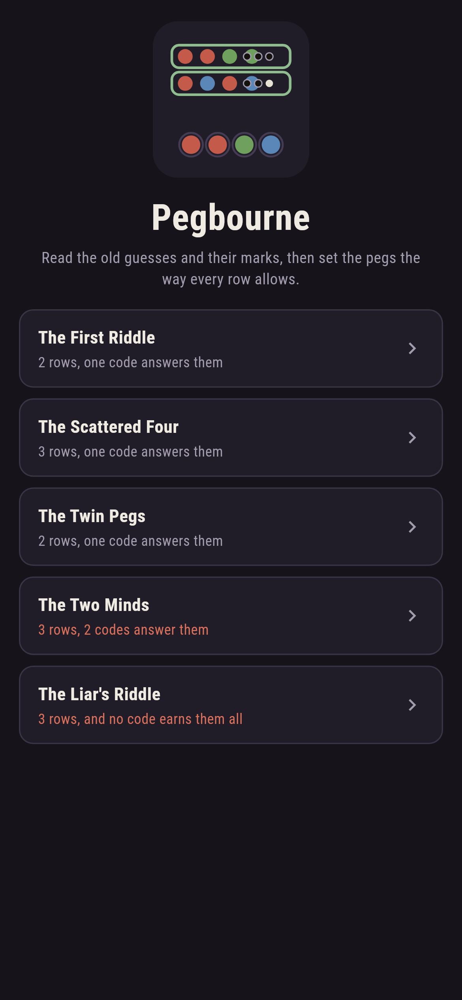
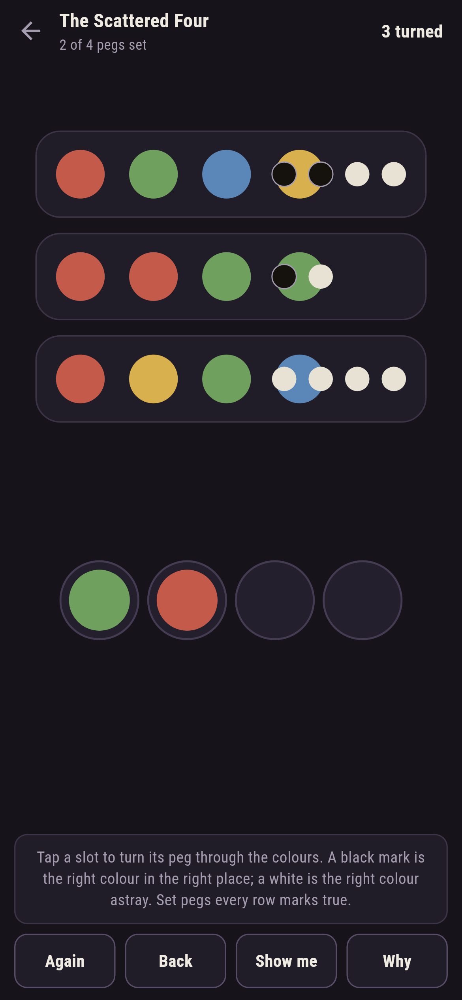
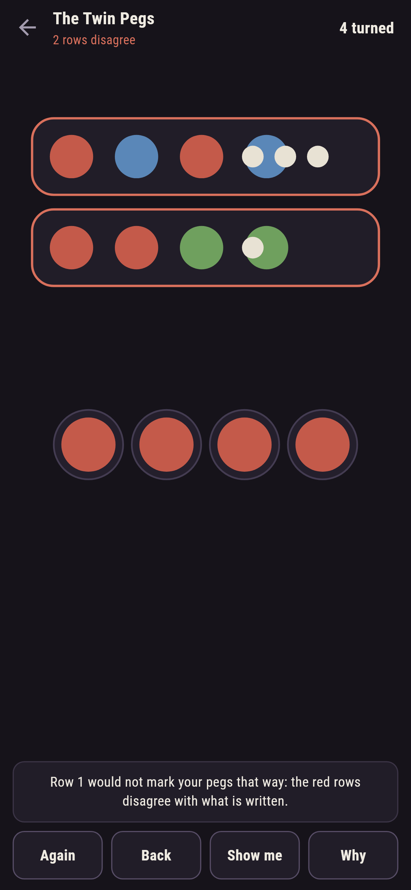
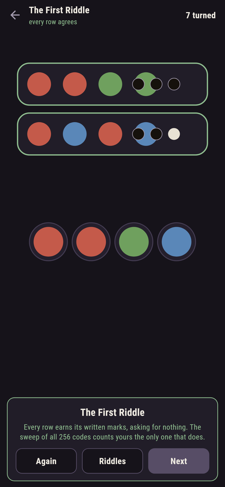
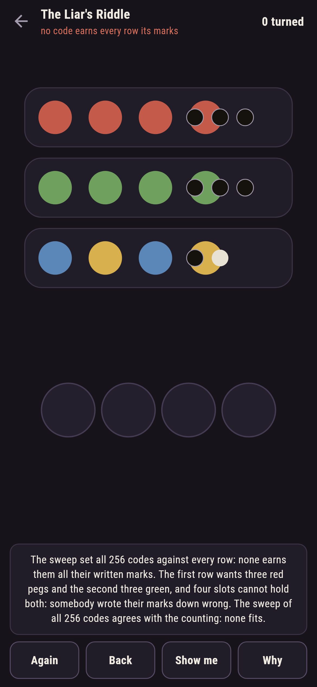

# Pegbourne

A code-reading puzzle for phones, in Flutter, for Android and iOS.

Somebody has been guessing at a four-peg code, and their guesses lie
on the table with the marks each earned: a black mark for a right
colour in the right place, a white for a right colour astray. Your
work is the other direction: set the pegs the way every row allows.
Deduction against the marker's own arithmetic, with a sweep of all
256 codes standing behind every riddle.

| | | | |
|---|---|---|---|
|  |  |  |  |

## The sweep

Every riddle's count is a sweep of all 256 codes against every row.
Three riddles leave exactly one code standing; The Two Minds leaves
two, and says so on its label, the rows honestly unable to tell
them apart; The Liar's Riddle leaves none, and the trouble is
visible by counting alone: one row wants three red pegs, another
three green, and four slots cannot hold both.

```
$ make riddles
 1 The First Riddle    2 rows  1 code agrees with every row
 2 The Scattered Four  3 rows  1 code agrees with every row
 3 The Twin Pegs       2 rows  1 code agrees with every row
 4 The Two Minds       3 rows  2 codes agree with every row
 5 The Liar's Riddle   3 rows  no code agrees, and two rows cannot even hold together
```

## The rows judge you

Set all four pegs and every row judges the candidate at once: a row
whose written marks your code would truly earn rims green, and a row
your code would mark differently rims red, named in the words below.
Nothing is hidden: the same marking arithmetic that made the clues
judges your answer.


## The flawed riddles

The Two Minds ships with two answers and owns it, gold under the
slots when you ask why, one at a time. The Liar's Riddle ships with
none, in the house tradition of maps nobody can win: somebody wrote
their marks down wrong, the counting says which two rows cannot both
hold, and the sweep agrees.



## Building

```
make deps     # fetch packages
make check    # analyze + every test
make riddles  # sweep all 256 codes against every riddle, print the ledger
make shots    # render the screenshots and redraw the icons
make apk      # Android release build
make ios      # iOS release build (unsigned)
```

The logo and every app icon are drawn by the game's own painter in
`test/mark_test.dart`. There is no image in this repository that was not
produced by code in it.

## How it is put together

```
lib/code/rules.dart      the marks, the agreement, the sweep
lib/code/riddle.dart     a riddle: rows, its count
lib/code/riddles.dart    the five riddles that ship
lib/code/play.dart       pegs being set: turns, take-back, the mend
lib/ui/                  the painter, the screens, the mark
tool/check_riddles.dart  the sweeps and the ledger above
```

The tests mark guesses by hand, repeats included, sweep every
shipped count, watch the liar's rows break pairwise, see both minds
answered by either code, answer every winnable riddle by following
the game's own mend, and hold the pictures against the real widget
tree. If any of that drifts, `make check` goes red before anything
leaves the machine.
