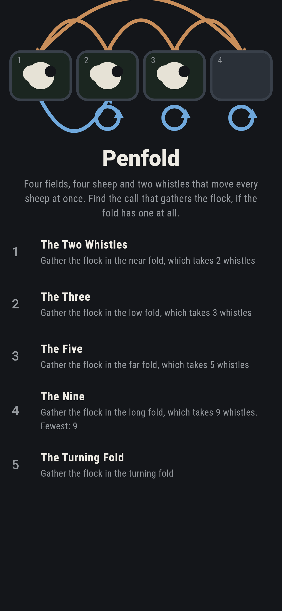
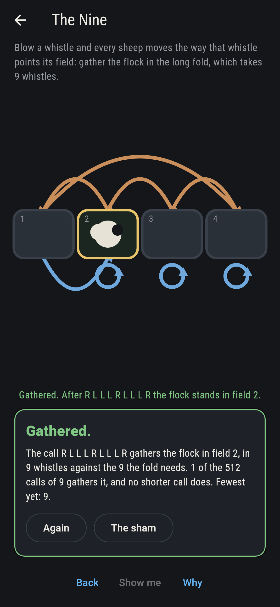
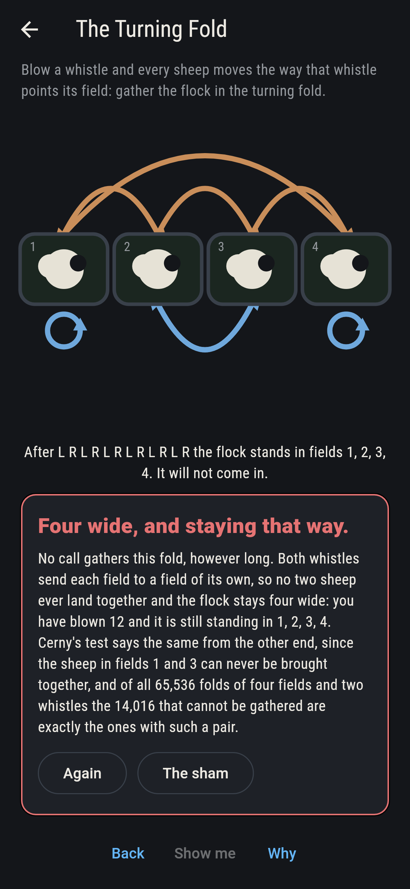
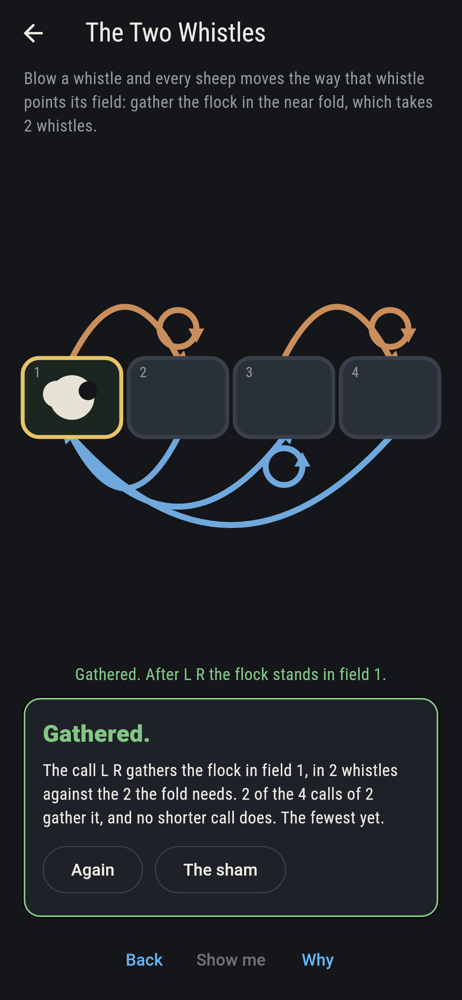
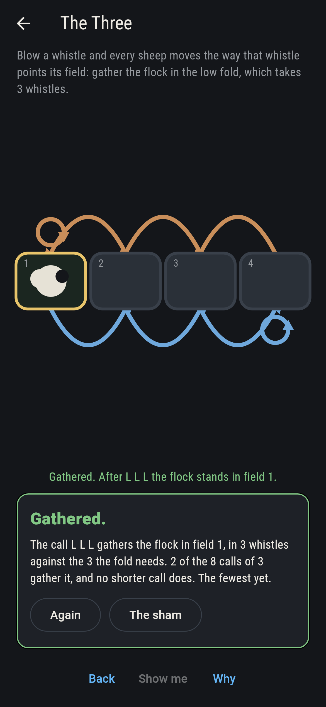
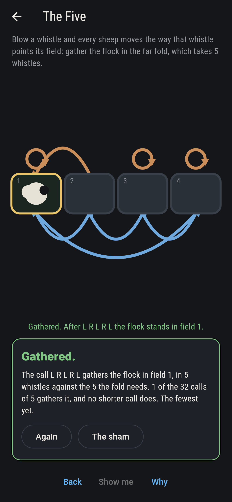
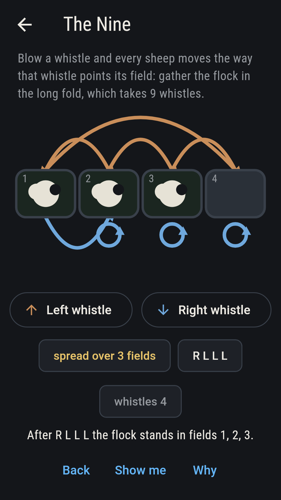
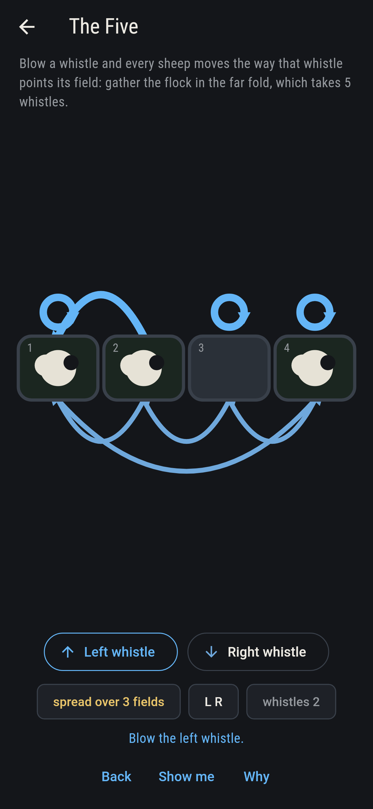
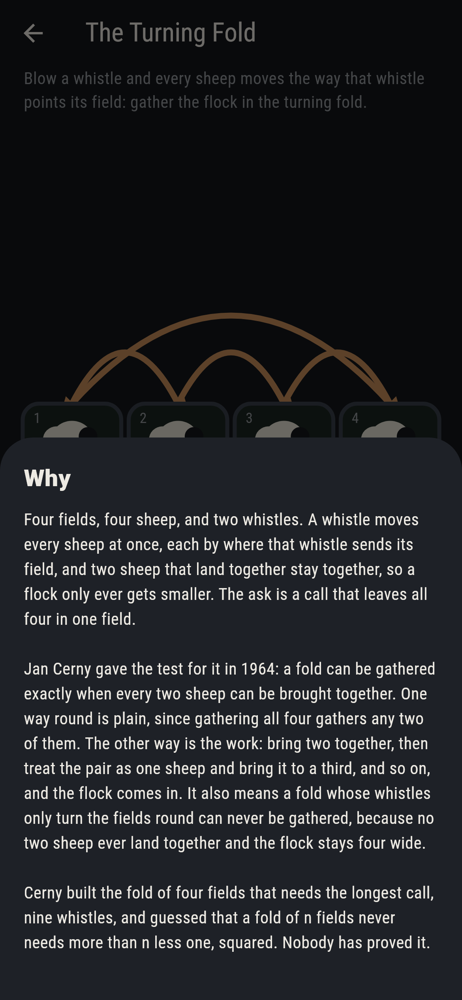

# Penfold


Four fields, four sheep and two whistles. A whistle moves every sheep
at once, each by where that whistle points its field, and two sheep
that land in the same field stay together from then on, so a flock
only ever gets smaller. The ask is a call, a string of whistles, that
leaves all four sheep in one field. Jan Cerny gave the test for it in
1964: a fold can be gathered exactly when every two sheep can be
brought together. One way round is plain, since gathering four gathers
any two of them; the other is the work, and it goes by bringing two
together, treating the pair as one sheep, and bringing that to a
third. Cerny also built the fold of four fields that needs the longest
call, nine whistles, and guessed that a fold of n fields never needs
more than n less one, squared. Nobody has proved it. For four fields
the game does not have to guess: it takes all 65,536 folds of four
fields and two whistles and walks every one of them.

## The asks

1. **The Two Whistles** - gather the flock in the near fold, which takes 2 whistles
2. **The Three** - gather the flock in the low fold, which takes 3 whistles
3. **The Five** - gather the flock in the far fold, which takes 5 whistles
4. **The Nine** - gather the flock in the long fold, which takes 9 whistles
5. **The Turning Fold** - gather the flock in the turning fold

Of the 65,536 folds, 51,520 can be gathered and 14,016 cannot. A
single whistle does it on 2,032 of them, and those are exactly the
folds where one whistle sends every field to the same one. None of the
51,520 needs more than nine whistles, and 96 need exactly nine; the
long fold the fourth ask uses is one of them, and only one call of the
512 of that length gathers it. The Turning Fold cannot be gathered at
all, and the reason is on the board: both its whistles send each field
to a field of its own, so no two sheep ever land together and the
flock stays four wide however long you whistle. There are 576 folds
like that, and all of them sit among the 14,016. Cerny's test says the
same from the other end, since the sheep in fields 1 and 3 can never
be brought together. The sham admits it after twelve whistles: a fold
of two turning whistles leaves the flock in the one standing it began
in, so there is nothing else to wait for.

## Two voices

Every number the game says out loud was worked out here rather than
guessed, and every fold is walked two ways:

* **Over the flock.** All sixteen ways a flock can stand are laid out,
  and the whistles are followed from the flock that fills every field
  until one field holds them all. That gives both whether a fold can be
  gathered and the fewest whistles it takes, which is what the pointer
  follows as you play.
* **Over the pairs.** This one never looks at more than two sheep at
  once. For each of the six pairs of fields it follows the whistles
  until the two sheep land together, and the fold passes only if every
  pair does. It gives no call and no length, only the answer to whether
  a call exists, which is what Cerny's theorem says it should.

The two agree on all 65,536 folds. The checker also holds the four
folds the asks use to their claimed lengths by trying every call
shorter than the one that works, and holds the turning fold to its
four-wide flock over every call of twelve whistles.

`tool/check_folds.dart` runs the lot and refuses the bake on any
disagreement.

## The checker's ledger

What `dart run tool/check_folds.dart` printed for the build this README
shipped with, word for word:

```
every fold of four fields and two whistles taken, 65,536 of them, and each one walked twice, once over the flock itself, all sixteen ways it can stand, and once over the pairs alone, which never looks at more than two sheep: the two agree on every fold, 51,520 of them gathering and 14,016 not; 2,032 folds are gathered by a single whistle, and those are exactly the folds where one whistle sends every field to the same one; none of the 51,520 needs more than 9, which is three squared, and 96 of them need exactly that: 2,032 at 1, 22,032 at 2, 17,616 at 3, 4,896 at 4, 3,072 at 5, 1,008 at 6, 528 at 7, 240 at 8, 96 at 9; the 576 folds whose whistles both turn the fields round without ever bringing two sheep together are all in the 14,016 that never gather, and however long the call the flock stays four wide; the four folds the asks use gather in 2 whistles for the near fold, 3 whistles for the low fold, 5 whistles for the far fold, 9 whistles for the long fold, and nothing shorter does

 1 The Two Whistles gather the flock in the near fold, which takes 2 whistles: 2 of the 4 calls of 2 whistles gather it, and no shorter call does
 2 The Three        gather the flock in the low fold, which takes 3 whistles: 2 of the 8 calls of 3 whistles gather it, and no shorter call does
 3 The Five         gather the flock in the far fold, which takes 5 whistles: 1 of the 32 calls of 5 whistles gathers it, and no shorter call does
 4 The Nine         gather the flock in the long fold, which takes 9 whistles: 1 of the 512 calls of 9 whistles gathers it, and no shorter call does
 5 The Turning Fold gather the flock in the turning fold: no call gathers it, and the two turning whistles say why
```

## Screenshots

| The sham | The nine | The turning fold |
| --- | --- | --- |
|  |  |  |

| The two whistles | The three | The five | Part way through the nine, on the small phone | Show me | The why |
| --- | --- | --- | --- | --- | --- |
|  |  |  |  |  |  |

Screenshots are drawn by `test/showcase_test.dart` at real phone sizes
with the app's own painter, then copied into `docs/` as they came out;
every whistle on an ask screen was blown by a tap on its button. The
fold across the top of the sham shot is the mark, and the logo and
every launcher icon come out of `test/mark_test.dart`, drawn by the
same painter: the mark is Cerny's own fold set four whistles into its
one call of nine, with the flock down to three fields, put there by
hand rather than tapped.

## Building

```
flutter test          # 42 tests, the asks and the screens
dart run tool/check_folds.dart   # the sweep of all 65,536, and the ledger
flutter build apk     # or: flutter build ios
```
