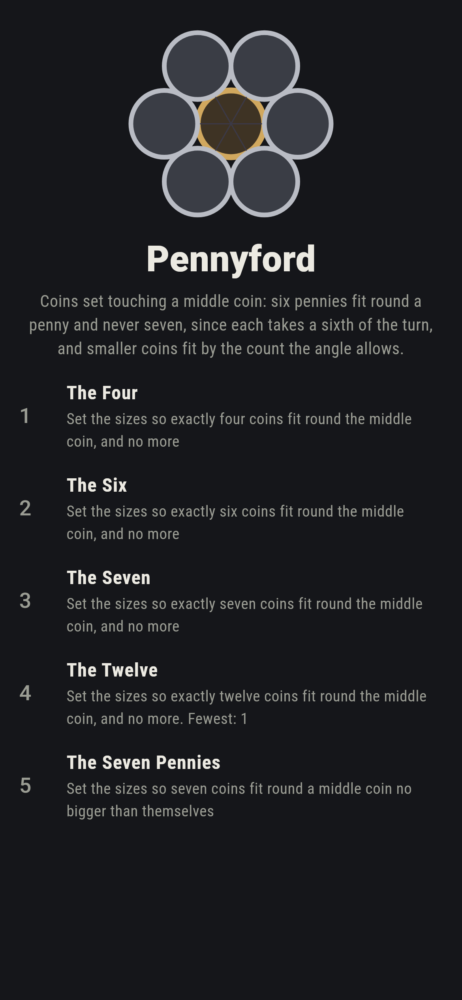
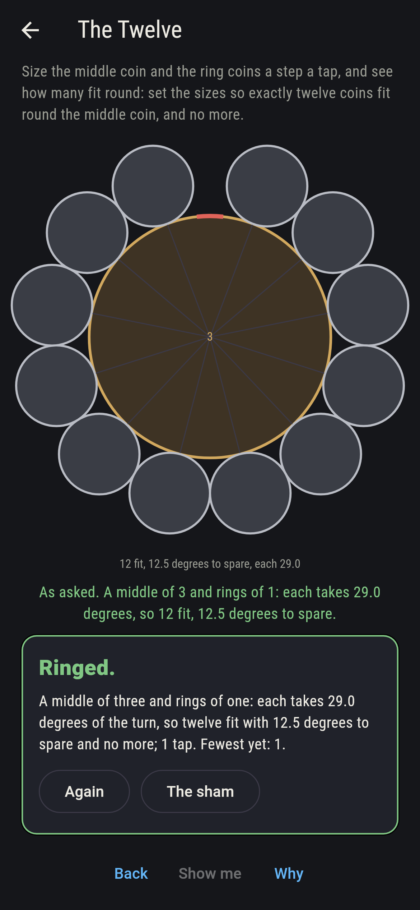
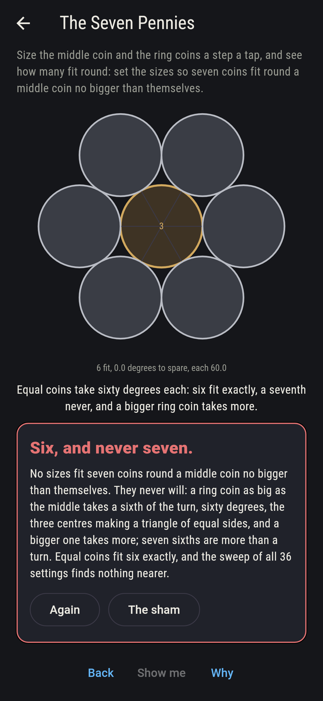
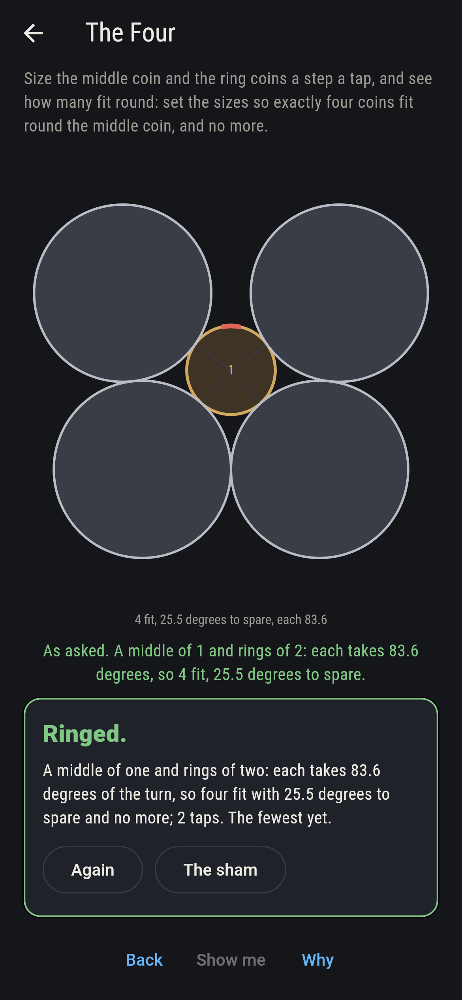
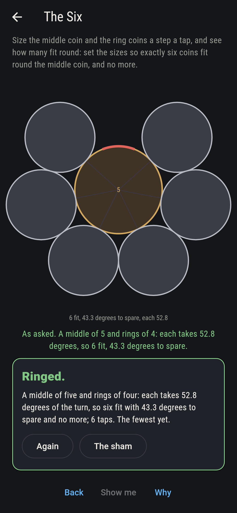
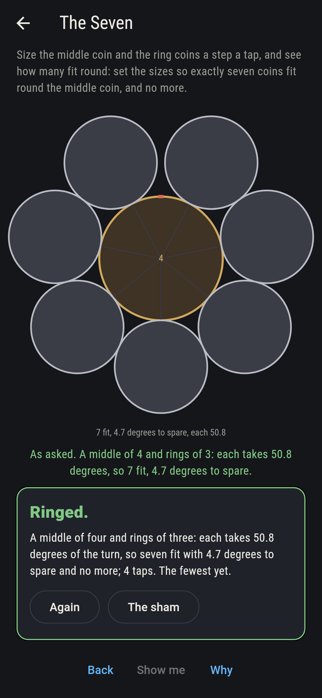
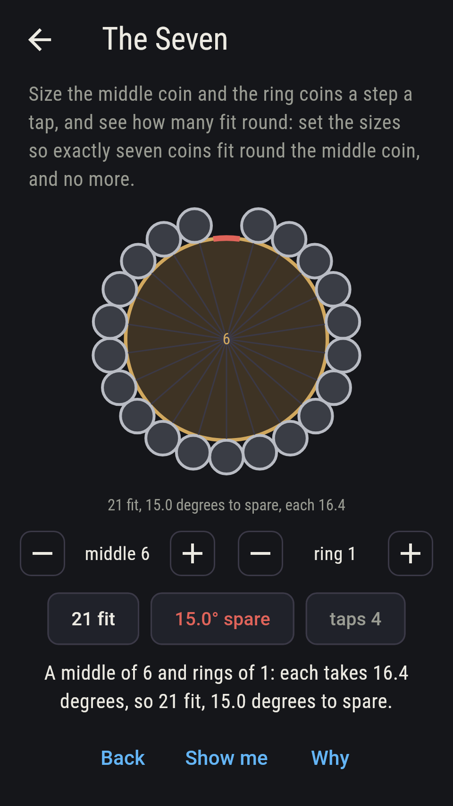
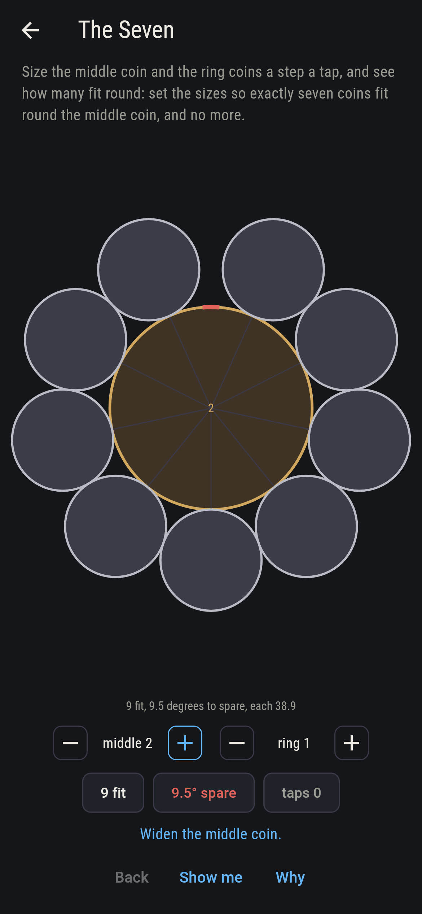
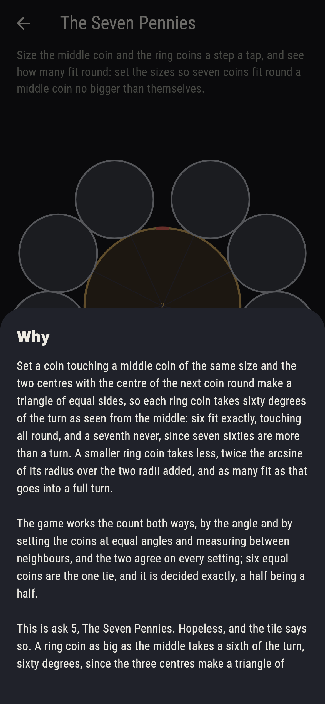

# Pennyford


Coins set touching a middle coin. Set a coin against a middle coin of
the same size and the two centres with the centre of the next coin
round make a triangle of equal sides, so each ring coin takes sixty
degrees of the turn as seen from the middle: six fit exactly,
touching all round, and a seventh never, since seven sixties are more
than a turn. Size the middle coin and the ring coins a step a tap,
one to six each, and see how many fit round: a smaller ring coin
takes less, twice the arcsine of its radius over the two radii added,
and as many fit as that goes into a full turn, twelve ones round a
three and twenty-one round a six. Every setting is worked both ways,
by the angle and by setting the coins at equal angles and measuring
between neighbours, and the two agree on all 36; six equal coins are
the one tie, and it is decided exactly.

## The asks

1. **The Four** - set the sizes so exactly four coins fit round the middle coin, and no more
2. **The Six** - set the sizes so exactly six coins fit round the middle coin, and no more
3. **The Seven** - set the sizes so exactly seven coins fit round the middle coin, and no more
4. **The Twelve** - set the sizes so exactly twelve coins fit round the middle coin, and no more
5. **The Seven Pennies** - set the sizes so seven coins fit round a middle coin no bigger than themselves

Four fit when the ring coins are bigger than the middle, six settings
of 36, twos round a one leaving 25.5 degrees to spare; six fit for
the six equal pairs with nothing to spare, and for fours round a five
and fives round a six with room left, eight settings; seven fit for
twos round a three, fours round a six and threes round a four, the
last with 4.7 degrees to spare, three settings, while fours round a
five are too big; twelve fit for ones round a three and twos round a
six, 12.5 degrees to spare, two settings; and ones round a six go
twenty-one times round, the most of any setting. The Seven Pennies
is labeled hopeless on its tile: a ring coin as big as the middle
takes a sixth of the turn and a bigger one takes more, and the sham
admits it the moment the player sets equal coins, six exactly.

## Two voices

The game never asserts what it has not computed, and it computes
everything at least twice:

* **The angle** is twice the arcsine of ring over middle plus ring,
  and as many coins fit as it goes into a full turn; six is the one
  count where the two sides can tie, equal coins touching all round,
  and it is decided exactly, ring over middle plus ring at most a
  half, since the sine of a turn over any other count from three up
  is irrational and cannot tie a fraction. Every count on the sham is
  this voice's, swept over all 36 settings.
* **The measure** sets the ring coins at equal angles round the middle
  and raises the count until two neighbours' centres come nearer than
  twice the ring's radius; it agrees with the angle on all 36, equal
  coins take 60.0 degrees to within a thousand-millionth, the spare is
  never negative and always under one coin's angle, and the count
  never falls as the middle grows or the ring shrinks.

`tool/check_rings.dart` runs the lot and refuses the bake on any
disagreement.

## The checker's ledger

What `dart run tool/check_rings.dart` printed for the build this
README shipped with, word for word:

```
every setting of the middle coin and the ring coins swept, one to six each, 36 settings, the count that fits worked by the angle, twice the arcsine of ring over middle plus ring into a full turn, and by the measure, the coins set at equal angles and neighbours held apart by twice the ring, and the two agree on all 36: equal coins take 60.0 degrees each to within a thousand-millionth, six fit with nothing to spare and a seventh never, and a ring coin no smaller than the middle never fits seven; four fit 6 ways, twos round a one with 25.5 degrees to spare; six fit 8 ways, the six equal pairs and fours round a five and fives round a six; seven fit 3 ways, twos round a three and fours round a six with 29.9 degrees to spare and threes round a four with 4.7, while fours round a five do not; twelve fit 2 ways, ones round a three and twos round a six with 12.5 to spare; and ones round a six fit twenty-one, the most of the 36, with 15.0 to spare

 1 The Four           set the sizes so exactly four coins fit round the middle coin, and no more: 6 of the 36 settings land it
 2 The Six            set the sizes so exactly six coins fit round the middle coin, and no more: 8 of the 36 settings land it
 3 The Seven          set the sizes so exactly seven coins fit round the middle coin, and no more: 3 of the 36 settings land it
 4 The Twelve         set the sizes so exactly twelve coins fit round the middle coin, and no more: 2 of the 36 settings land it
 5 The Seven Pennies  set the sizes so seven coins fit round a middle coin no bigger than themselves: none of the 36, and the sixty degrees said so first
```

## Screenshots

| The sham | The twelve | The seven pennies admitted |
| --- | --- | --- |
|  |  |  |

| The four | The six | The seven | Midway, on the small phone | Show me | The why |
| --- | --- | --- | --- | --- | --- |
|  |  |  |  |  |  |

Screenshots are drawn by `test/showcase_test.dart` at real phone
sizes with the app's own painter, then copied into `docs/` as they
came out; every ring in them was set by taps on the dials, so nothing
pictured is a setting the game could not reach. The logo and every
launcher icon come out of `test/mark_test.dart` the same way: the
mark is six pennies round a penny, touching all round.

## Building

```
flutter test          # 47 tests, the sweep among them
dart run tool/check_rings.dart
flutter build apk     # or: flutter build ios
```
