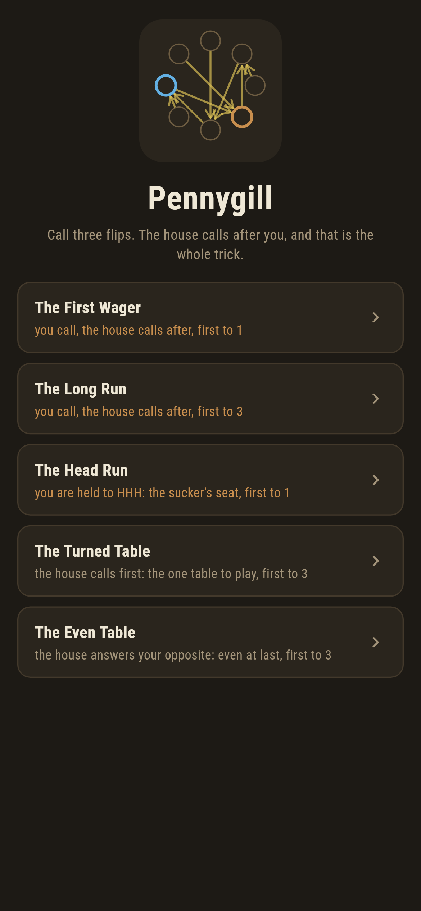
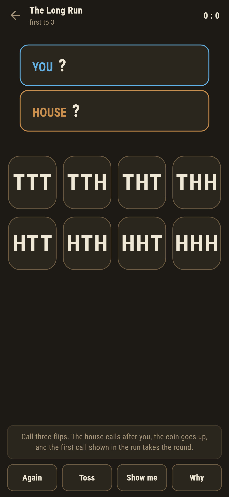
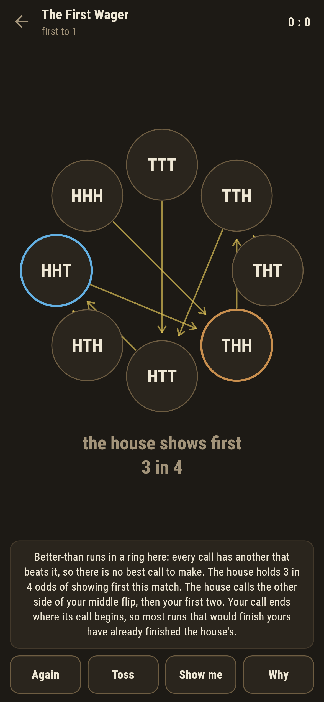
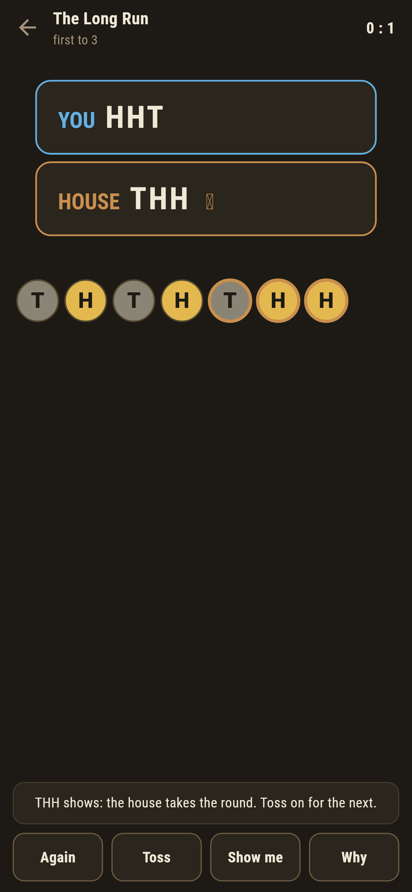
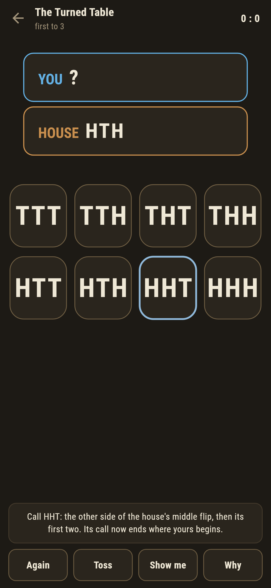
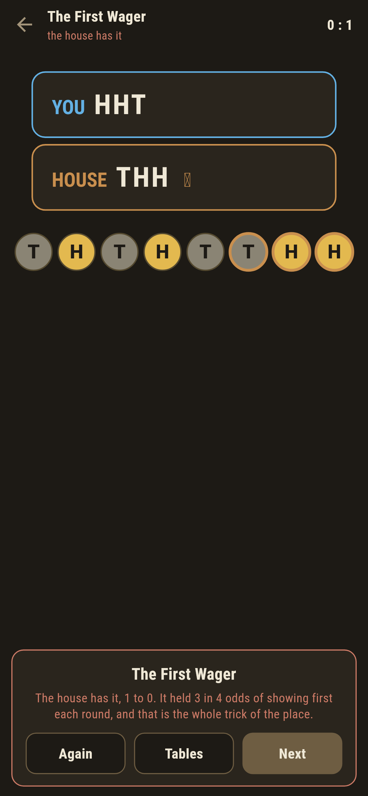

# Pennygill

A coin-calling game for phones, in Flutter, for Android and iOS.

The old bar bet. You call three flips, heads or tails; the house calls
its three after you; the coin goes up until one call shows in the run.
The house wins at two to one or better whatever you call, and the game's
whole business is showing you exactly why, then sitting you in the other
chair.

| | | | |
|---|---|---|---|
|  |  |  |  |

## There is no best call

Better-than runs in a ring here: HTT loses to HHT, which loses to THH,
which loses to TTH, which loses to HTT. Every call has a beater, so
calling first is the mistake and nothing you call can fix it. **Why**
draws the ring, all eight calls with an arrow from each to the call that
beats it, which is the picture of a game with no best move.

The house's rule is one line: the other side of your middle flip, then
your first two. Your call then ends where the house's begins, so most
runs that would finish yours have already finished the house's.

## Two reckonings, held together

The odds are computed two ways that share nothing. Conway's way counts
how the tail ends of one call lie over the front ends of the other and
reads the yes-noes as binary; it looks like numerology and is exact. The
long way walks the states of the flipping and solves their equations in
exact whole-number ratios. `make board` lays them over each other on all
56 pairs before printing the board:

```
$ make board
Conway and the walk agree on all 56 pairs of calls

TTT  the house calls HTT  and shows first 7 in 8
TTH  the house calls HTT  and shows first 3 in 4
THT  the house calls TTH  and shows first 2 in 3
THH  the house calls TTH  and shows first 2 in 3
HTT  the house calls HHT  and shows first 2 in 3
HTH  the house calls HHT  and shows first 2 in 3
HHT  the house calls THH  and shows first 3 in 4
HHH  the house calls THH  and shows first 7 in 8

the turned-over reply is exactly even on all eight calls
```

## The other chair, and the one fair table

The Turned Table swaps the seats: the house has called, you reply, and
Show me gives you the rule that has been beating you all evening. The
Head Run holds you to three heads, seven to one against, the classic
sucker's seat felt from inside. And the Even Table is the one honest
reply the house can make, your call turned over, heads for tails: swap
every coin in the world and the two calls trade places, so neither can
be the better, and the suite checks the evenness on all eight calls.



Every settled match owns its odds on the card, including the wins you
had no business winning: luck, and you should know it.



## Building

```
make deps    # fetch packages
make check   # analyze + every test
make board   # both reckonings on every pair, then the whole board
make shots   # render the screenshots and redraw the icons
make apk     # Android release build
make ios     # iOS release build (unsigned)
```

The logo and every app icon are drawn by the game's own painter in
`test/mark_test.dart`. There is no image in this repository that was not
produced by code in it.

## How it is put together

```
lib/toss/call.dart      a call, and the house's one-line reply
lib/toss/odds.dart      Conway's counts, and the exact walk
lib/toss/wager.dart     a table: who calls when, for how many rounds
lib/toss/wagers.dart    the five tables that ship
lib/toss/play.dart      a match: calls, flips, rounds; the coin stays
                        outside, handed in flip by flip
lib/ui/                 the painter, the screens, the mark
tool/check_wagers.dart  the board above
```

The tests hold Conway against the walk on every ordered pair, check the
reply beats all eight calls, walk the beating ring leg by leg, pin the
worst call at seven in eight and the turned-over reply at exactly even,
and hold the pictures against the real widget tree. If any of that
drifts, `make check` goes red before anything leaves the machine.
