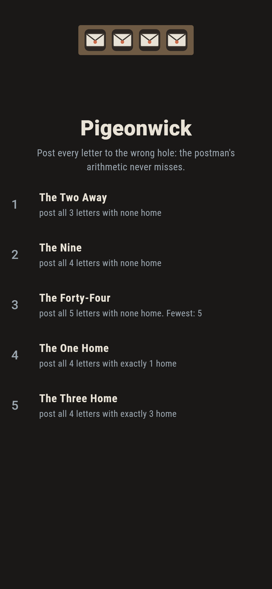
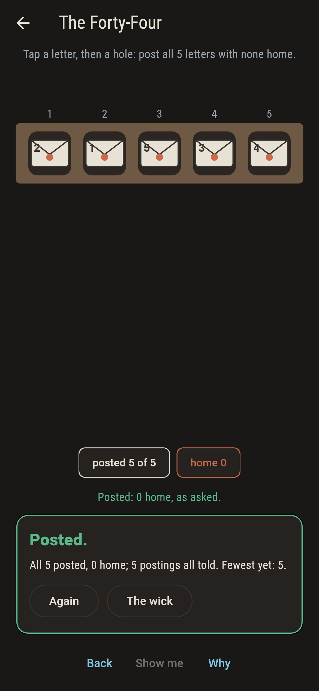
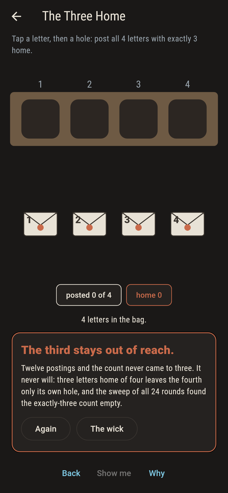
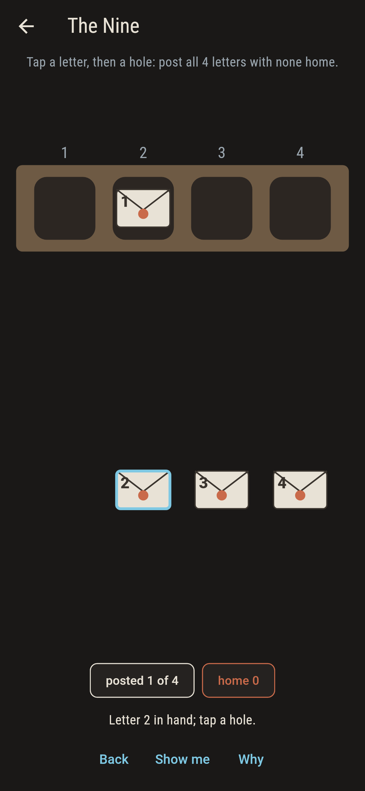
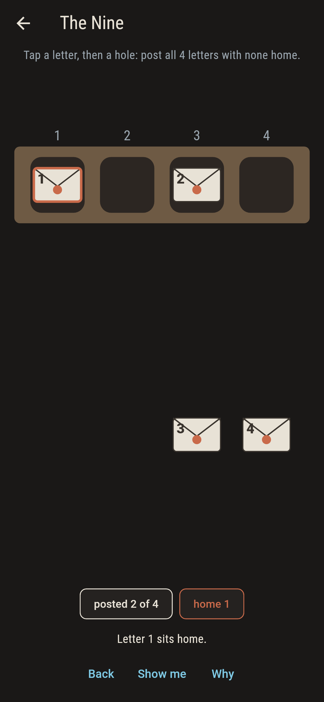
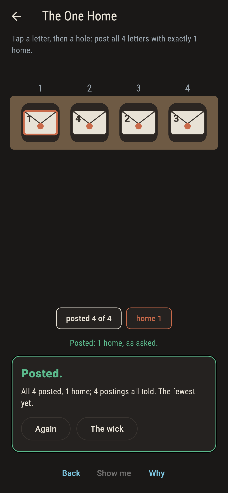
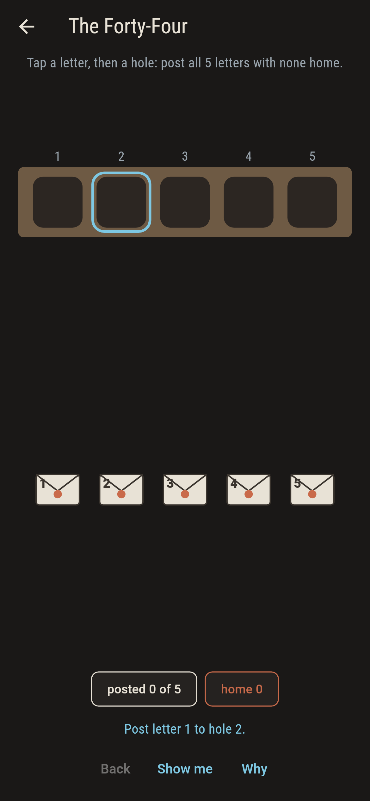
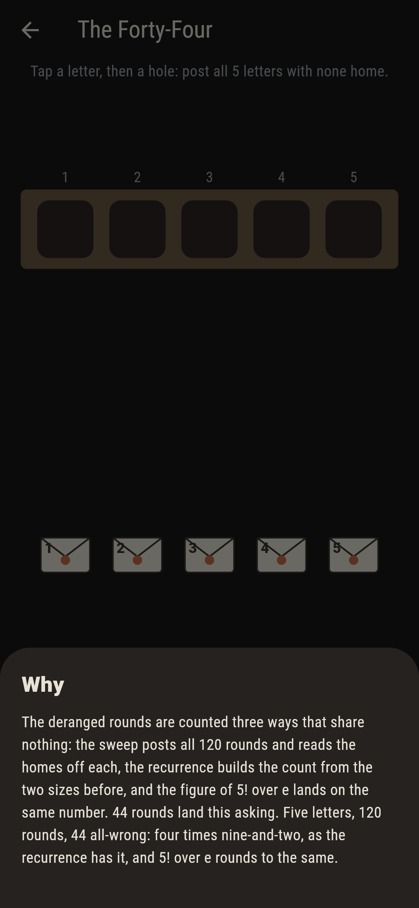

# Pigeonwick


Letters and pigeonholes, one of each to a cottage, and a postman
with a grudge: the asking is usually that no letter goes home.
The all-wrong rounds are the derangements, and their counts, 2, 9
and 44, come out of three computations that share nothing and
never disagree. One asking cannot be met at all, and the reason
is one hole long.

## The rounds

1. **The Two Away** - post all 3 letters with none home
2. **The Nine** - post all 4 letters with none home
3. **The Forty-Four** - post all 5 letters with none home
4. **The One Home** - post all 4 letters with exactly 1 home
5. **The Three Home** - post all 4 letters with exactly 3 home

The spread of four runs 9, 8, 6, none, 1: nine all-wrong, eight
with one home, six with two, exactly one with everything home,
and none at all with exactly three, since three letters home
leave the fourth only its own hole. One shy of all home is
nobody's round at any size, and the checker holds that at three,
four and five.

## Three voices

The game never asserts what it has not computed, and it computes
everything three ways:

* **The sweep** posts every full round, 6 and 24 and 120 by
  size, and reads the homes off each.
* **The recurrence** builds each deranged count from the two
  before it: n less one, times the pair.
* **The figure by e** computes n! over e in exact integers by
  the alternating sum, and lands on the same 2, 9 and 44.

`tool/check_rounds.dart` runs the lot and refuses the bake on
any disagreement.

## The checker's ledger

What `dart run tool/check_rounds.dart` printed for the build this
README shipped with, word for word:

```
every round of the post swept, 6 and 24 and 120 by size: the deranged counts 2, 9 and 44 come out of the sweep, the recurrence and the figure by e alike, the spread of four runs 9, 8, 6, none, 1, and one shy of all home is nobody's round at any size

 1 The Two Away       post all 3 letters with none home: 2 rounds of the sweep land it
 2 The Nine           post all 4 letters with none home: 9 rounds of the sweep land it
 3 The Forty-Four     post all 5 letters with none home: 44 rounds of the sweep land it
 4 The One Home       post all 4 letters with exactly 1 home: 8 rounds of the sweep land it
 5 The Three Home     post all 4 letters with exactly 3 home: none of the 24, since three home leaves the fourth only its own hole
```

## Screenshots

| The wick | The forty-four posted | The three home admitted |
| --- | --- | --- |
|  |  |  |

| A letter in hand | A letter home | The one home | Show me | The why |
| --- | --- | --- | --- | --- |
|  |  |  |  |  |

Screenshots are drawn by `test/showcase_test.dart` at real phone
sizes with the app's own painter, then copied into `docs/` as
they came out; every letter in them was posted by taps, so
nothing pictured is a round the game could not reach. The logo
and every launcher icon come out of `test/mark_test.dart` the
same way: the mark is one of the nine.

## Building

```
flutter test          # 47 tests, the sweep among them
dart run tool/check_rounds.dart
flutter build apk     # or: flutter build ios
```
