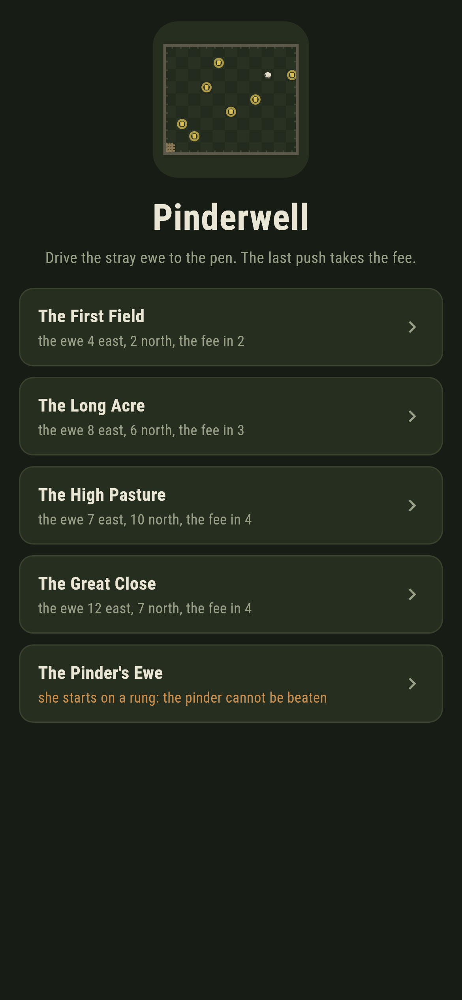
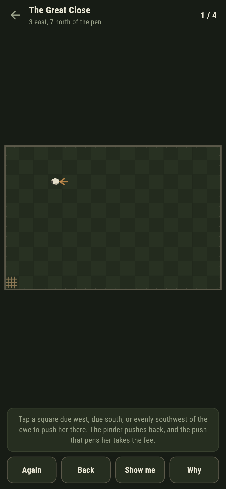
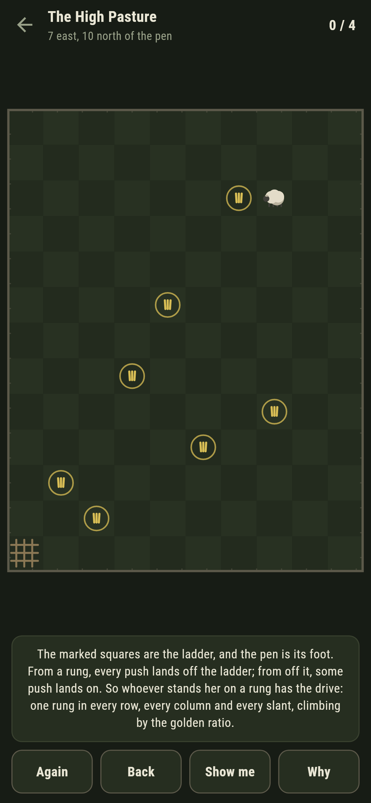
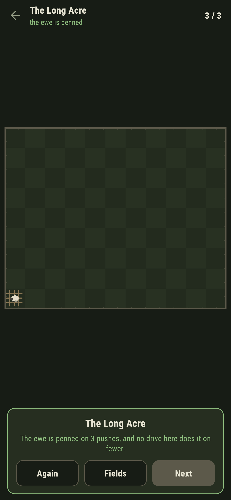
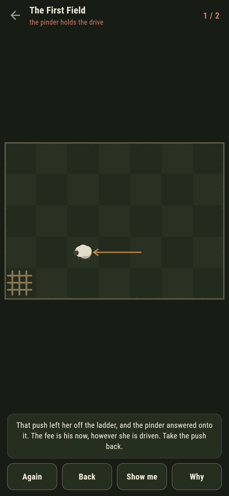
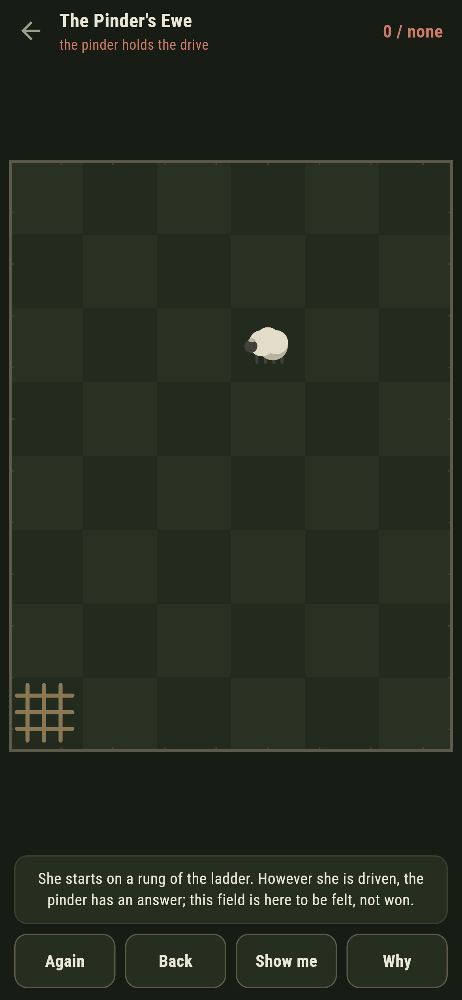

# Pinderwell

A drive-the-ewe game for phones, in Flutter, for Android and iOS.

A stray ewe stands in a walled field, so many paces east and north of the
pen in the corner. You and the pinder push her in turn: any number of paces
due west, due south, or the same number of both, the ways a ewe actually
gives ground. The push that puts her in the pen takes the fee.

| | | | |
|---|---|---|---|
|  |  |  |  |

## The safe squares are golden

This is Wythoff's game, and the whole of it hangs on a ladder of safe
squares. Stand the ewe on a rung and your opponent is lost: every push from
a rung lands off the ladder, and from off the ladder some push always lands
back on, all the way down to the pen at its foot.

The game builds the ladder two ways that know nothing of each other. The
sweep plays backwards from the pen, marking each square cold when no push
from it reaches a cold one. The ladder builds pairs with no game in sight:
rung by rung, the smallest count of paces not yet in any pair, put with
itself plus the rung's number. The anchor test lays the two over each other
on every one of the 3,721 squares of a sixty-pace field:

```
$ make fields
sweep and ladder agree on every square of a sixty-pace field: 47 cold

 1 The First Field   ewe  4 east  2 north  fewest 2  written down 2
 2 The Long Acre     ewe  8 east  6 north  fewest 3  written down 3
 3 The High Pasture  ewe  7 east 10 north  fewest 4  written down 4
 4 The Great Close   ewe 12 east  7 north  fewest 4  written down 4
 5 The Pinder's Ewe  ewe  3 east  5 north  the pinder cannot be beaten  written down none
```

A third voice is checked on top rather than cited: the smaller pace count
of rung n is the floor of n times the golden ratio, and a test holds the
ladder against that for every rung to two hundred paces. **Why** marks the
rungs on the grass in front of you, one in every row, every column and
every slant, which is the shape that makes them checkable by eye.


## The pinder plays perfectly

Push the ewe onto a rung and the pinder gives all the ground he can, which
is how the par is defined: the fewest pushes of your own that force the
pen against the most stubborn delay there is. Every par above was worked
out by the search before it was written down.

Push her anywhere else and he answers onto the ladder at once, and the
game does not let it pass quietly: the ledger goes red the moment his
answer lands, and the words under the field say the fee is his now and
offer the push back. Nothing is lost but the walk.



## One field cannot be won

The Pinder's Ewe starts three east and five north, which is the third rung
of the ladder. However she is driven, the pinder has an answer back onto
it, and the label on the list says so before you open it. It ships in the
house tradition of maps nobody can win: the way to believe a safe square
is to stand on one and lose.



## Building

```
make deps    # fetch packages
make check   # analyze + every test
make fields  # prove the ladder two ways, walk the shipped drives
make shots   # render the screenshots and redraw the icons
make apk     # Android release build
make ios     # iOS release build (unsigned)
```

The logo and every app icon are drawn by the game's own painter in
`test/mark_test.dart`. There is no image in this repository that was not
produced by code in it.

## How it is put together

```
lib/drive/field.dart    a field: where the ewe starts, what the fee costs
lib/drive/cold.dart     the sweep, the ladder, pars, and the pinder's play
lib/drive/fields.dart   the five fields that ship
lib/drive/play.dart     a drive in progress: pushes, answers, the live fee
lib/ui/                 the painter, the screens, the mark
tool/check_fields.dart  the ledger above
```

The tests hold the sweep against the ladder square by square, the ladder
against the golden ratio rung by rung, every written-down par against the
search, the pinder against thirty random drives of the hopeless field, and
the pictures against the real widget tree. If any of that drifts,
`make check` goes red before anything leaves the machine.
