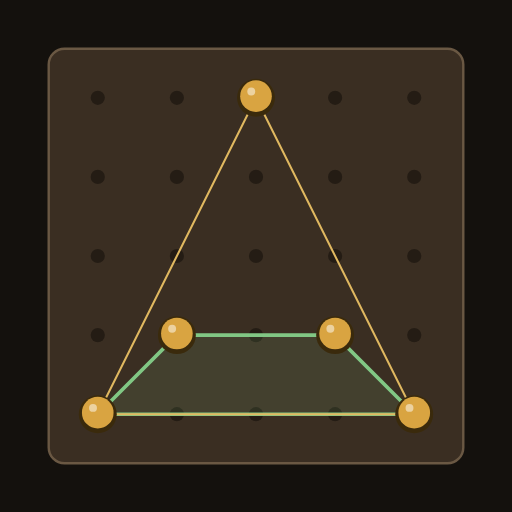
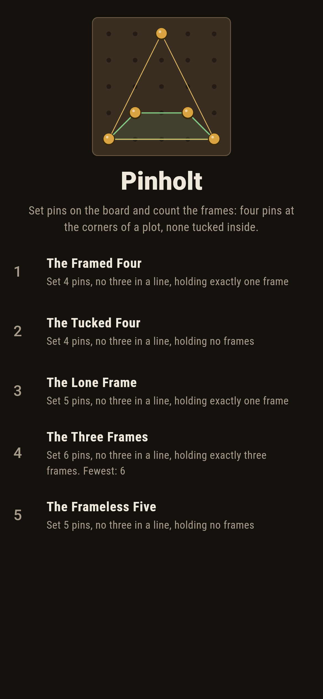
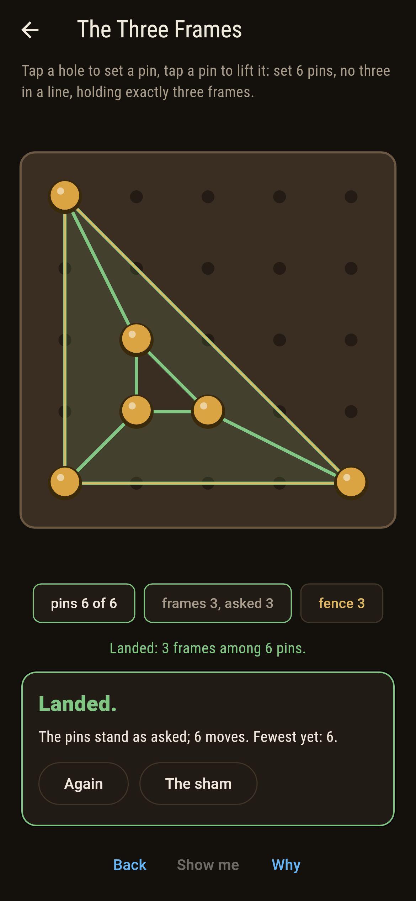
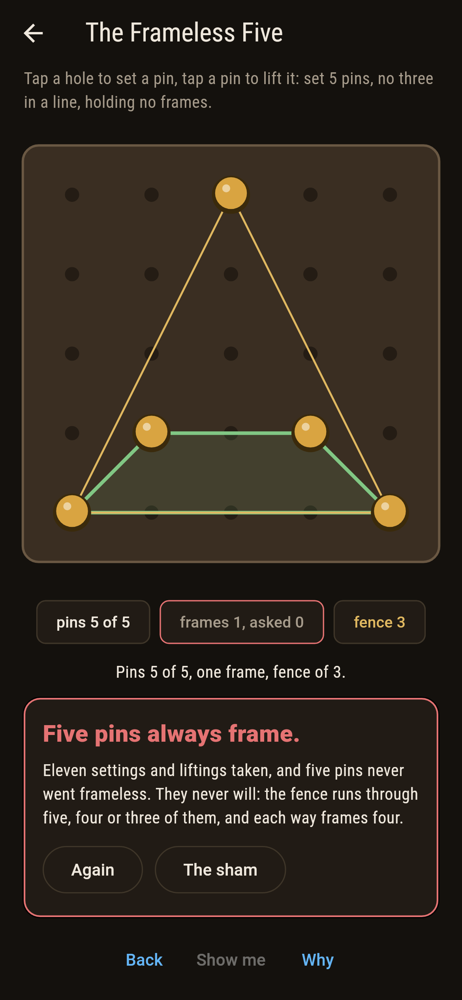
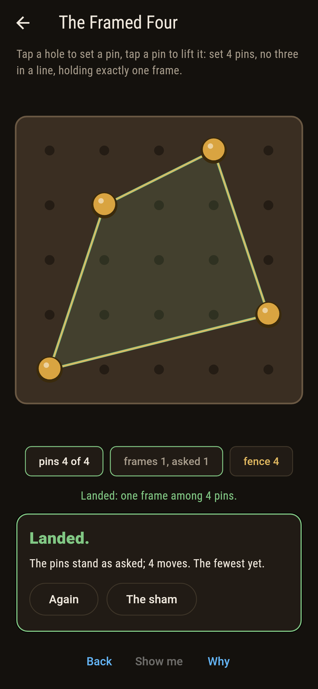
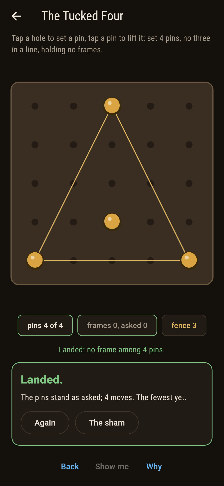
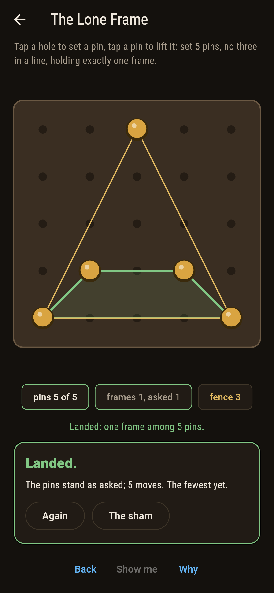
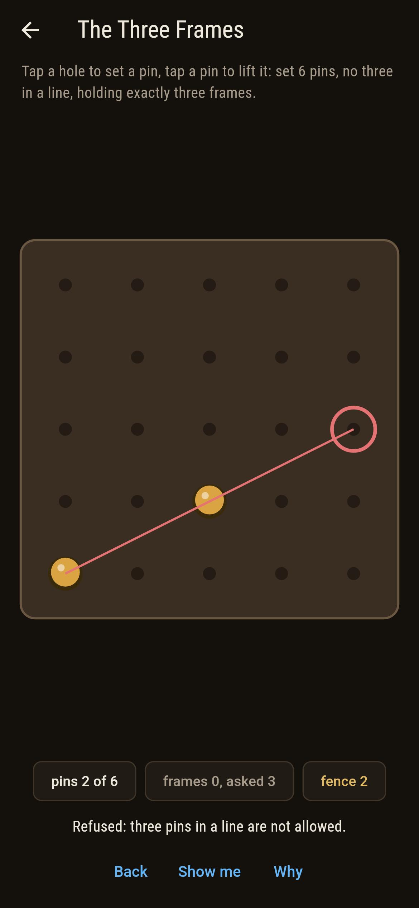
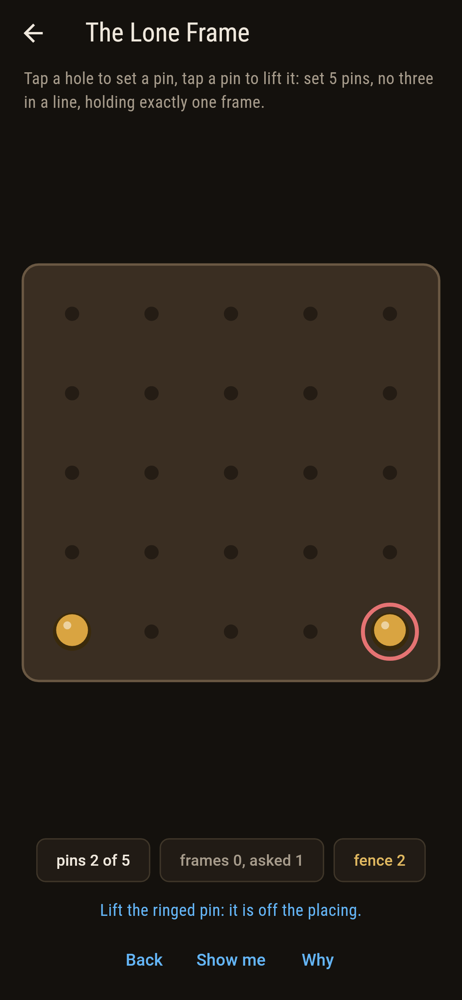
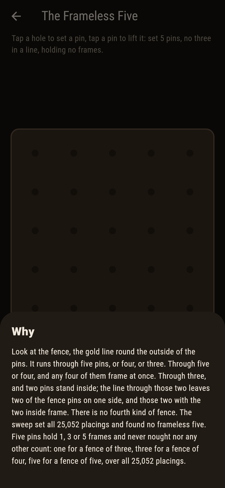

# Pinholt



Pins in the holes of a five-by-five board, never three in a line.
Four pins make a frame when they stand at the corners of a
four-sided plot with none of them tucked inside the other three.
Esther Klein saw in 1933 that five pins always hold a frame,
whatever the board, and Erdos and Szekeres made a theory of it.
The fence round the pins tells the story: it runs through five of
them, or four, or three, and each way hands over a frame. Six
pins hold three frames at the least.

## The plots

1. **The Framed Four** - set 4 pins, no three in a line, holding exactly one frame
2. **The Tucked Four** - set 4 pins, no three in a line, holding no frames
3. **The Lone Frame** - set 5 pins, no three in a line, holding exactly one frame
4. **The Three Frames** - set 6 pins, no three in a line, holding exactly three frames
5. **The Frameless Five** - set 5 pins, no three in a line, holding no frames

Four pins frame in 7,398 placings and go frameless in 2,100.
Five pins hold one frame in 624 placings, three in 12,800 and
five in 11,628, and that is every placing there is: 1, 3 or 5,
by a fence of three, four or five. Six pins hold three frames in
12 placings of the 36,698 and never fewer. The Frameless Five is
labeled hopeless on its tile, and the why walks the fence.

## Two voices

The game never asserts what it has not computed, and it computes
everything at least twice:

* **The census** reads every four of the pins for a frame, by the
  turns round its fence, and the sweep sets every placing of four,
  five and six pins with no three in a line, 9,498 and 25,052 and
  36,698 of them, and counts.
* **The fence** alone, with no fours read, gives four pins one
  frame or none and five pins five, three or one, and agrees with
  the census on every placing; the lone frame of a fence of three
  is built as the theorem builds it, the two pins inside with the
  two fence pins on one side of their line, and is a frame for
  every one of the 624.

`tool/check_frames.dart` runs the lot and refuses the bake on any
disagreement.

## The checker's ledger

What `dart run tool/check_frames.dart` printed for the build this
README shipped with, word for word:

```
every placing of four, five and six pins set with no three in a line, 9,498 and 25,052 and 36,698 of them, and every four of every placing read for a frame: four pins frame 7,398 ways and go frameless 2,100, five pins hold 1, 3 or 5 frames by their fence of three, four or five and never nought, the lone frame of a fence of three built for all 624, and six pins hold three frames at the fewest, in 12 placings, and fifteen at the most

 1 The Framed Four     set 4 pins, no three in a line, holding exactly one frame: 7,398 placings of the 9,498 land it
 2 The Tucked Four     set 4 pins, no three in a line, holding no frames: 2,100 placings of the 9,498 land it
 3 The Lone Frame      set 5 pins, no three in a line, holding exactly one frame: 624 placings of the 25,052 land it
 4 The Three Frames    set 6 pins, no three in a line, holding exactly three frames: 12 placings of the 36,698 land it
 5 The Frameless Five  set 5 pins, no three in a line, holding no frames: none of the 25,052, and the fence said so first
```

## Screenshots

| The sham | The three frames landed | The frameless five admitted |
| --- | --- | --- |
|  |  |  |

| The framed four | The tucked four | The lone frame | A hole refused | Show me | The why |
| --- | --- | --- | --- | --- | --- |
|  |  |  |  |  |  |

Screenshots are drawn by `test/showcase_test.dart` at real phone
sizes with the app's own painter, then copied into `docs/` as they
came out; every pin in them was set by a tap, so nothing pictured
is a board the game could not reach. The logo and every launcher
icon come out of `test/mark_test.dart` the same way: the mark is
five pins with a fence of three and the lone frame inside.

## Building

```
flutter test          # 48 tests, the sweep among them
dart run tool/check_frames.dart
flutter build apk     # or: flutter build ios
```
