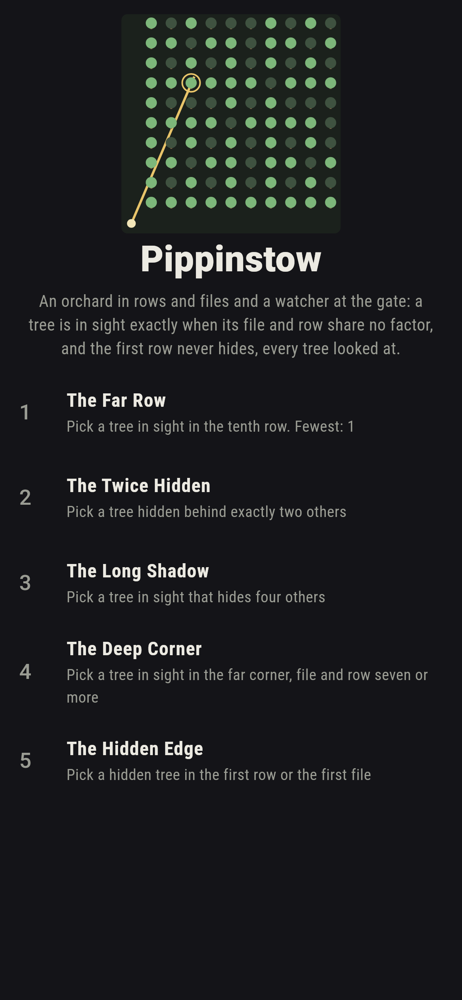
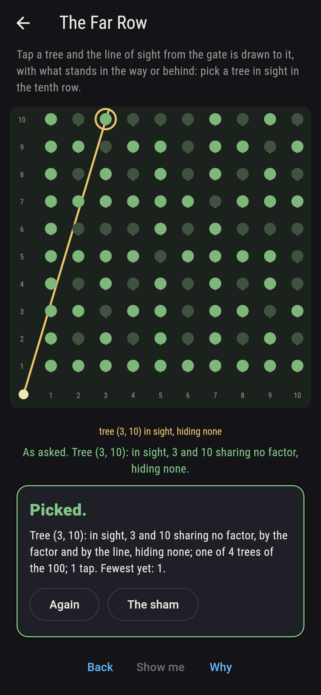
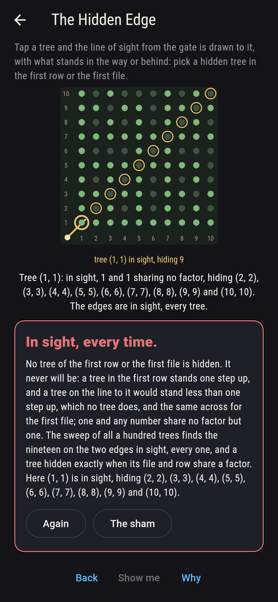
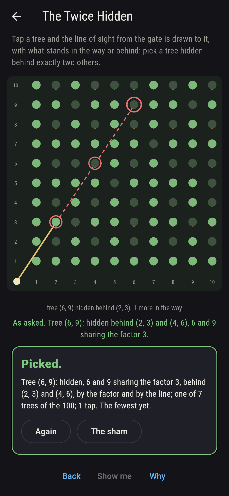
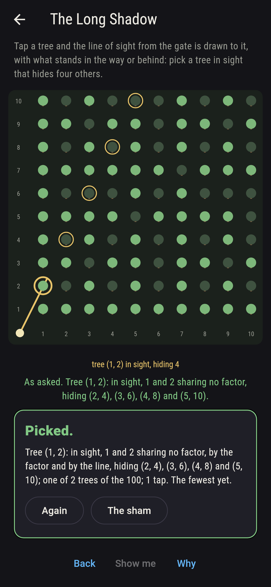
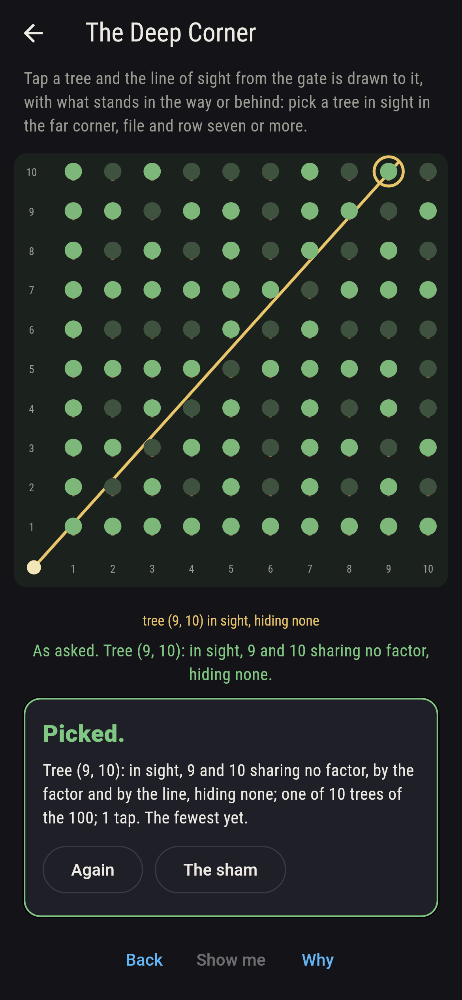
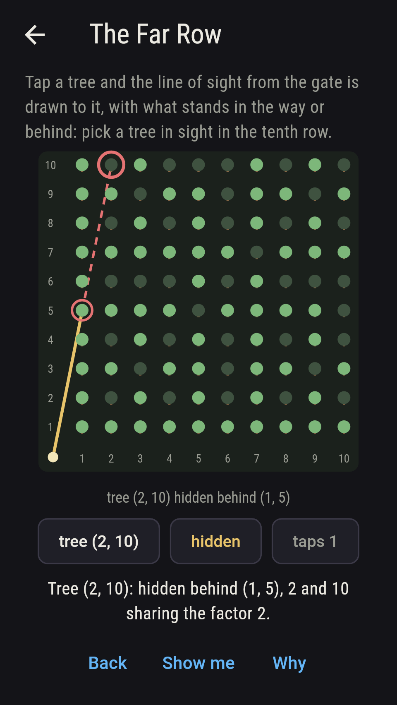
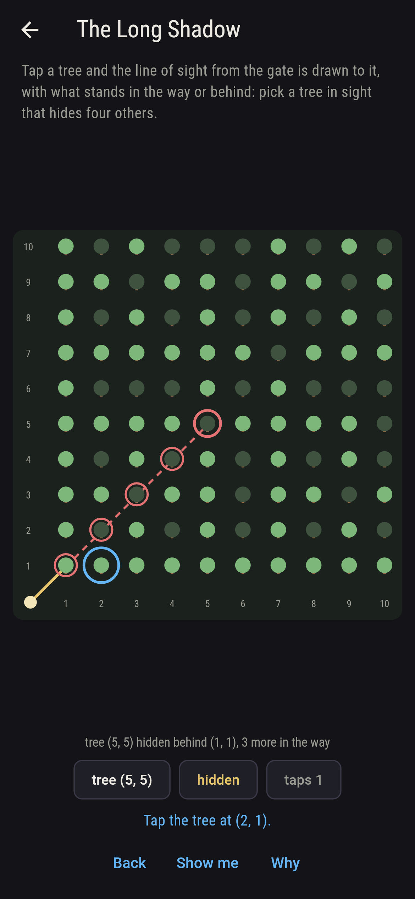
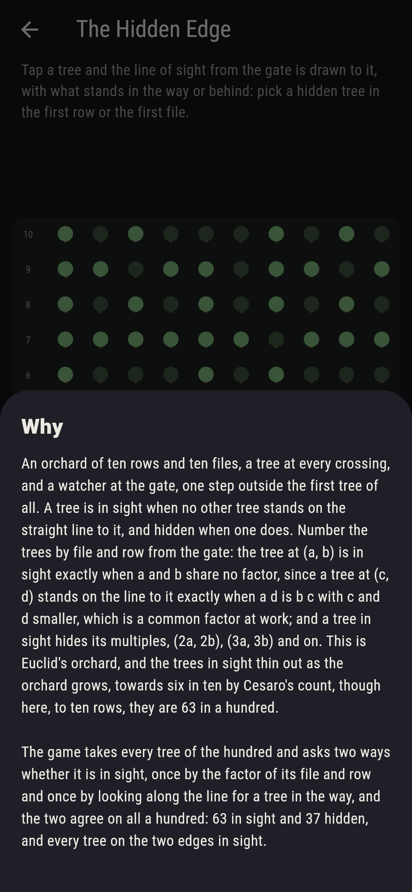

# Pippinstow


An orchard of ten rows and ten files, a tree at every crossing, and a
watcher at the gate, one step outside the first tree of all. A tree
is in sight when no other tree stands on the straight line to it,
and hidden when one does. Number the trees by file and row from the
gate: the tree at (a, b) is in sight exactly when a and b share no
factor, since a tree at (c, d) stands on the line to it exactly when
a d is b c with c and d smaller, which is a common factor at work;
and a tree in sight hides its multiples, (2a, 2b), (3a, 3b) and on.
This is Euclid's orchard, and the trees in sight thin out as the
orchard grows, towards six in ten by Cesaro's count, though here, to
ten rows, they are 63 in a hundred. Tap a tree and the line of sight
from the gate is drawn to it, with what stands in the way or behind.
The game takes every tree of the hundred and asks two ways whether
it is in sight, once by the factor of its file and row and once by
looking along the line for a tree in the way, and the two agree on
all a hundred: 63 in sight and 37 hidden, and every tree on the two
edges in sight.

## The asks

1. **The Far Row** - pick a tree in sight in the tenth row
2. **The Twice Hidden** - pick a tree hidden behind exactly two others
3. **The Long Shadow** - pick a tree in sight that hides four others
4. **The Deep Corner** - pick a tree in sight in the far corner, file and row seven or more
5. **The Hidden Edge** - pick a hidden tree in the first row or the first file

Of the ten trees in the tenth row four are in sight, at files 1, 3,
7 and 9, the files that share no factor with ten. A tree hidden
behind exactly two others has file and row three times a pair that
share no factor: seven trees, (3, 3), (3, 6), (3, 9), (6, 3), (6,
9), (9, 3) and (9, 6); nineteen trees are hidden behind one, three
behind three, and (10, 10) behind nine. A tree in sight hides its
multiples: (1, 2) hides (2, 4), (3, 6), (4, 8) and (5, 10), and (2,
1) the same turned about, the two trees that hide four; (1, 1)
alone hides nine, and 44 of the 63 in sight hide none. Of the
sixteen trees with file and row seven or more, ten are in sight and
six hidden, each behind a nearer tree on its line. The Hidden Edge
is labeled hopeless on its tile: a tree one step up has nothing on
the line to it, since anything there would stand less than one step
up, and the same across; the sham admits it after three edge trees
have shown themselves in sight, or after twelve taps.

## Two voices

The game never asserts what it has not computed, and it computes
everything at least twice:

* **The factor** takes a tree's file and row and asks whether they
  share a factor: none, and the tree is in sight; a factor g, and it
  is hidden, behind the tree at a gth of its file and row and g - 1
  trees in all. Every count on the sham is that asking's.
* **The line** shares no factors: it looks along the straight line
  from the gate to the tree for another tree standing on it short of
  the tree, one by one over the whole orchard, and agrees with the
  factor on all a hundred trees, the trees it finds in the way being
  exactly the factor's fractions.

`tool/check_sights.dart` runs the lot and refuses the bake on any
disagreement.

## The checker's ledger

What `dart run tool/check_sights.dart` printed for the build this
README shipped with, word for word:

```
every tree of the hundred looked at two ways, by the factor of its file and row and along the line from the gate for a tree in the way, the two agreeing on all a hundred: 63 in sight and 37 hidden, 19 of those behind one tree, 7 behind two, 3 behind three, 3 behind four and one each behind five, six, seven, eight and nine, every hidden tree fronted by the nearest tree on its line and that one in sight; every tree of the two edges in sight, nineteen; (1, 1) hides nine, (1, 2) and (2, 1) four each, four trees hide two, twelve hide one and 44 hide none; the tenth row holds four in sight, at files 1, 3, 7 and 9, and the far corner ten of its sixteen

 1 The Far Row      pick a tree in sight in the tenth row: 4 of the 100 trees land it
 2 The Twice Hidden pick a tree hidden behind exactly two others: 7 of the 100 trees land it
 3 The Long Shadow  pick a tree in sight that hides four others: 2 of the 100 trees land it
 4 The Deep Corner  pick a tree in sight in the far corner, file and row seven or more: 10 of the 100 trees land it
 5 The Hidden Edge  pick a hidden tree in the first row or the first file: none of the 100, and the first step said so first
```

## Screenshots

| The sham | The far row | The hidden edge admitted |
| --- | --- | --- |
|  |  |  |

| The twice hidden | The long shadow | The deep corner | Midway, on the small phone | Show me | The why |
| --- | --- | --- | --- | --- | --- |
|  |  |  |  |  |  |

Screenshots are drawn by `test/showcase_test.dart` at real phone
sizes with the app's own painter, then copied into `docs/` as they
came out; every tree in them was picked by a tap, so nothing pictured
is a pick the game could not reach. The logo and every launcher icon
come out of `test/mark_test.dart` the same way: the mark is the
orchard, its trees in sight and hidden, and the line of sight from
the gate to the tree at (3, 7).

## Building

```
flutter test          # 44 tests, the sweep among them
dart run tool/check_sights.dart
flutter build apk     # or: flutter build ios
```
