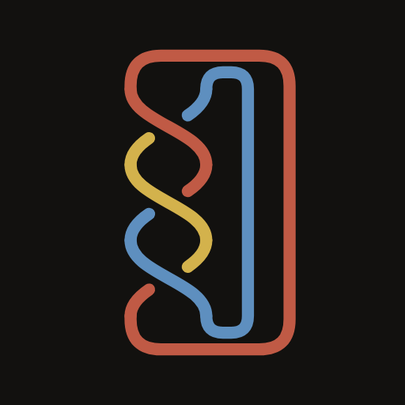
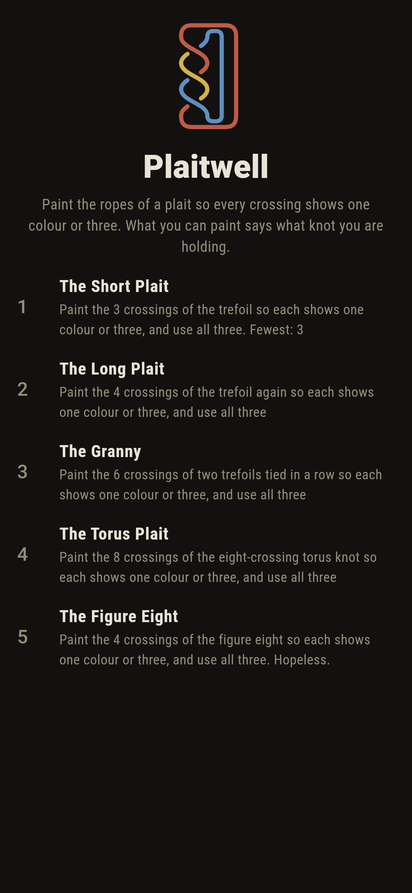
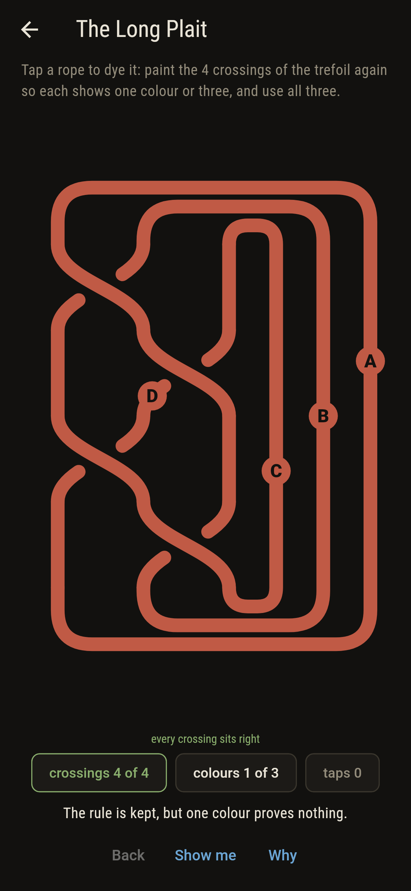
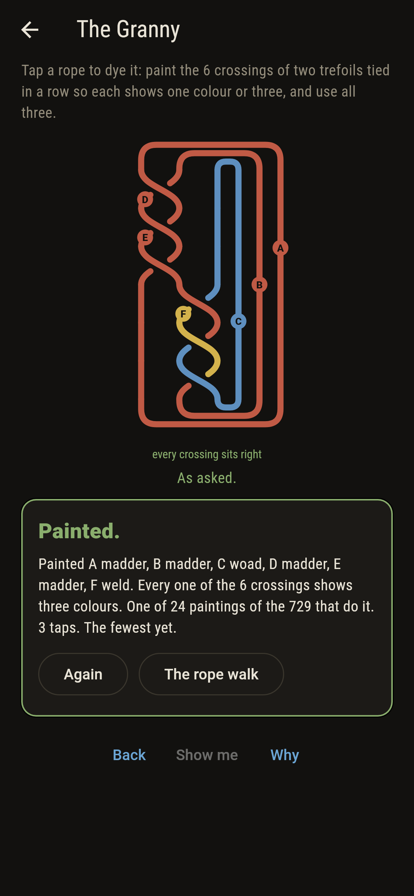
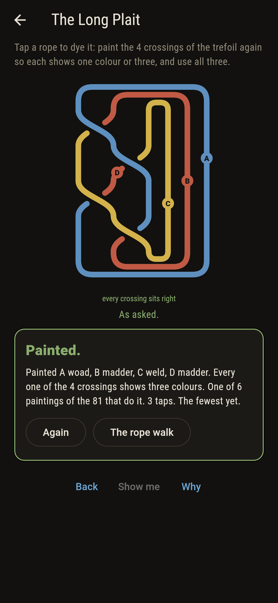
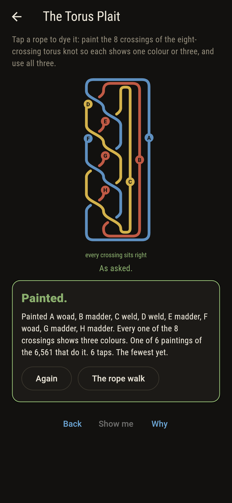
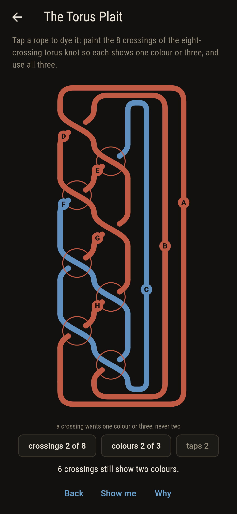
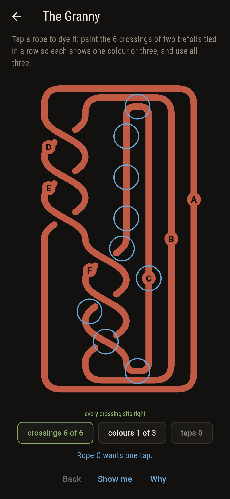
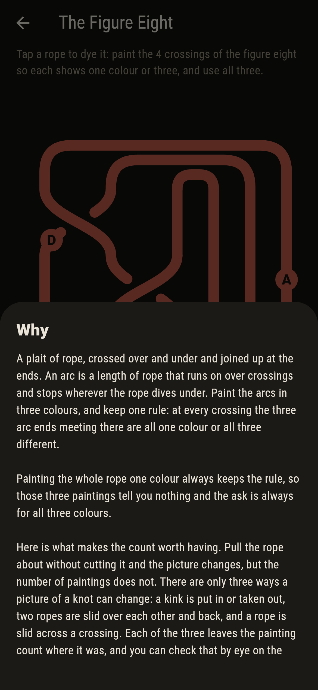
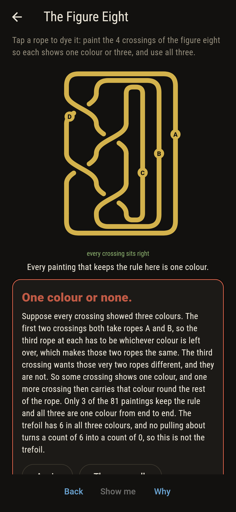

# Plaitwell



Ropes plaited down a board, over and under, and the foot of each lane
joined back to its own head so the whole thing closes into a loop. An
arc is a length of rope that runs on over crossings and stops wherever
it dives under. Tap an arc and it takes the next dye: madder, woad,
weld. The rule is one line. At every crossing the three arc ends
meeting there are all one colour or all three different, never two and
one.

Painting the whole rope one colour keeps that rule on any plait ever
drawn, so those paintings say nothing and the ask is always to use all
three. What makes the count worth having is that pulling the rope
about cannot change it. Any two pictures of the same knot are joined
by three moves, which Reidemeister set down in 1927: a kink put in or
taken out, two ropes slid over each other and back, and a rope slid
across a crossing. None of the three touches the count. So the number
of paintings belongs to the knot and not to the drawing, and that is
Ralph Fox's colouring, which he taught in the 1950s as the plainest
way into knots.

## The asks

1. **The Short Plait** - paint the 3 crossings of the trefoil so each shows one colour or three, and use all three
2. **The Long Plait** - paint the 4 crossings of the trefoil again so each shows one colour or three, and use all three
3. **The Granny** - paint the 6 crossings of two trefoils tied in a row so each shows one colour or three, and use all three
4. **The Torus Plait** - paint the 8 crossings of the eight-crossing torus knot so each shows one colour or three, and use all three
5. **The Figure Eight** - paint the 4 crossings of the figure eight so each shows one colour or three, and use all three

Every plait opens painted madder throughout, which keeps the rule and
uses one colour. They land 6, 6, 24 and 6 paintings of 27, 81, 729 and
6,561, the nearest 3, 3, 3 and 6 taps away. The first two are the same
knot plaited two ways, and they come out at the same 6, which is the
whole point of the thing. The Granny is two trefoils tied one after
the other, and its 27 legal paintings are the trefoil's 9 by the
trefoil's 9 over 3. The Torus Plait is a different knot with the
trefoil's count, so a count that matches proves nothing; only a count
that differs proves anything. The Figure Eight is labeled hopeless on
its tile, and its 4 crossings settle it before you start.

## Two voices

The game never asserts what it has not computed, and it computes
everything at least twice:

* **The sweep** takes every painting of every plait in turn, three
  colours over each arc, and checks the rule crossing by crossing.
  Every count on the tile and the card is its.
* **The moves** paint nothing. They take a plait's word and work
  Reidemeister's three moves on it wherever they will go, making a
  different picture of the same knot, and count that instead. If the
  count is really the knot's, the two can never part.

`tool/check_plaits.dart` runs the lot and refuses the bake on any
disagreement. The moves are worked in every place they fit, on the
five plaits the game ships and on 340 more it does not, and not one of
them shifted a count. The checker also walks the short plait into the
long plait in three moves, a strand added, the word turned round, a
rope slid across, holding the count at 9 the whole way, which is how
the game knows those two boards carry the same knot rather than
merely saying so. And it takes the figure eight apart by hand: no
painting of it has every crossing in three colours, and each of the
three paintings that do keep the rule is one colour end to end.

The thumb proof for that last one is two lines. Suppose every crossing
showed three colours. The first two crossings both take ropes A and B,
so the third rope at each has to be whichever colour is left over,
which makes those two ropes the same. The third crossing wants those
very two ropes different. So some crossing shows one colour, and one
more crossing carries that colour round the rest of the rope.

Bakerley in this collection is the other kind of colouring argument:
chequer a baking tray and the tee is the one gingerbread four that
does not take two of each shade, which is why some trays cannot be
filled. There the colouring is a counting trick that rules a thing
out. Here it is a number attached to the knot itself, and it rules
things out by refusing to move when the picture does.

## The checker's ledger

What `dart run tool/check_plaits.dart` printed for the build this
README shipped with, word for word:

```
every painting of every plait the game ships tried, 7,479 of them, three colours over 25 arcs: the paintings that keep the rule come to 9, 9, 27, 9, 3 and the ones using all three colours to 6, 6, 24, 6, 0; painting a whole rope one colour keeps the rule on every plait, which is why the ask is always for all three; the three moves that change a picture without untying it were worked in every place they would go, 150 of them on the five plaits the game ships and 7,996 more on 340 plaits it does not, and not one shifted the count; the short plait becomes the long plait in three moves, a strand added, the word turned round, a rope slid across, and the count stays 9 the whole way; the count came to a power of three on every one of the 5,460 plaits of three ropes up to six crossings, and never below three; the figure eight has no painting at all with every crossing in three colours, and each of its 3 legal paintings is one colour from end to end, while the trefoil has 6 in all three colours, so the two are not the same knot

 1 The Short Plait  paint the 3 crossings of the trefoil so each shows one colour or three, and use all three: 6 of the 27 paintings do it, the nearest 3 taps away
 2 The Long Plait   paint the 4 crossings of the trefoil again so each shows one colour or three, and use all three: 6 of the 81 paintings do it, the nearest 3 taps away
 3 The Granny       paint the 6 crossings of two trefoils tied in a row so each shows one colour or three, and use all three: 24 of the 729 paintings do it, the nearest 3 taps away
 4 The Torus Plait  paint the 8 crossings of the eight-crossing torus knot so each shows one colour or three, and use all three: 6 of the 6,561 paintings do it, the nearest 6 taps away
 5 The Figure Eight paint the 4 crossings of the figure eight so each shows one colour or three, and use all three: none of the 81, and the crossings say so before you start
```

## Screenshots

| The rope walk | An ask as it opens | The granny painted |
| --- | --- | --- |
|  |  |  |

| The long plait | The torus plait | A crossing gone wrong | Show me | The why | One colour or none |
| --- | --- | --- | --- | --- | --- |
|  |  |  |  |  |  |

A crossing that shows two colours is ringed in red, so what is left to
fix is what is marked. Every arc carries a bead with its letter, in
its own dye, because the words have to be able to name a rope and a
rope may run down a lane, round the closing loop and back.

Screenshots are drawn by `test/showcase_test.dart` at real phone sizes
with the app's own painter, then copied into `docs/` as they came out;
every rope in them was dyed a tap at a time, so nothing pictured is a
painting the game could not reach. The logo and every launcher icon
come out of `test/mark_test.dart` the same way: the mark is the
trefoil on two ropes, painted in all three dyes.

## Building

```
flutter test          # 56 tests, both voices among them
dart run tool/check_plaits.dart
flutter build apk     # or: flutter build ios
```
