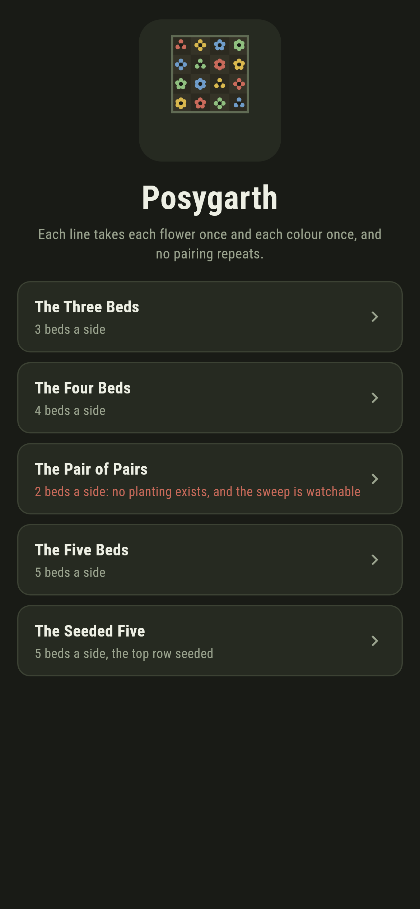
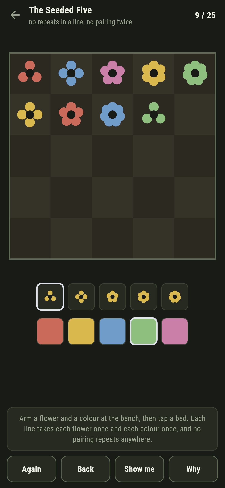
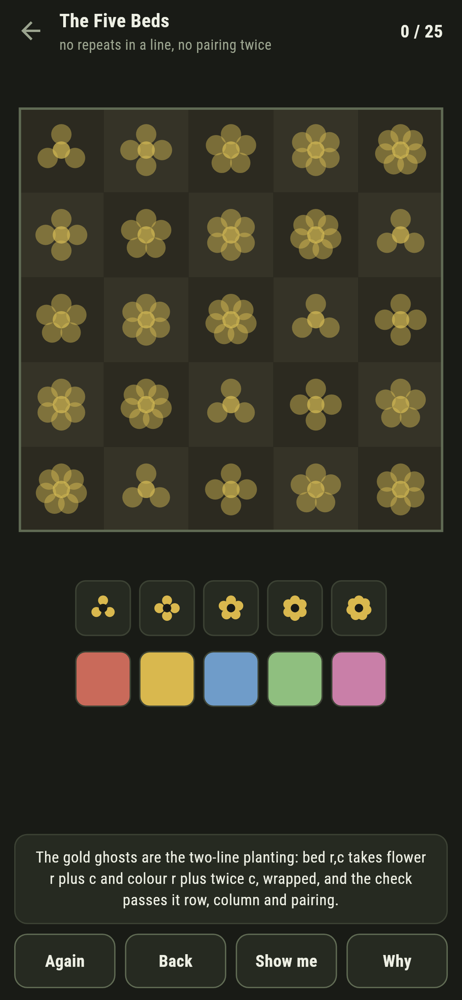
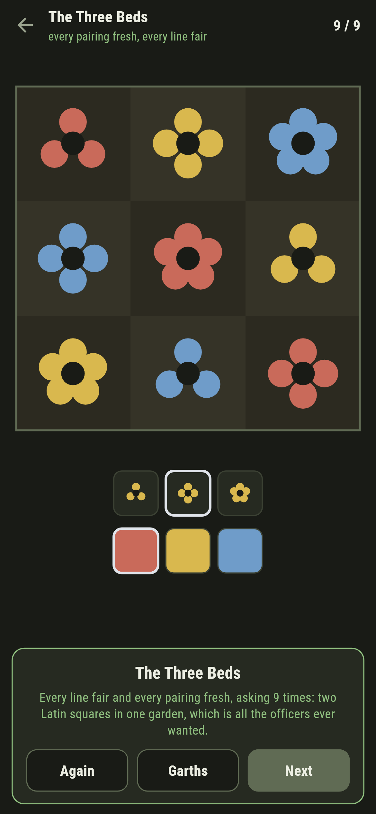
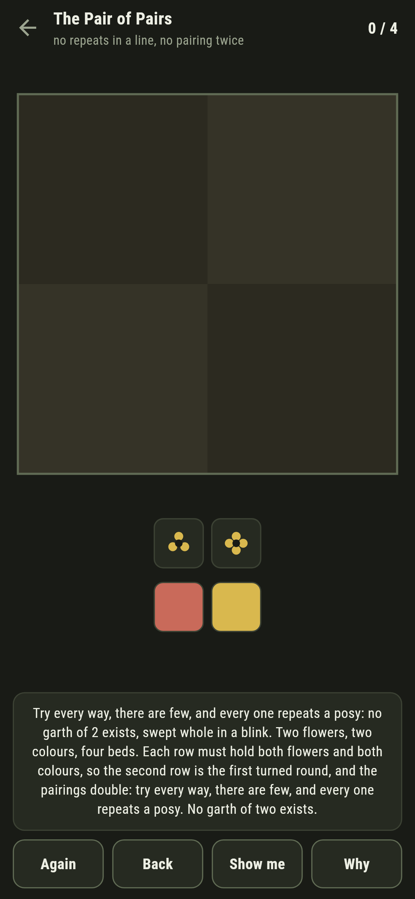
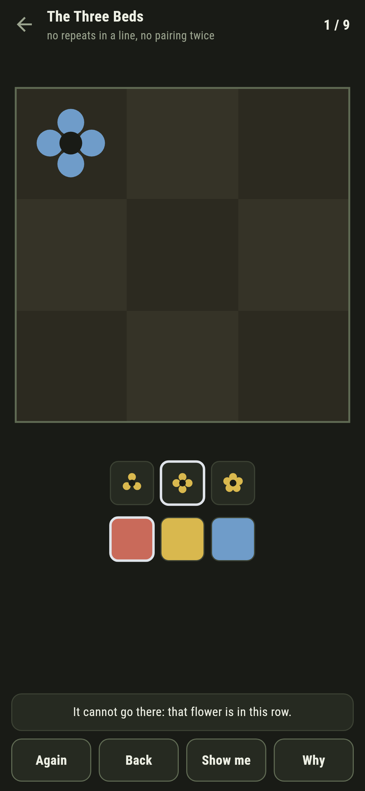

# Posygarth

A show-garden puzzle for phones, in Flutter, for Android and iOS.

A square garth of beds, one posy to a bed: a flower in a colour. Down
every row and every column, each flower once and each colour once; and
across the whole garth, no flower-and-colour pairing twice. Two Latin
squares in one garden, which is Euler's officers problem, in bloom.

| | | | |
|---|---|---|---|
|  |  |  |  |

## The plantings write themselves

For odd garths the planting is two lines of arithmetic: bed r,c takes
flower r plus c and colour r plus twice c, wrapped. Four resists the
two-line rule and yields to the doubling trick, a known square baked
in. **Why** lays the planting for your garth over the beds as gold
ghosts, and the checker passes every one of them row, column and
pairing:

```
$ make garths
the plantings hold at three, four, five, seven and nine

 1 The Three Beds    3 beds a side  the garth blooms
 2 The Four Beds     4 beds a side  the garth blooms
 3 The Pair of Pairs 2 beds a side  no planting at all
 4 The Five Beds     5 beds a side  the garth blooms
 5 The Seeded Five   5 beds a side  the garth blooms  (5 seeded)
```

## The Pair of Pairs

Two flowers, two colours, four beds, and no planting at all: each row
must hold both flowers and both colours, so the second row is the first
turned round, and the pairings double. The sweep of every attempt fits
in a blink, and the garth ships labelled in the house tradition of maps
nobody can win.

Six is the famous refusal, Euler's thirty six officers, and it does not
ship: too large to sweep honestly on a phone, and this shelf does not
assert what it has not checked.



## Every refusal has its reason

Arm a flower and a colour at the bench and tap a bed. A clash is
refused in words, that flower is in this row, that colour is in this
column, that very posy is planted already, and a legal posy that
strands the garth goes red the moment it is planted, the live answer
running by search behind it.



## Building

```
make deps    # fetch packages
make check   # analyze + every test
make garths  # the plantings proved, then the ledger
make shots   # render the screenshots and redraw the icons
make apk     # Android release build
make ios     # iOS release build (unsigned)
```

The logo and every app icon are drawn by the game's own painter in
`test/mark_test.dart`. There is no image in this repository that was not
produced by code in it.

## How it is put together

```
lib/garden/rules.dart    the plantings, soundness, and the search
lib/garden/garth.dart    a garth: size, seeding, the verdict
lib/garden/garths.dart   the five garths that ship
lib/garden/play.dart     a garth being planted: clashes in words, the
                         live answer
lib/ui/                  the painter, the screens, the mark
tool/check_garths.dart   the ledger above
```

The tests prove the plantings at three, five, seven, nine and eleven
and at four, exhaust the garth of two, break a sound planting to check
soundness bites, bloom every garth by following the game's own pointer,
and hold the pictures against the real widget tree. If any of that
drifts, `make check` goes red before anything leaves the machine.
