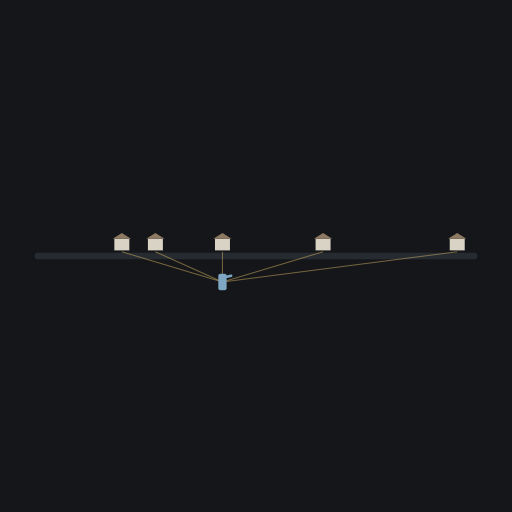
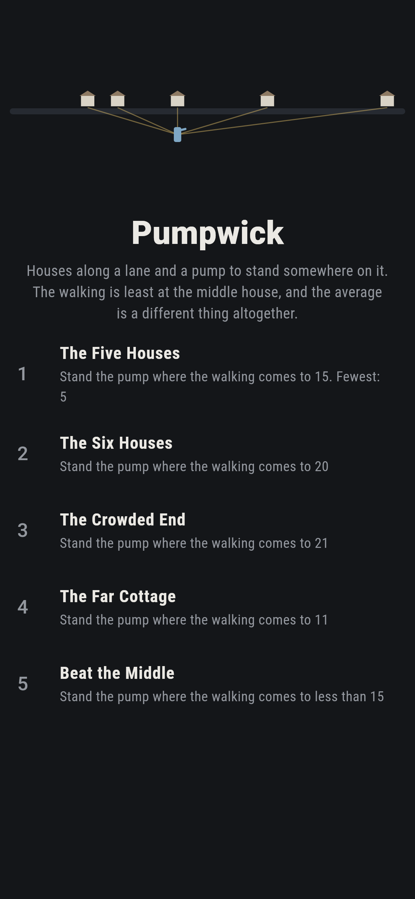
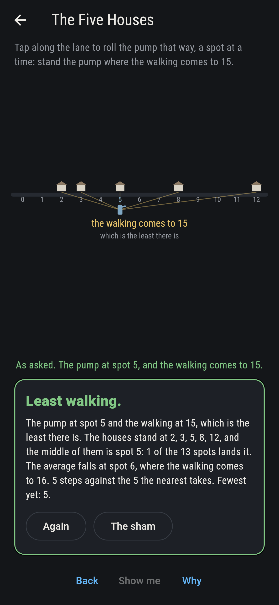
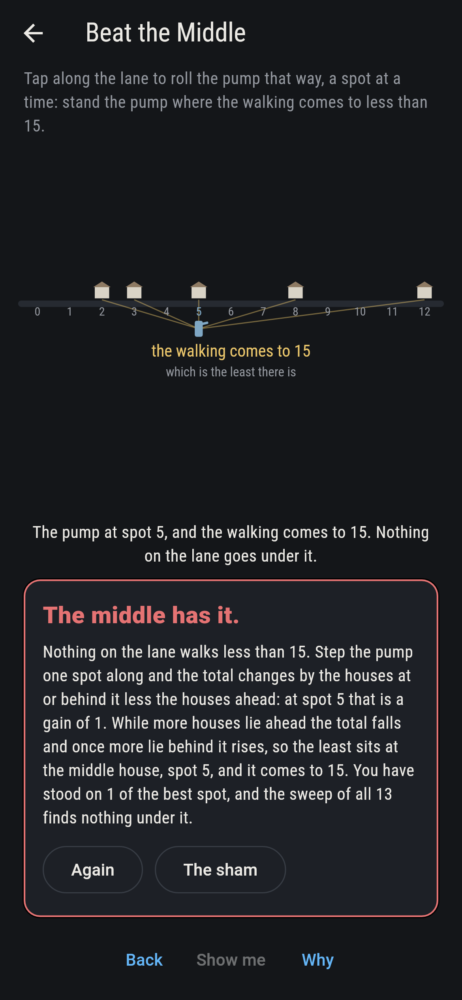
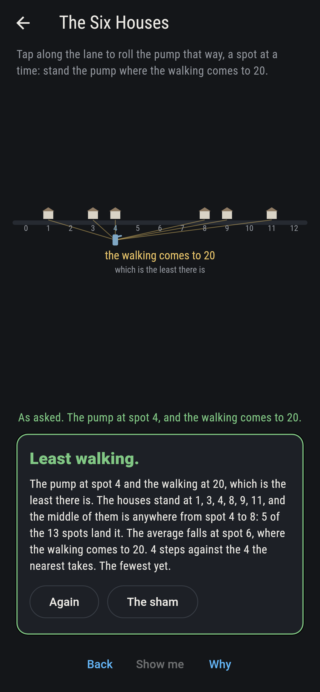
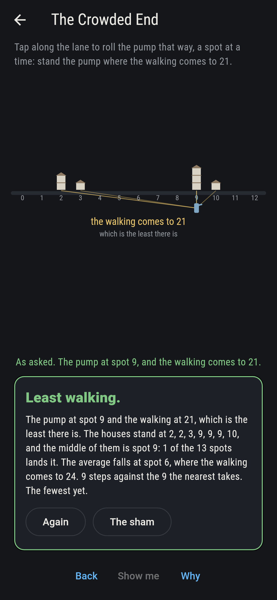
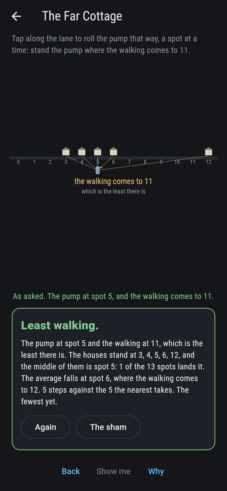
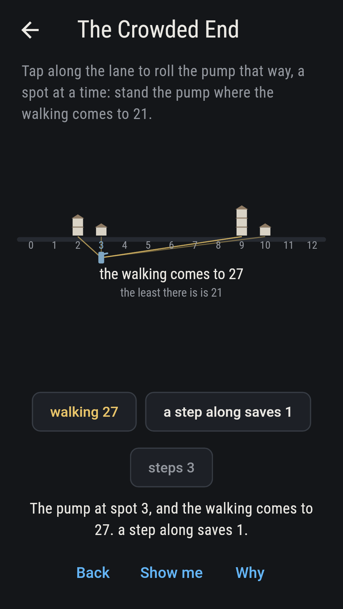
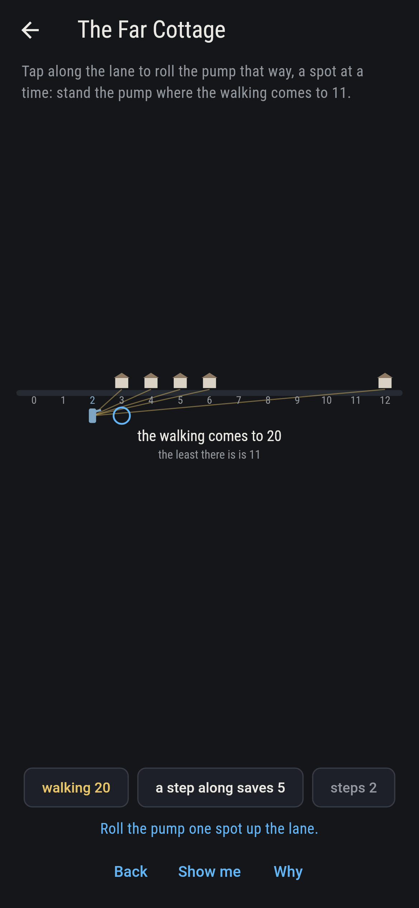
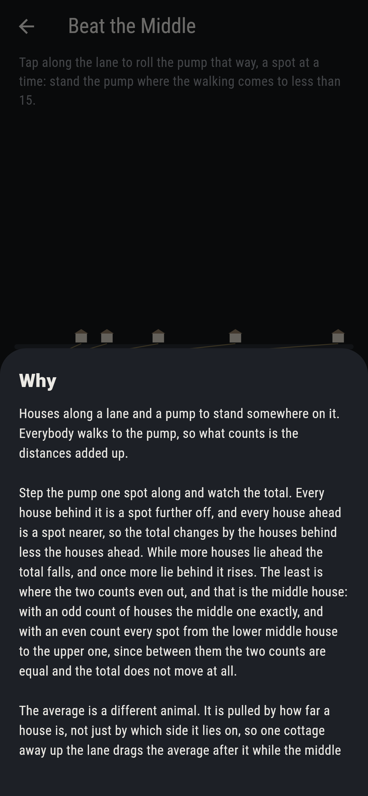

# Pumpwick



Houses along a lane and a pump to stand somewhere on it. Everybody
walks to the pump, so what counts is the distances added up, and the
walking is least at the middle house rather than at the average of
them. The reason is a step. Roll the pump one spot along and every
house behind it is a spot further off while every house ahead is a
spot nearer, so the total changes by the houses behind less the houses
ahead. While more houses lie ahead the total falls; once more lie
behind it rises. The least sits where the two counts even out, which
is the middle house with an odd count of houses, and every spot from
the lower middle house to the upper one when the count is even. The
average is a different animal: it is pulled by how far a house is, not
just by which side it lies on, so one cottage away up the lane drags
the average after it and leaves the middle where it was.

## The asks

1. **The Five Houses** - stand the pump where the walking comes to 15
2. **The Six Houses** - stand the pump where the walking comes to 20
3. **The Crowded End** - stand the pump where the walking comes to 21
4. **The Far Cottage** - stand the pump where the walking comes to 11
5. **Beat the Middle** - stand the pump where the walking comes to less than 15

The five houses at 2, 3, 5, 8 and 12 have their middle at spot 5 and
walk 15 from there; the average falls at 6 and costs 16. The six
houses have two middle ones, at 4 and 8, and every spot between them
walks 20, five spots in all. The crowded end bunches four houses at
the far end, and the middle goes with the crowd to spot 9 while the
average stops at 6, which costs 24 against 21. The far cottage drags
the average from 4.5 to 6 and leaves the middle at 5 exactly. Beat the
Middle asks for less than the least, and the sham says so as soon as
the pump stands on it.

## Two voices

Every number the game says out loud was worked out here rather than
guessed, and the best spot is found two ways:

* **By walking it.** The pump is stood at every spot of the lane in
  turn and the distances added up. That is what the board shows as you
  roll the pump along.
* **By the middle house.** The houses are sorted and the middle one
  taken, or the run between the two middle ones when the count is
  even. It adds nothing up at all.

The two agree on every row of houses on the lane, from one house to
seven and every arrangement of them, 77,519 rows. The checker also
holds the step rule to every spot of every row, so the total really
does change by the houses behind less the houses ahead, and it counts
how often the average is worse than the middle: 47,692 rows of the
77,519, and never better.

`tool/check_walks.dart` runs the lot and refuses the bake on any
disagreement.

## The checker's ledger

What `dart run tool/check_walks.dart` printed for the build this README
shipped with, word for word:

```
every row of houses on the lane taken, from one house to 7 and every arrangement of them over the 13 spots, 77,519 rows, and the pump stood at every spot of each: the spots where the walking is least are exactly the middle houses, on every row, which is the median and not the average; 57,044 of the rows have an odd count of houses and each of those has one best spot alone, while 20,475 have an even count and 13,819 of those have a run of best spots between the two middle houses, every spot of the run as good as the rest; stepping the pump one spot along changes the walking by the houses at or behind it less the houses ahead, which the sweep checks at every spot of every row, so the total falls while houses lie ahead and rises once they lie behind; standing the pump at the average instead of the middle is never better and is worse on 47,692 of the rows

 1 The Five Houses stand the pump where the walking comes to 15: 1 of the 13 spots lands it, the nearest 5 steps from where the pump starts
 2 The Six Houses  stand the pump where the walking comes to 20: 5 of the 13 spots land it, the nearest 4 steps from where the pump starts
 3 The Crowded End stand the pump where the walking comes to 21: 1 of the 13 spots lands it, the nearest 9 steps from where the pump starts
 4 The Far Cottage stand the pump where the walking comes to 11: 1 of the 13 spots lands it, the nearest 5 steps from where the pump starts
 5 Beat the Middle stand the pump where the walking comes to less than 15: none of the 13, and the counts either side say why
```

## Screenshots

| The sham | The five houses | Beat the middle |
| --- | --- | --- |
|  |  |  |

| The six houses | The crowded end | The far cottage | The pump at the wrong end, on the small phone | Show me | The why |
| --- | --- | --- | --- | --- | --- |
|  |  |  |  |  |  |

Screenshots are drawn by `test/showcase_test.dart` at real phone sizes
with the app's own painter, then copied into `docs/` as they came out.
On the board shots the pump was rolled a spot at a time by taps on the
lane, so no standing pictured is one the game could not reach. The logo
and every launcher icon come out of `test/mark_test.dart`, drawn by the
same painter: the mark is the five houses with the pump at the middle
one, and it stands there with no taps behind it.

## Building

```
flutter test          # 41 tests, the sweep among them
dart run tool/check_walks.dart
flutter build apk     # or: flutter build ios
```
