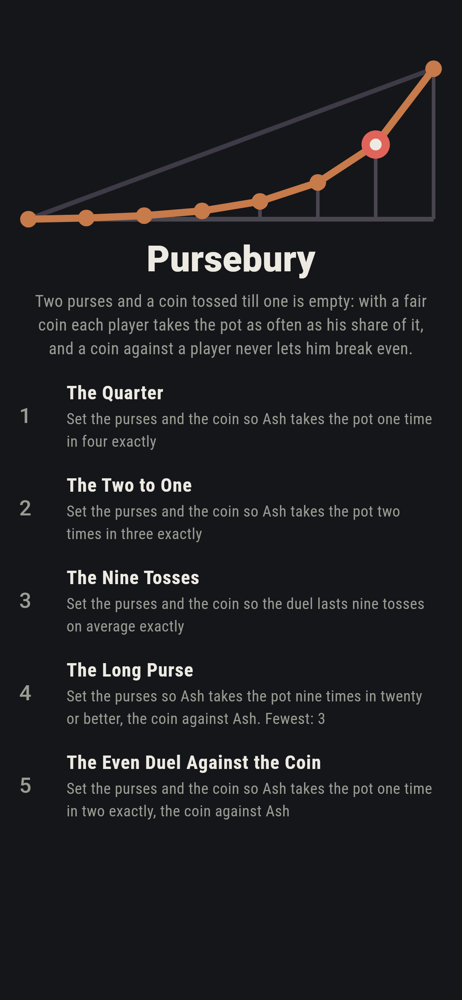
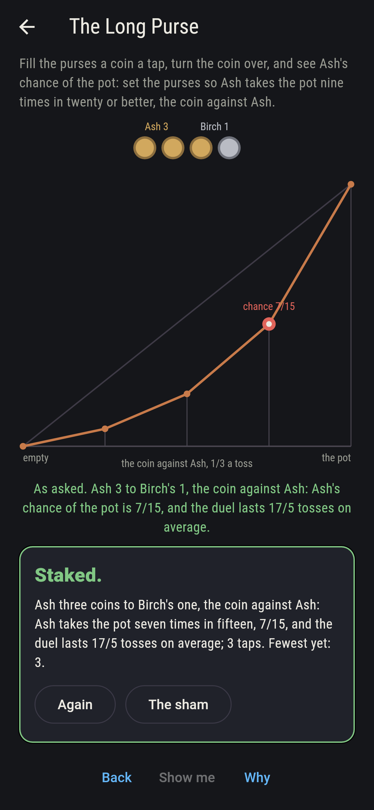
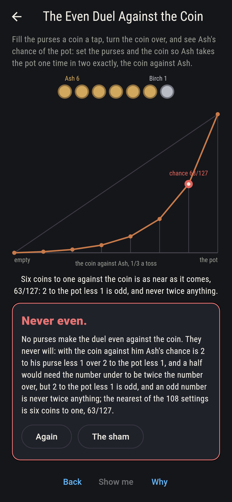
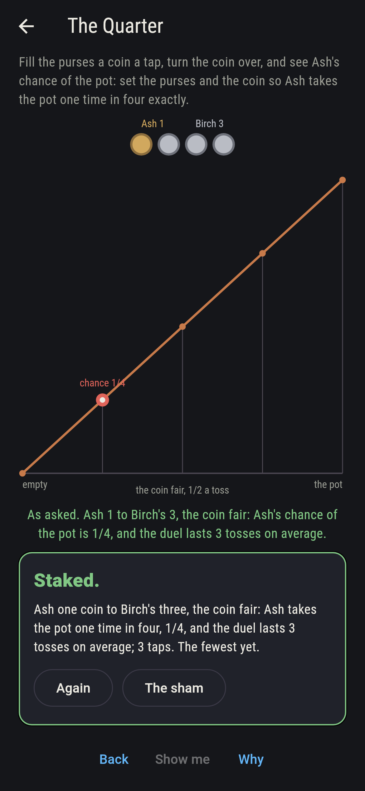
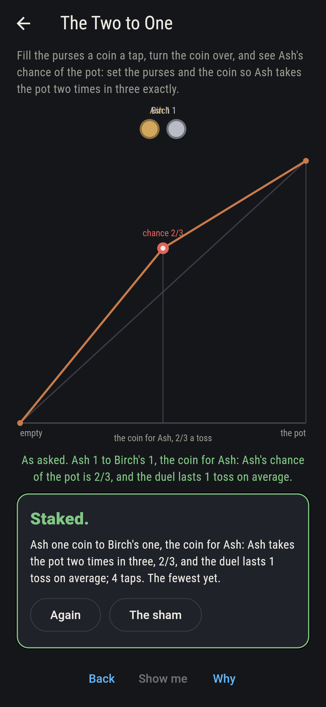
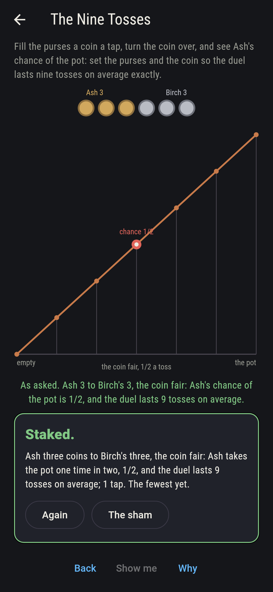
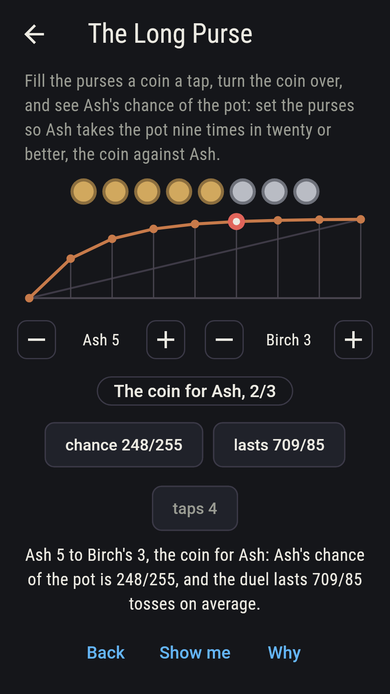
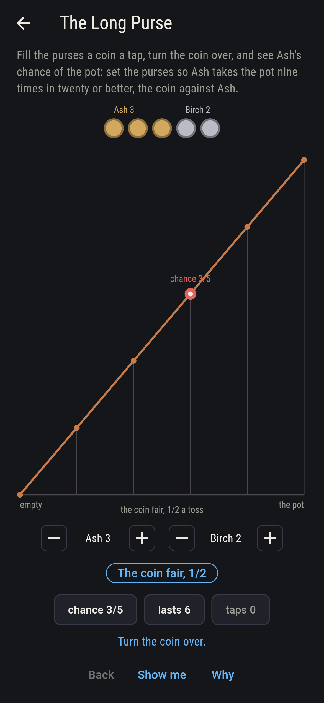
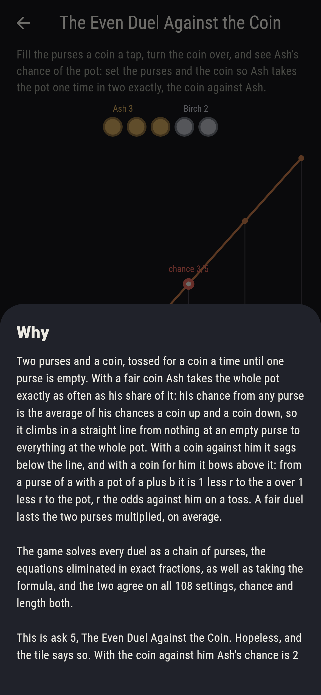

# Pursebury


Two purses and a coin, tossed for a coin a time until one purse is
empty. Fill Ash's purse and Birch's a coin a tap, one to six each,
and turn the coin over, against Ash, fair or for him. With a fair
coin Ash takes the whole pot exactly as often as his share of it:
his chance from any purse is the average of his chances a coin up
and a coin down, so it climbs in a straight line from nothing at an
empty purse to everything at the whole pot, and the duel lasts the
two purses multiplied, on average. A coin against him sags the line
and a coin for him bows it, to 1 less r to his purse over 1 less r
to the pot, r the odds against him on a toss. Every duel is solved
as a chain of purses, the equations eliminated in exact fractions,
as well as taking the formula, and the two agree on all 108
settings; and against the coin Ash never breaks even, six coins to
one getting him 63/127 and no purse a half.

## The asks

1. **The Quarter** - set the purses and the coin so Ash takes the pot one time in four exactly
2. **The Two to One** - set the purses and the coin so Ash takes the pot two times in three exactly
3. **The Nine Tosses** - set the purses and the coin so the duel lasts nine tosses on average exactly
4. **The Long Purse** - set the purses so Ash takes the pot nine times in twenty or better, the coin against Ash
5. **The Even Duel Against the Coin** - set the purses and the coin so Ash takes the pot one time in two exactly, the coin against Ash

A quarter is Ash's share at one coin to three or two to six with the
fair coin, two settings of 108, and no crooked coin makes it: their
chances have 2 to the pot less 1 under, an odd number, and a quarter
would need four times something. Two thirds is his share at two
coins to one, four to two or six to three, and comes once more with
the coin for him, one coin each, four settings. A fair duel of three
coins each lasts nine tosses, the one setting that lasts a whole
nine. Against the coin, one coin to Birch's one is 1/3, then 3/7,
7/15, 15/31, 31/63 and 63/127 at six to one, and three to one and
up reach nine in twenty, four settings. The Even Duel Against the
Coin is labeled hopeless on its tile: Ash's chance is 2 to his purse
less 1 over 2 to the pot less 1, and an odd number under is never
twice the number over; the sham admits it once the player reaches
six coins to one, the nearest there is.

## Two voices

The game never asserts what it has not computed, and it computes
everything at least twice:

* **The formula** gives Ash's chance and the length of the duel as
  exact fractions, his share and the purses multiplied with the fair
  coin and the powers of r otherwise, and the sweep tries it on every
  setting of the purses and the coin, 108 of them; every count on the
  sham is the sweep's, and the two players' chances add to one and a
  coin more never hurts, on all 108.
* **The chain** is the second voice: purse by purse, Ash's chance from
  i coins is p times his chance from i plus 1 and q times his chance
  from i less 1, nothing from an empty purse and everything from the
  whole pot, and the same equations with a toss counted a step give
  how long the duel lasts; the system is eliminated exactly, and it
  agrees with the formula on all 108 settings, chance and length both.

`tool/check_duels.dart` runs the lot and refuses the bake on any
disagreement.

## The checker's ledger

What `dart run tool/check_duels.dart` printed for the build this
README shipped with, word for word:

```
every setting of the two purses and the coin swept, one to six coins each and the coin against Ash, fair or for him, 108 settings, every duel solved as a chain of purses in exact fractions and held to the formula, chance and length both, and the two agree on all 108: with the fair coin Ash takes the pot as often as his share of it and the duel lasts the purses multiplied; the two players' chances add to one and a coin more never hurts, on all 108; against the coin, one coin to Birch's one is 1/3, then 3/7, 7/15, 15/31, 31/63 and 63/127 at six to one, the nearest to a half of the 108 and under it, every one being 2 to Ash's purse less 1 over 2 to the pot less 1, an odd number under; for the coin, one coin each is 2/3, and two each last 18/5 tosses; and a quarter comes 2 ways, two to one 4, nine tosses 1, nine in twenty against the coin 4, and the even duel against the coin never

 1 The Quarter                     set the purses and the coin so Ash takes the pot one time in four exactly: 2 of the 108 settings land it
 2 The Two to One                  set the purses and the coin so Ash takes the pot two times in three exactly: 4 of the 108 settings land it
 3 The Nine Tosses                 set the purses and the coin so the duel lasts nine tosses on average exactly: 1 of the 108 settings lands it
 4 The Long Purse                  set the purses so Ash takes the pot nine times in twenty or better, the coin against Ash: 4 of the 108 settings land it
 5 The Even Duel Against the Coin  set the purses and the coin so Ash takes the pot one time in two exactly, the coin against Ash: none of the 108, and the odd number said so first
```

## Screenshots

| The sham | The long purse | The even duel admitted |
| --- | --- | --- |
|  |  |  |

| The quarter | The two to one, coin for Ash | The nine tosses | Midway, on the small phone | Show me | The why |
| --- | --- | --- | --- | --- | --- |
|  |  |  |  |  |  |

Screenshots are drawn by `test/showcase_test.dart` at real phone
sizes with the app's own painter, then copied into `docs/` as they
came out; every duel in them was set up by taps, so nothing pictured
is a setting the game could not reach. The logo and every launcher
icon come out of `test/mark_test.dart` the same way: the mark is the
chain of six coins to one against the coin, sagging under the fair
line and stopping short of a half.

## Building

```
flutter test          # 49 tests, the chain among them
dart run tool/check_duels.dart
flutter build apk     # or: flutter build ios
```
