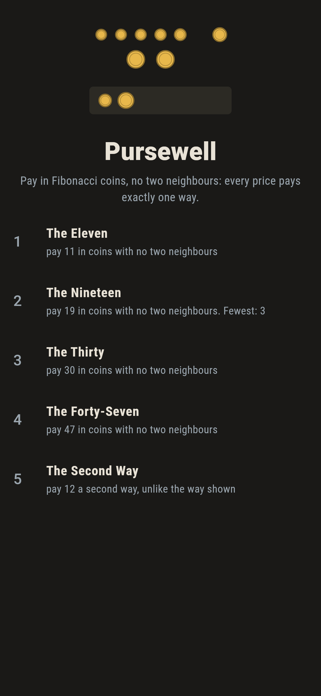
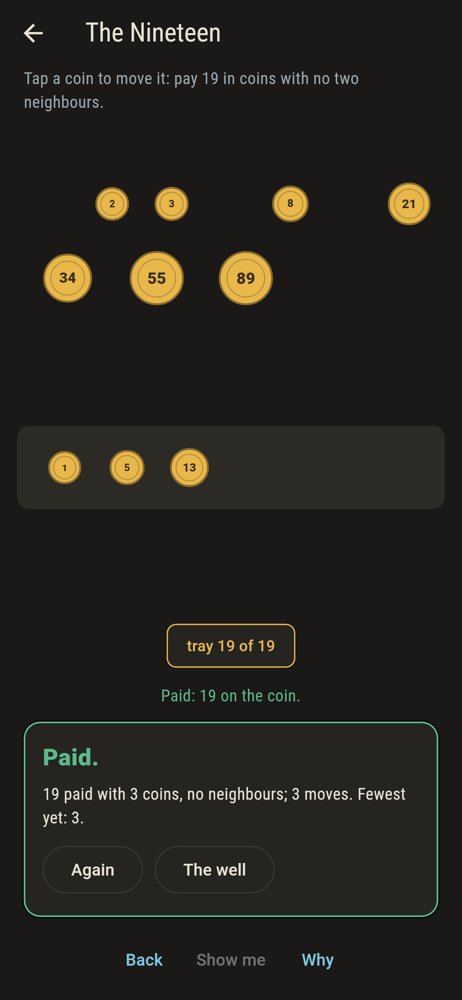
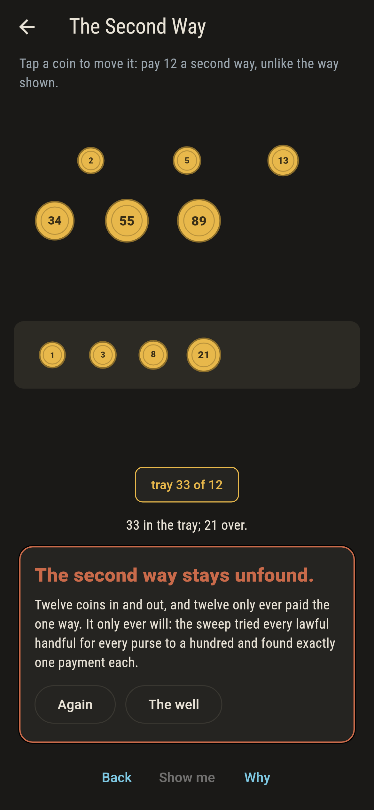
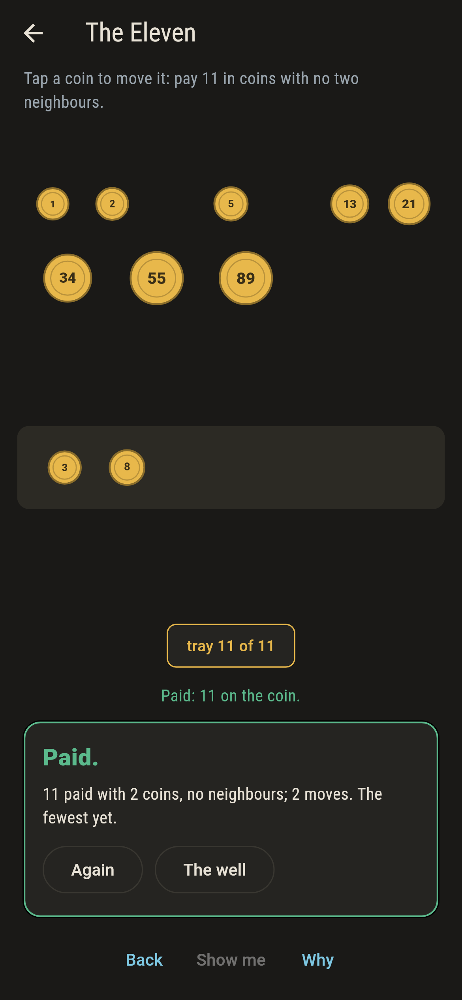
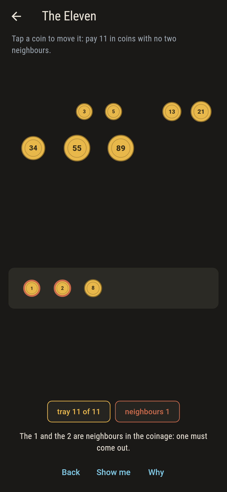
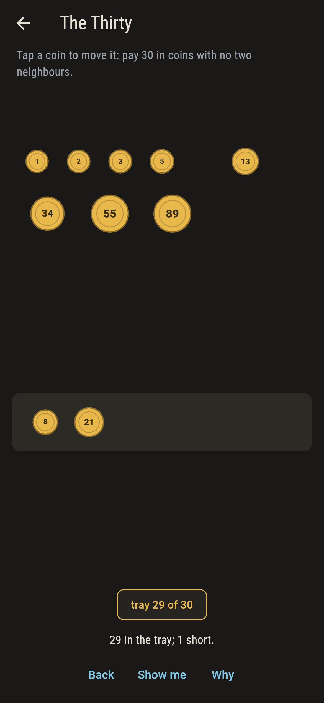
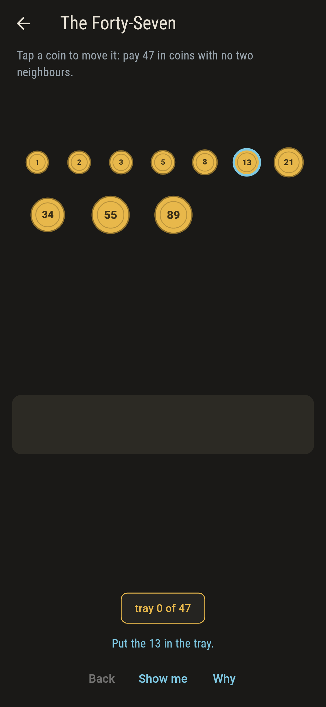
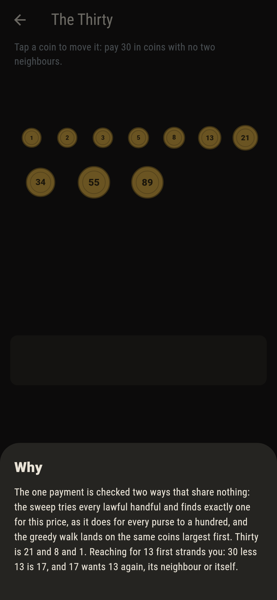

# Pursewell


The coinage of the well runs 1, 2, 3, 5, 8, 13, 21 and on, each
coin the sum of the two before, and the paying rule is
Zeckendorf's: no two neighbouring denominations in one payment.
Under that rule every price pays in exactly one way, the greedy
coin finds it every time, and one purse here asks for the second
way that does not exist.

## The purses

1. **The Eleven** - pay 11 in coins with no two neighbours
2. **The Nineteen** - pay 19 in coins with no two neighbours
3. **The Thirty** - pay 30 in coins with no two neighbours
4. **The Forty-Seven** - pay 47 in coins with no two neighbours
5. **The Second Way** - pay 12 a second way, unlike the way shown

The Thirty teaches the trap: reach for 13 first and the leftover
17 wants 13 again, its neighbour or itself. The Forty-Seven pays
with 34 and 13, neighbours in the purse but not in the coinage.
The Second Way marks 8 and 3 and 1 on the counter and asks for
any other way to pay 12: the sweep tried every lawful handful
for every purse from one to a hundred and found exactly one
payment each.

## Two voices

The game never asserts what it has not computed, and it computes
everything twice:

* **The sweep** tries every lawful handful of coins for every
  purse from one to a hundred and finds exactly one payment
  each time.
* **The greedy walk** takes the largest coin that fits, steps
  two down, and lands on the sweep's own payment every time.

`tool/check_purses.dart` runs both and refuses the bake on any
disagreement.

## The checker's ledger

What `dart run tool/check_purses.dart` printed for the build this
README shipped with, word for word:

```
every purse from one to a hundred swept through every lawful handful: each pays exactly one way, the greedy walk lands on that way every time, and the five prices shipped pay 3 and 8, 1 and 5 and 13, 1 and 8 and 21, 13 and 34, and 1 and 3 and 8 with no second way anywhere

 1 The Eleven       pay 11 in coins with no two neighbours: 1 payment, and the sweep proves it alone
 2 The Nineteen     pay 19 in coins with no two neighbours: 1 payment, and the sweep proves it alone
 3 The Thirty       pay 30 in coins with no two neighbours: 1 payment, and the sweep proves it alone
 4 The Forty-Seven  pay 47 in coins with no two neighbours: 1 payment, and the sweep proves it alone
 5 The Second Way   pay 12 a second way, unlike the way shown: none, by Zeckendorf's uniqueness swept to a hundred
```

## Screenshots

| The well | The nineteen paid | The second way admitted |
| --- | --- | --- |
|  |  |  |

| The eleven | Neighbours called out | Mid-pay | Show me | The why |
| --- | --- | --- | --- | --- |
|  |  |  |  |  |

Screenshots are drawn by `test/showcase_test.dart` at real phone
sizes with the app's own painter, then copied into `docs/` as
they came out; every coin in them was tapped, so nothing pictured
is a purse the game could not reach. The logo and every launcher
icon come out of `test/mark_test.dart` the same way: the mark is
the forty-seven paid.

## Building

```
flutter test          # 46 tests, the sweep among them
dart run tool/check_purses.dart
flutter build apk     # or: flutter build ios
```
