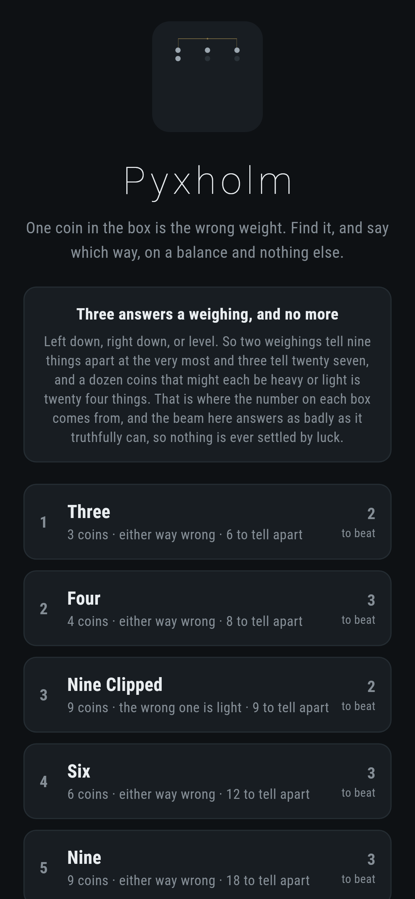
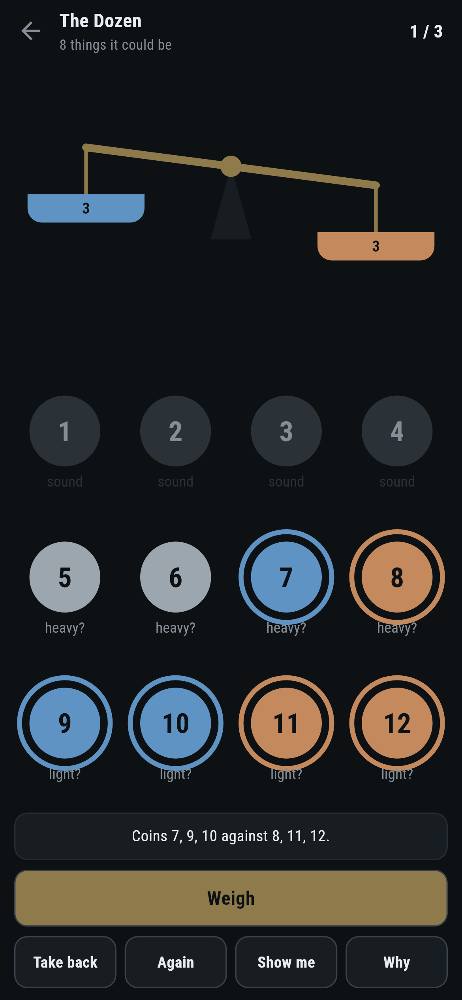
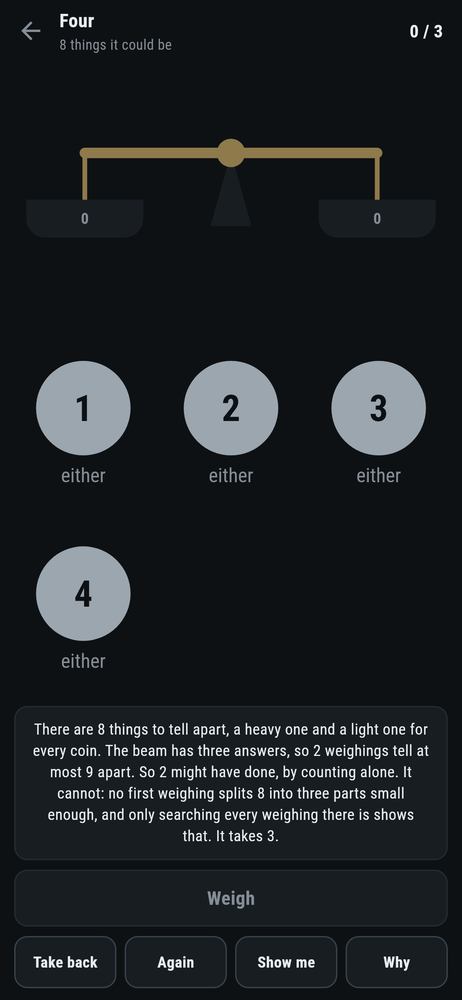
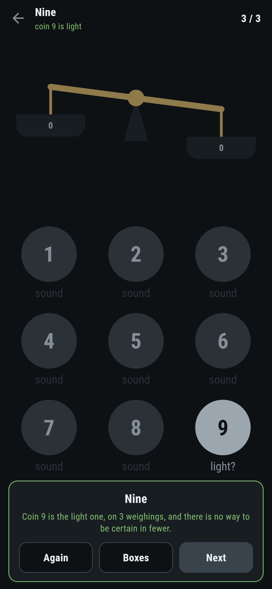
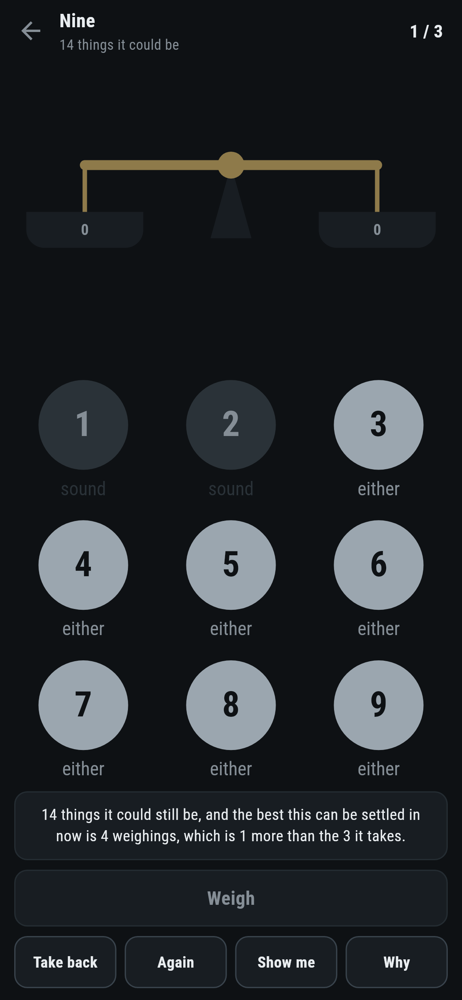

# Pyxholm

A weighing puzzle for phones, in Flutter, for Android and iOS.

One coin in the box is the wrong weight. Find it, and say which way it is
wrong, on a balance and nothing else. The number on each box is the fewest
weighings that are certain to settle it.

| | | | |
|---|---|---|---|
|  |  |  |  |

## The beam answers as badly as it can

There is no coin hidden at the start. The game keeps every verdict that is
still possible, and when a weighing goes on the beam it answers with whichever
of left, right and level leaves the most work still to do. So a number here is
a promise rather than a hope: getting a box out in three means three is enough
however the coins are actually made.

## Three answers a weighing, and no more

Left down, right down, or level. So two weighings tell nine things apart at the
very most and three tell twenty seven, and a dozen coins that might each be
heavy or light is twenty four things to tell apart. That is a floor nobody can
get under, and it comes from counting rather than from any search:


Counting is a floor and not an answer, which is why the four coin box is here.
Eight things to tell apart against nine that two weighings can distinguish, so
counting cannot rule two out. Two cannot be done: no first weighing splits
eight verdicts into three parts small enough, and only trying every weighing
there is shows it. The box needs three.

Nine Clipped and Nine are the same nine coins, once knowing the wrong one is
light and once not knowing. Nine things to tell apart takes two weighings and
eighteen takes three. That difference is the whole cost of not knowing.

## The searching

```
$ make boxes
 1 Three           3 coins  either way      6 to tell apart  fewest 2  written down 2  counting says 2  11ms
 2 Four            4 coins  either way      8 to tell apart  fewest 3  written down 3  counting says 2  1ms  COUNTING IS NOT ENOUGH
 3 Nine Clipped    9 coins  the light one   9 to tell apart  fewest 2  written down 2  counting says 2  26ms
 4 Six             6 coins  either way     12 to tell apart  fewest 3  written down 3  counting says 3  1ms
 5 Nine            9 coins  either way     18 to tell apart  fewest 3  written down 3  counting says 3  33ms
 6 Eleven         11 coins  either way     22 to tell apart  fewest 3  written down 3  counting says 3  1459ms
 7 The Dozen      12 coins  either way     24 to tell apart  fewest 3  written down 3  counting says 3  4195ms
```

A plain minimax over the verdicts still standing. Each weighing splits them
into three by which way the beam would go, and what it costs is one more than
the worst of the three. What keeps it affordable is the counting again: a set
of verdicts that cannot be told apart in the weighings left is given up on at
once, without trying anything on it.

The number for an untouched box is written down rather than worked out when it
opens, because the dozen takes about four seconds. Everything after the first
weighing is a handful of verdicts and settles instantly, which is what the game
uses to say the moment a weighing has thrown the fewest away.

## What the game says



How many things it could still be, which is the number the whole game turns on,
and whether the box can still be settled in the weighings it takes. Under every
coin it says what is still known about it: sound, or heavy, or light, or
either. All of that is read straight off the verdicts still standing rather
than worked out separately.

**Show me** lays out a weighing that still settles the box in as few more as it
can now be settled in, and puts the coins on the pans. A test settles all seven
boxes by doing nothing else.

## Running it

```
make deps     # flutter pub get
make test     # everything
make analyze
make shots    # render the screens into build/showcase, redraw the logo and icons
make boxes    # the fewest weighings for each box, against what counting says
make apk      # release APK
make ios      # release iOS build, unsigned
```

## Tests

`flutter test` runs the beam (which way it goes for each verdict, and what
counts as a fair weighing), the counting (how many threes it takes, and what
knowing the direction saves), the searching (two coins cannot be settled at
all, three take two, four take three though counting says two might do, and the
weighing it lays out really does split the verdicts), every box that ships, and
a box on the bench.

Then the game through the screen: moving a coin between the pans, weighing,
weighing with the pans unequal, being told how much is left to tell apart,
being told a weighing has thrown the fewest away, **Take back**, **Again**,
**Show me**, **Why**, and all seven boxes settled in the fewest weighings there
are.

Screenshots come from `test/showcase_test.dart`, and every coin on a pan in
them was put there by tapping it. `test/mark_test.dart` draws the logo, the
launcher icons at every density Android asks for and every size the iOS icon
set asks for; there is no image in this repository that was not produced by it.
