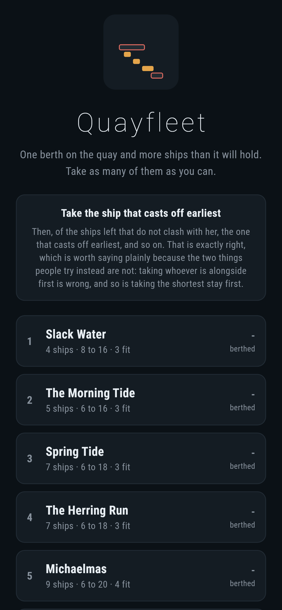
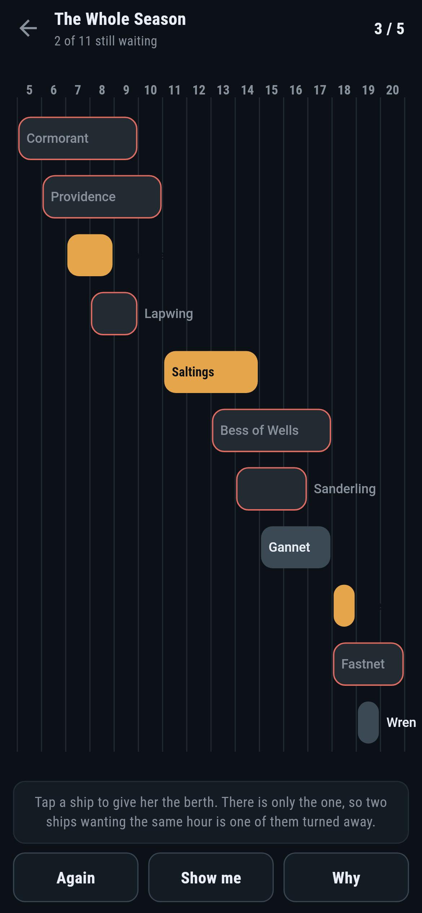
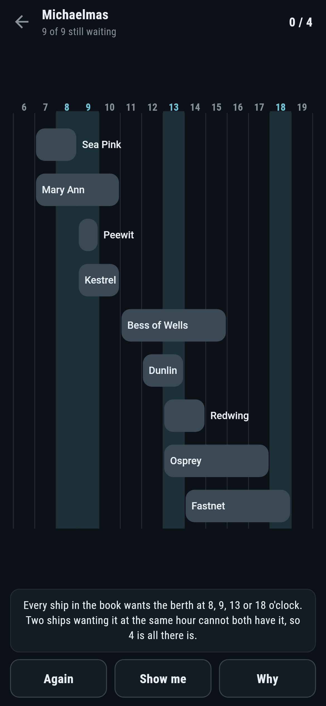
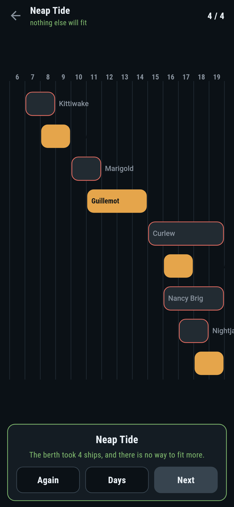
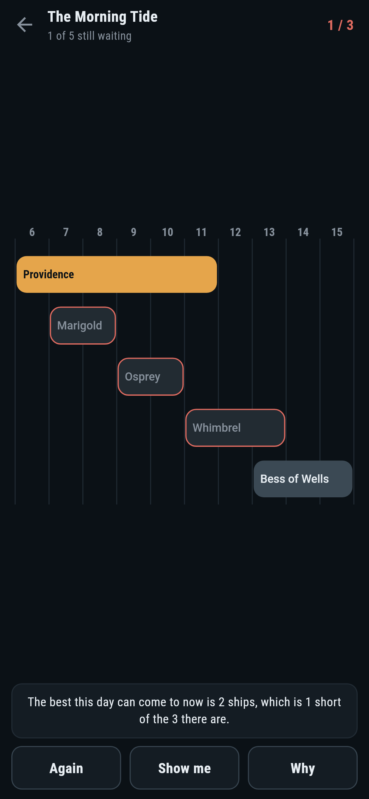

# Quayfleet

A booking puzzle for phones, in Flutter, for Android and iOS.

One berth on the quay and more ships than it will hold. Each one wants it for a
stretch of the day. Take as many of them as you can.

| | | | |
|---|---|---|---|
|  |  |  |  |

## Take the ship that casts off earliest

Then, of the ships that do not clash with her, the one that casts off
earliest, and so on. That is the whole method and it is exactly right, which is
worth saying plainly because the two things people reach for instead are not.
Taking whoever is alongside first is wrong. Taking the shortest stay first is
wrong. Every day in this game past the second was kept because both of them
come out short on it:

```
$ make days
 1 Slack Water        4 ships  most 3  written down 3  by trying every set 3  alongside first 3  shortest first 3  hours [9, 12, 15]
 2 The Morning Tide   5 ships  most 3  written down 3  by trying every set 3  alongside first 2  shortest first 3  hours [8, 10, 13]
 3 Spring Tide        7 ships  most 3  written down 3  by trying every set 3  alongside first 2  shortest first 2  hours [10, 12, 15]
 4 The Herring Run    7 ships  most 3  written down 3  by trying every set 3  alongside first 2  shortest first 2  hours [10, 12, 15]
 5 Michaelmas         9 ships  most 4  written down 4  by trying every set 4  alongside first 3  shortest first 3  hours [8, 9, 13, 18]
 6 Neap Tide          9 ships  most 4  written down 4  by trying every set 4  alongside first 3  shortest first 3  hours [8, 11, 17, 19]
 7 The Whole Season   11 ships  most 5  written down 5  by trying every set 5  alongside first 4  shortest first 4  hours [8, 14, 17, 18, 19]
```

It is right because of an exchange. Take any way of berthing the most ships
there are. The ship in it that casts off first cannot cast off earlier than the
ship this method takes first, so swapping this method's ship in for it clashes
with nothing that was already there and leaves just as many ships berthed. Do
the same again on what is left. The answer the method gives is therefore as
good as the best one there is.

That argument is a paragraph, so the code does not rely on it. Five hundred
days made up at random are settled by the rule and again by trying every set of
ships there is, and the two always agree.

## The number comes with its proof


Every ship that gets passed over is passed over because she clashes with the
last ship taken, which means she is still in the berth on that ship's last
hour. So the last hours of the ships taken are a handful of hours that every
ship in the book wants, and two ships wanting the same hour cannot both have
it. There cannot be more ships in the day than there are hours in that list,
and there are exactly that many.

**Why** draws them. A player can check it with a finger: every bar on the
screen crosses one of the lit columns.

## What the game says



After every ship taken it runs the same rule again over the ships that do not
clash with anything in the berth, which is a different question from the one it
answered when the day opened and just as cheap. That is what lets it say the
moment a day has been thrown away, and it is why the day above says two when
it opened saying three.

**Show me** points at a ship that keeps the day as good as it can now be. A
test works all seven days by doing nothing else, and every one comes out on the
most the berth will take. A hundred and fifty days made up at random do the
same.

## Running it

```
make deps      # flutter pub get
make test      # everything
make analyze
make shots     # render the screens into build/showcase, redraw the logo and icons
make days      # the most each day takes, by the rule and by trying every set
make find      # make days up and keep the ones worth playing
make apk       # release APK
make ios       # release iOS build, unsigned
```

## Tests

`flutter test` runs the ship (when she is in the berth, what clashes with
what), the rule (which ship it takes first, that the ships it takes really do
all fit, and that the hours it hands back catch every ship in the day), the
rule against trying every set of ships on five hundred random days, the two
obvious ways never beating it and often losing to it, every day that ships, and
working one (taking a ship, taking her back out, a clash, and asking the game
what to do next until nothing else fits).

Then the game through the screen: tapping a ship, tapping her again, being told
who has the berth, being told the day can no longer be as good, **Again**,
**Show me**, **Why**, a day worked badly on purpose, and all seven days worked
up to the most.

Screenshots come from `test/showcase_test.dart`, and every ship in the berth in
them was put there by tapping her line in the book. `test/mark_test.dart` draws
the logo, the launcher icons at every density Android asks for and every size
the iOS icon set asks for; there is no image in this repository that was not
produced by it.
