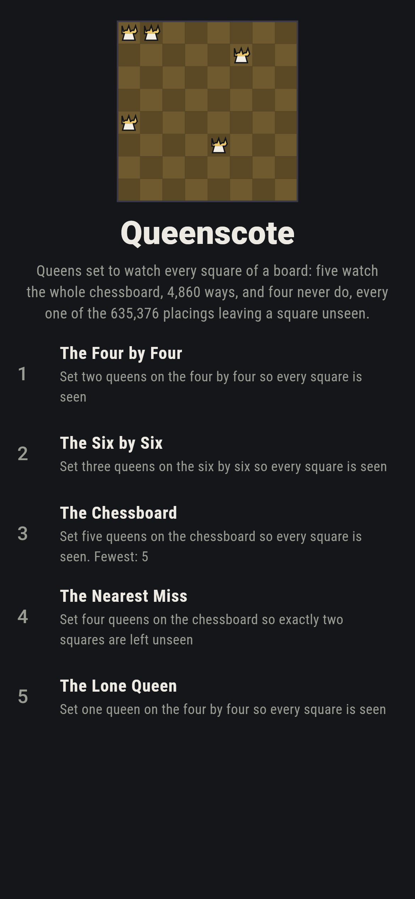
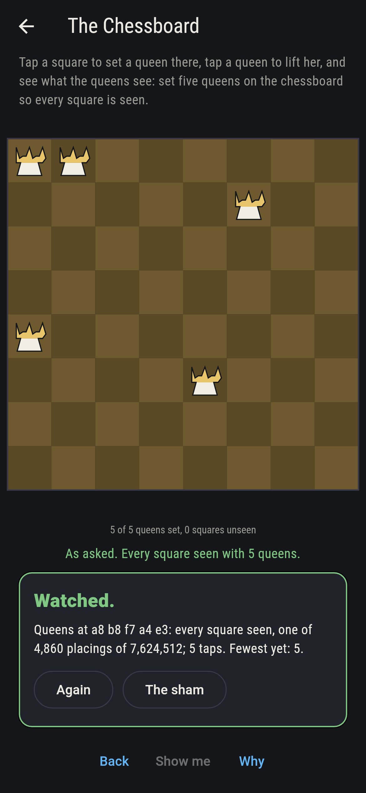
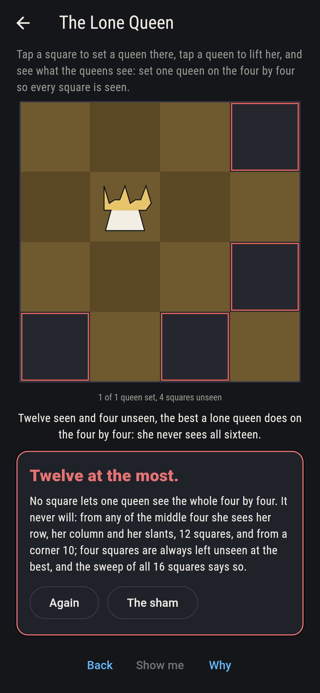
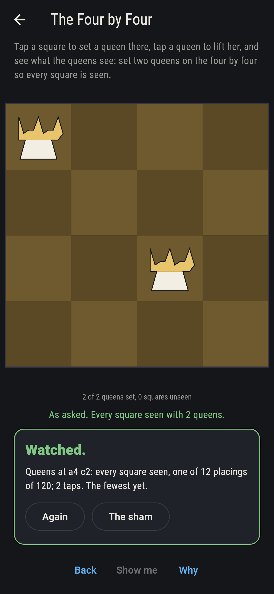
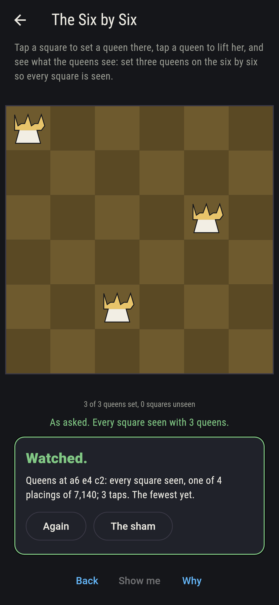
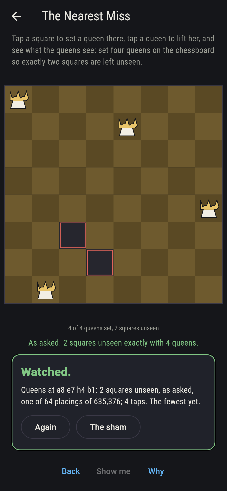
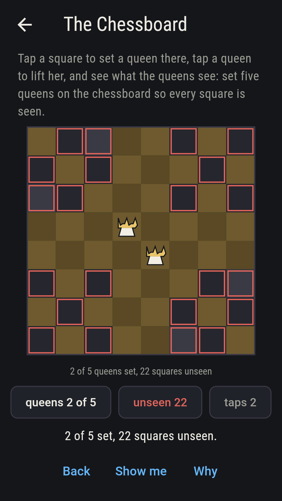
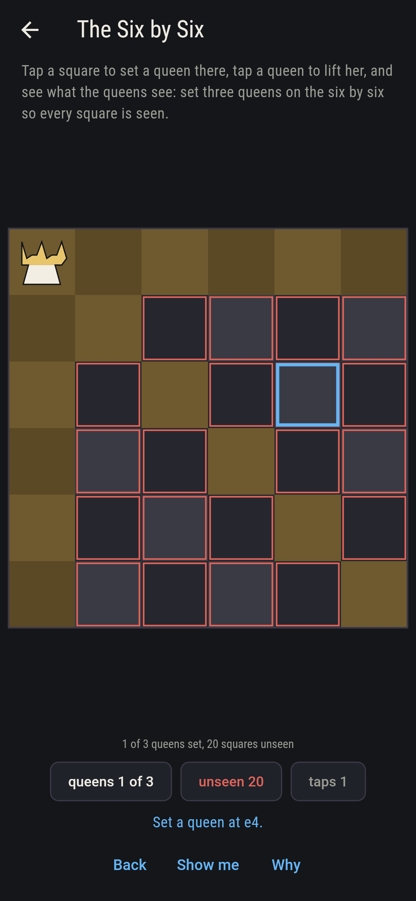
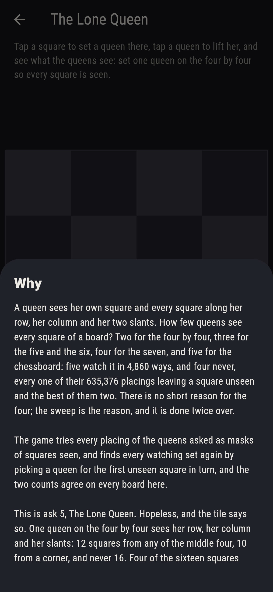

# Queenscote


Queens set to watch every square of a board. A queen sees her own
square and every square along her row, her column and her two
slants; how few queens see every square? Two for the four by four,
three for the five and the six, four for the seven, and five for
the chessboard: five watch it in 4,860 ways, and four never, every
one of their 635,376 placings leaving a square unseen and the best
of them two. There is no short reason for the four; the sweep is the
reason, and it is done twice over, every placing tried as masks of
squares seen and every watching set found again by picking a queen
for the first unseen square in turn. Tap a square to set a queen,
tap her to lift her, and see what the queens see.

## The asks

1. **The Four by Four** - set two queens on the four by four so every square is seen
2. **The Six by Six** - set three queens on the six by six so every square is seen
3. **The Chessboard** - set five queens on the chessboard so every square is seen
4. **The Nearest Miss** - set four queens on the chessboard so exactly two squares are left unseen
5. **The Lone Queen** - set one queen on the four by four so every square is seen

Two queens watch the four by four in 12 of the 120 placings; three
watch the six by six in only 4 of 7,140, one shape turned and
mirrored four ways; five watch the chessboard in 4,860 of 7,624,512;
and four queens on the chessboard leave two squares unseen in 64 of
635,376 placings, three in 672, and never none. The Lone Queen is
labeled hopeless on its tile: one queen sees 12 squares of the
sixteen at the most, from the middle four, and 10 from a corner; the
sham admits it the moment she stands on a middle square, four
squares unseen.

## Two voices

The game never asserts what it has not computed, and it computes
everything at least twice:

* **The sweep** tries every placing of the queens asked on the board
  asked, in order, each queen's squares seen kept as a mask and the
  masks joined, and counts the placings that see every square, or
  that leave the count unseen the ask wants; every count on the sham
  is the sweep's, and it finds the fewest queens for every board from
  the four by four to the eight, and how many squares one fewer must
  leave unseen.
* **The picking** searches nothing but the first unseen square: a
  queen is set on some square that sees it, in turn, until every
  square is seen or the queens run out, and the sets found are kept
  once each; it finds every watching set the sweep does, 12, 4 and
  4,860 on the boards here, and its first set is the show-me's aim.

`tool/check_watches.dart` runs the lot and refuses the bake on any
disagreement.

## The checker's ledger

What `dart run tool/check_watches.dart` printed for the build this
README shipped with, word for word:

```
every placing of the queens asked tried on every board asked, as masks of the squares seen, and every watching set found again by picking a queen for the first unseen square in turn, the two counts agreeing on every board: two queens watch the four by four 12 ways of 120, three watch the six by six 4 ways of 7,140, one shape turned four ways, and five watch the chessboard 4,860 ways of 7,624,512; the fewest that watch run 2, 3, 3, 4, 5 from the four by four to the eight, and one fewer never does, leaving 4, 2, 6, 4 and 2 squares unseen at best; four queens on the chessboard leave two unseen in 64 placings of 635,376 and three in 672; and one queen on the four by four sees 12 squares at the most, from the middle four, and 10 from a corner, so 4 of the 16 squares leave four unseen and none fewer

 1 The Four by Four  set two queens on the four by four so every square is seen: 12 of the 120 placings land it
 2 The Six by Six    set three queens on the six by six so every square is seen: 4 of the 7,140 placings land it
 3 The Chessboard    set five queens on the chessboard so every square is seen: 4,860 of the 7,624,512 placings land it
 4 The Nearest Miss  set four queens on the chessboard so exactly two squares are left unseen: 64 of the 635,376 placings land it
 5 The Lone Queen    set one queen on the four by four so every square is seen: none of the 16, and the twelve seen said so first
```

## Screenshots

| The sham | The chessboard | The lone queen admitted |
| --- | --- | --- |
|  |  |  |

| The four by four | The six by six | The nearest miss | Midway, on the small phone | Show me | The why |
| --- | --- | --- | --- | --- | --- |
|  |  |  |  |  |  |

Screenshots are drawn by `test/showcase_test.dart` at real phone
sizes with the app's own painter, then copied into `docs/` as they
came out; every queen in them was set by a tap, so nothing pictured
is a placing the game could not reach. The logo and every launcher
icon come out of `test/mark_test.dart` the same way: the mark is
five queens watching the whole chessboard.

## Building

```
flutter test          # 45 tests, the sweep among them
dart run tool/check_watches.dart
flutter build apk     # or: flutter build ios
```
