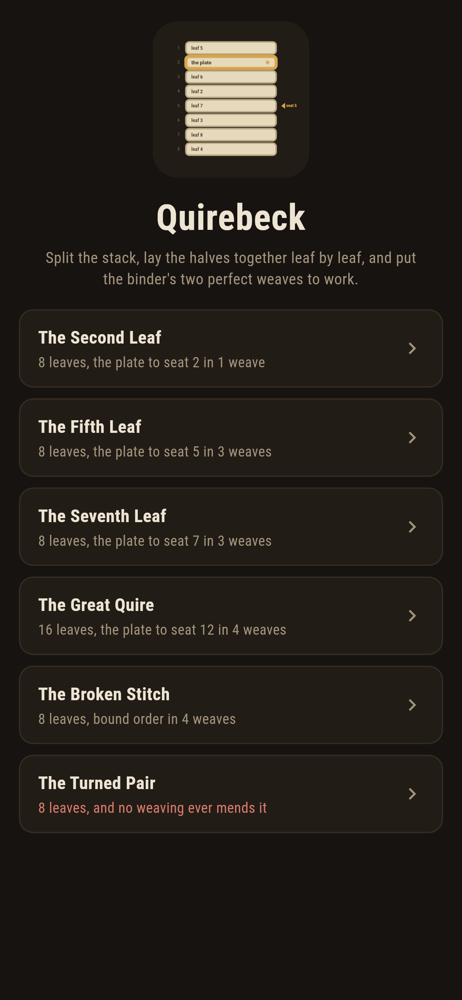
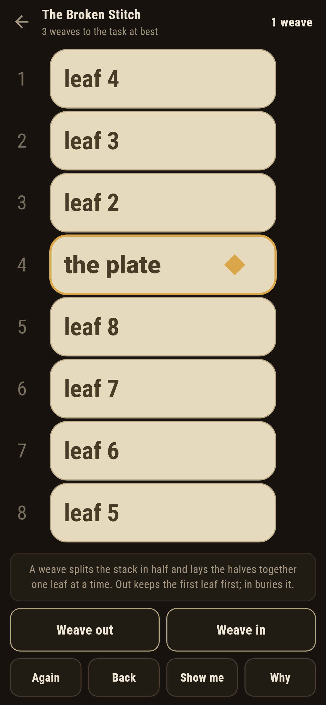
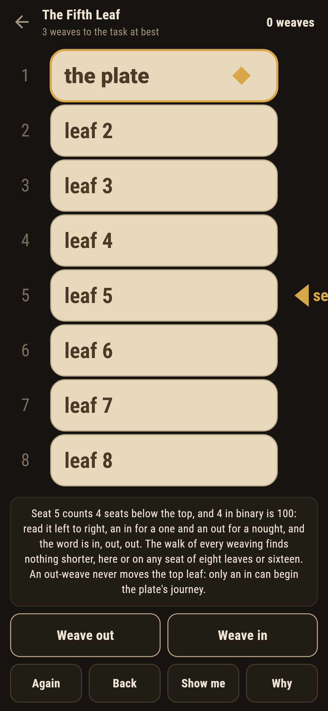
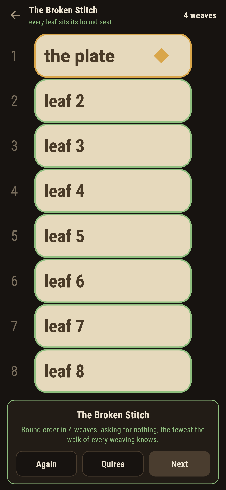
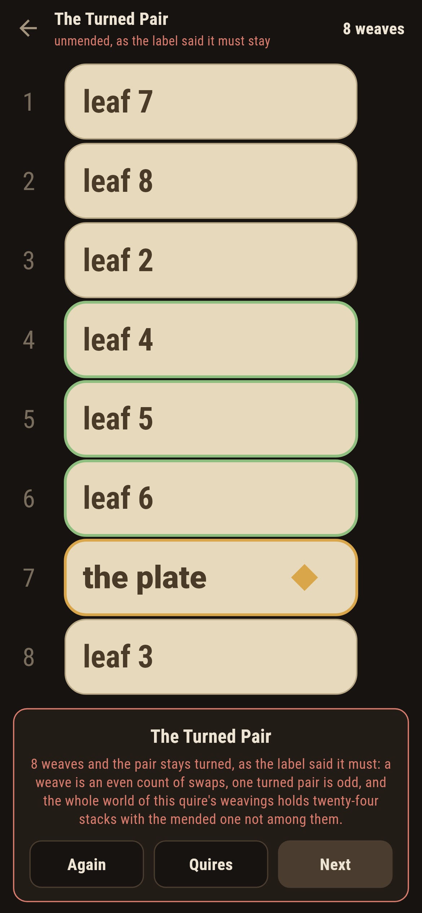
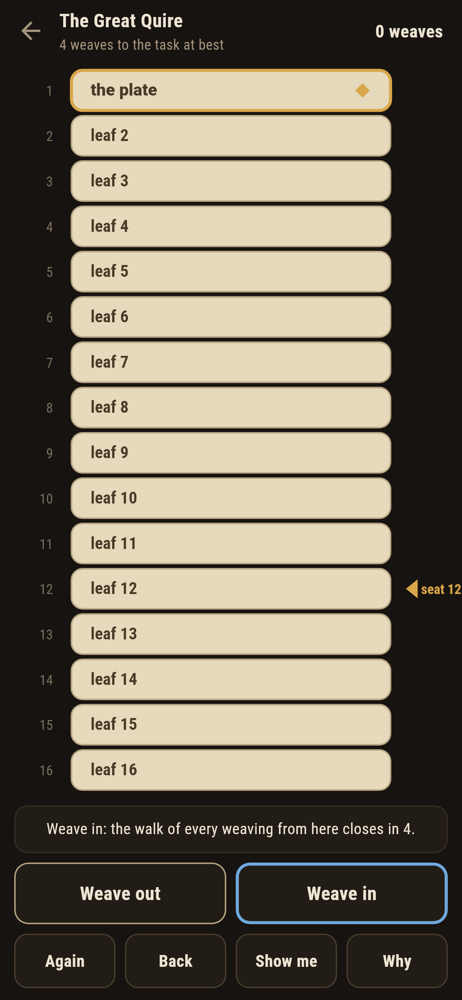

# Quirebeck

A shuffling puzzle for phones, in Flutter, for Android and iOS.

A stack of leaves on the binding bench, and two moves only: the
perfect weave that keeps the first leaf first, and the one that
buries it. Carry the engraved plate to the seat the binder asks, or
put a tangled quire back in bound order. These are the faro shuffles
of the card table worked as bookbinding, and the game's quires carry
the theory whole: the shortest weaving to any seat is the seat's own
figure written in binary, and a single turned pair can never be
mended.

| | | | |
|---|---|---|---|
|  |  |  |  |

## Two ways of knowing

The suite knows every task two ways that share nothing. A walk plays
every weaving out, stack by stack, and never hears of figures; the
figures never weave. The seat words are the walk's own shortest
weavings, checked on every seat of eight leaves and of sixteen; the
turned pair falls to counting, a weave being an even number of swaps
and one turned pair odd, and the walk confirms it from the other
side by reaching all twenty-four stacks there are and finding the
mended one missing. Every written count below is the walk's own.

```
$ make quires
the seat words against the walk of every weaving, every seat of eight leaves and of sixteen: the shortest weaving to a seat is the seat's figure in binary, an in for a one and an out for a nought
every weave is an even count of swaps; a quire of eight reaches 24 stacks of the 40,320 there are, and a single turned pair is none of them
out-weaves come round in 3 on eight leaves, 4 on sixteen, 8 on a full pack of 52

 1 The Second Leaf  8 leaves  the plate to seat 2 in 1 weave
 2 The Fifth Leaf   8 leaves  the plate to seat 5 in 3 weaves
 3 The Seventh Leaf 8 leaves  the plate to seat 7 in 3 weaves
 4 The Great Quire  16 leaves  the plate to seat 12 in 4 weaves
 5 The Broken Stitch 8 leaves  back to bound order in 4 weaves
 6 The Turned Pair  8 leaves  back to bound order, and no weaving ever mends it
```

## The turned pair

Two leaves swapped in the sewing, and the task of putting them right
ships labelled hopeless in the house tradition of maps nobody can
win. Both weaves swap leaves by even counts, so everything a weaving
reaches stands an even count of swaps from bound order, and one
turned pair is odd. The game says so on the way in, the whole world
of the quire's weavings is walked to confirm it, and after eight
weaves the card writes the futility down rather than let anyone
grind at it.



## The seat words

Nothing about the theorem is folklore here. **Why** reads the seat's
figure out in binary and names the weaving it spells, an in for a
one and an out for a nought; on the turned pair it counts the swaps
instead. **Show me** lights the weave the walk closes with, and when
a weave of yours gives the task nothing the game says so and offers
it back. The famous pack is in the ledger too: out-weaves bring
fifty-two cards round in eight, the same way three bring round this
quire of eight leaves.



## Building

```
make deps      # fetch packages
make check     # analyze + every test
make quires    # prove the seat words and the parity against the walk
make shots     # render the screenshots and redraw the icons
make apk       # Android release build
make ios       # iOS release build (unsigned)
```

The logo and every app icon are drawn by the game's own painter in
`test/mark_test.dart`. There is no image in this repository that was not
produced by code in it.

## How it is put together

```
lib/quire/rules.dart      the two weaves, the seat words, the
                          parity, the walk
lib/quire/quire.dart      a quire: its leaves, its task
lib/quire/quires.dart     the six quires that ship
lib/quire/play.dart       a weaving in progress: steps, take-back
lib/ui/                   the painter, the screens, the mark
tool/check_quires.dart    the proofs and the ledger above
```

The tests weave by hand against written-out stacks, prove the seat
words against the walk on every seat of eight leaves and sixteen,
count both weaves even and the turned pair odd, walk the turned
pair's whole world and find no mended stack in it, come round on
eight, sixteen and fifty-two by walk and by figures alike, settle
every winnable quire in exactly its written weaves by following the
game's own pointer, and hold the pictures against the real widget
tree. If any of that drifts, `make check` goes red before anything
leaves the machine.
