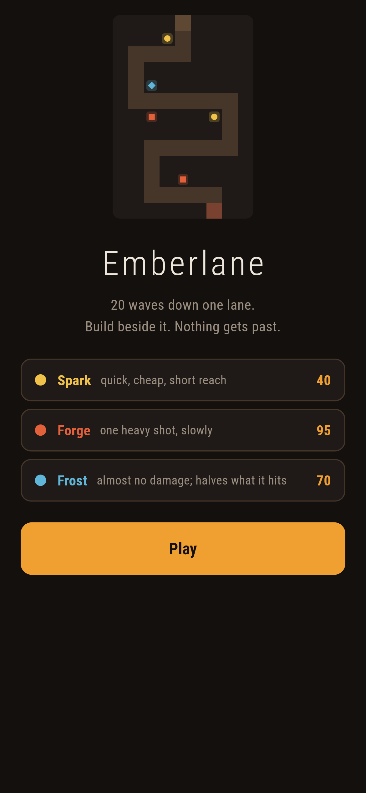
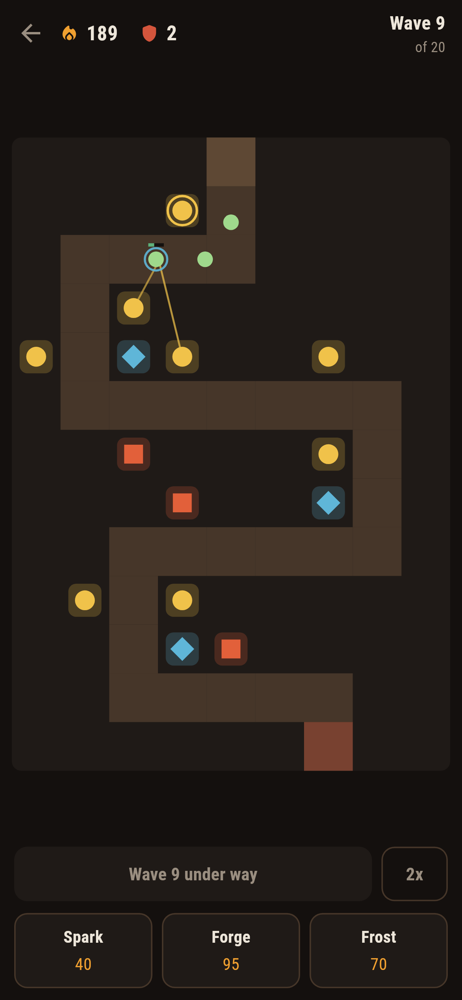
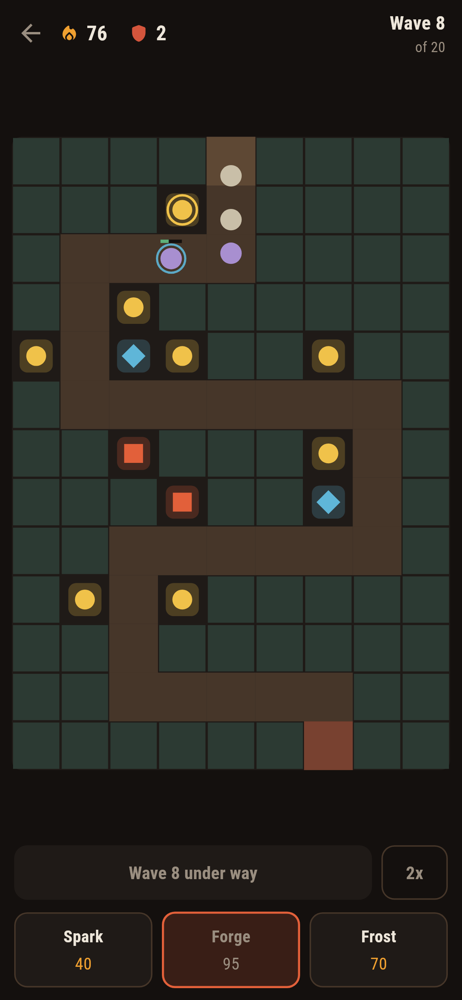
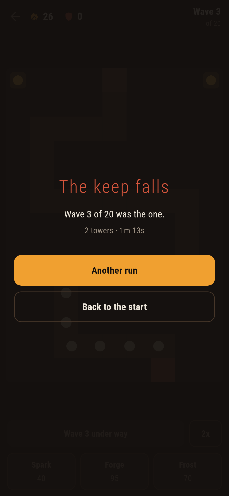

# Emberlane

A lane defence game for phones, in Flutter, for Android and iOS.

Twenty waves come down one winding lane. You cannot block it and you cannot
move it — you build beside it, and what you build has to be enough. Nothing
starts until you send it, so the time between waves is yours.

| | | | |
|---|---|---|---|
|  |  |  |  |

## Three towers, and no one of them is the answer

| | cost | what it does |
|---|---|---|
| **Spark** | 40 | quick, cheap, short reach |
| **Forge** | 95 | one heavy shot, slowly |
| **Frost** | 70 | almost no damage; halves the pace of what it hits |

Two sparks beat one forge against runners and lose badly to a lumberer. A
warded walker shrugs off nearly half of every hit, so how *often* it is hit
matters more than how hard. And frost does almost nothing on its own and is
worth more than either at a corner where the lane doubles back on itself.

## How it is put together

`lib/sim/` is the game and knows nothing about screens.

- `field.dart` — the map. One lane, laid out by hand rather than generated: a
  defence game lives on where its path doubles back and where two stretches
  run close enough that one tower covers both, and a random path has no such
  places in it.
- `kinds.dart` — the four walkers and the three towers, and their numbers.
- `waves.dart` — twenty waves, written down. The shape of a defence game is
  the order its problems arrive in — runners before there is anything quick
  enough to catch them, a lumberer just as the sparks that have been working
  start to look weak — and a generator produces a list with no such moments.
- `run.dart` — the simulation, a sixtieth of a second at a time.
- `plan.dart` — a way of playing, written down, so the game can be played
  without anybody at the controls.

`lib/ui/` draws it. There is no art to load: the lane is rectangles, the
towers are three shapes and the walkers are circles, so it is sharp at any size
and the app ships no images at all — including the logo and the app icon.

## Things worth knowing

**Nothing in the simulation is random.** Not the damage, not the order, not
anything. A defence game with a random spread on its damage is a game where the
same plan wins and loses, and a player cannot tell a bad plan from bad luck. It
also means a run is a pure function of what was built and when — which is what
makes the next part possible.

**The waves were tuned by playing the game a thousand times.** A defence game
is twenty minutes long and its difficulty is an emergent property of about
forty numbers, so playing it by hand after every change is not something
anybody does often enough. `make dryrun` plays it three ways and reports:

```
plan                 waves held  keep left  embers  spent  steps
careful                   20/20          2    3877   2717  22148
one good corner           11/20          0    1068    988  14220
sparks everywhere          2/20          0      26     80   4362
```

The careful player gets through, and only just. The one who builds a good
corner and stops thinking dies in the middle. The one who scatters sparks in
the corners of the field dies at once — a game the careless player also wins is
a game with nothing in it. There is a test for each of those three, because an
unbalanced wave table is a bug no unit test would ever catch.

Two things had to be fixed before that measured anything. The first version of
the plans bought one thing a wave, and the careful one died on wave eleven with
twelve hundred embers in hand — measuring the schedule rather than the game;
orders are now a queue bought as fast as the embers come in. And an order that
could never be carried out, a tower on a lane cell, silently stalled the queue
for the rest of the run, so cannot-yet and cannot-ever are now told apart and
the second one throws.

**A frame is not a step.** The simulation advances a sixtieth of a second at a
time whatever the phone manages to draw, and the leftover is kept between
frames rather than rounded away — rounding it away is how a game runs at a
different speed on a different phone. A frame will catch up at most a quarter
of a second of world time: without that cap, a phone that stalls for two
seconds comes back and runs a hundred and twenty steps in one frame, which
stalls it again.

**A shot stays on screen for a tenth of a second.** The damage is done the
instant it is fired and nothing reads the line back, so it exists entirely to
be seen — and a line drawn for one frame out of sixty is a line the player does
not see, which makes the tower they paid for look broken.

**A tower shoots whichever walker in reach is furthest down the lane** — the
one about to get out, which is the one worth shooting and the one a player
aiming by hand would pick. A tower that seems to shoot at random reads as
broken however good its reasons are.

## Running it

```
make deps      # flutter pub get
make test      # everything
make analyze
make shots     # render the screens into build/showcase, redraw the logo
make dryrun    # play the whole game three ways and report
make apk       # release APK
make ios       # release iOS build, unsigned
```

## Tests

`flutter test` runs the field's shape, every rule about building and selling,
the wave table's timing, what walkers cost and are worth, what frost and a
warded walker actually do to each other measured by playing rather than by
recomputing the formula, and the three balance runs. Then the game itself,
played with a thumb on three phone sizes: building, refusing the lane, refusing
what cannot be paid for, upgrading, selling, sending a wave, the keep falling,
and a run put down mid-wave and picked back up.

Screenshots come from `test/showcase_test.dart` — the real widget tree at real
phone dimensions, drawn by the engine the app uses. The positions in them are
real runs stopped at a moment, because a posed field is a field no run ever
reached and it shows. The one of the keep falling is the careless plan actually
losing.

Pictures of the game on an actual phone come from CI, which is where an
emulator and a simulator can be booted.
