# Thumbworks

Two hundred and eighty one games for phones, in Flutter, for Android and iOS. One repository,
one folder each, and every commit each of them was built with.

They have almost nothing in common as games. There is a nonogram, a siege, a
rhythm game, a minesweeper, a dice race. What they share is underneath, and it
is why they live together: **each one proves the thing it promises.**

| | | |
|---|---|---|
| <div align="center"><br><b><a href="Wirewend">Wirewend</a></b></div> | Turn the wire until the current reaches every lamp | Boards are built solvable rather than generated and hoped over |
| <div align="center"><br><b><a href="Slingwell">Slingwell</a></b></div> | Swing round a gravity well, let go at the right moment | Every well is reachable from the last one, checked by flying it |
| <div align="center"><br><b><a href="Latchword">Latchword</a></b></div> | Drag a thumb across letters and spell what you can | A 44k word list, and a board that always holds enough of them |
| <div align="center"><br><b><a href="Tallyloom">Tallyloom</a></b></div> | A nonogram: the numbers say the runs, you find the squares | No puzzle ships that its line-logic solver could not finish |
| <div align="center"><br><b><a href="Thornguard">Thornguard</a></b></div> | Twelve raiders against a king and four guards | The opening is balanced by self-play, not by feel |
| <div align="center"><br><b><a href="Emberlane">Emberlane</a></b></div> | Twenty waves down one winding lane, and you build beside it | Three written-down plans must finish, struggle and fail |
| <div align="center"><br><b><a href="Fanwright">Fanwright</a></b></div> | Patience with everything face up and four cells to park in | Every deal in the book has been solved before it shipped |
| <div align="center"><br><b><a href="Vaultline">Vaultline</a></b></div> | One button. Tap to hop, hold to go higher | A search over the button proves every stretch is passable |
| <div align="center"><br><b><a href="Chimefall">Chimefall</a></b></div> | Four lanes, notes falling, tap each one as it lands | The music and the chart are one list, and the audio is checked against it |
| <div align="center"><br><b><a href="Chalkway">Chalkway</a></b></div> | Draw a line in chalk and let the ball go | Every level ships a drawing that solves it, and it survives being nudged |
| <div align="center"><br><b><a href="Cinderplot">Cinderplot</a></b></div> | Minesweeper | No board ever needs a guess, and the difficulty label is measured |
| <div align="center"><br><b><a href="Haulyard">Haulyard</a></b></div> | Shove every crate onto a mark | The par on each yard is the proven fewest shoves there are |
| <div align="center"><br><b><a href="Hazardwell">Hazardwell</a></b></div> | Race to a hundred, roll as long as you dare | The house plays exactly optimally, and the table proves itself |
| <div align="center"><br><b><a href="Lockstead">Lockstead</a></b></div> | Find the code: right peg, or right colour in the wrong place | Five guesses is always enough, and the whole strategy tree says so |
| <div align="center"><br><b><a href="Rungwick">Rungwick</a></b></div> | One word to another, a letter at a time, every rung a word | The rungs are the shortest path across the whole word graph |
| <div align="center"><br><b><a href="Cairnfall">Cairnfall</a></b></div> | Take stones off the cairns; take the last one and win | The opponent is a theorem, and a brute-force search checks it |
| <div align="center"><br><b><a href="Rookvale">Rookvale</a></b></div> | Every move a capture; leave one piece standing | Exactly one way through each board, and the whole tree says so |
| <div align="center"><br><b><a href="Wickfell">Wickfell</a></b></div> | Press a lamp; it and its neighbours turn. Put them all out | The fewest presses comes out of linear algebra, not a search |
| <div align="center"><br><b><a href="Skeinmoor">Skeinmoor</a></b></div> | Join each pair of ends, cross nothing, leave no cell bare | Exactly one way of filling each board, orderings and all |
| <div align="center"><br><b><a href="Packwold">Packwold</a></b></div> | Fit the pentominoes into the ground you are given | Dancing links, and the published rectangle counts to prove it |
| <div align="center"><br><b><a href="Hollowmarch">Hollowmarch</a></b></div> | Jump a peg over its neighbour; leave one standing | An invariant rules out where you cannot finish, without searching |
| <div align="center"><br><b><a href="Warrenshaw">Warrenshaw</a></b></div> | You move along a path, then it does. Corner it | A theorem about maps and a table of every position agree exactly |
| <div align="center"><br><b><a href="Reelbury">Reelbury</a></b></div> | Pair two sides up so that nobody would rather swap | There is always such a pairing, and here there is exactly one |
| <div align="center"><br><b><a href="Weirbank">Weirbank</a></b></div> | Send as much water down the pipes as the works will carry | The answer comes with the cut that proves nothing more fits |
| <div align="center"><br><b><a href="Winnowmere">Winnowmere</a></b></div> | Put comparators on lines until every row comes out sorted | Noughts and ones settle it, and the fewest is worked out here |
| <div align="center"><br><b><a href="Carterfen">Carterfen</a></b></div> | Call at every farm on the fen and get the cart home | The shortest round of twelve, without trying forty million orders |
| <div align="center"><br><b><a href="Beaconholt">Beaconholt</a></b></div> | Light beacons until every hill is watched by one | The fewest there are, and the obvious way is one beacon worse |
| <div align="center"><br><b><a href="Rimeworth">Rimeworth</a></b></div> | Salt every lane in the parish, no lane twice | Count the odd junctions and you have the answer, no search at all |
| <div align="center"><br><b><a href="Marchcombe">Marchcombe</a></b></div> | Paint the estate, nothing matching across a hedge | Every map carries a set of fields that proves its own number |
| <div align="center"><br><b><a href="Quayfleet">Quayfleet</a></b></div> | One berth, more ships than it holds. Take the most you can | The obvious rule is right here, and the game hands you the proof |
| <div align="center"><br><b><a href="Churnwick">Churnwick</a></b></div> | Measure an exact churn out of churns that are the wrong sizes | Which amounts are impossible is arithmetic, and it is checked by walking |
| <div align="center"><br><b><a href="Handfast">Handfast</a></b></div> | Give out the day work to the hands who can take it on | The set of jobs that cannot be covered falls out of the failed search |
| <div align="center"><br><b><a href="Pyxholm">Pyxholm</a></b></div> | One coin is the wrong weight. Find it on a balance | Three answers a weighing sets the floor, and the beam plays against you |
| <div align="center"><br><b><a href="Trestlewick">Trestlewick</a></b></div> | Raise a timber frame in the fewest days, with the crews you have | Two floors under it, and every frame ships only if one of them is tight |
| <div align="center"><br><b><a href="Trodstow">Trodstow</a></b></div> | Cut the fewest yards of path that join every hamlet up | It explains every single path, in the answer or not |
| <div align="center"><br><b><a href="Chasegarth">Chasegarth</a></b></div> | Slide loose type about until the line reads right | Half of all arrangements are impossible, and the game proves both halves |
| <div align="center"><br><b><a href="Groatsworth">Groatsworth</a></b></div> | Count out old money in the fewest coins | The real coinage made the obvious way wrong, and the decimal till never does |
| <div align="center"><br><b><a href="Linacre">Linacre</a></b></div> | Cut the telegraph line, or hold it, against perfect play | Two disjoint webs settle the game before it starts, and the game draws them |
| <div align="center"><br><b><a href="Shardlow">Shardlow</a></b></div> | Find the highest rung a pot survives, in certain drops | A morning of drops is a word, and counting the words is exactly the answer |
| <div align="center"><br><b><a href="Staddlestone">Staddlestone</a></b></div> | Move the millstones, never a bigger on a smaller | The doubling argument and a walk of every arrangement agree to nine stones |
| <div align="center"><br><b><a href="Lampwath">Lampwath</a></b></div> | Everybody over the bridge by lantern light | The slow should cross together, except when the trade buys nothing |
| <div align="center"><br><b><a href="Treblesway">Treblesway</a></b></div> | Ring every change on the bells and come round again | One tower cannot, and the reason is an invariant you can watch working |
| <div align="center"><br><b><a href="Foldbury">Foldbury</a></b></div> | Post the fewest shepherds that leave no lane unwatched | The proof is a set of blue lanes on the map, checkable by eye |
| <div align="center"><br><b><a href="Staplemere">Staplemere</a></b></div> | Pile the wool as it comes, in the fewest piles it takes | The answer is the longest rising run, drawn in gold through the yard |
| <div align="center"><br><b><a href="Pinderwell">Pinderwell</a></b></div> | Drive the stray ewe to the pen before the pinder does | The safe squares climb by the golden ratio, proved twice and marked on the grass |
| <div align="center"><br><b><a href="Shroveham">Shroveham</a></b></div> | Flip the cakes until they sit in order, counting every flip | The gap count is a floor you check on the stack, and one batch ships where it falls short |
| <div align="center"><br><b><a href="Smithwaite">Smithwaite</a></b></div> | Work the rings off the smith's bar, two moves at most | The ring pattern read as figures is exactly the distance, checkable over every state |
| <div align="center"><br><b><a href="Dipthorne">Dipthorne</a></b></div> | Pick where to stand before the rhyme starts | The safe seat is the binary turn on two beats, and the reckoning on the rest |
| <div align="center"><br><b><a href="Rindhope">Rindhope</a></b></div> | Bite the cheese, leave the mouse the mouldy crumb | The first mouse provably wins every block, and the proof cannot name the bite |
| <div align="center"><br><b><a href="Colthorpe">Colthorpe</a></b></div> | Ride the colt through every paddock exactly once | Two yards cannot be ridden, one provable on the grass, one only by the walk |
| <div align="center"><br><b><a href="Tallowfield">Tallowfield</a></b></div> | Read three hedge tallies and name the changed lantern | Hamming's code with its geometry showing, and the night it must be wrong |
| <div align="center"><br><b><a href="Pennygill">Pennygill</a></b></div> | Call three flips; the house calls after you | Better-than runs in a ring, drawn whole, with the odds proved two ways |
| <div align="center"><br><b><a href="Spanham">Spanham</a></b></div> | Set the paired blocks each their own number apart | One shelf is impossible by arithmetic done on your fingers, and Why does it for you |
| <div align="center"><br><b><a href="Lockhithe">Lockhithe</a></b></div> | Every sailor hunts their own chit, half the lockers each | Follow the chit you find: the loops decide, drawn as ropes over the doors |
| <div align="center"><br><b><a href="Filberthow">Filberthow</a></b></div> | Take up to twice the last take; the last hazelnut wins | The winning move is the smallest Fibonacci cluster, ringed on the hoard |
| <div align="center"><br><b><a href="Ellmarsh">Ellmarsh</a></b></div> | Cut lengths of the short bolt from the long; last cut keeps the bench | The golden ratio decides it, in whole numbers, with the gap ticked on the cloth |
| <div align="center"><br><b><a href="Withyshaw">Withyshaw</a></b></div> | Cut your withies, never theirs; who cannot cut has lost | Every stalk is worth an exact fraction, written in gold, and the sum is the game |
| <div align="center"><br><b><a href="Millgreave">Millgreave</a></b></div> | Raise a mill in every file; no two share the wind | The counts land to the digit, and a setting can be written down with no search at all |
| <div align="center"><br><b><a href="Frankmoor">Frankmoor</a></b></div> | Two stamps only, and the postage to the penny | Some amounts can never be paid; the largest has a formula, and the proof fits the counter |
| <div align="center"><br><b><a href="Turnstead">Turnstead</a></b></div> | Write the fixture card: everyone plays everyone once | The pigeonhole sets the floor in one breath, and the turning wheel reaches it |
| <div align="center"><br><b><a href="Posygarth">Posygarth</a></b></div> | Each line fair, no pairing twice: two Latin squares in one garden | The plantings write themselves, and the impossible size is swept while you watch |
| <div align="center"><br><b><a href="Fairhold">Fairhold</a></b></div> | Stack four painted crates, all four paints on every side | Posts and ropes do the thinking, and the turning is walked, not waved at |
| <div align="center"><br><b><a href="Tilthway">Tilthway</a></b></div> | Sow the numbered furrows until every seed is home in the barn | One board a size can win, the suite grows it backwards and plays all the rest |
| <div align="center"><br><b><a href="Wickfield">Wickfield</a></b></div> | Press the lamps dark, every press flipping a cross of five | A walk and an elimination agree on all 66,048 small boards, and quiet patterns kill the dead one |
| <div align="center"><br><b><a href="Shuntley">Shuntley</a></b></div> | Slide the numbered tiles home through the one gap | A walk of all 362,880 arrangements meets the reversed-pair parity on every one, and Loyd's swindle ships labelled |
| <div align="center"><br><b><a href="Bannford">Bannford</a></b></div> | Wed the party so that no two people would both rather have each other | Every pairing of every party is swept, the asking-round agrees, and the odd house ships unsettleable |
| <div align="center"><br><b><a href="Bridgeholm">Bridgeholm</a></b></div> | Walk every bridge of a little town exactly once | Landing tallies and a search of every trail agree town by town, and old Königsberg ships unwalkable beside its mend |
| <div align="center"><br><b><a href="Riddlecombe">Riddlecombe</a></b></div> | Weave combs between strands until every mixed grist riddles clean | The nought-one principle is earned on all 1,296 short weaves, and every optimal floor is walked fresh |
| <div align="center"><br><b><a href="Spindlewood">Spindlewood</a></b></div> | Raise the tower on the last spindle, never a round on a smaller one | Doubling rule, executed iteration and a walk of every board agree, and the wager of fourteen ships lost |
| <div align="center"><br><b><a href="Ringmarsh">Ringmarsh</a></b></div> | Turn the lanterns until every run round the ring spells a different word | A sweep counts the de Bruijn rings and the shift-walk builds one, and the seven-lantern ring ships short by pigeonhole |
| <div align="center"><br><b><a href="Shadewell">Shadewell</a></b></div> | Shade the plot until every row and column keeps its tally | The stacking counts every fitting picture and the line-solver reaches it cold, with a two-picture plot and a miscounted one shipped labelled |
| <div align="center"><br><b><a href="Pailsworth">Pailsworth</a></b></div> | Fill, tip and empty the pails until one holds the errand's ask | A walk of every waterline gives the famous fewest, and the third pint ships impossible by the shared measure |
| <div align="center"><br><b><a href="Charmstead">Charmstead</a></b></div> | Lay the nine coins so every row, column and crossway counts fifteen | The counting proves the fifteen and the five-hearted middle, and a sweep of all 362,880 fillings finds the eight charms |
| <div align="center"><br><b><a href="Hirebeck">Hirebeck</a></b></div> | Book the hall for as many hirings as will share it without a clash | Sweep, early-finish rule and piercing o'clocks name one ceiling, and the extra guest ships one over it |
| <div align="center"><br><b><a href="Skittlemere">Skittlemere</a></b></div> | Knock one skittle or two neighbours; the last knock takes the alley | The skittle arithmetic and a search of 507 shapes never part, and the even alley ships lost to the mirror |
| <div align="center"><br><b><a href="Notchfield">Notchfield</a></b></div> | Notch the ruler so no length is measured twice | A sweep of every placing counts the Golomb cuttings, and the perfect ten ships uncuttable with no slack to hide in |
| <div align="center"><br><b><a href="Boardleigh">Boardleigh</a></b></div> | Lay two-cell planks until the whole room is floored | A count of every laying meets the staircase rule on the strips, and the clipped parlour ships unfloorable by its colours |
| <div align="center"><br><b><a href="Ferrydale">Ferrydale</a></b></div> | Row everyone across without leaving the wrong company ashore | A walk of every arrangement gives the famous crossings, and the four-and-four ferry never fills its far bank |
| <div align="center"><br><b><a href="Pegbourne">Pegbourne</a></b></div> | Set the four pegs the way every marked guess allows | All 256 codes are swept against every riddle, the rows judge your code live, and the liar's riddle fits none |
| <div align="center"><br><b><a href="Tanglemere">Tanglemere</a></b></div> | Weave threads and never close a triangle of your own colour | All 32,768 six-post paintings hold a triangle, the counting argument finds it as code, and the search knows whose the win is |
| <div align="center"><br><b><a href="Mottlemoor">Mottlemoor</a></b></div> | Meet the herds until the moor wears one colour | The remainders by three and a walk of every herding agree on all 815 small moors, and the famous thirteen-fifteen-seventeen ships dead |
| <div align="center"><br><b><a href="Mousewold">Mousewold</a></b></div> | Step the cat along the paths and corner the mouse | The folding rule and a search of every chase agree on all 27,475 small grounds, and the ring fence ships with no corner to fold |
| <div align="center"><br><b><a href="Quirebeck">Quirebeck</a></b></div> | Weave a stack of leaves with the binder's two perfect shuffles | The shortest weaving to any seat is the seat's figure in binary, proved against a walk of every weaving, and one turned pair ships unmendable |
| <div align="center"><br><b><a href="Hurdlecote">Hurdlecote</a></b></div> | Raise hurdles on the green and pen exactly what the task asks | Pick's crossing count and the shoelace agree on all 18,934 fences swept, and the third acre ships beyond every fence there is |
| <div align="center"><br><b><a href="Marrowden">Marrowden</a></b></div> | Judge the marrows one at a time against only the seen | The wave-them-by rule's counts are the ceiling of every rule swept, and the sure pick ships hopeless by a fork of two lookalike sittings |
| <div align="center"><br><b><a href="Leystone">Leystone</a></b></div> | Raise standing stones with no three on any straight line | The search raises every ring and plain row-counting bars the odd stone, with the offending ley drawn edge to edge at every refusal |
| <div align="center"><br><b><a href="Peckhollow">Peckhollow</a></b></div> | Turn the pecking arrows and crown the kings the task asks | Every yard has a king and none crowns exactly two, swept over all 1,096 yards of three to five birds, and the crowns move as the arrows turn |
| <div align="center"><br><b><a href="Knuckleby">Knuckleby</a></b></div> | Recut blank dice until every throw falls like the standard pair | The sweep of every pair meets the factor-trade to the last pip, Sicherman's bones wait on the bench, and all-even pips never land a three |
| <div align="center"><br><b><a href="Farthingford">Farthingford</a></b></div> | Wade the stream by mediants and cross at the ford named | The banks' Ford circles kiss exactly while the crossing number holds at one, and no ford ever runs shallower than the mediant between them |
| <div align="center"><br><b><a href="Tussockmere">Tussockmere</a></b></div> | Link your banks across the marsh before the mere links its own | Every filling carries exactly one crossing, the house plays the solved game, the pie rule is judged for real, and the second chair ships lost |
| <div align="center"><br><b><a href="Beadlow">Beadlow</a></b></div> | Dye the beads and shelve every necklace the ring can make | What each turn fixes, summed and divided, agrees with the shelf of every string folded by turning, and the seventh necklace was never there |
| <div align="center"><br><b><a href="Braidfell">Braidfell</a></b></div> | Braid the fleeces into one skein for the least work | Lightest-first meets the sweep of every braid order to the pound, and the fifty-nine ships a pound below everything there is |
| <div align="center"><br><b><a href="Copestone">Copestone</a></b></div> | Raise a drystone wall with no run of courses laid twice over | Two kinds of stone die at the third course, three climb forever, and the palindrome wall stands sound yet pens itself in |
| <div align="center"><br><b><a href="Wardhall">Wardhall</a></b></div> | Post wards at the corners until every flag of the floor is lit | The three-colouring builds a watch from a third of the corners, the sweep finds the true fewest beneath it, and the comb watched short ships dark |
| <div align="center"><br><b><a href="Scoreham">Scoreham</a></b></div> | Walk the tally round the ring and find the starts that never ground | A ring holds exactly as many good starts as it runs ahead, the ebb names one without trying, and the tied vote holds none at all |
| <div align="center"><br><b><a href="Gapstile">Gapstile</a></b></div> | Dial a stride and peg the hoop until the asked number of gap lengths shows | Pegs at a stride's multiples cut a hoop into gaps of at most three lengths, the longest is the other two put together, and a fourth has never once shown |
| <div align="center"><br><b><a href="Borrowfen">Borrowfen</a></b></div> | Lend and borrow over the roads until no house in the village owes | Whether a debt can settle is decided by a burning before a move is made, the tidy spreads number exactly the spanning trees, and one short pound can never be got clear |
| <div align="center"><br><b><a href="Chainhurst">Chainhurst</a></b></div> | Set stones on the field and land the asked number of bare chains | Stones not all in one row always show a chain through exactly two, counted by strung lines and by thirds over all 68,080 placings, and four stones only ever show nought, three or six |
| <div align="center"><br><b><a href="Sashmoor">Sashmoor</a></b></div> | Glaze the sash without four panes ever framing a window | Nine panes is the four-by-four's proven limit with every row-pair spent exactly once, and the tenth is barred by finger-counting: ten panes spend eight row-pairs where the sash owns six |
| <div align="center"><br><b><a href="Wickthorn">Wickthorn</a></b></div> | Rope lanterns three at a time until every pair shares exactly one | Seven lanterns close in seven ropes exactly thirty ways, all of them the Fano plane, and six lanterns never close: each would need two and a half ropes |
| <div align="center"><br><b><a href="Stackholt">Stackholt</a></b></div> | Spin and tip the painted boxes until every wall shows every paint once | The old four-box puzzle counted honest: 24 settlings wearing down to three, five fair picks pairing into three pencil factorings, and a red stack doomed by thirteen faces where a stack carries twelve |
| <div align="center"><br><b><a href="Brackenside">Brackenside</a></b></div> | Plant the hillside and land the asked number of three-plant patches | Sperner's lemma with the rim showing: one bracken-gorse edge on the boundary forces every patch count odd, swept over all 759 plantings, and one planting in 729 shows eleven |
| <div align="center"><br><b><a href="Tetherdown">Tetherdown</a></b></div> | Rope the posts and knot no triangle | Mantel's fence line at a quarter of the square, matched by pasture arithmetic on every down, with every fullest tethering splitting into two pastures and the seventh rope on five posts knotting all 120 ways |
| <div align="center"><br><b><a href="Stitchfen">Stitchfen</a></b></div> | Thread the sampler row with no three evenly spaced stitches sharing a colour | Van der Waerden's wall made playable: 20, 16 and 6 threadings survive at six, seven and eight stitches, every three-stitch beginning finishes at most one way, and the ninth stitch ladders all 512 |
| <div align="center"><br><b><a href="Crookmarsh">Crookmarsh</a></b></div> | Stand posts, none three to a line, and land the asked number of true frames | The happy ending theorem swept: every clear five of the 1,668 holds one, three or five frames and never none, judged by a tuck test and a hull walk that agree on every four |
| <div align="center"><br><b><a href="Wirecombe">Wirecombe</a></b></div> | Wire the cottages into one connected run | Cayley's count made playable: 3, 16 and 125 runs by size, every run coding to its Prufer word and back, every run keeping two lane's ends lit, and a run with none two line-ends short by arithmetic |
| <div align="center"><br><b><a href="Pigeonwick">Pigeonwick</a></b></div> | Post every letter to the wrong pigeonhole | Derangements counted three ways that never part, sweep, recurrence and the figure by e: 2, 9 and 44, with exactly three home of four nobody's round since the fourth would hold only its own hole |
| <div align="center"><br><b><a href="Greetley">Greetley</a></b></div> | Shake hands on the lawn until the asked number of guests are odd-handed | The handshake lemma at a fete: every shake hands out two, so the odd-handed always pair off, the all-even lawns number a power of two, and one lone hand up is nobody's lawn |
| <div align="center"><br><b><a href="Shelfham">Shelfham</a></b></div> | Shelve the books with exactly the asked number of steps down | Euler's numbers on a bookshelf: the rows run 1, 11, 11, 1 and 1, 26, 66, 26, 1, read the same both ways by the reversal, and a fourth step wants a gap no shelf of four owns |
| <div align="center"><br><b><a href="Pursewell">Pursewell</a></b></div> | Pay every price in Fibonacci coins with no two neighbouring denominations | Zeckendorf's theorem at the counter: every purse from one to a hundred pays exactly one way, the greedy coin finds it every time, and the second way does not exist to find |
| <div align="center"><br><b><a href="Fanleigh">Fanleigh</a></b></div> | Fold the paddock into pens with hurdles that never cross | Catalan's counts and the two-ears theorem: five and fourteen foldings, no two of the hexagon's wearing the same crown, and every one keeping at least two posts on a single pen |
| <div align="center"><br><b><a href="Addlemoor">Addlemoor</a></b></div> | Paint the stones so no stone is the sum of two sharing its paint | Schur's walls exactly where he left them: two paints die at the fifth stone, three at the fourteenth, eighteen paintings survive at thirteen and not one of them stretches a stone further |
| <div align="center"><br><b><a href="Marklow">Marklow</a></b></div> | Number the posts so the lines wear every gap once, one up to the count of lines | Graceful numberings counted whole: four for the path of four, twelve for the star, sixteen for the square, the mirror of a graceful numbering always graceful, and the five-ring barred by parity, asking an odd sum where every ring pays even |
| <div align="center"><br><b><a href="Hamperfen">Hamperfen</a></b></div> | Take baskets from the hamper so no basket swallows another | Sperner's antichain over sixteen baskets: the middle shelf of six is the one and only six, every five is that shelf less a basket, and the LYM twelfths spend the dozen whole exactly when a shelf is taken entire |
| <div align="center"><br><b><a href="Beamsworth">Beamsworth</a></b></div> | Hang weights whose parcels all read different on the beam | Distinct subset sums on a rack of twelve: two hundred and six clean threes narrow to a single clean six, and any seven weights hang a hundred and twenty-seven parcels on readings that stop at a hundred and twenty-five |
| <div align="center"><br><b><a href="Noughtsmill">Noughtsmill</a></b></div> | Wind the mill till the factorial ends in the asked noughts | Legendre's count held against the factorial itself, wound nought to two hundred: the noughts jump four to six at twenty-five, and the skipped counts run five, eleven, seventeen, twenty-three and twenty-nine, six apart, one for each twenty-five |
| <div align="center"><br><b><a href="Matchcote">Matchcote</a></b></div> | Pair the players round by round till every pair has met once | Round-robin fixtures counted whole: the six of four players are one schedule worn six ways, the 720 of six are six bare schedules times the orders of their rounds, and five players never fill a single round |
| <div align="center"><br><b><a href="Coursewell">Coursewell</a></b></div> | Brick the yard with dominoes and land the asked count of seams | Domino fault lines counted whole: five by six lays sound exactly six ways, the smallest yard two cells wide both ways that does, and the six-square never lays sound, ten lines wanting twenty crossings where eighteen bricks carry eighteen |
| <div align="center"><br><b><a href="Acreford">Acreford</a></b></div> | Fence the paddock post by post and read the acres two ways | Pick's theorem held on every paddock there is: the rails' crossing sum agrees with the post count on all 2,274, a bare rim of four posts writes only the even half-acres two through ten, and two acres and a half always drops a post onto a rail |
| <div align="center"><br><b><a href="Peckthorne">Peckthorne</a></b></div> | Flip who pecks whom and crown exactly the asked kings | Tournament kings held over every pecking there is: the busiest pecker is always crowned, a lone king is always an emperor, four chickens never crown all four, and no yard of any size crowns exactly two |
| <div align="center"><br><b><a href="Wantley">Wantley</a></b></div> | Tread footpaths till every farm gets the count it wished for | Degree sequences settled three ways at once: the sweep of every treading, Erdos and Gallai's arithmetic, and Havel and Hakimi's build agree on every wish list of four and five farms, and an even wish sum still fails where the top wishes overreach |
| <div align="center"><br><b><a href="Squarholt">Squarholt</a></b></div> | Grow two square tiles until they pay the hoard exactly | Fermat's two squares dialled whole: every prime one past a four-times under a hundred writes once, sixty-five writes twice by Brahmagupta's identity one sign each, and three past a four-times never writes at all |
| <div align="center"><br><b><a href="Thrissleton">Thrissleton</a></b></div> | Dial five stones and land the asked count of thirds | Erdos, Ginzburg and Ziv on one hand of stones: the count of triples summing to a three-times lands only on one, four or ten across all 7,776 hands, ten exactly when one remainder rules, and never on nought |
| <div align="center"><br><b><a href="Daisyholme">Daisyholme</a></b></div> | Befriend the circle till every pair shares exactly one friend | The friendship theorem wired whole: every landing is a daisy with somebody at its heart, the count is hearts times pairings on every crowd, and an even crowd never manages it, since anyone's friends pair off around them |
| <div align="center"><br><b><a href="Inkfen">Inkfen</a></b></div> | Ink the bunting so no two strings share a post in one ink | Edge colouring on the washing lines: paths and even rings take two inks two ways each, the full four takes exactly the six orders of its three matchings, and the odd ring refuses two inks outright, its alternation coming home wrong |
| <div align="center"><br><b><a href="Rackenford">Rackenford</a></b></div> | Rack the jars so no rack holds a jar and its divisor | Mirsky's law in a jam pantry: the racks you need are exactly the longest divisor chain, the height racking lands with no searching, and the dozen fits four racks but never three, its chain of one, two, four, eight taking one rack apiece |
| <div align="center"><br><b><a href="Slicebury">Slicebury</a></b></div> | Set candles on the cake rim and count the slices the knife makes | Moser's circle counted whole: the slices double to sixteen at every pick of five, then six candles cut thirty-one, or thirty where three knife lines clump through a point, and never thirty-two |
| <div align="center"><br><b><a href="Watchmere">Watchmere</a></b></div> | Slide night watches along the mere wall till every pair shares an hour | Helly's law on a line: when every pair of watches overlaps, the latest riser and the earliest sleeper name an hour inside all of them, held over 729 diallings of three and 5,040 of four; the Sundered Watch ships hopeless because that named pair cannot part |
| <div align="center"><br><b><a href="Sortlow">Sortlow</a></b></div> | Dial four digits and grind them down to Kaprekar's stone | Kaprekar's constant walked forward and tabled backwards over all 9,990 allowed loads: every one arrives at 6174 by the seventh turn, three turns is the commonest road, and The Eighth Turn ships hopeless because the table stops at seven |
| <div align="center"><br><b><a href="Dealstone">Dealstone</a></b></div> | Pile stones and deal one from every pile into a new one | Bulgarian solitaire under Brandt's theorem: every hand of a triangular count walks to the staircase and stays, only staircases stand still, the sweep deals all 11, 22 and 42 hands of six, eight and ten, and The Eight Standstill ships hopeless because no stair holds eight |
| <div align="center"><br><b><a href="Starholme">Starholme</a></b></div> | Walk closed rounds along the lanes of Petersen's star | Petersen's graph counted whole: twelve pentagons, ten hexagons, fifteen eights and twenty nines, never a seven-round, and The Full Round ships hopeless because all ten posts walk as an open trail and the closing lane never exists |
| <div align="center"><br><b><a href="Clinkfield">Clinkfield</a></b></div> | Clink glasses round the feast till the counts stand as asked | The pigeonhole law on clinking: the counts can never all differ, since the wallflower who clinked nobody cannot share a feast with the toast of the table who clinked everyone, swept over all 64 feasts of four and 1,024 of five, and The All Different ships hopeless |
| <div align="center"><br><b><a href="Oddrow">Oddrow</a></b></div> | Wind Pascal's wall to a row holding the odd numbers asked | Lucas' law on Pascal's triangle: an entry is odd exactly when its place's bits fit the row's, so the odd count doubles per lit bit and is a power of two always, three voices agreeing on rows nought to fifteen, and The Three Odds ships hopeless |
| <div align="center"><br><b><a href="Foursworth">Foursworth</a></b></div> | Dial the windows and take differences round the ring till all go dark | Ducci's walk: four windows always go dark by the seventh turn, since four turns leave every face even and evens halve to a smaller game, checked across all 4,096 diallings, while three windows circle for ever unless they start alike, and The Three Turns ships hopeless |
| <div align="center"><br><b><a href="Tablesham">Tablesham</a></b></div> | Seat the husbands between the wives so no couple sits together | The menage problem swept and held to Touchard's arithmetic: nought ways for two couples, one for three, two for four, thirteen for five and five with the host held in his chair, and The Two Couples ships hopeless because a circle of four seats both wives beside every husband |
| <div align="center"><br><b><a href="Studwell">Studwell</a></b></div> | Pave the court round the well with elbow flags | L-tromino tilings swept whole: the four-court paves round every one of its sixteen wells exactly once, as Golomb's quartering lays it, the five-court only where the well is a stud, one stud to an elbow, and The Stray Well ships hopeless because nine studs outnumber eight elbows |
| <div align="center"><br><b><a href="Evenholt">Evenholt</a></b></div> | Share the tokens two trays even in sums, squares and cubes | Prouhet's doubling pattern held to the sweep of every half-and-half share: the one share of eight that squares and the one of sixteen that cubes are both his, sums agree 1, 4, 29 and 263 ways and his polynomial divides by one less x exactly one time more than the powers that agree, while The Four Squared ships hopeless because the three pairings square to 17 and 13 |
| <div align="center"><br><b><a href="Frogmere">Frogmere</a></b></div> | Leap frogs above the reeds, solitaire-wise | Conway's soldiers with the golden ratio done exactly: every road to the first four reaches counted, 1, 1, 8 and 369,106,018 of them, the four landing armies weighing exactly one so every road spends every frog, and The Fifth Reach ships hopeless because the whole pond below the reeds weighs exactly one against it while a frog on the aim weighs one alone |
| <div align="center"><br><b><a href="Setwick">Setwick</a></b></div> | Pair the dancers off so every pair comes to one over the caller | Wilson's theorem as a set dance: every pairing of every set swept, 3 and 105 and 945 and 135,135 of them, exactly one landing for each prime caller and it is Bezout's pair for pair, the whole set multiplied coming to one less than the caller for every prime to thirty, and The Set of Nine ships hopeless because dancers 3 and 6 come to one with nobody |
| <div align="center"><br><b><a href="Sweetleigh">Sweetleigh</a></b></div> | Cut the sweet string in few places and share the pieces fair | Necklace splitting swept whole: two kinds share with two cuts on all 70 strings of four and four and all 924 of six and six, the sliding window built for each, three kinds with three cuts on all 90 strings of two, two and two, and The Single Cut ships hopeless because reds-then-blues holds all four reds in any first piece with two blues |
| <div align="center"><br><b><a href="Shiftwell">Shiftwell</a></b></div> | Finish the four-rota from the shifts fixed | Latin square completion swept whole, Evans and Smetaniuk held to it: 576 rotas of four, 24 from a fixed first day, every one of the 25,920 sound fills of three shifts finishing and 13,824 of the 239,760 fills of four never, and The Stuck Shift ships hopeless because one shift has no hand left for it |
| <div align="center"><br><b><a href="Kerbwell">Kerbwell</a></b></div> | Lay the slabs joined inside the shortest kerb | Harary and Harborth's shortest kerb held to the sweep of every joined placing of up to ten slabs, 25 through 39,622 of them, twice the least whole number not below twice the square root of the count, 4, 6, 8, 8, 10, 10, 12, 12, 12 and 14, the box round a placing never kerbed longer than the placing, and The Five in Eight ships hopeless because five slabs need a box of two by three |
| <div align="center"><br><b><a href="Loafham">Loafham</a></b></div> | Cut the share of loaf as unit fractions, no two alike | Egyptian fractions and Fibonacci's greedy cut swept over every set of cuts from a half to a twenty-fourth: two of three only as a half and a sixth, four of five two ways in three cuts, nine of ten one way, five of seven two ways though the greedy cut wants a seventieth, and The Two Cuts ships hopeless because a half leaves three tenths and no half leaves seven twelfths at the most |
| <div align="center"><br><b><a href="Trayford">Trayford</a></b></div> | Fill the egg tray to the count that leaves the asked over | Sun Tzu's problem and the Chinese remainder theorem swept over every count of the tray: by threes and fives, fives and sevens, and threes, fives and sevens each asking is met by exactly one count below the span and it is Sun Tzu's construction to the egg, by fours and sixes only the askings agreeing on the shared two are met at all, and The Odd and Even ships hopeless because one over by fours with two over by sixes is odd against even |
| <div align="center"><br><b><a href="Riffleford">Riffleford</a></b></div> | Cut the deck, turn the packet, riffle so every pair is mixed | Gilbreath's principle dealt out riffle by riffle: with the packet turned every one of the 56, 70 and 126 riffles deals every pair or triple mixed, since the piles read the pattern in opposite directions and their tops differ at every pair's start, the even cut unturned lands only 6 riffles of 70, and The Two Reds ships hopeless because no riffle of the turned odd cut ever pairs two reds |
| <div align="center"><br><b><a href="Thirdwell">Thirdwell</a></b></div> | Deal the counters into three columns and walk yours to its place | Gergonne's twenty-seven-card trick dealt out for every counter and every run of three placings, 729 runs, every one landing where the arithmetic says, the placings read as digits in threes with the first deal the units, so each of the 27 places is reached by exactly one run, while two deals reach nine places only, and The Top in Two ships hopeless because counter 17 never reaches the top in two |
| <div align="center"><br><b><a href="Rowsworth">Rowsworth</a></b></div> | Pick a heap of pebbles that lays out in exactly so many even rows | The divisor count of every heap up to a hundred read two ways, by laying the pebbles out in every row length by trial and by the product of the prime powers each raised by one, the two agreeing there and on to a thousand: seven even rows come from sixty-four alone, nine from thirty-six and a hundred, ten from forty-eight and eighty, twelve from sixty first, and The Thirteen Rows ships hopeless because a prime count of rows is a single prime raised, and two to the twelfth is four thousand and ninety-six |
| <div align="center"><br><b><a href="Steedwick">Steedwick</a></b></div> | Ride the four steeds round the nine stalls as a knight moves, and swap the pale for the dark | Guarini's 1512 knight-swap puzzle on the three-by-three paddock, every standing ridden to from home, 280 of the 1,680, and they are exactly the standings that keep home's order round the ring of outer stalls, since a knight's moves there run round in one ring and steeds on a ring cannot pass: the colour swap takes sixteen moves and comes out one way only, sixteen being as far as any standing lies, and The Pale Swap ships hopeless because the two pale steeds can never change places round the ring |
| <div align="center"><br><b><a href="Foldwick">Foldwick</a></b></div> | Pass the sheep and the goats to the other ends of the plank, a step or a jump at a time | Lucas's sheep-and-goats crossing of 1883 walked whole, no beast ever going back: with m sheep and n goats the crossing takes m times n plus m plus n moves and exactly that however it is done, one and one in 3, two and two in 8, three and two in 11, three and three in 15, two crossings apiece and mirrors of one another, every crossing taking the sheep times the goats jumps and the sheep plus the goats steps, and The Steps Alone ships hopeless because without a jump the order along the plank never changes and the fold is stuck in two moves |
| <div align="center"><br><b><a href="Stillmere">Stillmere</a></b></div> | Light exactly so many lanterns on the mere so that Conway's rule leaves the picture still | Still lifes in Conway's Game of Life swept whole on the mere and the rule run on the whole plane: four lanterns lie still 25 ways in two shapes, sixteen blocks and nine tubs, five 36 ways in the boat's four turnings, six 94 ways in fourteen shapes and seven 76 ways in twenty, and The Three Lights ships hopeless because every light needs two lit neighbours, so three sit in one corner of a square, and the fourth corner has three lit neighbours and lights |
| <div align="center"><br><b><a href="Midford">Midford</a></b></div> | Set four pegs so that the figure joining the midpoints of their cords is a rectangle, a rhombus or a square | Varignon's parallelogram of 1731 swept over every ordered four of pegs on the board, 303,600 of them, the midpoint figure read two ways, off its own corners and off the diagonals: a parallelogram every time, a rectangle 27,952 times, a rhombus 18,384, a square 11,248, flat 27,872, since each side of the midpoint figure is half a diagonal of the four, and The Skew ships hopeless because the midpoint figure is never skew |
| <div align="center"><br><b><a href="Wheelford">Wheelford</a></b></div> | Cord three pegs on the rim of a wheel into a triangle with a square corner, or four into a square | Thales' theorem on a wheel five spokes across with twelve pegs on its rim, every three of them corded, 220 triangles, and every corner tested two ways, by the dot product and by whether the cord across runs through the hub: sixty triangles have a square corner and every one looks across at a diameter, forty are sharp all round and a hundred and twenty blunt, three of the 495 fours are squares, and The Off Diameter ships hopeless because no square corner on the wheel ever looks across at anything but a diameter |
| <div align="center"><br><b><a href="Evenmoor">Evenmoor</a></b></div> | Set pegs on a five-by-five moor so that the halfway posts between them land on holes, or keep off them | The pigeonhole in its plainest clothes: halfway between two whole numbers is whole only when both are even or both odd, so a hole is one of four kinds and two pegs of a kind always land their post; every placing of three, four and five pegs is swept, 2,300, 12,650 and 53,130, and every post read two ways, four pegs keeping every post off 1,296 ways, one to a kind, five pegs landing one post 13,608 ways and all ten 138, and The Five Apart ships hopeless because four kinds cannot hold five pegs one apiece |
| <div align="center"><br><b><a href="Slateford">Slateford</a></b></div> | Play noughts and crosses against a book of eight rules, and draw, or win where the book slipped | The whole tree of noughts and crosses walked, 255,168 games over 5,478 slates, its word on the open slate level, and the book of eight rules, win, block, fork, block the fork, middle, opposite corner, corner, side, held to that tree at every move of every game against it and never losing: 457 games from the open slate with you as crosses, 111 level and none won, and The Cross Wins ships hopeless because if the crosses had a winning way the noughts could take it first, and the tree finds none |
| <div align="center"><br><b><a href="Patchmere">Patchmere</a></b></div> | Sew the last two-patch on the quilt against a house that mirrors you across the middle | Cram and the mirror strategy: on a quilt even both ways no patch is its own mirror, so the second sewer answering every patch across the middle can never be the one left without a move, and on a quilt with one side odd the first sewer takes the middle patch and mirrors after; every game against the house is sewn out on every quilt, and the mirror is held to the game tree on every quilt of up to twenty cells, 65,756 and 11,739 games, and The Four by Four ships hopeless because the house mirrors you to the end |
| <div align="center"><br><b><a href="Knotford">Knotford</a></b></div> | Stand two pegs on a knotted rope so the triangle it stretches round has a square corner | The rope-stretchers' knots and Euclid's formula: every marking of every rope to two hundred knots is swept, and the right triangles it finds are exactly the ones Euclid writes from two numbers, k times m squared less n squared, twice mn and m squared plus n squared, 32 ropes squaring and 43 triangles among them, none shorter than twelve knots, and The Odd Rope ships hopeless because the remainders of squares by four fix the three sides even in sum |
| <div align="center"><br><b><a href="Throwsden">Throwsden</a></b></div> | Line the wrestlers up so each threw the next, and close them into a ring | Redei and Camion on tournaments: every yard of three to six wrestlers is taken whole, 8 and 64 and 1,024 and 32,768 of them, and a line where each threw the next always exists and always in an odd number of ways, Redei's slotting finding one with no search; a ring closes exactly when every wrestler can reach every other along the throws, and The Champion's Ring ships hopeless because nobody threw Eli, so nobody can stand before him |
| <div align="center"><br><b><a href="Stilemere">Stilemere</a></b></div> | Walk a hedged field from the gate to the mill, right and up only, over the stiles and round the ponds | Lattice paths and Pascal's rule: every route of every field is walked and counted three ways that agree, by the walk, by Pascal's rule at every junction and by the binomial, on every open field to eight by eight; the routes over a stile are the product of the two legs, the routes round a pond are Pascal's rule with the pond struck out, and The Crossed Stiles ships hopeless because from either stile the other lies below or to the left, and the walk never goes back |
| <div align="center"><br><b><a href="Stookwell">Stookwell</a></b></div> | Stand the sheaves in stooks, all of different sizes or all odd | Euler's partition theorem: for any harvest the standings in stooks all of different sizes are exactly as many as those in stooks all odd, every partition of every harvest to thirty walked and Euler's two products agreeing with the walk to sixty sheaves, Glaisher's turn of the hand taken both ways on 1,806 partitions and always coming back; The Four Stooks of Nine ships hopeless because four stooks of different sizes hold ten sheaves at the least |
| <div align="center"><br><b><a href="Mitrewick">Mitrewick</a></b></div> | Stand bishops on a small board with none on another's diagonal | The most peaceful bishops on an n by n board is 2n - 2, and never one more: one bishop at most to each of the 2n - 1 rising diagonals, and the two single-square ones sit in corners that share the long falling diagonal; every setting of every board to four a side is swept and the count read again diagonal by diagonal, the settings of the most doubling with every side, 4, 8, 16, 32, 64, 128, and The Seven ships hopeless because the diagonals said so |
| <div align="center"><br><b><a href="Ledgeworth">Ledgeworth</a></b></div> | Lean books over the desk edge so the top one hangs out as far as it will | The block-stacking problem and the harmonic numbers: the top of a standing stack hangs out at most 1/2 + 1/4 + 1/6 + ..., half the harmonic number, every stack on the twenty-fourths swept to five books, nearly ten million of them, the harmonic stack reaching the sweep's best every time, four books clearing a whole book and The Three shipping hopeless because half, a quarter and a sixth are eleven twelfths |
| <div align="center"><br><b><a href="Milesworth">Milesworth</a></b></div> | Mark a run of two or more milestones along the lane that add to the count asked | Polite numbers: a count is a run of two or more consecutive numbers exactly when it is not a power of two, and the runs are one to each odd divisor past one, since an odd run is its length times its middle stone and an even run is half its length times the sum of its two middle stones; every run on every lane to two hundred is swept and the odd divisors build the same runs one for one, and The Sixteen ships hopeless because a power of two has no odd factor |
| <div align="center"><br><b><a href="Capwick">Capwick</a></b></div> | Call the colour of your own cap from what you see ahead and hear behind, and save all but the first man | The hat-line parity plan: the man at the back calls the parity of the black caps ahead and every man after him counts, so all but the first are saved whatever the caps, the plan run down every deal of every line to eight men; the first can never be saved by any plan, every plan of his counted for lines to five and each right on exactly half the deals, and The Five Saved ships hopeless because a warden caps the first man against his word |
| <div align="center"><br><b><a href="Rowsden">Rowsden</a></b></div> | Walk the nine schoolgirls out in rows of three, day after day, so every pair walks together once | Kirkman's schoolgirls at nine, the smallest such school: each girl meets two a day and has eight to meet, so the week is four days and no fewer, and four days do it by rows, columns and the two slants of the three-by-three, the affine plane of order three; every filling of every week is swept, 72 whole weeks following the first day, and The Three Days ships hopeless because three days walk 27 pairs at the most |
| <div align="center"><br><b><a href="Cubewick">Cubewick</a></b></div> | Tile a hexagon on the triangular grid with lozenges, and see the cubes stacked in a box | MacMahon's lozenge tilings: shade the three leans and every tiling of the hexagon of sides a, b and c is a stack of cubes in an a by b by c box, counted by the product over the box of (i + j + k - 1) over (i + j + k - 2), 2, 6, 20, 175, 980 and 232,848 for the four-box, every tiling swept and every stack walked; The Chipped Box ships hopeless because a lozenge covers one up triangle and one down, and the chipped box has ten and twelve |
| <div align="center"><br><b><a href="Weighwick">Weighwick</a></b></div> | Balance a load on a market scale with the weights 1, 3, 9 and 27 on either pan | Bachet's weights: every whole load from one to forty balances with 1, 3, 9 and 27 placed across, beside or off, each in exactly one way, since counting in threes with the digits 1, 0 and -1 writes each number one way; all 81 placings swept and they weigh 81 different amounts, -40 to 40, and the counting names the same placing for every load; The Ten Without the One ships hopeless because the 3, 9 and 27 weigh multiples of three however they stand |
| <div align="center"><br><b><a href="Cloakwell">Cloakwell</a></b></div> | Sort numbered coats on a row of hooks by swapping neighbours, in the fewest swaps | Inversions: the fewest swaps of neighbours that sort a row is exactly the count of pairs out of order, since a swap mends or breaks the one pair it touches and no other; every row of up to six coats, 873 of them, searched nearest-first and the count is the fewest every time, every sequence of swaps swept for every rail, and the sign of a row by its cycles is the parity of the count; The Five Swaps ships hopeless because six pairs hang askew and one swap mends one pair at the most |
| <div align="center"><br><b><a href="Fusewick">Fusewick</a></b></div> | Light uneven hour-long fuses at their ends and strike a given minute | The burning-fuse puzzle: a fuse burns an hour from end to end but unevenly, so only the whole can be trusted, an hour lit at one end and half an hour lit at both, and ends may be lit only at the start or at a burnout; every plan of one, two and three fuses is swept in quarter-minutes, two fuses strike only 30, 45, 60, 90 and 120, three add 52 and a half, 67 and a half, 75, 105, 150 and 180, and every show-me plan is played through the game to the minute; The Twenty ships hopeless because nothing burns out before thirty |
| <div align="center"><br><b><a href="Trickmere">Trickmere</a></b></div> | Hide one of five dealt cards and lay the other four so a partner names it | Fitch Cheney's five-card trick: of five cards two share a suit, of any two ranks one is within six steps of the other round through the king to the ace, and three cards lie low, middle and high in six orders, so the row always tells the hidden card; every layout of every hand here is swept, the six orders checked on all 22,100 threes of the deck, and the assistant's rule run on all 2,598,960 hands of five; The Lone Club ships hopeless because the card that must be hidden is the only one of its suit, and no club is left to say so |
| <div align="center"><br><b><a href="Cupwell">Cupwell</a></b></div> | Right a tray of cups, some upside down, turning exactly so many at once | The cup-turning parity puzzle: a turn of an even number of cups changes the count down by an even number, so an odd count down never comes right turning an even number at a time, while an odd count turned reaches every tray; every tray of two to six cups is walked from every start with every count turned, every sequence of turns for every tray here is swept, and the parity law is held to the walk; The One of Three ships hopeless because one cup down among three, turned two at a time, stays odd for ever |
| <div align="center"><br><b><a href="Suppermere">Suppermere</a></b></div> | Seat quarrelling guests at two tables so no two who quarrel share one | Konig's theorem on bipartite graphs: two tables suffice exactly when no odd ring of quarrels runs through the guests, since round a ring the tables must alternate; every seating of every supper here is swept, a walk seats any hall with no odd ring and traces the ring back where it clashes, and on all 1,024 quarrel maps of five guests the sweep, the walk and the odd ring agree, the seatings then numbering two to the parties; The Five Ring ships hopeless because five in a ring cannot alternate |
| <div align="center"><br><b><a href="Whistlecote">Whistlecote</a></b></div> | Give a shepherd's dog its calls in whistles no call begins another | Kraft's inequality: a prefix code with given lengths exists exactly when the shares 2 to the minus length add to no more than the whole, and the count of codes is the product of the free choices length by length; every marking of every set here is swept, the shepherd's greedy way marks with no search, and on every set of up to six calls of up to four notes, 209 sets, the sweep, the shares and the shepherd agree; The Crowded Calls ships hopeless because its shares come to nine of eight |
| <div align="center"><br><b><a href="Copperwick">Copperwick</a></b></div> | Turn a triangle of pennies upside down by sliding as few as may be | The penny-triangle puzzle: ten pennies turn in three moves and never in two, since however the turned triangle lies over the pennies each of its rows shares at most the shorter of its own length and the row under it, so it takes in at most seven of the ten as they lie; in general the fewest is a third of the pennies rounded down, every placement of the turned triangle swept over every triangle up to twelve rows, and every sequence of moves on the small tables; The Ten in Two ships hopeless because the rows count seven at the most |
| <div align="center"><br><b><a href="Farrierstead">Farrierstead</a></b></div> | Set as many knights on a chequered board as will stand with none a knight's move from another | The knights problem: the most is half the board rounded up, since the squares pair off as knight's moves and two knights on one pair attack, so at most one stands on each; the game finds that pairing on every board from three to seven, one colour of squares seats exactly that many since a knight always lands on the other colour, and every setting is swept on the small boards, 5,224,736 held up one by one, the sweep, the pairing and the colour agreeing; The Nine ships hopeless because eight pairs seat eight at most, and the why counts them |
| <div align="center"><br><b><a href="Slantbury">Slantbury</a></b></div> | Lay the four pieces of a cut-up square inside a frame that seems a square too big | The missing-square puzzle: an eight-by-eight cut into two triangles and two trapeziums seems to make a thirteen-by-five, sixty-four squares in a frame of sixty-five; the pieces do lie inside with no overlap, two ways of 6,533,136 layings, and each time one square stays bare, a sliver along the slant, since the triangle rises three in eight, the trapezium two in five and the frame five in thirteen; every area is an exact fraction, every laying is swept, and Cassini's identity says why to the fortieth Fibonacci number; The Frame Filled ships hopeless because the areas differ by one, and the why counts the squares |
| <div align="center"><br><b><a href="Brickholme">Brickholme</a></b></div> | Pave a square yard with one drain in it using bricks three flags long | Golomb's straight-tromino question of 1954: colour the flags along one slant in three colours and along the other in three again, and every brick covers one of each colour either way, so the drain must wear the odd colour of both slants; the four yard paves round its corners only, the five round its middle, the seven round nine flags and the eight round four, 356 pavings each, and every yard from four to eleven is walked with the drain on every flag, 375 yards, the walk finding a paving exactly when the colouring allows one; The Corner Drain ships hopeless because the corner wears the wrong colour, and the flags left bare are never one of each |
| <div align="center"><br><b><a href="Crownwick">Crownwick</a></b></div> | Set as many kings on a chequered board as will stand with none touching another | The kings problem: the most is half the side rounded up, squared, since the board cuts into two-by-two blocks from a corner and any two squares of a block touch, so each block holds one king at most, while the even squares put one king in every block with none touching; the three by three seats four one way of 126, the corners, the five by five nine one way alone of 2,042,975, the even squares, and every setting is swept on the small boards, 2,049,289 held up one by one, the sweep, the walk and the blocks agreeing on every board from two to seven; The Five ships hopeless because four blocks seat four at most, and the why counts them |
| <div align="center"><br><b><a href="Combwell">Combwell</a></b></div> | Fill the nineteen cells of the magic hexagon so every line of the comb sums alike | The magic hexagon: the sum can only be thirty-eight, since the five rows take every number from 1 to 19 once and 190 is five 38s, and there is exactly one comb that does it, the one Clifford Adams found in 1957 after forty-seven years of trying, in its six turnings and six reflections; the game fills the comb every way, forced cell by forced cell, and finds those twelve and no more, and none at all for 36, 37, 39 or 40; The Thirty-Seven ships hopeless because the rows say 38, and the why counts them |
| <div align="center"><br><b><a href="Cutlassby">Cutlassby</a></b></div> | Divide ten coins among the pirates so the captain's plan passes the vote | The pirate game: every pirate votes for what pays him against what he would get with the captain gone, reckoned from the crew one smaller down to one pirate alone; two pirates and the captain keeps all ten, three nine, four nine, five eight, the old answer, eight, nought, one, nought, one; every division of the ten coins is swept for crews of one to seven, 12,376 plans, and the best plan is one alone every time, the captain keeping the gold less half the crew rounded down; The Greedy Captain ships hopeless because nine among five never passes, and the why reckons the crew backwards |
| <div align="center"><br><b><a href="Cutmere">Cutmere</a></b></div> | Find the coin among the casks in the fewest questions, the cellarman answering to keep you guessing | Binary search against an adversary: three questions find the coin among eight casks, cutting the middle every time, four among sixteen, seven among a hundred, and three never among nine, since three yes-or-no answers tell eight casks apart at most; the game walks the whole game tree for every row up to two hundred casks and finds the fewest questions to be exactly the least k with 2 to the k at least the casks, the middle cut a best first cut on every one; The Nine ships hopeless because eight answers cannot tell nine casks apart, and the why counts the answers |
| <div align="center"><br><b><a href="Squarebrook">Squarebrook</a></b></div> | Make the number of square flagstones from the mason's rack, the same stone as often as you like | Lagrange's four squares and Legendre's three: every number is four squares at most and 835 of the first thousand are three, exactly the numbers not four to a power times seven more than a multiple of eight, since a square leaves 0, 1 or 4 by eight and no three of those add to 7; the game sweeps every picking of stones for every number on the sham, twelve three squares one way of ten, fifty two squares two ways of twenty-eight, the smallest number that is two squares two ways, and makes every number to a thousand with the fewest squares, holding both theorems to the sweep; Seven in Three ships hopeless because a square leaves 0, 1 or 4 by eight, and the why counts by eight |
| <div align="center"><br><b><a href="Halvingham">Halvingham</a></b></div> | Keep the rows of the peasant's halving-and-doubling so the doubles kept add to the product | Russian or Egyptian peasant multiplication, as old as the Rhind papyrus: halve one number row by row and double the other beside it, and the doubles beside the odd halves add to the product, since a half is odd exactly when that row's two is in the first number and a number is its twos one way only; the game sweeps every keeping of the rows for every pair to sixty by sixty, 3,600 ledgers and 18,180 rows, and finds the odd rows' keeping the only one that lands every time, thirteen by seven one keeping of sixteen; Thirteen by Seven in Two ships hopeless because thirteen is three twos, not two, and the why spells the twos |
| <div align="center">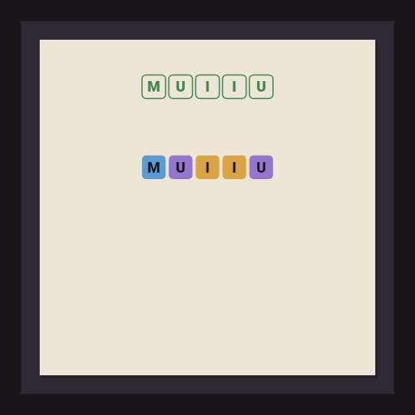<br><b><a href="Muxholme">Muxholme</a></b></div> | Derive the string asked from MI by Hofstadter's four rules of letters | Hofstadter's MU puzzle: start with MI, add a U after an I, double what follows the M, turn III to U or drop UU, and derive MIU in one step, MUI in three, MUIIU in five, and MU never, since two rules leave the count of I, one doubles it and one takes three away, and from one, doubling and taking three never make a multiple of three; the game walks every string reachable on a sheet of twenty-four letters, 106,389, finds the count of I a multiple of three in none, and finds every string of the right shape up to eight letters among them, 169, and nothing else; MU ships hopeless because MU has nought I and nought is a multiple of three, and the why counts the I |
| <div align="center"><br><b><a href="Turnwick">Turnwick</a></b></div> | Cut the pack and turn the top two over as one till the faces asked lie up | Bob Hummer's cut-and-turn principle: the top two cards lie at an even place and an odd one and swap as they flip, so the count of cards face up at even places and the count at odd move together, a cut swaps the two, and from nought and nought they stay equal for ever; the game walks every pack of four, six and eight cards from all face down, 48, 1,440 and 80,640 packs, finds the count holding on every one and the patterns reached exactly those that keep it, 6 of 16, 20 of 64 and 70 of 256; One Card Up ships hopeless because one card up alone breaks the count, and the why counts even against odd |
| <div align="center">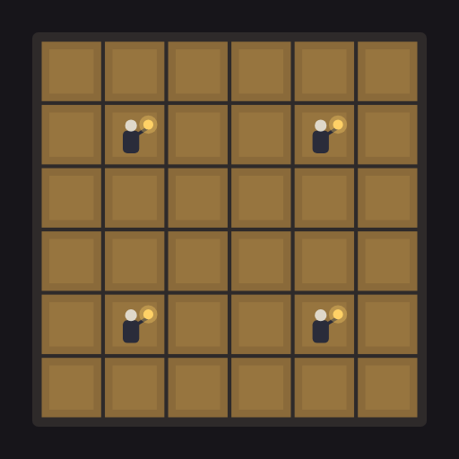<br><b><a href="Watchcombe">Watchcombe</a></b></div> | Post the fewest watchmen in a courtyard of flags so that every flag is watched, each watching his own and the eight round it | Kings domination: the fewest watchmen for an n by n yard is a third of the side rounded up, squared, since the flags in the rows and columns that are multiples of three lie beyond one another's watch and each wants a watchman of its own, while a watchman one in from each of them watches the whole yard; the game sweeps every posting on the four, five and six yards, 80,515 postings, walks every yard from three to nine from the first unwatched flag, and finds the sweep, the walk and the far flags agreeing, the six yard watched by four one way only and the nine yard by nine one way only; The Six Yard with Three ships hopeless because the six yard holds four far flags, and the why counts them |
| <div align="center">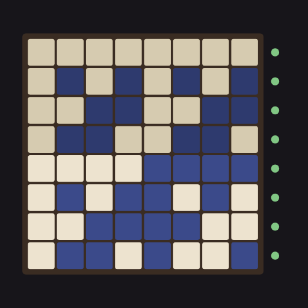<br><b><a href="Weaveholme">Weaveholme</a></b></div> | Weave a plaid of light and dark squares so that every two rows agree in exactly half their squares | Hadamard matrices as a plaid: two by two weaves eight ways of sixteen, four by four 768 of 65,536, eight by eight by Sylvester's laying of the four four times with the last quarter turned, and six by six never, since turning whole columns till the first row is all light changes no agreement and against it two other rows agree in an even count; the game sweeps every filling of the two and the four, walks the eight row by row over Sylvester's rows, and sweeps every triple of rows of six, 262,144, none agreeing pairwise in three; The Six ships hopeless because no three rows of six agree pairwise in three squares, and the why turns the columns |
| <div align="center">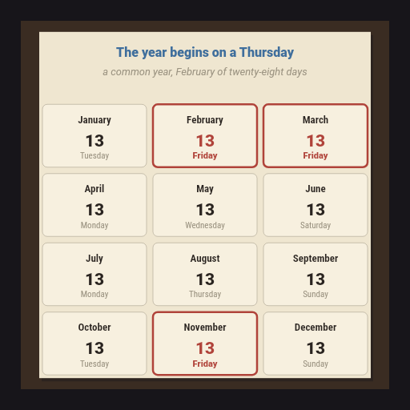<br><b><a href="Fridayford">Fridayford</a></b></div> | Move the first of January along the week, make February short or long, and ring the Fridays that fall on a thirteenth | Every year has a Friday the thirteenth and never more than three: the thirteenth of each month falls a fixed count of days along the week from the first of January, nought, three, three, six, one, four, six, two, five, nought, three and five in a common year and nought, three, four, nought, two, five, nought, three, six, one, four and six in a leap year, and those counts take in every day of the week, none of them more than three times; the game sweeps all fourteen kinds of year and walks the 200 real years from 1901 to 2100 day by day by the phone's own calendar, 86 with one Friday and 29 with three; No Friday ships hopeless because the counts cover the week, and the why counts the days along it |
| <div align="center">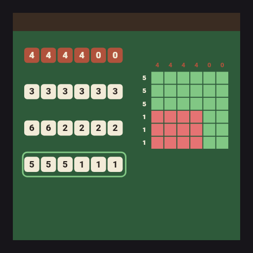<br><b><a href="Loadwick">Loadwick</a></b></div> | Pick the die that beats the one the house rolled, from four dice with odd faces | Efron's nontransitive dice: A beats B, B beats C, C beats D and D beats A, 24 rolls of 36 each, so whichever die the house takes there is one that beats it and no die beats all the others; the game counts every roll of every pair, wins, ties and losses coming to thirty-six every time, and sweeps every die of six faces from nought to six against the four, 924 dice, 96 of which beat all four; The Champion ships hopeless because each of the four loses to the one before it round the ring, and the why walks the ring |
| <div align="center"><br><b><a href="Leechmere">Leechmere</a></b></div> | Set how many patients each healer sees in each season, and watch the year turn against the better healer | Simpson's paradox: Ash cures nine in ten in spring and three in ten in autumn, Birch eight and two, so Ash is the better healer in both seasons at every load, and yet Ash cures the smaller share of the year on 154 of the 625 settings, since the year is the seasons weighed by the patients seen; with the loads alike for both healers, 25 settings, Ash is ahead by one in ten exactly, every time; every setting is swept with exact fractions |
| <div align="center">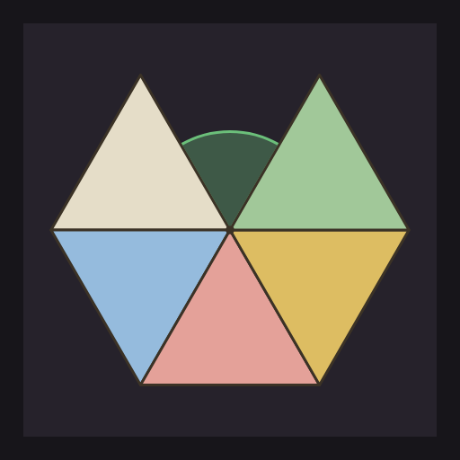<br><b><a href="Wedgeworth">Wedgeworth</a></b></div> | Fan regular faces round a point and see which corners close and which lie flat or overlap | The five regular solids, by the angles at a corner: a face of p sides has corners of 180(p - 2)/p degrees, so a corner closes only when the faces at it come to less than a full turn, which happens for three, four or five triangles, three squares and three pentagons and nothing else; three hexagons make 360 exactly and lie flat like a comb, and Euler's corners less edges plus faces coming to two picks out the same five; every angle is kept as an exact fraction of a degree and every setting of face and fan is swept; The Honeycomb Corner ships hopeless because three hexagons already fill the turn |
| <div align="center">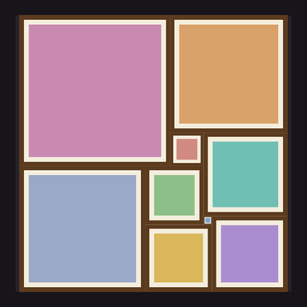<br><b><a href="Framley">Framley</a></b></div> | Hang square picture frames, no two alike, edge to edge, to fill a gallery wall exactly | Perfect squared rectangles: Moron's two of 1925, thirty-two by thirty-three hung with the nine frames 1 to 18 and sixty-one by sixty-nine with nine from 2 to 36, and a wall of ten, forty-seven by sixty-five; every hanging of each is found twice, by filling the first bare cell row by row and again column by column, four to a wall and one but for turning and mirroring, and the areas add up to 1,056, 4,209 and 3,055; The One on the Rim ships hopeless because the smallest frame can never touch the rim, where it would sit in a well as wide as itself with nothing narrow enough to cover the cell above it |
| <div align="center">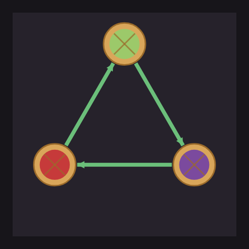<br><b><a href="Crustleigh">Crustleigh</a></b></div> | Rank the pies on three judges' cards and watch the majority run in a ring | Condorcet's paradox at the village show: every judge ranks the pies straight and still apple beats bramble, bramble beats cherry and cherry beats apple, on twelve of the 216 shows of three pies, exactly the shows whose three ballots are the three turnings of one ranking; with three pies a pie that beats every other head to head is always somebody's first choice, and with four the modest winner comes and so does a winner who loses on points; every show of three ballots is swept and every count read twice; The Modest Winner ships hopeless because a pie first on no ballot cannot beat both the others |
| <div align="center">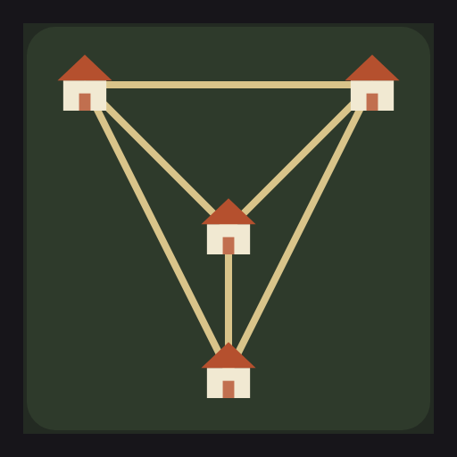<br><b><a href="Laneford">Laneford</a></b></div> | Stand the hamlets on the green so that no two lanes cross | Planarity and Euler's formula: hamlets less lanes plus faces comes to two, so a green of straight lanes with no crossings has at most 3v - 6 lanes, and at most 2v - 4 when the hamlets are of two kinds with lanes only between the kinds; three hamlets each laned to three is nine lanes over six hamlets of two kinds against a ceiling of eight, so the ninth always crosses; every placing of the hamlets on the grid is swept and every crossing judged by whole-number cross products, with Fary's theorem behind the straight lanes; The Three and the Three ships hopeless because Euler will not have it |
| <div align="center">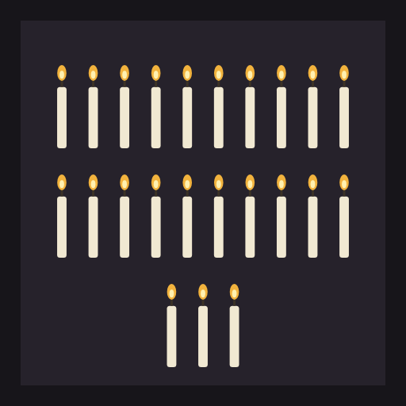<br><b><a href="Candleford">Candleford</a></b></div> | Add guests to the party and watch the chance of a shared birthday climb | The birthday paradox as exact fractions: with d days and n guests the chance that no two share is d(d-1)...(d-n+1) over d to the n, so the chance of a share passes a half at twenty-three guests, 50.7297 in a hundred, nine in ten at forty-one, ninety-nine in a hundred at fifty-seven, and certainty at 366 by the pigeonhole while 365 guests can still all differ; every party is worked in whole numbers and checked against a literal count of every way to give the guests a day on the small years; The Certain Party ships hopeless because 365 guests can always be kept apart |
| <div align="center"><br><b><a href="Cornerstow">Cornerstow</a></b></div> | Pave the yard with square flags, one of one, two of two and on, and see the cubes make a square | Nicomachus's theorem as paving: the cubes of one to n added come to the square of one to n added, so k flags of k by k for every k pave a square yard whose side is one plus two plus three and on; the picture proof lays them band by band round the corner, band k running k times k over two plus half a k along each arm, so an odd band lays k whole flags and an even one lays k - 1 whole and two halves, which is why the whole flags alone never pave; every paving of every yard is found twice, row by row and column by column, and Nicomachus's own paving is laid by formula to the thirty-six by thirty-six |
| <div align="center">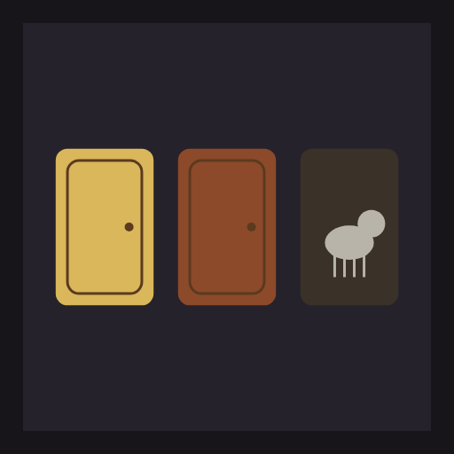<br><b><a href="Goatsbridge">Goatsbridge</a></b></div> | Pick a door at the fair, watch the host open the goats, and stay or switch | The Monty Hall problem for n doors and k opened: staying wins one game in n, switching wins n - 1 in n and then lands the cart one time in n - 1 - k, since the host opens only goats and leaves the cart among fewer doors; three doors and one opened is two in three, ten and eight is nine in ten, ten and one is nine in eighty, the least switching ever gains and still more than staying; every case of every one of the 72 settings is counted in exact fractions and held to the formula, which counts nothing; The Stay ships hopeless because 1/(n - 1 - k) beats 1/(n - 1) whenever the host opens a door at all |
| <div align="center">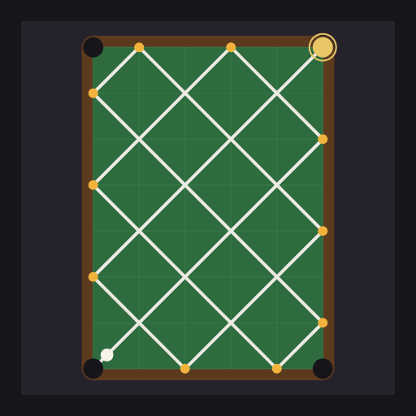<br><b><a href="Baizewell">Baizewell</a></b></div> | Shoot a ball across a billiard table at forty-five degrees and watch it find a pocket | Unfolding a billiard path: reflect the table at every cushion and the bouncing path straightens into the diagonal of a grid, so the ball pockets after the least common multiple of the sides in steps, having crossed q/g tables along and p/g up with g the sides' common factor; which pocket is the parity of those two counts, and the bounces are the counts less two; the ball is rolled step by step on all 841 tables to thirty a side and agrees with the rule on every one; The Home Pocket ships hopeless because the two counts have had their common factor divided out and so are never both even |
| <div align="center">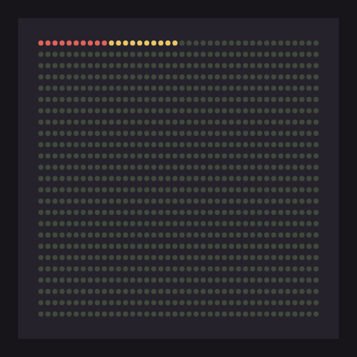<br><b><a href="Fevershaw">Fevershaw</a></b></div> | Set a fever and a test and count how many of the flagged villagers are really ill | Bayes' theorem read as counting heads: the share of the flagged who are ill is the fever times the catch over that plus the rest of the village times the alarm, so a small alarm on the many well outweighs a big catch on the few ill; a fever of one in a hundred with a test right ninety-nine times in a hundred makes a flag right one time in two, and at one in a thousand it drops to eleven times in 122; every setting is counted in whole souls and held to exact fractions of chances; The Sure Flag ships hopeless because a test that ever flags a well villager can never make a flag certain |
| <div align="center">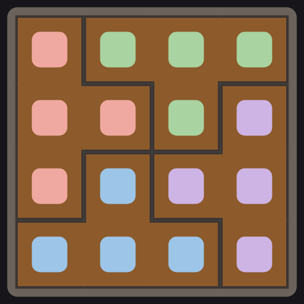<br><b><a href="Bakerley">Bakerley</a></b></div> | Turn and flip gingerbread fours and lay them so the baking tray fills exactly | The tetromino colouring argument: chequer the tray and every four but the tee covers two dark and two light whichever way it lies, while the tee covers three of one shade and one of the other, so a tray of equal dark and light needs an even number of tees; one of each of the five fours therefore never fills the five-by-four, eleven and nine against ten and ten; every filling of every tray is found twice, row by row over the first bare cell and again column by column, and six tees on the six-by-four pass the colouring and still fill nothing, which only the search can say; The Five ships hopeless because the colouring forbids it |
| <div align="center">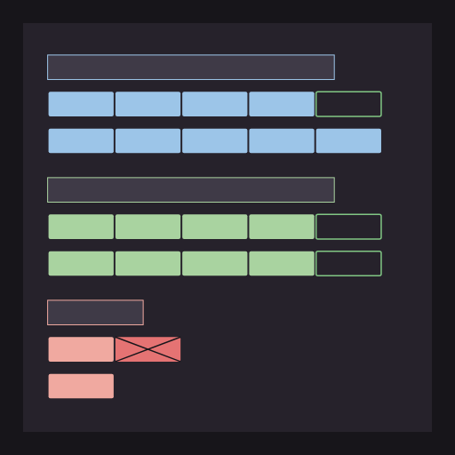<br><b><a href="Mootbury">Mootbury</a></b></div> | Size the shire moot and watch a hamlet lose the seat it already had | The Alabama paradox: sharing seats by largest remainders gives each hamlet its quota rounded down and the leftovers to the largest fractions, so growing the moot by one seat can take a seat away, as with hamlets of 6, 6 and 2 hundred where ten seats share 4, 4, 2 and eleven share 5, 5, 1; dealing one seat at a time never does that, since a seat once dealt is never taken back, but dealing can hand a hamlet more than its quota rounded up, which largest remainders never do; every moot to sixty is shared both ways on five sets of hamlets, the dealing held to the divisor reading and largest remainders held within the quota; The Jefferson Paradox ships hopeless |
| <div align="center"><br><b><a href="Almsford">Almsford</a></b></div> | Share grain between five bins, a measure at a time, and watch the fullest bin only fall | Majorization and the Robin Hood transfer: a share moves one measure from a bin at least two ahead of another, so it can never raise the fullest bin, nor the two fullest together, nor the three, and a shape can be reached from another exactly when every one of those running totals is no greater; all 1,001 arrangements are walked in full and held against the totals on all 30,030 pairs, the level field is under every shape and is the one arrangement where nothing can move, and The One Heap ships hopeless because once grain has been spread it cannot be gathered |
| <div align="center"><br><b><a href="Arrowmere">Arrowmere</a></b></div> | Turn every street of the village one-way and still be able to get anywhere from anywhere | Robbins' theorem, from Herbert Robbins in 1939: a joined village can be made one-way throughout exactly when no street is a bridge, a street whose closing would cut the village in two; one side is plain, since a bridge pointed one way strands whatever is behind it, and the other is the work of the theorem; every pointing of every village on the sham is walked in full and held against the bridge count, and The Toll Lane ships hopeless because its one street is a bridge |
| <div align="center"><br><b><a href="Beadmere">Beadmere</a></b></div> | String beads light and dark so the strip repeats two ways at once and no shorter way | The Fine and Wilf periodicity theorem of 1965: a strip carrying repeats p and q and running to p plus q less their greatest common divisor must carry that divisor as a repeat as well, so for repeats with nothing in common every bead comes out the same colour; the length is sharp, and one bead shorter there are strips with both repeats and not the divisor, which for neighbouring Fibonacci numbers are the Fibonacci strips; every strip the board can hold is swept and every repeat read twice; One Too Long ships hopeless because seven beads is exactly the length the theorem bites at |
| <div align="center">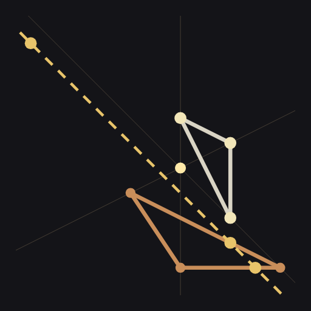<br><b><a href="Beamsley">Beamsley</a></b></div> | Set three pegs about a lantern and cast a shadow triangle from it, then find where matching sides meet | Desargues from 1639: two triangles in perspective from a point have their three pairs of matching sides meeting on one line, the axis, whatever the pegs and whatever the multiples; where matching sides run parallel the meeting runs off to infinity and the theorem still holds, which is why it is stated in the projective plane; every triangle of the field and every casting is swept, 511,488 settings, the meetings found once as homogeneous whole numbers and once as plain fractions; The Crooked Axis ships hopeless because the axis is never crooked |
| <div align="center"><br><b><a href="Benchwood">Benchwood</a></b></div> | Work a job card at a joiner's bench, choosing which tool to carry back when the bench is full | Belady 1966: carrying back the tool whose next call is furthest off cannot be beaten, proved by an exchange that takes any way of working the card, mends its first disagreement with the rule, and never raises the walks; it needs the whole card in advance, which is why a real bench cannot follow it, and the screen writes each tool's next call over it so the rule is something to see; Belady's own 1969 card shows the anomaly, seven walks on three slots and six on four by the rule but nine then ten by carrying back the oldest; The Three Walks ships hopeless because three tools need three fetches and the bench holds two |
| <div align="center">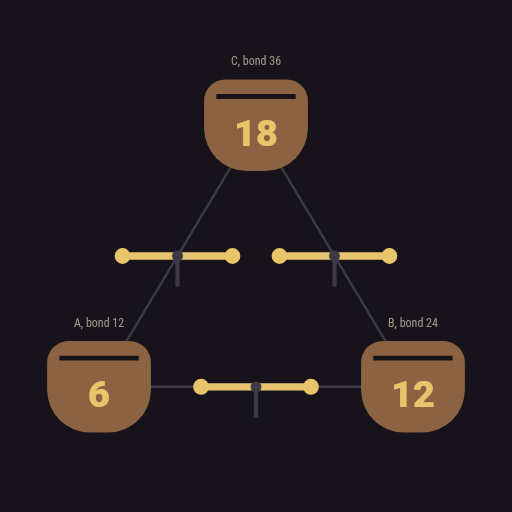<br><b><a href="Bondwell">Bondwell</a></b></div> | Divide an estate among three heirs whose bonds come to more than it holds, until every pair of scales hangs level | Aumann and Maschler 1985 read the Talmud's three-widow table at Ketubot 93a as one rule rather than three: each row is the division where every pair of heirs splits what the two of them hold by the contested-garment rule of Bava Metzia 1:1, and each is the nucleolus of the bankruptcy game; each of the four estates has exactly one division that levels all three scales, out of 91, 325, 703 and 1,225; Reward the Long Bond ships hopeless because twelve coins is no more than any bond, so nobody can concede and every pair must split dead even |
| <div align="center">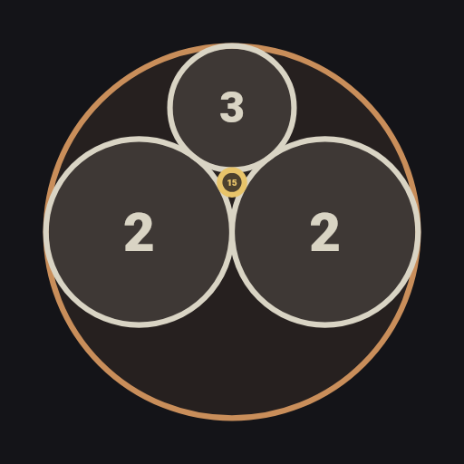<br><b><a href="Bubbleford">Bubbleford</a></b></div> | Step the bends of three kissing bubbles and watch the two fourths that kiss all three | Descartes 1643, in a letter to Princess Elisabeth of Bohemia, and Soddy's verse of 1936: the four bends of four kissing bubbles satisfy the sum squared equalling twice the sum of the squares, so the fourth bend is a plus b plus c give or take twice the root of ab plus bc plus ca; every setting of the three dials from 1 to 20 is swept, 8,000 of them, both fourths worked by the formula and each checked against every whole bend; 27 settings ring the three with a unit bubble and 33 flatten the outer one to a straight line; The Twin Fourths ships hopeless because the two fourths differ by four times a root that is never nothing |
| <div align="center">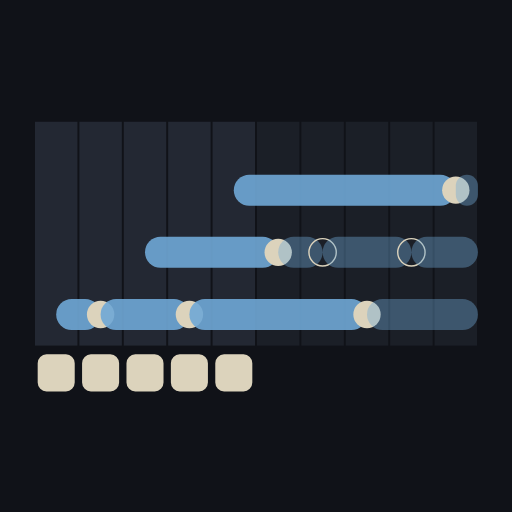<br><b><a href="Beatstow">Beatstow</a></b></div> | Lay five throws on a ring of five beats so no two balls come down together | A throw of height h laid on beat i comes down at beat i plus h, counted round the ring, so a laying juggles exactly when the five landing beats are all different, and when a rack juggles the balls in the air come to the plain average of the throws, a whole number every time; every rack of five single-figure throws is walked before the bake, 2,002 of them, and every laying of every one, 100,000 layings, with three voices agreeing on all of them and 3,840 juggling; 402 racks of the 2,002 both juggle some way and have a total that goes round the beats evenly, with no rack doing one and not the other; The Raised Throw ships hopeless because 3, 3, 3, 3 and 4 add to 16, 16 into 5 will not go, and four throws go down ten different ways before the fifth is refused from every free beat |
| <div align="center"><br><b><a href="Cantlemere">Cantlemere</a></b></div> | Tap three pegs at a time to cut a nine acre field into plots | Monsky 1970: a square cannot be cut into an odd number of plots of equal size, and he proved it for every cut of a square, not only for cuts with their corners on pegs; every cut of the nine acre field with corners on the 16 pegs is walked before the bake, all 26,822,326 of them, laid over the 624 cells that the 62 lines through the pegs cut the field into, with a second voice that knows nothing of cells agreeing on all 10,830 cuts into six plots or fewer; the pegs take 4 red, 8 blue and 4 green, the rim steps between red and blue 3 times, an odd number, so every cut has a plot wearing all three colours, and every one of the 128 such plots is an odd number of half acres; The Even Three ships hopeless because each of the 32 three-plot cuts comes out 3, 6 and 9 half acres, half is not a third, and a third of 18 is 6, which is not odd |
| <div align="center"><br><b><a href="Caskleigh">Caskleigh</a></b></div> | Move the two ends of a run of casks and watch the casks fill the barrels | Jozsef Kurschak 1918, with another proof from Paul Erdos in 1932, in his second paper, by Bertrand's postulate: the casks hold a whole barrel, a half, a third and on down to a sixtieth, and no run of two or more of them adds to a whole barrel, since exactly one cask of any run holds more twos in its number than the rest, so over the smallest common bottom that one goes in an odd number of times and every other an even number, leaving an odd top over an even bottom; every run the cellar allows is walked, 1,770 of them over the 60 casks, each added twice, once cask by cask in exact fractions and once over the smallest common bottom in whole numbers; 683 runs pass a barrel, 251 pass two, 90 pass three, and one alone comes out in halves exactly, the first two casks at 3/2; The Whole Barrel ships hopeless because an odd over an even is not a whole number |
| <div align="center"><br><b><a href="Cellarwick">Cellarwick</a></b></div> | Set the glasses and the spoon, then carry a spoon of wine across and a spoon back | Carry a spoon of wine into the water and a spoon of the mixture back, and the wine glass ends holding just what it began with, so the water in it fills exactly the room the missing wine left and every drop of that missing wine is in the water glass, which makes the two amounts equal whatever the stirring; every setting of the two glasses and the spoon is poured in exact fractions, one to ten units in each glass and one to five in the spoon, 500 settings, the spoon too big for the wine in 100 of them and the other 400 poured three ways, well stirred, unstirred with the wine afloat and unstirred with the wine sunk, 1,200 pourings; well stirred the spoon back carries spoon times water over water plus spoon units of water home, one unit comes back 9 ways of the 500, whole units 24 ways, and the water glass ends half wine 40 ways; The Unequal ships hopeless because the wine the first glass lost is exactly the water that took its place, and that lost wine is all in the other glass |
| <div align="center">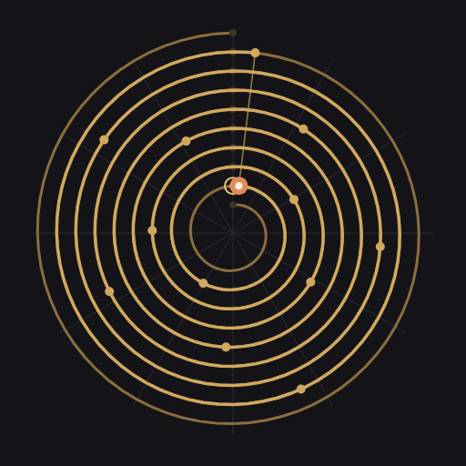<br><b><a href="Chimewell">Chimewell</a></b></div> | Stack fifths and octaves on the coil and watch the note climb | A fifth is three halves of a note and an octave twice it, so every note the two dials reach is 3 to the fifths over 2 to something; twelve fifths up climb 531,441/4,096 and seven octaves down leave 531,441/524,288, the comma, 23.46 cents sharp of the start, which is why the piano's fifths are all a shade flat, 700 cents to the pure 701.96, the comma spread over the twelve; every setting of the two dials is swept as exact fractions and held against the cents, fifths from twelve down to twelve up and octaves from eight down to eight up, 425 settings, and only twelve fifths, up or down, come within a twentieth of home, 2 settings of the 425; The Return ships hopeless because 3 to any power is odd and 2 to any power even, so no stack with a fifth in it ever comes home |
| <div align="center">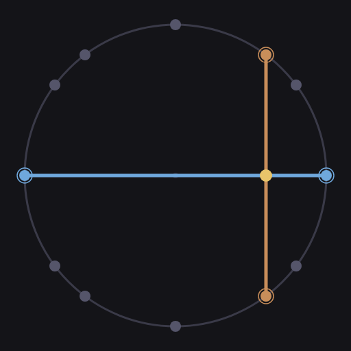<br><b><a href="Chordwell">Chordwell</a></b></div> | Tap four pegs of the wheel, two to a chord, and watch what the pieces multiply to | Euclid, the thirty-fifth of his third book: two chords of a circle cross at a point P and PA times PB is PC times PD, since joining A to C and B to D gives triangles PAC and PDB with the same angles, the angles at A and D standing on the same arc, so their sides are in proportion; the amount is the power of the point, the radius squared less its distance from the middle squared; the twelve whole points on the circle of radius five are the pegs, 66 chords run between them, and every four pegs give exactly one pair of chords that cross, 495 crossings, each worked as an exact point with both products taken and held against 25 less the distance from the middle squared, agreeing on all 495; 15 crossings fall at the middle, 4 multiply to 9, 48 to 20 and 64 cut a chord in half away from the middle; The Odd Cross ships hopeless because those two triangles make the two products equal at every crossing |
| <div align="center">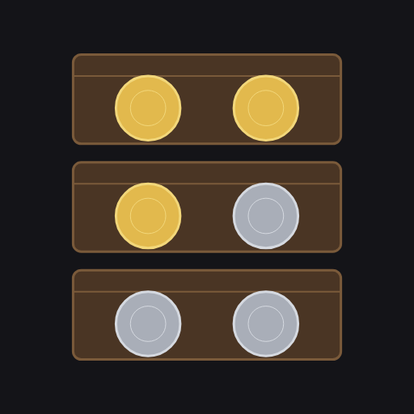<br><b><a href="Cofferwick">Cofferwick</a></b></div> | Turn coins gold or silver in three coffers and watch the six draws | Bertrand 1889: pick one of three coffers at random, two gold in one, two silver in another, a gold and a silver in the third, draw a coin at random and find it gold, and the chance its mate is gold is two in three, not the ready half, because the draw picks a coin and not a coffer, and of the three gold coins that might have come out two are the pair and have a gold mate; every laying of the six coins is swept, 64 of them, each chance worked twice, once by the six draws and once by Bayes with each coffer a third, the two agreeing on all 64; the chances that come are 0 on 26 layings, a half on 12, two thirds on 12, four fifths on 6 and certainty on 7, and nothing else; The Half of Three ships hopeless because three gold coins fill one coffer at most, giving 2 in 3 if they do and 0 if they do not, and a half never |
| <div align="center"><br><b><a href="Cogsley">Cogsley</a></b></div> | Set gears on the pegs so the crank turns the mill | Two gears mesh when their pegs lie the sum of their radii apart exactly, and every mesh turns the next gear the other way, so a gear an even count of meshes from the crank turns with it and an odd count against, and a ring of gears turns only when its count is even, since round an odd ring the direction would have to be both; a gear that turns makes as many turns as the crank times the crank's radius over its own, whatever lies between, so an idler changes nothing but the way; every placing of every train is swept on its pegboard, the turning walked mesh by mesh from the crank and the speeds held to the formula on every turning gear, 5 placings for the idler, 275 for the turn against, 11 for the twice and 159 for the ring of four, one landing it in each; The Ring of Three ships hopeless because the gears of two and three ring a crank of one three, four and five apart, a right triangle of pegs, in 2 placings of 8, and both jam, as every ring of three gears of one to three round a crank at the middle of the nine-by-nine does, 16 rings, while all 4 rings of four gears of one turn |
| <div align="center"><br><b><a href="Cornerwick">Cornerwick</a></b></div> | Tap four pegs in order, watch the four squares go up outward, and read the two joins of opposite centres | Van Aubel 1878: build a square outward on each side of any four pegs taken in order and the join from the centre on AB to the centre on CD matches the join from the centre on BC to the centre on DA in length and crosses it at a right angle, convex, dented or crossed over, with Thebault's 1937 addition that a parallelogram of pegs makes a square of the four centres; every ordered four of pegs on the five-by-five board is swept, 303,600 of them, the four centres found and the joins read for length and angle, and the first join turned a right angle worked out from the pegs alone; of the 227,952 fours with no three pegs in a line, 18,528 put all four centres on peg places, 5,192 make a square of the centres, 31,480 cross the joins on a peg place and 2,960 have joins five long; The Skew Cross ships hopeless because the turned join comes out as the second join letter for letter on every one of the 303,600 |
| <div align="center">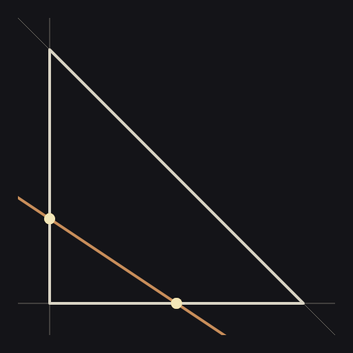<br><b><a href="Crossleigh">Crossleigh</a></b></div> | Tap two pegs of the field and cut the triangle with the line through them | Menelaus of Alexandria, around the year 100: a straight line across triangle ABC cuts the side-lines AB, BC and CA at F, D and E, and the ratios AF:FB, BD:DC and CE:EA multiply to -1, a ratio counting negative when its cut falls outside the side, so an odd number of the cuts lie outside; every line through two pegs of the thirteen-by-thirteen field is taken, 6,460 of them, and the 6,140 that cross all three side-lines have their cuts found exactly and their ratios read again off the corners' distances from the line, the two agreeing every time; 5,572 lines cut two sides inside and 568 none, 152 cut all three side-lines at pegs, 90 cut AB at its middle and 74 cut BC twice as far from B as from C; The Three Inside ships hopeless because a line that goes into the triangle at one side comes out at another and cannot come back for the third |
| <div align="center">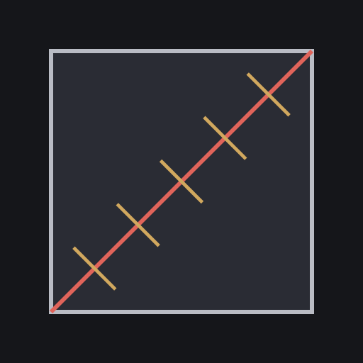<br><b><a href="Ellwick">Ellwick</a></b></div> | Step the side and the diagonal, or climb a rung of the ladder, and watch the miss turn over | The Greek ladder of side and diagonal numbers: from a side and a diagonal the next side is the two added and the next diagonal is twice the side plus the diagonal, and each rung misses twice the side squared by one, over and under in turn, so 3/2, 7/5, 17/12, 41/29 and 99/70 close on the square root of two; every side and diagonal to 120 is swept with whole numbers, 14,400 pairs, and the misses of one are exactly the six rungs, three over at (2, 3), (12, 17) and (70, 99) and three under at (1, 1), (5, 7) and (29, 41); seven pairs come within a thousandth of the true diagonal, (70, 99) nearest at 0.00007, and the pairs that come nearer the root than every smaller side does are those same six rungs and no other; The True Diagonal ships hopeless because a whole side with a whole diagonal halves to a smaller pair of the same kind and the halving cannot go on for ever |
| <div align="center">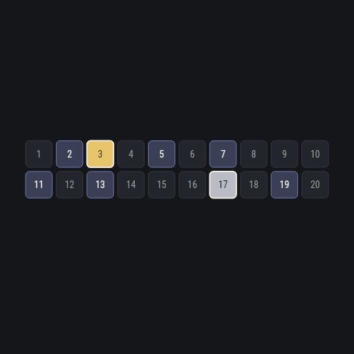<br><b><a href="Evenholme">Evenholme</a></b></div> | Tap a number on the slate and watch its partner light, hunting a pick where both parts are prime | Goldbach to Euler, 1742: every even number past two seems to be two primes added together, and nobody has found one that is not, nor proved that none exists; the primes to 2,000 are sifted with Eratosthenes' sieve and again by trial division, 303 of them and the two agreeing number for number, and every even number from 4 to 2,000 is split into two primes every way it can, every one of them splitting, 4, 6, 8 and 12 one way alone, no even number above 100 fewer than three ways, 128 the first with just three, and 1,890 the most with 91; twenty splits as 3 + 17 and 7 + 13, sixty six ways with 29 + 31 the twins, and a hundred six ways from 3 + 97 to 47 + 53; The Odd ships hopeless because two odd primes add to an even number, so an odd number splits only with a 2 in it, and 51 less 2 is 49, seven sevens |
| <div align="center">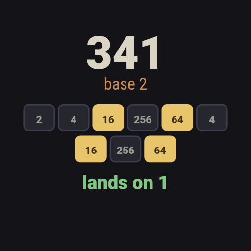<br><b><a href="Feintley">Feintley</a></b></div> | Step the number and the base on their dials and watch the squares the power takes light up in gold | Fermat to Frenicle, 1640, proved by Euler in 1736: raise a base to one less than a prime, working modulo that prime all the way, and it lands on one for every base the prime does not divide; every number from 2 to 1,200 is tried on every base from 2 to 12, 13,189 settings, the power worked by repeated squaring and again taken whole before being brought down, the two agreeing throughout; all 196 primes pass on every base they do not divide, 10,917 of the 11,033 composite settings fail and 116 pass as liars, four on base two starting at 341, where the old guess that passing on two makes a prime fails first, as Sarrus found in 1819, and seven on base three starting at 91, while 561 and 1,105 pass on every base they share no factor with, the two Carmichael numbers below 1,200, Korselt having given the rule for them in 1899 and Carmichael having found the first in 1910; The Failing Prime ships hopeless because the multiples of the base run through every remainder once each, which forces the power to one |
| <div align="center">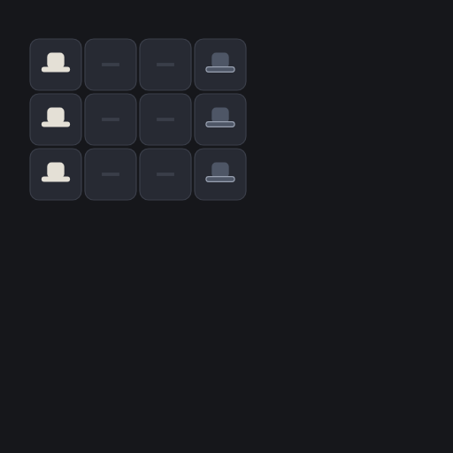<br><b><a href="Feltmere">Feltmere</a></b></div> | Set each villager's say for each of the four sights they can have, then try it against all eight hattings | Todd Ebert, 1998: three villagers in a ring each get a black or a white hat by the toss of a coin, each sees the other two and never their own, and all speak at once, each naming a colour or holding their tongue, the village winning when at least one names a colour and every colour named is right; every agreement the three can come to is taken, all 531,441, each tried against all eight hattings, and the words an agreement calls for are counted against the wrong words it risks, the two equal every time since a word is right on one of the two hattings its sight allows and wrong on the other; 23,270 agreements win four with nobody silent throughout, 2,652 win four with a villager silent throughout, 624 win five and 4 win six, the plainest of the four being to speak only when the two hats you see match and then name the other colour; The Seven ships hopeless because a hatting the village loses swallows at most three wrong words, so winning seven allows three words in all, and three words win at most three hattings |
| <div align="center">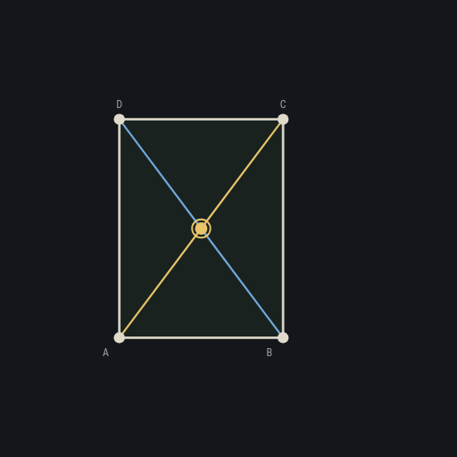<br><b><a href="Flagstead">Flagstead</a></b></div> | Set the hall on its dials, stand the peg anywhere at all, and add the squared distances in opposite pairs | The British flag theorem, named for the four lines from the peg to the corners: square the distance from a peg to each of the four corner posts of a hall and the opposite pairs, A with C against B with D, add to the same thing, wherever the peg stands and whatever the hall's shape, so long as the corners are square; every hall from 2 by 2 to 8 by 8 is taken with the peg on every point of the field, 11,025 standings, the sums worked once from the four distances and once by multiplying the brackets out, which takes no distance at all, and the two agree on every standing; all four distances come out whole on 26 standings and on 2 of those the peg is inside the hall, the six by eight and its turn about with the peg three paces along and four up, every post five off and both sums fifty; all four come out alike on 16, the halls of even sides with the peg at the middle, and a pair adds to fifty on 90; The Leaning Hall ships hopeless because a far wall leaned over by two parts the sums by four times the width wherever the peg goes, and no hall the dials allow has a width of nought |
| <div align="center"><br><b><a href="Flitwell">Flitwell</a></b></div> | Tap two tenants to swap their cottages and hunt the lane no group of them can better | Shapley and Scarf, 1974, crediting the rings to Gale: four tenants each own the cottage they start in, any group may walk out and share out only the cottages that group owns, and exactly one lane is ever firm, meaning no group can leave with one of its members better off and nobody worse; that lane is found without trying a lane at all, each tenant pointing at whoever owns the cottage they want most, the pointing closing into rings because everybody points at exactly one person, and each ring taking what it points at and leaving; every street four tenants can have is walked, all 331,776 of them, with all 24 lanes of each held against every group, 7,962,624 lanes tried, and on every street the rings' lane is the firm one and there is never a second; a lane no group can beat is a weaker thing and a street can have several, up to seven, which 72 streets reach; The Better Lane ships hopeless because the tenants in the first ring already hold the cottage they want most out of all four, and a lane that beats another has to better everybody in it |
| <div align="center"><br><b><a href="Footbury">Footbury</a></b></div> | Tap three rim pegs for the triangle, then any peg for the point, and watch its three feet drop | Wallace 1799, the finding carrying Simson's name, with Euler's measure of 1763: the three feet dropped from a point onto the side-lines of a triangle set on a circle lie in a line exactly when the point is on the circle, and the feet's triangle is to the whole as the square of the radius less the square of the point's distance from the middle is to four times the square of the radius; every triangle of three rim pegs is taken, 220, with every point of the field but its corners, 118 each, 25,960 settings, and the share is measured both by the feet themselves and by Euler's rule, the two agreeing on all 25,960; the feet lie in a line on the 1,980 rim settings and on none of the 23,980 others, through the middle on 156, level on 114 and along a side of the triangle on 540; The Line Off the Rim ships hopeless because Euler's share is nought on the rim and nowhere else |
| <div align="center"><br><b><a href="Gablewick">Gablewick</a></b></div> | Step the three sides a tap at a time and see the gable drawn to scale with its area under | Heron of Alexandria's formula: sixteen times the area squared is the perimeter times the perimeter less twice each side in turn, so a triangle with whole sides has an area that is whole or a square root that is not; every triangle with whole sides to fifteen is swept, 372 of them, its area worked twice, once by Heron and once by the height with the foot of the perpendicular found in whole numbers, the two agreeing on every one; ten come out whole, 3-4-5 with 6, 5-5-6 and 5-5-8 with 12, 4-13-15 and 6-8-10 with 24, 5-12-13 with 30, 10-10-12 with 48, 9-12-15 with 54, 10-13-13 with 60 and 13-14-15 with 84, every area a multiple of six and every one with an even side; The Three Odds ships hopeless because three odd sides make the perimeter and the perimeter less twice each side all odd, and an odd product is never sixteen times anything |
| <div align="center">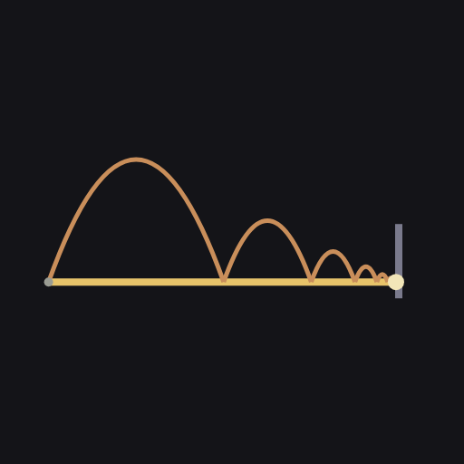<br><b><a href="Halfstead">Halfstead</a></b></div> | Set the share and the steps and watch the runner near the wall | Zeno's runner, set as a paradox in the fifth century BC: covering half of what is left at every step, the sum of the first n steps is 1 less 1/2 to the n, which comes as near to 1 as you please, so the endless steps add up to exactly the whole though no step is the last; five shares are walked, half, a third, two thirds, three quarters and nine tenths, with one to forty steps of each, 200 settings, the steps added as exact fractions and set against 1 less the rest to the n, the two agreeing on all 200; seven halvings come within a hundredth, 127/128 covered, ten within a thousandth and twenty within a millionth, 1/1,048,576 left; The Wall ships hopeless because the rest of something is something, so what is left is never nothing |
| <div align="center">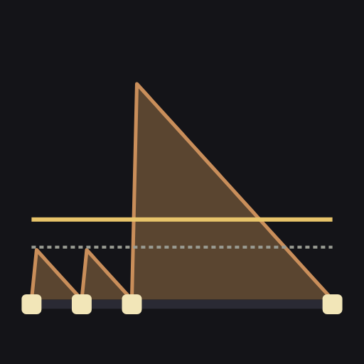<br><b><a href="Haltwick">Haltwick</a></b></div> | Step the first two gaps up and down, the third what is left of the hour, and watch the average wait | Feller 1966, the paradox of the wait: with three buses an hour and the gaps between them adding to sixty minutes, a passenger arriving at any minute of the hour waits 9 1/2 minutes on average when the gaps are equal, half a gap less half a minute, and longer whenever they are not, since a wide gap catches more passengers and keeps each of them longer; every timetable is taken, 1,711, and the average wait found twice, gap by gap from the sum of each gap's waits and minute by minute from the wait at every minute of the hour, the two agreeing on all 1,711; the least is 9 1/2 from the gaps 20, 20 and 20 alone and the most 27 11/20 from 1, 1 and 58 in its three orders, with 555 timetables waiting a quarter hour or more and 165 twenty minutes or more; The Short Wait ships hopeless because the average of squares is never below the square of the average, so three gaps adding to sixty square to 1,200 at least and the waiting in an hour comes to 570 minutes at least |
| <div align="center"><br><b><a href="Hedgemere">Hedgemere</a></b></div> | Hang each post off an earlier one on the five dials and peel the hedge ring by ring | Camille Jordan 1869, in "Sur les assemblages de lignes": stripping every post that has a single path left, round after round, leaves what lies halfway along the longest walk, one post when that walk is an even number of steps and two when it is odd; every hedge the dials reach is done twice, 720 of them over 7 posts, once by the stripping and once by walking outward from every post and keeping the ones whose worst walk is shortest, the two naming the same posts on every hedge, and again on every labelled hedge from two posts up to eight, one for each Prufer word, 280,392 in all; 412 of the 720 come down to one post and 308 to two, none to three, and not one of the 280,392 to three either; The Three Middles ships hopeless because a walk has one halfway post or two and a line has no third place to stand halfway |
| <div align="center"><br><b><a href="Hookmere">Hookmere</a></b></div> | Tap a row to lift a box off its corner and another row to put it down, reshaping the staircase | Frame, Robinson and Thrall 1954: every box of a staircase carries a hook, itself with the boxes to its right in its row and the boxes below it in its column, and 40,320 divided by the eight hooks multiplied together is exactly how many fillings the staircase has, a filling being a numbering 1 to 8 that rises along every row and down every column; all 22 staircases of eight boxes are counted twice, once by the hooks, which count no fillings at all, and once by the definition worked out in full, taking the largest number off a corner and counting what is left, and the two agree on every one, as they do from one box up to ten, where the counts squared and added come to the factorial of the boxes; the most is 90 at 4, 2, 1, 1, whose hooks multiply to 448, and the fewest is 1 at the single row and the single column; Against the Hooks ships hopeless because the hooks and the full count agree on all 22 staircases and on those of nine boxes and ten as well |
| <div align="center">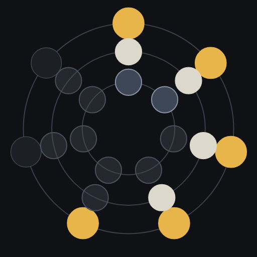<br><b><a href="Hoopwell">Hoopwell</a></b></div> | Lay dark stones and pale stones in the seven holes and see which holes light | Cauchy 1813, proved again by Davenport in 1935 without his knowing of it and traced back to Cauchy by him in 1947: with seven holes round a hoop and counting past 6 coming back to 0, the holes that are a dark hole plus a pale hole come to at least the two stone counts added with one taken off, or the whole hoop if that is fewer, seven being a prime being the whole of it; every board the hoop allows is laid, all 16,384, the lamps lit twice, once by turning the pale ring round by each dark hole and piling the copies up and once by multiplying the rings out hole by hole, with the floor read a third way off the divisors of seven, and the voices agree every time; 9,857 boards sit exactly on the floor, and the 147 of them with two dark stones and four pale are each a run of dark stones and a run of pale stones at one shared step, which Vosper proved in 1956 they have to be; Four Alight ships hopeless because two dark stones and four pale leave five lamps at least on all 735 boards of theirs |
| <div align="center">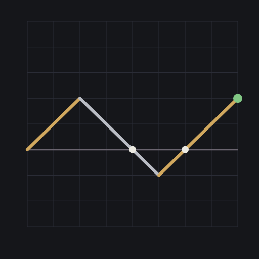<br><b><a href="Hustingsby">Hustingsby</a></b></div> | Draw the ballots one at a time, Ash or Birch, and watch the lead | Bertrand 1887, ballots counted one at a time: with Ash polling a ballots and Birch b, a more than b, the orders that keep Ash ahead after every single ballot are the majority over the poll of them all, (a - b)/(a + b) of the C(a+b, a) orders, which the reflection gives again as C(a+b-1, a-1) less C(a+b-1, a); every order of every poll to eight and eight is read through ballot by ballot, 81 polls and 48,619 orders, and the sweep agrees with Bertrand and with the reflection on every one, nought on every level poll, and with (a - b + 1)/(a + 1) of the whole for the orders that never put Ash behind, Catalan's numbers down the level polls; The Level Poll ships hopeless because four Ash and four Birch end level, so no order keeps Ash ahead after the last ballot |
| <div align="center"><br><b><a href="Kitewick">Kitewick</a></b></div> | Tap two cells side by side to lay a two-cell slate and slate the kite whole | The kite of order n is the Aztec diamond, the cells within n of the middle by the taxi-cab measure, 2n(n+1) of them, and its slatings by two-cell slates come to two to the n(n+1)/2; every slating is laid out from the first bare cell on, orders one to five, 4, 12, 24, 40 and 60 cells, giving 2, 8, 64, 1,024 and 32,768 slatings, and the formula agrees with the sweep at every order; the slatings sort by the count of slates lying across along a row of Pascal's triangle, 1, 3, 3, 1 for the order two; The One Across ships hopeless because every row of the kite is even, so the count of slates lying across is always even and one is not |
| <div align="center">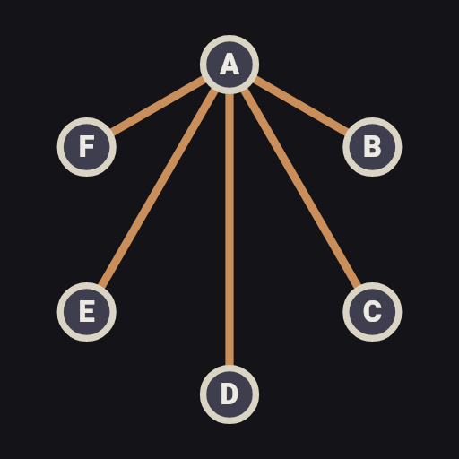<br><b><a href="Kithwell">Kithwell</a></b></div> | Tap one person then another to make them friends and watch the two averages part | Feld 1991: your friends have more friends than you do, on average, and never fewer, since a person with k friends is named k times, so the friends' average is the sum of the squares of the counts over the sum of the counts, which is the plain average plus the spread of the counts over the average; every plan of friendships among six people is swept, 32,768 of them, and the friends' average found two ways on each of the 32,767 with a friendship in it, the two agreeing on all; the friends named are level on the 171 plans where everyone has the same number of friends and ahead on the rest, the gap widest at 1 1/3 on the six stars; The Popular Few ships hopeless because a spread is never below nought |
| <div align="center"><br><b><a href="Knaveley">Knaveley</a></b></div> | Tap each villager to call them knight or knave until every telling holds | Raymond Smullyan's knights and knaves, from What Is the Name of This Book? in 1978: a knight says nothing but the truth and a knave nothing but falsehood, and a naming holds when every villager's kind matches the truth of that villager's telling; every naming of every ask is tried, 52 in all, each read twice, once whole and once as the list of villagers caught out; every set of tellings three villagers could make from the fourteen this island allows is taken as well, 2,744 sets, of which 1,361 are held by no naming, 1,048 by exactly one, 323 by two, 10 by three and 2 by four; The Paradox ships hopeless because Alder says "I am a knave", which a knight would be saying falsely and a knave truly, and every one of the 547 sets in which somebody says it is held by none |
| <div align="center">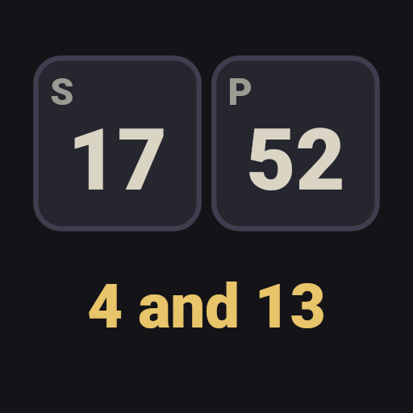<br><b><a href="Knowsley">Knowsley</a></b></div> | Step the two numbers up and down and watch what S and P can say | Freudenthal 1969, the puzzle Gardner called the impossible puzzle: S is told the sum of two whole numbers and P their product, each 2 or more, the smaller below the larger and the two adding to 100 at most, and they speak in turn, P not knowing them, S knowing he did not, P then knowing, S then knowing too; every pair is taken, 2,352 of them, the four things asked of each and the whole set narrowed again by each thing said in turn, the two agreeing at every step: 1,747 leave P in the dark, 145 add to one of the ten sums S could speak for, 86 let P then know, and one lets S know too, 4 and 13, sum 17 and product 52; The Even Sum ships hopeless because every even sum from 8 to 100 splits into two different primes whose product tells P at once |
| <div align="center">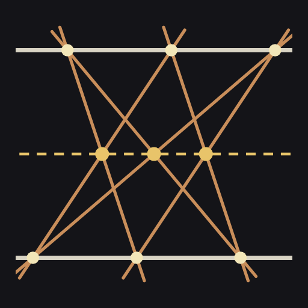<br><b><a href="Ladderby">Ladderby</a></b></div> | Tap three pegs on each rail to draw the six cross-joins and watch the three crossings fall in a line | Pappus of Alexandria, around the year 340, taken by Hilbert in 1899 as a foundation stone of geometry: pick three pegs on each of two rails and the six cross-joins cross in three points that lie on one line, whatever pegs were picked, with no lengths or angles in it; every ordering of three pegs on each rail is swept, 112,896 of them, each crossing found by the general meeting of two lines and again by the closed form for parallel rails, the two agreeing on all 85,008 orderings whose joins cross, 14,168 hexagons counted once each, and the three crossings lying in a line on every one; The Bent Line ships hopeless because Pappus said so first and no hexagon of the 14,168 bends |
| <div align="center"><br><b><a href="Lampfield">Lampfield</a></b></div> | Tap a lamp to light it or put it out and keep the sum at nothing over nine | Varshamov and Tenengolts 1965, with Levenshtein showing the same year that the code mends a lost lamp: a message of eight lamps is in the code when the places of the lit lamps add to nothing over nine, and then any one lamp can go out and the reader still gets the message back, told neither which lamp went nor whether it had been lit; all 256 messages are sorted by that sum, 30 landing in the code, more than any of the other eight sums manages, and each of the 30 is sent with each of its eight lamps put out in turn, 240 readings, each read once by the reader's arithmetic and once by going through all 256 messages; Fool the Reader ships hopeless because no two messages in the code look the same with a lamp out |
| <div align="center"><br><b><a href="Leverstow">Leverstow</a></b></div> | Turn each slot of the loop to lever A or lever B and watch the purse climb | Parrondo's paradox, put by Juan Parrondo in 1996 and written up by Harmer and Abbott in Nature in 1999: lever A is a plain coin toss and lever B pays one time in ten when three divides the purse and three times in four otherwise, resting on the remainders in the shares 5/13, 2/13 and 6/13, so both levers are fair on their own, and yet a loop of them climbs; every loop of twelve slots or fewer is taken, 8,190 of them, each one's climb solved once folded onto the three remainders and once on the long chain of remainder and slot, the two agreeing on every loop of six slots or fewer, which is as far as the long chain is small enough to solve; 8,154 climb, 36 stand still and none sinks, the loop Parrondo told it with, A once and B twice, gaining 2416/35601 of a coin a round and the best of all 3613392/47747645; One Lever Forever ships hopeless because A is a coin toss and B on its own cancels itself, five times four fifths against eight times a half |
| <div align="center">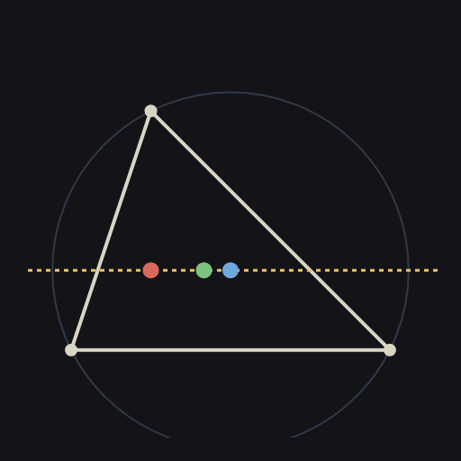<br><b><a href="Linesby">Linesby</a></b></div> | Lift a peg of the triangle, set it down elsewhere, and watch the three centres slide along their line | Euler 1765: the centroid, the circumcentre and the orthocentre of a triangle lie on one line, the centroid a third of the way from the circumcentre to the orthocentre, so that H = A + B + C - 2O; every triangle of the seven-by-seven field is swept, 17,600 of them, three pegs not in a line, every centre kept as an exact fraction, the orthocentre worked from the altitudes and again from that identity, the two agreeing on all 17,600, the centres lying in a line on all 17,600 with the orthocentre twice as far from the centroid, and the nine-point centre sitting halfway from O to H on every one; The One Point ships hopeless because one point for all three centres makes the triangle equilateral, and none stands on pegs, the tangent of an angle between peg lines being a fraction while the tangent of sixty degrees is the square root of three |
| <div align="center"><br><b><a href="Lotwick">Lotwick</a></b></div> | Set what the beast is worth, what you bid and the best bid against you, and watch your earnings against the truthful bid | William Vickrey, 1961: in the sealed ring the highest bid takes the beast and the winner pays the second bid, not his own, so your bid never sets the price, only whether you win, and no bid earns more than bidding what the beast is worth to you; every setting of the three dials is swept at a hundred crowns a dial, what the beast is worth, what you bid and the best bid against you, 1,000,000 in all, each run in both rings and held to the window, which runs no auction, and the two agree on every setting; on the 2,197 settings the sham's dials reach, 286 buy a beast for more than it is worth, 650 win one for less and 364 pass up a sale the truthful bid would have taken; in the open ring, where the winner pays what he bid, 161,700 of the million settings beat the truthful bid and every one of them is shaded under the worth; Outbid the Truth ships hopeless because raising the bid only takes beasts whose best rival bid already sits at or above the worth and lowering it only drops beasts that were in pocket |
| <div align="center">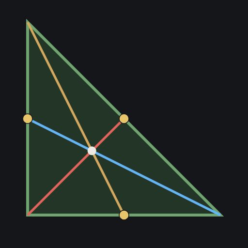<br><b><a href="Meetingham">Meetingham</a></b></div> | Tap a post on a side to move that side's gate there and watch whether the three lanes meet at one point | Ceva, 1678: the three lanes, each from a corner to the gate on the far side, meet at one point exactly when the three ratios the gates cut their sides in, BD to DC, CE to EA and AF to FB, multiply to one; every setting of the three gates at whole paces on the field of twelve is swept, 1,331 of them, the lanes from A and B crossed in whole-number arithmetic and the lane from C tried on the crossing, with Ceva's product worked beside it, and the two say meet or miss alike on all 1,331; 31 settings meet, the medians at (4, 4) and thirty more, and every one of the 31 has a gate at a middle, two gates at middles forcing the third there; The Thirds ships hopeless because a gate a third of the way along each side, the same way round, gives 1:2 times 1:2 times 1:2, which is 1:8 one way and 8:1 the other and never one |
| <div align="center">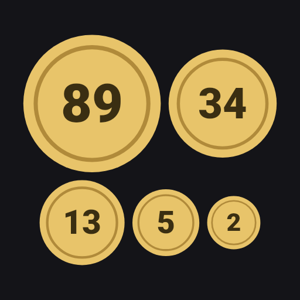<br><b><a href="Mintcombe">Mintcombe</a></b></div> | Tap coins from the rack onto the counter to pay a price with no two coins side by side | Lekkerkerker showed it in 1952 and Zeckendorf in 1972, and the theorem carries his name: with coins of 1, 2, 3, 5, 8, 13, 21, 34, 55 and 89, each the two before it added, every price from nought to 143 is paid in exactly one tidy way, no two coins neighbours on the rack, and the tidy way is the greedy one, the dearest coin not over what is left, again and again; every picking of the purse's ten coins is swept, 1,024 of them, and the 144 tidy pickings pay the 144 prices from nought to 143 once each and none higher, while the greedy purse lands the sweep's tidy picking on every price to 143 with the fewest coins any picking uses and pays every price from 144 to 231 untidily; The Held-Back Coin ships hopeless because every other coin from a coin down adds to one short of the coin above it, so without the 89 the tidy purse reaches 88 at most and 90 is out of reach |
| <div align="center">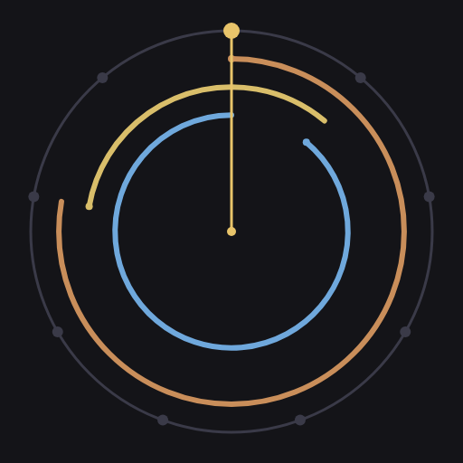<br><b><a href="Ninebury">Ninebury</a></b></div> | Turn the three dials and watch the digits walk the nine-hour face until the hand rests on the root | Casting out nines, the old check on sums and products: adding a number's digits down to one digit gives its remainder by nine, with nine standing for nought, because 10, 100 and 1,000 are each one more than a multiple of nine, so a digit in any place counts for itself alone, and the root of a sum is the root of the roots added while the root of a product is the root of the roots multiplied; every number of three digits, 0 to 999, has its digits added down and its remainder by nine taken and the two agree on all 1,000, every pair is added and multiplied, 1,000,000 pairs, and the roots keep step, with the 32 squares to 961 and the ten cubes to 729 swept for the roots they can bear; The Square Five ships hopeless because a square's root is the root of its root squared, and 1 to 9 squared root 1, 4, 9, 7, 7, 9, 4, 1 and 9, so five never comes |
| <div align="center"><br><b><a href="Oddsworth">Oddsworth</a></b></div> | Set the first odd number and how many follow it, and see the run laid as bands of dots round a square | The odd numbers from 1 add to squares, each new odd number an L of dots laid round the last square to make the next, and a run that starts higher is one square less another, the smaller square being the odd numbers left off, so 5 + 7 + 9 is 25 less 4 and every run of consecutive odd numbers is a difference of two squares; every run on the dials is swept, the first odd number 1 to 99 and the count 1 to 20, 1,000 runs, each added out and set against the outer square less the inner, and the two agree on all 1,000, the runs from 1 coming to the count squared every time; of the numbers to a hundred, 45, 48, 72 and 80 have three runs each and 96 has four, the most, while the twenty-five numbers two past a multiple of four have none; The Thirty ships hopeless because an odd count of odd numbers is odd and an even count pairs off, each pair of neighbours a multiple of four, so 30 is out of reach though 28 and 32 are runs |
| <div align="center">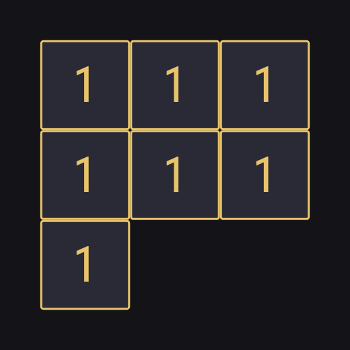<br><b><a href="Onesby">Onesby</a></b></div> | Wind the length of the row of ones up or down and see the row told prime or not | Mersenne's numbers, p ones in binary standing for 2 to the p less 1: a prime row needs a prime length, since the row of a ones divides the row of p ones when p is a times b, and a prime length is not enough, eleven ones being 2,047, which is 23 times 89; every exponent from 2 to 31 is swept and its row told twice, by trial division to the square root and by the Lucas-Lehmer chain, 4 and then each the last squared less two cut down by the row, which ends at 0 exactly for the prime rows, and the two agree on all thirty; the eight prime rows make the perfect numbers 6, 28, 496, 8,128, 33,550,336, 8,589,869,056, 137,438,691,328 and 2,305,843,008,139,952,128, as Euclid showed, and Euler showed every even perfect number comes so, while the row of thirty-one ones, 2,147,483,647, is prime, as Euler showed in 1772; The Composite Row ships hopeless because the row of a shorter length divides it, four ones being 3 times 5 and nine ones 7 times 73 |
| <div align="center">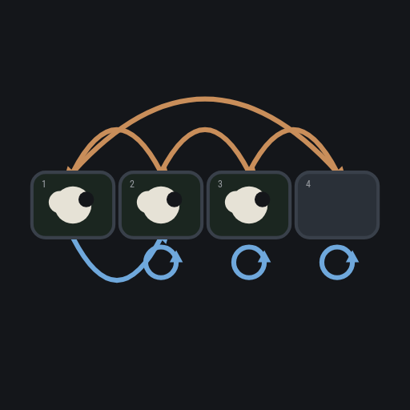<br><b><a href="Penfold">Penfold</a></b></div> | Blow the two whistles in any order until all four sheep stand in one field | Jan Cerny, 1964: a fold can be gathered, every sheep whistled into one field, exactly when every two sheep can be brought together; all 65,536 folds of four fields and two whistles are walked twice, once over the flock itself, all sixteen ways it can stand, and once over the pairs alone, which never looks at more than two sheep, and the two agree on every fold, 51,520 gathering and 14,016 not, with 2,032 gathered by a single whistle and 96 needing nine whistles, which none of the 51,520 goes past; Cerny built the fold of four fields that needs that longest call and guessed a fold of n fields never needs more than n less one, squared, which nobody has proved; The Turning Fold ships hopeless because both its whistles send each field to a field of its own, so no two sheep ever land together and the flock stays four wide however long you whistle, and 576 folds are like it |
| <div align="center">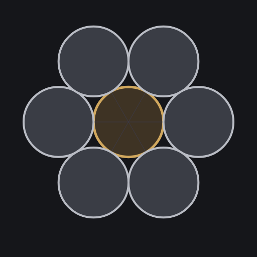<br><b><a href="Pennyford">Pennyford</a></b></div> | Size the middle coin and the ring coins a step a tap, one to six each, and see how many fit round | Six pennies fit round a penny and a seventh never: a ring coin the size of the middle coin makes a triangle of equal sides with the middle centre and the centre of the next coin round, so it takes sixty degrees of the turn as seen from the middle, and seven sixties are more than a turn; a smaller ring coin takes twice the arcsine of its radius over the two radii added, and as many fit as that goes into a full turn, twelve ones round a three and twenty-one round a six; every setting of the middle coin and the ring coins is swept, one to six each, 36 settings, worked by the angle and again by the measure, the coins set at equal angles with neighbours held apart by twice the ring's radius, and the two agree on all 36, six equal coins being the one tie and decided exactly; The Seven Pennies ships hopeless because a ring coin as big as the middle takes a sixth of the turn and a bigger one takes more |
| <div align="center">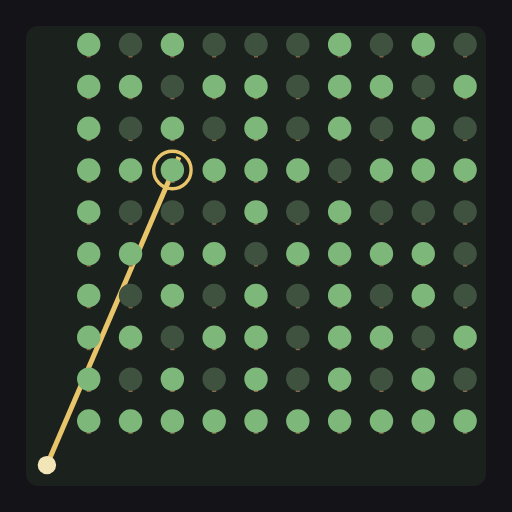<br><b><a href="Pippinstow">Pippinstow</a></b></div> | Tap a tree and see the line of sight from the gate drawn to it, with what stands in the way | Euclid's orchard: ten rows and ten files with a tree at every crossing, and the tree at file a and row b is in sight from the gate exactly when a and b share no factor, since a nearer tree stands on the line to it only when its file and row are a fraction of a and b, which is a common factor at work, and a tree in sight hides its multiples; every tree of the hundred is asked two ways, once by the factor of its file and row and once by looking along the line for a tree in the way, and the two agree on all a hundred, 63 in sight and 37 hidden, thinning towards six in ten by Cesaro's count as the orchard grows; The Hidden Edge ships hopeless because a tree one step up has nothing on the line to it, anything in the way standing less than one step up |
| <div align="center"><br><b><a href="Pumpwick">Pumpwick</a></b></div> | Roll the pump a spot at a time along the lane and watch the walking add up | The walking to a pump on a lane is least at the middle house, the median and not the average, because rolling the pump one spot changes the total by the houses at or behind it less the houses ahead, so the total falls while houses lie ahead and rises once they lie behind; every row of houses on the lane is swept, from one house to seven over the 13 spots, 77,519 rows, with the pump stood at every spot of each and the best spots found again by taking the middle house without adding anything up, and the two agree on every row, 57,044 rows with an odd count having one best spot alone and 13,819 of the 20,475 even rows a run of them between the two middle houses; standing the pump at the average instead is never better and is worse on 47,692 rows; Beat the Middle ships hopeless because it asks for less walking than the least there is |
| <div align="center">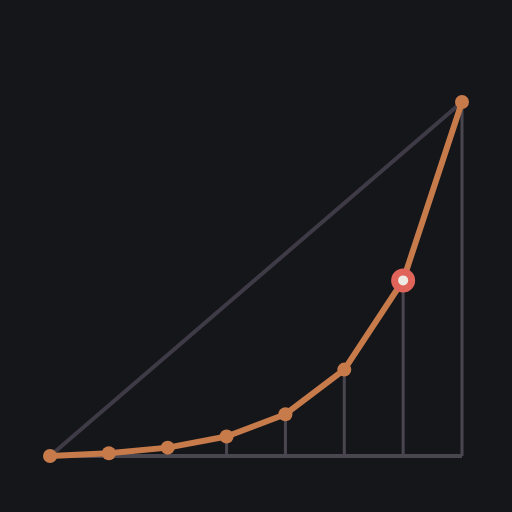<br><b><a href="Pursebury">Pursebury</a></b></div> | Fill the two purses a coin a tap, turn the coin over, and toss until one purse is empty | Two purses and a coin tossed a coin at a time until one purse is empty: with a fair coin Ash takes the whole pot exactly as often as his share of it, since his chance from any purse is the average of his chances a coin up and a coin down, so it climbs in a straight line from nothing at an empty purse to everything at the whole pot, and the duel lasts the two purses multiplied on average, while a coin against him sags that line and a coin for him bows it, to 1 less r to his purse over 1 less r to the pot, r the odds against him on a toss; every setting of the purses and the coin is swept, one to six coins each with the coin against Ash, fair or for him, 108 settings, each duel solved twice, as a chain of purses eliminated in exact fractions and by the formula, chance and length agreeing on all 108; The Even Duel Against the Coin ships hopeless because Ash's chance against the coin is 2 to his purse less 1 over 2 to the pot less 1, and an odd number under is never twice the number over |
| <div align="center">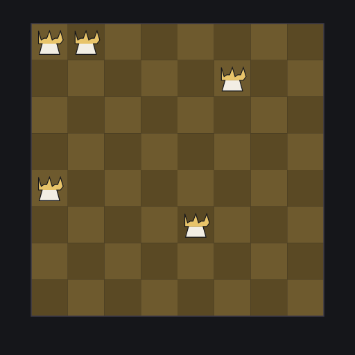<br><b><a href="Queenscote">Queenscote</a></b></div> | Tap a square to set a queen, tap her to lift her, and see what the queens see | How few queens see every square of a board, with no short reason for the four, so the sweep is the reason and it is done twice: every placing of the queens asked is tried as masks of the squares seen, and every watching set is found again by picking a queen for the first unseen square in turn, the two counts agreeing on every board; the fewest that watch run 2, 3, 3, 4, 5 from the four by four to the chessboard, and one fewer never does, leaving 4, 2, 6, 4 and 2 squares unseen at best; two watch the four by four 12 ways of 120, three watch the six by six 4 ways of 7,140, five watch the chessboard 4,860 ways of 7,624,512, and four queens on the chessboard leave two squares unseen in 64 placings of 635,376; The Lone Queen ships hopeless because one queen sees 12 of the sixteen squares at the most, from the middle four, and 10 from a corner |
| <div align="center"><br><b><a href="Reckonby">Reckonby</a></b></div> | Turn a wheel a notch a tap and watch what the counting house reads | The factorial number system: five wheels turning 0 to 1, 0 to 2, 0 to 3, 0 to 4 and 0 to 5, worth 1, 2, 6, 24 and 120, the house reading them added up; all 720 settings are taken and read twice, once by adding each wheel times the factorial of its place and once by counting the house up a tick at a time from nothing and carrying as an odometer does, which adds nothing at all, and the tick a setting falls on is what it adds to on every one of the 720; the settings read the 720 numbers from nothing to 719, each exactly once, because the wheels under the kth, even at their tops, come to one less than the kth is worth; Seven Hundred and Twenty ships hopeless because k times k factorial is (k + 1) factorial less k factorial, so the wheels at their tops fold up to 6 factorial less 1, which is 719, and there is nothing above it to read |
| <div align="center">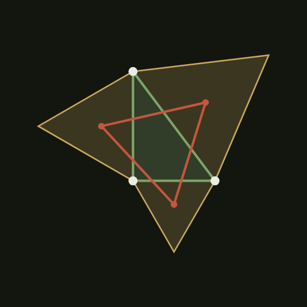<br><b><a href="Rickmere">Rickmere</a></b></div> | Tap a post to lift it and a peg to stand it on, and watch the ring of three rick markers keep its shape | Napoleon's theorem, printed by Rutherford in The Ladies' Diary in 1825: raise an even triangle outward on each side of a field and the middles of the three make an even triangle exactly; every field the 5 by 5 green holds is taken, 2,148 of them, with the ricks raised outward and then inward, 4,296 raisings, each measured two ways, once by taking the three gaps between the markers and comparing them and once by turning one marker sixty degrees about another to ask whether it lands on the third, the two agreeing on all 4,296, and all of it done in numbers of the form a and b roots of three with a and b exact fractions rather than decimals; The Uneven Three ships hopeless because the root of three is not a fraction, so two such places are the same only when both halves match, and equal means equal |
| <div align="center"><br><b><a href="Rimsbury">Rimsbury</a></b></div> | Size the hoop and the roller a step a tap and send the roller round the outside or the inside | A coin rolled once round another of the same size turns twice, not once: its rim unrolls along the hoop's for one turn and the carrying round the hoop is a turn more, so the turns are the hoop over the roller and one more round the outside, or one less round the inside, where the carrying goes against the rolling; every setting of the hoop and the roller is swept, one to six each round both sides, 72 settings with the roller too big for the inside in 21 of them, and every trip that fits, 51, is rolled as well as worked out, the roller pivoting about its point of contact a hair at a time, 36,000 pivots to the trip, the pivots agreeing with the formula to within two millionths of a turn on every one; The Once ships hopeless because round the outside the turns are one and the hoop over the roller, always more than one, the nearest a hoop of one and a roller of six at 7/6 of a turn |
| <div align="center">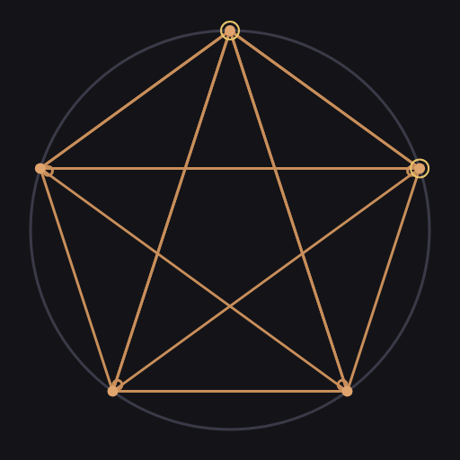<br><b><a href="Ringfold">Ringfold</a></b></div> | Wind the clock up or down and watch the Fibonacci numbers walk round it and home | The Pisano period, seen by Lagrange in 1774: cut the Fibonacci numbers down to their hour on a clock of m hours and the run comes back to 0, 1 and repeats, since there are only m times m pairs of hours so some pair comes twice, and the walk runs backwards too, each number the next less the one before, so the first pair to come twice is 0, 1 itself; every clock from two to two hundred hours is walked until 0, 1 comes round, 199 of them and the dial holding the first 39, each period found again as the least divisor of a bound read off the clock's prime factors that brings the Fibonacci matrix, 1 1 over 1 0, back to the identity by squaring, the two agreeing on all 199 with Cassini's identity holding on every one, the periods running 3, 8, 6, 20, 24, 16, 12, 24, 60 for two to ten hours; The Odd Period ships hopeless because Cassini's identity turns its sign every step and comes back to plus one at the period, so the period is even on every clock past two, six on the four-hour clock the shortest |
| <div align="center"><br><b><a href="Rodwell">Rodwell</a></b></div> | Tap between the hands to cut the rod into whole parts and multiply them together | the whole-number face of the old rule that a fixed sum multiplies best when its parts are equal, with e the size the parts would take if they could be any length at all and three the whole number nearest it; every rod from 2 hands to 20 has its biggest product found three ways, by cutting it every way there is, 65,534 cuttings over the rods of sixteen hands and under, by the rule of threes, which cuts nothing at all, and by working up from the short rods, and the three agree on every rod: the best cutting is threes with a four or a two over, 10 to 36, 12 to 81, 16 to 324; Beat the Threes ships hopeless because none of the 32,768 cuttings of the rod of sixteen passes 324, a part of five or more doing better cut into a three and the rest, a one multiplying nothing, and nine beating eight |
| <div align="center">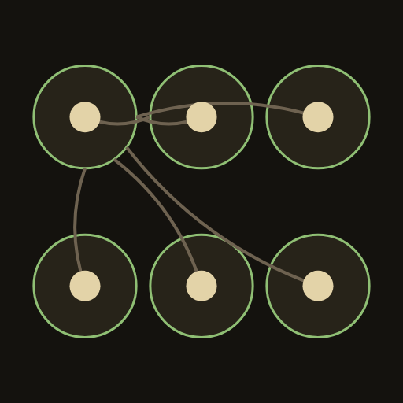<br><b><a href="Roostwick">Roostwick</a></b></div> | Tap birds along their tethers until every bird sits in a hollow of its own | cuckoo hashing, which Pagh and Rodler published in 2001, read as the cuckoo graph: birds tethered between two of six hollows make the hollows fall into patches, and the wood settles exactly when no patch holds more birds than hollows, a patch with a hollow to spare settling one way for each hollow it can leave empty and a patch carrying a ring settling two, the wood's count being its patches multiplied together; every wood of six hollows and six or fewer birds is walked, 12,204,240 of them, collapsed to 54,263 boards, each counted by walking all its seatings and counted again off its patches without walking any, the two agreeing 54,263 times out of 54,263, and 5,971,950 woods settle; The Shared Tether ships hopeless because the patch A B holds more birds than hollows |
| <div align="center">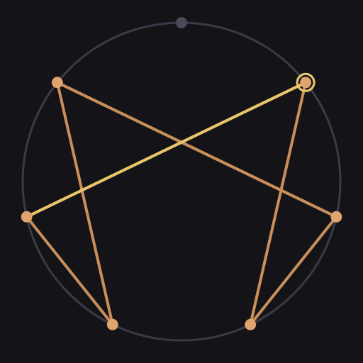<br><b><a href="Rootley">Rootley</a></b></div> | Turn the clock and the base a tap at a time and watch which hours the walk touches | the primitive root, as Euler named it, and Gauss's rule of 1801, that the clocks with a full base are 2, 4, a power of an odd prime, or twice one, and no other, every prime clock having phi of one less of them; every base of every clock from three to a hundred hours is walked, 4,949 walks, and set against a reckoning that never walks, Carmichael's lambda from the clock's prime factors with the base raised to lambda's divisors by squaring, the two agreeing on the steps home of all 4,949 while Gauss's rule names exactly the 48 clocks of the 98 the walk finds a full base on; The Eight ships hopeless because every odd number squared is one more than a multiple of eight, so 3, 5 and 7 come home on the second step and no base touches more than two of the eight-hour clock's four odd hours |
| <div align="center">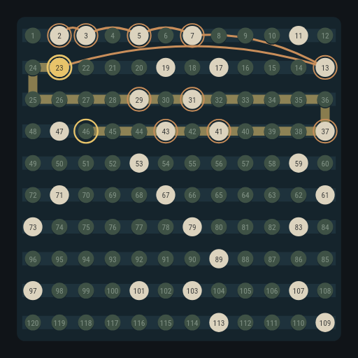<br><b><a href="Ropeford">Ropeford</a></b></div> | Hop from dry stone to dry stone with a rope that reaches from stone n as far as 2n | Bertrand's postulate, stated by Joseph Bertrand in 1845 after checking the numbers up to three million, proved by Pafnuty Chebyshev in 1850 and printed in 1852, with a simpler proof from Srinivasa Ramanujan in 1919 and a short elementary one from Paul Erdos in 1932: for every n above 1 there is a prime p with n < p < 2n; every number from 1 to 200,000 is asked for a dry stone inside its rope and given one, the ford's 120 stones are sieved and divided out to the same 30 dry ones, and the fewest hops off the hop graph match the greedy chain 2, 3, 5, 7, 13, 23, 43, 83 and on, 8 hops to pass a hundred, 11 a thousand, 15 ten thousand; The Long Shallows ships hopeless because the seven stones from 90 to 96 are all mossy, 91 being 7 times 13 and 93 being 3 times 31, the first run of seven anywhere |
| <div align="center">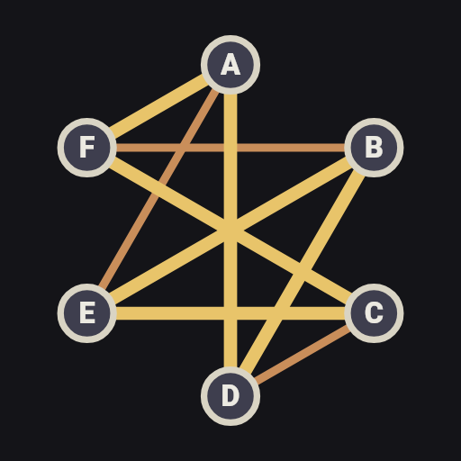<br><b><a href="Roundhithe">Roundhithe</a></b></div> | Tap two villages to lay the road between them until a round trip goes through all six | Dirac's rule of 1952, that a round trip is there whatever the roads when every village has half the others as neighbours at least, three of the five here, and Ore's widening of 1960, that it is enough for any two villages not joined to have six roads between them; every road-plan on the six villages is taken, 32,768, and a round trip looked for on each two ways, by walking every order of the villages from A and by a table of what sets of villages a walk from A can end where, the two agreeing on all 32,768: 10,078 plans have a round trip, among them every one of the 1,858 with three roads or more at every village and every one of the 1,978 meeting Ore's rule; The Three Each ships hopeless because Dirac said so first and no plan of the 32,768 has three roads at every village and no round trip |
| <div align="center">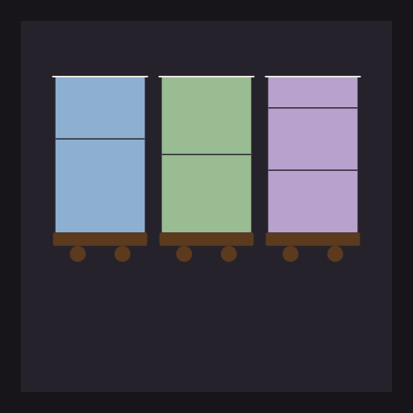<br><b><a href="Sackford">Sackford</a></b></div> | Tap a sack to move it to the next cart until the load fits the fewest carts | bin packing at the carrier's yard, with the weight over ten rounded up as a floor no loading beats and Johnson's bound on the carrier's rule, heaviest first into the first cart with room, which never needs more than eleven ninths of the fewest carts and two thirds of a cart besides; every loading of every yard is searched, sack by sack into a cart in use or the next fresh one with no cart past ten stone and the loadings told by the weights each cart carries, and on every load of six sacks of one to nine stone, 3,003 loads, the search's fewest never beats the floor, meets it on 2,201, and the carrier's rule needs a cart too many on four; The Thirty-One ships hopeless because its eight, seven, six, five, three and two weigh thirty-one stone and three carts carry thirty |
| <div align="center">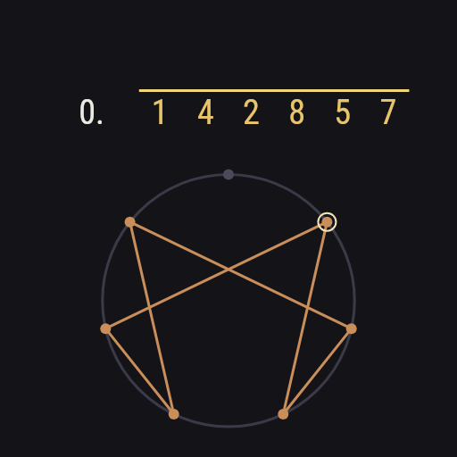<br><b><a href="Sevenby">Sevenby</a></b></div> | Dial the prime and the number over it and watch the long division come round | the repeating decimal of k over p, whose period is how many steps 10 takes to come back to 1 on the p-hour clock, a divisor of p - 1 and never more since only p - 1 remainders exist and one must come again, with Midy's theorem that the two halves of an even block add to nines, 142 plus 857 being 999; every fraction on the dial is divided the long way, the thirteen odd primes from 3 to 47 but 5 and every k under each, 308 fractions, and each period set against the steps 10 takes round the clock, the two agreeing on all 308, every block of digits times p coming to k rows of nines, and to a hundred the full-turn primes are 7, 17, 19, 23, 29, 47, 59, 61 and 97; The Long Turn ships hopeless because the remainders are the hours 1 to p - 1, so one comes again within p - 1 steps |
| <div align="center">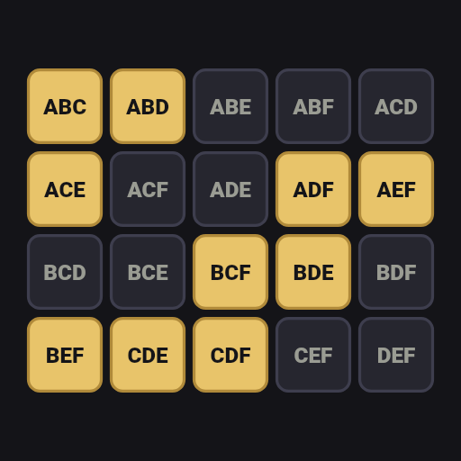<br><b><a href="Sharewick">Sharewick</a></b></div> | Tap trios of six friends until every two you have picked share a friend | Erdos, Ko and Rado, 1961: among the k-sets of n things, n at least 2k, a family in which every two meet has at most as many sets as hold one fixed thing, the star, and for n above 2k the star is the only family that large; here n is twice k, six friends and their twenty trios, which fall into ten missing pairs since two trios miss each other only when one is the other three, so a sharing family takes one of each pair at most; every family of the twenty trios is taken, 1,048,576, once by looking at every pair of trios for a shared friend and once by asking only whether it takes both trios of a missing pair, the two agreeing on all 1,048,576, and 59,049 families share throughout, 1,024 of them ten trios and none eleven; The Eleven ships hopeless because there are only ten missing pairs to draw one trio from |
| <div align="center">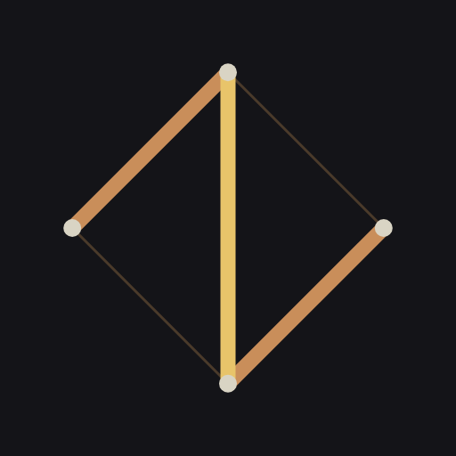<br><b><a href="Shortcombe">Shortcombe</a></b></div> | Turn the crowd up or down, two hundred a tap, open or shut the shortcut, and see where the drivers settle | Braess 1968, a road added and everyone slower: with the shortcut shut the crowd splits evenly and takes 45 plus half the crowd, and with it open every driver under forty-five hundred goes top, across and bottom, since that way costs the two variable roads and no fixed one whatever the others do, so forty hundred go from 65 minutes each to 80 and nobody can do better alone; every crowd from two hundred to sixty hundred, two hundred a step, is settled with the shortcut shut and with it open, 60 settings, by cases and again by the least potential over every whole split of the crowd, the two agreeing on all 60; The Big Crowd Helped ships hopeless because the shortcut helps 14 crowds, all under thirty hundred, makes no odds at thirty, 60 minutes either way, and hurts the other 15 |
| <div align="center">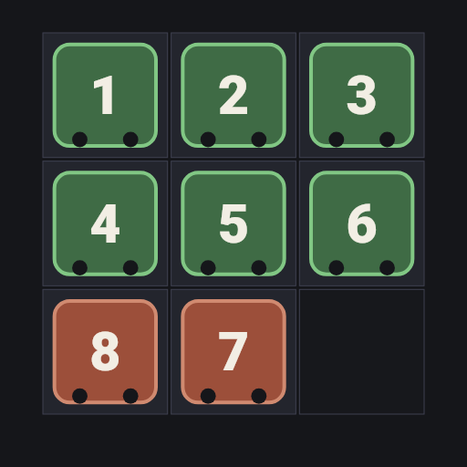<br><b><a href="Shuntbury">Shuntbury</a></b></div> | Slide the wagons one at a time into the empty berth and shunt the yard back home | Sam Loyd offered a thousand dollars for the yard with two wagons swapped and never paid: the count of pairs of wagons out of order, read row by row, stays even or stays odd whatever is shunted, since a sideways shunt changes nothing in that order and an up-or-down shunt jumps one wagon over the two between it and the gap, changing the count by two or by nought; the walk goes out from home breadth first through every yard the shunts can reach, 181,440 of the 362,880 arrangements, with the fewest shunts to each and 31 the most any needs, and the count of pairs out of order is read off all 362,880 with no walk at all and is even on exactly those 181,440 and odd on the rest; The Swapped Pair ships hopeless because 1 2 3 / 4 5 6 / 8 7 _ has one pair out of order, odd, and no shunt makes it even |
| <div align="center">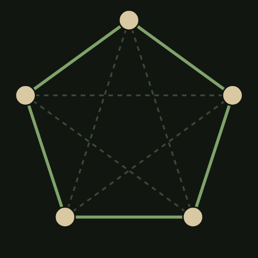<br><b><a href="Skeinwell">Skeinwell</a></b></div> | Tap lanes in and out between five greens and watch each lane's share of the stringings move | Ronald Foster 1949, published about electrical networks: a stringing joins all five greens without closing a loop and always takes four lanes, so adding every lane's share, the fraction of the village's stringings that run along it, counts the four lanes of every stringing once each and comes to four however the lanes lie; all 1,024 ways the ten lanes can lie are taken, 728 of them joining every green up, and every lane's share is found twice, once by listing the stringings that run along it and once by putting a unit of traffic in at one end of the lane and out at the other and reading the difference across it in exact fractions, the two agreeing on every lane and the shares adding to 4 on all 728; More Than Four ships hopeless because every stringing uses four lanes and no other number |
| <div align="center"><br><b><a href="Sliverton">Sliverton</a></b></div> | Step the three marks along the sides of the field and watch the sliver the cuts leave in the middle | Routh's rule, from Edward Routh's statics treatise of 1891: cut from each corner of a triangle field to a mark on the far side and the sliver in the middle takes the square of xyz less one, over (xy + x + 1)(yz + y + 1)(zx + z + 1), where x, y and z are the ratios the marks divide the sides in, so the two-thirds mark on every side leaves a seventh; every setting of the three marks is taken, 1,331, and the sliver measured twice, once by crossing the cuts in exact fractions and taking the area off its three corners and once by Routh's rule with no crossing in sight, the two agreeing on all 1,331; the sliver comes to nothing on 31 settings, exactly the ones where the three cuts meet, which is Ceva from 1678; The Sly Vanishing ships hopeless because a sliver with no area has its three corners at one point and that point sits on all three cuts |
| <div align="center">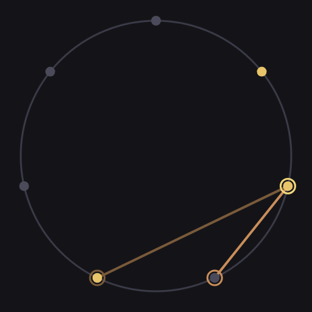<br><b><a href="Squarewell">Squarewell</a></b></div> | Turn the base and the clock and watch a base and its opposite square to the same hour | Euler 1748: raise an hour on a prime clock to the (p - 1) / 2 and it comes to 1 if the hour is a square and to one short of the clock if not, never anything else, and since a base and its opposite always land together and no third base joins them, exactly half the hours but 0 are squares; every base on every prime clock to a hundred is squared, 24 clocks and 1,034 hours, with Euler's test set against the squares hour by hour and the two agreeing everywhere, one short of the clock a square on exactly the 11 clocks one more than a multiple of four and two a square on exactly the 11 one more or one less than a multiple of eight; The Two of Eleven ships hopeless because the squares on eleven are 1, 3, 4, 5 and 9, so 2 is nobody's square, and 2 to the fifth is 32, one short of three elevens |
| <div align="center"><br><b><a href="Stickerwick">Stickerwick</a></b></div> | Set the stickers in the set and the packets bought and read off the average and the chance of a full album | The sticker album: once k of the n stickers are held a new one comes with chance (n - k)/n, so it takes n/(n - k) packets on average and the whole set takes n/n + n/(n - 1) + ... + n/1, which is n times the n-th harmonic number, 14.7 for six and 29.28 for ten, growing like n times the log of n, the last sticker alone taking n packets and being the slowest by far; every set of one to twelve stickers is worked in exact fractions, its average by the stages and again by the tail summed, and the chance of a full album after every count of packets to sixty by counting the ways with the signs turning and again by walking the packets one at a time, the voices agreeing on all 720 settings; The Certain Album ships hopeless because the same sticker could come every time, so a set of two or more is never certain, a set of six still short after sixty packets one time in ten thousand |
| <div align="center">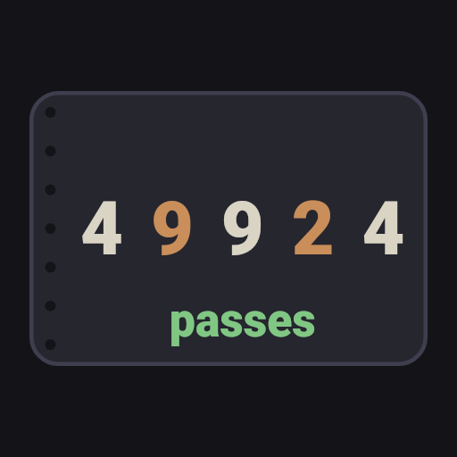<br><b><a href="Stubwick">Stubwick</a></b></div> | Turn the five dials of a ticket and watch Luhn's sum and the stamp | Hans Peter Luhn of IBM, 1954, the rule that sits on bank cards to this day: from the right, double every second digit, take nine off a double past nine, add the lot, and the ticket passes when the sum ends in nought; every ticket of five digits is taken, 100,000, summed by the doubling and again by the table of doubles, 10,000 passing, one check digit for every run of four, and on every passing ticket the sweep tries every single slip of a digit, 450,000, every swap of two unlike neighbours, 36,000, and every turn of a twin pair, 36,000, finding no slip passing, 800 swaps passing, every one a 0 and a 9, and 2,400 twin turns, 800 a kind; The Slip Unseen ships hopeless because the doubling takes the ten digits to 0, 2, 4, 6, 8, 1, 3, 5, 7 and 9, every digit once, so no two digits double alike and one slip always moves the sum |
| <div align="center"><br><b><a href="Sunderby">Sunderby</a></b></div> | Tap sizes off the shelf to sunder the number asked into the kind of parts asked | Euler 1748: a number sunders into parts all different in exactly as many ways as into parts all odd, and Glaisher's folding says why, since merging two equal parts of an all-odd partition into one part twice the size until no two are alike lands on an all-different partition, and every all-different partition unfolds from exactly one all-odd one; every partition of every number to thirty is laid out, 28,628 in all and 5,604 for thirty alone, the all-different and the all-odd counted on each and found equal on all thirty numbers, 296 and 296 at the top, every all-odd partition folded and landing on the all-different ones once each, and every partition turned on its side to swap its count of parts for its largest part; The Odd Evens ships hopeless because even parts add up to an even number however many there are, and nine is odd |
| <div align="center">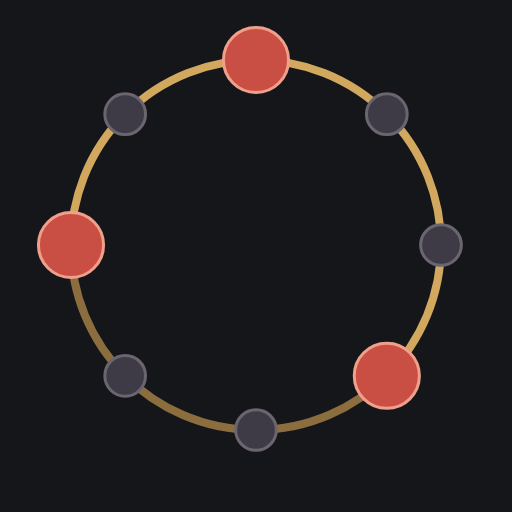<br><b><a href="Tabormere">Tabormere</a></b></div> | Tap the steps of the ring to set hits and read the gaps | Toussaint's finding of 2005: hits spread round a ring of steps as evenly as they can go land exactly where Euclid's rule puts them, hit i at the floor of i n/k, along with its turnings, n over the greatest common divisor of n and k of them; every pattern of every ring to twelve steps with every count of hits is tried, 90 rings and 8,190 patterns, and the 474 even ones are Euclid's rhythm and its turnings on every ring, with equal gaps exactly when the hits divide the steps; the tresillo lands 8 patterns of the 56, the cinquillo 8 of 56, the bossa 16 of 4,368 and the bembe 12 of 792; The Even Tresillo ships hopeless because three equal gaps would have to add up to eight, and eight into three won't go |
| <div align="center">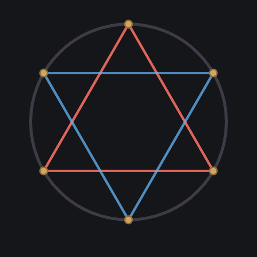<br><b><a href="Threadwick">Threadwick</a></b></div> | Set the nails and the skip and follow the thread from nail to nail until it comes home | A thread that skips the same count round a hoop of nails comes home after the count of nails over the greatest factor the count and the skip share, so it takes as many strokes as that greatest common divisor and each stroke touches the count over it; every thread is walked nail by nail on every ring from three nails to twelve with every skip, 65 settings, and the walk agrees with the divisor on all 65, skip k and skip count less k draw the same lines, and the one-stroke stars of each ring are Euler's count of the skips sharing nothing with the count less the two that run round the rim, each star drawn by two skips; the pentagram, the two squares, the three triangles and the twelve each land 2 settings of the 60; The Star of David ships hopeless because six is two threes and every skip that could make a star of six shares one of them |
| <div align="center">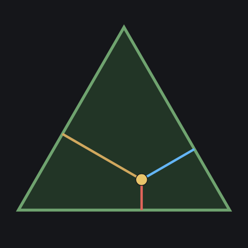<br><b><a href="Threefold">Threefold</a></b></div> | Tap a point of the green to stand there and read the three distances in rungs | Viviani, who saw it in the 1600s: the three distances from any point of an equilateral green to its three sides add up to the height, because the three triangles the point makes with the sides fill the green exactly and each is half a side times a distance; every point of the lattice on the green of side twelve is walked, 91 of them, 36 on the sides and 3 at the corners, the rungs read off the lattice adding to twelve on every one and the three triangles worked as whole numbers of cells filling the green of 288 on every one, each triangle its rung's twelfth; the middle stands 4, 4 and 4 with triangles of 96 each, six points stand 1, 2 and 9, three stand on a side six from each of the others, and six stand 2, 4 and 6; The Longer Walk ships hopeless because those triangles fill the green and nothing more, so the distances add to the height wherever the walker stands |
| <div align="center">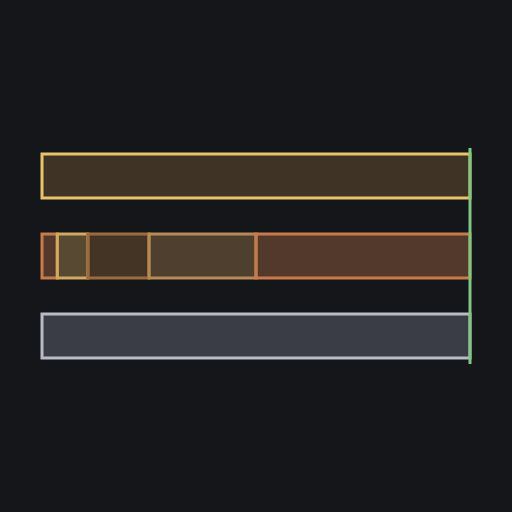<br><b><a href="Tithebury">Tithebury</a></b></div> | Wind the number up or down, by one or by ten a tap, and see its divisors laid end to end against it | Euclid's perfect numbers: add up every divisor of a number but the number itself and three of the first five hundred get exactly themselves, 6, 28 and 496, each a power of two times one less than the next power with that odd number prime, 2 by 3, 4 by 7 and 16 by 31; every number to 500 is swept, the divisors added up by trying each in turn and by the formula from the prime factors, and the two agree on all 500 and on their tithes; 220 and 284 pay each other and no other number under 500 has a partner, 121 of the 500 get more than themselves back, every one even with the first odd one at 945, and 120 gets exactly twice itself, 240 from fifteen divisors; The Power of Two ships hopeless because nine numbers of the 500 come one short and they are exactly the powers of two from 1 to 256 |
| <div align="center">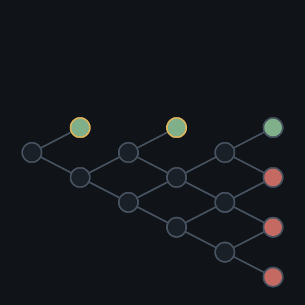<br><b><a href="Tosswell">Tosswell</a></b></div> | Tap the standings you would leave at and set your own rule for walking away | Doob's optional stopping theorem, for a rule that has to stop by the fifth toss: whatever standings you mark to walk away at, the 32 runs of the fair coin average nothing, since at any standing the two tosses that leave it are worth one more and one less and are equally likely, so the standing is worth exactly what it holds and so is leaving there; all 32,768 ways the 15 standings can be marked are taken, 802 rules that differ in what they do, each worked once by walking all 32 runs and once by folding the standings backward from the last row, and the two agree on every marking with every standing folding to what it holds; the most any rule is ahead is 22 runs of the 32, eleven in sixteen; The Sure Thing ships hopeless because a rule that never went behind could only average nothing by ending at nothing on every run |
| <div align="center">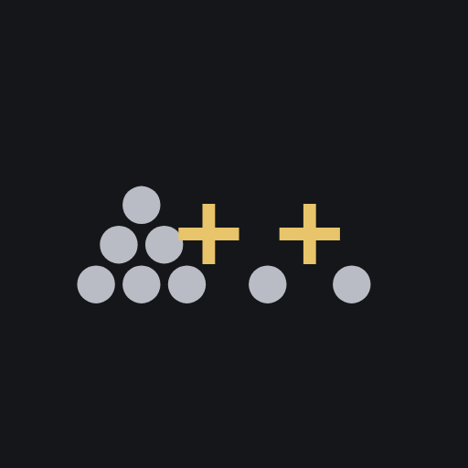<br><b><a href="Trebleworth">Trebleworth</a></b></div> | Take heaps from the shelf into the slots and make the number asked | Gauss in 1796, written in his diary as Eureka, num = triangle + triangle + triangle: every whole number is three triangular numbers added, nought allowed, because eight times k(k+1)/2 plus one is (2k+1) squared, so n is three triangular numbers exactly when 8n + 3 is three odd squares, and it always is; every number from 0 to 500 is swept for its heaps of three and of two, and the three-heap ways of each n match the odd-square ways of 8n + 3 one for one by the roots 2k + 1 on all 501; 406 has the most ways with sixteen, twelve numbers have a single way, and two heaps miss 212 of the 501; The Five ships hopeless because below five the triangular numbers are 0, 1 and 3, and their pairs add to 0, 1, 2, 3, 4 and 6, never five |
| <div align="center"><br><b><a href="Truckleford">Truckleford</a></b></div> | Work the three levers to shunt six wagons through one siding into the order asked | Knuth set this down in 1968, in the first volume of The Art of Computer Programming: one siding makes 132 of the 720 orders six wagons can stand in, because only the wagon at the points can be sent out, so no out-train holds a wagon, then a smaller one, then one lying between them, nothing of the shape 3, 1, 2; every order of every train from one wagon to eight is taken, 46,233 orders, each read once by running it through the yard and once by looking through the order for that shape, and the two agree on all of them, the counts from one wagon to eight being 1, 2, 5, 14, 42, 132, 429, 1430, the Catalan numbers; the six-wagon out-trains take 6 to 11 taps, 1 at 6, 15 at 7, 50 at 8, 50 at 9, 15 at 10 and 1 at 11, which are the Narayana numbers; Three, One, Two ships hopeless because it is exactly the shape the points forbid |
| <div align="center">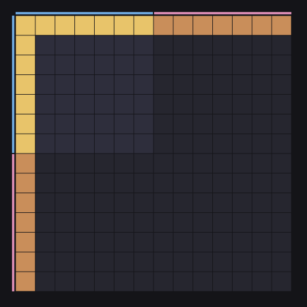<br><b><a href="Tuesleigh">Tuesleigh</a></b></div> | Wind the tags up or down and see the families that hold a boy of the first tag | Two children, and one thing told about them: told a family of two has a boy, the chance both are boys is a third, and told the boy carries the first of k tags it is 2k - 1 in 4k - 1, so seven days give the Tuesday boy's 13 in 27, twenty-seven of the 196 families alike holding one and thirteen of those being two boys; every family is counted out for every tag count from one to thirty, 4k squared families each, and the count agrees with the form on all 30, the chance rising with every tag, a third at one, 3/7 at two, 5/11 at three, 9/19 at five, 25/51 at thirteen and 59/119 at thirty, while the same count told which child is the tagged boy comes to a half every time; The Half ships hopeless because twice 2k - 1 is one short of 4k - 1, so the chance falls short of a half by one part in twice 4k - 1 at every tag count |
| <div align="center"><br><b><a href="Wardsby">Wardsby</a></b></div> | Tap a household to move it round the wards until one side holds three of the five wards | Packing and cracking on a five-by-five parish: a ward of five goes to the side with three or more of its five, and the vestry to the side with three or more of the five wards, so a ward is won only with three votes in it and a side with v votes wins at most a third of v wards; every drawing of the twenty-five households into five wards of five in one piece is walked, 4,006 of them, each checked sound and none twice, and every one told for the wards each side wins; ten Blues in the two left columns win three wards in 276 drawings, and fifteen Blues in the top three rows lose three wards to ten Reds in 276; The Eight ships hopeless because three wards take nine votes and eight Blues have eight |
| <div align="center">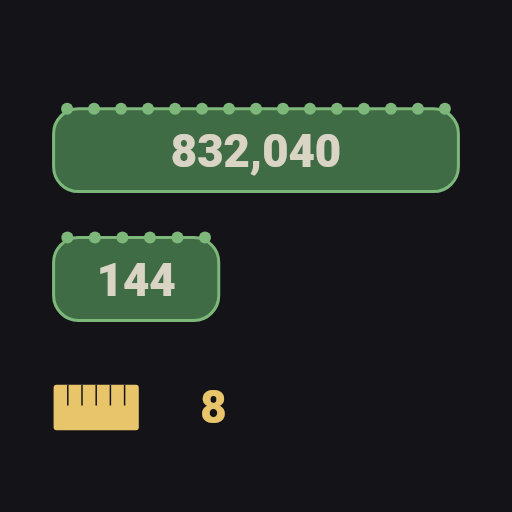<br><b><a href="Yardwick">Yardwick</a></b></div> | Step the two counts on their dials and watch the longest yardstick that measures both hedges | Lucas 1876: two Fibonacci numbers share exactly the factors their counts share, so the longest yardstick measuring the mth and nth hedges is the Fibonacci number of the common measure of m and n, the reason being that the (m + n)th is the (m - 1)th times the nth plus the mth times the (n + 1)th, which lets Euclid run on the counts as it runs on the hedges; every pair of counts from one to thirty is taken, 900 settings, the yardstick found by Euclid on the two hedges themselves and again from the counts, the two agreeing on all 900; the yardstick is five on 23 settings, eight on 19, and 55 or longer on 37, with 832,040 the longest at both counts thirty; The Odd Share ships hopeless because counts that share no factor have one for their common measure and the first Fibonacci number is one, so the yardstick is one, and Euclid on the counts said so first |

## The idea they share

A game that says "solvable" usually means somebody played a few and it seemed
fine. Every game here means it, and the proof is a test rather than a
paragraph:

- **Cinderplot** lays a minefield out, plays it through with a solver that
  only reasons, and throws it away if the reasoning ever runs out. It throws
  it away as well if it needed *less* thinking than the difficulty on the
  label promises. Nineteen boards in twenty go in the bin.
- **Haulyard** searches every yard for the shortest way through it, and a test
  fails if the par printed on the level is off by one.
- **Hazardwell** works out the exact chance of winning from all million
  positions in the game, then checks the answer is a fixed point of the rule
  that made it. That is the only proof there is that an optimal opponent is
  optimal.
- **Chalkway** ships an actual drawing with each level rather than a note
  saying one exists, and the drawing has to still work when both ends move. A
  line that only works at one exact position is a coincidence rather than an
  answer.
- **Lockstead** gives you exactly five guesses because every one of the 1296
  codes can be found in five. That was walked as one tree rather than sampled,
  and it agrees with Knuth's published result from 1977.
- **Rungwick** walks every four-letter word in the language outwards from the
  far end of each climb, so the number of rungs is the shortest path there is.
  The same distances tell you the moment you have stepped off it.
- **Cairnfall** settles a row of cairns by one exclusive-or, and proves the
  theorem it rests on by walking the entire game tree of every small position
  and checking the two answers agree.
- **Rookvale** walks the entire tree of every board and throws away any with
  two ways through, so every capture is forced by something. The same walk
  tells you the moment a capture has left no way through at all.
- **Wickfell** turns pressing lamps into a system of equations over two
  values, solves it, and tries the null space to get the *fewest* presses
  rather than merely some. Then it checks the whole thing against brute force
  on a board small enough to try every set of presses there is.
- **Skeinmoor** counts every way of filling a board, every route and every
  order of drawing them, and ships only the boards with one. Two boards in two
  hundred thousand survive it, and the count is taken under the rules the
  screen obeys rather than the cheaper ones the search would have preferred.
- **Packwold** is an exact cover problem, so its solver is Algorithm X with
  dancing links. The check on it is that the twelve pentominoes come out at 2,
  368, 1010 and 2339 packings of the four rectangles they fit, which are the
  figures everybody else has had for decades.
- **Hollowmarch** adds up the pegs in a field of four values, where three in a
  row carry a^k, a^(k+1) and a^(k+2) and a^k + a^(k+1) = a^(k+2). The sum is
  therefore the same after every jump ever made, so a hollow whose own sum
  does not match is a hollow no sequence of jumps can end in. That is proved
  rather than searched. On the 33 hole board it rules out 28 of the 33, and
  the search then reaches all five that are left.
- **Warrenshaw** settles every position of the chase backwards from the end,
  so the runner is the table read the other way up rather than an opponent
  somebody wrote. Then it answers the same question a second way that never
  looks at a move: rub places off the map until it does or does not come
  apart, which is a theorem from the early eighties. The two are held against
  each other on three hundred maps made up at random.
- **Reelbury** rests on a proof from 1962 that a pairing nobody wants to swap
  out of always exists, whatever everybody's lists say, and the proof is the
  way the game finds one. Every round then went through every possible pairing
  and was kept only if a second one did not hold as well. Uniqueness is
  checked a second way that counts nothing: both sides ask, and the answers
  agree exactly when there is one.
- **Weirbank** hands over the argument rather than the number. The same
  search that finds the most water a works will carry also finds a set of
  pipes that, cut, leaves no way from the spring to the mill, and what those
  pipes take between them is the same number. A test checks the two against
  each other on three hundred works made up at random, and then cuts the
  pipes it named to make sure nothing gets through what is left.
- **Winnowmere** turns "does this sort every row of numbers there is" into
  2^n rows of noughts and ones, which is the old result that a network sorting
  those sorts anything. So the game can check a network after every tap and
  hand over the row it still gets wrong. The number of comparators on each
  puzzle is worked out here rather than looked up, by walking every network
  there is with the ones leaving the same rows behind counted once: 1, 3, 5,
  9, 12, 16 for two lines up to seven.
- **Carterfen** finds the shortest round of twelve farms without measuring
  any of the thirty nine million orders. It works out the shortest way to
  reach every set of farms instead, which is eleven thousand part-rounds,
  because two orders that call at the same farms and end at the same one are
  competing for the same journey home. Twenty five random maps are solved both
  that way and by measuring every order, and the two always agree.
- **Beaconholt** has nothing clever to offer, which is the point. It tries
  every set of one hill, then every set of two, and the first size that
  watches the whole country is the fewest there is, because nothing smaller
  was left untried. The obvious method, light the hill that adds the most dark
  hills and repeat, gets a country watched perfectly well and uses one beacon
  too many on every country here but the teaching one. A test insists on that
  gap, and a hundred random countries are each checked by trying every set one
  smaller than the answer.
- **Rimeworth** does not search for its answer at all. A lorry drives out of
  a junction as often as it drives in, so a junction with an odd number of
  lanes has to be where a run starts or finishes, and a run has two ends:
  count the odd junctions, halve it, and that is the fewest runs there are.
  That is Euler on the bridges of Königsberg, and it is checked here against
  a search over every way the lorry could actually drive, on two hundred
  parishes made up at random and on all seven that ship.
- **Marchcombe** ships only maps that prove their own answer. A set of fields
  that all share a hedge with one another needs a dye each, so it settles the
  fewest from below, and every map here was kept because such a set is exactly
  as big as the answer. The answer itself is worked out twice, once by
  painting and once by splitting the map into sets of fields that keep out of
  each other's way, and the two agree on three hundred maps made up at random.
- **Quayfleet** is the one where the greedy rule is right. Take the ship that
  casts off earliest, then the earliest that does not clash, and so on, and
  that is exactly the most ships there are. The proof of the number comes out
  of the same walk for nothing: every ship passed over is still in the berth
  on the last hour of the ship that displaced her, so those hours are a
  handful that every ship in the book wants, and two ships wanting the same
  hour cannot both have it. The game draws them, and five hundred random days
  are settled by the rule and by trying every set of ships to make sure.
- **Churnwick** knows which amounts cannot be measured at all without looking
  for them. Filling puts a churnful in, emptying takes one out and pouring
  loses none, so whatever stands anywhere is a whole number of churnfuls added
  and taken away: out of a six and a fourteen, nothing odd can ever stand in a
  churn. A hundred and twenty random dairies are asked that question by
  arithmetic and again by walking every arrangement of milk they can be in,
  and the two lists always match. The fewest goes is settled twice as well,
  once by the walk and once by a rule for two churns that looks at nothing.
- **Handfast** hands over the obstruction rather than the number. When the
  walk that gives out the work runs out of hands, the jobs it walked through
  are a set with fewer people between them than there are jobs, and that is
  the only thing that can ever stop a board being covered. It is Hall's
  condition from 1935, it costs nothing because it is what the failed search
  left behind, and a player can check it by eye: every cross in the shaded
  rows falls inside the ringed columns. Four hundred random fairs are settled
  by the walk and by a search over every way of handing the work out.
- **Pyxholm** gets its floor from counting and its answer from searching, and
  ships a box where the two disagree. A weighing has three answers, so k of
  them tell at most 3^k things apart, and a dozen coins each of which might be
  heavy or light is twenty four things: three weighings might do and two
  cannot. On four coins the same counting says two might do, and it cannot be
  done in two, which only a search over every weighing there is can show. The
  beam is adversarial as well, answering with whatever leaves the most to do,
  so a number that comes out of a round is a promise rather than luck.
- **Trestlewick** has two floors under every answer and neither of them
  searches. A run of timbers each resting on the one before cannot be spread
  over fewer days than there are timbers in it, whatever the crews; and a crew
  raises one timber a day, so the work alone is the timbers over the crews. A
  frame ships only when one of those two is exactly the answer, and the game
  draws the run straight up the frame when the run is the tight one.
- **Trodstow** is the one that explains every path rather than only the
  total. Put some hamlets on one side of a line and the rest on the other:
  every network joining the parish crosses that line, so the cheapest crossing
  path is in every cheapest network there is. The game draws the line, tints
  the two sides and lights up the crossings. The same argument upside down
  covers the paths that are not in the answer: dearest on a loop means in no
  cheapest network at all. Between them they account for every path on the
  map, and no two paths in a parish cost the same, so every reason is exactly
  true rather than nearly.
- **Chasegarth** proves both halves of its own claim. The pairs of letters
  out of order carry an odd or even that no slide can change, so half of all
  arrangements can never be made to read right, and that is arithmetic. The
  other half is a walk: every arrangement sliding can reach, outwards from the
  finished frame, so every par is the fewest there is and the hint reads
  straight off the table. A test makes the two agree on all 362,880
  arrangements of the three by three, which is what caught the parity being
  wrong on odd widths. One forme ships impossible on purpose, says so on the
  label, and lets you swap the dropped pair back and finish it.
- **Groatsworth** gets its lesson from history rather than from a generator.
  The old English coinage, with a florin at 24 pence under a half crown at 30,
  really did make "biggest coin first" pay a coin extra at four shillings, at
  six and six, and on up the half crowns for ever; the decimal till never
  does. Both facts are checked by sweeping every amount to five pounds against
  an honest table, and every shipped amount sits exactly on the plain floor,
  so the why is always one multiplication a player can do.
- **Linacre** is the adversarial one: you cut a telegraph wire a turn, the
  machine braces one back, and both sides are played from a table that holds
  every position, so a par is a promise. The anchor is Lehman's theorem from
  1964: the linesman moving second holds exactly when two webs of wire,
  sharing nothing, each join the stations, over some of the posts and not
  always all of them. That last clause is easy to get wrong and the test
  that plays the theorem against the game on two hundred random nets caught
  the first version doing exactly that. One round ships labelled impossible,
  and Why draws the two webs that make it so.
- **Shardlow** is the egg drop puzzle with the pots of a pottery yard, and
  its floor comes from counting words: a morning of drops reads as breaks and
  survivals with no more breaks than pots, and two answers that would read
  the same word can never be told apart. The floor is exactly the answer on
  every ladder to two hundred rungs and four pots, checked against a search
  that tries every plan, and the referee breaks pots as awkwardly as pots can
  break, so par is a promise rather than luck.
- **Staddlestone** is the tower puzzle everybody knows, built the way this
  repository builds things: the doubling argument gives the pars, a walk of
  every arrangement confirms them out to nine stones, and the walk also makes
  the hint exact from anywhere and catches the moment a move is wasted. The
  walk corrected the tests once already: a wasted move here costs one, not
  two, because the single stone moves form a triangle. The game calls out the
  half way moment, the biggest stone crossing with exactly half the work
  spent, which is the argument made visible.
- **Lampwath** is the bridge and torch puzzle, and the first game here where
  the shortest way is weighed in minutes rather than counted in moves, so the
  settling behind it is cheapest first over every state a night can be in.
  Ferrying with the quickest walker loses the famous four two whole minutes
  to sending the slow pair together, and the Even Pace bridge is chosen so
  the same trade buys exactly nothing, with Why working the sum both ways in
  the bridge's own numbers. A brute force over every night agrees on all six
  bridges and a hundred random ones.
- **Treblesway** is change ringing on four bells: every row once and rounds
  home, which is a walk through all twenty four orders under the bells' own
  rule that nothing moves more than one place a change. The full tower has
  10,792 ways, counted here rather than cited; keep only two changes and
  exactly two survive, the plain hunt both ways round; and one tower ships
  that cannot ring the extent at all, because none of its changes crosses
  the middle, an invariant the player can watch holding. The game keeps a
  live answer to whether the peal can still come round, so a stranded row is
  known the moment it is stranded.
- **Foldbury** posts shepherds at gates until no lane between them is dark,
  which is minimum vertex cover. The fewest is brute force, and under it
  stand two floors the player can check: a set of lanes no two of which
  share a gate, drawn in blue on the fold itself, and the plain count of
  lanes against the busiest gate. On every fold past the triangle the
  matching floor is exactly the answer, kept so by the generator; the
  triangle ships because there pairing proves nothing and the count carries
  it, which is where Konig's theorem stops and says so. A greedy post at the
  busiest gate ends one over on every big fold, and the ledger goes red the
  moment the walk becomes the reason.
- **Staplemere** sets bales down as they come, lighter on heavier only,
  which is patience sorting. The fewest piles equals the longest run of
  bales arriving in rising weight, Dilworth's theorem in a wool yard, and
  both directions are played rather than cited: the gold thread drawn
  through the yard is the floor, one pile forced per marked bale, and the
  snuggest legal top each time meets it exactly. Brute force over pile tops
  agrees with both on every ordering of six and hundreds of random
  mornings, and the live could-still-be is checked against brute force from
  part-played positions too. The trap is hoarding the snug top for a closer
  weight, which costs a pile on every deal built for it, and one deal holds
  both runs at exactly three, the nine-bale boundary that ten bales always
  break.
- **Pinderwell** is Wythoff's game as a ewe driven to the pen: push her
  west, south, or evenly both, last push wins. The safe squares are built
  two ways that know nothing of each other, a backwards sweep of the game
  and the pair-by-pair ladder, laid over each other on all 3,721 squares of
  a sixty-pace field, with the golden ratio checked on top rung by rung.
  The pinder plays perfectly from the same table, pars are worked out
  against his most stubborn delay, and a wrong push is called out the
  moment his answer lands on the ladder. One field starts the ewe on a
  rung and ships labelled unwinnable, because the way to believe a safe
  square is to stand on one and lose.
- **Shroveham** is pancake sorting on a griddle: slide the slice under a
  cake, turn everything above it, serve smallest to biggest in the fewest
  flips. The referee is a breadth-first walk of every arrangement, and the
  floor is the gap count marked on the stack itself, neighbours whose sizes
  are not next in order, with the sweep checking at every size it can hold
  that no flip ever mends two gaps. The floor is honestly a floor: one
  shipped batch needs a flip more than its gaps say, and Why owns the
  shortfall instead of hiding it. The griddle hand's two-flips-a-cake
  routine is simulated, bounded, and beaten by three flips on the batch
  named for it, with every wasted flip called out live.
- **Smithwaite** is the tavern rings, the blacksmith's puzzle: the first
  ring moves freely, any other only when the ring before it is on and the
  rest before that off. The suite counts the moves of every state to prove
  the whole puzzle is one path with two ends, which is why the single
  wrong move costs exactly two and is called out at once. The second voice
  is the smith's count: write figures over the rings, flip where a ring is
  on, copy where it is off, read them as binary, and that is the distance
  to free, laid over the walk on every state of three to nine rings. The
  Tangle ships with one ring on, looking nearly done and farther than the
  whole puzzle, because fewer rings on does not mean nearer the end.
- **Dipthorne** is the Josephus count as schoolyard dipping: a rhyme
  chanted round the ring, one child a beat, whoever it lands on steps out,
  and you choose where to stand before it starts. The count run out loud
  and the renumbering recurrence agree on 1,440 rings, and for two-beat
  rhymes the famous binary turn joins them on 500 more: the ring's size
  with its front figure moved to the back is the safe seat, done in front
  of you by Why. Ip Dip ships at eight children because the powers of two
  are exactly the rings where the turn changes nothing and the dip stone
  seat itself survives, swept and proved. Longer rhymes get the honest
  answer: no trick, the reckoning climbed ring by ring.
- **Rindhope** is Chomp on a block of cheese, and it carries the shelf's
  strangest lesson: existence without construction. The stealing argument
  runs as code, biting-after-the-nibble proved identical to biting the
  whole block on every bite to six by six, so the first mouse wins every
  block; which bite wins, only the search can say, and the game says so
  out loud. Where shapes exist they are played: the mirror wins every
  square and the one-crumb-longer bottom row wins every strip, both swept
  against random mice and best resistance. One block gives the grey mouse
  the first bite and ships labelled, the theorem felt from the wrong
  side.
- **Colthorpe** is the knight's tour, ridden by a colt. The certificate is
  laid into the board: two grasses, every jump swapping colour, so the
  Wrong Gate's impossibility is countable on the field, thirteen dark and
  twelve light against a round that needs thirteen of its starting
  colour. The Cross Paddocks are the twin lesson: colours level, no named
  argument, impossible only by the walk of every ride. The live answer,
  can the round still be finished, is a pruned Warnsdorff search fast
  enough to watch every jump, stranding called out as it happens, and the
  Full Round comes home closed on six by six.
- **Tallowfield** is Hamming's seven-four code as a lantern garden: seven
  lamps in the seven beds three round hedges cut, planted so every hedge
  counts even. A draught turns exactly its lamp's hedges odd, so the
  complaints cut out one bed and the bed names the lamp, a decoding you
  do by looking at a picture. The tallies are held against flipping every
  lamp on all 128 patterns, the sixteen plantings are checked pairwise
  three apart, and the boundary is swept whole: every two-lamp draught on
  every planting makes the tallies point at a third lamp with perfect
  confidence, mended into a sound garden that is not the gardener's. One
  evening ships that way on purpose, and reading its tallies right while
  they lie is the lesson.
- **Pennygill** is Penney's nontransitive coin game, the old bar bet.
  Every call has a beater, drawn as a ring of eight with its arrows, so
  there is no best call and calling first is the whole mistake. The odds
  are computed by Conway's overlap counts and by an exact rational walk
  of the flipping's states, laid over each other on all 56 pairs; the
  house reply beats all eight calls, three heads loses seven in eight,
  and the turned-over reply is proved exactly even. One table swaps the
  chairs so calling second finally pays, one holds you to the sucker's
  call, and every settled match owns its odds on the card, luck
  included.
- **Spanham** is Langford's problem: two blocks of each number on a
  shelf, the pair of k holding exactly k seats between. The impossibility
  certificate is finger arithmetic, the seat sum minus the span sum must
  be even, and Why performs it live for the shelf in front of you; the
  search knows nothing of parity and agrees at every size to twelve, with
  the mod-four shape swept to twenty. The counts land where the books
  put them, 52 and 300 with mirrors checked present, stranding placements
  go red as they land, and the five-pair shelf ships odd on purpose.
- **Lockhithe** is the hundred-prisoners puzzle at harbour scale: every
  sailor hunts their own chit, half the lockers each, all or nothing.
  The theorem is walked rather than told, a sailor following the chits
  treads exactly their own loop, so the crew comes through exactly when
  no loop outruns the half, and Why ropes the loops over the doors and
  says whether the crew was safe or sunk before a door opened. The odds
  come out three ways, exact counting, a grind of all 40,320 stowings of
  eight, and the luck baseline, agreeing to the digit: one in a thousand
  guessing at ten sailors, better than one in three following. Rounds
  are dealt outside the game so the tests see exactly the stowings they
  mean.
- **Filberthow** is Fibonacci nim over a squirrel hoard: take up to
  twice the last take, last nut wins. The winning move is the smallest
  cluster of the Zeckendorf split, ringed on the hoard by Why with each
  count chipped above it, and the rule is held against a full search on
  all 1,830 standings to sixty nuts. Openers lose exactly the Fibonacci
  hoards, one of which ships labelled and machine-proven across twenty
  openings; the Thirty teaches the coldest case, a winning first take of
  one single nut.
- **Ellmarsh** is Euclid's game on a mercer's bench: cut whole lengths
  of the short bolt from the long, last cut wins. The cutter holds the
  bench exactly when the long bolt passes the golden ratio times the
  short, decided in whole numbers, long squared against long-times-short
  plus short squared, and Why drops a golden tick on the cloth where the
  gap ends. The gap and the search agree on all 11,325 pairs to a
  hundred and fifty ells; choice exists exactly where a quotient reaches
  two, and choice is always winning. Consecutive Fibonacci pairs
  alternate across the edge by a single ell, and the Near Run and the
  Golden Bench ship as that pair of pairs, one yours, one labelled the
  mercer's.
- **Withyshaw** is Blue-Red Hackenbush, the game the surreal numbers
  grew out of: cut only your withies, everything above falls, who cannot
  cut loses. Every stalk is worth an exact dyadic fraction, whole while
  its colour holds then halving, and the sum decides the hedge before a
  cut is made: positive yours, negative the hedger's, nought a loss for
  whoever moves. The worth is laid over a full game search on every
  small hedge both turn orders round, the classic values are pinned by
  name, and the Even Hedge ships as the famous nought, half plus half
  less one, every losing first cut verified.
- **Millgreave** is the queens problem as windmills stealing wind along
  rows, files and slants. Both faces are played: the counts by full
  backtracking land the classic numbers, ninety two on eight and the
  spiky four on six, while the staircase constructions write a setting
  straight down for every size past three, raised as gold ghosts by Why
  and checked plot against plot to twelve. The Three Mills ships
  impossible with its cases walked by hand, refusals name their thief,
  and stranding mills go red the moment they stand.
- **Frankmoor** is the Frobenius stamp problem: two coprime stamps, pay
  the postage exactly. Payability is a remainder walk short enough to do
  at the counter, and Why lays it out in chips, lighting the divisible
  one; twenty three against fives and sevens walks 23, 16, 9, 2 and
  never a five, four lines of proof. The old rules are swept true, the
  largest gap at ab less a less b with everything above it payable
  forever, and the gap count at half of (a-1)(b-1). Two letters ship as
  their stamps' own largest gaps, and the Odd Parcel teaches stranding,
  four sevens and a single five being the only way to thirty three.
- **Turnstead** is round-robin scheduling on a village green: pair the
  sides round by round until every pair has met exactly once. The
  pigeonhole floor is one breath, sides-less-one rounds at the least,
  and the circle method's turning wheel reaches it at every size, swept
  pair by pair to twelve and strung across the green as gold ghosts by
  Why. The Short Card ships one round too short, impossible in that same
  breath; free pairing can strand a card with every rule obeyed, and the
  live search, pigeonhole-pruned from thirty seconds to nine
  milliseconds, calls it as it lands.
- **Posygarth** is Euler's officers as a show garden: a Latin square of
  flowers and a Latin square of colours in the same beds, every pairing
  fresh. The plantings write themselves, two lines of arithmetic for odd
  sizes and the doubled square for four, proved sound by a checker that
  is itself tested by breaking a good planting. The Pair of Pairs ships
  impossible with its sweep watchable in a blink; six, the famous
  officers refusal, is honestly left unshipped rather than asserted
  unswept. Clashes are refused in their own words, and stranding posies
  go red as they land.
- **Fairhold** is Instant Insanity by its right reduction: paints as
  posts, opposite-face pairs as ropes, one rope of each crate to each
  line so every post holds two ends. The turning is implemented, a fair
  line's loops walked nose to tail, and the suite sweeps every fair
  line of four ropes to check it never fails; when both lines come fair
  the game turns the crates and stands the stack on screen. The Short
  of Madder ships impossible by counting one paint's faces, and the
  Tight Consignment's two ways are proved to be one stacking with the
  lines swapped.
- **Tilthway** is Tchoukaillon with its uniqueness on the table: for
  every count of seeds exactly one board plays home, grown backwards by
  unsowing, and the suite proves it to ten by playing every board there
  is. A furrow overfilled past its number is trapped for good and rims
  red as it happens, and the Dead Furrows ships that way from the first
  touch, in the house tradition of maps nobody can win.
- **Wickfield** is Lights Out with its algebra in the open: a
  breadth-first walk from dark and a matrix elimination agree on the
  fewest for all 66,048 boards of nine and sixteen, every shipped
  answer is executed before it ships, and the ring's sixteen ways are
  counted off its four quiet patterns. The Unquenchable is one lamp
  standing odd on a quiet pattern, odd through every press there is,
  and Why rims the pattern violet in front of you.
- **Shuntley** is the fifteen puzzle with its two famous facts walked
  fresh: a breadth-first walk from home meets the reversed-pair parity
  on every arrangement of both tray sizes, the deepest boards are
  pinned at twenty one and thirty one shunts with exactly two at the
  bottom of the eight, and Sam Loyd's thousand-dollar swindle ships
  labelled, its odd pair rimmed red when you ask why. A shunt that
  raises the live fewest is called out as it lands.
- **Bannford** is stable matching played by hand: eloping pairs are
  computed live and strung in red the moment two weddings betray each
  other, a sweep of every pairing of every party grounds every count,
  and the asking-round is run against that sweep on the two-sided
  parties. The Odd House is the smallest one-sided party with no
  settled pairing, shipped labelled, its three break-ups watched one
  by one, each by the person wedded to the unwanted housemate running
  off with whoever puts them first.
- **Bridgeholm** is the bridges of Königsberg made playable: landing
  tallies carry Euler's argument while a search tries every trail and
  counts the complete ones, the two agreeing on every town that
  ships. The Seven Bridges is the founding map of the house tradition
  of maps nobody can win, all four landings odd, and The Eighth
  Bridge is history's own mend, walkable between the two landings
  left odd, 208 walks from each end and none from anywhere else. A
  crossing that strands the walk is called out as it lands.
- **Riddlecombe** is sorting networks built by hand: combs drop heavy
  grain to the lower strand, and the live check runs every nought-one
  grist while a permutation sweep stands second voice, the two never
  parting on any of the 1,296 four-comb weaves. The optimal floors,
  three, five, nine and twelve combs, are each proved by a search
  that follows everything the shorter frame can leave, and The Short
  Weave ships those four combs as a labelled impossibility with two
  proofs that share nothing. Why runs the first foul grist down your
  weave in beads.
- **Spindlewood** is the Tower of Hanoi with its numbers walked, not
  recited: the doubling rule, the old iteration executed move by
  legal move, and a breadth-first walk of every board all name the
  same fewest, and the four-spindle jobs hold the leapfrog reckoning
  against walks of 1,024 and 4,096 boards. The Wager asks for the
  full hand in fourteen when the walk of all 81 boards holds no road
  shorter than fifteen: the house tradition's first bet that plays
  out to the end and hands you the proof you walked.
- **Ringmarsh** is de Bruijn rings set lantern by lantern: every run
  of the watch round the ring must spell a different word, clashes
  chord themselves red, and the two voices are a sweep counting the
  full rings, 4, 16 and 256 at the shipped sizes, and the shift-walk
  building one from the words alone. The Locked Watch holds four
  lanterns fast against a unique completion, and The Short Ring asks
  seven lanterns for eight words, dead by pigeonhole with the sweep
  of all 128 behind the label.
- **Shadewell** is nonograms held to the claim most sets never write
  down: the tallies must name one picture. A stacking tries every
  filling the tallies allow while a line-solver reaches the picture
  by deduction alone, and the two flawed plots ship labelled: The
  Short Tally asks nine cells of its rows and eight of its columns,
  dead by counting, and The Two Gardens fits two pictures the clues
  cannot tell apart, outlined in gold when you ask why. Overfilled
  lines fall red as they fall, and Show me offers only what honest
  deduction settles.
- **Pailsworth** is the decanting puzzles with the walk in charge: a
  breadth-first walk of every waterline gives the famous answers,
  four from a three and a five in six pours, the eight-five-three
  halving, fourteen stubborn pours for two pints from a seven and an
  eleven, and the live ledger counts pours-to-go from the same walk.
  The Third Pint asks four of a six and a nine, and every pour keeps
  every pail a multiple of three: dead by the shared measure, with
  the sweep of every reachable waterline behind the label.
- **Charmstead** is the three-by-three magic square with its counting
  on the table: the rows share forty five so each line carries
  fifteen, the four heart lines force the five, and a sweep of all
  362,880 fillings finds exactly eight charms, one square eight ways
  round. Pins carve the eight down to two, one, or none: The Heart
  of One and The Heavy Row ship dead, each impossible in three
  sentences of arithmetic with the sweep standing behind them.
- **Hirebeck** is interval scheduling as a booking ledger: a sweep of
  every choice, the early-finish rule, and a set of piercing
  o'clocks all name the same ceiling on every day, with the piercing
  struck in gold as the visible certificate. Two days spring the
  book-earliest trap on purpose, and The Extra Guest asks five
  bookings of a four-o'clock day, dead by piercing with the sweep
  behind the label. Clashes rim red by name as they stand.
- **Skittlemere** is Kayles against a house that never blunders: each
  standing run carries its count, the alley adds them the carry-less
  way, and a search of all 507 small shapes agrees with the
  arithmetic everywhere, the famous limping table and its period of
  twelve recounted besides. The Even Alley ships lost, two rows of
  six and the mirror strategy told to your face, and Why chips every
  run's count in gold on the lane.
- **Notchfield** is Golomb rulers with the census in view: every
  pair of notches measures its distance, chips run grey, green and
  red as lengths go unmeasured, measured and doubled, and a sweep of
  every placing counts the cuttings, the old perfect six-length
  among them. The Eleven carries its own optimality, a ten proved
  unable to hold five notches at all, and The Perfect Ten ships
  dead: ten pairs, ten lengths, no slack, and all 462 placings
  repeat something.
- **Boardleigh** is domino tiling with the mutilated chessboard at
  its heart: a count of every laying gives the strips their
  staircase numbers, verified against the rule itself at every
  length, and the live remainder-check calls out any plank that
  strands the rest. The Clipped Parlour ships unfloorable, two
  same-coloured corners gone and the two-colour count told in tint,
  with The Fair Clip beside it flooring twelve ways because its
  missing corners differ: which corners go is the whole story.
- **Ferrydale** is the river crossings walked whole: the keeper's
  seven, the three-and-three's eleven, four-and-four in nine given a
  bigger boat, all from a walk of every arrangement each river
  allows, with refusals naming the wolf, the goat or the outnumbered
  before any crossing goes wrong. The Four and Four ships dead: a
  boat of two, all 98 reachable arrangements walked, and the far
  bank never full.
- **Pegbourne** turns the pegs-and-marks game inside out: the
  guesses and their marks are the clues, and the pegs must be set
  the one way every row allows, judged live by the same marking
  arithmetic that made the clues. A sweep of all 256 codes counts
  each riddle's answers; The Two Minds honestly holds two, and The
  Liar's Riddle none, three red pegs and three green unable to share
  four slots, the irreconcilable pair found by the checker.
- **Tanglemere** is the game of Sim with Ramsey theory run in full:
  all 32,768 six-post paintings hold a one-colour triangle, the
  pigeonhole argument finds it on any of them as executable code,
  and five posts keep exactly twelve safe webs, every one two rings.
  A full search of every weave reads the standings, second seat
  winning the six posts, and The First Thread ships lost before it
  is woven, the house sitting in the winning chair.
- **Mottlemoor** is the chameleons puzzle with its invariant earned:
  a meeting moves every herd difference by nought or three, so a
  moor settles only where two herds share a remainder, and a walk of
  every herding agrees across all 815 small moors before anything
  ships. The Famous Herd is the classic thirteen, fifteen and
  seventeen, dead on its label with the walk of every herding of
  forty five behind it, and The Little Mismatch is the same refusal
  at pocket size.
- **Mousewold** is cops-and-robbers with one cat, and its founding
  theorem carried whole: a ground folds up corner by corner exactly
  when the cat can win, held against a search of every chase on all
  27,475 connected grounds of six posts or fewer. Why numbers the
  folding in gold on the ground in front of you, and The Ring Fence
  ships labelled hopeless, six posts round and not a corner among
  them.
- **Quirebeck** is the faro shuffle with its two famous answers
  carried whole: the shortest weaving that carries the top leaf to
  any seat is the seat's own figure written in binary, held against
  a walk of every weaving on every seat of eight leaves and
  sixteen, and a single turned pair is beyond mending because every
  weave is an even count of swaps and the walked world of a quire
  of eight is twenty-four stacks with the mended one missing. The
  famous pack rides along: out-weaves bring fifty-two cards round
  in eight.
- **Hurdlecote** is Pick's theorem worked with a sheep fence:
  acreage is the swallowed crossings plus half the walked ones less
  one, held against the shoelace's coordinate count on every simple
  fence of four hurdles or fewer the green holds, 18,934 of them,
  with the sweep itself pinned against a second enumeration in
  another language. Every closed fence is told its own numbers, and
  The Third Acre ships hopeless: twice an acreage is whole, and two
  thirds is not.
- **Marrowden** is the secretary problem judged at a village
  vegetable show: wave a fixed few marrows by, then take the first
  best-yet. The rule's exact counts, eleven of twenty-four sittings
  at four marrows and fifty-two of a hundred and twenty at five,
  are held against a sweep of every rank-based rule there is, 64
  and 1,024 of them, and none does better. The Sure Pick ships
  hopeless: two sittings can open alike with the best in different
  seats, so no rule of any kind lands it every time.
- **Leystone** is the no-three-in-line problem raised as standing
  stones: a green of n rows holds two stones a row at most, so 2n
  is the roof, and the search raises every sound ring to prove the
  roof is stood on, 1, 2, 11 and 32 ways on the greens that ship.
  The Odd Stone ships hopeless by the same counting, seven on three
  rows putting three in a row, and every refusal draws the ley it
  would stand on clear across the green.
- **Peckhollow** is tournament theory in a hen yard, three little
  theorems carried whole: every yard has a king, the biggest winner
  is always one because whatever pecked it was pecked by something
  it pecked, and no yard crowns exactly two, a second crown always
  dragging a third out of its own peckers. All of it is swept over
  every yard of three, four and five birds, and The Two Kings
  ships hopeless on the strength of it.
- **Knuckleby** is Sicherman's dice cut by hand: the sweep recuts
  every pair of dice there is and the factor-trade builds the
  matching pairs from the standard product's factors without
  rolling once, the two roads meeting to the last pip. Every
  matching die keeps exactly one ace, the four-and-six bench falls
  alike four ways, and The Even Bones ships hopeless because the
  table asks for a three and two even pips only ever land even.
- **Farthingford** is the Stern-Brocot walk waded one mediant at a
  time, with Ford circles resting on the water: two fords' circles
  kiss exactly when their crossing number is one, checked longhand
  on all 253 pairs of the stream, and the crossing number holds at
  one down every wade so the banks' circles never part. Between
  kissing banks the one shallowest ford is the mediant, which is
  why The Shallow Ford ships hopeless: a half and two thirds put
  together already make fifths.
- **Tussockmere** is Hex on a small marsh with its honest
  furniture: the no-draw theorem swept over every filling of both
  boards, exactly one crossing each; the game solved to its end,
  with only the short diagonal's openings surviving a perfect
  reply on the four-field; the pie rule as a judgment with a right
  answer the solve can name, strong pie and humble pie both; and
  The Second Chair shipping lost before it sits.
- **Beadlow** is Burnside's counting at a bead stall: what each
  turn of the ring fixes, summed over the turns and divided, held
  against a shelf that enumerates every string and folds them by
  turning. A repeat is named by the shelf necklace it turns into
  the moment it is strung, and The Seventh ships hopeless, asking
  seven of a four-bead ring whose whole world is six.
- **Braidfell** is the optimal merge pattern, the reasoning under
  Huffman's codes, worked as wool: every braid costs its two
  bundles together, lightest-first lands the least, and the sweep
  of every braid order, 180 on the five-bundle yards, finds
  nothing cheaper and knows the dearest too. The floor is
  recomputed after every braid and a costly one is called out, and
  The Fifty-Nine ships hopeless, asked a pound below the bottom of
  the whole sweep.
- **Copestone** is the study of square-free words laid as drystone
  walling: no run of courses twice over, the sweep laying every
  wall there is. Two kinds of stone die at the third course, all
  sixteen walls of four carrying a doubled run; three kinds climb
  past any height asked; and the palindrome
  flag-sand-flag-slate-flag-sand-flag stands sound at seven yet
  pens itself in, no eighth course of any kind surviving. The
  sweep also proved the walk's own crutch: a sound wall here never
  limps, it climbs or is penned outright.
- **Wardhall** is the art gallery theorem walked by lantern light:
  ear-clip the hall into triangles, colour the corners three ways
  with no triangle repeating one, and the scarcest colour is a
  watch that lights the whole floor from at most a third of the
  corners, built without counting a flag. The sweep posts every
  watch and finds the true fewest, sometimes under that roof, and
  The Comb Short ships hopeless: sixty-six pairs posted, every one
  leaving a tooth dark.
- **Scoreham** is the cycle lemma walked out loud: a ring of
  notches and wipes holds exactly as many good starts as it runs
  ahead, every tried start draws its whole tally-walk with the
  dips marked, and the start just past the last lowest ebb is
  always good when anything is, found without trying. Three voices
  agree over all 8,190 rings to a dozen marks, and The Tied Vote
  ships hopeless, running nothing ahead.
- **Gapstile** is the three-distance theorem on a dial: pegs at a
  stride's multiples cut the hoop into gaps of one, two, or three
  lengths, never four, and the longest of three is the other two
  put together. The sweep checks every stride of every round to
  twelfths against every count of pegs to thirty, all 1,980
  fences, and pins The Three of Seven to the only two dials that
  land it. The Fourth Gap ships hopeless: it asks for what the
  sweep has never seen.
- **Borrowfen** is the dollar game with its verdicts showing:
  Dhar's burning tidies any spread and reads settleability off
  the bank, the census counts each village's tidy spreads against
  Kirchhoff's spanning trees, 1, 4, 8, 8 and 3, and a plain
  search proves every fewest. The Charity opens at its village's
  genus, where every class of spread settles. The Short Pound
  ships hopeless: one pound of debt, one of coin, and no run of
  moves ever gets the village clear, because no move changes a
  spread's class.
- **Chainhurst** is Sylvester and Gallai on a five-by-five field:
  a chain through exactly two stones is bare, and stones not all
  in one row always show one. Chains are counted by strung
  rational lines and again by thirds-on-the-pair, held together
  over all 68,080 placings of three, four and five stones, and
  the sweep found four stones showing only ever nought, three, or
  six bare chains, with four the proven floor for five off-row
  stones. The Bare-less Field ships hopeless: only the twelve
  rows of five ever go bare-less, and the asking bars them.
- **Sashmoor** is the Zarankiewicz problem glazed: windows are
  counted down the columns and across the rows, held equal over
  all 32,564 placings on the two sashes, with an arithmetic voice
  besides. Six panes fill the three-by-three and nine the
  four-by-four, where every window-free nine spends the sash's
  six row-pairs exactly once, a design with no slack. The Tenth
  Pane ships hopeless: ten panes must spend eight row-pairs, the
  sash owns six, and the sweep of 8,008 placings found a window
  in every one.
- **Wickthorn** is the hundredth game and it ropes the Fano
  plane: string ropes three lanterns at a time until every pair
  shares exactly one. The pair ledger cries doublings in rust,
  the lantern arithmetic divides (n - 1) by two, and the search
  counts every closing: 30 from a bare seven, one and two from
  the part-strung greens. The Six Lanterns ships hopeless:
  fifteen pairs divide into five ropes cleanly, and still every
  lantern would need to stand in two and a half.
- **Stackholt** is the four-box stacking puzzle with every claim
  computed: the wall check reads the standing stack, the sweep
  turns every box every way, and the pencil factoring pairs fair
  picks of sleeves touching every paint exactly twice. Four
  identical boxes still settle 96 ways. The Red Stack ships
  hopeless by a count on one hand: thirteen faces wear red, and
  a standing stack of four carries twelve at most.
- **Brackenside** is Sperner's lemma planted in bracken, gorse
  and heather: the census reads the three-plant patches off the
  hill, the rim walk's single bracken-gorse edge forces every
  count odd, and the sweep plants every inside there is, 3, 27
  and 729 by size, finding the counts climb 1, 3, 5, 7, 9, 11
  with never an even step. The Eleven is the needle: one
  planting in 729. The Even Hill ships hopeless: it asks for
  two.
- **Tetherdown** is Mantel's theorem tied post to post: the
  census reads every knotted triangle off the down, the pasture
  arithmetic sets the fence line, a quarter of the square of the
  posts, and the sweep confirms the counts, the line and the
  shape: every fullest tethering splits into two pastures with
  every crossing roped. The Seventh Rope ships hopeless: five
  posts carry six, and the sweep found a triangle in all 120
  tetherings of seven.
- **Stitchfen** is van der Waerden's theorem at its first wall:
  two threads, rows of stitches, and never three evenly spaced
  sharing a colour. The census brackets every ladder on the
  cloth, the sweep threads every row from 64 to 512, and the
  prefix ledger re-adds each count in eight parts. The six
  surviving eights pair off under a thread-swap, and The One Way
  fixes three stitches that force the other five. The Ninth
  Stitch ships hopeless: all 512 rows of nine ladder.
- **Crookmarsh** is the happy ending theorem on a four-by-four
  marsh: a frame is four posts standing true, judged by the tuck
  test and the hull walk, two convexity voices that agree on
  every four of the sweep. The 1,668 clear fives hold one, three
  or five frames, odd every time, and The One Frame is the
  needle: twelve settings. The Frameless Five ships hopeless:
  five clear posts never go without a frame.
- **Wirecombe** is Cayley's formula wired cottage to cottage:
  the sweep counts 3, 16 and 125 runs exactly as n to the n
  minus two says, the Prufer code writes every run down as a
  word and reads it back, and the standing arithmetic keeps at
  least two lane's ends lit on every run. The Ring Round ships
  hopeless: every cottage on two lines wants ten line-ends and
  four lines carry eight.
- **Pigeonwick** is the derangement counted honest: the sweep
  posts every round of the letters, the recurrence builds each
  count from the two before, and the exact figure of n! over e
  lands on the same 2, 9 and 44. The spread of four runs 9, 8,
  6, none, 1. The Three Home ships hopeless: three letters home
  of four leaves the fourth only its own hole.
- **Greetley** is the handshake lemma on a lawn: the census
  lights every odd-handed guest, the doubling holds the hand
  total to twice the shakes on all 1,088 lawns swept, and the
  all-even lawns come to two to the spare shakes, 8 and 64,
  because even-handedness is a loop of shakes and loops stack.
  The Odd Guest ships hopeless: exactly one hand up would make
  an odd hand total, which no count of shakes can pay.
- **Shelfham** is the Eulerian triangle shelved: the sweep reads
  the steps down off all 24 and 120 orderings, Euler's
  recurrence rebuilds each row from the shelf one book shorter,
  and the reversal pairs every ordering with its mirror, which
  is why the rows read the same both ways. The Stair Down has
  exactly one answer. The Fourth Step ships hopeless: four
  steps want four gaps and four books own three.
- **Pursewell** is Zeckendorf's theorem counted twice: the
  sweep tries every lawful handful for every purse to a hundred
  and finds exactly one payment each, and the greedy walk lands
  on the same coins largest first. The Thirty teaches the trap,
  the Forty-Seven pays with far coins, and The Second Way ships
  hopeless: twelve pays as 8 and 3 and 1, and that is the end
  of it.
- **Fanleigh** is the triangulated paddock: Catalan counts the
  foldings, the pen census reads every crown, and the sweep
  finds no two hexagon foldings sharing one, every crown
  summing to three pens a fold, and never fewer than two ears.
  The Zigzag's two foldings are the only three-eared ones. The
  Earless ships hopeless by the two-ears theorem.
- **Addlemoor** is Schur's problem painted on numbered stones:
  the census rings every monochrome x plus y equals z, and the
  pruned sweep stands for every painting there is, finding 288,
  186 and 18 survivors at eight, eleven and thirteen stones and
  none at fourteen, with none of the eighteen thirteens taking
  a fourteenth stone in any paint. The Fourteenth Stone ships
  hopeless: the wall is sheer.
- **Marklow** is graceful labeling along the fence line: the
  gap census names every doubled mark and doubled gap, the
  sweep stands for every numbering of paths, stars and rings,
  and the mirror trick holds grace on all of them. The Five
  Ring ships hopeless by parity: its gaps would sum to
  fifteen, and a ring's gaps always sum even, each post
  counted into two lines.
- **Hamperfen** is Sperner's antichain theorem told in herb
  baskets: the census rusts every swallowing as it happens,
  the sweep stands for every free taking and finds 55 pairs,
  64 threes, 25 fours, six fives and one six alone, the
  middle shelf itself, and the LYM weighing in twelfths pays
  exactly twelve just when a shelf is taken whole. The
  Seventh Basket ships hopeless: it asks fourteen twelfths
  of twelve.
- **Beamsworth** is the distinct-subset-sums puzzle hung on a
  balance beam: the beam accuses any two parcels reading
  alike, shared weights stripped before the weighing, the
  sweep counts 206, 331, 142 and one lone clean pick at
  three, four, five and six weights, and a seventh weight is
  barred by pigeonhole, a hundred and twenty-seven parcels
  against readings that stop at a hundred and twenty-five.
  The Seventh Weight ships hopeless.
- **Noughtsmill** is Legendre's formula at a windmill: the
  ledger sums the fives and twenty-fives in the wound count,
  the whole factorial is multiplied out in big numbers and
  its noughts read straight off the tail, and the two agree
  at every stop from nought to two hundred. A fifth nought
  is never milled: the count jumps four to six where
  twenty-five pays twice, and The Fifth Nought ships
  hopeless.
- **Matchcote** is the round-robin's 1-factorization: the
  cover checks a finished fixture pair by pair, the sweep
  builds every fixture from whatever rounds are given and
  counts 6, 48, 6 and 720, with the 720 asserted equal to
  six bare schedules times the hundred and twenty orders of
  their rounds. An odd crowd is barred at once, since a
  round pairs everyone and five is odd: The Fifth Player
  ships hopeless.
- **Coursewell** is the domino fault-line theorem in a
  brickyard: seams read straight off the laying with every
  line's crossing count on the wall, the sweep lays all 36,
  1,183 and 6,728 layings with the crossings held even
  throughout, and the six-square is barred by counting,
  every brick crossing one line, a crossed line crossed
  twice at least, ten lines wanting twenty where eighteen
  bricks carry eighteen. The Seamless Six ships hopeless.
- **Acreford** is Pick's theorem walked on a post grid:
  twice the acres is twice the posts within plus the rim
  less two, held against the rails' own crossing sum across
  all 516 triangles and 1,758 quads, inside posts glowing
  gold and mid-rail posts ringed rust. The Even Rim asks two
  acres and a half of a bare four-post rim, whose arithmetic
  writes even counts alone: it ships hopeless.
- **Peckthorne** is the king chicken theorem in a pecking
  yard: a king reaches every bird in two pecks at most,
  crowns are counted by the middleman walk and the squared
  table both, and the sweeps of all 8, 64 and 1,024 peckings
  hold Landau's law, the lone-king law and Moon's law whole.
  The Pair of Kings asks exactly two crowns of four
  chickens, which no pecking anywhere grants: it ships
  hopeless.
- **Wantley** is the degree-sequence law on a village green:
  the sweep treads every yard of paths, Erdos and Gallai's
  arithmetic holds the top k wishes under what the rest can
  spare, and Havel and Hakimi's biggest-wish-first build
  lands or dies, all three agreeing on every wish list
  there is. The Three Threes ships hopeless with an even
  sum: three farms wanting every neighbour hand the last
  one three paths against its wished one.
- **Squarholt** is Fermat's two-squares law on a pair of
  dials: the sweep writes every hoard the tiles reach, the
  remainder reads with no searching at all, squares paying
  nought or one past a four-times, and Brahmagupta's
  identity builds both writings of fifty and of sixty-five
  from their factors, one per sign. The Forty-Three ships
  hopeless: it sits three past a four-times, out of every
  reach.
- **Thrissleton** is the Erdos-Ginzburg-Ziv law dialled on
  five stones: the census sums every triple face by face,
  the two-case reading sorts the stones by remainder, a
  remainder shown thrice or all three shown at once, and
  the sweep of all 7,776 hands holds the count to one, four
  or ten, the ten exactly where one remainder rules. The
  Empty Hand asks nought thirds, which no hand anywhere
  carries: it ships hopeless.
- **Daisyholme** is the friendship theorem on a village
  circle: the census counts every pair's common friends, the
  daisy count multiplies hearts by pairings with no
  searching, the sweeps run to all 2,097,152 wirings of
  seven, and the pairing lemma is executed on every landing,
  each person's friends pairing off around them. The Even
  Crowd ships hopeless: pairing off means even friend
  counts, and four people leave only the ring, where
  neighbours share nobody.
- **Inkfen** is edge colouring strung as bunting: the clash
  census rims every sore post rust, the sweep dips all 16
  through 729 inkings line by line, the full four's landings
  always split into its three perfect matchings, the mended
  ring always wears some ink exactly once, and dropping any
  string of the odd ring hands the rest back to two inks.
  The Odd Ring ships hopeless: two inks can only alternate,
  and five comes home wrong.
- **Rackenford** is Mirsky's theorem racked with jam jars:
  the quarrel census links same-rack divisors rust, the
  height racking builds a landing with no searching, every
  jar on the rack of its longest chain, and the pruned sweep
  counts 12, 864, 2,304 and 1,728 clean rackings with none
  at all one rack down. The Dozen on Three ships hopeless:
  one, two, four and eight are a chain of four, and a chain
  never shares a rack.
- **Slicebury** is Moser's circle cut on a cake: Euler's
  reckoning and the cut count, one plus a slice per line
  plus a slice per crossing, agree on all 2,509 picks in
  exact whole-number arithmetic, the doubling holds at every
  pick below six, and six candles split 856 thirty-ones and
  68 thirties, the clumps drawn fat and gold. The Thirty-Two
  ships hopeless: fifteen lines and fifteen crossings top
  out at thirty-one.
- **Watchmere** is Helly's theorem in one dimension: night
  watches slide along a twelve-hour wall, the pair census and
  the latest-rise-earliest-turn arithmetic agree on every one
  of the 729 diallings of three watches and 5,040 of four, and
  the shared hour is washed gold the moment the ring closes.
  The Pinch narrows it to a single hour 108 ways, The Broken
  Ring drops one pair and the hour with it, and The Sundered
  Watch ships hopeless because the two named watches overlap
  like any pair and hand everybody their hour.
- **Sortlow** is Kaprekar's 6174 as a mill: dial four digits and
  the biggest arrangement less the smallest grinds turn upon
  turn, the forward walk and a table built backwards from the
  stone agreeing over all 9,990 allowed loads, every road drawn
  on the screen as the dials turn. Three turns is the commonest
  road, seven the whole reach, twenty-six the smallest one-turn
  load, 6174 the lone standstill, and The Eighth Turn ships
  hopeless because every allowed number arrives by the seventh.
- **Dealstone** is Bulgarian solitaire: take a stone from every
  pile and stack the takings as a new pile, the road drawn step
  by step beneath the piles, the staircase arriving in gold and
  stairless hands cycling on for ever. The deal itself and the
  sweep of every hand of six, eight and ten agree on every road,
  the longest road of six belongs to two-two-one-one alone, and
  The Eight Standstill ships hopeless because a standstill is
  forced into a stair and stairs hold one, three, six or ten.
- **Starholme** is Petersen's graph walked as closed rounds: the
  walk refuses strangers and revisits lane by lane while the
  census sweeps every closed round at every length, five through
  ten, and pins the counts whole, twelve pentagons, ten hexagons,
  fifteen eights, one per lane left out, and twenty nines, two per
  post left out. Seven is nobody's round, and The Full Round ships
  hopeless because the ten posts walk as an open trail and the
  closing lane never exists.
- **Clinkfield** is the pigeonhole law at a feast: guests clink in
  pairs and wear the count of glasses they touched, the census
  tallying wire by wire while the sweep raises all 64 feasts of
  four and all 1,024 of five and holds the wallflower law on every
  one. Fourteen feasts level the table of five, four different
  counts is the ceiling at five guests, and The All Different ships
  hopeless because the guest who clinked nobody cannot sit with the
  one who clinked everyone.
- **Oddrow** is Lucas' law on Pascal's wall: wind to a row and count
  its odd numbers, Pascal's addition, the bit rule and the doubling
  agreeing on every row from nought to fifteen, the lit rows drawing
  Sierpinski's lace by themselves. Two-odd rows are one, two, four
  and eight, six rows hold four odds and four hold eight, row
  fifteen alone lights everything, and The Three Odds ships hopeless
  because the count doubles per lit bit and three is no power of
  two.
- **Foursworth** is Ducci's walk on windows round a house: every
  window takes the difference to its neighbour, all at once, and
  the whole road is written under the windows, darkness landing
  gold and the circling shown coming round again. Four windows
  always go dark by the seventh turn, the halving law checked on
  all 4,096 diallings, four turns being the commonest road and
  seven the whole reach, while three windows rest only from all
  alike, so The Three Turns ships hopeless on the parity ring.
- **Tablesham** is the menage problem: wives fixed at every other
  chair, husbands picked off a bench and seated between them so
  no couple sits side by side, the sweep of every seating held to
  Touchard's alternating arithmetic at every size, the whole-table
  turns counted two ways and the pair of four read as mirrors.
  Three couples manage it one way, four two, five thirteen and
  five with the host held in his chair, and The Two Couples ships
  hopeless because a circle of four seats both wives beside every
  husband, his own among them.
- **Studwell** is L-tromino tiling: three flags in an L round a
  well, the sweep of every paving held to Golomb's quartering on
  the four-court, which paves round every well exactly once, and
  to the stud count on the five-court, where an elbow covers one
  stud at most and eight elbows land only where the well is a
  stud, 8 ways at a corner, 16 on a wall and 32 in the middle. The
  Stray Well ships hopeless because nine studs outnumber eight
  elbows, and the bare studs glow brass as you lay.
- **Evenholt** is Prouhet's doubling pattern: tokens 1 to n carried
  half and half into two trays until the sums, the squares and the
  cubes agree, the sweep of every share held to the pattern dealt
  by the count of ones in each number less one written in twos,
  and to its polynomial, which divides by one less x exactly one
  time more than the powers that agree. Of 6,435 shares of sixteen,
  263 agree in sums, 7 in squares too and one in cubes as well,
  and it is Prouhet's. The Four Squared ships hopeless because the
  three pairings of four square to 17 and 13, and the trays sum as
  you carry.
- **Frogmere** is Conway's soldiers: frogs below the reeds leap
  solitaire-wise, over a neighbour into an empty pad, and every
  road to the first four reaches is counted, 1, 1, 8 and
  369,106,018 of them, with the pond weighed in the golden ratio
  exactly, a leap toward the aim keeping the weight and every
  other leap losing it. The four armies that land weigh exactly
  one, so every road spends every frog, and all 84 nineteen-frog
  armies weighing one against the fourth reach find no road. The
  Fifth Reach ships hopeless because the whole pond below the
  reeds weighs exactly one against it by the series, and the
  twenty-seven set down weigh 0.679.
- **Setwick** is Wilson's theorem as a set dance: dancers 1 to
  n - 1 in a ring partner when their numbers multiplied come to
  one over the caller's n, and every pairing of every set is
  swept, 3 and 105 and 945 and 135,135 of them, exactly one
  landing for each prime caller and it is Bezout's, pair for pair,
  with the whole set multiplied coming to n - 1 over n for every
  prime to thirty and to nought for every composite past four. The
  Set of Nine ships hopeless because dancers 3 and 6 share a
  factor with the caller and come to one with nobody, and each
  thread wears its product.
- **Sweetleigh** is necklace splitting: sweets on a string, an
  even count of every kind, cut in few places and the pieces handed
  to two children in turn, fair when each holds half of every kind.
  Every set of cuts of every string is swept: two kinds share with
  two cuts on all 70 strings of four and four and all 924 of six and
  six, the sliding window built for each, 36 and 400 of them sharing
  with one cut; three kinds share with three cuts on all 90 strings
  of two, two and two, 12 of them needing all three. The Single Cut
  ships hopeless because reds-then-blues holds all four reds in any
  first piece with two blues, and the blade is drawn across the
  string.
- **Shiftwell** is Latin square completion, Evans's question and
  Smetaniuk's answer: four hands, four stations, four days, a rota
  sound when no hand works two stations in a day or one station on
  two days, and every finishing of every rota swept, 576 rotas of
  four in all, 24 from a fixed first day, every one of the 25,920
  sound fills of three shifts finishing and 13,824 of the 239,760
  fills of four never. The Stuck Shift ships hopeless because one
  shift has no hand left for it, and every open shift shows its
  candidate hands.
- **Kerbwell** is grid isoperimetry, Harary and Harborth's shortest
  kerb: slabs laid joined in a five-by-five yard and a kerb run
  round them, one length for every slab edge on bare ground, and
  every joined placing of one to ten slabs swept, 25 through 39,622
  of them, the shortest kerb at each count twice the least whole
  number not below twice the square root of the count, 4, 6, 8, 8,
  10, 10, 12, 12, 12 and 14, with the kerb round the smallest box
  never exceeding the kerb itself. The Five in Eight ships hopeless
  because five slabs need a box of two by three, and the box is
  chalked live.
- **Loafham** is Egyptian fractions and Fibonacci's greedy cut: a
  share of loaf cut as unit fractions with no two alike, every set
  of cuts from a half to a twenty-fourth tried on every share, two
  of three only as a half and a sixth, four of five two ways in
  three cuts, nine of ten one way, five of seven two ways though
  the greedy cut wants a seventieth, and Fibonacci's method ending
  in four cuts at most on every share with a bottom of twelve or
  less. The Two Cuts ships hopeless because a half leaves three
  tenths and no half leaves seven twelfths at the most, and the
  cuts are measured on the crumb.
- **Trayford** is Sun Tzu's problem and the Chinese remainder
  theorem: eggs in a tray of thirty, filled to the count leaving
  the asked over by threes and fives, or fives and sevens, or all
  three, every count of the tray swept for every asking, each met
  by exactly one count below the span and that count Sun Tzu's
  construction to the egg, while by fours and sixes only the twelve
  askings of twenty-four whose leftovers agree on the shared two are
  met at all. The Odd and Even ships hopeless because one over by
  fours with two over by sixes is odd against even, and the eggs are
  laid out again in clusters below.
- **Riffleford** is Gilbreath's principle: a deck of red and blue
  in turns, cut, the packet turned, and riffled a card at a time
  from either pile, every full riffle of every deck dealt and every
  block read, with the packet turned every one of the 56, 70 and
  126 riffles dealing every pair or triple mixed, since the piles
  read the pattern in opposite directions and their tops differ at
  every pair's start, while the even cut unturned lands only 6
  riffles of 70, all dealing the deck back as it was. The Two Reds
  ships hopeless because no riffle of the turned odd cut ever pairs
  two reds, and every block is bracketed as it is dealt.
- **Thirdwell** is Gergonne's twenty-seven-card trick: counters
  dealt into three columns round and round, the column named, the
  columns gathered with it on top, in the middle or at the bottom,
  three times, and every run of three placings dealt out for every
  one of the 27 counters, 729 runs, every one landing where the
  arithmetic says, the placings read as digits in threes with the
  first deal the units, so each of the 27 places is reached by
  exactly one run from any start. The Top in Two ships hopeless
  because two deals reach nine places only, those whose units are
  the start counted in nines, and counter 17 never reaches the top,
  and the stack is shown place by place after each gather.
- **Rowsworth** is the divisor count: a heap of pebbles laid out in
  rows of equal length comes out even, no pebble over, exactly for
  the row lengths that divide the count, and every heap up to a
  hundred is laid out in every row length by trial and read again
  from its primes raised to powers, the count of even rows being
  the product of the powers each raised by one, the two agreeing
  there and on to a thousand. Seven even rows come from sixty-four
  alone, nine from thirty-six and a hundred, ten from forty-eight
  and eighty, twelve from sixty first and four more, and The
  Thirteen Rows ships hopeless because thirteen is prime, so it is
  one power raised by one and nothing else, and two to the twelfth
  is four thousand and ninety-six.
- **Steedwick** is Guarini's knight-swap puzzle of 1512: nine stalls
  in a square, four steeds in the corners, two pale at the top and
  two dark at the bottom, each moving as a knight does into an empty
  stall, and the pale to be swapped for the dark. Every standing is
  ridden to from home, 280 of the 1,680, and they are exactly the
  standings that keep home's order round the ring, since a knight's
  moves on the eight outer stalls run round in a single ring and
  steeds on a ring cannot pass one another; the colour swap takes
  sixteen moves and comes out one way only, sixteen being as far
  from home as any standing lies, and The Pale Swap ships hopeless
  because the two pale steeds can never change places, the order
  round the ring never changing.
- **Foldwick** is Lucas's sheep-and-goats crossing of 1883: a plank
  of pens with sheep at the left end facing right and goats at the
  right end facing left, one pen empty between, a beast stepping
  forward into the empty pen or jumping forward over one of the
  other kind and never going back, and the two to change ends.
  Every crossing of every plank is walked: with m sheep and n goats
  it takes m times n plus m plus n moves and exactly that however
  it is done, one and one in three, two and two in eight, three and
  two in eleven, three and three in fifteen, two crossings apiece
  and mirrors of one another, since every sheep passes every goat
  by one jump and the rest of the ground is covered by steps. The
  Steps Alone ships hopeless because without a jump the order along
  the plank never changes: five planks can be reached and the fold
  is stuck in two moves.
- **Stillmere** is the still life in Conway's Game of Life: lanterns
  on the mere burn by the rule of 1970, a lit lantern staying lit
  with two or three of its eight neighbours lit and going out
  otherwise, an unlit spot lighting with exactly three lit
  neighbours, and the picture lies still when nothing changes. Every
  lighting of the mere is swept for four, five, six and seven
  lanterns and the rule run on the whole plane: four lie still 25
  ways in two shapes, sixteen blocks and nine tubs, five 36 ways in
  the boat's four turnings, six 94 ways in fourteen shapes and seven
  76 ways in twenty. The Three Lights ships hopeless because each
  light needs two lit neighbours, so the three sit in one corner of a
  square, and the fourth corner has three lit neighbours and lights,
  the 64 such lightings swept.
- **Midford** is Varignon's parallelogram of 1731: four pegs set in
  order, a cord run from each to the next and back to the first, and
  the midpoints of the four cords joined in their turn, which is a
  parallelogram whatever four pegs you set, since the cord from the
  first midpoint to the second is half the diagonal from the first
  peg to the third and so is the cord across from it. Every ordered
  four of pegs on the board is swept, 303,600 of them, the midpoint
  figure read two ways, off its own corners and off the diagonals: a
  parallelogram every time, a rectangle 27,952 times, exactly when
  the diagonals cross square, a rhombus 18,384, exactly when they are
  of a length, a square 11,248 and flat 27,872. The Skew ships
  hopeless because the midpoint figure is never skew.
- **Wheelford** is Thales' theorem, the oldest in the book: twelve
  pegs on the rim of a wheel five spokes across, at the whole-number
  places whose squares add to twenty-five, and cords run between
  them; a corner on the rim is square exactly when the cord across
  from it is a diameter, straight through the hub. Every three of the
  twelve is corded, 220 triangles, and every corner tested two ways,
  by the dot product and by whether the cord across runs through the
  hub, the two agreeing on every corner: sixty triangles have a
  square corner, every one across a diameter, forty are sharp all
  round, a hundred and twenty blunt, and three of the 495 fours are
  squares, each two diameters crossing square. The Off Diameter
  ships hopeless because no square corner on the wheel ever looks
  across at anything but a diameter.
- **Evenmoor** is the pigeonhole principle in its plainest clothes:
  twenty-five holes in a five-by-five moor, pegs to set in them, and
  between every two pegs a halfway post that either lands on a hole
  or falls between holes; halfway between two whole numbers is whole
  only when both are even or both odd, so a hole is one of four
  kinds, even or odd across and even or odd down, and two pegs of a
  kind always land their post. Every placing of three, four and five
  pegs is swept, 2,300, 12,650 and 53,130 of them, and every post
  read two ways, by whether it lands and by the kinds of its pegs:
  four pegs keep every post off 1,296 ways, one to a kind, three
  pegs land all three posts 128 ways, five pegs land one post 13,608
  ways and all ten 138. The Five Apart ships hopeless because four
  kinds cannot hold five pegs one apiece.
- **Slateford** is noughts and crosses on a school slate, against a
  book of eight rules tried in order and no search at all: win if
  you can, block if you must, make a fork, block a fork, take the
  middle, take the corner across from theirs, take a corner, take a
  side. The tree of the game is walked whole, 255,168 games over
  5,478 slates, 131,184 to the crosses, 77,904 to the noughts and
  46,080 level, and its word on the open slate is level; the book is
  held to that tree at every move of every game against it, 457
  games from the open slate, none lost and 111 level, 140 against
  its opening in the middle, none lost and 16 level. The Cross Wins
  ships hopeless because neither side can be forced to lose: if the
  crosses had a winning way the noughts could take it first, and
  the tree finds none.
- **Patchmere** is Cram on a calico quilt, and the mirror strategy:
  two sewers take turns sewing a two-patch on any two free
  neighbouring cells, and whoever sews the last patch wins; the
  middle of the quilt is pinned, and on a quilt even both ways no
  patch is its own mirror, so the second sewer can answer every
  patch with its mirror across the middle and can never be the one
  left without a move, while on a quilt with one side odd there is
  exactly one patch that is its own mirror and the first sewer takes
  it and then mirrors. Every game against the house is sewn out on
  every quilt, and the mirror is held to the game tree on every
  quilt of up to twenty cells, 65,756 games on the even-by-even
  quilts and 11,739 on those with one side odd; the tree alone says
  the three-by-three is lost for the first sewer. The Four by Four
  ships hopeless because the house mirrors you to the end.
- **Knotford** is the rope-stretchers' rope and Euclid's formula: a
  rope tied in a loop with knots at even gaps, one peg home where
  the ends meet and two more to stand on knots, so the rope makes a
  triangle whose sides are counted in gaps, and the corner across
  from the longest side is square exactly when the two shorter sides
  squared add to the longest squared. Every marking of every rope to
  two hundred knots is swept, and the right triangles it finds are
  exactly the ones Euclid's formula writes down from two numbers, k
  times m squared less n squared, twice mn and m squared plus n
  squared: 32 ropes square, 43 triangles among them, six markings to
  a triangle, none shorter than twelve knots. The Odd Rope ships
  hopeless because the remainders of squares by four fix the three
  sides even in sum, so a rope with an odd count of knots never
  squares.
- **Throwsden** is Redei's theorem and Camion's, on the wrestlers at
  the fair: every pair has had a bout, one throwing the other, and
  the yard is lined up so that each threw the next. Every yard of
  three, four, five and six wrestlers is taken whole, 8 and 64 and
  1,024 and 32,768 of them: a line always exists, the count of lines
  is odd in every one, 1, 3, 5, 9, 11, 13 or 15 for five wrestlers
  and never 7, and Redei's slotting finds a line with no search, one
  wrestler at a time in front of the first he threw. Closing the
  line into a ring is Camion's rule, and it agrees with the walk on
  every yard: a ring closes exactly when every wrestler can reach
  every other along the throws. The four line up three ways of
  twenty-four, the five five ways of a hundred and twenty, the ring
  closes two ways round and the six line up twenty-three ways of
  seven hundred and twenty. The Champion's Ring ships hopeless
  because nobody threw Eli, so nobody can stand before him.
- **Stilemere** is lattice paths and Pascal's rule on a hedged field:
  the gate at the bottom left, the mill at the top right, and every
  step along the hedges goes right or up, so the routes are the ways
  of choosing which steps go right, and Pascal's rule counts them
  junction by junction, the routes to a junction being the routes to
  the one on its left plus the routes to the one below. Every route
  of every field is walked and counted three ways that agree, by the
  walk, by Pascal's rule and by the binomial, on every open field to
  eight by eight, 64 fields; the routes over a stile are the product
  of the two legs, checked at 1,936 stiles, and the routes round a
  pond are Pascal's rule with the pond struck out. Twenty routes
  cross the three-by-three, nine over the stile at (1, 2) and eleven
  round the pond at (2, 1); seventy cross the four-by-four, eighteen
  over both stiles. The Crossed Stiles ships hopeless because from
  either stile the other lies below or to the left, and the walk
  never goes back, all 100 such pairs walked on the four-by-four.
- **Stookwell** is Euler's partition theorem at harvest: sheaves
  stood in stooks, a standing being a partition of the harvest, and
  for any harvest the standings in stooks all of different sizes are
  exactly as many as the standings in stooks all odd. Every partition
  of every harvest to thirty is walked, 28,628 of them, and the two
  counts come level at every harvest; Euler's two products, (1 + x^k)
  over every k and 1/(1 - x^k) over odd k, agree with the walk and
  with each other to sixty sheaves, 10,880 ways each at sixty; and
  Glaisher's turn of the hand, pairing equal stooks into double ones
  until none match, is taken both ways on 1,806 partitions to
  twenty-five and always comes back to itself. Seven sheaves stand
  fifteen ways, five all apart and five all odd; ten stand 42 ways,
  ten and ten; twelve 77 ways, fifteen and fifteen. The Four Stooks
  of Nine ships hopeless because four stooks of different sizes hold
  1, 2, 3 and 4 at the least, ten sheaves, and nine is one short.
- **Mitrewick** is the peaceful bishops: on an n by n board the most
  bishops with none on another's diagonal is two less than twice the
  side, and never one more, and the reason fits in a sentence: one
  bishop at most to each of the 2n - 1 rising diagonals, but the
  first and the last are single squares in corners that share the
  long falling diagonal, so only one of those two can be used. Every
  setting of every board to four a side is swept, and the most on
  five, and the count is read again diagonal by diagonal; the two
  agree, and the peaceful settings of the most double with every
  side, 4, 8, 16, 32, 64, 128 from two to seven. Four bishops stand
  at peace on the three 8 ways of 126, six on the four 16 ways of
  8,008, eight on the five 32 ways of 1,081,575, and every peaceful
  six on the four keeps to the edge. The Seven ships hopeless because
  the diagonals said so first, none of 11,440 settings.
- **Ledgeworth** is the block-stacking problem and the harmonic
  numbers: books stacked over the edge of a desk, each resting on the
  one below, nudged out or back a twenty-fourth of a book at a time,
  and a pile stands while the weight of the books above every level
  falls over the edge they rest on. The top book hangs out at most a
  half, then a quarter more, a sixth, an eighth, half the harmonic
  number, which is the best a stack can do with each book on the one
  below; every stack on the twenty-fourths is swept, one to five
  books, nearly ten million of them, and the harmonic stack reaches
  the sweep's best every time, 12, 18, 22, 25 and 27 twenty-fourths,
  exact 1/2, 3/4, 11/12, 25/24 and 137/120 of a book. Four books
  clear a whole book, 16 ways of 390,625, and every book of the
  harmonic five topples the stack when pushed one twenty-fourth
  further. The Three ships hopeless because half, a quarter and a
  sixth are eleven twelfths, and all 15,625 stacks reach 22
  twenty-fourths at the most.
- **Milesworth** is the polite numbers: milestones along a lane,
  numbered from one, and a run of two or more of them to mark whose
  numbers add to the count asked. A run of an odd number of stones
  is that number times its middle stone, and a run of an even number
  is half that number times the sum of its two middle stones, which
  is odd, so every run carries an odd factor past one, and the runs
  of a count are one to each odd divisor of it. Every run on every
  lane to two hundred is swept, 1,333,300 runs, and the odd divisors
  build the same runs one for one, none at the powers of two, every
  odd count the run of two round its half. Fifteen runs three ways of
  105, twenty-one three ways of 210, thirteen once of 78, forty-five
  five ways of 990. The Sixteen ships hopeless because a power of two
  has no odd factor.
- **Capwick** is the hat-line parity plan: a line of men, a black or
  white cap on each, each seeing only the caps ahead, and from the
  back one at a time each calls the colour of his own cap, hearing
  the calls behind him. The man at the back calls black if he sees an
  odd number of black caps ahead and white if even, and each man
  after him counts the black caps ahead and the black caps called
  behind and calls the colour that brings the line to that parity,
  so every man but the first is saved whatever the caps; the plan is
  run down every deal of every line of two to eight men, all but the
  first right on every deal and the first right on half, which is
  luck. The first man can never be saved by any plan, since he speaks
  knowing nothing of his own cap: every plan of his is counted for
  lines to five, 65,536 for a line of five, and each is right on
  exactly half the deals. The Five Saved ships hopeless because a
  warden caps the first man against his word.
- **Rowsden** is Kirkman's schoolgirls at nine, the smallest such
  school: nine girls walked out in rows of three, day after day, so
  that every pair walks together exactly once. Each girl meets two
  others a day and has eight to meet, so the week is four days and no
  fewer, and four days do it, by rows, by columns and by the two
  slants of the girls stood in a three-by-three, which is the affine
  plane of order three. There are 280 ways to walk nine out in rows
  of three; after the first day 36 repeat no pair, after rows and
  columns 2, the two slants, and from the first day 72 whole weeks
  follow, every one walking all 36 pairs, out of 21,952,000 fillings
  swept. The Three Days ships hopeless because three days walk 27
  pairs at the most, all 78,400 fillings tried in full.
- **Cubewick** is MacMahon's lozenge tilings: a hexagon on the
  triangular grid, its sides a, b and c, tiled with lozenges, each an
  up triangle glued to a down triangle along a shared edge, leaning
  one of three ways; shade the three leans and every tiling turns into
  cubes stacked in an a by b by c box, seen from a corner. MacMahon
  counted the stacks in 1912, the product over the box of (i + j + k -
  1) over (i + j + k - 2): 2, 6, 20, 175, 980 for the boxes here and
  232,848 for the four-box, and every tiling is swept, every stack of
  cubes walked, and the product worked out, the three agreeing on
  every box. The Chipped Box ships hopeless because a lozenge covers
  one up triangle and one down, and with two ups chipped out the box
  has ten and twelve, every laying that covers the ten leaving two of
  the twelve bare, all 172 tried.
- **Weighwick** is Bachet's weights: a market scale, a load in a sack
  on the left pan, and four weights to balance it with, 1, 3, 9 and 27,
  each of which may go on the pan across from the load, on the pan
  beside it, or stay on the ground. Bachet set the puzzle in 1612: with
  those four, every whole load from one to forty balances, and each in
  exactly one way, since counting in threes with the digits 1, 0 and -1
  writes every number to forty one way in ones, threes, nines and
  twenty-sevens, a digit of 1 putting the weight across, -1 beside the
  load, 0 off. Every placing of the four is swept, 81 of them, and they
  weigh 81 different amounts, -40 to 40, and the counting names the
  same placing the sweep finds for every load. The Ten Without the One
  ships hopeless because the 3, the 9 and the 27 weigh multiples of
  three however they stand, and ten is not one.
- **Cloakwell** is inversions: coats numbered on a row of hooks, hung
  out of order, and the only move a swap of two neighbours. The fewest
  swaps that sort them is exactly the count of pairs out of order, a
  coat with a smaller one somewhere to its right, because a swap of
  neighbours mends the pair they make or breaks it and touches no other
  pair, so the count moves by exactly one each swap. Every row of up to
  six coats, 873 rows, is searched for its fewest swaps nearest first
  and it is the count of pairs every time; every sequence of swaps for
  every rail is swept; the sign of each row by its cycles is the parity
  of that count on every one; and every swap of every row of five is
  checked to move the count by exactly one. The Five Swaps ships
  hopeless because six pairs hang askew, one swap mends one pair at the
  most, and the count's parity flips with every swap.
- **Fusewick** is the burning-fuse puzzle: fuses that burn an hour from
  end to end, but unevenly, so nothing along a fuse can be trusted but
  the whole, an hour lit at one end and half an hour lit at both; you
  may light an end at the start or at the moment a fuse burns out, and
  nothing in between, and the game asks for a burnout at a given
  minute. Every plan of lighting one, two and three fuses is swept in
  quarter-minutes, and the times they strike are read off every plan:
  one fuse strikes thirty and sixty and nothing else, two strike 30,
  45, 60, 90 and 120, nineteen plans in all, and three add 52 and a
  half, 67 and a half, 75, 105, 150 and 180, 231 plans; the show-me's
  plan is found by a separate walk and played through the game itself
  for every time that ships. The Twenty ships hopeless because nothing
  burns out before thirty, and every burnout after is a whole or a half
  of what some fuse had left.
- **Trickmere** is Fitch Cheney's five-card trick: five cards are dealt
  from a full deck, you hide one and lay the other four in a row, and
  your partner, who has seen nothing else, names the hidden card. It
  always works, and the reason is three small facts: of five cards two
  share a suit; of any two ranks, one is within six steps of the other
  going round through the king to the ace; and three cards can be laid
  low, middle and high in six orders. So hide the one of the pair that
  is within six steps, show its mate first to tell the suit, and lay
  the other three in the order that tells the steps. Every layout of
  every hand here is swept, 120 a hand, the six orders are checked to
  tell one to six and back on all 22,100 threes of the deck, and the
  assistant's rule is run on all 2,598,960 hands of five from the whole
  deck, hiding a card and laying four the partner names on every one.
  The Lone Club ships hopeless because the 4 of clubs must be hidden,
  and no club is left to say so.
- **Cupwell** is the cup-turning parity puzzle: cups on a tray, some of
  them upside down, and a rule that every turn you turn over exactly so
  many at once, two, or three, or four; right the tray, every cup up,
  in the fewest turns. A turn of an even number of cups changes the
  count down by an even number, so if it starts odd it stays odd for
  ever, and all up is even, while an odd count turned, short of the
  whole tray, reaches every tray. Every tray of two to six cups is
  walked from every start with every count turned, nearest first, to
  find the fewest turns and the trays in reach; every sequence of turns
  for every tray here is swept, 24 of 256 for four down by threes, 60
  of 1,000 for five, 120 of 3,375 for six by fours; and the parity law
  is held to the walk throughout. The One of Three ships hopeless
  because one cup down among three, turned two at a time, never comes
  right, and the why is a sentence about odd and even.
- **Suppermere** is Konig's theorem on two-colouring: a supper with two
  long tables, and guests who quarrel, no two of whom may share a
  table. Tap a guest for the left table, again for the right; every
  quarrel is strung between its two guests, and goes rust when they sit
  together. Konig showed in 1936 when this can be done, exactly when no
  odd ring of quarrels runs through the guests, since round a ring the
  tables must alternate, and an odd ring cannot close without the last
  sitting with the first. Every seating of every supper here is swept;
  a walk seats any hall that has no odd ring, the first guest of each
  party left and every quarreller across, and traces the odd ring back
  where it clashes; and on all 1,024 quarrel maps of five guests the
  sweep, the walk and the odd ring agree, the seatings numbering two to
  the power of the parties. The Five Ring ships hopeless because five in
  a ring cannot alternate, and the why names the ring.
- **Whistlecote** is Kraft's inequality: a shepherd on the moor whistles
  the dog its calls, Come-bye, Away, Walk up, Lie down, in runs of high
  and low notes, and no call may begin with another whole one, or the
  dog would go at the first. The whistles of up to three notes hang as
  a tree from the shepherd, low to the left and high to the right; tap
  one to give it to the next call wanting that many notes, again to
  take it back, and a whistle that is the start of another goes rust.
  Every whistle takes a share of all the tunes that could follow it,
  half for one note, a quarter for two, an eighth for three, and Kraft
  showed in 1949 when calls of given lengths can be whistled: exactly
  when their shares come to no more than the whole. The shepherd's own
  way marks with no search, shortest calls first and each on the
  leftmost whistle no marked one begins; every marking of every set
  here is swept; and on every set of up to six calls of up to four
  notes, 209 sets, the sweep, the shares and the shepherd agree. The
  Crowded Calls ships hopeless because its shares come to nine of
  eight, and the why counts them.
- **Copperwick** is the penny-triangle puzzle: pennies laid in a
  triangle on the table, one atop two atop three atop four, and the old
  ask is to turn the triangle upside down by sliding as few pennies as
  may be, to any empty spot on the table. Tap a penny to take it up, tap
  a spot to slide it there; the triangle may land anywhere so long as
  its point comes to the bottom. Ten pennies turn in three moves, the
  top penny down under the bottom row and the two bottom corners up
  beside the second, and never in two: however the turned triangle lies
  over the pennies, each of its rows shares at most the shorter of its
  own length and the coin row under it, so it takes in at most seven of
  the ten as they lie, and three must move. In general the fewest is a
  third of the pennies rounded down; the sweep tries every placement of
  the turned triangle over every triangle up to twelve rows, and on the
  small tables every sequence of moves as well. The Ten in Two ships
  hopeless because the rows count seven at the most, and the why counts
  them.
- **Farrierstead** is the knights problem: knights on a chequered
  board, as many as will stand with none a knight's move from another.
  Tap a square to set one, tap again to lift it, and two that attack are
  joined by their rust L. The most is half the board rounded up, and the
  reason is a pairing: the squares pair off as knight's moves, sixteen
  into eight pairs on the four by four, and two knights on one pair
  attack, so at most one stands on each; one colour of squares seats
  exactly that many, since a knight always lands on the other colour.
  The three by three seats five two ways of 126, the middle square
  always taken; the four by four eight six ways of 12,870; the five by
  five thirteen one way alone of 5,200,300; the six by six eighteen two
  ways of 9,075,135,300, the light squares or the dark. Every setting is
  swept on the small boards, 5,224,736 held up one by one, and every
  board walked square by square, and the sweep, the pairing and the
  colour agree; The Nine ships hopeless because eight pairs seat eight
  at most, and the why counts them.
- **Slantbury** is the missing-square puzzle: an eight-by-eight cut
  into two triangles and two trapeziums, and the four pieces, turned
  about, seem to make a thirteen-by-five, sixty-four squares of pieces
  in a frame of sixty-five. Tap a piece in the tray to take it up, turn
  or flip it, tap the square its corner goes on, and lay the four inside
  the frame; what two pieces share goes rust, and what stays bare shows
  through. The pieces do lie inside with no overlap, two ways of
  6,533,136 layings, and each time one square stays bare, a sliver along
  the slant, since the triangle rises three in eight, the trapezium two
  in five and the frame corner to corner five in thirteen, no two the
  same. Every area is an exact fraction, never an eye's guess, every
  laying of the four pieces inside every frame is swept, 24,061,920 of
  them, and Cassini's identity says why to the fortieth Fibonacci
  number: a Fibonacci number squared and the product of its neighbours
  differ by one. The Frame Filled ships hopeless because the areas
  differ by one, and the why counts the squares.
- **Brickholme** is Golomb's straight-tromino question of 1954: a
  square yard of flags with one drain among them, and bricks three
  flags long to pave the rest, across or down. Tap a flag to lay a brick
  from it, tap a brick to lift it. The answer is a colouring: colour the
  flags along the slant in three colours, and along the other slant in
  three again; every brick, across or down, covers one flag of each
  colour either way, so the drain must wear the odd colour of both
  slants, the one flag more than the others. On the eight yard that
  leaves four flags, two in from each corner, and 356 pavings round
  each; on the five yard the middle alone, two pavings; on the four
  yard the corners, four pavings; on the seven yard nine flags, 258
  pavings round the middle. Every yard from four to eleven is walked
  with the drain on every flag, 375 yards, and the walk finds a paving
  exactly when the colouring allows one, 43 yards of the 375. The
  Corner Drain ships hopeless because the corner wears the wrong colour,
  and when the yard sticks the flags left bare are never one of each.
- **Crownwick** is the kings problem: kings on a chequered board, as
  many as will stand with none touching another, side by side or corner
  to corner. Tap a square to set one, tap again to lift it, and two that
  touch are joined in rust. The most is half the side rounded up,
  squared, and the reason is the blocks: cut the board into two-by-two
  blocks from a corner, and any two squares of a block touch, so each
  block holds one king at most; the even squares, every other rank and
  every other file, put one king in every block with none touching, so
  that many always stand. The three by three seats four one way of 126,
  the corners; the four by four four 79 ways of 1,820; the five by five
  nine one way alone of 2,042,975, the even squares; the six by six nine
  3,600 ways of 94,143,280, sixty squared. Every setting is swept on the
  small boards, 2,049,289 held up one by one, and every board walked
  square by square, and on every board from two to seven the walk, the
  blocks and the even squares agree; The Five ships hopeless because
  four blocks seat four at most, and the why counts them.
- **Combwell** is the magic hexagon: nineteen cells in a comb, rows of
  three, four, five, four and three, the numbers one to nineteen to go
  in them, and every line of the comb, five each way, fifteen in all,
  to sum alike. Tap an empty cell, then a number; a full line goes green
  when it sums right and rust when it is off. The sum can only be
  thirty-eight, since the five rows take every number once and 190 is
  five 38s, and there is exactly one comb that does it, the one Clifford
  Adams found in 1957 after forty-seven years of trying, 3, 17, 18
  across the top, in its six turnings and six reflections. The game
  fills the comb every way, forced cell by forced cell, for the sums 36
  to 40, and finds those twelve and no more, each held to be Adams'
  comb carried by a turning or a reflection that keeps every line a
  line; The Thirty-Seven ships hopeless because the rows say 38, and the
  why counts them.
- **Cutlassby** is the pirate game: ten coins to divide, the captain
  proposes, every pirate votes, and the plan passes with the ayes at
  least half, the captain's own among them; if it fails the captain goes
  over the side and the next pirate is captain. Every pirate votes for
  what pays him: aye only if his share beats what he would get with the
  captain gone, and what he would get is the best plan of the crew one
  smaller, reckoned the same way down to one pirate alone. Tap a pirate
  to give him a coin, then put the plan to the vote. Two pirates and the
  captain keeps all ten; three, nine; four, nine; five, eight, the old
  answer, eight, nought, one, nought, one, and never nine. Every
  division of the coins is swept for every crew from one to seven,
  12,376 plans, the votes reckoned from the crew one smaller, and the
  best plan is one alone every time, the captain keeping the gold less
  half the crew rounded down and every coin he gives buying an aye from
  a pirate who expects nothing; The Greedy Captain ships hopeless because
  nine among five never passes, and the why reckons the crew backwards.
- **Cutmere** is binary search against an adversary: one cask of the
  row holds the coin, and every question cuts the row in two; tap a cask
  to ask whether the coin is among the casks up to it, and the cellarman
  answers to keep you guessing, naming the bigger part every time, so
  what you learn is only that the coin is somewhere in it. Three
  questions find the coin among eight casks, cutting the middle every
  time, four among sixteen, seven among a hundred, and three never
  among nine: three questions have eight answers between them, yes or
  no three times over, and nine casks are one more than eight, so some
  two casks get the same three answers and are never told apart. The
  game walks the whole game tree for every row up to two hundred casks
  and finds the fewest questions to be exactly that bound, the least k
  with 2 to the k at least the casks, on every one, the middle cut a
  best first cut every time; The Nine ships hopeless because eight
  answers cannot tell nine casks apart, and the why counts the answers.
- **Squarebrook** is Lagrange's four squares and Legendre's three:
  square flagstones in a mason's yard, one, four, nine, sixteen and up,
  and a number to make of them, the same stone as often as you like.
  Every number is four squares at most and most are three, but seven is
  never three, nor any number seven more than a multiple of eight or
  four times one: a square leaves nought, one or four by eight, and no
  three of those add to seven. The game sweeps every picking of stones
  for every number on the sham, twelve three squares one way of ten and
  fifty two squares two ways of twenty-eight, and makes every number to
  a thousand with the fewest squares, 835 of them three, holding both
  theorems to the sweep. Seven in Three ships hopeless because a square
  leaves 0, 1 or 4 by eight, and the why counts by eight.
- **Halvingham** is the peasant's multiplication, as old as the Rhind
  papyrus: halve the first number row by row, dropping the remainder,
  and double the second beside it, then keep the doubles beside the odd
  halves and let the rest go, and what you kept adds to the product. The
  reason is the twos: a half is odd exactly when that row's two is in
  the first number, so the doubles kept are the second number times the
  twos that make the first, and a number is its twos one way only. The
  game sweeps every keeping of the rows for every pair up to sixty by
  sixty, 3,600 ledgers and 18,180 rows, and finds the odd rows' keeping
  the only one that lands, every time; thirteen by seven keeps one way
  of sixteen and ninety-nine by nine one of a hundred and twenty-eight.
  Thirteen by Seven in Two ships hopeless because thirteen is three twos,
  eight, four and one, never two, and the why spells the twos.
- **Muxholme** is Hofstadter's MU puzzle: start with MI, and four rules
  of letters, a U on the end after an I, whatever follows the M doubled,
  III turned to U, UU dropped, and derive the string asked. MIU comes in
  one step, MUI in three, MUIIU in five, and MU never: the count of I is
  what the rules cannot shake, since two of them leave it, one doubles
  it and one takes three away, and from one, doubling and taking three
  never make a multiple of three. The game walks every string reachable
  on a sheet of twenty-four letters, 106,389 of them, finds the count of
  I a multiple of three in none, and finds every string of the right
  shape up to eight letters among them, 169, and nothing else; every
  derivation of six steps is swept, 299, and of eight, 7,873. MU ships
  hopeless because MU has nought I and nought is a multiple of three,
  and the why counts the I.
- **Turnwick** is Bob Hummer's cut and turn: a small pack lies face
  down, and two moves are allowed as often as you like, a cut that sends
  the top card to the bottom and a turn of the top two over as one, so
  they swap places and both flip; reach the pattern of faces asked. The
  top two lie at an even place and an odd one, so the count of cards
  face up at even places and the count at odd places move together, a
  cut swaps the two, and from nought and nought they stay equal for
  ever, which is why one card up alone never comes. The game walks
  every pack of four, six and eight cards from all face down, 48, 1,440
  and 80,640 packs, finds the count holding on every one, and finds the
  patterns reached exactly those that keep it, 6 of 16, 20 of 64 and 70
  of 256. One Card Up ships hopeless because one card up alone breaks
  the count, and the why counts even against odd.
- **Watchcombe** is kings domination: watchmen posted in a courtyard of
  flags by night, each watching his own flag and the eight round it, and
  every flag to be watched. The fewest that will do is a third of the
  side rounded up, squared: the flags in the rows and columns that are
  multiples of three lie beyond one another's watch, so each wants a
  watchman of its own, and a watchman one in from each of them watches
  the whole yard with exactly that many. The game sweeps every posting
  on the four, five and six yards, 80,515 postings held up one by one,
  walks every yard from three to nine from the first unwatched flag,
  and finds the sweep, the walk and the far flags agreeing on every one;
  the six yard is watched by four one way only, one in from each corner,
  and the nine yard by nine one way only. The Six Yard with Three ships
  hopeless because the six yard holds four far flags beyond one
  another's watch, and the why counts them.
- **Weaveholme** is Hadamard matrices as a plaid: light and dark squares
  on the loom, and one rule, that every two rows agree in exactly half
  their squares. Two by two weaves, eight ways of sixteen; four by four
  weaves, 768 ways of 65,536; eight by eight weaves, and Sylvester showed
  how, the four laid out four times with the last quarter turned light
  for dark; and six by six never weaves, since no three rows of six can
  agree pairwise in three squares: turn whole columns till the first row
  is all light, which changes no agreement, and against it two other
  rows agree in an even count. The game sweeps every filling of the two
  and the four, walks the eight row by row over Sylvester's rows, and
  sweeps every triple of rows of six, 262,144 triples, none agreeing
  pairwise in three though 1,280 pairs of 4,096 do. The Six ships
  hopeless because no three rows of six agree pairwise in three squares,
  and the why turns the columns.
- **Fridayford** is an almanac page: move the first of January along the
  week a day at a time, make February short or long, and the thirteenths
  of the twelve months follow, the Fridays ringed in red. Every year has
  a Friday the thirteenth, and never more than three. The thirteenth of
  each month falls a fixed count of days along the week from the first
  of January, and those counts take in every day of the week whether
  February is short or long, so some thirteenth is always a Friday;
  since no count repeats more than three times, at most three are. The
  game sweeps all fourteen kinds of year and walks the 200 real years
  from 1901 to 2100 day by day by the phone's own calendar, finding 86
  with one Friday and 29 with three. No Friday ships hopeless because
  the counts cover the week, and the why counts the days along it.
- **Loadwick** is Efron's dice at a fairground stall: four dice with odd
  faces, A four four times in six and nought twice, B three every time,
  C six twice and two four times, D five three times and one three
  times. Two dice rolled together make thirty-six rolls, and the higher
  face wins. The four run in a ring, A beating B, B beating C, C beating
  D and D beating A, twenty-four rolls of thirty-six each, so whichever
  die the house takes there is one that beats it, and none of the four
  beats all the others. The game counts every roll of every pair, wins,
  ties and losses coming to thirty-six every time, and sweeps every die
  of six faces from nought to six against the four, 924 dice, of which
  96 beat all four. The Champion ships hopeless because each of the four
  loses to the one before it round the ring, and the why walks the ring.
- **Leechmere** is Simpson's paradox at a physic garden: two healers, Ash
  and Birch, work two seasons, and each cures a fixed share of whoever
  comes, Ash nine in ten in spring and three in ten in autumn, Birch
  eight in ten and two in ten. Ash is the better healer in both seasons,
  whatever the loads, and yet Ash can end the year behind: 154 settings
  of the 625 do it, since the year is the seasons weighed by the
  patients seen, so Ash seeing most of them in autumn and Birch most in
  spring puts Ash behind over the year while ahead in each half of it.
  With the loads alike for both healers it never happens, and Ash ends
  one in ten ahead exactly. Every setting is swept with exact fractions.
- **Wedgeworth** is the five regular solids, built at one corner on a
  paper-craft bench: pick how many sides a face has and how many faces
  meet at the point, and the fan lays them flat. A face of p sides has
  corners of 180(p - 2)/p degrees, so the corner closes only when the
  angles come to less than a full turn: 180, 240 and 300 for three,
  four and five triangles, 270 for three squares, 324 for three
  pentagons, and everything else at 360 or over. That is five corners
  and five solids, the tetrahedron, octahedron, icosahedron, cube and
  dodecahedron, and Euler's count, corners less edges plus faces coming
  to two, picks out the same five. Every angle is an exact fraction of a
  degree. The Honeycomb Corner ships hopeless because three hexagons
  make the full 360 and lie flat, as the bees' comb does.
- **Framley** is perfect squared rectangles, hung on a gallery wall: square
  frames, no two alike, edge to edge, filling the wall exactly. The walls
  are the real ones, Moron's thirty-two by thirty-three of 1925 with the
  nine frames 1, 4, 7, 8, 9, 10, 14, 15 and 18, his sixty-one by
  sixty-nine with nine more, and a wall of ten, forty-seven by
  sixty-five. Every hanging is found by covering the first bare cell,
  since whatever covers it must have its top left corner there, and found
  again column by column: four hangings a wall, one but for turning and
  mirroring. The One on the Rim ships hopeless because the smallest frame
  is never on the rim, where it would sit at the bottom of a well as wide
  as itself and nothing left is narrow enough to cover the cell above it.
- **Crustleigh** is Condorcet's paradox at a village show. Three judges
  rank the pies and a pie beats another when more judges put it above.
  Every card runs straight and the majority can still run in a ring:
  apple over bramble, bramble over cherry, cherry over apple, on twelve
  of the 216 shows of three pies, which are exactly the shows whose
  ballots are the three turnings of one ranking. With three pies a pie
  that beats every other head to head is always somebody's first choice,
  which is why The Modest Winner ships hopeless: first on no ballot, it
  lies under one of the other two on every card, and beating both takes
  more judges than there are. With four pies both come back, the modest
  winner and the pie that beats every other yet loses on points.
- **Laneford** is planarity on a village green: hamlets on grid points,
  straight lanes between them, and lanes that cross turned rust. Every
  placing is swept and every crossing judged by whole-number cross
  products, so nothing turns on a pixel. Euler's formula does the
  refusing: hamlets less lanes plus faces comes to two, every face has
  three lanes at least and every lane borders two faces, so a clear green
  has at most 3v - 6 lanes, and 2v - 4 when the hamlets come in two kinds
  with lanes only between them. Three hamlets each laned to three is nine
  lanes over six hamlets against a ceiling of eight, which is why The
  Three and the Three ships hopeless: the ninth lane always crosses.
- **Candleford** is the birthday paradox, worked as exact fractions
  rather than a percentage. With a year of d days and n guests the chance
  that no two share a day is d times d - 1 and on down to d - n + 1, over
  d to the n, since each guest in turn has to miss the days already
  taken. The chance of a share grows with the pairs, not the guests: 253
  pairs at twenty-three, which is where it passes a half at 50.7297 in a
  hundred. Forty-one guests make nine in ten and fifty-seven make
  ninety-nine in a hundred. The Certain Party ships hopeless because 365
  guests can all be given different days, and it is only the 366th that
  cannot miss.
- **Cornerstow** is Nicomachus's theorem laid out as a paved yard: one
  flag of one, two of two, three of three and on, every flag a square,
  paving a yard whose side is one plus two plus three and on. That is
  the cubes of one to n adding to the square of one to n added, and the
  paving is the picture proof: band k round the corner is k wide and its
  two arms take k times k over two plus half a k, so an odd band lays k
  whole flags and an even band lays k - 1 whole and two halves. The last
  even flag has to be cut, which is why the whole flags on their own
  never pave, and the game turns halves on end to lay them.
- **Goatsbridge** is the Monty Hall problem with the doors turned into
  a dial: n doors, k of them opened by a host who knows where the cart
  is and opens only goats. Staying wins the games where the first pick
  was right, one in n. Switching wins the other n - 1 in n and then has
  to land on the cart among the n - 1 - k doors still shut, so it wins
  (n - 1)/n times 1/(n - 1 - k). Opening more doors is what makes
  switching better, not the switch itself, and The Stay ships hopeless
  because staying can never win more than switching once the host has
  opened anything.
- **Baizewell** is a billiard ball leaving the home corner at
  forty-five degrees. Rather than track the bounces, unfold the table
  across every cushion the ball meets: the path straightens into the
  diagonal of a grid of copies, so the ball drops in the first corner
  that diagonal reaches, after the least common multiple of the sides
  in steps. It has crossed q/g tables along and p/g up, where g is the
  sides' common factor, and the parity of those two counts says which
  pocket. Since the common factor has been divided out they are never
  both even, which is why The Home Pocket ships hopeless: the ball
  never comes back to the corner it left.
- **Fevershaw** is Bayes' theorem with the arithmetic done in whole
  souls. A fever takes one villager in so many; the test catches the ill
  so often and wrongly flags the well so often. Of everyone flagged, the
  share who are really ill is the ill flagged over all flagged, and
  because the well outnumber the ill a small rate of false alarms on the
  many can drown a high catch rate on the few. At one in a hundred with
  a test right ninety-nine times in a hundred, a flag is right half the
  time. The Sure Flag ships hopeless because as long as the test flags
  any well villager at all, some flagged villager is well.
- **Bakerley** is the tetromino colouring argument, done with
  gingerbread. Chequer the tray and every four but the tee covers two
  dark cells and two light ones however it is turned; the tee covers
  three of one shade and one of the other. So a tray with equal dark
  and light needs an even number of tees, and one of each of the five
  fours has eleven of one shade against nine of the other where the
  tray has ten and ten. That is why The Five ships hopeless. The
  colouring only rules things out, though: six tees on the six-by-four
  pass it and still fill nothing, and only the search knows.
- **Mootbury** is the Alabama paradox, found by the census clerks in
  1880 while working the House at every size. Share a moot by largest
  remainders, giving each hamlet its quota rounded down and the
  leftover seats to the largest fractions, and adding a seat to the
  moot can take one away from a hamlet: with hamlets of 6, 6 and 2
  hundred, ten seats share 4, 4, 2 and eleven share 5, 5, 1. Dealing
  the seats one at a time cannot do that, because a seat once dealt is
  never taken back. It has its own fault instead: dealing can give a
  hamlet more seats than its quota rounded up, which largest remainders
  never do. The Jefferson Paradox ships hopeless for the first reason.
- **Almsford** is majorization, done with grain. A share takes one
  measure out of a bin at least two ahead of another and puts it in the
  emptier one, because taking from a bin only one ahead would leave it
  behind, which is a swap and not a sharing out. Line the bins up
  tallest first and add them along: the fullest, then the two fullest
  together, and so on. No share can raise any of those totals, and the
  converse holds too, which is the part worth having: one shape reaches
  another exactly when every running total is no greater. So the level
  field can always be reached and never left, and The One Heap ships
  hopeless because spread grain cannot be gathered.
- **Arrowmere** is Robbins' theorem from 1939. A village of places
  joined by streets, every street to be made one-way, and the ask is
  that every place still be reachable from every other. It can be done
  exactly when no street is a bridge. Half of that is easy to see: point
  a bridge one way and whatever sat behind it is stranded. The other
  half is the theorem, and the game holds it to a walk over every
  pointing of every village it ships. The Toll Lane ships hopeless
  because its one street is a bridge.
- **Beadmere** is Fine and Wilf's periodicity theorem from 1965. A
  strip of beads repeats every p when each bead matches the one p along.
  Carry two repeats at once and, once the strip is p plus q less their
  greatest common divisor long, it has to carry that divisor too, which
  for repeats sharing no factor means every bead the same colour. The
  length is exactly right rather than merely sufficient: one bead
  shorter and counterexamples exist, and for neighbouring Fibonacci
  numbers they are the Fibonacci strips. One Too Long ships hopeless
  because seven beads is where the theorem bites.
- **Beamsley** is Desargues from 1639. Put a lantern down, set three
  pegs about it, and cast each peg out along its own ray by a whole
  multiple to make a shadow triangle. Take matching sides in pairs and
  mark where each pair meets: the three marks lie on one line however
  the pegs stand and however far the shadows are cast. When two matching
  sides come out parallel their meeting runs off to infinity, and the
  line is still there, which is the reason the theorem is stated in the
  projective plane rather than the ordinary one. The Crooked Axis ships
  hopeless because the three meetings are never off the line.

- **Benchwood** is Belady from 1966. A bench with a few tool slots, a
  store down the yard, and a card calling for tools one at a time. The
  only choice is which tool to carry back when the bench is full, and
  one rule cannot be beaten: send back the one whose next call is
  furthest off. The proof is an exchange. Take any way of working the
  card, find the first place it disagrees with the rule, change that
  carry and mend what follows, and the walks never go up. The rule needs
  to see the whole card before it starts, which is why no real bench can
  use it. The Three Walks ships hopeless because three tools want three
  fetches and a bench of two can only hold two of them.

- **Bondwell** is Aumann and Maschler from 1985. Three heirs hold bonds
  against an estate too small to cover them. The Mishnah settles one
  case of a contested garment and then prints a table of three
  divisions among three widows that look like three unrelated rules.
  They are one rule: in each row, every pair of heirs has split the
  coins the two of them hold by the garment rule, each side conceding
  whatever the estate passes his own claim and halving the rest. Every
  estate on the board has exactly one division that levels all three
  scales at once. Reward the Long Bond ships hopeless because at twelve
  coins nobody can concede anything, so every pair splits dead even and
  the purses come out equal whatever you do.

- **Bubbleford** is Descartes from 1643 and Soddy from 1936. Three
  bubbles kiss, each touching the other two, and there are always two
  more that kiss all three: one in the gap between them and one round
  the outside. Write a bubble's bend as one over its radius and the four
  bends obey a single equation, so the fourth is the three added give or
  take twice the root of their pairwise products. The plus gives the
  bubble in the gap. The minus gives the outer one, whose bend counts
  negative when it wraps the three, nought when it flattens to a
  straight line, and positive when it sits in the far gap. The Twin
  Fourths ships hopeless because the two fourths are that root apart and
  the root is never nothing.

- **Beatstow** is five throws laid on a ring of five beats. A throw
  of height h laid on beat i sends its ball up to come down at beat
  i plus h, counted round the ring, so a laying juggles exactly when
  the five landing beats are all different. When a rack juggles, the
  balls in the air come to the plain average of the throws, every
  time, and that average has to be a whole number. So the rack
  settles the matter before a throw is laid: add the throws up, and
  if the total does not go round the beats evenly, no arrangement of
  them juggles at all. The Raised Throw ships hopeless because 3, 3,
  3, 3 and 4 add to 16, and 16 into 5 will not go.

- **Cantlemere** is Monsky from 1970. A square field of nine acres
  has a peg at every whole point of its three by three grid, and
  three taps lay a plot. Sizes are in half acres, so the field is
  18. Six equal plots of 3 can be had 68 ways, but three equal plots
  cannot be had at all, nor any other odd number of equal plots, and
  Monsky proved that for every cut of a square, not only for cuts
  with corners on pegs. Here the reason shows twice: each of the 32
  three-plot cuts comes out 3, 6 and 9 half acres, and every plot
  wearing all three peg colours is an odd number of half acres. The
  Even Three ships hopeless because half is not a third and 6 is not
  odd.

- **Caskleigh** is Kurschak from 1918. The cellar's first cask holds
  a whole barrel, the second a half, the third a third, on down to
  the sixtieth, and pouring a run of them together never comes to a
  whole barrel. The reason is the twos: among any run of whole
  numbers exactly one has more twos in it than any other, so over
  the smallest common bottom that cask goes in an odd number of
  times and every other an even number, leaving an odd top over an
  even bottom. Erdos gave another proof in 1932, in his second
  paper, using Bertrand's postulate: the run holds a prime that
  appears in no other cask. The Whole Barrel ships hopeless because
  an odd over an even is not a whole number.

- **Cellarwick** is the wine and water swap. Carry a spoon of wine
  into the water glass, then a spoon of whatever is now in the water
  glass back into the wine, and there is exactly as much water in
  the wine as wine in the water. The stirring does not matter. The
  wine glass ends holding just what it began with, so the water in
  it fills the room the missing wine left, and every drop of that
  missing wine is in the water glass. Well stirred, the spoon back
  carries spoon times water over water plus spoon units of water
  home, but the account holds with the wine afloat or the wine sunk
  too. The Unequal ships hopeless because the wine the first glass
  lost is exactly the water that took its place.

- **Chimewell** is the comma that a stack of fifths leaves behind. A
  fifth is three halves of a note and an octave twice it, so every
  note the two dials reach is 3 to the fifths over 2 to something.
  Twelve fifths up climb 531,441/4,096, and seven octaves down leave
  531,441/524,288, 23.46 cents sharp of the start. That hair is why
  the piano's fifths are all a shade flat, 700 cents to the pure
  701.96, the comma spread over the twelve. Only twelve fifths, up
  or down, come within a twentieth of home. The Return ships
  hopeless because 3 to any power is odd and 2 to any power even, so
  no stack with a fifth in it comes home.

- **Chordwell** is Euclid, the thirty-fifth of his third book. Two
  chords of a circle cross at a point P, and the pieces of the one
  multiply to the same amount as the pieces of the other: PA times
  PB is PC times PD. Join A to C and B to D, and the triangles PAC
  and PDB have the same angles, since the angles at A and D stand on
  the same arc, so their sides are in proportion. The amount is the
  power of the point, the radius squared less its distance from the
  middle squared, so on this wheel of radius five a crossing at the
  middle gives 25 and one near the rim gives little. The Odd Cross
  ships hopeless because those two triangles make the two products
  equal at every crossing.

- **Cofferwick** is Bertrand from 1889. Three coffers hold two coins
  each: two gold in one, two silver in another, a gold and a silver
  in the third. Pick a coffer at random, take out a coin at random,
  and it is gold. The ready answer for its mate, a half, since the
  coffer is one of two, is wrong. The draw picks a coin, not a
  coffer: three gold coins might have come out, and two of them, the
  pair, have a gold mate. Two in three. The Half of Three ships
  hopeless because three gold coins fill one coffer at most, and if
  they do then two of the three have a gold mate, 2 in 3, and if
  they do not then none has, 0.

- **Cogsley** is gear trains on a pegboard. Two gears mesh when their
  pegs lie the sum of their radii apart exactly, and every mesh turns
  the next gear the other way, so a gear an even count of meshes from
  the crank turns with it and an odd count against. A gear that turns
  makes as many turns as the crank times the crank's radius over its
  own, whatever lies between, so an idler changes nothing but the
  way. A ring of gears turns only when its count is even, because
  round an odd ring the direction would have to be both. The Ring of
  Three ships hopeless because a gear of two and a gear of three ring
  a crank of one three, four and five apart, a right triangle of
  pegs, and an odd ring jams.

- **Cornerwick** is Van Aubel from 1878. Set four pegs in order, build
  a square outward on each of the four sides, and mark the centre of
  each square. The join from the centre on AB to the centre on CD and
  the join from the centre on BC to the centre on DA are always the
  same length and always cross at right angles, whether the four pegs
  are convex, dented or crossed over. Thebault added in 1937 that a
  parallelogram of pegs makes a square of the four centres. Write the
  first join out from the four pegs alone and turn it a right angle
  and it comes out as the second join, letter for letter. The Skew
  Cross ships hopeless because that turning holds on all 303,600
  fours, so no four pegs give unequal joins or a crossing off square.

- **Crossleigh** is Menelaus of Alexandria from around the year 100.
  Draw a straight line across a triangle ABC and let it cut the three
  side-lines at F on AB, D on BC and E on CA. The ratios AF:FB, BD:DC
  and CE:EA multiply to -1, where a ratio counts negative when its cut
  falls outside the side itself, so an odd number of the cuts lie
  outside. The reason is distances: a line divides a side in the ratio
  of the two ends' distances from it, so the three ratios are the
  distances of A, B and C taken round in a ring and everything cancels
  but the sign. The Three Inside ships hopeless because a line that
  goes into the triangle at one side comes out at another and cannot
  come back for the third, so it cuts two sides inside or none.

- **Ellwick** is the Greek ladder of side and diagonal numbers. A
  square's diagonal is its side times the square root of two, and no
  whole side has a whole diagonal. The Greeks climbed towards it
  instead: from a side and a diagonal, the next side is the two added
  and the next diagonal is twice the side plus the diagonal, and every
  rung misses twice the side squared by exactly one, over and under in
  turn, so 3/2, 7/5, 17/12, 41/29 and 99/70 close on the root. Of all
  14,400 whole pairs to 120 the six rungs are the only ones missing by
  one, and the only ones nearer the root than every smaller side gets.
  The True Diagonal ships hopeless because a whole pair would halve to
  a smaller pair of the same kind, and that cannot go on for ever.

- **Evenholme** is Goldbach writing to Euler in 1742. He said every
  even number past two seems to be two primes added together. Nobody
  has found one that is not, and nobody has proved that none exists,
  so the game sifts the primes to 2,000 two ways, by Eratosthenes'
  sieve and by trial division, gets 303 both times, and then splits
  every even number from 4 to 2,000 into two primes every way it can.
  Every one of them splits. Four, six, eight and twelve manage it one
  way alone, no even number above 100 manages it fewer than three
  ways, and 1,890 manages it 91 ways. The Odd ships hopeless because
  two odd primes add to an even number, so an odd number splits only
  with a 2 in it, and 51 less 2 is 49, which is seven sevens.

- **Feintley** is Fermat's test, written to Frenicle in 1640 with no
  proof and proved by Euler in 1736. A number n raises a base a to the
  power n - 1 modulo n, and a prime lands on one for every base it
  does not divide, because the multiples a, 2a and on to (p - 1)a
  leave the remainders 1 to p - 1 once each, so their product forces
  the power to one. Composites mostly fail, but 116 of the settings
  here pass and are liars for that base, 341 the first on base two,
  and a few pass on every base they share no factor with: Korselt gave
  the rule for those in 1899 and Carmichael found the first in 1910,
  so they carry his name. The Failing Prime ships hopeless because
  that count of remainders leaves no prime out.

- **Feltmere** is Todd Ebert's hat question from 1998. Three villagers
  in a ring get a black or a white hat by the toss of a coin, each
  seeing the other two hats and never their own. At a word they all
  speak at once, each naming a colour or holding their tongue, and the
  village wins if at least one names a colour and every colour named
  is right. Six in eight is the best any agreement does, and four of
  the 531,441 agreements manage it; the plainest of those four is to
  speak only when the two hats you see match, then name the other
  colour. The Seven ships hopeless because a word is wrong on one of
  the two hattings its sight allows, so a lost hatting swallows at
  most three wrong words, and three words win at most three hattings.

- **Flagstead** is the British flag theorem, named for the four lines
  from the peg to the corners. A hall has a post at each corner and a
  peg stands anywhere, inside the hall or well outside it. Square the
  distance from the peg to each post and add the opposite pairs, A
  with C against B with D: the two sums come to the same thing every
  time. It wants square corners and nothing else. Multiply the
  brackets out and the two sums are one expression, because what the
  near wall takes off one pair the far wall gives back to the other.
  The Leaning Hall ships hopeless because a far wall leaned over by
  two parts the sums by four times the width wherever the peg stands,
  and no hall the dials allow has a width of nought.

- **Flitwell** is Shapley and Scarf from 1974, who credited the rings
  to Gale. Four tenants live on a lane, each owning the cottage they
  start in and each with an order they would rather live in. Any group
  may walk out and share out the cottages that group owns and no
  others. Exactly one lane is firm, meaning no group can leave with
  one member better off and nobody worse, and it is found without
  trying a lane: everybody points at whoever owns the cottage they
  want most, the pointing closes into rings, and each ring takes what
  it points at and leaves. The Better Lane ships hopeless because the
  first ring already holds the cottage its tenants want most of all
  four, and beating a lane means bettering every tenant in it.

- **Footbury** is Wallace from 1799, a finding that goes under
  Simson's name, with Euler's measure from 1763. Set a triangle's
  three corners on a circle, pick any point of the field, and drop a
  foot from it onto each of the three side-lines, the nearest point
  of the line. The three feet lie in a line exactly when the point is
  on the circle. Euler had the size of it: the triangle of the feet
  is to the big triangle as the square of the radius less the square
  of the point's distance from the middle is to four times the square
  of the radius, a quarter at the middle and nought on the rim. The
  Line Off the Rim ships hopeless because that share is nought on the
  rim and nowhere else, so a point off the rim has its feet apart.

- **Gablewick** is Heron of Alexandria on triangles with whole sides
  and a whole area. Heron wrote the area in the sides alone: sixteen
  times the area squared is the perimeter times the perimeter less
  twice each side in turn. A triangle with whole sides therefore has
  an area that is whole or a square root that is not, and only ten of
  the 372 triangles to fifteen come out whole, 3-4-5 with 6 up to
  13-14-15 with 84. Every whole area is a multiple of six and every
  whole-area triangle has an even side. The Three Odds ships hopeless
  because three odd sides leave the perimeter and the perimeter less
  twice each side all odd, and an odd product is never sixteen times
  anything.

- **Halfstead** is Zeno, who set the paradox in the fifth century BC.
  A runner covers half of what is left at every step: half, then a
  quarter, then an eighth, and on. After seven steps 127/128 is
  behind and 1/128 ahead; after twenty, 1/1,048,576 ahead. The sum of
  the first n steps is 1 less 1/2 to the n, which comes as near to 1
  as you please, so the endless steps add up to exactly the whole
  though no step is the last. Any share does the same: nine tenths of
  what is left each time leaves a tenth, a hundredth, a thousandth.
  The Wall ships hopeless because the rest of something is something,
  so what is left is never nothing.

- **Haltwick** is the paradox of the wait, which Feller set down in
  1966. Three buses an hour, the gaps between them adding to sixty
  minutes, and a passenger arriving at any minute of the hour waits for
  the next bus. With the gaps equal, twenty apiece, the average wait is
  9 1/2 minutes, half a gap less half a minute; bunch the buses and it
  grows, up to 27 11/20 minutes with two of them a minute apart, though
  the buses are three an hour still, since a wide gap catches more
  passengers and keeps each of them longer. The Short Wait ships
  hopeless because the average of squares is never below the square of
  the average, so three gaps adding to sixty square to 1,200 at least
  and the waiting in an hour comes to 570 minutes at least.

- **Hedgemere** is Camille Jordan from 1869, published in "Sur les
  assemblages de lignes". Seven posts are joined by paths, no path
  running in a loop and no post cut off. Strip every post that has a
  single path left, all at once, and the hedge shrinks inward a ring;
  keep going and it comes down to one post standing, or to two. Walk
  from one end of the longest path to the other: every round takes a
  post off each end of that walk, so what survives is what lies
  halfway along it. The Three Middles ships hopeless because a walk
  of an even number of steps has one post at its halfway mark and a
  walk of an odd number has two, and a line has no third place to
  stand halfway.

- **Hookmere** is Frame, Robinson and Thrall from 1954. Eight boxes
  lie in a staircase, rows left aligned and each row no longer than
  the one above it, and a filling numbers the boxes 1 to 8 so the
  numbers rise along every row and down every column. Every box
  carries a hook: itself, the boxes to its right in its row, and the
  boxes below it in its column. Multiply the eight hooks, divide
  40,320 by the answer, and that is exactly how many fillings the
  staircase has. Against the Hooks ships hopeless because the hooks
  and the count worked out in full agree on all 22 staircases of
  eight boxes, and on the staircases of nine boxes and ten as well.

- **Hoopwell** is Cauchy from 1813, proved again by Davenport in 1935
  without his knowing of it; Davenport found Cauchy's proof in 1947.
  Seven holes sit round a hoop, numbered 0 to 6, with counting past 6
  coming back to 0. Lay dark stones in some holes and pale stones in
  some holes, and a lamp lights at every hole that is a dark hole
  plus a pale hole. However the stones are laid, the lamps come to at
  least the two stone counts added with one taken off, or the whole
  hoop if that is fewer. Seven being a prime is the whole of it:
  stepping round by the gap between two dark stones passes through
  every hole before it comes back. Four Alight ships hopeless because
  two dark stones and four pale have a floor of five lamps.

- **Hustingsby** is Bertrand from 1887. Ash polls a ballots and Birch
  polls b, a more than b, and the ballots come out of the box in some
  order: in how many orders is Ash ahead after every single ballot?
  The answer is the majority over the poll of them, (a - b)/(a + b)
  of the C(a+b, a) orders. The reflection says why: a good order must
  start with an Ash ballot, and of the orders that start so, the ones
  that touch level later mirror one to one onto the orders starting
  with Birch. Level allowed, the orders that never put Ash behind are
  (a - b + 1)/(a + 1) of the whole, Catalan's numbers when the poll
  is level. The Level Poll ships hopeless because four Ash and four
  Birch end level, so no order keeps Ash ahead after the last ballot.

- **Kitewick** is the Aztec diamond and its slatings. The kite of order
  n holds the cells within n of the middle by the taxi-cab measure,
  2n(n+1) of them, and you lay two-cell slates over pairs of cells side
  by side until the kite is covered. The number of ways is two to the
  n(n+1)/2: 2, 8, 64, 1,024 and 32,768 for the orders one to five, and
  the game lays every one of them out from the first bare cell on
  rather than taking the formula's word for it. Sorted by how many
  slates lie across rather than hang down, the slatings fall along a
  row of Pascal's triangle, 1, 3, 3, 1 for the order two. The One
  Across ships hopeless because every row of the kite is even, so the
  count of slates lying across is even too, and one is not.

- **Kithwell** is Feld from 1991. Average everyone's number of friends
  among six people, then name every friendship from both ends and
  average the friends named. The second is never below the first,
  because a person with k friends is named k times, so the friends'
  average is the sum of the squares of the counts over their sum,
  which is the plain average plus the spread of the counts over the
  average. The game sweeps all 32,768 plans and finds the friends'
  average twice on each of the 32,767 with a friendship. The two are
  level on the 171 plans where everyone has the same number of
  friends, and widest apart at 1 1/3 on the six stars. The Popular Few
  ships hopeless because a spread is never below nought.

- **Knaveley** is Raymond Smullyan's knights and knaves, from What Is
  the Name of This Book? in 1978. A knight says nothing but the truth
  and a knave nothing but falsehood, each villager makes a telling
  about the others, and a naming holds when every villager's kind
  matches the truth of that villager's telling. Some sets of tellings
  are held by one naming, some by several, some by none: of every set
  three villagers could make from the fourteen this island allows,
  2,744 in all, 1,361 are held by none, 1,048 by exactly one, 323 by
  two, 10 by three and 2 by four. The Paradox ships hopeless because
  Alder says "I am a knave", which a knight would be saying falsely
  and a knave truly.

- **Knowsley** is Freudenthal's puzzle from 1969, which Gardner called
  the impossible puzzle. Two whole numbers, each 2 or more, the
  smaller below the larger and the two adding to 100 at most; S is
  told the sum, P the product, and they speak in turn: P does not know
  the numbers, S knew he did not, P now does, S now does too. The game
  takes all 2,352 pairs, asks the four things of each, then sieves the
  whole set again by each thing said in turn: 1,747 leave P in the
  dark, 145 add to one of the ten sums S could speak for, 86 let P
  then know, and one lets S know too, 4 and 13, sum 17 and product 52.
  The Even Sum ships hopeless because every even sum from 8 to 100
  splits into two different primes, whose product tells P at once.

- **Ladderby** is Pappus of Alexandria from around the year 340, which
  Hilbert took in 1899 as a foundation stone of geometry. Pick three
  pegs on each of two rails, draw the six cross-joins, A to b with a
  to B and the same for the other two pairs, and the three crossings
  lie on one line whatever pegs were picked. It cares only about
  points and lines, never about lengths or angles. The game takes all
  112,896 orderings of three pegs on each rail, finds each crossing by
  the general meeting of two lines and again by a closed form for
  parallel rails, and gets the same answer on all 85,008 orderings
  whose joins cross, 14,168 hexagons counted once each. The Bent Line
  ships hopeless because no hexagon of the 14,168 bends.

- **Lampfield** is the Varshamov and Tenengolts code from 1965, which
  Levenshtein showed the same year will mend a lost lamp. Eight lamps
  stand down a valley, lit or dark, and a message is in the code when
  the places of the lit lamps add to nothing over nine. Then any one
  lamp can go out and the reader still gets the message back, without
  being told which lamp went or whether it had been lit: the shortfall
  in the sum says both. 30 of the 256 messages are in the code, more
  than any of the other eight sums manages, and the game sends each of
  the 30 with each of its eight lamps put out in turn, 240 readings.
  Fool the Reader ships hopeless because no two messages in the code
  look the same with a lamp out, so the reader never has a choice.

- **Leverstow** is Parrondo's paradox, put by Juan Parrondo in 1996 and
  written up by Harmer and Abbott in Nature in 1999. Lever A is a
  plain coin toss; lever B pays one time in ten when three divides the
  purse and three times in four otherwise, and on its own it rests on
  the remainders in the shares 5/13, 2/13 and 6/13, so it is fair too.
  Yet a loop of the two climbs. The game takes every loop of twelve
  slots or fewer, 8,190, and solves each climb twice: 8,154 climb, 36
  stand still, none sinks. The loop Parrondo told it with, A once and
  B twice, gains 2416/35601 of a coin a round. One Lever Forever ships
  hopeless because A is a coin toss and B on its own cancels itself,
  five times four fifths against eight times a half.

- **Linesby** is Euler from 1765. A triangle's centroid, where its
  medians cross, its circumcentre, the middle of the circle through
  its corners, and its orthocentre, where its altitudes cross, lie on
  one line, the centroid a third of the way from the circumcentre to
  the orthocentre, so that H = A + B + C - 2O. The game keeps every
  centre as an exact fraction and sweeps all 17,600 triangles of the
  seven-by-seven field, working the orthocentre from the altitudes and
  again from that identity; the two agree on all of them. The One
  Point ships hopeless because one point for all three centres makes
  the triangle equilateral, and none stands on pegs: the tangent of
  sixty degrees is the square root of three, which is no fraction.

- **Lotwick** is Vickrey from 1961. A beast goes to the highest sealed
  bid, but the winner pays the second bid rather than his own, so your
  own bid never sets the price. It settles only whether you win. Push it
  above what the beast is worth to you and the extra beasts it takes are
  exactly the ones where the best rival bid already sits at or above the
  worth, so you gain nothing, and you lose whenever that rival bid is
  above the worth. Pull it under the worth and the beasts it drops are
  exactly the ones you would have taken and been in pocket on. Outbid
  the Truth ships hopeless because neither direction can gain, so the
  dial has nowhere better to sit than the worth.

- **Meetingham** is Ceva from 1678. A field has corners A, B and C, a
  gate on each side, and a lane from each corner to the gate on the far
  side. The three lanes meet at one point exactly when the three ratios
  the gates cut their sides in, BD to DC, CE to EA and AF to FB,
  multiply to one. The medians do it, 1 times 1 times 1, and meet a
  third of the way up and across, at (4, 4) on the field of twelve. Of
  the 1,331 settings of the gates at whole paces, 31 meet, and every one
  of the 31 has a gate at the middle of its side. The Thirds ships
  hopeless because three gates a third along, the same way round, give
  1:2 times 1:2 times 1:2, which is 1:8 and not one.

- **Mintcombe** is Lekkerkerker from 1952 and Zeckendorf from 1972. The
  mint strikes coins of 1, 2, 3, 5, 8, 13, 21, 34, 55 and 89, each the
  two before it added, and the purse holds one of each. A picking is
  tidy when no two of its coins sit side by side on the rack. Every
  price from nought to 143 is paid tidily in exactly one way, and the
  way is the greedy one: the dearest coin not over what is left, again
  and again. The reason is a run of alternate coins, 55, 21, 8, 3 and 1
  adding to 88, one short of the 89 above them. The Held-Back Coin ships
  hopeless because with the 89 kept back the tidy purse pays 88 at most,
  and the price asked for is 90.

- **Ninebury** is casting out nines. Add the digits of a number, then
  the digits of that, until one digit is left: 738 gives 7 + 3 + 8 = 18
  and 1 + 8 = 9, its root. That root is the remainder by nine, with nine
  standing for nought, because 10, 100 and 1,000 are each one more than
  a multiple of nine, so a digit in any place counts for itself alone.
  The old check on sums and products is just this: the root of a sum is
  the root of the roots added, the root of a product the root of the
  roots multiplied, and a slip that changes the root shows. The Square
  Five ships hopeless because a square's root is the root of its root
  squared, and 1 to 9 squared root 1, 4, 9, 7, 7, 9, 4, 1 and 9, so five
  never comes.

- **Oddsworth** is the odd numbers and the squares. Add them from 1 and
  squares come out: 1, then 1 + 3 = 4, then 1 + 3 + 5 = 9, each new odd
  number an L of dots laid round the last square to make the next. Start
  the run higher and the sum is one square less another, the smaller
  square being the odd numbers left off, so 5 + 7 + 9 is 25 less 4,
  which makes every run of consecutive odd numbers a difference of two
  squares. The Thirty ships hopeless because an odd count of odd numbers
  is odd and an even count pairs off, each pair of neighbours a multiple
  of four, so no run reaches a number two past a multiple of four; 28
  and 32 are runs, two either side of it.

- **Onesby** is Mersenne's numbers. Write p ones in binary and you have
  2 to the p less 1: three ones are 7, five ones 31, seven ones 127, all
  prime. If p is a times b then the row of a ones divides the row of p
  ones, since 2 to the ab less 1 is 2 to the a less 1 times a sum of
  powers, so a prime row needs a prime length. A prime length is not
  enough, eleven ones being 2,047, which is 23 times 89. Every prime row
  makes a perfect number, 2 to one less than p, times the row, as Euclid
  showed, and Euler showed every even perfect number comes so. The
  Composite Row ships hopeless because the row of a shorter length
  divides it, four ones being 3 times 5 and nine ones 7 times 73.

- **Penfold** is Cerny from 1964. Four fields hold four sheep, and a
  whistle moves every sheep at once, each by where that whistle points
  its field; two sheep that land in the same field stay together from
  then on, so a flock only ever gets smaller. A fold can be gathered
  into one field exactly when every two sheep can be brought together.
  One way round is plain, since gathering four gathers any two; the
  other goes by bringing two together, treating the pair as one sheep,
  and bringing that to a third. Cerny also built the fold of four fields
  that needs the longest call, nine whistles. The Turning Fold ships
  hopeless because both its whistles send each field to a field of its
  own, so no two sheep ever land together.

- **Pennyford** is six pennies round a penny. Set a coin against a
  middle coin of the same size and the two centres with the centre of
  the next coin round make a triangle of equal sides, so each ring coin
  takes sixty degrees of the turn as seen from the middle. Six fit
  exactly, touching all round, and a seventh never, since seven sixties
  are more than a turn. A smaller ring coin takes less, twice the
  arcsine of its radius over the two radii added, and as many fit as
  that goes into a full turn: twelve ones round a three, twenty-one
  round a six. The Seven Pennies ships hopeless because a ring coin as
  big as the middle takes a sixth of the turn and a bigger one takes
  more.

- **Pippinstow** is Euclid's orchard: ten rows and ten files, a tree at
  every crossing, a watcher at the gate. A tree is in sight when no
  other tree stands on the straight line to it. The tree at file a and
  row b is in sight exactly when a and b share no factor, because a
  nearer tree sits on that line only when its file and row are a
  fraction of a and b, which is a common factor at work, and a tree in
  sight hides its multiples. Of the hundred trees 63 are in sight and 37
  hidden, thinning towards six in ten by Cesaro's count as the orchard
  grows. The Hidden Edge ships hopeless because a tree one step up has
  nothing on the line to it: anything in the way would stand less than
  one step up.

- **Pumpwick** is houses along a lane and a pump to stand somewhere on
  it. Everybody walks to the pump, so what counts is the distances added
  up, and that total is least at the middle house rather than at the
  average of the houses. The reason is a step: roll the pump one spot
  along and every house behind it is a spot further off while every
  house ahead is a spot nearer, so the total changes by the houses
  behind less the houses ahead. It falls while more houses lie ahead and
  rises once more lie behind, so the least sits where the two counts
  even out. Beat the Middle ships hopeless because it asks for less
  walking than the least there is.

- **Pursebury** is two purses and a coin, tossed a coin at a time until
  one purse is empty. With a fair coin Ash takes the whole pot exactly
  as often as his share of it: his chance from any purse is the average
  of his chances a coin up and a coin down, so it climbs in a straight
  line from nothing at an empty purse to everything at the whole pot,
  and the duel lasts the two purses multiplied on average. A coin
  against him sags that line and a coin for him bows it. The Even Duel
  Against the Coin ships hopeless because his chance against the coin is
  2 to his purse less 1 over 2 to the pot less 1, and an odd number
  underneath is never twice the number over it.

- **Queenscote** is queens set to watch a board. A queen sees her own
  square and every square along her row, her column and her two slants,
  and the question is how few queens see every square. Two do it on the
  four by four, three on the five and the six, four on the seven, five
  on the chessboard; five watch the chessboard in 4,860 ways and four
  never do, every one of their 635,376 placings leaving a square unseen
  and the best of them two. There is no short reason for the four, so
  the sweep is the reason, and it is done twice over. The Lone Queen
  ships hopeless because one queen sees 12 of the sixteen squares at
  most, from the middle four, and 10 from a corner.

- **Reckonby** is a counting house with five wheels, no two the same
  size: the first turns 0 or 1, the second 0 to 2, and on to the fifth
  turning 0 to 5, and a turn of each is worth 1, 2, 6, 24 and 120, the
  factorials. The 720 settings read the 720 numbers from nothing to 719,
  each of them exactly once, because the wheels under any one wheel,
  even at their tops, come to one less than that wheel is worth, so they
  can never make up a difference. Seven Hundred and Twenty ships
  hopeless because k times k factorial is (k + 1) factorial less k
  factorial, so the wheels at their tops fold up to 6 factorial less 1,
  which is 719, and there is nothing above it to read.

- **Rickmere** is Napoleon's theorem, which Rutherford printed in The
  Ladies' Diary in 1825. Three posts on a green make a field, an even
  triangle is raised outward on each of its three sides, and a marker
  goes at the middle of each one. The three markers always make an even
  triangle: not nearly even, exactly even, wherever the posts stand.
  Raising an even triangle on a side means turning that side by sixty
  degrees, and the sine of sixty is half the root of three, so every
  marker sits at a place of the form a plus b roots of three with a and
  b exact fractions. The Uneven Three ships hopeless because the root of
  three is not a fraction, so two such places agree only when both
  halves agree, and equal means equal.

- **Rimsbury** is a coin rolled round another. Roll a coin once round
  one of the same size and it turns twice, not once: its rim unrolls
  along the hoop's, the two rims being the same length, and that is one
  turn, but the coin has also been carried once round the hoop, and the
  carrying is a turn more. So the turns are the hoop over the roller and
  one more round the outside, or one less round the inside, where the
  carrying goes against the rolling. The Once ships hopeless because
  round the outside the turns are one and the hoop over the roller,
  always more than one, and the nearest setting on the dials is a hoop
  of one and a roller of six at 7/6 of a turn.

- **Ringfold** is the Pisano period, which Lagrange saw in 1774. Write
  the Fibonacci numbers and cut every one down to its hour on a clock of
  m hours: on the three-hour clock they run 0, 1, 1, 2, 0, 2, 2, 1, and
  then 0, 1 comes round and the run repeats. It must repeat, since there
  are only m times m pairs of hours, so some pair comes twice, and the
  walk can be run backwards, each number the next less the one before,
  so the first pair to come twice is 0, 1 itself. The period is 3, 8, 6,
  20, 24, 16, 12, 24, 60 for two to ten hours. The Odd Period ships
  hopeless because Cassini's identity turns its sign every step and
  comes back to plus one at the period, so the period is even on every
  clock past two.

- **Rodwell** is the whole-number face of an old rule: a fixed sum
  multiplies best when its parts are all equal. A rod marked off in
  hands is cut into whole parts and the parts multiplied together, and
  the best cutting is always threes, with a four or a two left over when
  the rod does not divide by three. Three lines of arithmetic settle it:
  a part of five or more does better cut into a three and the rest, a
  one is wasted because it multiplies nothing, and three twos should be
  two threes because nine beats eight. If the parts could be any length
  at all they would each be e long, and three is the whole number
  nearest that. Beat the Threes ships hopeless because none of the
  32,768 cuttings of the rod of sixteen gets past 324.

- **Roostwick** is cuckoo hashing, which Pagh and Rodler published in
  2001, drawn as a graph. Six hollows in a bank, and each bird is
  tethered between two of them and sits in one; tapping a bird sends it
  along its tether to the other hollow. Whether every bird can get a
  hollow of its own is settled by looking rather than by trying: follow
  the tethers, let the hollows fall into patches, and the wood settles
  exactly when no patch holds more birds than hollows. A patch with a
  hollow to spare settles one way for each hollow it can leave empty; a
  patch carrying a ring fills every hollow it touches and settles two
  ways, the ring turning one way or the other. The Shared Tether ships
  hopeless because the patch A B holds more birds than hollows.

- **Rootley** is the primitive root, as Euler named it, and a rule Gauss
  proved in 1801. Start at 1 on a clock of so many hours, multiply by
  the base, read the hour the product lands on, and go round again: on
  the seven-hour clock the base 3 walks 1, 3, 2, 6, 4, 5 and comes home
  on the sixth step, having touched every hour but 0. The base 2 walks
  1, 2, 4 and is home in three, and a base sharing a factor with the
  clock never comes home at all. Gauss settled which clocks have a full
  base: 2, 4, a power of an odd prime, or twice one, and no other. The
  Eight ships hopeless because every odd number squared is one more than
  a multiple of eight, so 3, 5 and 7 come home on the second step and no
  base touches more than two of the clock's four odd hours.

- **Ropeford** is Bertrand's postulate: for every n above 1 there is a
  prime p with n < p < 2n. Joseph Bertrand stated it in 1845 after
  checking the numbers up to three million; Pafnuty Chebyshev proved it
  in 1850 and printed the proof in 1852; Srinivasa Ramanujan gave a
  simpler proof in 1919, and Paul Erdos a short elementary one in 1932.
  So on a ford whose dry stones are the primes, crossed with a rope
  reaching from stone n as far as 2n, the numbers never strand you; the
  ford still can, since it stops at 120 and the next dry stone above 113
  is 127. What the postulate does not say is where the dry stone will
  be. The Long Shallows ships hopeless because the seven stones from 90
  to 96 are all mossy, 91 being 7 times 13 and 93 being 3 times 31.

- **Roundhithe** is a theorem Dirac proved in 1952. Six villages,
  fifteen possible roads, and a round trip goes through every village
  once and comes home. Dirac's rule is that if every village has half
  the others as neighbours at least, three of the five here, a round
  trip is there whatever the roads: take a longest walk that repeats no
  village, every neighbour of either end is on it or the walk could be
  longer, and with three neighbours each the two ends have roads enough
  to close the walk into a ring, which could then be opened and
  stretched to take in any village it missed. Ore widened it in 1960: it
  is enough that any two villages not joined have six roads between
  them. The Three Each ships hopeless because Dirac's rule forbids it.

- **Sackford** is bin packing. Sacks of so many stone go into carts that
  carry ten, and the ask is the fewest carts that take them. No quick
  rule always finds the fewest, so the game searches every loading, sack
  by sack into a cart in use or a fresh one, telling them apart by the
  weights each cart carries. The weight over ten, rounded up, is a floor
  no loading beats. The carrier's rule, heaviest first into the first
  cart with room, is quick and never needs more than eleven ninths of
  the fewest carts and two thirds of a cart besides, Johnson's bound,
  but it slips: on four of the 3,003 loads of six sacks of one to nine
  stone it needs a cart too many. The Thirty-One ships hopeless because
  its sacks weigh thirty-one stone and three carts carry thirty.

- **Sevenby** is the arithmetic of repeating decimals and Midy's
  theorem. Divide 1 by 7 the long way and the digits come 1, 4, 2, 8, 5,
  7 and then round again, since the remainders run 1, 3, 2, 6, 4, 5 and
  come back to 1. Every fraction over a prime other than 2 and 5 repeats
  so, and the block's length is how many steps 10 takes to come back to
  1 on the p-hour clock, a divisor of p - 1. When the block is the whole
  p - 1, as for 7, 17, 19, 23, 29 and 47, the block times p is a row of
  nines and every k over p reads the same digits from another start.
  Whenever the block is even, Midy's theorem says the two halves add to
  nines: 142 plus 857 is 999. The Long Turn ships hopeless because only
  p - 1 remainders exist, so one must come again inside p - 1 steps.

- **Sharewick** is a law Erdos, Ko and Rado proved in 1961. Six friends
  have twenty trios among them, and the ask is to pick trios so that
  every two of them share a friend. Two trios of six friends miss each
  other only when one is the other three, so the twenty trios fall into
  ten missing pairs, and a sharing family takes one trio of each pair at
  most, which stops it at ten. The general law is that among the k-sets
  of n things, n at least 2k, a family in which every two meet has at
  most as many sets as hold one fixed thing, the star, and for n above
  2k the star is the only family that large. Here n is twice k, so the
  stars are six of 1,024 families as large. The Eleven ships hopeless
  because there are only ten missing pairs to draw one trio from.

- **Shortcombe** is Braess from 1968. Two roads run from Start to End,
  one over the top junction and one under the bottom, and the crowd
  splits evenly and takes 45 minutes plus half the crowd. Then a
  shortcut opens from top to bottom taking no time at all, and every
  driver under forty-five hundred takes it, since top, across and
  bottom costs the two variable roads and no fixed one whatever the
  others do. Forty hundred drivers go from 65 minutes each to 80, and
  nobody can do better alone. The Big Crowd Helped ships hopeless
  because the shortcut only speeds a crowd up under thirty hundred,
  makes no odds at thirty and hurts every crowd past it, by 22 minutes
  at forty-six, the most.

- **Shuntbury** is Sam Loyd's unpaid thousand dollars. Eight wagons sit
  on a three-by-three yard with one empty berth, and the only move is a
  shunt: a wagon beside the gap slides into it. Count the pairs of
  wagons out of order, reading the yard row by row. A sideways shunt
  leaves that count alone, and an up-or-down shunt jumps one wagon over
  the two between it and the gap, changing the count by two or by
  nought, so the count stays even or stays odd whatever is shunted.
  Home has nought pairs out of order, so only the even yards can ever
  get there, 181,440 of the 362,880 arrangements. The Swapped Pair
  ships hopeless because two wagons swapped leave one pair out of
  order, an odd count, and no shunt makes it even.

- **Skeinwell** is Ronald Foster from 1949. Five greens have lanes laid
  between them, and a stringing is a set of lanes that joins every
  green up without closing a loop; it always takes four lanes, because
  four is what it takes to join five greens that way. A lane's share is
  the fraction of the village's stringings that run along it. Add the
  shares over all the lanes and you have counted the lanes of every
  stringing once each, four apiece, over the number of stringings, so
  the sum is four however the lanes lie. Foster wrote it about one ohm
  wires, where a lane's share is the resistance across it. More Than
  Four ships hopeless because every stringing uses four lanes, so the
  shares can only add to four.

- **Sliverton** is Edward Routh, from his statics treatise of 1891. A
  triangle field is marked off in twelfths and a cut runs from each
  corner to a mark on the far side. The three cuts cross in three
  places and leave a sliver in the middle, whose share of the field
  depends only on the ratios the marks divide the sides in: the square
  of xyz less one, over (xy + x + 1)(yz + y + 1)(zx + z + 1). Cut to
  the two-thirds mark on every side and the share is a seventh. The
  sliver comes to nothing on 31 of the 1,331 settings, exactly the ones
  where the three cuts meet at a point, which is Ceva from 1678. The
  Sly Vanishing ships hopeless because a sliver with no area has its
  three corners at one point, and that point sits on all three cuts.

- **Squarewell** is Euler from 1748. Square every base on a prime clock
  and read the hour it lands on: on the seven-hour clock 1, 2, 3, 4, 5
  and 6 square to 1, 4, 2, 2, 4 and 1. A base and its opposite always
  land together and no third base joins them, so exactly half the hours
  but 0 are squares. Euler's test needs no squaring: raise the hour to
  the (p - 1) / 2 and it comes to 1 if the hour is a square and to one
  short of the clock if not, never anything else. From it come the
  rules that one short of the clock is a square only on clocks one more
  than a multiple of four, and two only on clocks one more or one less
  than a multiple of eight. The Two of Eleven ships hopeless because
  the squares on eleven are 1, 3, 4, 5 and 9, and 2 is not among them.

- **Stickerwick** is the sticker album. Stickers come one to a packet
  at random, each as likely as the rest. The first packet is always
  new; once k of the n are held, a new one comes with chance
  (n - k)/n, so it takes n/(n - k) packets on average, and the whole
  set takes n/n + n/(n - 1) + ... + n/1, which is n times the n-th
  harmonic number: 14.7 packets for six stickers, 29.28 for ten, and it
  grows like n times the log of n. The last sticker alone takes n
  packets on average, the slowest by far. The Certain Album ships
  hopeless because no count of packets makes a set of two or more
  certain: the same sticker could come every time, and a set of six is
  still short after sixty packets one time in ten thousand.

- **Stubwick** is Hans Peter Luhn of IBM, 1954. A ticket of five digits
  ends in a check digit: from the right, double every second digit,
  take nine off a double past nine, add the lot, and the ticket passes
  when the sum ends in nought. It sits on bank cards to this day. One
  slip of a digit is always caught, since in a plain place the sum
  moves by the difference of the digits and in a doubled place the
  doubling takes the ten digits to 0, 2, 4, 6, 8, 1, 3, 5, 7 and 9,
  every digit once. Two neighbours swapped are caught unless they are 0
  and 9, and a twin pair 22, 33 or 44 turned to 55, 66 or 77 slips
  through. The Slip Unseen ships hopeless because no two digits double
  alike, so turning one dial always moves the sum.

- **Sunderby** is Euler from 1748, with Glaisher's folding for the why.
  Sunder a number into parts with the order set aside: 4 is 4, 3 + 1,
  2 + 2, 2 + 1 + 1 and 1 + 1 + 1 + 1, five ways. Euler found that a
  number sunders into parts all different in exactly as many ways as
  into parts all odd. Glaisher's folding says why: take an all-odd
  partition, merge two equal parts into one part twice the size, and go
  on until no two are alike, and the parts end all different; unfold
  the other way and every all-different partition comes from exactly
  one all-odd one. The Odd Evens ships hopeless because even parts add
  up to an even number however many there are, and nine is odd.

- **Tabormere** is Toussaint from 2005. Hits spread round a ring of
  steps as evenly as they can go: when the steps are a multiple of the
  hits every gap comes out the same, and when they are not the gaps come
  in two sizes a step apart, and so do the spans of two gaps, of three,
  and of every count round. That is what even means here, and the
  rhythms that manage it are exactly the ones Euclid's rule lays down,
  hit i at the floor of i n/k, together with their turnings. The
  tresillo, the cinquillo, the bossa clave and the bembe bell are all of
  them Euclid's. The Even Tresillo ships hopeless because three equal
  gaps would have to add up to eight, and eight into three won't go.

- **Threadwick** is nails round a hoop and a thread that skips. The
  thread goes from nail to nail skipping the same count each time until
  it comes home, and it comes home the first time its skips add up to
  whole rounds, which is after the count of nails over the greatest
  factor the count and the skip share. Share nothing and one stroke
  touches every nail; share a factor and the thread comes home early,
  and it takes as many strokes as the factor to touch them all. The Star
  of David ships hopeless because six is two threes, and every skip that
  could make a star of six shares one of them, so the six-pointed star
  is two triangles and never one stroke.

- **Threefold** is Viviani, who saw it in the 1600s. Stand anywhere on
  an equilateral green and measure your distance to each of the three
  sides: they add up to the height, wherever you stand. The reason is
  that the three triangles you make with the sides fill the green
  exactly, each is half a side times a distance, and the sides are all
  alike, so the distances add to twice the area over the side, which is
  the height. The Longer Walk ships hopeless because those triangles
  fill the green and nothing more, so the distances add to the height
  and never past it.

- **Tithebury** is a number and the sum of its proper divisors. Add up
  every divisor of a number but the number itself and you have its
  tithe: most numbers get less than themselves back, some get more, and
  three of the first five hundred get exactly themselves, 6, 28 and 496.
  Those are the perfect numbers, each a power of two times one less than
  the next power with that odd number prime, as Euclid built them. Two
  numbers can also pay each other, 220 and 284. The Power of Two ships
  hopeless because 1 + 2 + 4 and on up to half of a power of two is one
  less than it, so a power of two always comes one short.

- **Tosswell** is Doob's optional stopping theorem. Five tosses of a
  fair coin take the purse a shilling up on heads and a shilling down on
  tails, and before each toss you may walk away with what you have; the
  rule for walking away is yours to mark on the lattice of standings.
  Work back from the last row: at any standing the two tosses that leave
  it are worth one more and one less and they are equally likely, so the
  standing is worth what it holds, and walking away there is worth what
  it holds as well. Marking a standing changes nothing, back to the
  start where the purse holds nothing. The Sure Thing ships hopeless
  because a rule that never went behind could only average nothing by
  ending at nothing on every run, so it could never be ahead on any.

- **Trebleworth** is Gauss from 1796, who wrote it in his diary as
  Eureka: num = triangle + triangle + triangle. The triangular numbers
  are the heaps of a triangle of stones, 0, 1, 3, 6, 10, 15, 21 and on,
  each the last plus one more row, and every whole number is three of
  them added, nought allowed. The reason runs through squares: eight
  times a triangular number k(k+1)/2 plus one is (2k+1) squared, so n is
  three triangular numbers exactly when 8n + 3 is three odd squares, and
  it always is. The Five ships hopeless because below five the
  triangular numbers are 0, 1 and 3, and their pairs add to 0, 1, 2, 3,
  4 and 6, never five.

- **Truckleford** is Knuth from 1968, in the first volume of The Art of
  Computer Programming. Six wagons stand on the main line and there is
  one siding: a wagon can roll straight past it and out, or be shunted
  onto it, and a wagon on the siding can be sent out only if it is the
  one at the points, which is the last one shunted. Say some wagon
  leaves, then a smaller one, then one lying between them. When the
  first left, the other two had already been shunted, the smaller of
  them first, which leaves the middle one nearer the points and bound to
  go out ahead of it. So the yard makes 132 of the 720 orders six wagons
  can stand in, the Catalan number. Three, One, Two ships hopeless
  because it is exactly that shape.

- **Tuesleigh** is a family of two children and one thing told about
  them. Told that one of them is a boy, the chance that both are boys is
  not a half but a third, since boy-boy, boy-girl and girl-boy are three
  families alike with a boy in them and one of the three has two. Told
  that one of them is a boy born on a Tuesday, the chance is 13 in 27:
  with seven days each child is one of fourteen kinds, 196 families
  alike, twenty-seven of them have a Tuesday boy, and thirteen of those
  are two boys, since two boys are two chances of a Tuesday. The Half
  ships hopeless because with k tags the chance is 2k - 1 in 4k - 1, and
  twice 2k - 1 is one short of 4k - 1.

- **Wardsby** is gerrymandering worked out in full. Twenty-five
  households sit on a five-by-five, each Blue or Red, and get drawn into
  five wards of five, every ward in one piece; a ward goes to the side
  with three or more of its five, and the vestry to the side with three
  or more of the five wards. The game walks every drawing there is,
  4,006 of them, and tells each one for the wards each side wins.
  Packing the other side into wards it wins by five to nought, and
  cracking your own across wards you win by three to two, is how ten
  Blues in the two left columns win three wards in 276 drawings. The
  Eight ships hopeless because a ward is won only with three votes in
  it, so three wards take nine and eight Blues have eight.

- **Yardwick** is Lucas from 1876. Two hedges grow, the first of the
  mth Fibonacci length and the second of the nth, 1, 1, 2, 3, 5, 8, 13
  and on, each the two before it added, and the game looks for the
  longest yardstick that measures both without remainder. It is the
  Fibonacci number of the common measure of the two counts, because
  two Fibonacci numbers share exactly the factors their counts share:
  the (m + n)th is the (m - 1)th times the nth plus the mth times the
  (n + 1)th, so Euclid runs on the counts as it runs on the hedges.
  Every pair of counts from one to thirty is taken, 900 settings. The
  Odd Share ships hopeless because counts sharing no factor have one
  for their common measure, and the first Fibonacci number is one.

- **Tallyloom**, **Fanwright**, **Vaultline** and **Wirewend** each do the
  same for their own shape of content: nothing reaches a player that a solver
  has not finished first.

The second half of that idea is that the proof is made the way a player would
find it false. Every game plays itself through its own screen in the tests,
with real gestures and real widgets at real phone sizes, rather than only
through its model.

## Some things learned the hard way

Written down because each one cost a rewrite:

- Balance is a bug class unit tests cannot see. Thornguard's first opening
  gave the raiders sixteen pieces and they won four games in five; the second
  gave them eight and they lost every one. Only self-play over hundreds of
  games found it.
- Check that a harness measures the game. Emberlane's first scripted plan
  bought one tower a wave and lost with twelve hundred embers unspent. It was
  measuring the schedule, not the game.
- Ask the solver whether an option is ever right. Hazardwell's two-dice move
  turned out to be mathematically identical to rolling one die twice, to
  fifteen decimal places, until a pair paid double. A button no correct player
  would ever press is a design bug only a solver finds.
- Best-first beats depth-first badly on wide trees. Fanwright's first solver
  won five deals in forty; the same code with a three-term heuristic wins
  ninety-nine in a hundred.
- An external fact is worth more than any self-consistent test. Fanwright
  checks deal 11982, the famously unwinnable FreeCell deal, which tests the
  shuffle, the numbering, the rules and the solver in one bit. Hazardwell's
  game value agrees with the published figure for the race it is based on;
  Lockstead's four-peg lock comes out at five guesses, which is Knuth's result
  from 1977.
- Hand-drawn levels need a machine before they need a player. Four of
  Haulyard's first twelve yards were impossible: a one-square doorway means
  the crate plugs its own way out.

## Running them

```
make check              # analyze and test every game; what the pre-push hook runs
make one GAME=Chalkway  # just that one
make deps               # flutter pub get, everywhere
make shots              # redraw every game's screens and logo
make images             # check every picture a README points at is there
make list               # what each of them is
```

Each game's folder is a whole Flutter project and works on its own. `cd
Chalkway && make check` does what you would expect, and every game has its own
targets besides (`make levels`, `make odds`, `make pars`, `make audit`, and so
on) for the tool that generates or proves its content.

There is no CI. Everything runs on the machine doing the work, and a pre-push
hook refuses to push a tree where any of them is red. The device
screenshot drives in each game's `.github/scripts/` are started by hand on a
machine with a phone or a simulator attached.

## Where the pictures come from

Every image in this repository was drawn by the code it belongs to. The logos
come from each game's own painter, run in a test that writes the PNG; the
screenshots come from a test that renders the real screens at real phone sizes
and photographs them. Nothing was made in an image editor, and nothing was
downloaded.
