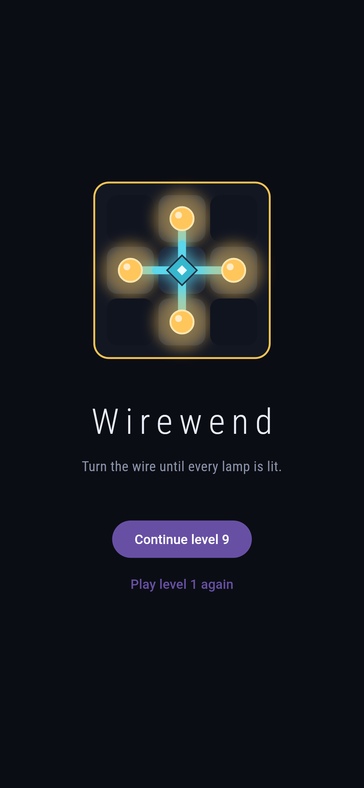
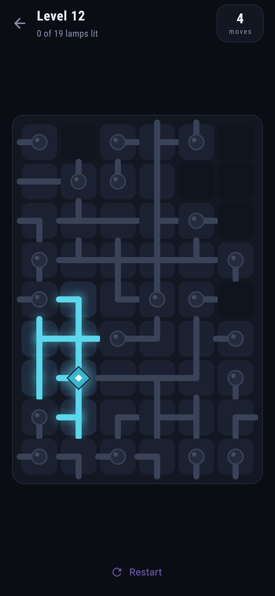

# Wirewend

A wire-turning puzzle for phones, in Flutter, for Android and iOS.

A board holds one source, some wire and some lamps. Tap a cell to turn it a
quarter clockwise. Current crosses the edge between two cells only when both
of them reach it, so a wire pointing at a wall carries nothing. Light every
lamp and the level is done.

Levels are numbered and nothing else. Size, fill and seed all come from the
number, so level 7 is the same puzzle on every device and on every run, and
the only thing kept between launches is how far the player got. Boards are
grown as a spanning tree out of the source and then scrambled, which is why
every level can be solved without anyone running a solver: the shape the
generator drew is itself an answer, and turning a cell cannot change what is
reachable from what.

The game is portrait only. The board takes the largest square tile that fits
the space both ways, so there is never anything to scroll to see.

| | |
|---|---|
|  |  |

## Building it

Flutter 3.44.8, Dart 3.12. The Makefile puts the SDK on the path, so the
targets work without one on the shell's.

    make deps      # flutter pub get
    make analyze   # flutter analyze
    make test      # flutter test
    make all       # analyze and test, which is what to run before a commit
    make apk       # flutter build apk --debug

The iOS build needs a Mac:

    flutter build ios --simulator --debug

## Screenshots

The two above were rendered by `make shots`, which draws the real widget tree
at real phone sizes and writes the frames to `build/showcase`. It needs no
device and takes a couple of seconds, which makes it the fastest way to see
what a change did to the look of the game.

Pictures of the game on a device come from CI, because taking one means
running it on a phone, and no emulator exists for this machine's
architecture. The `shots-android` and `shots-ios` jobs in
`.github/workflows/ci.yml` boot an emulator and a simulator, drive
`integration_test/screenshot_test.dart` through a couple of levels, and upload
the pictures as artifacts of the run. On a machine with a device attached:

    flutter drive --driver=test_driver/integration_test.dart \
      --target=integration_test/screenshot_test.dart -d DEVICE

which leaves them in `build/screenshots`.

## Where things are

    docs/                    The rendered screens shown above
    lib/game/grid.dart       Ends, Cell, Board: the rules, and the only thing
                             that decides whether a board is solved
    lib/game/generator.dart  Builds a solved board and scrambles it
    lib/game/levels.dart     What a level number means
    lib/game/progress.dart   The level reached and the best move counts
    lib/ui/                  The screens, and the painter that draws a cell
    test/                    Unit tests for the rules, widget tests for the
                             screens, and a fit test across phone shapes
