# Thumbworks

Forty nine games for phones, in Flutter, for Android and iOS. One repository,
one folder each, and every commit each of them was built with.

They have almost nothing in common as games. There is a nonogram, a siege, a
rhythm game, a minesweeper, a dice race. What they share is underneath, and it
is why they live together: **each one proves the thing it promises.**

| | | |
|---|---|---|
| <div align="center"><br><b><a href="Wirewend">Wirewend</a></b></div> | Turn the wire until the current reaches every lamp | Boards are built solvable rather than generated and hoped over |
| <div align="center">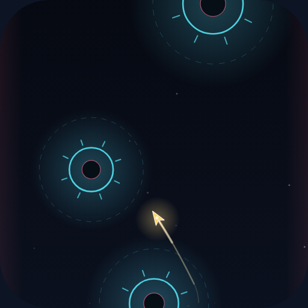<br><b><a href="Slingwell">Slingwell</a></b></div> | Swing round a gravity well, let go at the right moment | Every well is reachable from the last one, checked by flying it |
| <div align="center">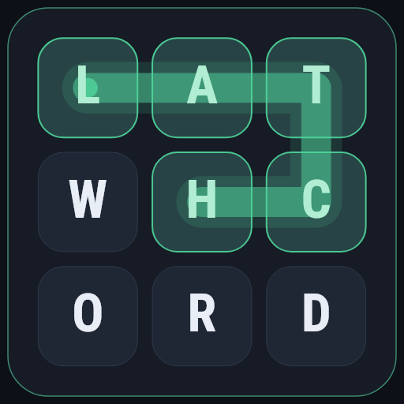<br><b><a href="Latchword">Latchword</a></b></div> | Drag a thumb across letters and spell what you can | A 44k word list, and a board that always holds enough of them |
| <div align="center">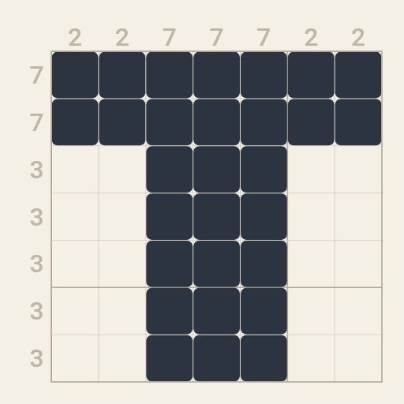<br><b><a href="Tallyloom">Tallyloom</a></b></div> | A nonogram: the numbers say the runs, you find the squares | No puzzle ships that its line-logic solver could not finish |
| <div align="center"><br><b><a href="Thornguard">Thornguard</a></b></div> | Twelve raiders against a king and four guards | The opening is balanced by self-play, not by feel |
| <div align="center">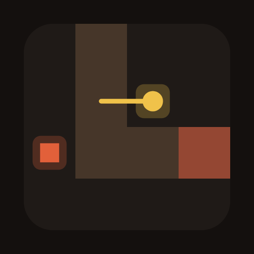<br><b><a href="Emberlane">Emberlane</a></b></div> | Twenty waves down one winding lane, and you build beside it | Three written-down plans must finish, struggle and fail |
| <div align="center">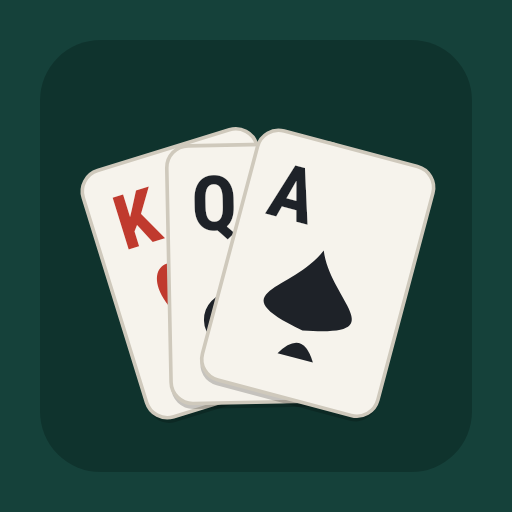<br><b><a href="Fanwright">Fanwright</a></b></div> | Patience with everything face up and four cells to park in | Every deal in the book has been solved before it shipped |
| <div align="center"><br><b><a href="Vaultline">Vaultline</a></b></div> | One button. Tap to hop, hold to go higher | A search over the button proves every stretch is passable |
| <div align="center"><br><b><a href="Chimefall">Chimefall</a></b></div> | Four lanes, notes falling, tap each one as it lands | The music and the chart are one list, and the audio is checked against it |
| <div align="center"><br><b><a href="Chalkway">Chalkway</a></b></div> | Draw a line in chalk and let the ball go | Every level ships a drawing that solves it, and it survives being nudged |
| <div align="center"><br><b><a href="Cinderplot">Cinderplot</a></b></div> | Minesweeper | No board ever needs a guess, and the difficulty label is measured |
| <div align="center">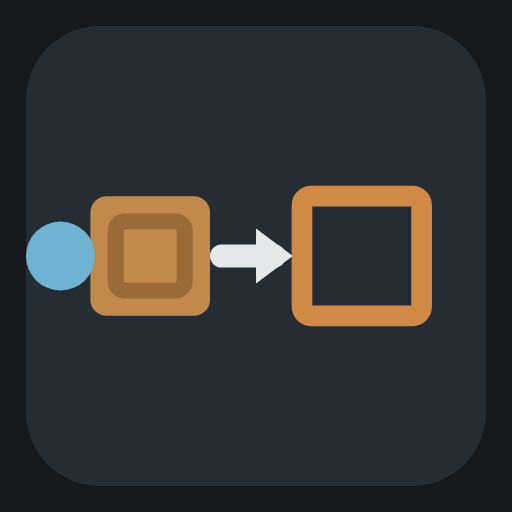<br><b><a href="Haulyard">Haulyard</a></b></div> | Shove every crate onto a mark | The par on each yard is the proven fewest shoves there are |
| <div align="center"><br><b><a href="Hazardwell">Hazardwell</a></b></div> | Race to a hundred, roll as long as you dare | The house plays exactly optimally, and the table proves itself |
| <div align="center"><br><b><a href="Lockstead">Lockstead</a></b></div> | Find the code: right peg, or right colour in the wrong place | Five guesses is always enough, and the whole strategy tree says so |
| <div align="center"><br><b><a href="Rungwick">Rungwick</a></b></div> | One word to another, a letter at a time, every rung a word | The rungs are the shortest path across the whole word graph |
| <div align="center"><br><b><a href="Cairnfall">Cairnfall</a></b></div> | Take stones off the cairns; take the last one and win | The opponent is a theorem, and a brute-force search checks it |
| <div align="center"><br><b><a href="Rookvale">Rookvale</a></b></div> | Every move a capture; leave one piece standing | Exactly one way through each board, and the whole tree says so |
| <div align="center"><br><b><a href="Wickfell">Wickfell</a></b></div> | Press a lamp; it and its neighbours turn. Put them all out | The fewest presses comes out of linear algebra, not a search |
| <div align="center"><br><b><a href="Skeinmoor">Skeinmoor</a></b></div> | Join each pair of ends, cross nothing, leave no cell bare | Exactly one way of filling each board, orderings and all |
| <div align="center">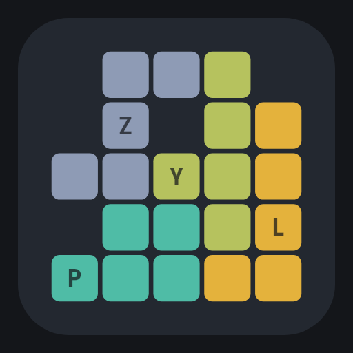<br><b><a href="Packwold">Packwold</a></b></div> | Fit the pentominoes into the ground you are given | Dancing links, and the published rectangle counts to prove it |
| <div align="center"><br><b><a href="Hollowmarch">Hollowmarch</a></b></div> | Jump a peg over its neighbour; leave one standing | An invariant rules out where you cannot finish, without searching |
| <div align="center">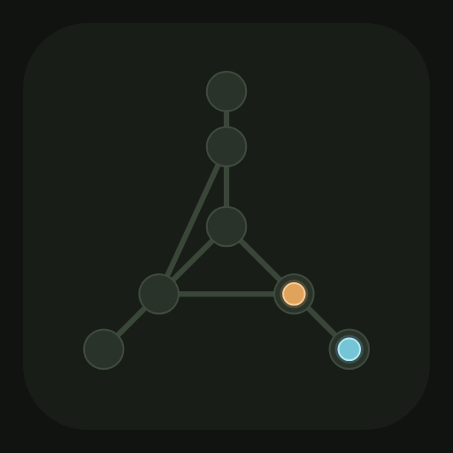<br><b><a href="Warrenshaw">Warrenshaw</a></b></div> | You move along a path, then it does. Corner it | A theorem about maps and a table of every position agree exactly |
| <div align="center"><br><b><a href="Reelbury">Reelbury</a></b></div> | Pair two sides up so that nobody would rather swap | There is always such a pairing, and here there is exactly one |
| <div align="center">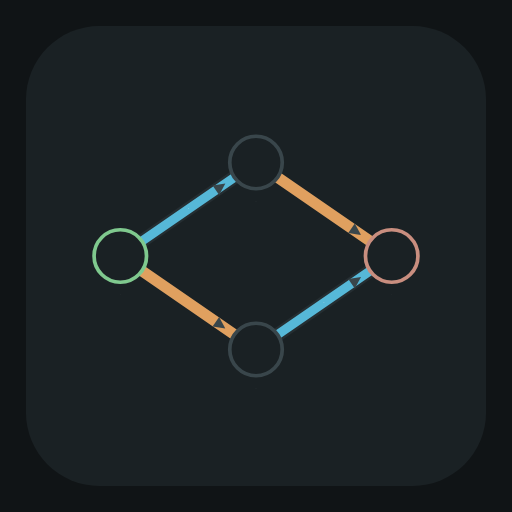<br><b><a href="Weirbank">Weirbank</a></b></div> | Send as much water down the pipes as the works will carry | The answer comes with the cut that proves nothing more fits |
| <div align="center">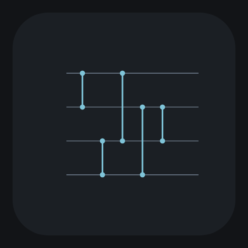<br><b><a href="Winnowmere">Winnowmere</a></b></div> | Put comparators on lines until every row comes out sorted | Noughts and ones settle it, and the fewest is worked out here |
| <div align="center">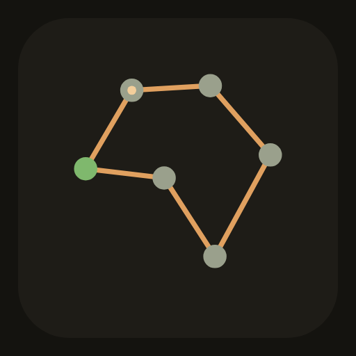<br><b><a href="Carterfen">Carterfen</a></b></div> | Call at every farm on the fen and get the cart home | The shortest round of twelve, without trying forty million orders |
| <div align="center"><br><b><a href="Beaconholt">Beaconholt</a></b></div> | Light beacons until every hill is watched by one | The fewest there are, and the obvious way is one beacon worse |
| <div align="center"><br><b><a href="Rimeworth">Rimeworth</a></b></div> | Salt every lane in the parish, no lane twice | Count the odd junctions and you have the answer, no search at all |
| <div align="center"><br><b><a href="Marchcombe">Marchcombe</a></b></div> | Paint the estate, nothing matching across a hedge | Every map carries a set of fields that proves its own number |
| <div align="center">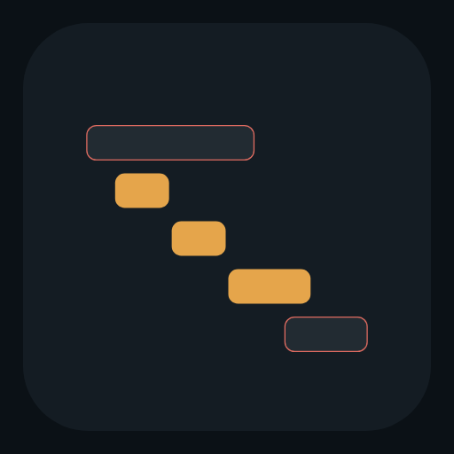<br><b><a href="Quayfleet">Quayfleet</a></b></div> | One berth, more ships than it holds. Take the most you can | The obvious rule is right here, and the game hands you the proof |
| <div align="center"><br><b><a href="Churnwick">Churnwick</a></b></div> | Measure an exact churn out of churns that are the wrong sizes | Which amounts are impossible is arithmetic, and it is checked by walking |
| <div align="center">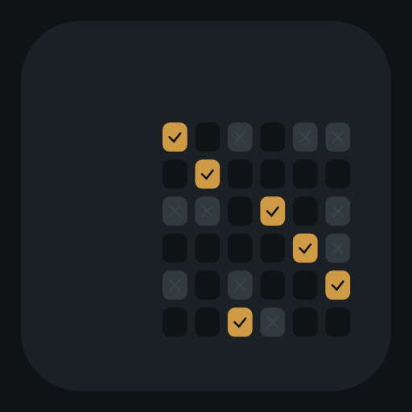<br><b><a href="Handfast">Handfast</a></b></div> | Give out the day work to the hands who can take it on | The set of jobs that cannot be covered falls out of the failed search |
| <div align="center">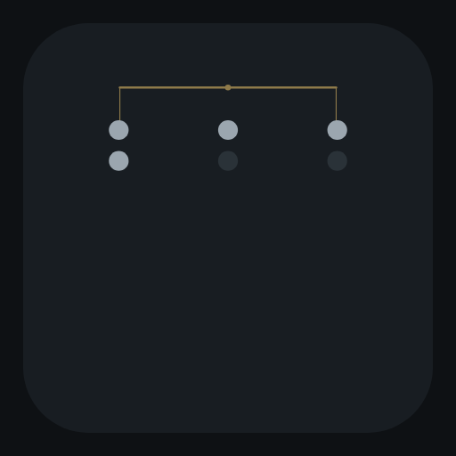<br><b><a href="Pyxholm">Pyxholm</a></b></div> | One coin is the wrong weight. Find it on a balance | Three answers a weighing sets the floor, and the beam plays against you |
| <div align="center"><br><b><a href="Trestlewick">Trestlewick</a></b></div> | Raise a timber frame in the fewest days, with the crews you have | Two floors under it, and every frame ships only if one of them is tight |
| <div align="center">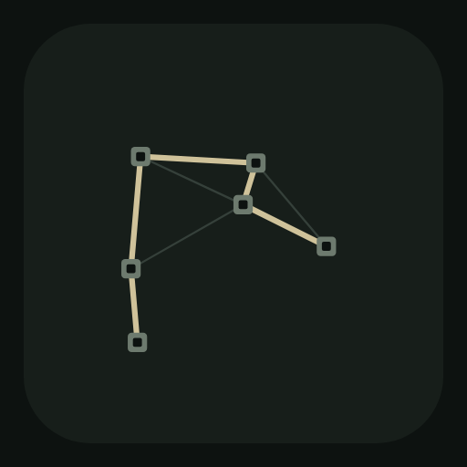<br><b><a href="Trodstow">Trodstow</a></b></div> | Cut the fewest yards of path that join every hamlet up | It explains every single path, in the answer or not |
| <div align="center">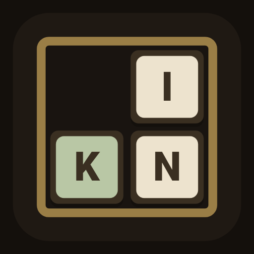<br><b><a href="Chasegarth">Chasegarth</a></b></div> | Slide loose type about until the line reads right | Half of all arrangements are impossible, and the game proves both halves |
| <div align="center">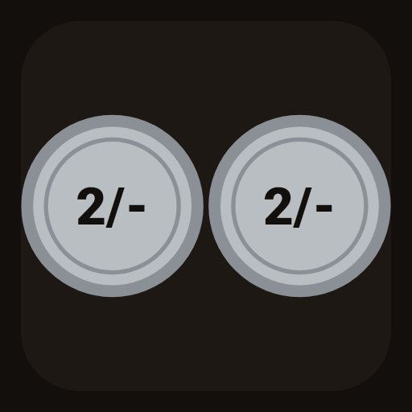<br><b><a href="Groatsworth">Groatsworth</a></b></div> | Count out old money in the fewest coins | The real coinage made the obvious way wrong, and the decimal till never does |
| <div align="center">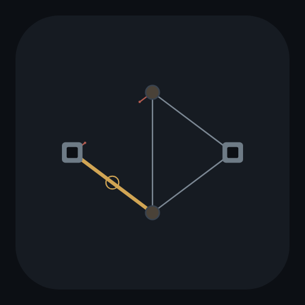<br><b><a href="Linacre">Linacre</a></b></div> | Cut the telegraph line, or hold it, against perfect play | Two disjoint webs settle the game before it starts, and the game draws them |
| <div align="center">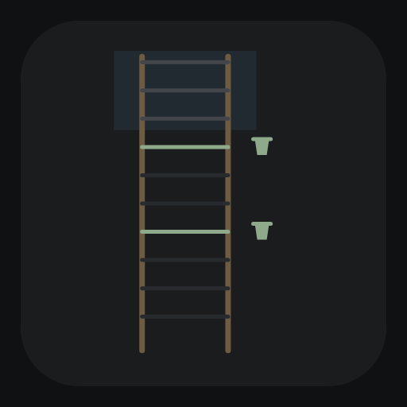<br><b><a href="Shardlow">Shardlow</a></b></div> | Find the highest rung a pot survives, in certain drops | A morning of drops is a word, and counting the words is exactly the answer |
| <div align="center">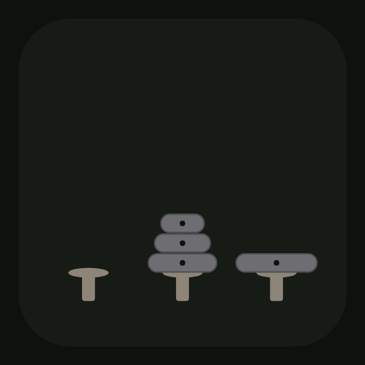<br><b><a href="Staddlestone">Staddlestone</a></b></div> | Move the millstones, never a bigger on a smaller | The doubling argument and a walk of every arrangement agree to nine stones |
| <div align="center">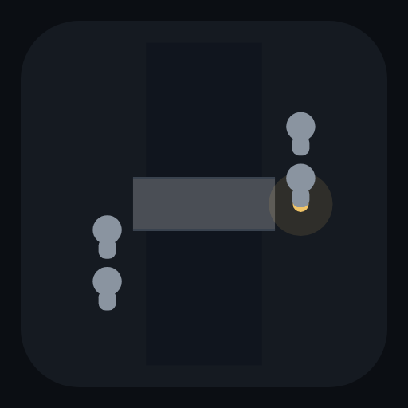<br><b><a href="Lampwath">Lampwath</a></b></div> | Everybody over the bridge by lantern light | The slow should cross together, except when the trade buys nothing |
| <div align="center"><br><b><a href="Treblesway">Treblesway</a></b></div> | Ring every change on the bells and come round again | One tower cannot, and the reason is an invariant you can watch working |
| <div align="center"><br><b><a href="Foldbury">Foldbury</a></b></div> | Post the fewest shepherds that leave no lane unwatched | The proof is a set of blue lanes on the map, checkable by eye |
| <div align="center">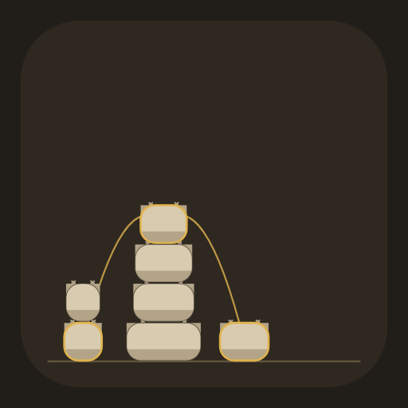<br><b><a href="Staplemere">Staplemere</a></b></div> | Pile the wool as it comes, in the fewest piles it takes | The answer is the longest rising run, drawn in gold through the yard |
| <div align="center">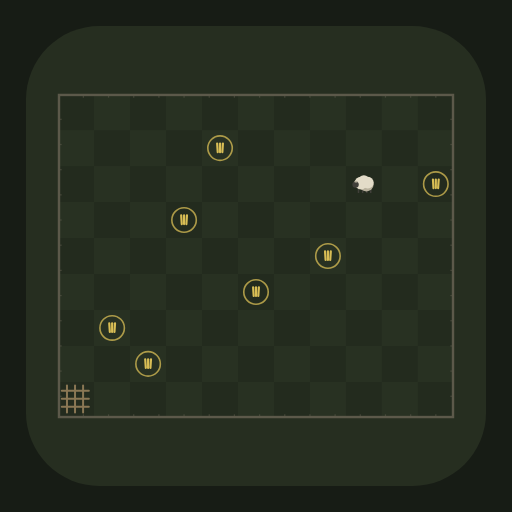<br><b><a href="Pinderwell">Pinderwell</a></b></div> | Drive the stray ewe to the pen before the pinder does | The safe squares climb by the golden ratio, proved twice and marked on the grass |
| <div align="center"><br><b><a href="Shroveham">Shroveham</a></b></div> | Flip the cakes until they sit in order, counting every flip | The gap count is a floor you check on the stack, and one batch ships where it falls short |
| <div align="center"><br><b><a href="Smithwaite">Smithwaite</a></b></div> | Work the rings off the smith's bar, two moves at most | The ring pattern read as figures is exactly the distance, checkable over every state |
| <div align="center">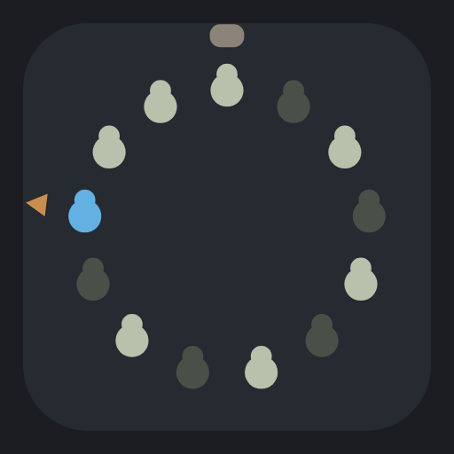<br><b><a href="Dipthorne">Dipthorne</a></b></div> | Pick where to stand before the rhyme starts | The safe seat is the binary turn on two beats, and the reckoning on the rest |
| <div align="center">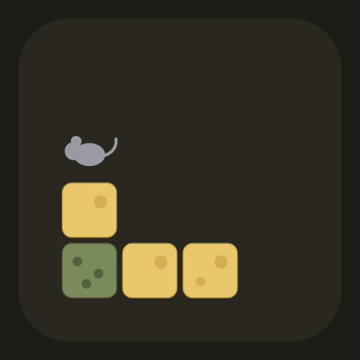<br><b><a href="Rindhope">Rindhope</a></b></div> | Bite the cheese, leave the mouse the mouldy crumb | The first mouse provably wins every block, and the proof cannot name the bite |

## The idea they share

A game that says "solvable" usually means somebody played a few and it seemed
fine. Every game here means it, and the proof is a test rather than a
paragraph:

- **Cinderplot** lays a minefield out, plays it through with a solver that
  only reasons, and throws it away if the reasoning ever runs out. It throws
  it away as well if it needed *less* thinking than the difficulty on the
  label promises. Nineteen boards in twenty go in the bin.
- **Haulyard** searches every yard for the shortest way through it, and a test
  fails if the par printed on the level is off by one.
- **Hazardwell** works out the exact chance of winning from all million
  positions in the game, then checks the answer is a fixed point of the rule
  that made it. That is the only proof there is that an optimal opponent is
  optimal.
- **Chalkway** ships an actual drawing with each level rather than a note
  saying one exists, and the drawing has to still work when both ends move. A
  line that only works at one exact position is a coincidence rather than an
  answer.
- **Lockstead** gives you exactly five guesses because every one of the 1296
  codes can be found in five. That was walked as one tree rather than sampled,
  and it agrees with Knuth's published result from 1977.
- **Rungwick** walks every four-letter word in the language outwards from the
  far end of each climb, so the number of rungs is the shortest path there is.
  The same distances tell you the moment you have stepped off it.
- **Cairnfall** settles a row of cairns by one exclusive-or, and proves the
  theorem it rests on by walking the entire game tree of every small position
  and checking the two answers agree.
- **Rookvale** walks the entire tree of every board and throws away any with
  two ways through, so every capture is forced by something. The same walk
  tells you the moment a capture has left no way through at all.
- **Wickfell** turns pressing lamps into a system of equations over two
  values, solves it, and tries the null space to get the *fewest* presses
  rather than merely some. Then it checks the whole thing against brute force
  on a board small enough to try every set of presses there is.
- **Skeinmoor** counts every way of filling a board, every route and every
  order of drawing them, and ships only the boards with one. Two boards in two
  hundred thousand survive it, and the count is taken under the rules the
  screen obeys rather than the cheaper ones the search would have preferred.
- **Packwold** is an exact cover problem, so its solver is Algorithm X with
  dancing links. The check on it is that the twelve pentominoes come out at 2,
  368, 1010 and 2339 packings of the four rectangles they fit, which are the
  figures everybody else has had for decades.
- **Hollowmarch** adds up the pegs in a field of four values, where three in a
  row carry a^k, a^(k+1) and a^(k+2) and a^k + a^(k+1) = a^(k+2). The sum is
  therefore the same after every jump ever made, so a hollow whose own sum
  does not match is a hollow no sequence of jumps can end in. That is proved
  rather than searched. On the 33 hole board it rules out 28 of the 33, and
  the search then reaches all five that are left.
- **Warrenshaw** settles every position of the chase backwards from the end,
  so the runner is the table read the other way up rather than an opponent
  somebody wrote. Then it answers the same question a second way that never
  looks at a move: rub places off the map until it does or does not come
  apart, which is a theorem from the early eighties. The two are held against
  each other on three hundred maps made up at random.
- **Reelbury** rests on a proof from 1962 that a pairing nobody wants to swap
  out of always exists, whatever everybody's lists say, and the proof is the
  way the game finds one. Every round then went through every possible pairing
  and was kept only if a second one did not hold as well. Uniqueness is
  checked a second way that counts nothing: both sides ask, and the answers
  agree exactly when there is one.
- **Weirbank** hands over the argument rather than the number. The same
  search that finds the most water a works will carry also finds a set of
  pipes that, cut, leaves no way from the spring to the mill, and what those
  pipes take between them is the same number. A test checks the two against
  each other on three hundred works made up at random, and then cuts the
  pipes it named to make sure nothing gets through what is left.
- **Winnowmere** turns "does this sort every row of numbers there is" into
  2^n rows of noughts and ones, which is the old result that a network sorting
  those sorts anything. So the game can check a network after every tap and
  hand over the row it still gets wrong. The number of comparators on each
  puzzle is worked out here rather than looked up, by walking every network
  there is with the ones leaving the same rows behind counted once: 1, 3, 5,
  9, 12, 16 for two lines up to seven.
- **Carterfen** finds the shortest round of twelve farms without measuring
  any of the thirty nine million orders. It works out the shortest way to
  reach every set of farms instead, which is eleven thousand part-rounds,
  because two orders that call at the same farms and end at the same one are
  competing for the same journey home. Twenty five random maps are solved both
  that way and by measuring every order, and the two always agree.
- **Beaconholt** has nothing clever to offer, which is the point. It tries
  every set of one hill, then every set of two, and the first size that
  watches the whole country is the fewest there is, because nothing smaller
  was left untried. The obvious method, light the hill that adds the most dark
  hills and repeat, gets a country watched perfectly well and uses one beacon
  too many on every country here but the teaching one. A test insists on that
  gap, and a hundred random countries are each checked by trying every set one
  smaller than the answer.
- **Rimeworth** does not search for its answer at all. A lorry drives out of
  a junction as often as it drives in, so a junction with an odd number of
  lanes has to be where a run starts or finishes, and a run has two ends:
  count the odd junctions, halve it, and that is the fewest runs there are.
  That is Euler on the bridges of Königsberg, and it is checked here against
  a search over every way the lorry could actually drive, on two hundred
  parishes made up at random and on all seven that ship.
- **Marchcombe** ships only maps that prove their own answer. A set of fields
  that all share a hedge with one another needs a dye each, so it settles the
  fewest from below, and every map here was kept because such a set is exactly
  as big as the answer. The answer itself is worked out twice, once by
  painting and once by splitting the map into sets of fields that keep out of
  each other's way, and the two agree on three hundred maps made up at random.
- **Quayfleet** is the one where the greedy rule is right. Take the ship that
  casts off earliest, then the earliest that does not clash, and so on, and
  that is exactly the most ships there are. The proof of the number comes out
  of the same walk for nothing: every ship passed over is still in the berth
  on the last hour of the ship that displaced her, so those hours are a
  handful that every ship in the book wants, and two ships wanting the same
  hour cannot both have it. The game draws them, and five hundred random days
  are settled by the rule and by trying every set of ships to make sure.
- **Churnwick** knows which amounts cannot be measured at all without looking
  for them. Filling puts a churnful in, emptying takes one out and pouring
  loses none, so whatever stands anywhere is a whole number of churnfuls added
  and taken away: out of a six and a fourteen, nothing odd can ever stand in a
  churn. A hundred and twenty random dairies are asked that question by
  arithmetic and again by walking every arrangement of milk they can be in,
  and the two lists always match. The fewest goes is settled twice as well,
  once by the walk and once by a rule for two churns that looks at nothing.
- **Handfast** hands over the obstruction rather than the number. When the
  walk that gives out the work runs out of hands, the jobs it walked through
  are a set with fewer people between them than there are jobs, and that is
  the only thing that can ever stop a board being covered. It is Hall's
  condition from 1935, it costs nothing because it is what the failed search
  left behind, and a player can check it by eye: every cross in the shaded
  rows falls inside the ringed columns. Four hundred random fairs are settled
  by the walk and by a search over every way of handing the work out.
- **Pyxholm** gets its floor from counting and its answer from searching, and
  ships a box where the two disagree. A weighing has three answers, so k of
  them tell at most 3^k things apart, and a dozen coins each of which might be
  heavy or light is twenty four things: three weighings might do and two
  cannot. On four coins the same counting says two might do, and it cannot be
  done in two, which only a search over every weighing there is can show. The
  beam is adversarial as well, answering with whatever leaves the most to do,
  so a number that comes out of a round is a promise rather than luck.
- **Trestlewick** has two floors under every answer and neither of them
  searches. A run of timbers each resting on the one before cannot be spread
  over fewer days than there are timbers in it, whatever the crews; and a crew
  raises one timber a day, so the work alone is the timbers over the crews. A
  frame ships only when one of those two is exactly the answer, and the game
  draws the run straight up the frame when the run is the tight one.
- **Trodstow** is the one that explains every path rather than only the
  total. Put some hamlets on one side of a line and the rest on the other:
  every network joining the parish crosses that line, so the cheapest crossing
  path is in every cheapest network there is. The game draws the line, tints
  the two sides and lights up the crossings. The same argument upside down
  covers the paths that are not in the answer: dearest on a loop means in no
  cheapest network at all. Between them they account for every path on the
  map, and no two paths in a parish cost the same, so every reason is exactly
  true rather than nearly.
- **Chasegarth** proves both halves of its own claim. The pairs of letters
  out of order carry an odd or even that no slide can change, so half of all
  arrangements can never be made to read right, and that is arithmetic. The
  other half is a walk: every arrangement sliding can reach, outwards from the
  finished frame, so every par is the fewest there is and the hint reads
  straight off the table. A test makes the two agree on all 362,880
  arrangements of the three by three, which is what caught the parity being
  wrong on odd widths. One forme ships impossible on purpose, says so on the
  label, and lets you swap the dropped pair back and finish it.
- **Groatsworth** gets its lesson from history rather than from a generator.
  The old English coinage, with a florin at 24 pence under a half crown at 30,
  really did make "biggest coin first" pay a coin extra at four shillings, at
  six and six, and on up the half crowns for ever; the decimal till never
  does. Both facts are checked by sweeping every amount to five pounds against
  an honest table, and every shipped amount sits exactly on the plain floor,
  so the why is always one multiplication a player can do.
- **Linacre** is the adversarial one: you cut a telegraph wire a turn, the
  machine braces one back, and both sides are played from a table that holds
  every position, so a par is a promise. The anchor is Lehman's theorem from
  1964: the linesman moving second holds exactly when two webs of wire,
  sharing nothing, each join the stations, over some of the posts and not
  always all of them. That last clause is easy to get wrong and the test
  that plays the theorem against the game on two hundred random nets caught
  the first version doing exactly that. One round ships labelled impossible,
  and Why draws the two webs that make it so.
- **Shardlow** is the egg drop puzzle with the pots of a pottery yard, and
  its floor comes from counting words: a morning of drops reads as breaks and
  survivals with no more breaks than pots, and two answers that would read
  the same word can never be told apart. The floor is exactly the answer on
  every ladder to two hundred rungs and four pots, checked against a search
  that tries every plan, and the referee breaks pots as awkwardly as pots can
  break, so par is a promise rather than luck.
- **Staddlestone** is the tower puzzle everybody knows, built the way this
  repository builds things: the doubling argument gives the pars, a walk of
  every arrangement confirms them out to nine stones, and the walk also makes
  the hint exact from anywhere and catches the moment a move is wasted. The
  walk corrected the tests once already: a wasted move here costs one, not
  two, because the single stone moves form a triangle. The game calls out the
  half way moment, the biggest stone crossing with exactly half the work
  spent, which is the argument made visible.
- **Lampwath** is the bridge and torch puzzle, and the first game here where
  the shortest way is weighed in minutes rather than counted in moves, so the
  settling behind it is cheapest first over every state a night can be in.
  Ferrying with the quickest walker loses the famous four two whole minutes
  to sending the slow pair together, and the Even Pace bridge is chosen so
  the same trade buys exactly nothing, with Why working the sum both ways in
  the bridge's own numbers. A brute force over every night agrees on all six
  bridges and a hundred random ones.
- **Treblesway** is change ringing on four bells: every row once and rounds
  home, which is a walk through all twenty four orders under the bells' own
  rule that nothing moves more than one place a change. The full tower has
  10,792 ways, counted here rather than cited; keep only two changes and
  exactly two survive, the plain hunt both ways round; and one tower ships
  that cannot ring the extent at all, because none of its changes crosses
  the middle, an invariant the player can watch holding. The game keeps a
  live answer to whether the peal can still come round, so a stranded row is
  known the moment it is stranded.
- **Foldbury** posts shepherds at gates until no lane between them is dark,
  which is minimum vertex cover. The fewest is brute force, and under it
  stand two floors the player can check: a set of lanes no two of which
  share a gate, drawn in blue on the fold itself, and the plain count of
  lanes against the busiest gate. On every fold past the triangle the
  matching floor is exactly the answer, kept so by the generator; the
  triangle ships because there pairing proves nothing and the count carries
  it, which is where Konig's theorem stops and says so. A greedy post at the
  busiest gate ends one over on every big fold, and the ledger goes red the
  moment the walk becomes the reason.
- **Staplemere** sets bales down as they come, lighter on heavier only,
  which is patience sorting. The fewest piles equals the longest run of
  bales arriving in rising weight, Dilworth's theorem in a wool yard, and
  both directions are played rather than cited: the gold thread drawn
  through the yard is the floor, one pile forced per marked bale, and the
  snuggest legal top each time meets it exactly. Brute force over pile tops
  agrees with both on every ordering of six and hundreds of random
  mornings, and the live could-still-be is checked against brute force from
  part-played positions too. The trap is hoarding the snug top for a closer
  weight, which costs a pile on every deal built for it, and one deal holds
  both runs at exactly three, the nine-bale boundary that ten bales always
  break.
- **Pinderwell** is Wythoff's game as a ewe driven to the pen: push her
  west, south, or evenly both, last push wins. The safe squares are built
  two ways that know nothing of each other, a backwards sweep of the game
  and the pair-by-pair ladder, laid over each other on all 3,721 squares of
  a sixty-pace field, with the golden ratio checked on top rung by rung.
  The pinder plays perfectly from the same table, pars are worked out
  against his most stubborn delay, and a wrong push is called out the
  moment his answer lands on the ladder. One field starts the ewe on a
  rung and ships labelled unwinnable, because the way to believe a safe
  square is to stand on one and lose.
- **Shroveham** is pancake sorting on a griddle: slide the slice under a
  cake, turn everything above it, serve smallest to biggest in the fewest
  flips. The referee is a breadth-first walk of every arrangement, and the
  floor is the gap count marked on the stack itself, neighbours whose sizes
  are not next in order, with the sweep checking at every size it can hold
  that no flip ever mends two gaps. The floor is honestly a floor: one
  shipped batch needs a flip more than its gaps say, and Why owns the
  shortfall instead of hiding it. The griddle hand's two-flips-a-cake
  routine is simulated, bounded, and beaten by three flips on the batch
  named for it, with every wasted flip called out live.
- **Smithwaite** is the tavern rings, the blacksmith's puzzle: the first
  ring moves freely, any other only when the ring before it is on and the
  rest before that off. The suite counts the moves of every state to prove
  the whole puzzle is one path with two ends, which is why the single
  wrong move costs exactly two and is called out at once. The second voice
  is the smith's count: write figures over the rings, flip where a ring is
  on, copy where it is off, read them as binary, and that is the distance
  to free, laid over the walk on every state of three to nine rings. The
  Tangle ships with one ring on, looking nearly done and farther than the
  whole puzzle, because fewer rings on does not mean nearer the end.
- **Dipthorne** is the Josephus count as schoolyard dipping: a rhyme
  chanted round the ring, one child a beat, whoever it lands on steps out,
  and you choose where to stand before it starts. The count run out loud
  and the renumbering recurrence agree on 1,440 rings, and for two-beat
  rhymes the famous binary turn joins them on 500 more: the ring's size
  with its front figure moved to the back is the safe seat, done in front
  of you by Why. Ip Dip ships at eight children because the powers of two
  are exactly the rings where the turn changes nothing and the dip stone
  seat itself survives, swept and proved. Longer rhymes get the honest
  answer: no trick, the reckoning climbed ring by ring.
- **Rindhope** is Chomp on a block of cheese, and it carries the shelf's
  strangest lesson: existence without construction. The stealing argument
  runs as code, biting-after-the-nibble proved identical to biting the
  whole block on every bite to six by six, so the first mouse wins every
  block; which bite wins, only the search can say, and the game says so
  out loud. Where shapes exist they are played: the mirror wins every
  square and the one-crumb-longer bottom row wins every strip, both swept
  against random mice and best resistance. One block gives the grey mouse
  the first bite and ships labelled, the theorem felt from the wrong
  side.
- **Tallyloom**, **Fanwright**, **Vaultline** and **Wirewend** each do the
  same for their own shape of content: nothing reaches a player that a solver
  has not finished first.

The second half of that idea is that the proof is made the way a player would
find it false. Every game plays itself through its own screen in the tests,
with real gestures and real widgets at real phone sizes, rather than only
through its model.

## Some things learned the hard way

Written down because each one cost a rewrite:

- Balance is a bug class unit tests cannot see. Thornguard's first opening
  gave the raiders sixteen pieces and they won four games in five; the second
  gave them eight and they lost every one. Only self-play over hundreds of
  games found it.
- Check that a harness measures the game. Emberlane's first scripted plan
  bought one tower a wave and lost with twelve hundred embers unspent. It was
  measuring the schedule, not the game.
- Ask the solver whether an option is ever right. Hazardwell's two-dice move
  turned out to be mathematically identical to rolling one die twice, to
  fifteen decimal places, until a pair paid double. A button no correct player
  would ever press is a design bug only a solver finds.
- Best-first beats depth-first badly on wide trees. Fanwright's first solver
  won five deals in forty; the same code with a three-term heuristic wins
  ninety-nine in a hundred.
- An external fact is worth more than any self-consistent test. Fanwright
  checks deal 11982, the famously unwinnable FreeCell deal, which tests the
  shuffle, the numbering, the rules and the solver in one bit. Hazardwell's
  game value agrees with the published figure for the race it is based on;
  Lockstead's four-peg lock comes out at five guesses, which is Knuth's result
  from 1977.
- Hand-drawn levels need a machine before they need a player. Four of
  Haulyard's first twelve yards were impossible: a one-square doorway means
  the crate plugs its own way out.

## Running them

```
make check              # analyze and test every game; what the pre-push hook runs
make one GAME=Chalkway  # just that one
make deps               # flutter pub get, everywhere
make shots              # redraw every game's screens and logo
make images             # check every picture a README points at is there
make list               # what each of them is
```

Each game's folder is a whole Flutter project and works on its own. `cd
Chalkway && make check` does what you would expect, and every game has its own
targets besides (`make levels`, `make odds`, `make pars`, `make audit`, and so
on) for the tool that generates or proves its content.

There is no CI. Everything runs on the machine doing the work, and a pre-push
hook refuses to push a tree where any of the forty two is red. The device
screenshot drives in each game's `.github/scripts/` are started by hand on a
machine with a phone or a simulator attached.

## Where the pictures come from

Every image in this repository was drawn by the code it belongs to. The logos
come from each game's own painter, run in a test that writes the PNG; the
screenshots come from a test that renders the real screens at real phone sizes
and photographs them. Nothing was made in an image editor, and nothing was
downloaded.
