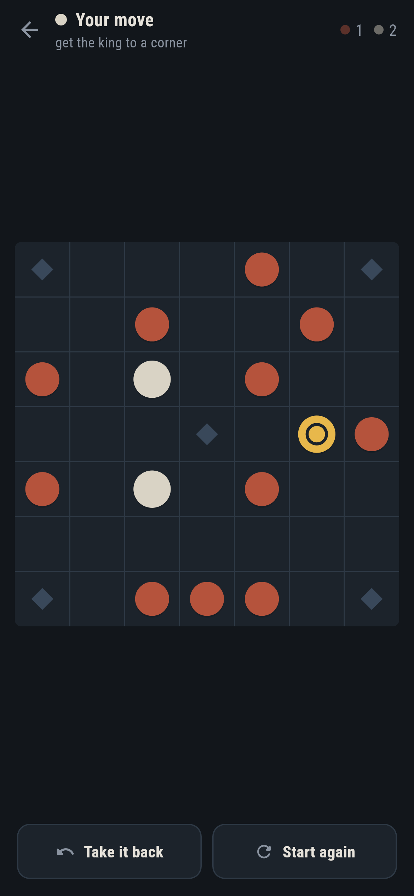
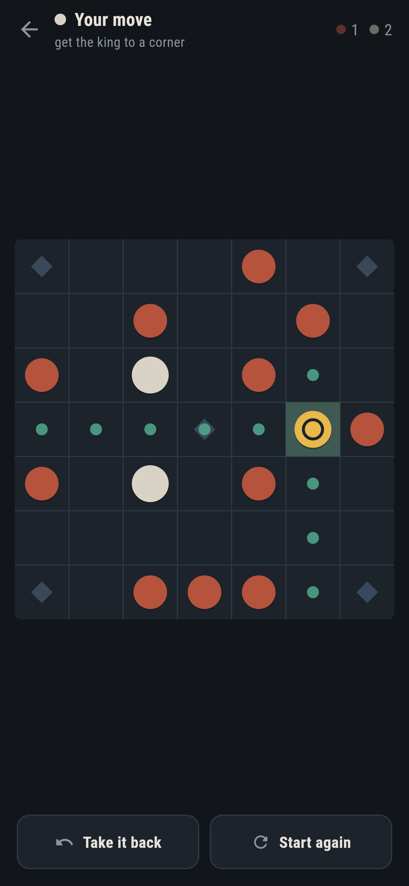
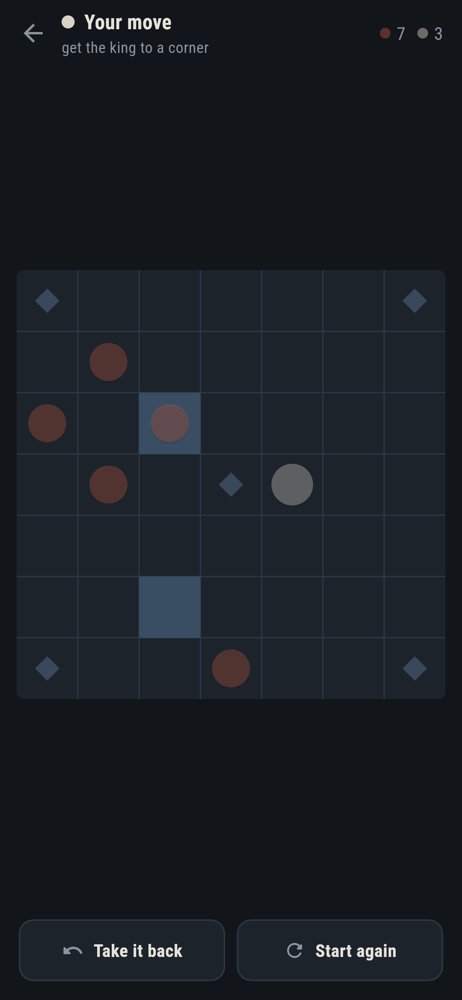

# Thornguard

A siege game for phones, in Flutter, for Android and iOS.

Twelve raiders round the edge of a seven by seven board. In the middle, a king
on his throne with four guards. Everything moves like a rook — any distance
along a row or a column, over nothing.

The raiders win by surrounding the king. The guards win by walking him out to
a corner. You pick a side and the phone plays the other.

| | | | |
|---|---|---|---|
|  |  |  |  |

## The two rules that make it a game

**A man is taken when an enemy moves so that he is between two of them** —
along a row or a column, never a diagonal. But never by moving between two of
them himself. Without that exception half the board is poisoned and neither
side can develop.

**The king is not taken by a sandwich, only by being surrounded**, with the
board edge counting as one of the sides. A rule that counted only four-sided
surrounds would make the edge the safest place on the board, which is the
opposite of true.

The four corners and the throne are marked, because they are not ordinary
squares: only the king may stand on them, and they help take a man pinned
against them.

## How it is put together

`lib/game/` is the game and knows nothing about screens.

- `board.dart` — a position, and everything that follows from it. Immutable:
  playing a move gives a new board, which is what lets the search hold a
  position and makes taking a move back a list rather than a mechanism.
- `game.dart` — a game rather than a position: the moves so far, and the two
  ways a game ends without anybody winning. A position knows nothing about the
  past, and repetition is entirely about the past.
- `judge.dart` — what a position is worth, always from the raiders' side, so
  there is one place for a sign to be wrong instead of two.
- `search.dart` — alpha-beta, deepened a ply at a time.

`lib/ui/` draws it. There is no art to load: the men are three circles in three
colours and the board is lines, so it is sharp at any size and the app ships no
images at all. That includes the logo and the app icon, which are the middle of
the board drawn by the same code.

## Things worth knowing

**The rules are written twice.** `test/support/plainly.dart` asks of every pair
of squares on the board whether a move between them would be legal, reading the
rules off one at a time. It is quadratic and it would be a silly way to run a
search — and it is obviously right, which is the point. The game's own
generator walks outward from each man and stops when it hits something.

The two are compared on every position of a hundred random games. Random play
is a poor player and an excellent test: it wanders into positions nobody would
design, which is where a rule written slightly wrong is found.

Then the game tree is counted. Twenty eight moves in the opening, 524 after
two, 17,796 after three, 373,396 after four. The first is checkable by hand —
three raiders an edge, three moves for each outer one and one for the boxed-in
middle, seven an edge, four edges — and every number under it is only as good
as the one above it. A generator that allows one illegal move or forgets a
legal one changes these by an amount that grows with depth, so a bug too rare
to trip a hand-written test shows up as a mismatch of thousands.

**The opening was settled by playing it several hundred times.** A siege game
can look perfectly sensible on the board and be decided before anyone moves.
Three arrangements were tried, at every search depth:

| raiders | where | result |
|---|---|---|
| sixteen | four to an edge | raiders won four games in five |
| eight | two to an edge | guards won every single game |
| **twelve** | **three to an edge** | **about even** |

At depth three over forty games, twelve raiders gives 20 raider wins, 13 guard
wins and 7 draws, at about 25 moves a game. `make balance` prints that table,
and there is a test that neither side runs away with it — an unbalanced opening
is a bug no unit test would ever catch.

**The opponent thinks on another thread.** Six plies is most of a second, and a
second of frozen screen is a phone that looks broken. Everything the search
touches is a plain immutable object, so moving it to a worker was a one-line
change rather than a rewrite.

Nothing in the search is random, so a test can say it found a win rather than
that it usually does. Alpha-beta with the moves ordered sees about nine
thousand positions four plies deep, out of the 373,396 in the tree.

**Taking a move back takes two.** A player who wants their move back after the
other side has replied wants the position they were looking at, not the one
they were not. A reply that was already being thought about when the undo
happened is thrown away rather than landing on a board that has moved on.

## Running it

```
make deps      # flutter pub get
make test      # everything
make analyze
make shots     # render the screens into build/showcase, redraw the logo
make balance   # play the opponent against itself and report
make apk       # release APK
make ios       # release iOS build, unsigned
```

## Tests

`flutter test` runs the rules against the slow obvious version of themselves,
the game tree counts, the judge and the search on positions with a known best
move, whole matches between a deeper opponent and a shallower one, and the game
played with a thumb on three phone sizes.

Screenshots come from `test/showcase_test.dart` — the real widget tree at real
phone dimensions, drawn by the engine the app uses. The positions in them are
real: each is reached by playing the opening out with the search on both sides,
so every man in every picture is somewhere a game actually put him. The one of
the king being taken is not posed either; the test hands the opponent a
position three raiders deep and waits for it to find the fourth.

Pictures of the game on an actual phone come from CI, which is where an
emulator and a simulator can be booted.
