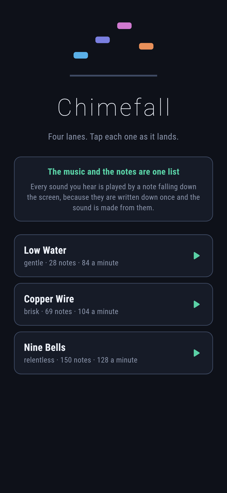
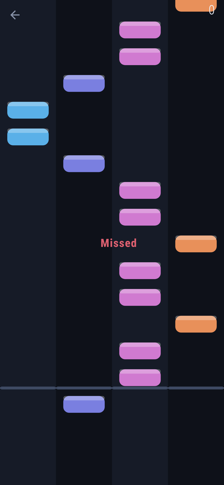
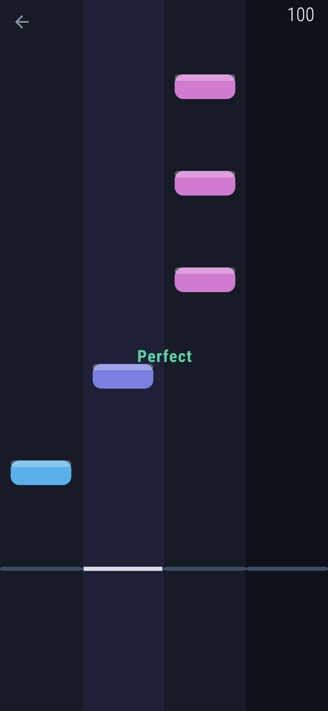
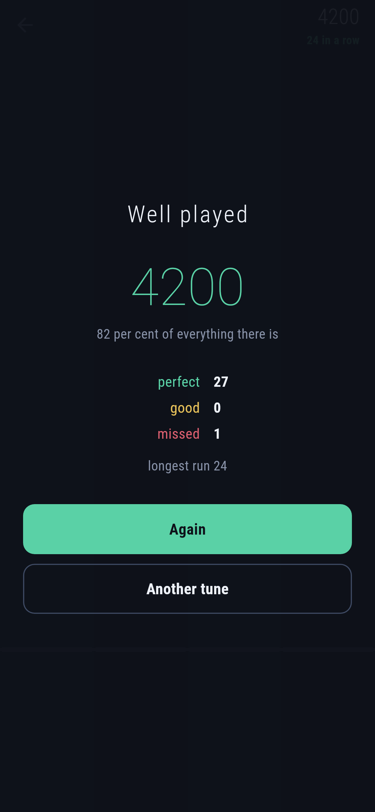

# Chimefall

A rhythm game for phones, in Flutter, for Android and iOS.

Four lanes, notes falling, tap each one as it lands. Dead on is perfect, close
is good, and a run of them is worth more than the same notes scattered.

| | | | |
|---|---|---|---|
|  |  |  |  |

## The music and the notes are one list

A rhythm game normally has two things: an audio file, and a chart of when to
tap. Two things that can drift apart — and the drift is exactly what makes one
unplayable.

Here there is one. A tune is a list of notes, each with a moment, a lane and a
pitch. The falling notes come from that list, and so does the sound:
`tool/build_audio.dart` synthesises the WAV from the same objects. There is
nothing to keep in step because there is nothing to keep in step *with*.

**And it is checked.** `test/sound_test.dart` reads the rendered audio back
with a WAV parser written from the specification — not by undoing the writer,
because a reader that mirrors the writer agrees with it however wrong they both
are — and then, for every note the chart promises, asks the audio whether that
note's own pitch appears at that moment. It uses a Goertzel filter, which
answers about one frequency rather than all of them:

> at the time the chart says a note sounds, does the sound gain energy at that
> note's frequency?

Asked that way rather than by looking for onsets, because an onset detector
finds nothing in a dense passage — the sound never drops between notes — while
a note's own pitch arriving is plain however busy the music is. There is a test
the other way round too: a pitch nothing in the tune plays stays quiet all the
way through.

## The sound is generated, not licensed

Three sine partials at 1, 2.76 and 5.4 times the note, the higher ones quieter
and dying faster, over an envelope that rises in four milliseconds and falls
away. Those ratios are not a harmonic series and that is the point: a struck
metal bar rings at ratios that are not whole numbers, which is why a bell
sounds like a bell and a plucked string does not.

Nothing in this repository is a file somebody downloaded. The tunes are written
as bars of text in `lib/tune/tunes.dart` — sixteen characters to a bar, a digit
for a step of the scale — and the lane a note falls in comes out of how high it
is, so the falling notes are the shape of the melody rather than a pattern laid
over it.

## Judging a tap

Everything that decides anything works off a number of seconds and knows
nothing about audio, which is what lets the whole game be tested without a
speaker: `test/play_test.dart` plays every tune perfectly, a little late, not
at all, and mashed, and checks what each is worth.

The number of seconds itself comes from the music. The player reports its
position a few times a second, which is nowhere near often enough to fall a
note by, so `lib/play/beat.dart` carries the last reading forward with the wall
clock and corrects when the next arrives — easing small differences away so
nothing visibly hops, and believing a big jump at once because something real
happened. Judging taps against a clock that is *not* the music is judging them
against something that has already drifted, since starting a sound takes a
moment nothing gets told about.

**What is not tested here:** that sound actually comes out of a speaker. There
is no audio device on the machine this was built on. What is tested is that the
file is a valid WAV, that it contains the notes the chart promises at the
moments it promises them, that the file shipping in `assets/` is what the code
renders now, and — in CI, on a real emulator — that the app starts the tune
without erroring.

## Running it

```
make deps    # flutter pub get
make test    # everything
make analyze
make shots   # render the screens into build/showcase, redraw the logo
make audio   # rebuild the WAVs from the note lists
make apk     # release APK
make ios     # release iOS build, unsigned
```

## Tests

`flutter test` runs the tunes (that the notation reads back, that low notes are
on the left, that they get busier), the sound (a WAV a second reader accepts,
loud enough and never clipping, every note present at its own pitch, no pitch
present that nothing plays, and the shipped files matching the code), the
judging (perfect, good, early, late, wrong lane, missed, mashed), the clock,
and then the game through the screen on three phone sizes.

Screenshots come from `test/showcase_test.dart`. The moments in them are real:
the tune is run to a chosen second and the notes on screen are the ones
actually due then, because they come out of the same list the sound does.
