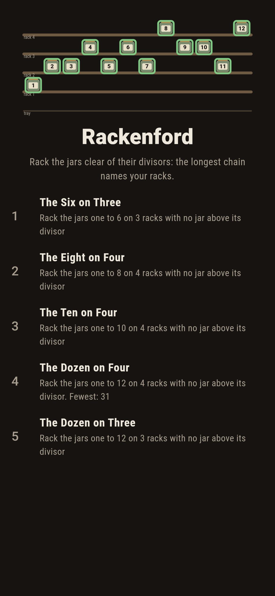
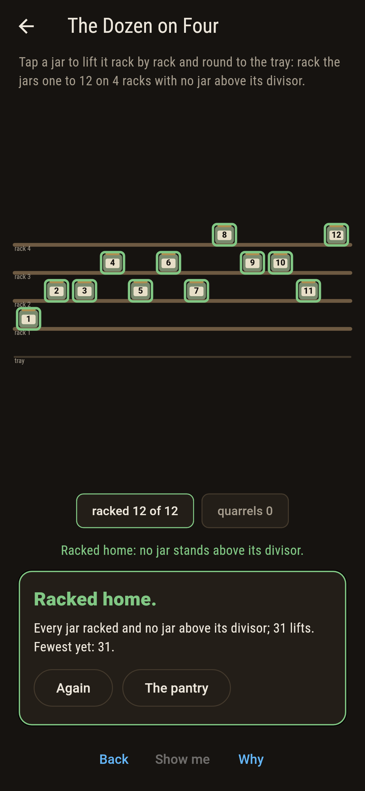
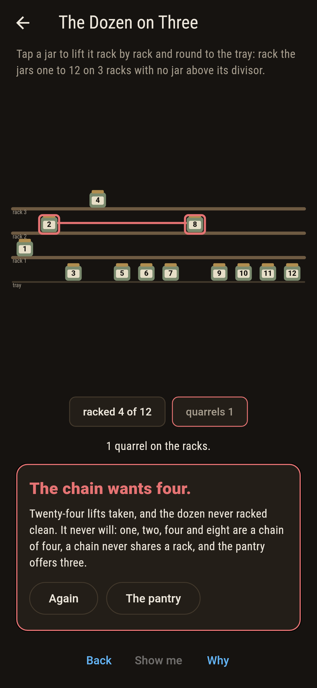
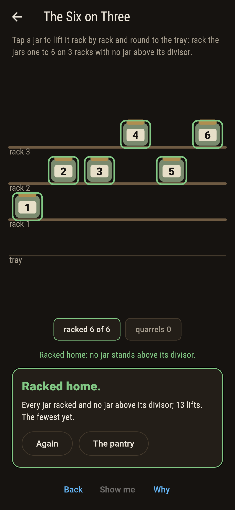
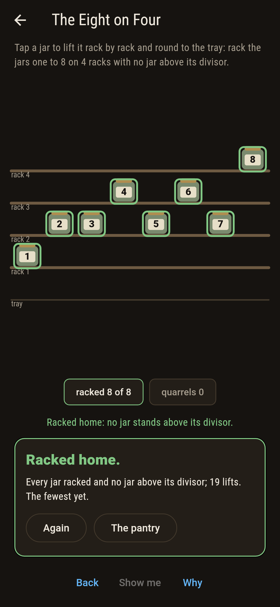
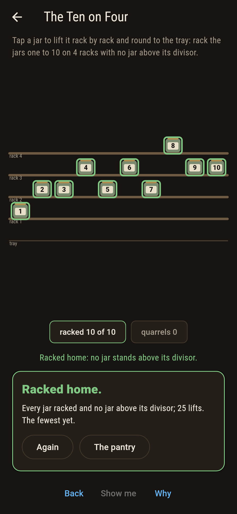
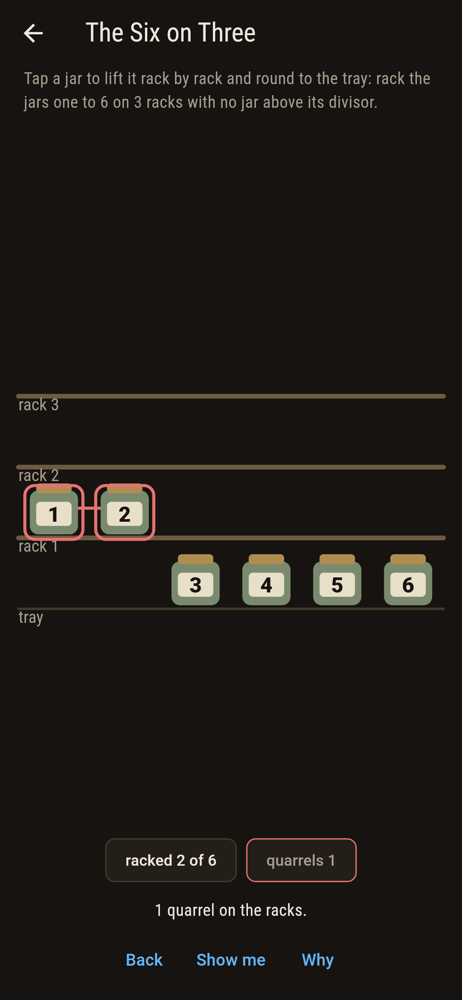
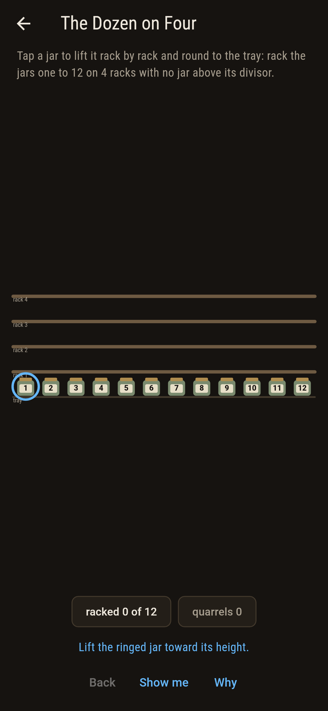
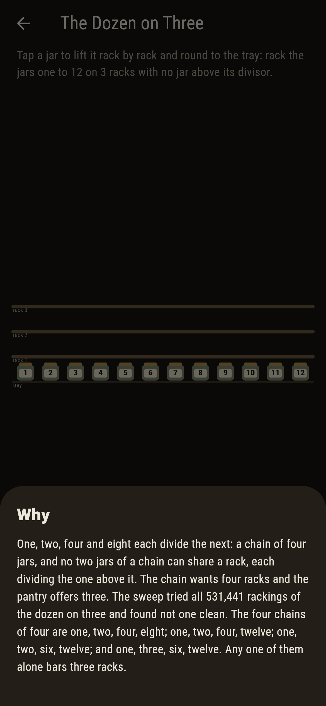

# Rackenford


Jars numbered one and up, racks in a larder, and one rule: no
rack may hold a jar and a jar that divides it. Mirsky's law
says the racks you need are exactly the longest divisor chain
among the jars, no more and no fewer: the chain forces its
length in racks, and racking every jar by its chain height
lands with exactly that many.

## The pantries

1. **The Six on Three** - rack the jars one to 6 on 3 racks
2. **The Eight on Four** - rack the jars one to 8 on 4 racks
3. **The Ten on Four** - rack the jars one to 10 on 4 racks
4. **The Dozen on Four** - rack the jars one to 12 on 4 racks
5. **The Dozen on Three** - rack the jars one to 12 on 3 racks

Every pantry sits exactly at Mirsky's number: one rack fewer
lands nothing anywhere. The six needs three because one, two
and four are a chain; the eight opens the chain of four; nine
and ten come aboard without costing a rack; and the dozen
carries four chains of four, every one starting at one. The
Dozen on Three is labeled hopeless on its tile, and the why
hands over the chain.

## Two voices

The game never asserts what it has not computed, and it computes
everything at least twice:

* **The quarrel census** reads every rack pair by pair, links
  the sore jars rust, and keeps the tally live as the jars are
  lifted.
* **The height racking** builds a landing with no searching in
  it, every jar on the rack of its longest chain, and lands at
  every shipped size; the pruned sweep counts every clean
  racking besides, 12 and 864 and 2,304 and 1,728 of them, and
  none at all one rack down.

`tool/check_racks.dart` runs the lot, the four chains of four
listed whole, and refuses the bake on any disagreement.

## The checker's ledger

What `dart run tool/check_racks.dart` printed for the build
this README shipped with, word for word:

```
every pantry racked every clean way, 12 and 864 and 2,304 and 1,728 of them: each sits exactly at the longest divisor chain, one rack fewer lands nothing anywhere, the height racking lands everywhere, and the dozen carries four chains of four, every one starting at one

 1 The Six on Three   rack the jars one to 6 on 3 racks with no jar above its divisor: 12 rackings of the sweep land it
 2 The Eight on Four  rack the jars one to 8 on 4 racks with no jar above its divisor: 864 rackings of the sweep land it
 3 The Ten on Four    rack the jars one to 10 on 4 racks with no jar above its divisor: 2304 rackings of the sweep land it
 4 The Dozen on Four  rack the jars one to 12 on 4 racks with no jar above its divisor: 1728 rackings of the sweep land it
 5 The Dozen on Three rack the jars one to 12 on 3 racks with no jar above its divisor: none of the 531,441, and the chain of four said so first
```

## Screenshots

| The larder | The dozen on four | The dozen on three admitted |
| --- | --- | --- |
|  |  |  |

| The six | The eight | The ten | A quarrel | Show me | The why |
| --- | --- | --- | --- | --- | --- |
|  |  |  |  |  |  |

Screenshots are drawn by `test/showcase_test.dart` at real phone
sizes with the app's own painter, then copied into `docs/` as
they came out; every lift in them was tapped, so nothing
pictured is a racking the game could not reach. The logo and
every launcher icon come out of `test/mark_test.dart` the same
way: the mark is the dozen racked by chain height, Mirsky's own
racking.

## Building

```
flutter test          # 44 tests, the sweep among them
dart run tool/check_racks.dart
flutter build apk     # or: flutter build ios
```
