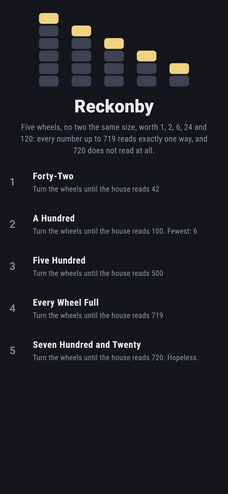
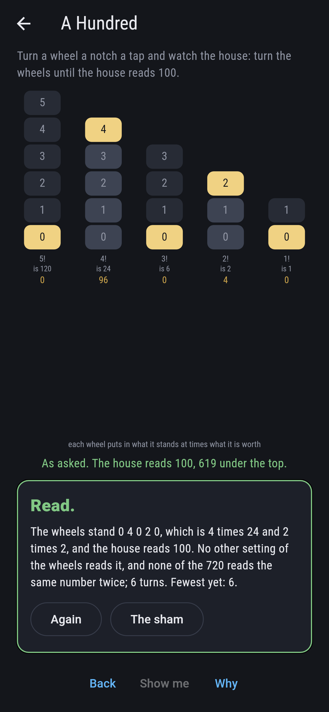
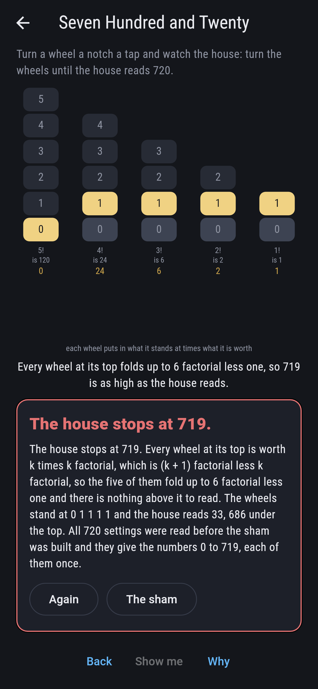
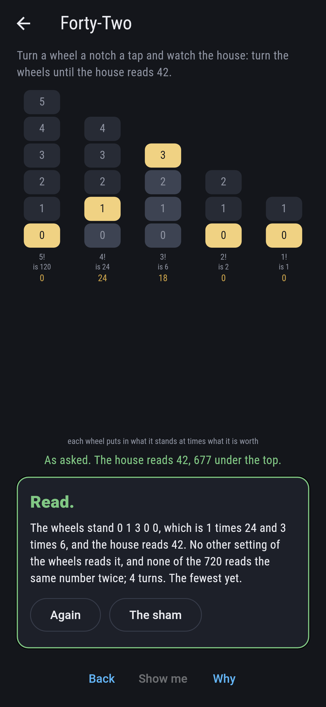
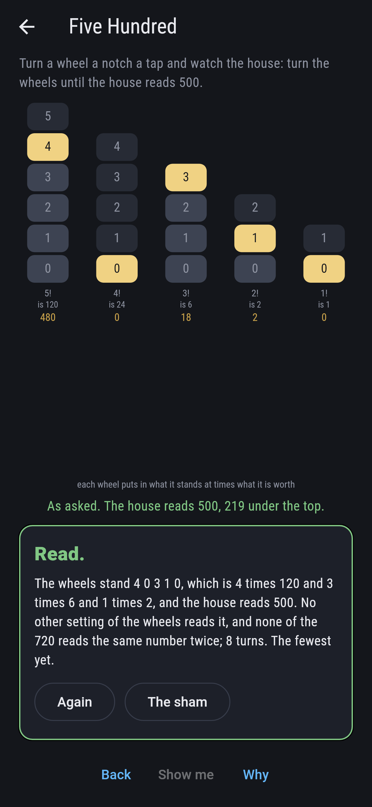
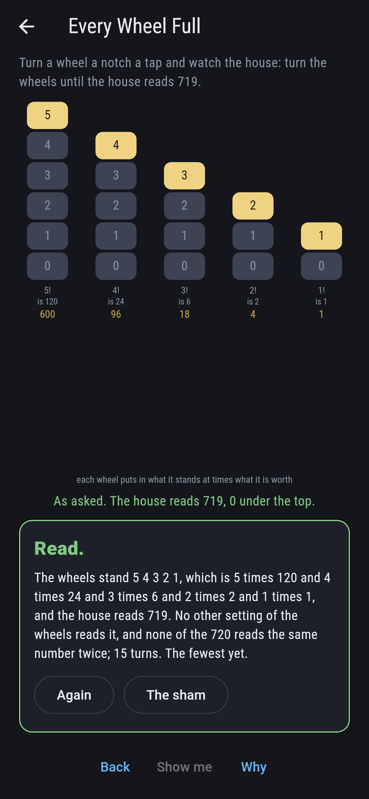
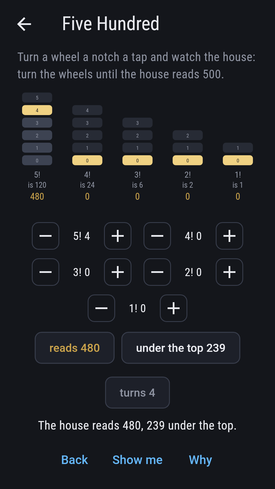
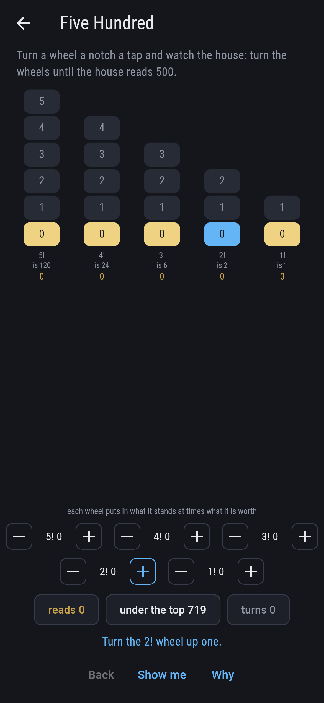
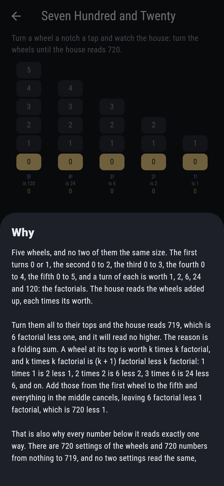

# Reckonby


A counting house with five wheels, no two the same size. The first
turns 0 or 1, the second 0 to 2, the third 0 to 3, the fourth 0 to 4,
the fifth 0 to 5, and a turn of each is worth 1, 2, 6, 24 and 120: the
factorials. The house reads the wheels added up, each times its worth.
Turn a wheel a notch a tap and watch the reading.

There are 720 settings of the wheels and they read the 720 numbers from
nothing to 719, each of them exactly once. Turn every wheel to its top
and the house reads 719. It will not read 720.

## The asks

1. **Forty-Two** - turn the wheels until the house reads 42
2. **A Hundred** - turn the wheels until the house reads 100
3. **Five Hundred** - turn the wheels until the house reads 500
4. **Every Wheel Full** - turn the wheels until the house reads 719
5. **Seven Hundred and Twenty** - turn the wheels until the house reads 720

Each of the first four has exactly one setting that reads it, as every
number under the top does, and the turns it takes from a house standing
at nothing are just that number's wheels added up: four for 42, six for
100, eight for 500, and fifteen for 719, which is the most any reading
costs. Seven Hundred and Twenty says Hopeless on its tile, and the card
at the end of the ask says why on a finger.

## Why the house stops at 719

A wheel at its top is worth k times k factorial, and k times k
factorial is (k + 1) factorial less k factorial: 1 times 1 is 2 less 1,
2 times 2 is 6 less 2, 3 times 6 is 24 less 6, and on. Add those from
the first wheel to the fifth and everything in the middle cancels,
leaving 6 factorial less 1 factorial, which is 719. There is nothing
above it to read.

The same fact is why every number below it reads exactly one way. If
two settings differ, take the cheapest wheel they differ on: the wheels
under it, even at their tops, come to one less than it is worth, so
they can never make up the difference. That is the factorial number
system, and it is what an odometer with wheels of unequal size does.

## Two voices

The game never asserts what it has not computed, and it computes
everything at least twice:

* **The adding** takes a setting and works out what it reads: each
  wheel times the factorial of its place.
* **The counting** adds nothing. It starts the house at nothing and
  ticks it up one at a time, carrying from wheel to wheel as an
  odometer does, and notes which tick each setting falls on.

The tick a setting falls on is what it adds to, on all 720 of them.
Dividing a number back down by 2, then 3, then 4 and on returns the
wheels it came from, which is checked on every number too.

`tool/check_wheels.dart` runs the lot and refuses the bake on any
disagreement.

## The checker's ledger

What `dart run tool/check_wheels.dart` printed for the build this
README shipped with, word for word:

```
every setting of the 5 wheels taken, 720 of them, and each read twice: once by adding the wheels up, each times the factorial of its place, and once by counting the house up a tick at a time from nothing and carrying as an odometer does, which adds nothing at all: the tick a setting falls on is what it adds to, on every one of the 720; the 720 settings read the 720 numbers from nothing to 719, each number exactly once and none of them twice, and dividing a number back down by 2, then 3, then 4 and on returns the wheels it came from; the wheels under the kth, all at their tops, come to one less than the kth is worth, which is why no two settings can read the same: under the 2! wheel they come to 1, under the 3! wheel they come to 5, under the 4! wheel they come to 23, under the 5! wheel they come to 119; and the top is 719 because k times k factorial is (k + 1) factorial less k factorial, so the wheels at their tops fold up to 6 factorial less one, checked out to 12 wheels where it comes to 6,227,020,799

 1 Forty-Two                turn the wheels until the house reads 42: one setting of the 720 reads it, in 4 turns
 2 A Hundred                turn the wheels until the house reads 100: one setting of the 720 reads it, in 6 turns
 3 Five Hundred             turn the wheels until the house reads 500: one setting of the 720 reads it, in 8 turns
 4 Every Wheel Full         turn the wheels until the house reads 719: one setting of the 720 reads it, in 15 turns
 5 Seven Hundred and Twenty turn the wheels until the house reads 720: no setting of the 720, and the folding sum says why
```

## Screenshots

| The sham | A hundred | Seven hundred and twenty |
| --- | --- | --- |
|  |  |  |

| Forty-two | Five hundred | Every wheel full | Midway, on the small phone | Show me | The why |
| --- | --- | --- | --- | --- | --- |
|  |  |  |  |  |  |

Screenshots are drawn by `test/showcase_test.dart` at real phone sizes
with the app's own painter, then copied into `docs/` as they came out;
every wheel in them was turned by a tap, so nothing pictured is a
reading the game could not reach. The wheels across the top of the sham
shot are the mark rather than a run of taps. The logo and every
launcher icon come out of `test/mark_test.dart` the same way: the mark
is every wheel at its top, which reads 719.

## Building

```
flutter test          # 51 tests, the sweep among them
dart run tool/check_wheels.dart
flutter build apk     # or: flutter build ios
```
