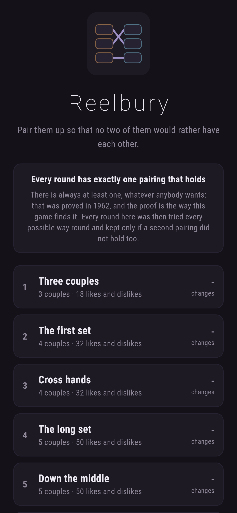
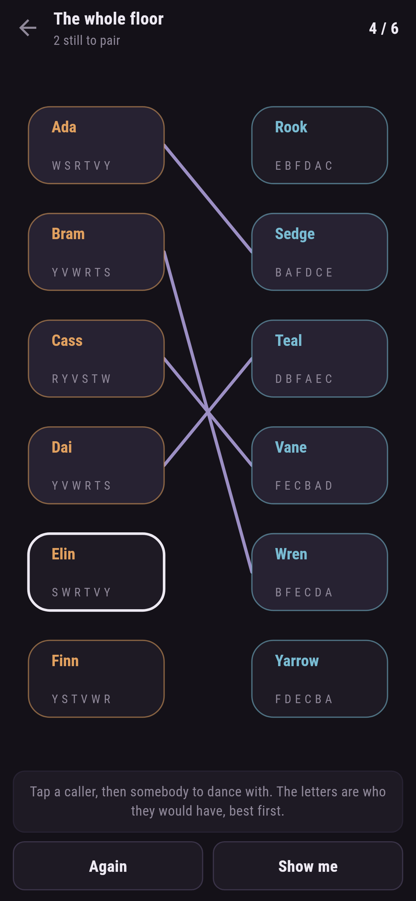
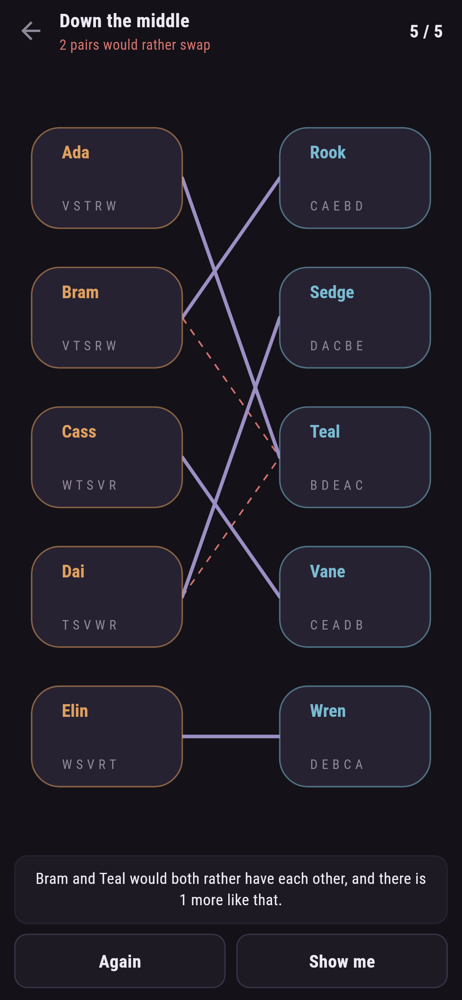
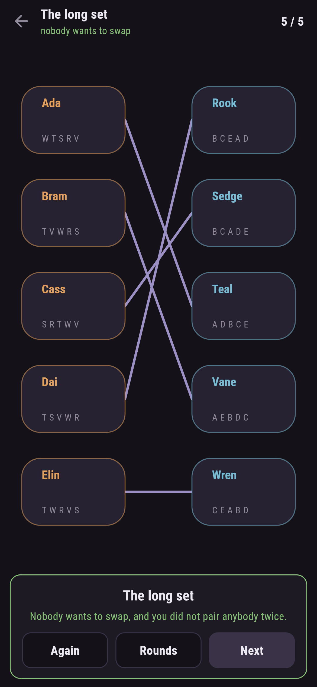

# Reelbury

A pairing puzzle for phones, in Flutter, for Android and iOS.

Two sides of a village hall, and everybody has an order they would have the
other side in. Pair them up so that no two people would both rather have each
other than what you gave them. Every round has exactly one pairing like that.

| | | | |
|---|---|---|---|
|  |  |  |  |

## One rule, and it is about pairs rather than people

Nobody is asked to be happy. A pairing fails on one thing only: two people on
opposite sides who would **both** rather have each other than what they have
got. Find one of those and the pairing will not hold, however pleased everybody
else is.


> Bram and Teal would both rather have each other, and there is 1 more like
> that.

The game says nothing until the floor is full, because before that the rule
would point at everybody: an unpaired person would rather have somebody than
nobody, so every pair is a failing pair. Once everybody has a partner, the same
test is the whole game.

## There is always one, and that is a proof rather than a hope

Ask in turn. Each caller asks the dancers in their own order; a dancer holds
the best offer so far and turns the rest away; anybody turned away asks the
next one down their list. It cannot go round for ever, because every ask is one
that caller never makes again. It cannot end with anybody spare, because a
dancer who has been asked never goes back to nobody. So it stops, with
everybody paired, and nobody wanting to swap.

That is Gale and Shapley, 1962, and it is the reason this game can promise
every round has an answer. `test/reel_test.dart` runs it on four hundred halls
of random sizes and checks all three claims each time:

```dart
expect(pairing, isNot(contains(-1)), reason: 'somebody was left out');
expect(pairing.toSet(), hasLength(hall.count), reason: 'somebody was in two couples');
expect(Stable.holds(hall, pairing), isTrue, reason: 'a pair would rather have each other');
```

The other half of what they proved is that asking beats being asked: whoever
does the asking gets the best partner any holding pairing could give them. A
test checks that against every holding pairing there is, found by trying all of
them.

## Exactly one pairing, checked two ways that share nothing

A round where two pairings hold is no puzzle, because both answers are right.
So every round here was tried every possible way round, and kept only if one
survived:

```
$ make rounds
 1 Three couples    3 couples  1 pairing holds   both sides agree 0 of 3 got their first choice  1 0 2
 7 The last waltz   7 couples  1 pairing holds   both sides agree 1 of 7 got their first choice  5 3 4 6 0 2 1
```

That is a search: seven factorial pairings for the last round. There is also a
theorem. The pairings that hold have a best one for each side, and there is
exactly one pairing when those two are the same, so asking from both sides and
comparing the answers settles it without counting anything. The two are held
against each other on three hundred halls, and the test insists the sample
contains at least twenty of each answer, since three hundred agreements about
the same answer would prove nothing.

## Finding rounds is mostly throwing them away

`make find` shuffles everybody's list and keeps the halls where one pairing
holds and few people get their first choice. A round that hands everybody what
they asked for first is a queue rather than a puzzle:

```
$ make find ARGS="5 4"
kept 4 of 26 halls of 5; the most pairings any of them held was 4
```

## Running it

```
make deps    # flutter pub get
make test    # everything
make analyze
make shots   # render the screens into build/showcase, redraw the logo and icons
make rounds  # walk every shipped round and count the pairings that hold
make find    # look for new halls where only one pairing holds
make apk     # release APK
make ios     # release iOS build, unsigned
```

## Tests

`flutter test` runs the hall (who is liked more than whom, and a list that is
not a list of everybody), asking in turn (that it always ends with everybody
paired and nobody wanting to swap, over four hundred random halls; that either
side may ask; that the asking side does at least as well; and that its answer
beats every other holding pairing for the askers), the theorem against the
count on three hundred halls, every shipped round (lists that name everybody
once, exactly one pairing that holds, and not the one where everybody gets
their first choice), and the pairing itself (making a couple breaks whatever
either of them was in, parting, and that laying the answer out holds while
every other way of pairing the first round up does not).

Then the game through the screen: taking a caller, being told to take one
first, putting somebody down again, a couple broken by pairing over it, the
message naming two who would rather swap, **Again**, **Show me** putting one
couple of the answer down, and every round paired up to the end.

Screenshots come from `test/showcase_test.dart`, and every couple in them was
made by tapping a name. `test/mark_test.dart` draws the logo, the launcher
icons at every density Android asks for and every size the iOS icon set asks
for; there is no image in this repository that was not produced by it.
