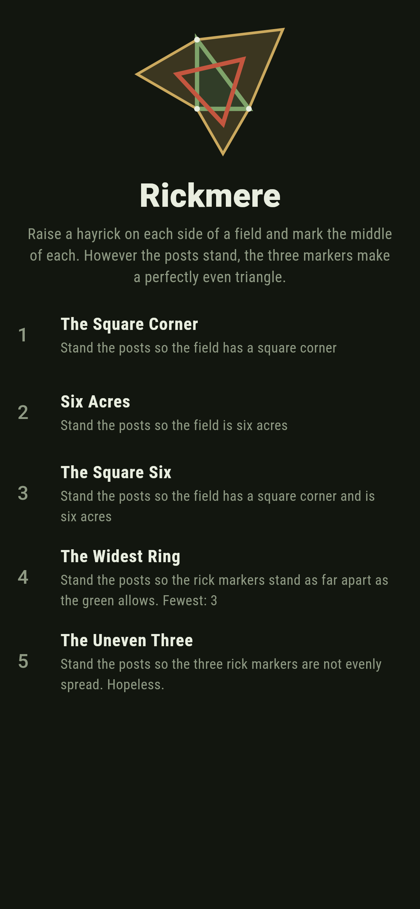
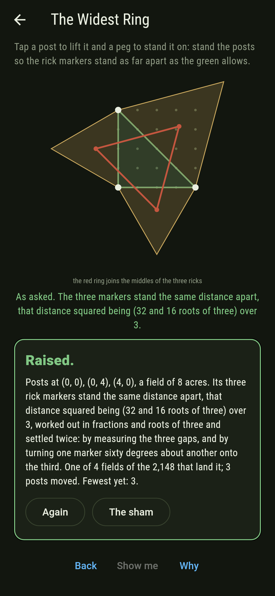
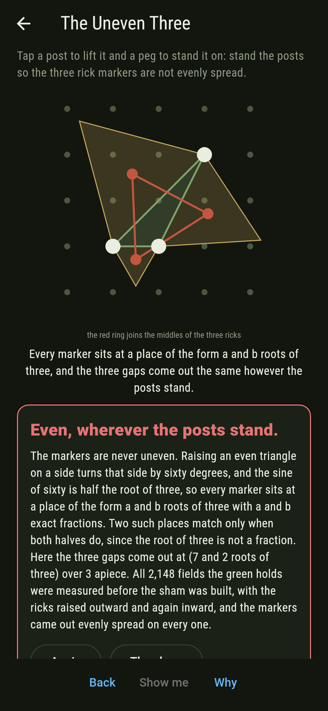
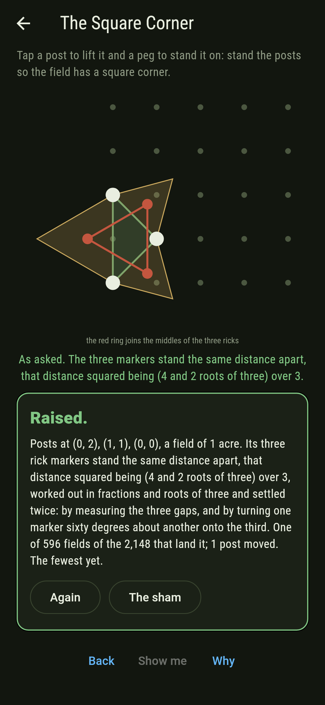
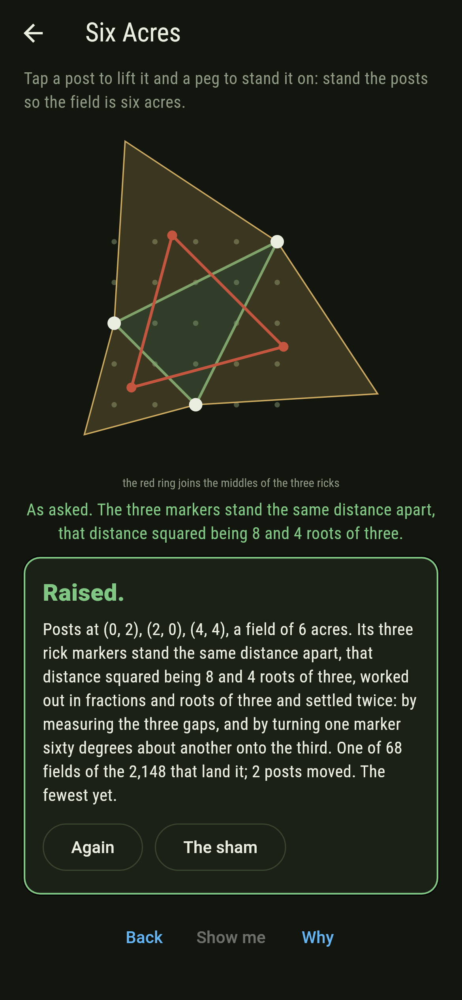
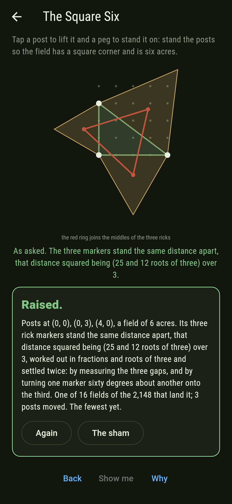
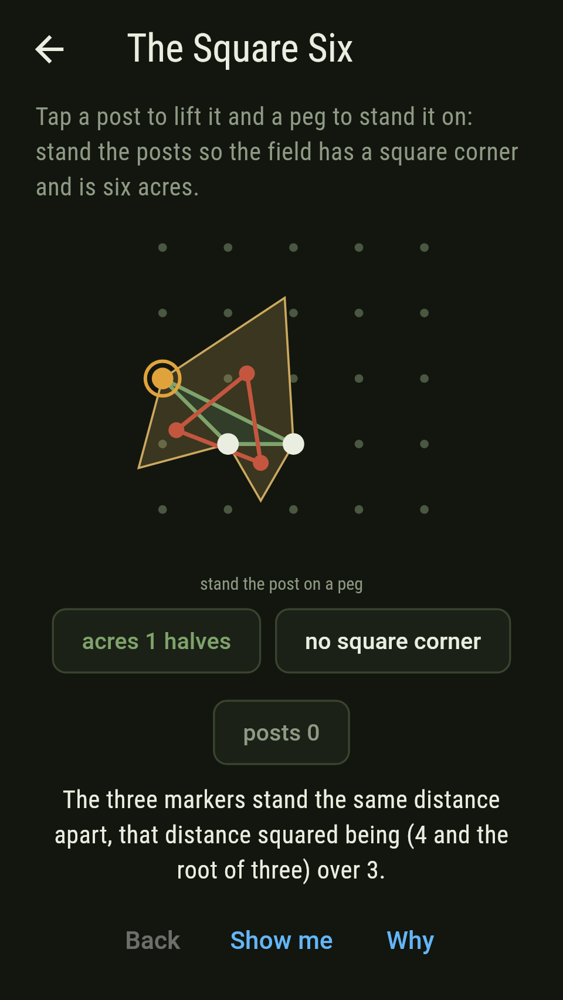
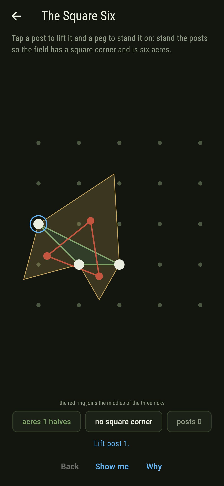
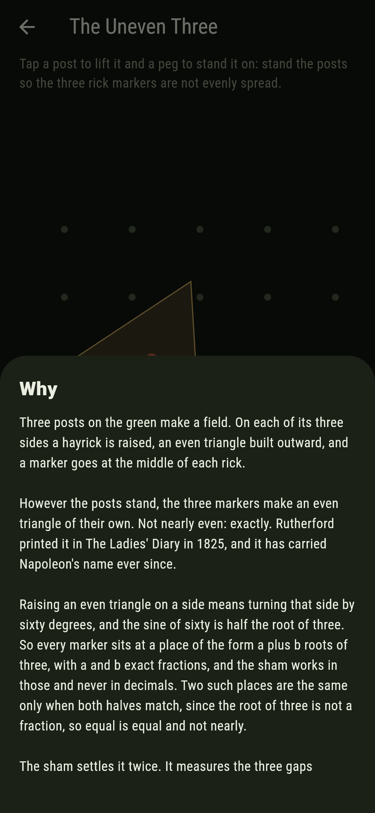

# Rickmere


Three posts on a peg green make a field. On each of its three sides a
hayrick is raised, an even triangle built outward, and a marker goes at
the middle of each rick. Tap a post to lift it and a peg to stand it
on, and watch the three markers.

They always make an even triangle. Not nearly even: exactly. Move the
posts wherever you like and the red ring keeps its shape. Rutherford
printed the fact in The Ladies' Diary in 1825, and it has carried
Napoleon's name ever since.

## The asks

1. **The Square Corner** - stand the posts so the field has a square corner
2. **Six Acres** - stand the posts so the field is six acres
3. **The Square Six** - stand the posts so the field has a square corner and is six acres
4. **The Widest Ring** - stand the posts so the rick markers stand as far apart as the green allows
5. **The Uneven Three** - stand the posts so the three rick markers are not evenly spread

596 of the 2,148 fields the green holds have a square corner and 68 are
six acres, but only 16 are both, since the legs then have to multiply
to twelve. Four fields spread the markers as far as the green allows,
and they are the four right triangles that fill a whole corner of it.
The Uneven Three says Hopeless on its tile, and the card at the end of
the ask says why on a finger.

## Why the markers are always even

Raising an even triangle on a side means turning that side by sixty
degrees, and the sine of sixty is half the root of three. So every
marker sits at a place of the form a plus b roots of three, with a and
b exact fractions, and the game works in those and never in decimals.

That matters more than it looks. Two such places are the same only when
both halves match, because the root of three is not a fraction: if a
plus b roots equalled c plus d roots with b and d different, you could
rearrange and write the root of three as a fraction. So when the game
says two gaps are equal, they are equal, not equal to fifteen decimal
places.

## Two voices

The game never asserts what it has not computed, and it computes
everything at least twice:

* **The measuring** takes the three gaps between the markers, squares
  them, and compares.
* **The turning** measures nothing. It turns one marker sixty degrees
  about another and asks whether it lands exactly on the third, which
  only an even triangle does.

The two are set against each other on every field the green holds, with
the ricks raised outward and then inward. There is a third fact in the
ledger: the inward markers make an even triangle too, and the two
triangles' areas, signed, add up to the field's own, with the roots of
three cancelling to leave a whole number.

`tool/check_ricks.dart` runs the lot and refuses the bake on any
disagreement.

## The checker's ledger

What `dart run tool/check_ricks.dart` printed for the build this README
shipped with, word for word:

```
every field the 5 by 5 green holds taken, all 2,148 of them, with the ricks raised outward and then inward, 4,296 raisings, and each raising measured by both voices, 8,592 measurings in all: the three markers are the same distance apart every time; the first voice takes the three gaps between the markers and compares them, and the second turns one marker sixty degrees about another and asks whether it lands on the third, which measures nothing: they agree on all 4,296 raisings; all of it is done in numbers of the form a and b roots of three, with a and b exact fractions, since raising an even triangle turns a side by sixty degrees and the sine of sixty is half the root of three: nothing here is a decimal, and equal means equal; the markers stand 77 different distances apart over the 2,148 fields, the widest of them a gap whose square is (32 and 16 roots of three) over 3, which the four fields filling a corner of the green reach; and raising the ricks inward instead gives another even triangle, whose area added to the outward one comes to the field's own area on all 2,148 fields, the roots of three cancelling to leave a whole number every time

 1 The Square Corner stand the posts so the field has a square corner: 596 of the 2,148 fields land it, the nearest 1 post away
 2 Six Acres         stand the posts so the field is six acres: 68 of the 2,148 fields land it, the nearest 2 posts away
 3 The Square Six    stand the posts so the field has a square corner and is six acres: 16 of the 2,148 fields land it, the nearest 3 posts away
 4 The Widest Ring   stand the posts so the rick markers stand as far apart as the green allows: 4 of the 2,148 fields land it, the nearest 3 posts away
 5 The Uneven Three  stand the posts so the three rick markers are not evenly spread: none of the 2,148, raised either way, and the roots of three say why
```

## Screenshots

| The sham | The widest ring | The uneven three |
| --- | --- | --- |
|  |  |  |

| The square corner | Six acres | The square six | A post in hand, on the small phone | Show me | The why |
| --- | --- | --- | --- | --- | --- |
|  |  |  |  |  |  |

Screenshots are drawn by `test/showcase_test.dart` at real phone sizes
with the app's own painter, then copied into `docs/` as they came out;
every post in them was stood by a tap on a peg, so nothing pictured is
a field the game could not reach. The field across the top of the sham
shot is the mark rather than a run of taps. The logo and every launcher
icon come out of `test/mark_test.dart` the same way: the mark is a
three by four field with a square corner, its ricks raised and its ring
drawn over them.

## Building

```
flutter test          # 54 tests, the sweep among them
dart run tool/check_ricks.dart
flutter build apk     # or: flutter build ios
```
