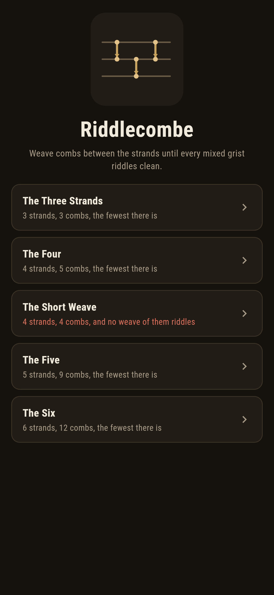
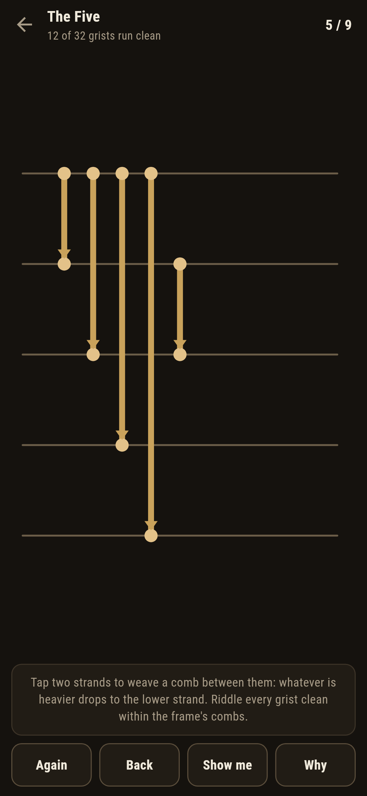
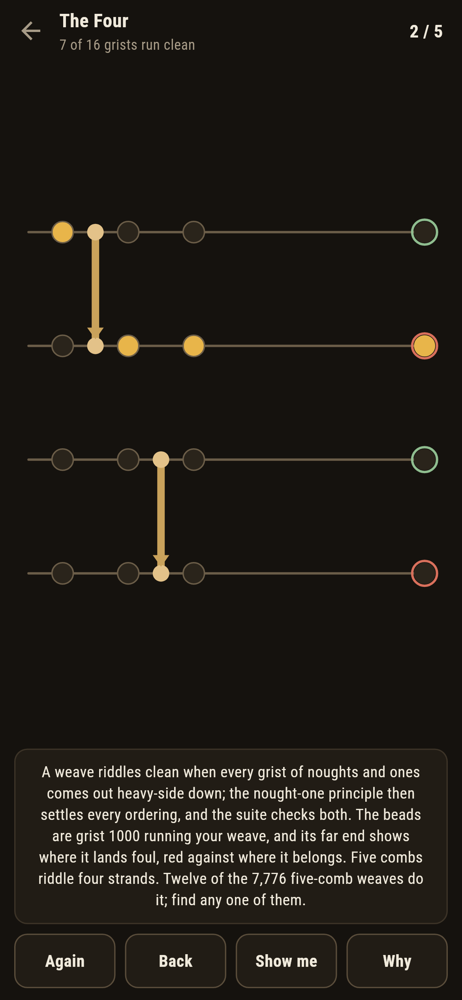
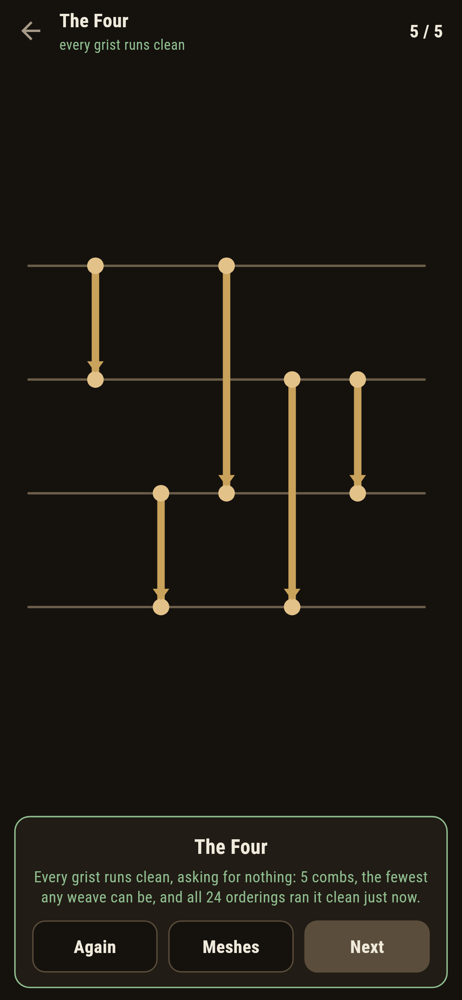
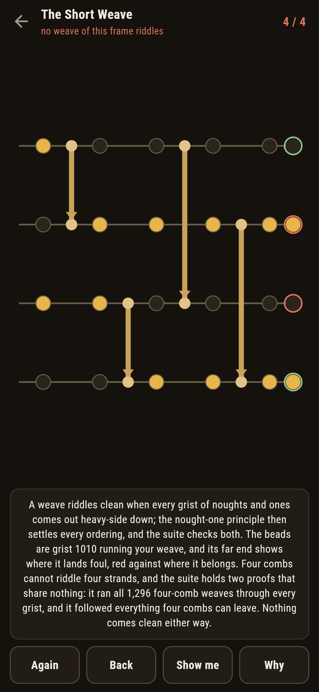
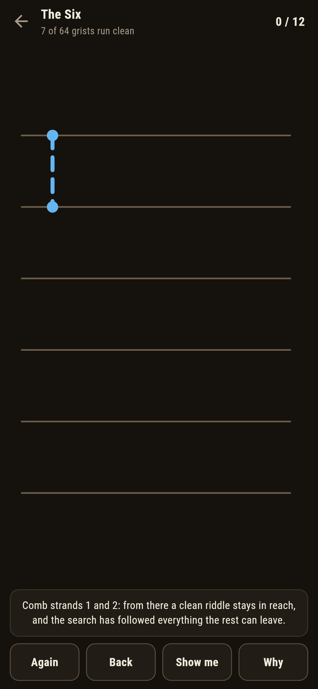

# Riddlecombe

A network-weaving puzzle for phones, in Flutter, for Android and iOS.

Strands hang in a frame carrying mixed grain. Tap two strands to weave
a comb between them: whatever is heavier drops to the lower strand.
Riddle every possible mixture clean, heavy grain at the bottom, within
the frame's count of combs. This is building a sorting network by
hand, and every number the game states about one has been walked, not
cited.

| | | | |
|---|---|---|---|
|  |  |  |  |

## The nought-one principle, earned

The live check runs every grist of noughts and ones down the weave,
two to the strands of them, instead of every ordering of distinct
grains. That this is enough is the old nought-one principle, and the
suite does not cite it: it runs both checks on every mesh that ships,
and on every four-comb weave of four strands there is, all 1,296 of
them, and the two verdicts never part.

```
$ make meshes
 1 The Three Strands 3 strands, 8 grists  riddles in 3 combs and not in 2
 2 The Four          4 strands, 16 grists  riddles in 5 combs and not in 4
 3 The Short Weave   4 strands, 16 grists  no weave of 4 combs riddles
 4 The Five          5 strands, 32 grists  riddles in 9 combs and not in 8
 5 The Six           6 strands, 64 grists  riddles in 12 combs and not in 11

all 1296 four-comb weaves swept: none riddles, and the nought-one principle held on every one
of the 7776 five-comb weaves, exactly 12 riddle
```

Every "and not in" above is a search that followed everything the
shorter frame can leave, every branch to the end. Three, five, nine
and twelve are the honest floors for their strands, walked fresh at
every bake.

## The short weave

Four combs cannot riddle four strands, and the frame that asks for it
ships labelled, in the house tradition of maps nobody can win, with
two proofs that share nothing: the enumeration of all 1,296 four-comb
weaves, and the outcome-following search. Place the combs any way you
like; a grist always runs foul, and **Why** runs the first one down
your weave in beads, its far end red against where it belongs.



## The live frame

The count of clean grists updates as every comb lands. A comb that
wastes the frame, leaving no filling of the rest that riddles, is
called out the moment it lands, with **Back** waiting. **Show me**
ghosts a comb the search has followed to a clean riddle, and the win
card runs all the orderings through the finished weave right then, the
second voice having the last word.



## Building

```
make deps    # fetch packages
make check   # analyze + every test
make meshes  # search the shorter weaves, sweep the short ones, print the ledger
make shots   # render the screenshots and redraw the icons
make apk     # Android release build
make ios     # iOS release build (unsigned)
```

The logo and every app icon are drawn by the game's own painter in
`test/mark_test.dart`. There is no image in this repository that was not
produced by code in it.

## How it is put together

```
lib/weave/rules.dart     combs, grists, both sweeps, the
                         outcome-following search
lib/weave/mesh.dart      a mesh: strands, combs, its verdict
lib/weave/meshes.dart    the five meshes that ship
lib/weave/play.dart      a weave being woven: placing, lifting out,
                         the live clean count
lib/ui/                  the painter, the screens, the mark
tool/check_meshes.dart   the searches, the sweeps, the ledger above
```

The tests comb single grists by hand, sweep all 1,296 short weaves
under both checks, count the twelve five-comb weaves that riddle, pin
every optimal floor by search, riddle every winnable mesh by following
the game's own pointer, and hold the pictures against the real widget
tree. If any of that drifts, `make check` goes red before anything
leaves the machine.
