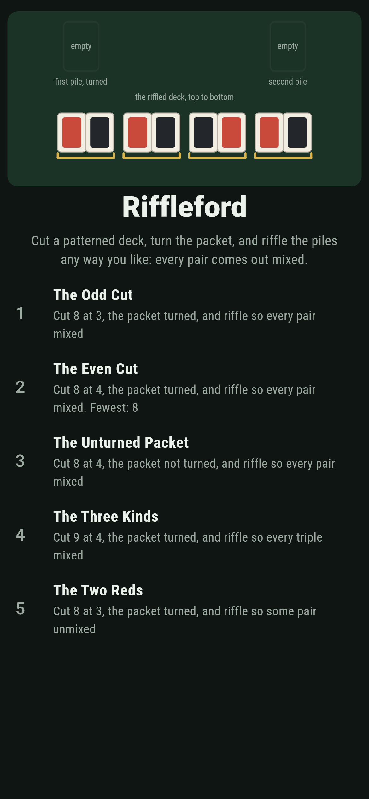
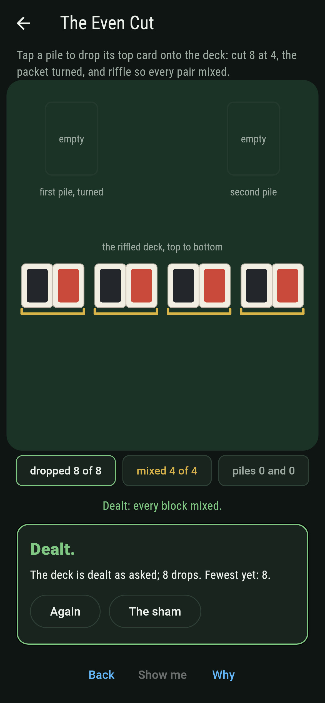
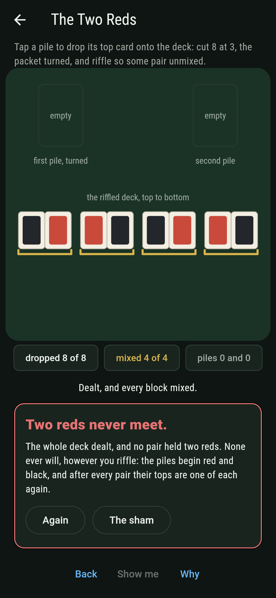
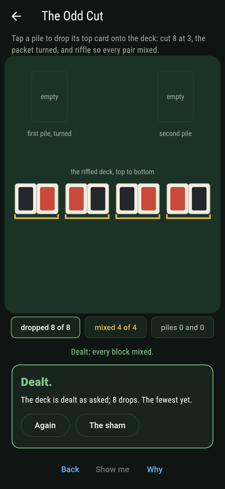
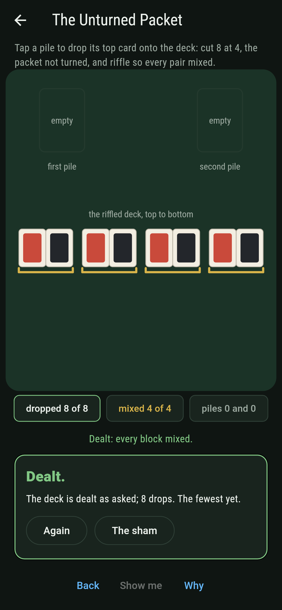
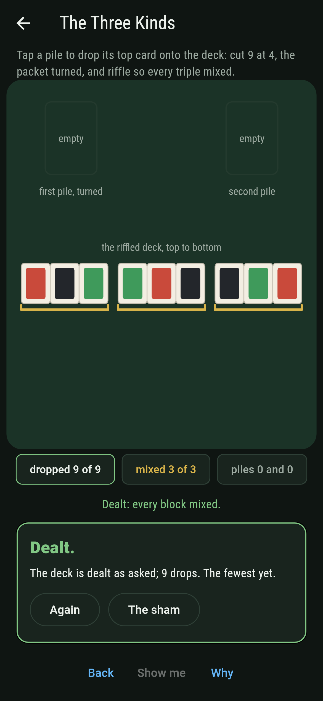
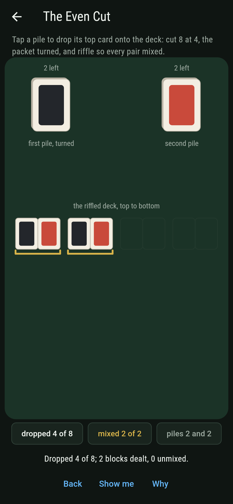
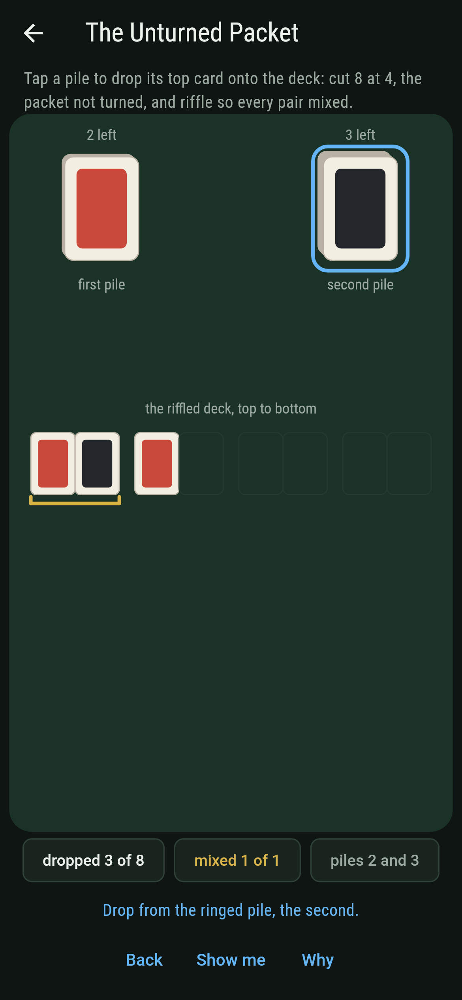
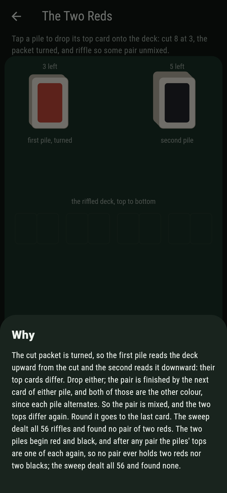

# Riffleford


A deck laid in a repeating pattern, red black red black, or three
kinds round and round. Cut it anywhere, turn the cut-off packet
over so it reads backwards, and riffle the two piles together any
way you please, a card from either pile at every drop. Gilbreath's
principle, 1958, says every block of the pattern's length in the
riffled deck holds one card of each kind, however sloppily you
riffled. The two piles read the pattern in opposite directions
from the cut, so at the start of every block their top cards
differ, whichever way the last block went. Skip the turning over
and an even cut breaks it.

## The riffles

1. **The Odd Cut** - cut 8 at 3, the packet turned, and riffle so every pair mixed
2. **The Even Cut** - cut 8 at 4, the packet turned, and riffle so every pair mixed
3. **The Unturned Packet** - cut 8 at 4, the packet not turned, and riffle so every pair mixed
4. **The Three Kinds** - cut 9 at 4, the packet turned, and riffle so every triple mixed
5. **The Two Reds** - cut 8 at 3, the packet turned, and riffle so some pair unmixed

With the packet turned every riffle lands: all 56 of the odd cut,
all 70 of the even, all 126 of the three kinds. With the packet
not turned the two piles both begin red, and only 6 riffles of the
70 keep every pair mixed, all six dealing the deck back as it was.
The Two Reds is labeled hopeless on its tile: no riffle of the
turned odd cut ever pairs two reds, and the why walks the tops.

## Two voices

The game never asserts what it has not computed, and it computes
everything at least twice:

* **The sweep** deals every full riffle of every deck, every way
  of dropping the two piles together, and reads every block; the
  count of riffles is the cut chosen from the deck's places by
  arithmetic, and the two agree.
* **The tops** are the principle itself, walked: with the packet
  turned the two piles read the pattern in opposite directions from
  the cut, checked card by card, and at the start of every pair
  their top cards differ along every riffle there is, on the eight-
  card decks and on twelve cards at every cut besides; the three
  kinds are swept at every cut of nine, and the unturned even cut
  fails the walk at the first pair.

`tool/check_riffles.dart` runs the lot and refuses the bake on any
disagreement.

## The checker's ledger

What `dart run tool/check_riffles.dart` printed for the build this
README shipped with, word for word:

```
every full riffle of every deck dealt and every block read: with the packet turned every one of the 56, 70 and 126 riffles deals every pair or triple mixed, and every cut of a twelve-card deck of two kinds and a nine-card deck of three besides, since the piles read the pattern in opposite directions and their tops differ at every pair's start; the even cut with the packet not turned lands 6 riffles of 70, all dealing the deck back as it was, and no riffle of the turned odd cut ever pairs two reds

 1 The Odd Cut          cut 8 at 3, the packet turned, and riffle so every pair mixed: 56 riffles of the 56 land it
 2 The Even Cut         cut 8 at 4, the packet turned, and riffle so every pair mixed: 70 riffles of the 70 land it
 3 The Unturned Packet  cut 8 at 4, the packet not turned, and riffle so every pair mixed: 6 riffles of the 70 land it
 4 The Three Kinds      cut 9 at 4, the packet turned, and riffle so every triple mixed: 126 riffles of the 126 land it
 5 The Two Reds         cut 8 at 3, the packet turned, and riffle so some pair unmixed: none of the 56, and the tops said so first
```

## Screenshots

| The sham | The even cut dealt | The two reds admitted |
| --- | --- | --- |
|  |  |  |

| The odd cut | The unturned packet | The three kinds | Mid-riffle | Show me | The why |
| --- | --- | --- | --- | --- | --- |
|  |  |  |  |  |  |

Screenshots are drawn by `test/showcase_test.dart` at real phone
sizes with the app's own painter, then copied into `docs/` as they
came out; every drop in them was tapped, so nothing pictured is a
deck the game could not reach. The logo and every launcher icon
come out of `test/mark_test.dart` the same way: the mark is the
odd cut riffled sloppily, every pair mixed all the same.

## Building

```
flutter test          # 48 tests, the sweep among them
dart run tool/check_riffles.dart
flutter build apk     # or: flutter build ios
```
