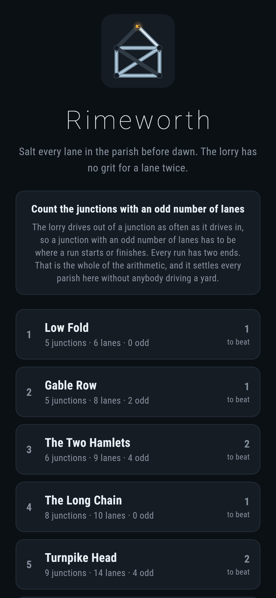
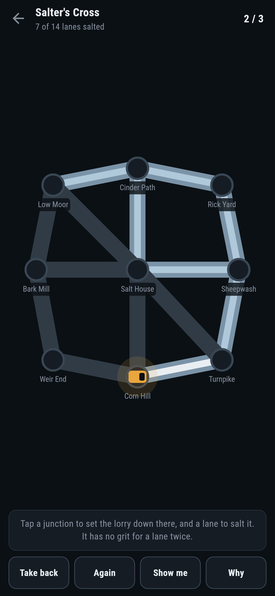
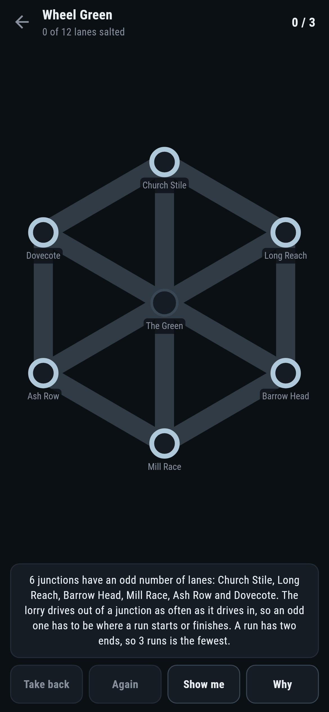
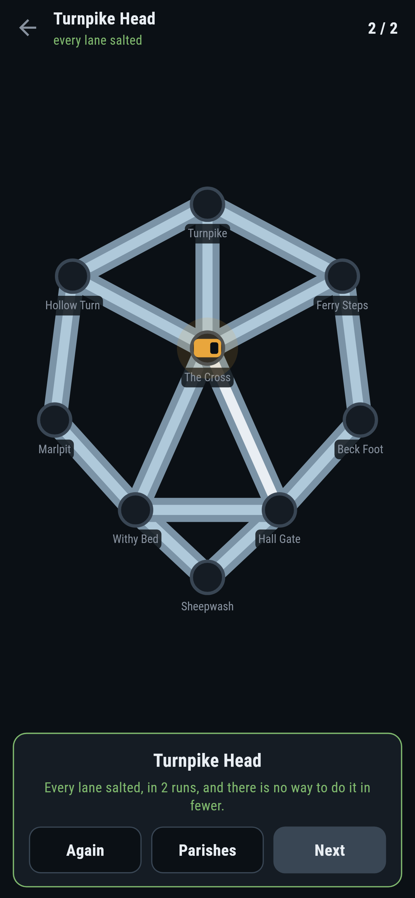
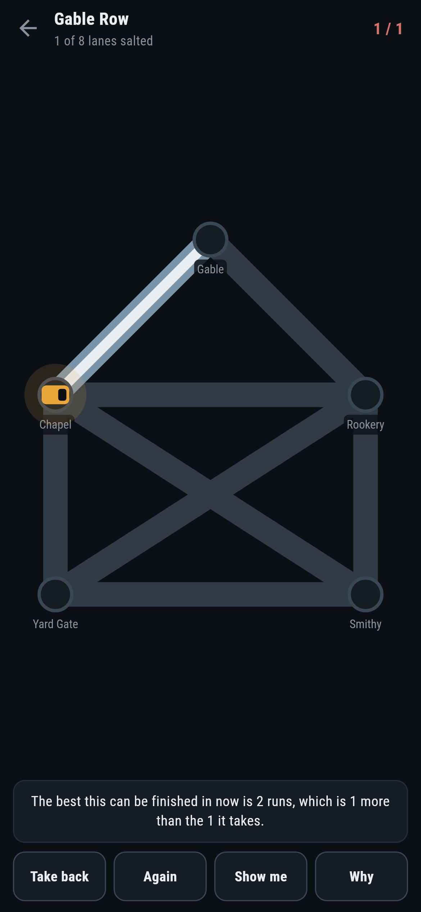

# Rimeworth

A gritting puzzle for phones, in Flutter, for Android and iOS.

Salt every lane in the parish before dawn. The lorry has no grit for a lane
twice, so when it runs out of road you have to take it back to the yard and
set off again. The number on each parish is the fewest times you can possibly
have to do that.

| | | | |
|---|---|---|---|
|  |  |  |  |

## The number is arithmetic, not a search

The lorry drives out of a junction as often as it drives into it, so a
junction with an odd number of lanes on it has to be where a run starts or
where it finishes. Every run has two ends. Count the odd junctions, halve it,
and that is the answer:

```
$ make parishes
 1 Low Fold          5 junctions  6 lanes  0 odd  runs 1  written down 1  by driving 1  1 routes  they salt everything
 2 Gable Row         5 junctions  8 lanes  2 odd  runs 1  written down 1  by driving 1  1 routes  they salt everything
 3 The Two Hamlets   6 junctions  9 lanes  4 odd  runs 2  written down 2  by driving 2  2 routes  they salt everything
 4 The Long Chain    8 junctions  10 lanes  0 odd  runs 1  written down 1  by driving 1  1 routes  they salt everything
 5 Turnpike Head     9 junctions  14 lanes  4 odd  runs 2  written down 2  by driving 2  2 routes  they salt everything
 6 Wheel Green       7 junctions  12 lanes  6 odd  runs 3  written down 3  by driving 3  3 routes  they salt everything
 7 Salter's Cross    9 junctions  14 lanes  6 odd  runs 3  written down 3  by driving 3  3 routes  they salt everything
```

A parish where every junction is even is one run, and it comes back to where
it set off. That is Euler's answer to the bridges of Königsberg from 1736, and
it is the whole of the arithmetic this game runs on.

**Why** puts it on the screen. It rings the odd junctions and names them, and
a player can check it by counting the lanes at one:


## Held to account by driving it

Arithmetic that nobody checks is a claim. `Runs.byDriving` answers the same
question the slow way: the lorry stands at a junction, takes a lane it has not
salted, comes out at the other end, and when it can go no further and lanes
are left it is taken back to the yard, which costs a run. Every state it can
be in is a junction, the lanes salted so far and the runs left over, so states
seen once are not looked at twice. It obeys the rules the screen obeys, which
is the only kind of check worth having.

Two hundred parishes made up at random are settled both ways and the two
always agree. So are all seven that ship.

There is a third way in as well. `Runs.routes` lays the runs out: it pairs the
odd junctions off with lanes that are not there, which leaves every junction
even, walks the one closed run that a parish like that has, and cuts the
imaginary lanes back out. What is left is exactly the runs the counting asked
for. A test drives them and checks every lane is salted once and no more.

## What the game says


After every move it works out the fewest runs the rest of the parish can still
be finished in, which is the same counting done on the lanes that are left,
with one thing added: the lorry is standing somewhere, and wherever that is
has to be an end of the run it is on. So a piece with 2k odd junctions costs k
runs, except that the piece the lorry is standing in costs k+1 when it is
standing on an even junction.

That is what lets the game say the moment a run has been thrown away:



**Show me** tries every lane out of where the lorry stands, counts the rest of
the parish after each one, and points at one that keeps the total where it is.
It is worked out from where the lorry actually is rather than read off a route
decided in advance, so it is still right after a mistake.

A test drives all seven parishes by doing nothing but asking **Show me** and
tapping where it points, and every one comes out in the fewest there is. A
hundred parishes made up at random do the same.

## Running it

```
make deps       # flutter pub get
make test       # everything
make analyze
make shots      # render the screens into build/showcase, redraw the logo and icons
make parishes   # the runs each parish takes, three ways
make apk        # release APK
make ios        # release iOS build, unsigned
```

## Tests

`flutter test` runs the parish (lanes at a junction, the odd ones, whether it
hangs together), the counting (a ring, a line, a triangle with three dead
ends, and two hundred random parishes against a search over every way to
drive), the routes it lays out, what is left part way through, the lorry
(setting down, driving, a lane twice, taking back, getting stuck) and every
parish that ships.

Then the game through the screen: tapping a junction, tapping a lane, tapping
somewhere it cannot reach, being told a run has been thrown away, **Take
back**, **Again**, **Show me**, **Why**, setting off again after getting
stuck, and all seven parishes salted in the fewest runs there are.

Screenshots come from `test/showcase_test.dart`, and every lane salted in them
was salted by tapping. `test/mark_test.dart` draws the logo, the launcher
icons at every density Android asks for and every size the iOS icon set asks
for; there is no image in this repository that was not produced by it.
