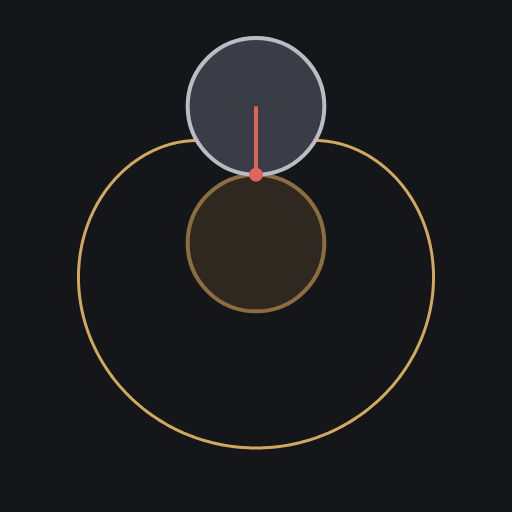
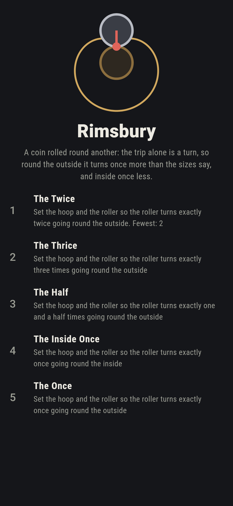
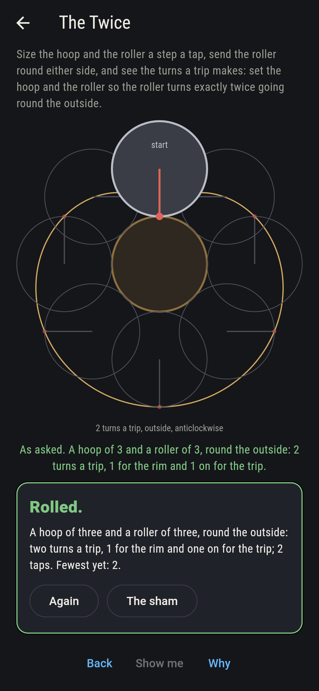
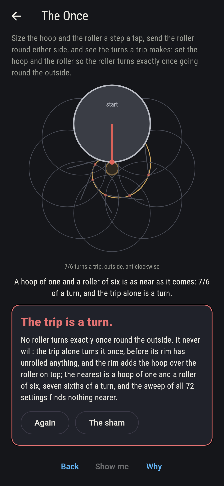
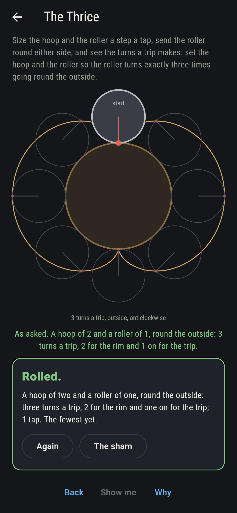
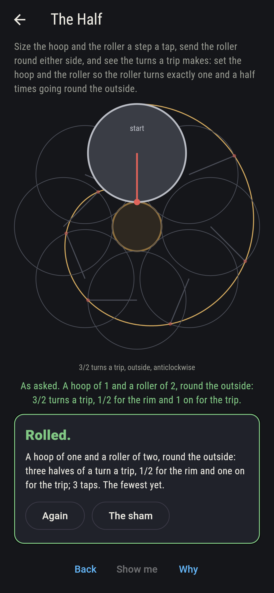
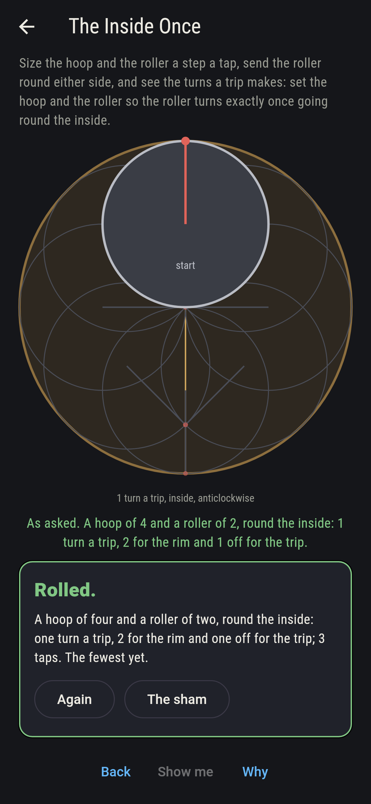
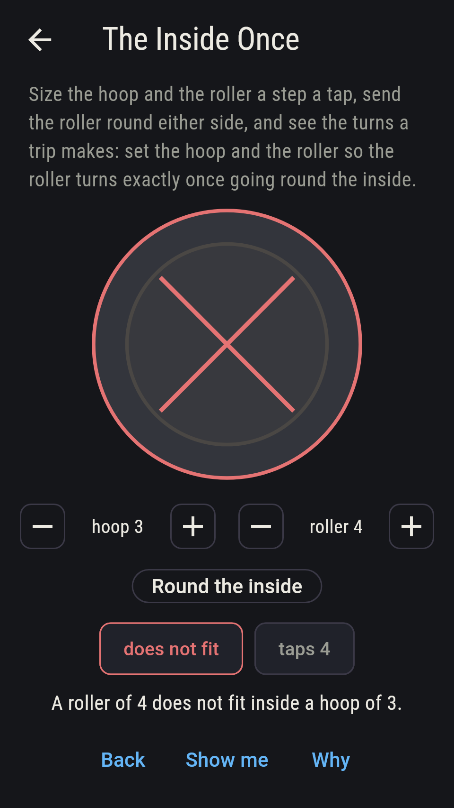
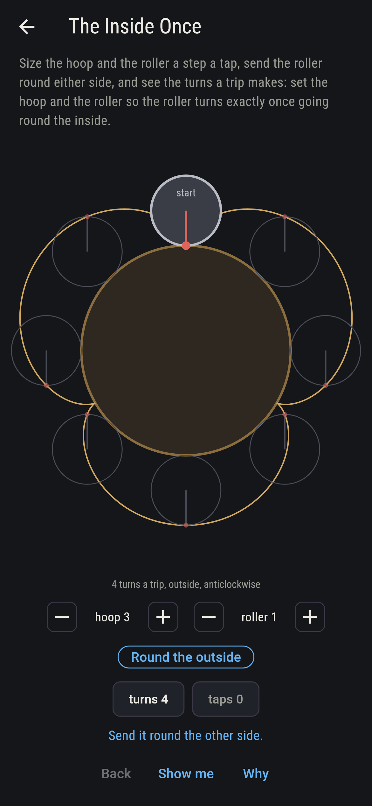
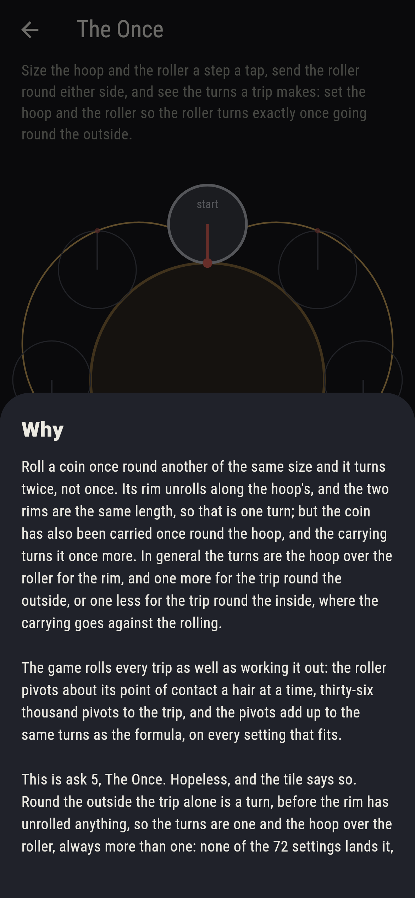

# Rimsbury



A coin rolled round another. Roll a coin once round one of the same
size and it turns twice, not once: its rim unrolls along the hoop's,
the two rims the same length, and that is one turn, but the coin has
also been carried once round the hoop, and the carrying is a turn
more. Size the hoop and the roller a step a tap, one to six each,
send the roller round the outside or the inside, and see the turns a
trip makes: the hoop over the roller for the rim, and one more for
the trip round the outside, or one less for the trip round the
inside, where the carrying goes against the rolling. Every trip that
fits is rolled as well as worked out, the roller pivoting about its
point of contact a hair at a time, thirty-six thousand pivots to
the trip, and the pivots add up to the formula's turns on every
setting; nothing turns exactly once round the outside, since the
trip alone is a turn.

## The asks

1. **The Twice** - set the hoop and the roller so the roller turns exactly twice going round the outside
2. **The Thrice** - set the hoop and the roller so the roller turns exactly three times going round the outside
3. **The Half** - set the hoop and the roller so the roller turns exactly one and a half times going round the outside
4. **The Inside Once** - set the hoop and the roller so the roller turns exactly once going round the inside
5. **The Once** - set the hoop and the roller so the roller turns exactly once going round the outside

Equal coins turn twice, six settings of the 72, and the mark then
draws a heart, the cardioid, that touches the hoop once a trip; a
hoop of twice the roller turns it three times, three settings, the
mark touching the hoop twice a trip; a hoop of half the roller turns
it one and a half times, three settings, and the mark, on the hoop
at the start, is not on it again until the second trip is done and
three turns are made. Inside a hoop of twice the roller the roller
turns once, three settings, and the mark runs dead straight, back
and forth along a diameter of the hoop, off the line by less than a
thousand-millionth at 3,600 points of the trip. The Once is labeled
hopeless on its tile: round the outside the turns are one and the
hoop over the roller, always more than one, and the sham admits it
the moment the player reaches the nearest setting, a hoop of one
and a roller of six, seven sixths of a turn.

## Two voices

The game never asserts what it has not computed, and it computes
everything at least twice:

* **The formula** gives the turns as an exact fraction, hoop plus
  roller over roller outside and hoop less roller over roller inside,
  and the sweep tries it on every setting of the two dials round both
  sides, 72 settings, 21 of them with the roller too big for the
  inside; every count on the sham is the sweep's, and the nearest to
  once, the touches of the mark and the diameter it runs are all
  found by it.
* **The roll** is the second voice: the roller pivots about its point
  of contact a small angle at a time, which is what rolling without
  slipping is, its centre set back onto its ring after each pivot,
  until the centre has gone once round, and the pivots add up to the
  turns; on every one of the 51 settings that fit the roll and the
  formula agree to within two millionths of a turn.

`tool/check_rolls.dart` runs the lot and refuses the bake on any
disagreement.

## The checker's ledger

What `dart run tool/check_rolls.dart` printed for the build this
README shipped with, word for word:

```
every setting of the hoop and the roller swept, one to six each, round the outside and round the inside, 72 settings, the roller too big for the inside in 21 of them; every trip that fits, 51, rolled in 36,000 pivots about the point of contact, and the turns rolled agree with the formula, hoop plus roller over roller outside and hoop less roller over roller inside, to within 2 millionths of a turn on every one: equal coins turn twice, 6 settings; a hoop of twice the roller turns it three times outside and once inside, 3 settings each; a hoop of half the roller turns it one and a half times, 3 settings; inside a hoop of twice the roller the mark runs the whole diameter, off the line by less than a thousand-millionth at 3,600 points, and round an equal hoop it draws a heart that touches the hoop once a trip; and nothing turns exactly once round the outside, the trip alone being a turn, the nearest a hoop of one and a roller of six at 7/6 of a turn

 1 The Twice       set the hoop and the roller so the roller turns exactly twice going round the outside: 6 of the 72 settings land it
 2 The Thrice      set the hoop and the roller so the roller turns exactly three times going round the outside: 3 of the 72 settings land it
 3 The Half        set the hoop and the roller so the roller turns exactly one and a half times going round the outside: 3 of the 72 settings land it
 4 The Inside Once set the hoop and the roller so the roller turns exactly once going round the inside: 3 of the 72 settings land it
 5 The Once        set the hoop and the roller so the roller turns exactly once going round the outside: none of the 72, and the trip said so first
```

## Screenshots

| The sham | The twice | The once admitted |
| --- | --- | --- |
|  |  |  |

| The thrice | The half | The inside once | A misfit, on the small phone | Show me | The why |
| --- | --- | --- | --- | --- | --- |
|  |  |  |  |  |  |

Screenshots are drawn by `test/showcase_test.dart` at real phone
sizes with the app's own painter, then copied into `docs/` as they
came out; every roll in them was set up by taps, so nothing pictured
is a setting the game could not reach. The logo and every launcher
icon come out of `test/mark_test.dart` the same way: the mark is the
equal coins, the roller's mark drawing the heart.

## Building

```
flutter test          # 46 tests, the sweep among them
dart run tool/check_rolls.dart
flutter build apk     # or: flutter build ios
```
