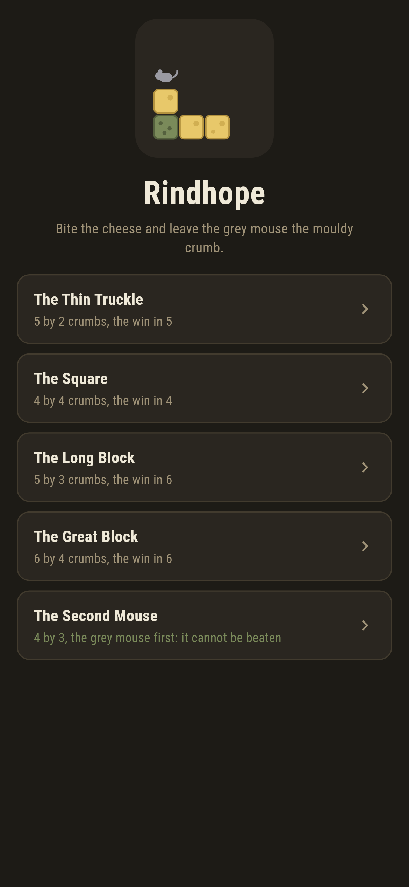
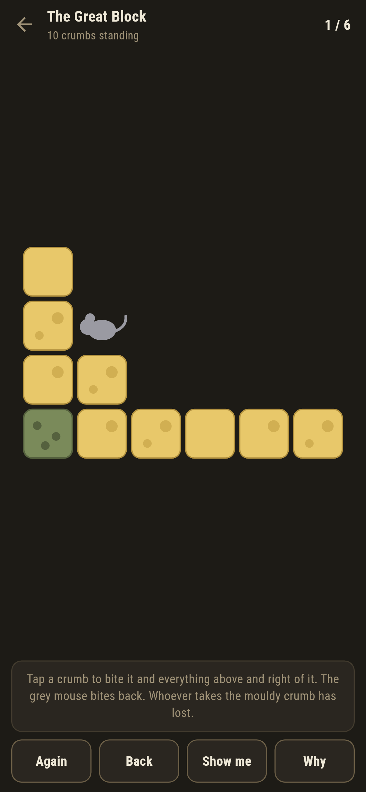
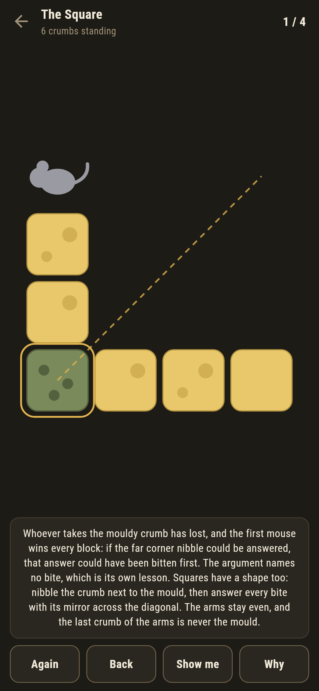
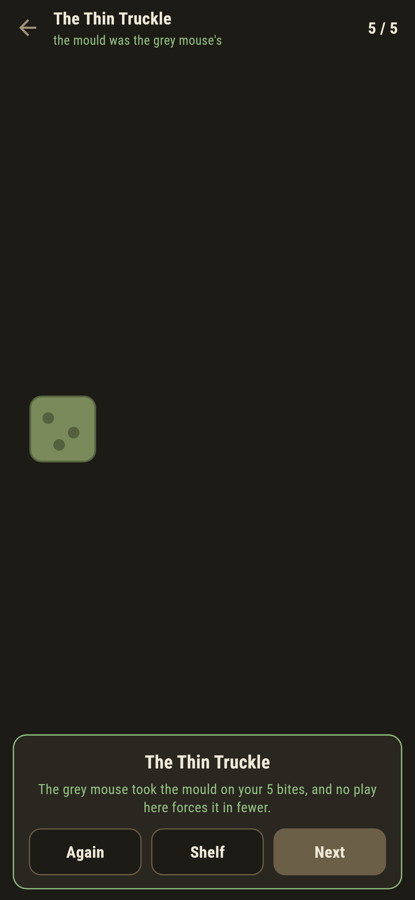
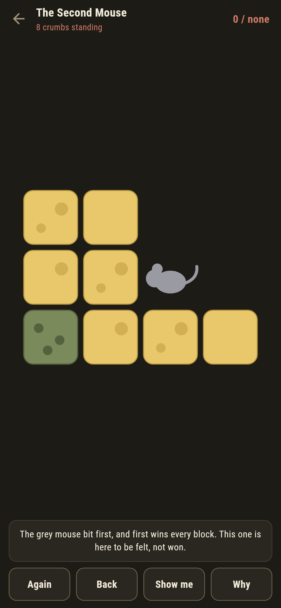

# Rindhope

A cheese-nibbling game for phones, in Flutter, for Android and iOS.

A block of cheese, and the crumb in the bottom-left corner has gone
mouldy. A bite takes a crumb and everything above and to the right of it
in one square mouthful. You and the grey mouse bite in turn, and whoever
ends up taking the mouldy crumb has lost.

| | | | |
|---|---|---|---|
|  |  |  |  |

## The first mouse wins, and the proof will not say how

This is Chomp, and it carries the strangest theorem on the shelf. The
first mouse wins every block bigger than the mouldy crumb alone, and the
argument is one sentence: if the far-corner nibble had a winning answer,
the first mouse could have bitten that answer's shape directly instead,
because biting after the nibble lands exactly where biting the whole
block lands. So a winning first bite exists. Which one? The argument has
no idea.

The suite makes the argument run: it checks the biting-after-equals-
biting-directly identity on every bite of every block to six by six, and
it proves the theorem the only way anything can, by searching every block
to seven by seven:

```
$ make blocks
the first mouse wins every whole block to seven by seven: 48 blocks

 1 The Thin Truckle 5x2  fewest 5  written down 5
 2 The Square       4x4  fewest 4  written down 4
 3 The Long Block   5x3  fewest 6  written down 6
 4 The Great Block  6x4  fewest 6  written down 6
 5 The Second Mouse 4x3  the grey mouse first  cannot be won  written down none
```

## Two blocks have a shape you can hold

On the square, nibble the crumb next to the mould and answer every bite
with its mirror across the diagonal: the arms stay even and the last
crumb of the arms is never the mould. On the two-row strip, hand back a
block whose bottom row is exactly one crumb longer than its top, every
time. The suite plays both strategies against random mice and against the
search's own best resistance, and they never lose; **Why** draws the
mirror line on the square in front of you.


The Long Block is the honest counterpoint: no mirror, no strip, no shape
anyone has ever named. The first mouse still wins it, the theorem says
so, but the opening came out of the search, not out of the proof, and
**Why** says exactly that.

## The grey mouse knows

Bite wrong once and the grey mouse has the block: the ledger goes red the
moment its answer lands, the words under the shelf offer the bite back,
and every par above is the fewest bites that force the win against its
most stubborn delaying. One block gives the grey mouse the first bite,
and ships labelled with what that means: first wins every block, and this
time first is not you.



## Building

```
make deps    # fetch packages
make check   # analyze + every test
make blocks  # prove the theorem block by block, walk the shipped blocks
make shots   # render the screenshots and redraw the icons
make apk     # Android release build
make ios     # iOS release build (unsigned)
```

The logo and every app icon are drawn by the game's own painter in
`test/mark_test.dart`. There is no image in this repository that was not
produced by code in it.

## How it is put together

```
lib/cheese/block.dart    a block: crumbs, who bites first, the answer
lib/cheese/fewest.dart   the search, the steal, the mirror, the strip
lib/cheese/blocks.dart   the five blocks that ship
lib/cheese/play.dart     a block in play: bites, answers, the live win
lib/ui/                  the painter, the screens, the mark
tool/check_blocks.dart   the ledger above
```

The tests run the stealing identity on every bite of every block to six
by six, prove the theorem by search to seven by seven, play the mirror
and the strip against everything, hold every par against best resistance,
and hold the pictures against the real widget tree. If any of that
drifts, `make check` goes red before anything leaves the machine.
