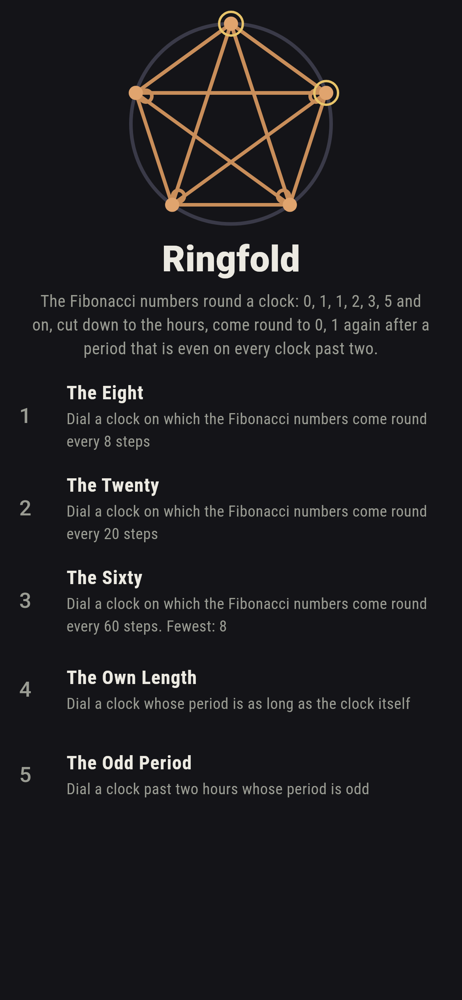
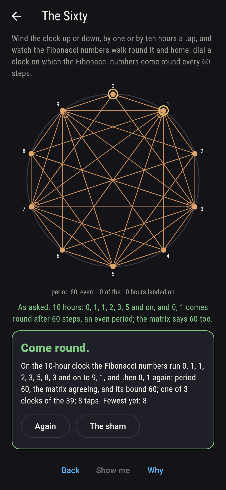
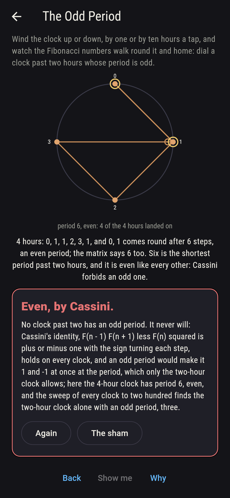
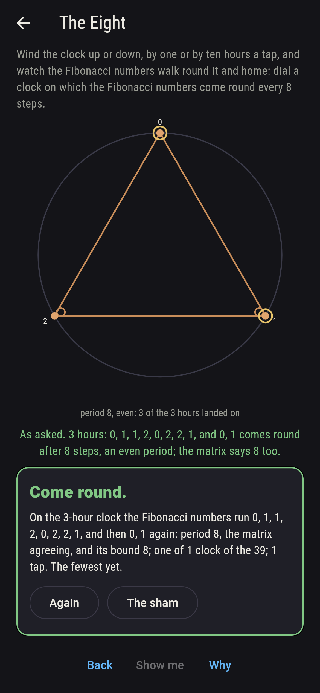
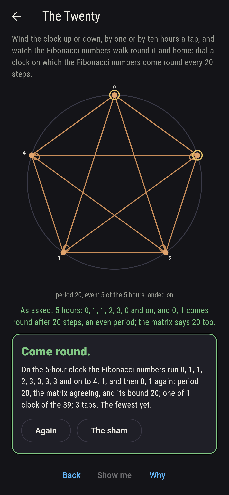
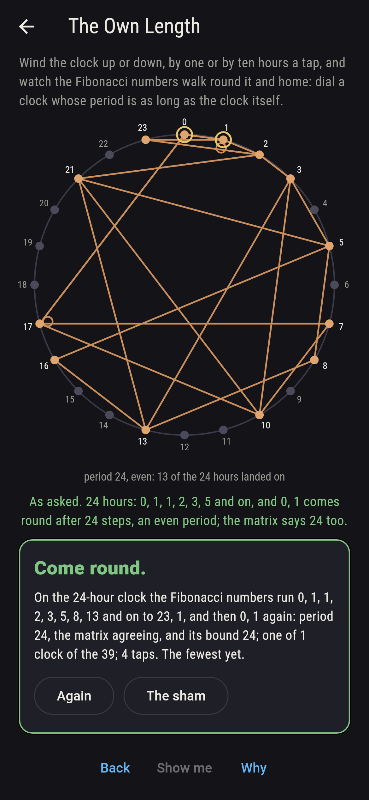
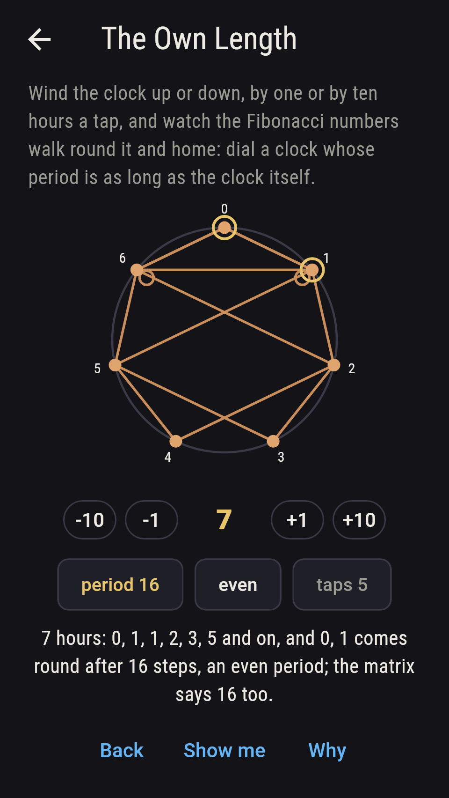
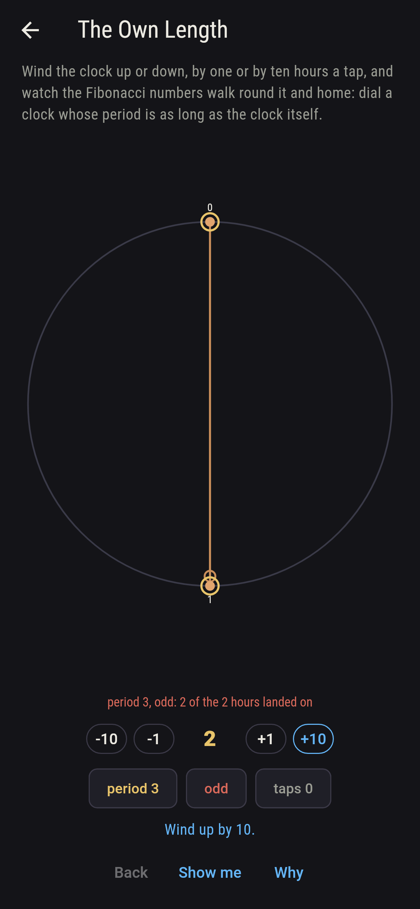
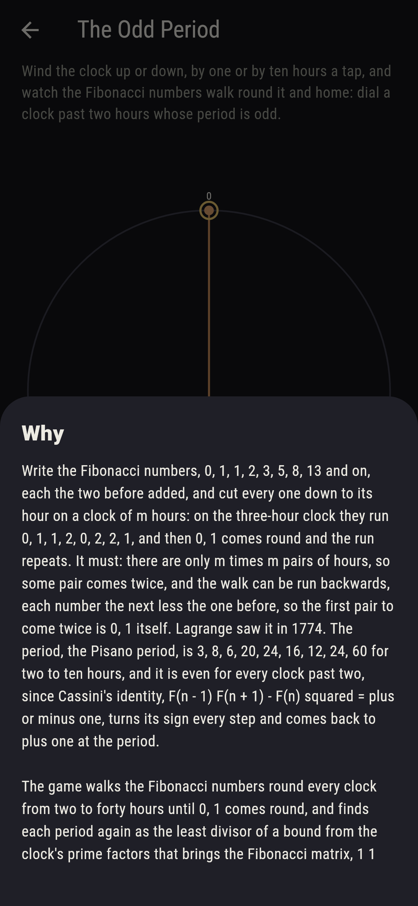

# Ringfold


Write the Fibonacci numbers, 0, 1, 1, 2, 3, 5, 8, 13 and on, each the
two before added, and cut every one down to its hour on a clock of m
hours: on the three-hour clock they run 0, 1, 1, 2, 0, 2, 2, 1, and
then 0, 1 comes round and the run repeats. It must: there are only m
times m pairs of hours, so some pair comes twice, and the walk can be
run backwards, each number the next less the one before, so the
first pair to come twice is 0, 1 itself. Lagrange saw it in 1774. The
period, the Pisano period, is 3, 8, 6, 20, 24, 16, 12, 24, 60 for
two to ten hours, and it is even for every clock past two, since
Cassini's identity, F(n - 1) F(n + 1) - F(n) squared = plus or minus
one, turns its sign every step and comes back to plus one at the
period. Wind the clock up or down and watch the Fibonacci numbers
walk round it and home. The game walks every clock from two to forty
hours until 0, 1 comes round, and finds each period again as the
least divisor of a bound from the clock's prime factors that brings
the Fibonacci matrix, 1 1 over 1 0, back to the identity by squaring;
the two agree on all 39, and to two hundred hours besides, and
Cassini holds on every one.

## The asks

1. **The Eight** - dial a clock on which the Fibonacci numbers come round every 8 steps
2. **The Twenty** - dial a clock on which the Fibonacci numbers come round every 20 steps
3. **The Sixty** - dial a clock on which the Fibonacci numbers come round every 60 steps
4. **The Own Length** - dial a clock whose period is as long as the clock itself
5. **The Odd Period** - dial a clock past two hours whose period is odd

The three-hour clock alone has eight, and the five-hour alone twenty,
0, 1, 1, 2, 3, 0, 3, 3, 1, 4, 0, 4, 4, 3, 2, 0, 2, 2, 4, 1, a nought
every five steps. The last digit of the Fibonacci numbers comes round
every sixty, the ten-hour clock's period, and the twenty-hour and
forty-hour clocks have sixty too, three of the 39; the thirty-hour
has 120, the longest on the dial. The twenty-four-hour clock is the
one clock on the dial whose period is its own length, and the next is
a hundred and twenty. The Odd Period is labeled hopeless on its tile:
Cassini's identity comes back to plus one at the period, so the
period is even on every clock past two, six on the four-hour clock
the shortest; the sham admits it on the four-hour clock, or after
twelve taps.

## Two voices

The game never asserts what it has not computed, and it computes
everything at least twice:

* **The walk** runs the Fibonacci numbers round the clock pair by
  pair until 0, 1 comes again, and its length is the period; every
  period on the sham is that walk's, and on every clock the walk is
  checked to add up step by step and to come home to 0, 1, and
  Cassini's identity is checked round the whole cycle.
* **The matrix** walks nothing: a bound is read off the clock's prime
  factors, p - 1 for a prime ending 1 or 9, twice p + 1 for one
  ending 3 or 7, 20 for 5, 3 for 2, each power of p multiplying by p,
  and the period is the least divisor of the bound that brings the
  Fibonacci matrix back to the identity by squaring; it agrees with
  the walk on every clock to two hundred, and from the sweep the
  two-hour clock alone has an odd period, and 24 and 120 alone a
  period their own length.

`tool/check_periods.dart` runs the lot and refuses the bake on any
disagreement.

## The checker's ledger

What `dart run tool/check_periods.dart` printed for the build this
README shipped with, word for word:

```
the Fibonacci numbers walked round every clock from two to two hundred hours until 0, 1 came round, and each period found again as the least divisor of the bound from the clock's prime factors that brings the Fibonacci matrix back to the identity, the two agreeing on all 199 clocks and Cassini's identity holding on every one; the periods run 3, 8, 6, 20, 24, 16, 12, 24, 60 for two to ten hours, 120 for thirty, the longest on the dial, and 300 for fifty; the two-hour clock alone has an odd period, and every clock from three to two hundred an even one, six on the four-hour clock the shortest; twenty-four and a hundred and twenty are the clocks whose period is their own length; on the dial, two to forty hours, 39 clocks, three has eight, five twenty, ten, twenty and forty sixty, and twenty-four twenty-four

 1 The Eight      dial a clock on which the Fibonacci numbers come round every 8 steps: 1 of the 39 clocks lands it
 2 The Twenty     dial a clock on which the Fibonacci numbers come round every 20 steps: 1 of the 39 clocks lands it
 3 The Sixty      dial a clock on which the Fibonacci numbers come round every 60 steps: 3 of the 39 clocks land it
 4 The Own Length dial a clock whose period is as long as the clock itself: 1 of the 39 clocks lands it
 5 The Odd Period dial a clock past two hours whose period is odd: none of the 39, and Cassini said so first
```

## Screenshots

| The sham | The sixty | The odd period admitted |
| --- | --- | --- |
|  |  |  |

| The eight | The twenty | The own length | Midway, on the small phone | Show me | The why |
| --- | --- | --- | --- | --- | --- |
|  |  |  |  |  |  |

Screenshots are drawn by `test/showcase_test.dart` at real phone
sizes with the app's own painter, then copied into `docs/` as they
came out; every clock in them was wound to by taps, so nothing
pictured is a clock the game could not reach. The logo and every
launcher icon come out of `test/mark_test.dart` the same way: the
mark is the Fibonacci numbers walked round the five-hour clock,
twenty steps and home.

## Building

```
flutter test          # 43 tests, the sweep among them
dart run tool/check_periods.dart
flutter build apk     # or: flutter build ios
```
