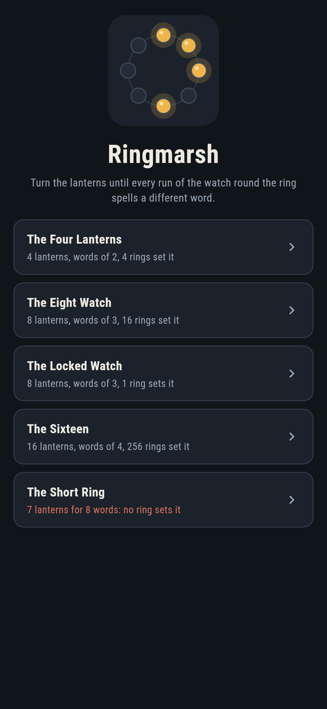
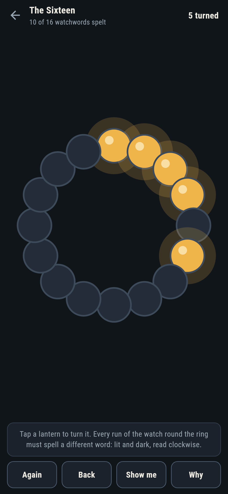
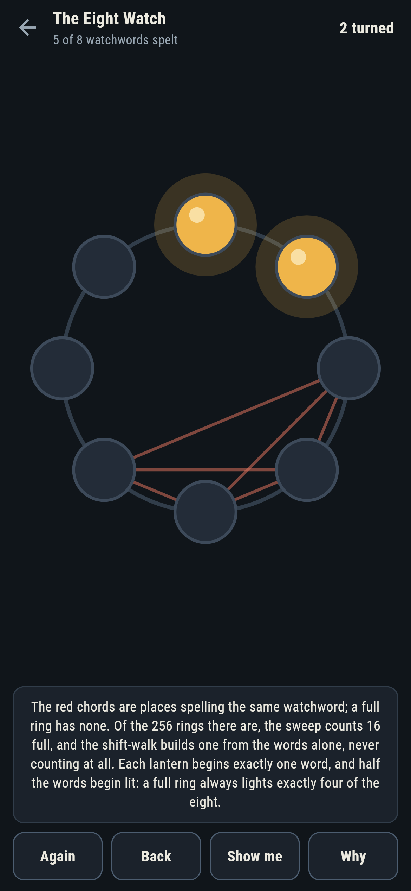
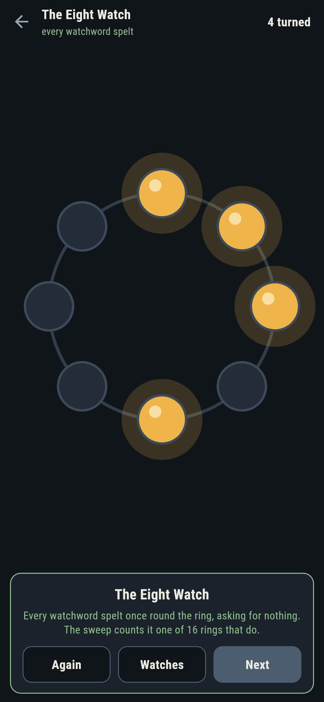
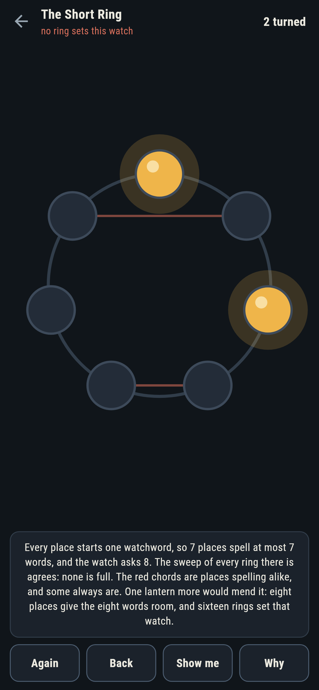
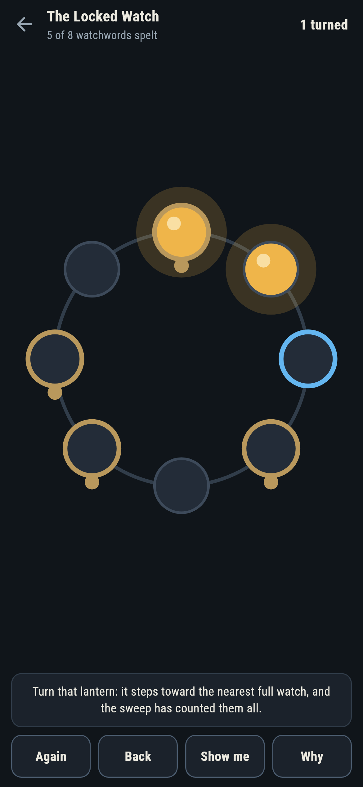

# Ringmarsh

A lantern-ring puzzle for phones, in Flutter, for Android and iOS.

Lanterns round a marsh road, lit or dark. Every run of the watch,
read clockwise from each lantern, spells a word of lit and dark;
set the ring so that every place spells a different one. At the
right length that is every word there is, once each, round one
circle: the old de Bruijn rings, set by hand.

| | | | |
|---|---|---|---|
|  |  |  |  |

## Two ways of knowing

The suite knows the rings two ways that share nothing. A sweep tries
every ring of lanterns there is and counts the full ones: 4 of 16, 16
of 256, 256 of 65,536, sizes the books agree with. The shift-walk
never counts: it takes every word of one fewer lanterns as a corner
and every word as a road, finds each corner with two roads in and two
out, and walks one round trip crossing every road once. Reading the
trip is a full ring, and the checker builds one for every span that
ships and holds it against the sweep.

```
$ make watches
 1 The Four Lanterns words of 2 round 4  4 of 16 rings set it
 2 The Eight Watch  words of 3 round 8  16 of 256 rings set it
 3 The Locked Watch words of 3 round 8  1 of 256 rings set it  (four lanterns held)
 4 The Sixteen      words of 4 round 16  256 of 65536 rings set it
 5 The Short Ring   words of 3 round 7  no ring of 128 sets it

the short ring is short the counting way too: seven places spell at most seven words and the watch asks eight
```

## The short ring

Seven lanterns for eight words: every place begins one word, so seven
places spell at most seven, and the watch asks eight. It ships in the
house tradition of maps nobody can win, the counting on its label and
the sweep of all 128 rings behind it. **Why** chords the places
spelling alike in red, and on this ring some always do.



## The locked watch

Four lanterns held fast, and of the sixteen rings that set the eight
watch, exactly one honours them: the free four have one right answer,
and the sweep says so. The live count of spelt words updates at every
turn, a turn that steps away from the nearest full ring is called out
as it lands, and **Show me** points along the sweep's own count.



## Building

```
make deps     # fetch packages
make check    # analyze + every test
make watches  # sweep every ring, run the shift-walk, print the ledger
make shots    # render the screenshots and redraw the icons
make apk      # Android release build
make ios      # iOS release build (unsigned)
```

The logo and every app icon are drawn by the game's own painter in
`test/mark_test.dart`. There is no image in this repository that was not
produced by code in it.

## How it is put together

```
lib/ring/rules.dart      words, clashes, the sweep, the shift-walk
lib/ring/watch.dart      a watch: span, length, locks, its count
lib/ring/watches.dart    the five watches that ship
lib/ring/play.dart       a ring being set: turns, take-back, the
                         nearest full watch
lib/ui/                  the painter, the screens, the mark
tool/check_watches.dart  the sweeps, the walks, the ledger above
```

The tests read words round the end by hand, hold the sweep to the
book counts, build shift-walk rings for every span, pin the
four-lit-lanterns fact on all sixteen full eight-rings, watch the
short ring stay short over all 128, set every winnable watch by
following the game's own pointer, and hold the pictures against the
real widget tree. If any of that drifts, `make check` goes red before
anything leaves the machine.
