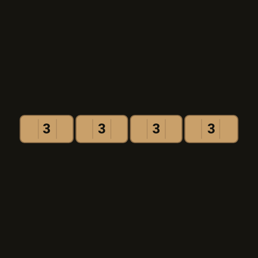
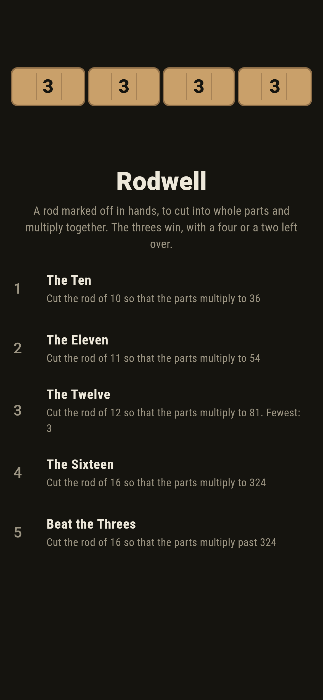
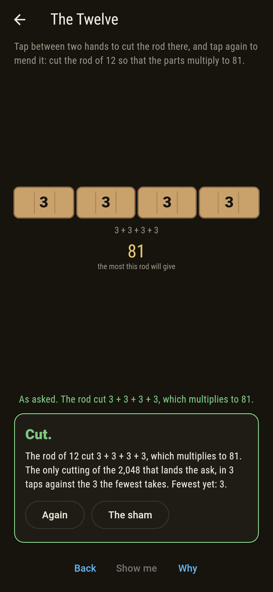
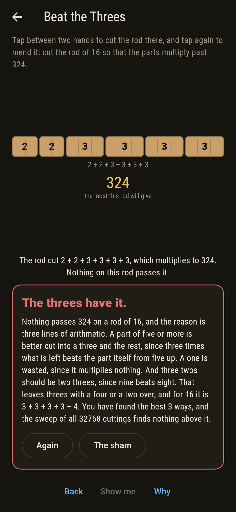
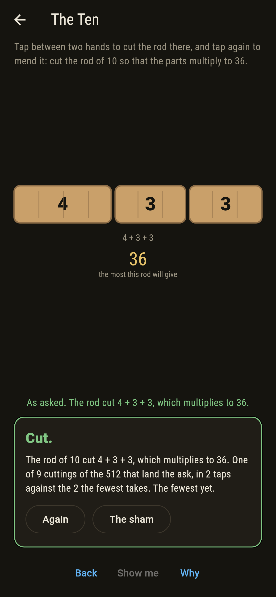
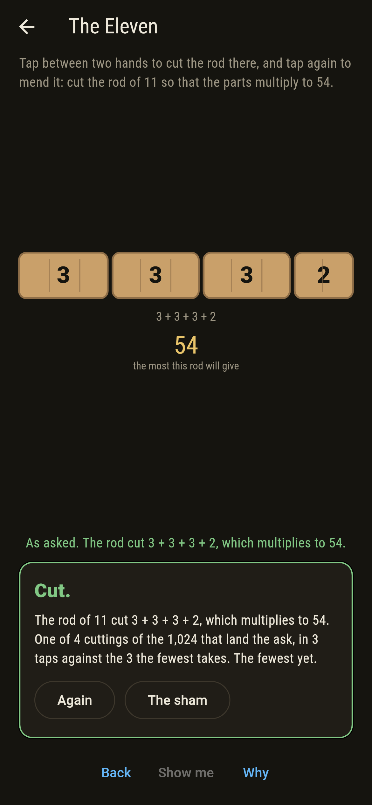
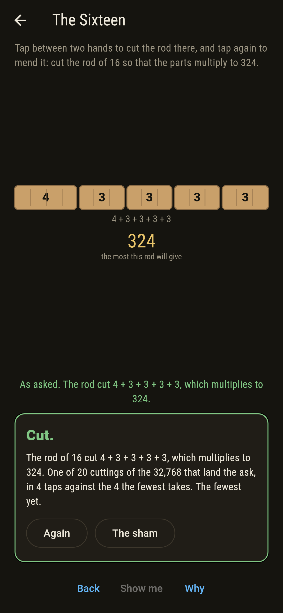
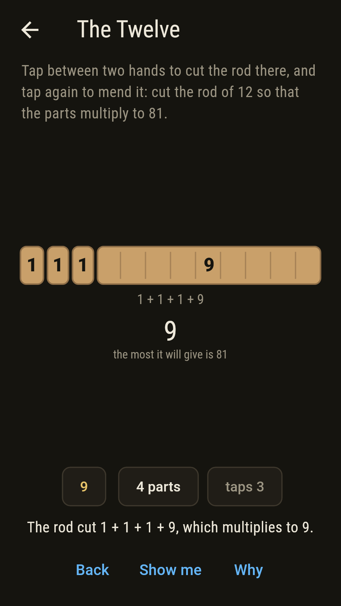
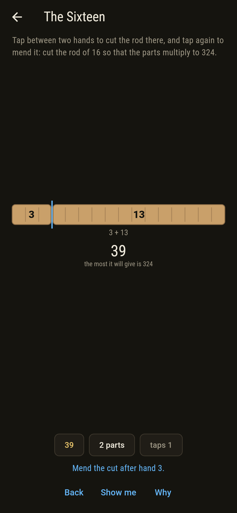
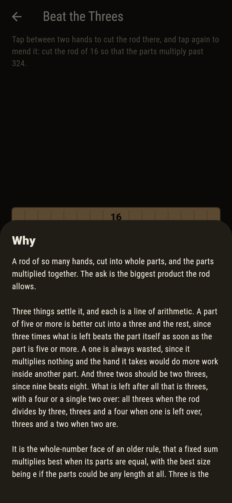

# Rodwell



A rod marked off in hands, to be cut into whole parts and the parts
multiplied together. The ask is the biggest product the rod allows,
and the answer is always threes. Three things settle it, each a line
of arithmetic. A part of five or more is better cut into a three and
the rest, since three times what is left beats the part itself from
five up. A one is wasted, since it multiplies nothing and the hand it
takes would do more work inside another part. And three twos should be
two threes, since nine beats eight. What survives is threes with a
four or a single two over: all threes when the rod divides by three,
threes and a four when one is left, threes and a two when two are. It
is the whole-number face of the old rule that a fixed sum multiplies
best when its parts are equal, with e as the size the parts would take
if they could be any length at all. Three is the whole number nearest
it.

## The asks

1. **The Ten** - cut the rod of 10 so that the parts multiply to 36
2. **The Eleven** - cut the rod of 11 so that the parts multiply to 54
3. **The Twelve** - cut the rod of 12 so that the parts multiply to 81
4. **The Sixteen** - cut the rod of 16 so that the parts multiply to 324
5. **Beat the Threes** - cut the rod of 16 so that the parts multiply past 324

Ten cuts to 36 at best, and nine of its 512 cuttings reach it: three
laying a four beside two threes, six laying two twos beside two
threes, since a four and a pair of twos come to the same. Eleven
leaves two over and takes it as a part of its own, 54 from four parts,
which four cuttings of the 1,024 manage. Twelve divides by three
exactly, so there is one best cutting and only one: four threes, 81,
one of 2,048. Sixteen leaves one over, and a lone one would be wasted,
so it goes in with a three to make a four: 324, reached by twenty of
the 32,768 cuttings, five with the four and fifteen with the twos.
Beat the Threes wants more than 324 from the same rod of sixteen, and
nothing gives it. The sham admits it once three of the best cuttings
have been found, or after sixteen taps.

## Two voices

Every number the game says out loud was worked out here rather than
guessed, and the best cutting of each rod is found three ways:

* **By cutting.** Every cutting of the rod is tried and the products
  compared, which for a rod of sixteen hands is 32,768 of them. That
  is what the board counts as you cut, and what the ask's ways are
  counted over.
* **By the rule of threes.** Threes with a four or a two over, from
  the rod's remainder on three, which cuts nothing at all.
* **By working up.** Each rod is cut once in every place and the rest
  looked up from the shorter rods already done, which is neither the
  sweep nor the rule.

The three agree on every rod from two hands to twenty. The checker
also bears out the three lines the rule rests on: three times what is
left beats a part of five or more, nine beats eight, and a four is the
same as two twos. Every product is an exact whole number, so nothing
rounds.

`tool/check_cuts.dart` runs the lot and refuses the bake on any
disagreement.

## The checker's ledger

What `dart run tool/check_cuts.dart` printed for the build this README
shipped with, word for word:

```
every rod from 2 hands to 20 taken and the biggest product found three ways: by cutting the rod every way there is, which is 65,534 cuttings over the rods of sixteen hands and under; by the rule of threes, which cuts nothing at all; and by working up from the short rods, each one cut once with the rest looked up. The three agree on every rod; the best cutting is nothing but threes with a four or a two over, and the sweep bears out the three lines it rests on: three times what is left beats a part of five or more, nine beats eight so three twos should be two threes, and a four is the same as two twos; the rods and their best: 2 to 2, 3 to 3, 4 to 4, 5 to 6, 6 to 9, 7 to 12, 8 to 18, 9 to 27, 10 to 36, 11 to 54, 12 to 81, 13 to 108, 14 to 162, 15 to 243, 16 to 324, 17 to 486, 18 to 729, 19 to 972, 20 to 1,458

 1 The Ten         cut the rod of 10 so that the parts multiply to 36: 9 of the 512 cuttings land it, the fewest in 2 cuts
 2 The Eleven      cut the rod of 11 so that the parts multiply to 54: 4 of the 1,024 cuttings land it, the fewest in 3 cuts
 3 The Twelve      cut the rod of 12 so that the parts multiply to 81: 1 of the 2,048 cuttings lands it, the fewest in 3 cuts
 4 The Sixteen     cut the rod of 16 so that the parts multiply to 324: 20 of the 32,768 cuttings land it, the fewest in 4 cuts
 5 Beat the Threes cut the rod of 16 so that the parts multiply past 324: none of the 32,768, and the threes say why
```

## Screenshots

| The sham | The twelve | Beat the threes |
| --- | --- | --- |
|  |  |  |

| The ten | The eleven | The sixteen | A rod cut badly, on the small phone | Show me | The why |
| --- | --- | --- | --- | --- | --- |
|  |  |  |  |  |  |

Screenshots are drawn by `test/showcase_test.dart` at real phone sizes
with the app's own painter, then copied into `docs/` as they came out.
On the board shots every cut was made by a tap between two hands, so no
cutting pictured is one the game could not reach. The logo and every
launcher icon come out of `test/mark_test.dart`, drawn by the same
painter: the mark is the rod of twelve cut into four threes, the one
cutting of the 2,048 that reaches 81, and it stands there with no taps
behind it.

## Building

```
flutter test          # 41 tests, the sweep among them
dart run tool/check_cuts.dart
flutter build apk     # or: flutter build ios
```
