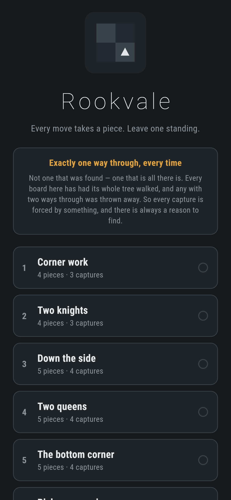
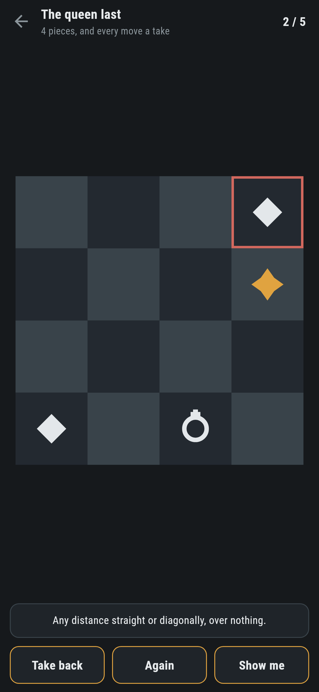
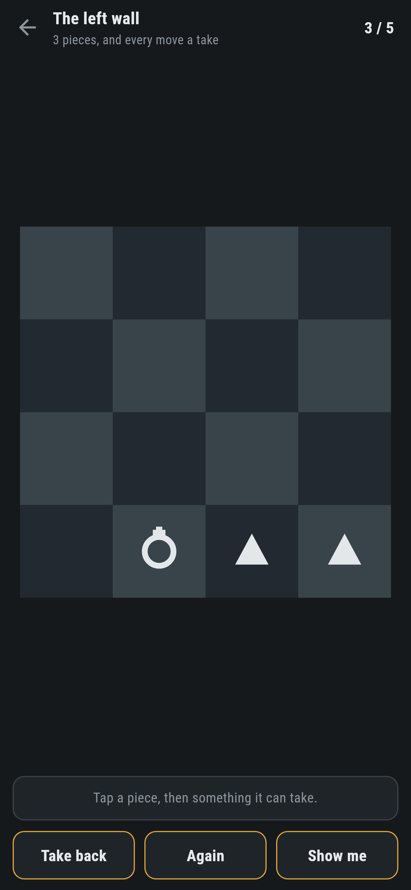
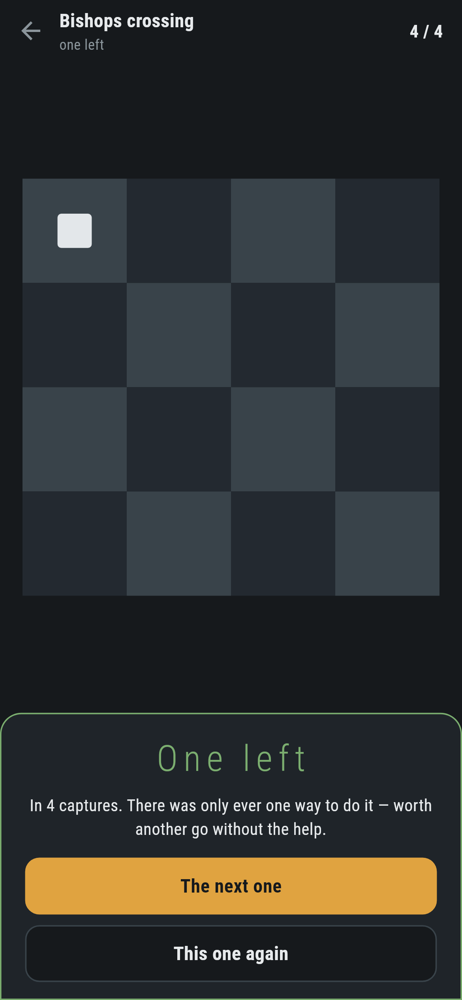
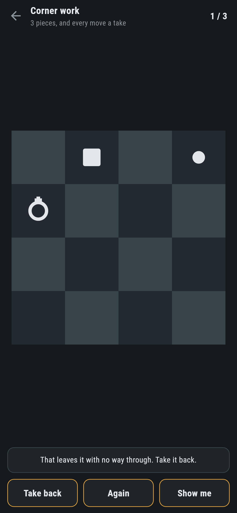

# Rookvale

A chess puzzle for phones, in Flutter, for Android and iOS.

A handful of pieces on a small board, all of them yours. Every move has to be
a capture, and you have finished when one piece is left standing. There is
exactly one way to do it.

| | | | |
|---|---|---|---|
|  |  |  |  |

## Exactly one way through

Not a way that was found: the only one there is. `test/board_test.dart`
walks the whole tree of every board that ships and fails if there are two:

```dart
final ways = waysThrough(puzzle.board);
expect(ways.count, 1, reason: '${puzzle.name} has ${ways.count} ways through');
```

That is the difference between a puzzle and an exercise. With one way through,
every capture is forced by something, and there is always a reason to find. It
also means the game can tell you the moment you have gone wrong, not by
guessing but by walking the tree from where you are standing:

> That leaves it with no way through. Take it back.



The whole tree is small enough to walk every time, and that is not luck: every
move takes a piece off the board, so no line of play can be longer than the
number of pieces and no position can ever come round again. There is nothing
to prune and nothing to guard against.

## Finding them is nearly all throwing them away

`make find` scatters pieces and keeps the boards with exactly one way through.
Nearly everything it makes has none or a dozen:

```
$ make find
--- one way through, 5 pieces, 51 positions looked at ---
  BK..
  ..B.
  .R.N
  ....
  6>11 11>1 9>1 1>0

kept 6 of 112
```

What the tool cannot judge is whether the one way through is a way anybody
would enjoy finding, so it prints the board and the line and somebody looks at
it. `make puzzles` then walks all ten that ship:

```
 1 Corner work     4 pieces  1 way through  5 first moves    15 positions  4>1 0>1 1>3
 6 Bishops crossing 5 pieces 1 way through  7 first moves    51 positions  6>11 11>1 9>1 1>0
10 The queen last  6 pieces  1 way through  6 first moves   102 positions  1>5 5>7 7>3 3>12 12>14
```

The count of first moves matters as much as the count of ways: one way through
and one move available is not a puzzle, it is a corridor. A test insists on
more than two.

## Shape, not colour, and not letters


Every piece is the same colour, because they are all yours, so the only thing
telling a bishop from a rook is its shape. Six of them, chosen to be different
at a glance and at a quarter of an inch: a disc, a triangle, a diamond, a
square, a square with its corners out, and a ring with a cross on it. Nothing
depends on seeing colour, and nothing depends on reading a letter.

The pawn is the one piece worth saying twice: **up the board is forwards**, and
there is no other direction. A pawn that could take backwards would be a
different piece and half these puzzles would fall apart.

## Running it

```
make deps    # flutter pub get
make test    # everything
make analyze
make shots   # render the screens into build/showcase, redraw the logo
make puzzles # walk every shipped board and count the ways through
make find    # look for new boards with exactly one way through
make apk     # release APK
make ios     # release iOS build, unsigned
```

## Tests

`flutter test` runs how each piece takes (a pawn forwards and only forwards,
a knight two one way and one the other, a king one square anywhere, and the
three sliding pieces taking the first thing on a line and nothing behind it),
then a capture (the taker ends up where it took, and a move that is not a
capture changes nothing), then every puzzle: exactly one way through, as many
captures as it says, a way through that really works when it is played, and
more than two things to try at the start.

Then the game through the screen: picking a piece, the squares it can take on,
the capture, taking one back, the warning when a capture leaves no way
through, and every puzzle solved to the last piece by following what **Show
me** says.

Screenshots come from `test/showcase_test.dart`, and every capture in them was
made by tapping the piece and then what it took. `test/mark_test.dart` draws
the logo and the app icon; there is no image in this repository that was not
produced by it.
