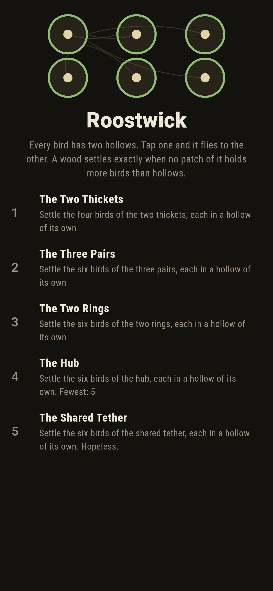
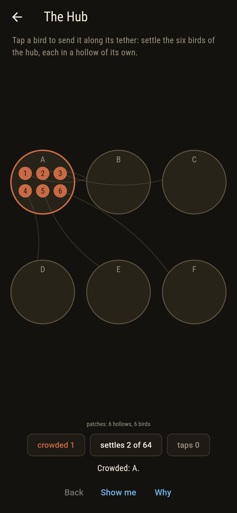
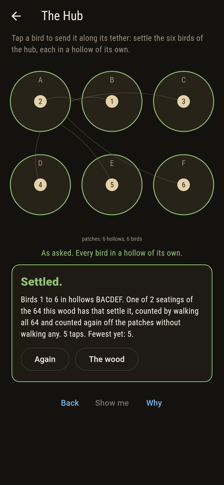
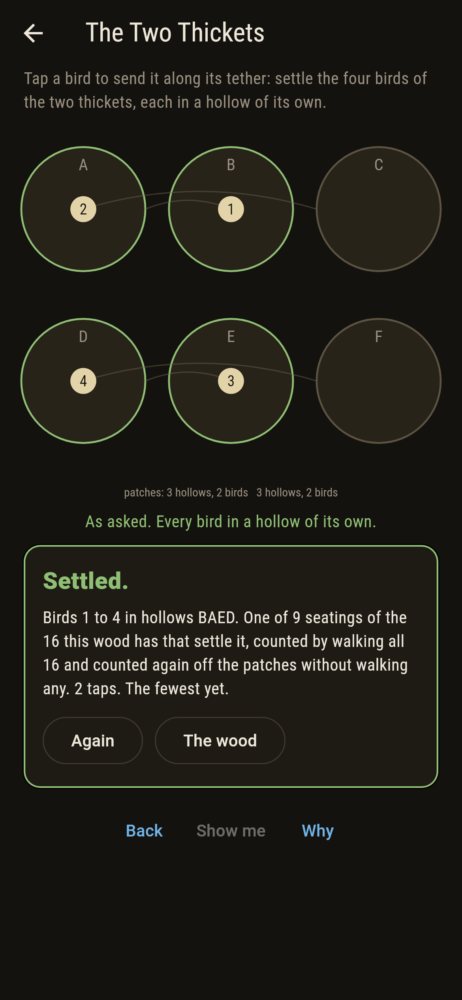
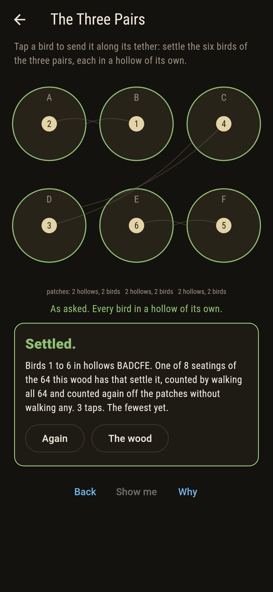
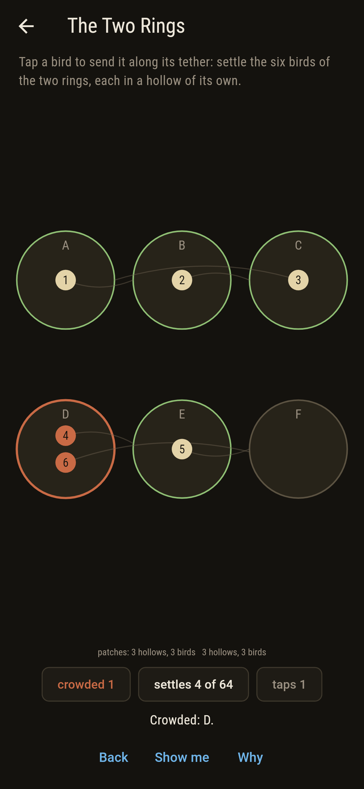
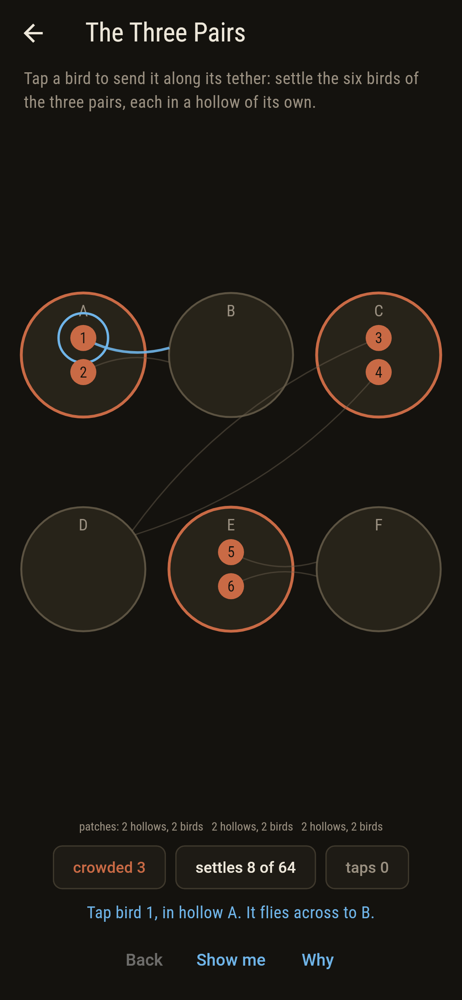
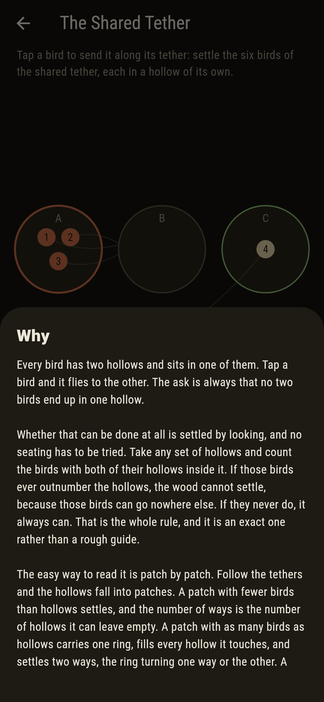
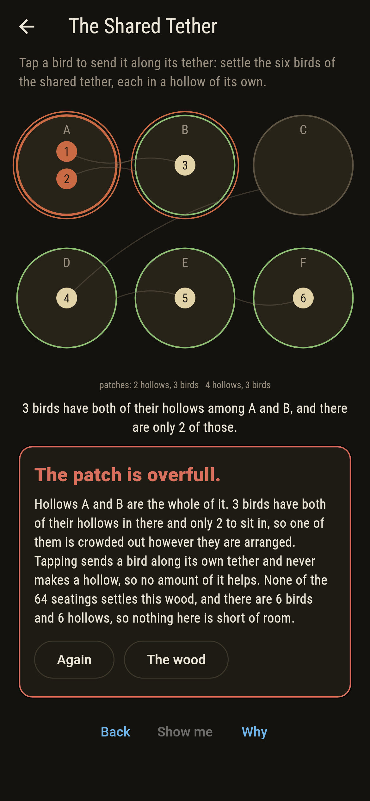

# Roostwick


Six hollows in a bank, and birds tethered between two of them
apiece. A bird sits in one of its two hollows, and tapping it sends
it along its tether to the other. The ask is always the same: every
bird in a hollow of its own. Whether that can be done at all is
settled by looking rather than by trying. Follow the tethers and the
hollows fall into patches, and the wood settles exactly when no
patch holds more birds than hollows. A patch with fewer birds than
hollows settles one way for each hollow it can leave empty. A patch
with as many birds as hollows carries a ring, fills every hollow it
touches, and settles two ways, the ring turning one way or the
other. A patch with more birds than hollows settles no way at all,
and the wood's count is its patches multiplied together. Two
hollows to an item is how cuckoo hashing works, which Pagh and
Rodler published in 2001, and drawing the items as tethers between
their two hollows gives the cuckoo graph; the rule is that graph
read for what it is. Every wood of six hollows and six or fewer
birds is walked before the bake, 12,204,240 of them, counted by
walking all its seatings and counted again off its patches without
walking any.

## The asks

1. **The Two Thickets** - settle the four birds of the two thickets, each in a hollow of its own
2. **The Three Pairs** - settle the six birds of the three pairs, each in a hollow of its own
3. **The Two Rings** - settle the six birds of the two rings, each in a hollow of its own
4. **The Hub** - settle the six birds of the hub, each in a hollow of its own
5. **The Shared Tether** - settle the six birds of the shared tether, each in a hollow of its own

The asks settle 9, 8, 4, 2 and none of their 16, 64, 64, 64 and 64
seatings. Every one of them opens with each bird at the
lower-lettered end of its tether, which settles none of the five and
which the checker holds to be as far from settled as that board ever
gets, so the taps are the whole walk rather than a lucky short one:
2, 3, 2 and 5. The Hub opens with all six birds piled in hollow A
and comes apart in five, the deepest a wood of six hollows goes.
The Shared Tether opens with three birds in hollow A and never comes
apart at all; it is labeled hopeless on its tile, and the patch A B
is the why.

## Two voices

The game never asserts what it has not computed, and it computes
everything at least twice:

* **The walk** takes every one of a board's seatings in turn, a
  reading of which end of its tether each bird is at, and counts the
  ones where no two birds share a hollow. It knows nothing about
  patches and asks nothing about the shape of the wood. Every count
  on the tile and the card is its.
* **The patches** walk no seating at all: the hollows are joined up
  by the tethers, each lot is measured for hollows and birds, and
  the answer is read off as a product, 2 for a patch carrying a ring
  and one per hollow for a patch without. The two agree on every
  board.

Two more voices are asked the yes-or-no half, whether a board
settles at all. One takes each of the 63 sets of hollows in turn and
looks for a set holding more birds than hollows, which is Hall's
condition written out for birds that have two hollows apiece. The
other shoves birds along their tethers to make room, which is the
walk the player does by thumb, and when it fails the set it reached
is the overfull patch, so the card at the end of the hopeless ask
costs nothing to produce.

`tool/check_roosts.dart` runs the lot and refuses the bake on any
disagreement. The count depends on which tethers are used and how
often and not on which bird is on which, so the 12,204,240 woods are
walked as 54,263 boards, each standing for as many woods as there
are ways of dealing its birds out. That collapse is checked rather
than assumed: every ordered wood of four birds or fewer is walked as
well, all 54,240 of them, and each is held against its board.

## The checker's ledger

What `dart run tool/check_roosts.dart` printed for the build this
README shipped with, word for word:

```
every wood of six hollows and six or fewer birds walked, 12,204,240 of them, each bird tethered between two hollows and sitting in one: 5,971,950 settle, meaning every bird gets a hollow to itself; the count of settling seatings depends on which tethers are used and how often and not on which bird is on which, so the woods were walked as 54,263 boards, each standing for as many woods as there are ways of dealing its birds out, and that collapse is checked rather than assumed on all 54,240 ordered woods of four birds or fewer; every board was counted by walking all its seatings and counted again off its patches without walking any, and the two agreed 54,263 times out of 54,263; two further voices were asked whether each board settles at all, one taking all 63 sets of hollows in turn and looking for a set holding more birds than hollows, the other shoving birds along their tethers to make room, and both agreed with the count every time; of the 11,390,625 woods of six birds on six hollows, 6,095,475 settle no way at all even though nothing is short of room, and the rest settle 2, 4 or 8 ways and nothing else: 4,968,000, 325,800 and 1,350 of them; and no seating of any board that settles at all stands more than 5 taps from one that does, a depth 6,480 boards of the 54,263 reach, the fourth ask among them

 1 The Two Thickets  settle the four birds of the two thickets, each in a hollow of its own: 9 of its 16 seatings do it, the nearest 2 taps away
 2 The Three Pairs   settle the six birds of the three pairs, each in a hollow of its own: 8 of its 64 seatings do it, the nearest 3 taps away
 3 The Two Rings     settle the six birds of the two rings, each in a hollow of its own: 4 of its 64 seatings do it, the nearest 2 taps away
 4 The Hub           settle the six birds of the hub, each in a hollow of its own: 2 of its 64 seatings do it, the nearest 5 taps away
 5 The Shared Tether settle the six birds of the shared tether, each in a hollow of its own: none of its 64, and the patch A B said so first
```

## Screenshots

| The wood | The hub, six birds in one hollow | The hub settled |
| --- | --- | --- |
|  |  |  |

| The two thickets | The three pairs | Mid-settling | Show me | The why | The overfull patch |
| --- | --- | --- | --- | --- | --- |
|  |  |  |  |  |  |

Screenshots are drawn by `test/showcase_test.dart` at real phone
sizes with the app's own painter, then copied into `docs/` as they
came out; every bird in them was moved by a tap on a bird, so
nothing pictured is a seating the game could not reach. The logo and
every launcher icon come out of `test/mark_test.dart` the same way:
the mark is the hub settled, six birds in six hollows, with the
doubled tether between A and B turned one way.

## Building

```
flutter test          # 63 tests, the two counts among them
dart run tool/check_roosts.dart
flutter build apk     # or: flutter build ios
```
