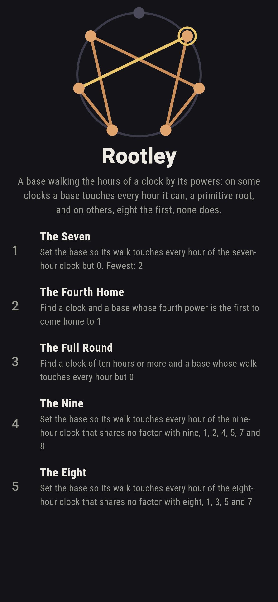
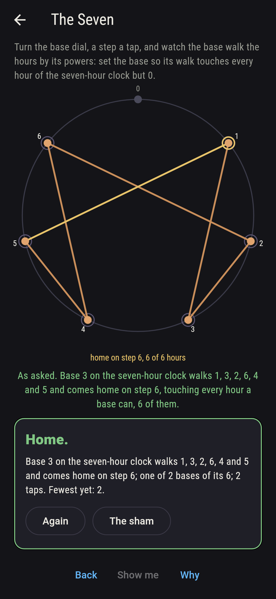
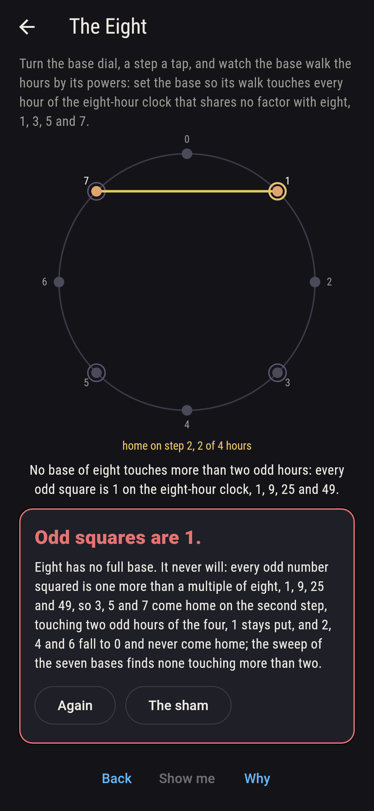
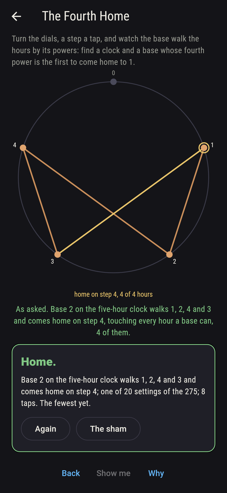
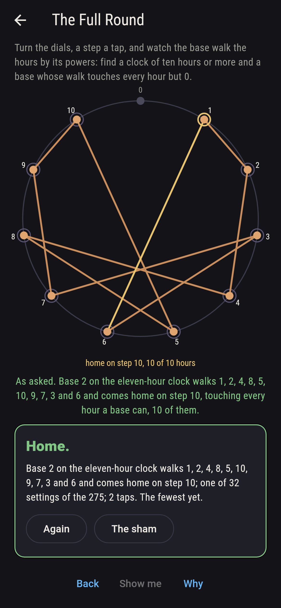
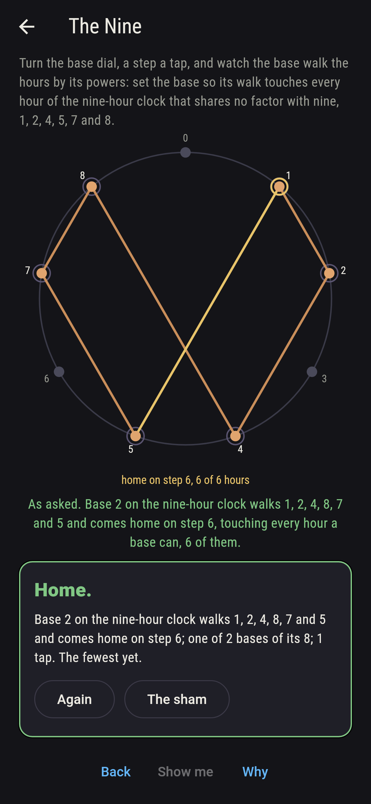
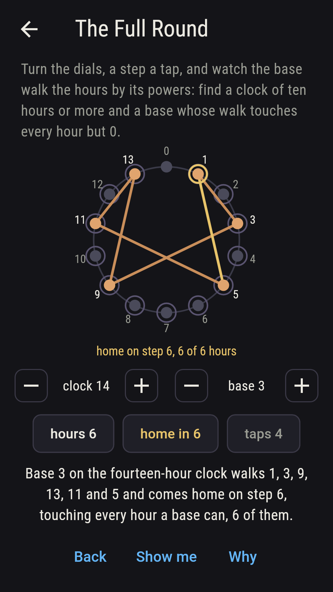
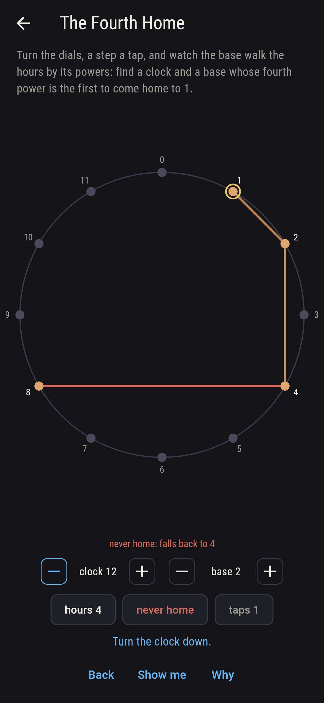
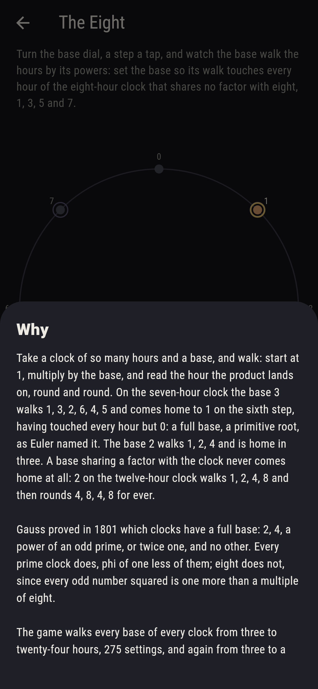

# Rootley


Take a clock of so many hours and a base, and walk: start at 1,
multiply by the base, read the hour the product lands on, and go
round again. On the seven-hour clock the base 3 walks 1, 3, 2, 6, 4,
5 and comes home to 1 on the sixth step, having touched every hour
but 0: a full base, a primitive root as Euler named it. The base 2
walks 1, 2, 4 and is home in three. A base sharing a factor with
the clock never comes home at all: 2 on the twelve-hour clock walks
1, 2, 4, 8 and then rounds 4, 8, 4, 8 for ever. Gauss proved in 1801
which clocks have a full base, 2, 4, a power of an odd prime, or
twice one, and no other; every prime clock does, phi of one less of
them, and eight does not, since every odd number squared is one
more than a multiple of eight. Turn the dials, a step a tap, and
find the base asked. The game walks every base of every clock from
three to twenty-four hours, 275 settings, and again from three to a
hundred, 4,949 walks, and sets each walk against a reckoning that
never walks, Carmichael's lambda from the clock's prime factors and
the base raised to lambda's divisors by squaring; the two agree on
the steps home of every base, and the clocks with a full base are
exactly the ones Gauss's rule names.

## The asks

1. **The Seven** - set the base so its walk touches every hour of the seven-hour clock but 0
2. **The Fourth Home** - find a clock and a base whose fourth power is the first to come home to 1
3. **The Full Round** - find a clock of ten hours or more and a base whose walk touches every hour but 0
4. **The Nine** - set the base so its walk touches every hour of the nine-hour clock that shares no factor with nine, 1, 2, 4, 5, 7 and 8
5. **The Eight** - set the base so its walk touches every hour of the eight-hour clock that shares no factor with eight, 1, 3, 5 and 7

Seven has two full bases of its six, 3 and 5, and 5 walks 3's hours
backwards, 1, 5, 4, 6, 2, 3, since 3 times 5 is one more than 14.
Twenty settings of the 275 come home on the fourth step and not
before, two bases each on the clocks of five, ten, thirteen and
seventeen and four each on fifteen, sixteen and twenty; their second
step is a square root of 1 other than 1, one short of the clock on
five, ten, thirteen and seventeen, and 4 on fifteen, 9 on sixteen and
9 on twenty for all four bases each. Thirty-two settings touch every
hour but 0 of a clock of ten hours or more, all on prime clocks,
four bases on eleven and on thirteen, eight on seventeen, six on
nineteen and ten on twenty-three, and 5 on twenty-three takes the
longest walk the dials hold, twenty-two hours. Nine, a power of an
odd prime, has two full bases of its eight, 2 and 5, again each the
other backwards, and 3 and 6 fall to 0. The Eight is labeled
hopeless on its tile: every odd number squared is one more than a
multiple of eight, 1, 9, 25 and 49, so 3, 5 and 7 come home on the
second step, touching two odd hours of the four, 1 stays put, and
2, 4 and 6 fall to 0; the sham admits it once every base has been
tried, or after twelve taps.

## Two voices

The game never asserts what it has not computed, and it computes
everything at least twice:

* **The walk** multiplies step by step, on every base of every clock
  from three to a hundred hours, 4,949 walks, and reads off the steps
  home or the hour the walk falls back to; every count on the sham is
  that walk's, and it finds 51 full bases on the dials, 97 walks that
  never come home, and 15 of the 22 clocks with a full base, 8, 12,
  15, 16, 20, 21 and 24 without.
* **The reckoning** never walks: Carmichael's lambda comes from the
  clock's prime factors, and the base is raised to lambda's divisors
  by squaring until it comes to 1, or shares a factor with the clock
  and never does. It gives the same steps home as the walk on all
  4,949 settings, Gauss's rule names exactly the clocks the walk
  finds a full base on, 48 of the 98, and every prime clock has phi
  of one less full bases, as the sweep counts.

`tool/check_roots.dart` runs the lot and refuses the bake on any
disagreement.

## The checker's ledger

What `dart run tool/check_roots.dart` printed for the build this
README shipped with, word for word:

```
every base of every clock from three to a hundred hours walked, 4,949 walks, and the steps home of each agree with the reckoning by Carmichael's lambda and squaring; the clocks with a full base are exactly the ones Gauss's rule names, 48 of the 98, and every prime clock has phi of one less of them; on the dials, three to twenty-four hours, 275 settings, 51 full bases, 97 walks that never come home, and 15 of the 22 clocks with a full base, 8, 12, 15, 16, 20, 21 and 24 without; 3 and 5 walk the seven-hour clock each the other's way backwards, 2 and 5 the nine-hour, 20 settings come home on the fourth step and not before, 32 on prime clocks of ten hours or more touch every hour but 0, and on the eight-hour clock every odd square is 1, so no base touches more than two of its four odd hours

 1 The Seven       set the base so its walk touches every hour of the seven-hour clock but 0: 2 of its 6 bases land it
 2 The Fourth Home find a clock and a base whose fourth power is the first to come home to 1: 20 of the 275 settings land it
 3 The Full Round  find a clock of ten hours or more and a base whose walk touches every hour but 0: 32 of the 275 settings land it
 4 The Nine        set the base so its walk touches every hour of the nine-hour clock that shares no factor with nine, 1, 2, 4, 5, 7 and 8: 2 of its 8 bases land it
 5 The Eight       set the base so its walk touches every hour of the eight-hour clock that shares no factor with eight, 1, 3, 5 and 7: none of its 7 bases, and the odd squares said so first
```

## Screenshots

| The sham | The seven | The eight admitted |
| --- | --- | --- |
|  |  |  |

| The fourth home | The full round | The nine | Midway, on the small phone | Show me | The why |
| --- | --- | --- | --- | --- | --- |
|  |  |  |  |  |  |

Screenshots are drawn by `test/showcase_test.dart` at real phone
sizes with the app's own painter, then copied into `docs/` as they
came out; every walk in them was set by taps on the dials, so nothing
pictured is a setting the game could not reach. The logo and every
launcher icon come out of `test/mark_test.dart` the same way: the
mark is the base 3 walking the seven-hour clock, 1, 3, 2, 6, 4, 5 and
home.

## Building

```
flutter test          # 48 tests, the sweep among them
dart run tool/check_roots.dart
flutter build apk     # or: flutter build ios
```
