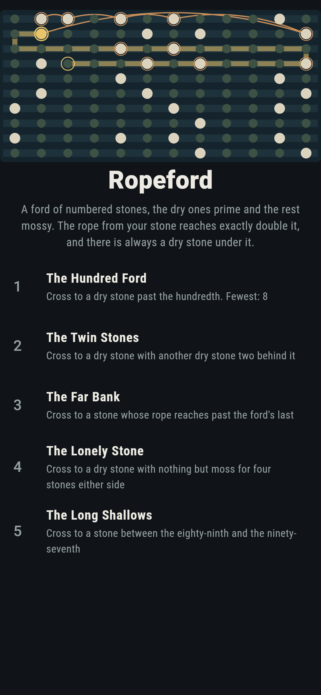
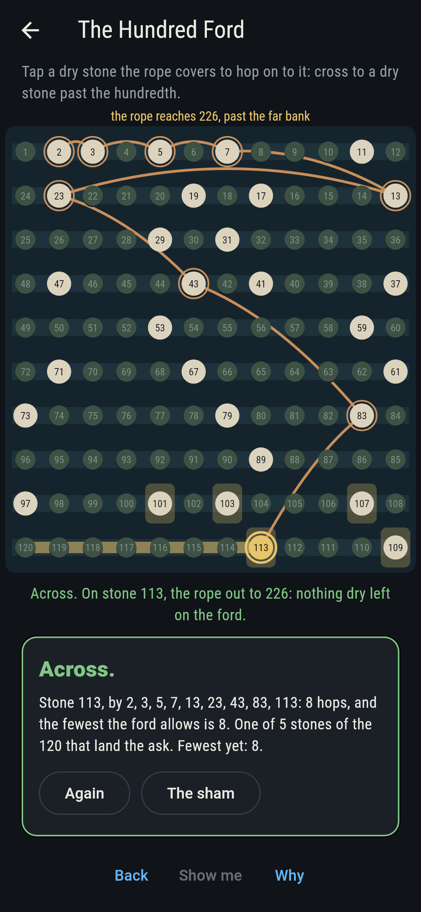
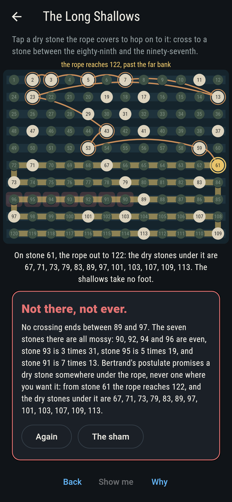
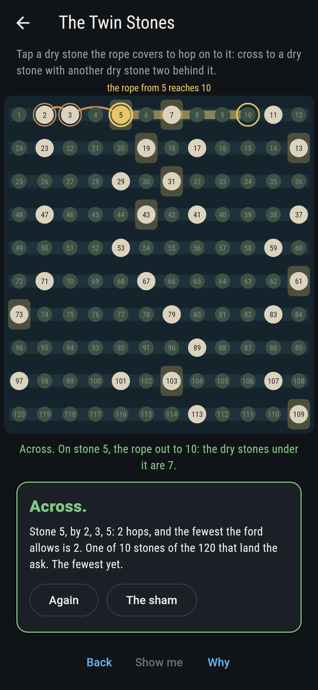
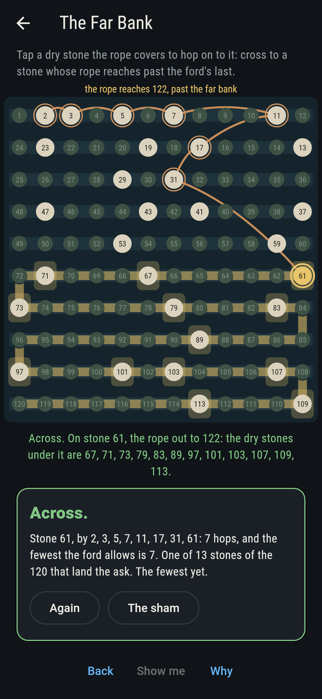
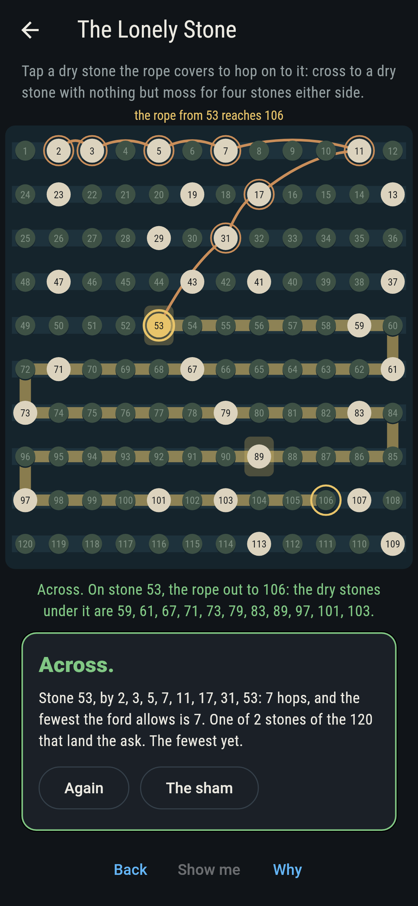
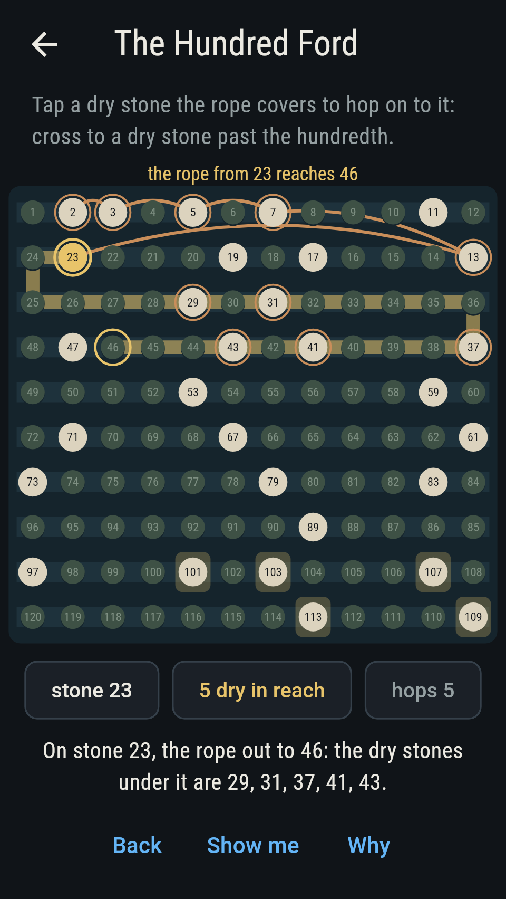
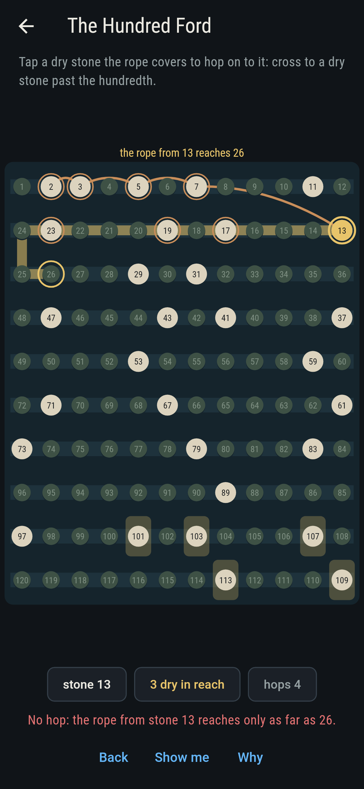
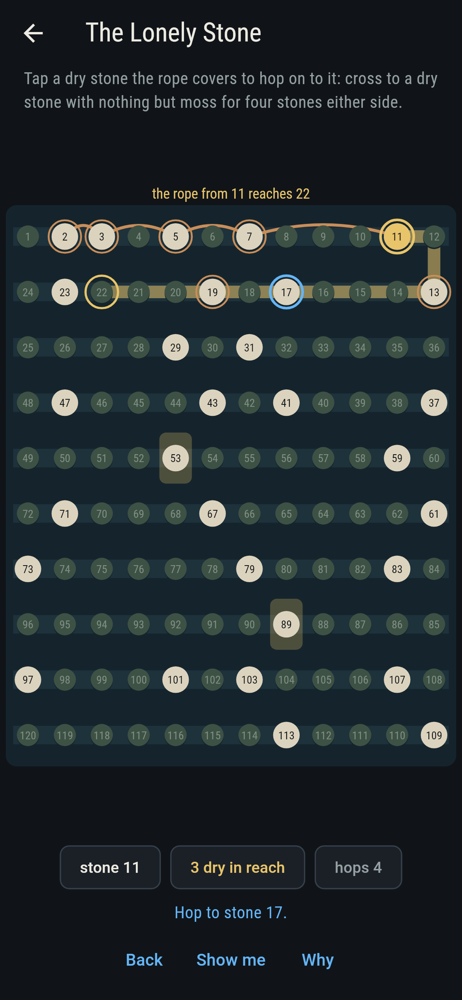
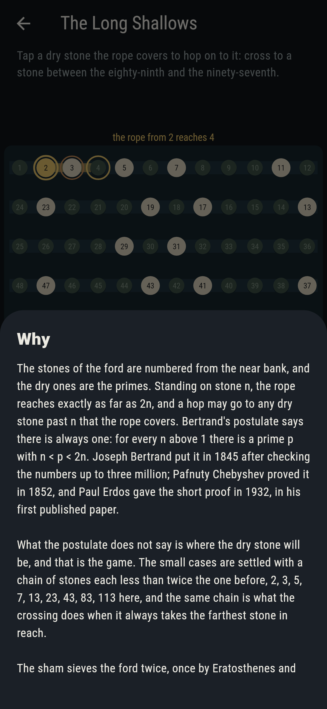

# Ropeford


A ford of stepping stones numbered from the near bank, 1 to 120. The
dry stones are the primes; the rest are mossy and half sunk and will
not take a foot. Stand on stone n and the rope reaches exactly as far
as 2n, so it grows as you go, and a hop may take you to any dry stone
past n that the rope covers. Bertrand's postulate says the ford can
never strand you: for every n above 1 there is a prime p with
n < p < 2n. Joseph Bertrand stated it in 1845 after checking the
numbers up to three million, Pafnuty Chebyshev proved it in 1852, and
Paul Erdos gave the short proof in 1932, in his first published paper.
What the postulate does not say is where the dry stone will be, and
that is the game. The sham sieves every stone twice, asks every number
up to 200,000 for a dry stone inside its rope, and walks the ford for
the fewest hops each ask takes.

## The asks

1. **The Hundred Ford** - cross to a dry stone past the hundredth
2. **The Twin Stones** - cross to a dry stone with another dry stone two behind it
3. **The Far Bank** - cross to a stone whose rope reaches past the ford's last
4. **The Lonely Stone** - cross to a dry stone with nothing but moss for four stones either side
5. **The Long Shallows** - cross to a stone between the eighty-ninth and the ninety-seventh

Thirty of the ford's 120 stones are dry, and every one of them can be
reached from stone 2: one in a hop, then 5, 7, 13, 23, 43, 83, and by
eight hops the whole ford is open. Eight is what The Hundred Ford
takes, and it is also what the greedy crossing takes, the one that
always jumps to the farthest stone the rope covers: 2, 3, 5, 7, 13,
23, 43, 83, 113. That chain is not a shortcut for the game's sake. A
chain of primes each less than twice the one before is how the small
cases of the postulate are settled, and the same chain turns out to be
the frontier of the fewest-hop walk: the stones you can reach in d
hops are exactly the dry ones up to the chain's dth. Five dry stones
lie past the hundredth, 10 have another dry stone two behind them, and
two, 53 and 89, have nothing but moss for four stones either side. The
Long Shallows is labeled hopeless on its tile, and the reason fits on
a finger: the seven stones from 90 to 96 are all mossy, since 90, 92,
94 and 96 are even, 93 is 3 times 31, 95 is 5 times 19, and 91, which
looks dry enough at a glance, is 7 times 13. It is the first run of
seven mossy stones anywhere. The sham admits it once three ropes have
lain across the whole run, or after sixteen hops.

## Two voices

The game never asserts what it has not computed, and it computes
everything at least twice:

* **The sieve and the walk** work from the stones. Eratosthenes marks
  the dry ones, a pointer running back down the numbers gives the
  first dry stone above each, and the fewest hops come from walking
  the hop graph stone by stone, every dry stone joined to every dry
  stone its rope covers. On the ford that is 30 stones; the checker
  does the same over the 2,262 dry stones below 20,000.
* **Trial division and the chain** know nothing of either. Dryness is
  settled by dividing, and the fewest hops by the greedy chain alone,
  which never searches: 2, 3, 5, 7, 13, 23, 43, 83, 163, 317, 631,
  1259, 2503, and on. The two agree on every stone and on every hop
  count, 8 to pass a hundred, 11 to pass a thousand, 15 to pass ten
  thousand. They agree on the counts, not on the route: the walk lands
  on 101 and the chain on 163, both in eight.

The promise itself is swept rather than assumed. Every number from 1
to 200,000 is asked for a dry stone inside the rope's reach and given
one, and the closest the ford ever comes to stranding you is at stone
3, where the next dry stone is 5 and the rope reaches 6. The strict
form, n < p < 2n, holds from 2 up and fails at 1 alone, where the only
stone in reach is the rope's own end.

`tool/check_ford.dart` runs the lot and refuses the bake on any
disagreement.

## The checker's ledger

What `dart run tool/check_ford.dart` printed for the build this README
shipped with, word for word:

```
every number from 1 to 200,000 asked for a dry stone inside the rope's reach and given one, the first above it found twice, by a pointer walking the sieve and, up to 20,000, by trial division counting up from n + 1, the two agreeing on every one: the promise never fails, and the closest it comes is stone 3, where the next dry stone is 5 and the rope reaches 6; the strict form n < p < 2n holds from 2 up and fails at 1 alone, where the only stone in reach is the rope's own end; the greedy crossing, always the farthest stone the rope covers, runs 2, 3, 5, 7, 13, 23, 43, 83, 163, 317, 631, 1259, 2503, 5003, 9973, 19937, 39869, 79699, 159389, and a walk over the hop graph of the 2,262 dry stones below 20,000, stone by stone and chain unseen, gives the same counts: 8 hops to pass a hundred, 11 a thousand, 15 ten thousand, and the stones reachable in d hops are exactly the dry ones up to the chain's dth; on the ford itself, 120 stones with 30 dry, sieved and divided out and agreeing on every one, every dry stone can be reached and none takes more than 8 hops: 1 at 0, 1 at 1, 1 at 2, 1 at 3, 2 at 4, 3 at 5, 5 at 6, 9 at 7, 7 at 8; 5 dry stones lie past the hundredth, 101, 103, 107, 109, 113, the rope runs past the ford's last stone from 61 on, 13 of them, 10 stones have another dry stone two behind, and 2 have nothing but moss for four either side, 53 and 89; the seven stones from 90 to 96 are all mossy, the first such run anywhere, stone 91 is 7 times 13 and stone 93 is 3 times 31, so no crossing ends in the shallows

 1 The Hundred Ford  cross to a dry stone past the hundredth: 5 of the 120 stones land it, the fewest crossing 8 hops
 2 The Twin Stones   cross to a dry stone with another dry stone two behind it: 10 of the 120 stones land it, the fewest crossing 2 hops
 3 The Far Bank      cross to a stone whose rope reaches past the ford's last: 13 of the 120 stones land it, the fewest crossing 7 hops
 4 The Lonely Stone  cross to a dry stone with nothing but moss for four stones either side: 2 of the 120 stones land it, the fewest crossing 7 hops
 5 The Long Shallows cross to a stone between the eighty-ninth and the ninety-seventh: none of the 120, and the seven mossy stones say so on a finger
```

## Screenshots

| The sham | The hundred ford | The long shallows admitted |
| --- | --- | --- |
|  |  |  |

| The twin stones | The far bank | The lonely stone | Midway, on the small phone | A stone out of reach | Show me | The why |
| --- | --- | --- | --- | --- | --- | --- |
|  |  |  |  |  |  |  |

Screenshots are drawn by `test/showcase_test.dart` at real phone sizes
with the app's own painter, then copied into `docs/` as they came out;
every stone in them was hopped to by a tap on that stone, so nothing
pictured is a crossing the game could not make. The logo and every
launcher icon come out of `test/mark_test.dart` the same way: the mark
is the greedy crossing five hops in, standing on stone 23 with the
rope out to 46 and 29, 31, 37, 41 and 43 under it.

## Building

```
flutter test          # 47 tests, the sweeps among them
dart run tool/check_ford.dart
flutter build apk     # or: flutter build ios
```
