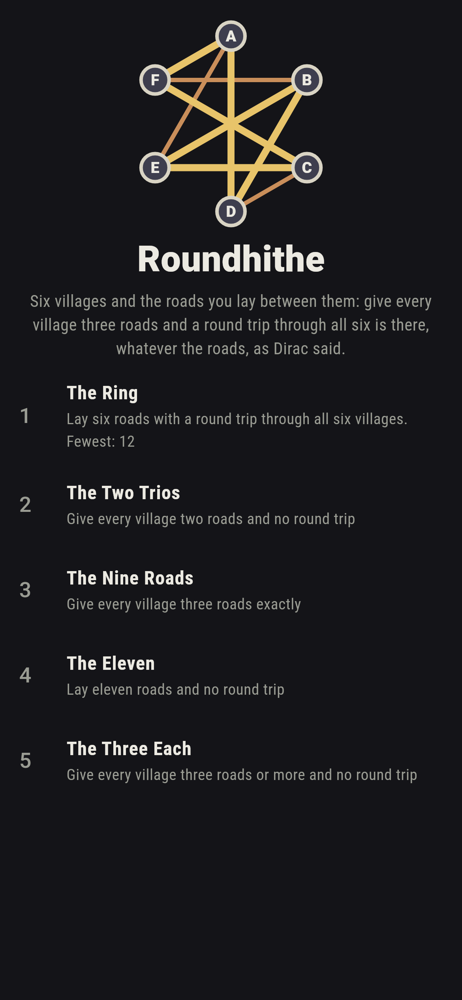
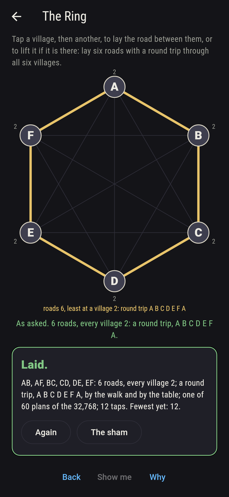
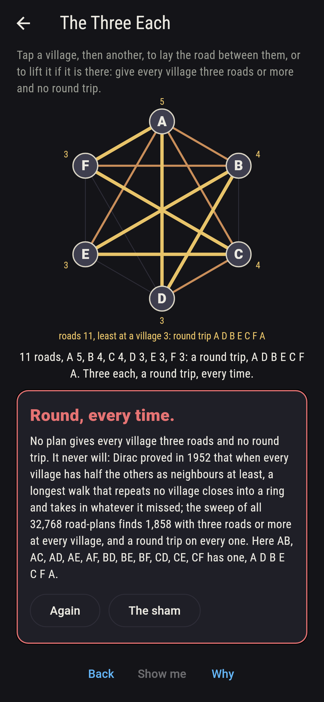
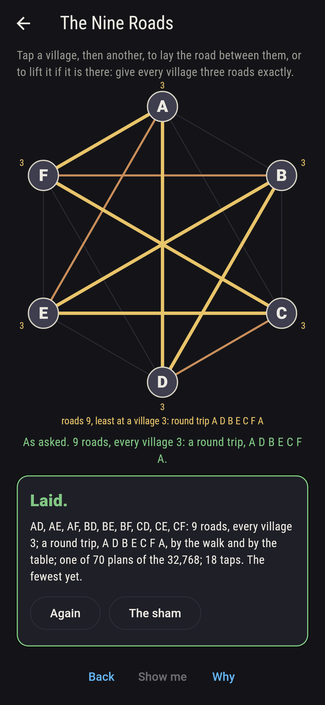
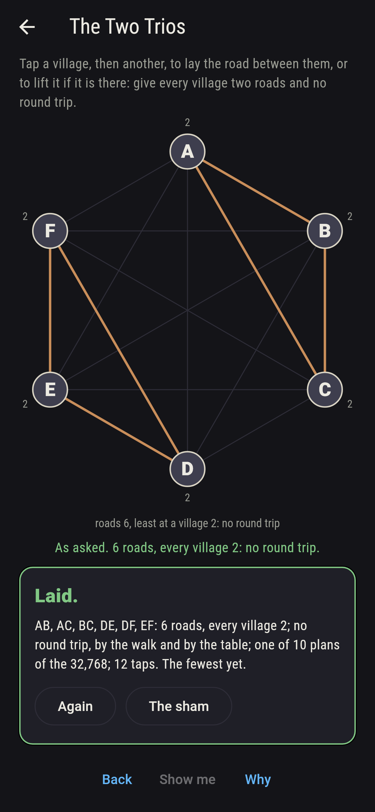
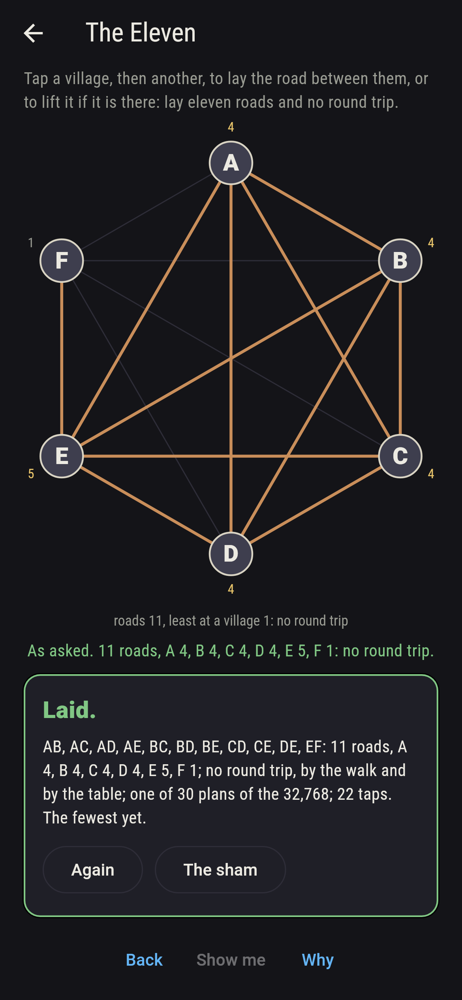
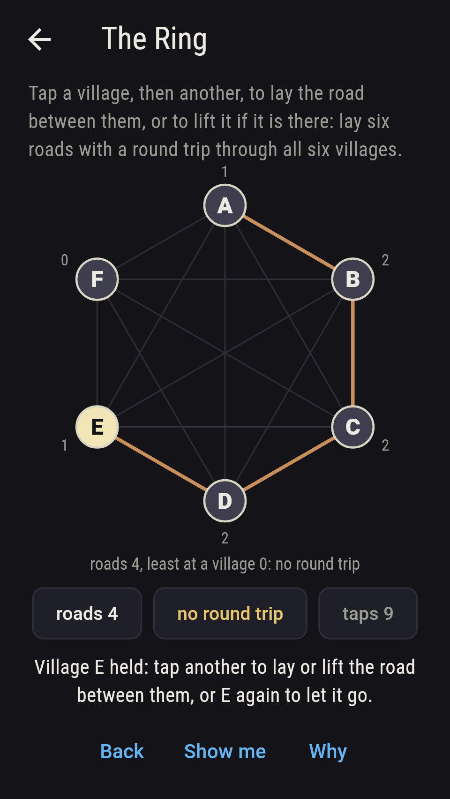
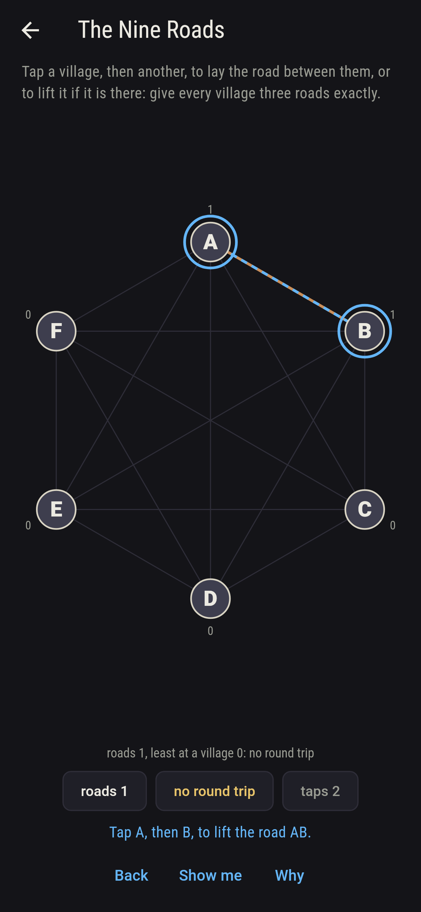
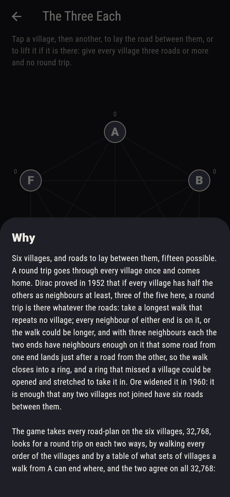

# Roundhithe


Six villages, and roads to lay between them, fifteen possible. A
round trip goes through every village once and comes home. Dirac
proved in 1952 that if every village has half the others as
neighbours at least, three of the five here, a round trip is there
whatever the roads: take a longest walk that repeats no village;
every neighbour of either end is on it, or the walk could be longer,
and with three neighbours each the two ends have neighbours enough
on it that some road from one end lands just after a road from the
other, so the walk closes into a ring, and a ring that missed a
village could be opened and stretched to take it in. Ore widened it
in 1960: it is enough that any two villages not joined have six
roads between them. Tap a village, then another, to lay the road
between them, or to lift it if it is there. The game takes every
road-plan on the six villages, 32,768, looks for a round trip on
each two ways, by walking every order of the villages and by a table
of what sets of villages a walk from A can end where, and the two
agree on all 32,768: 10,078 plans have a round trip, and every one
of the 1,858 with three roads or more at every village does, and
every one of the 1,978 meeting Ore's rule.

## The asks

1. **The Ring** - lay six roads with a round trip through all six villages
2. **The Two Trios** - give every village two roads and no round trip
3. **The Nine Roads** - give every village three roads exactly
4. **The Eleven** - lay eleven roads and no round trip
5. **The Three Each** - give every village three roads or more and no round trip

Six roads is the fewest a round trip needs, one in and one out at
every village, and 60 of the 5,005 plans of six roads are such a
ring, one for each way round the six villages. Seventy plans give
every village two roads, and the ten that are not rings are two
trios, three villages ringed among themselves and the other three
too, with no road between the trios; two roads each is not enough
for Dirac, and of the 10,210 plans with some village at two roads
and no fewer, 1,990 have no round trip. Seventy plans give every
village three roads exactly, and every one has a round trip. Eleven
roads is the most a plan can have and still lack one: 30 plans do
it, each five villages joined every way and the sixth hung on one of
them by a single road, and every plan of twelve roads or more, 576
of them, has a round trip. The Three Each is labeled hopeless on its
tile: Dirac said so first, and the sweep finds no plan of the 32,768
with three roads at every village and no round trip; the sham admits
it after three such plans have shown their trips, or after forty
taps.

## Two voices

The game never asserts what it has not computed, and it computes
everything at least twice:

* **The walk** tries every order of the other five villages from A
  along the roads laid, and takes the first that comes home as the
  round trip; every trip on the sham is that walk's, and every trip
  found is checked to pass through each village once along roads
  that are there.
* **The table** walks nothing: for every set of villages holding A
  and every village in it, it marks whether a walk from A through
  exactly that set can end there, and a round trip is there when the
  full set can end next to A; it agrees with the walk on all 32,768
  plans, and on every plan meeting Dirac's rule, or Ore's, both find
  a round trip.

`tool/check_roads.dart` runs the lot and refuses the bake on any
disagreement.

## The checker's ledger

What `dart run tool/check_roads.dart` printed for the build this
README shipped with, word for word:

```
every road-plan on the six villages taken, 32,768, and a round trip looked for on each two ways, by walking every order of the villages from A and by the table of where a walk from A through a set of villages can end, the two agreeing on all 32,768 and every trip found checked to run along the roads: 10,078 plans have a round trip; every one of the 1,858 with three roads or more at every village does, as Dirac said, and every one of the 1,978 meeting Ore's rule, 120 of them short of Dirac's; six roads is the fewest a round trip needs, 60 rings of the 5,005 plans of six, and eleven the most a plan without one can have, 30 plans of the 1,365, each five villages joined every way and the sixth hung on one of them by a single road, while every plan of twelve roads or more, 576, has one; 70 plans give every village two roads, 60 of them rings and 10 two trios, 10,210 have some village at two roads and no fewer and 1,990 of those no round trip, and 70 give every village three, every one with a round trip

 1 The Ring       lay six roads with a round trip through all six villages: 60 of the 32,768 road-plans land it
 2 The Two Trios  give every village two roads and no round trip: 10 of the 32,768 road-plans land it
 3 The Nine Roads give every village three roads exactly: 70 of the 32,768 road-plans land it
 4 The Eleven     lay eleven roads and no round trip: 30 of the 32,768 road-plans land it
 5 The Three Each give every village three roads or more and no round trip: none of the 32,768, and Dirac said so first
```

## Screenshots

| The sham | The ring | The three each admitted |
| --- | --- | --- |
|  |  |  |

| The nine roads | The two trios | The eleven | Midway, on the small phone | Show me | The why |
| --- | --- | --- | --- | --- | --- |
|  |  |  |  |  |  |

Screenshots are drawn by `test/showcase_test.dart` at real phone
sizes with the app's own painter, then copied into `docs/` as they
came out; every road in them was laid by two taps on the villages,
so nothing pictured is a plan the game could not reach. The logo and
every launcher icon come out of `test/mark_test.dart` the same way:
the mark is the threes-and-threes plan, every village joined to the
three across from it, and its round trip A D B E C F in gold.

## Building

```
flutter test          # 45 tests, the sweep among them
dart run tool/check_roads.dart
flutter build apk     # or: flutter build ios
```
