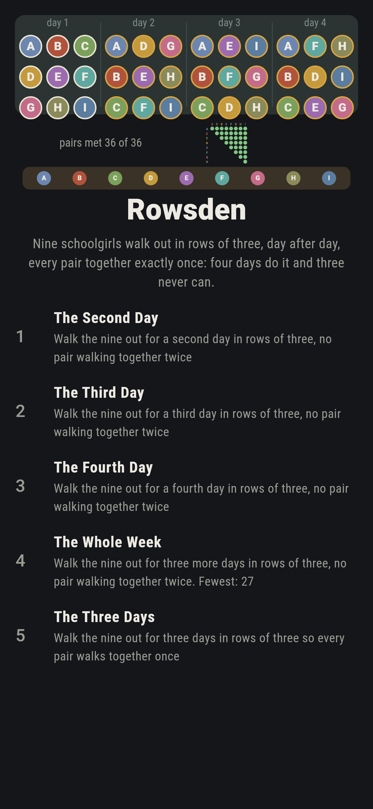
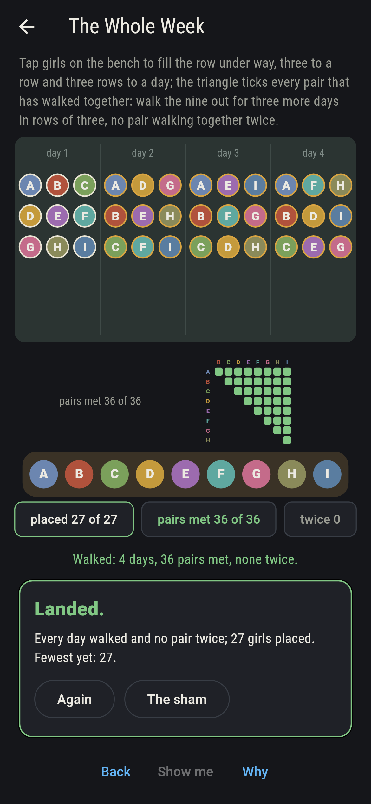
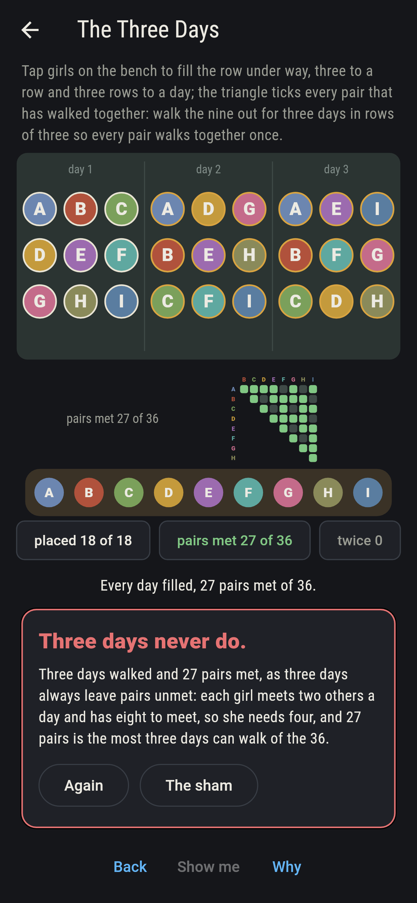
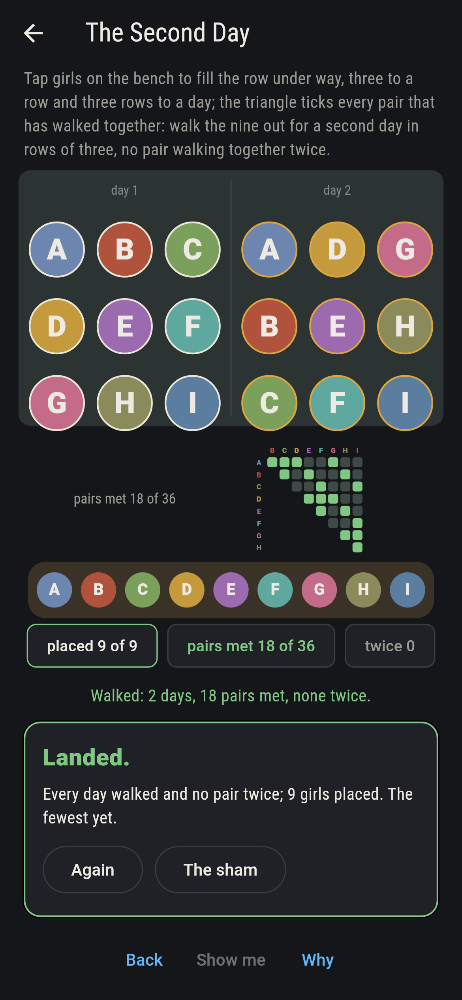
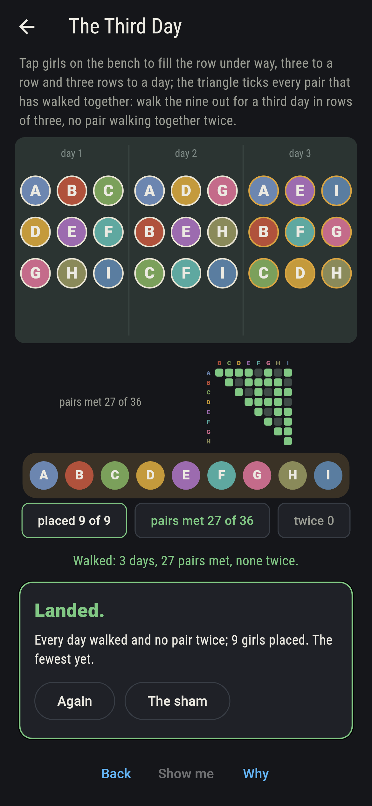
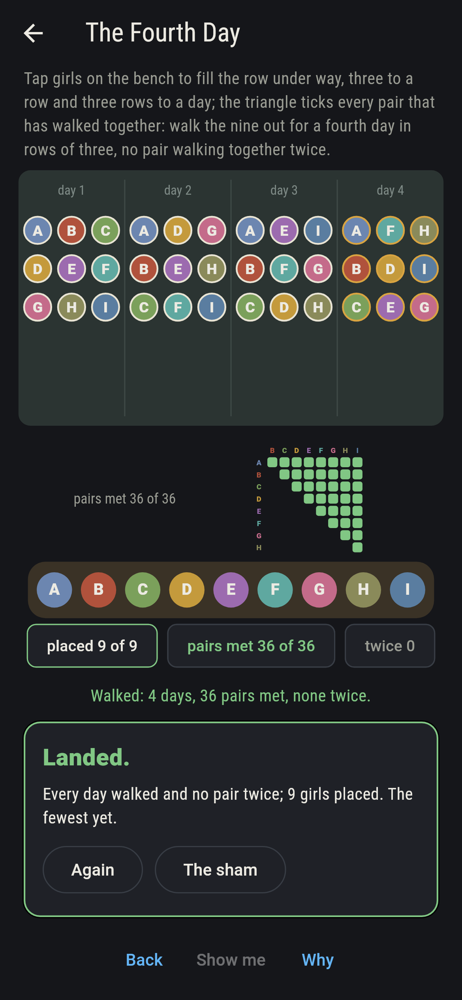
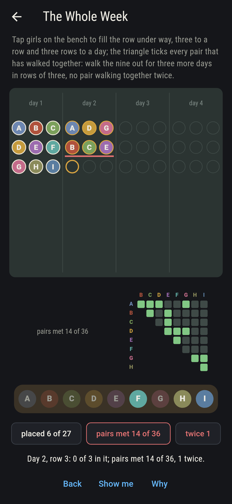
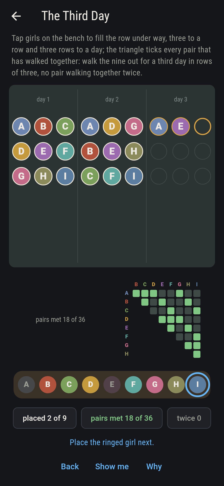
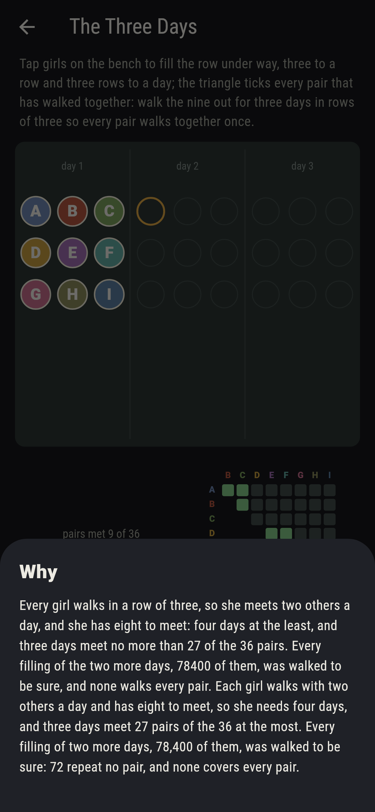

# Rowsden


Kirkman asked in 1850 for fifteen schoolgirls to be walked out in
rows of three for a week so that no two walked together twice.
Here are the nine of them, the smallest such school: walked out
in rows of three, day after day, so that every pair walks together
exactly once. Each girl meets two others a day and has eight to
meet, so the week is four days and no fewer; and four days do it,
by rows, by columns and by the two slants of the girls stood in a
three-by-three, which is the affine plane of order three. You fill
the days girl by girl from the bench; the triangle ticks every
pair that has walked together. Every filling of every week is
swept, and three days are shown to fall short of the thirty-six.

## The weeks

1. **The Second Day** - walk the nine out for a second day in rows of three, no pair walking together twice
2. **The Third Day** - walk the nine out for a third day in rows of three, no pair walking together twice
3. **The Fourth Day** - walk the nine out for a fourth day in rows of three, no pair walking together twice
4. **The Whole Week** - walk the nine out for three more days in rows of three, no pair walking together twice
5. **The Three Days** - walk the nine out for three days in rows of three so every pair walks together once

There are 280 ways to walk nine out in rows of three. After the
first day given, 36 of them repeat no pair; after rows and
columns, 2 do, the two slants; after three days, 1 does; and from
the first day 72 whole weeks follow, of the 21,952,000 fillings,
every one of them walking all 36 pairs. The Three Days is labeled
hopeless on its tile: three days walk 27 pairs at the most.

## Two voices

The game never asserts what it has not computed, and it computes
everything at least twice:

* **The sweep** fills each day to fill with every one of the 280
  walks in turn and counts the fillings that repeat no pair; for
  the three days it tries all 78,400 fillings in full and finds
  none that walks every pair. Every count on the sham is that
  sweep's.
* **Kirkman's own week** is worked out with no search, rows,
  columns and the two slants of the three-by-three, and held to
  the sweep: it repeats no pair, walks all 36, and it is the
  first day of every level and the completion of each; and the
  counts multiply as they should, 36 second days, 2 third days
  after each, 1 fourth day after each of those, 72 weeks.

`tool/check_walks.dart` runs the lot and refuses the bake on any
disagreement.

## The checker's ledger

What `dart run tool/check_walks.dart` printed for the build this
README shipped with, word for word:

```
every filling of every week swept, one of the 280 walks of nine in rows of three to each day to fill: from the first day given, 36 second days repeat no pair, 2 third days after each of those, 1 fourth day after each of those, 72 weeks in all of the 21,952,000 fillings, and every one of the 72 walks all 36 pairs; Kirkman's own week, rows, columns and the two slants of the three-by-three, is one of them; and three days meet 27 pairs at the most, so no filling of two more days walks every pair, all 78,400 tried

 1 The Second Day  walk the nine out for a second day in rows of three, no pair walking together twice: 36 of the 280 fillings land it
 2 The Third Day   walk the nine out for a third day in rows of three, no pair walking together twice: 2 of the 280 fillings land it
 3 The Fourth Day  walk the nine out for a fourth day in rows of three, no pair walking together twice: 1 of the 280 fillings lands it
 4 The Whole Week  walk the nine out for three more days in rows of three, no pair walking together twice: 72 of the 21,952,000 fillings land it
 5 The Three Days  walk the nine out for three days in rows of three so every pair walks together once: none of the 78,400, and two new a day said so first
```

## Screenshots

| The sham | The whole week walked | The three days admitted |
| --- | --- | --- |
|  |  |  |

| The second day | The third day | The fourth day | Mid-walk | Show me | The why |
| --- | --- | --- | --- | --- | --- |
|  |  |  |  |  |  |

Screenshots are drawn by `test/showcase_test.dart` at real phone
sizes with the app's own painter, then copied into `docs/` as they
came out; every girl in them was placed by a tap, so nothing
pictured is a week the game could not reach. The logo and every
launcher icon come out of `test/mark_test.dart` the same way: the
mark is Kirkman's week walked whole, every pair met once.

## Building

```
flutter test          # 44 tests, the sweep among them
dart run tool/check_walks.dart
flutter build apk     # or: flutter build ios
```
