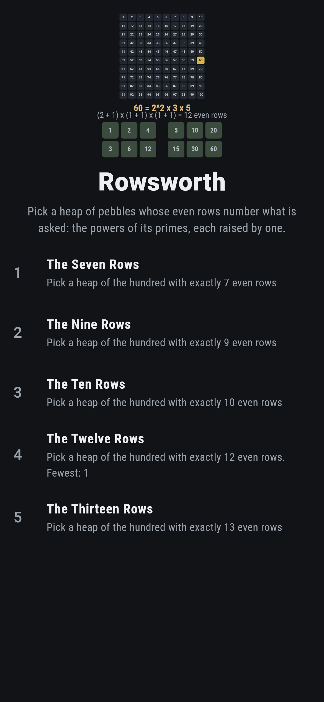
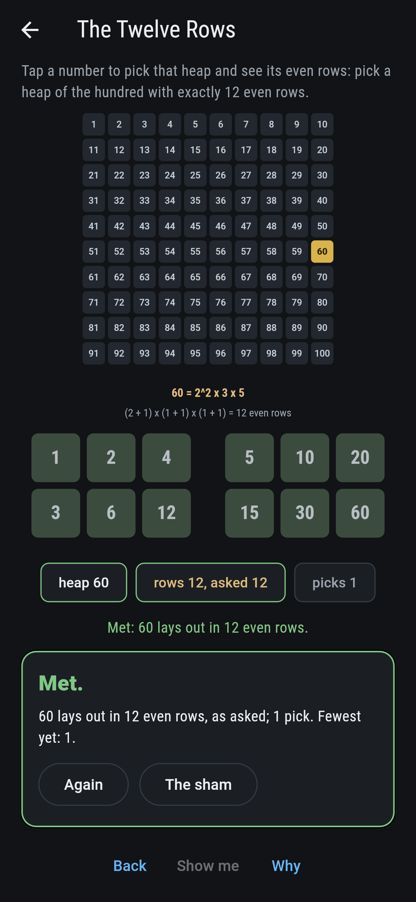
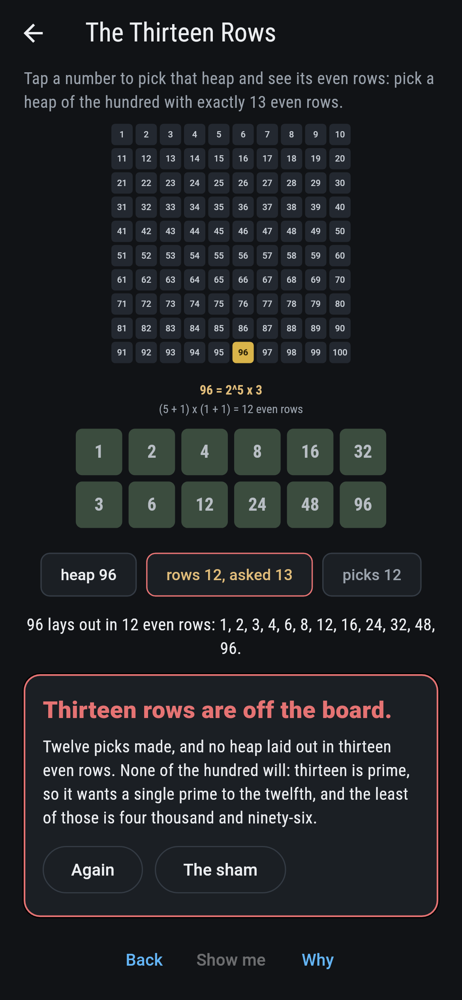
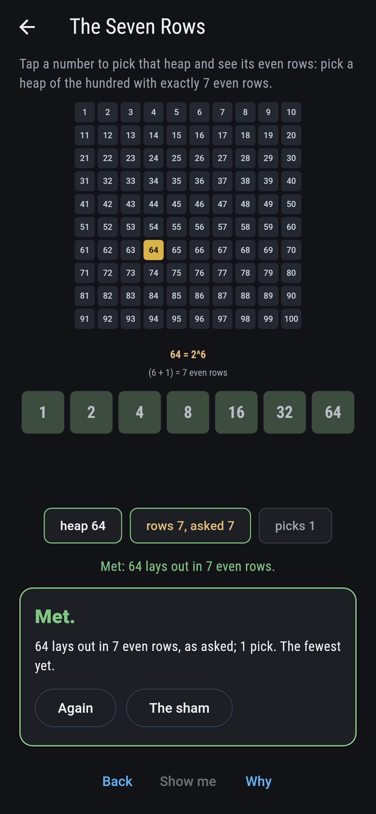
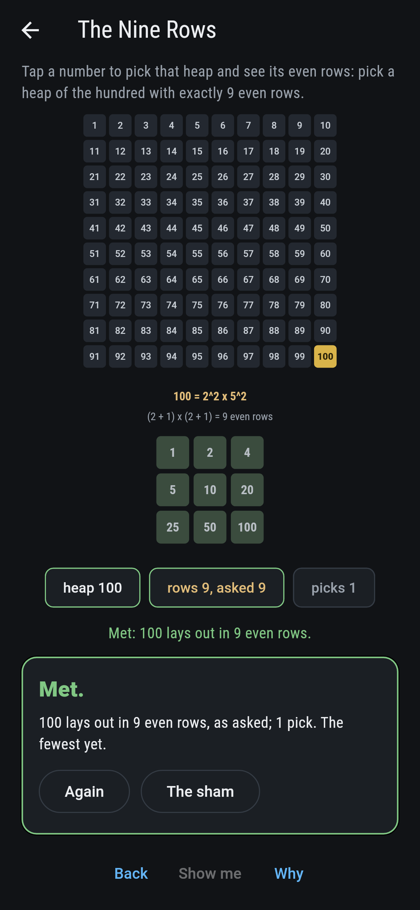
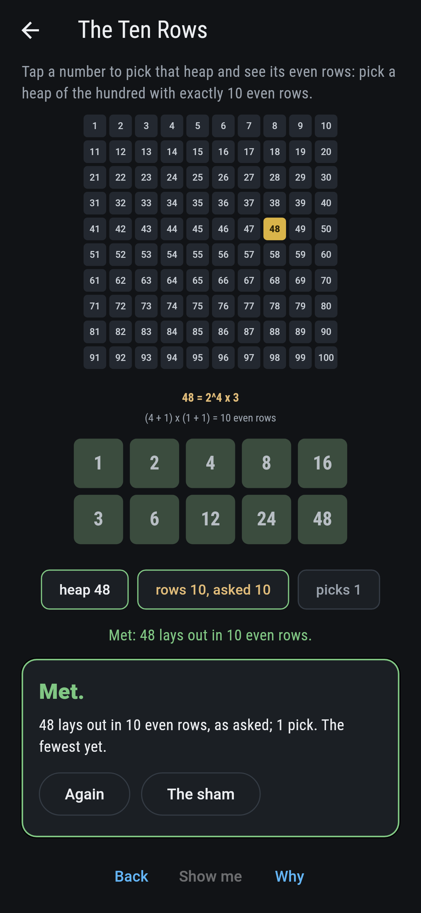
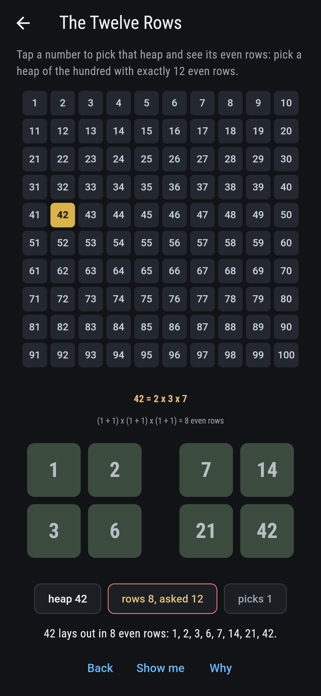
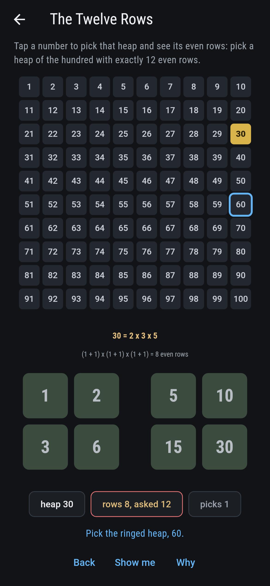
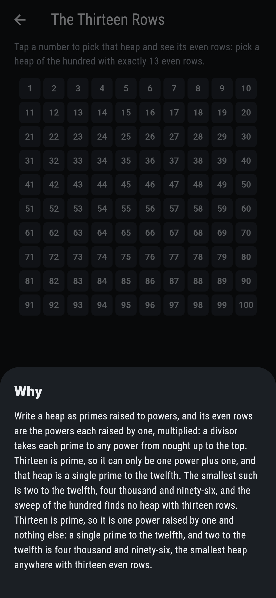

# Rowsworth


A heap of pebbles laid out in rows of equal length: the row
lengths that come out even, with no pebble over, are the divisors
of the heap's count, and how many there are is the oldest question
about a number. Write the count as primes raised to powers and the
answer is the product of the powers each raised by one, since a
divisor takes each prime to any power up to the top. Sixty is the
smallest heap with twelve even rows, sixty-four the only heap of
the hundred with seven, and no heap of the hundred has thirteen:
that wants a single prime to the twelfth.

## The askings

1. **The Seven Rows** - pick a heap of the hundred with exactly 7 even rows
2. **The Nine Rows** - pick a heap of the hundred with exactly 9 even rows
3. **The Ten Rows** - pick a heap of the hundred with exactly 10 even rows
4. **The Twelve Rows** - pick a heap of the hundred with exactly 12 even rows
5. **The Thirteen Rows** - pick a heap of the hundred with exactly 13 even rows

Seven rows: sixty-four alone, and the next is seven hundred and
twenty-nine. Nine rows: thirty-six and a hundred, two primes
squared. Ten rows: forty-eight and eighty. Twelve rows: sixty
first, then seventy-two, eighty-four, ninety and ninety-six, and
the records up to a hundred run 1, 2, 4, 6, 12, 24, 36, 48, 60.
The Thirteen Rows is labeled hopeless on its tile: thirteen is
prime, so it is one power raised by one and nothing else, and two
to the twelfth is four thousand and ninety-six.

## Two voices

The game never asserts what it has not computed, and it computes
everything at least twice:

* **The trial** lays every heap of the hundred out row length by
  row length and counts the lengths that come out even, and does
  the same on to a thousand.
* **The powers** name the count with no trial at all, each power
  raised by one and multiplied, and agree with the trial on every
  heap to a thousand; the picked heap's divisor grid is drawn from
  them, one prime's powers across, another's down, a third's as
  blocks side by side. The smallest heaps anywhere with seven,
  nine, ten, twelve and thirteen rows are searched out, and a prime
  count of rows is checked to come from a single prime raised, on
  every heap to a thousand.

`tool/check_rows.dart` runs the lot and refuses the bake on any
disagreement.

## The checker's ledger

What `dart run tool/check_rows.dart` printed for the build this
README shipped with, word for word:

```
every heap up to a hundred laid out by trial and read by its powers, the two agreeing there and on to a thousand: seven even rows come from sixty-four alone, nine from thirty-six and a hundred, ten from forty-eight and eighty, twelve from sixty first and four more, and thirteen from nothing under four thousand and ninety-six, since a prime count of rows is a single prime raised, on every heap to a thousand; the records up to a hundred run 1, 2, 4, 6, 12, 24, 36, 48 and 60

 1 The Seven Rows     pick a heap of the hundred with exactly 7 even rows: 1 heap of the hundred, 64
 2 The Nine Rows      pick a heap of the hundred with exactly 9 even rows: 2 heaps of the hundred, 36, 100
 3 The Ten Rows       pick a heap of the hundred with exactly 10 even rows: 2 heaps of the hundred, 48, 80
 4 The Twelve Rows    pick a heap of the hundred with exactly 12 even rows: 5 heaps of the hundred, 60, 72, 84, 90, 96
 5 The Thirteen Rows  pick a heap of the hundred with exactly 13 even rows: none of the hundred, and the powers said so first
```

## Screenshots

| The sham | The twelve rows met | The thirteen rows admitted |
| --- | --- | --- |
|  |  |  |

| The seven rows | The nine rows | The ten rows | Mid-pick | Show me | The why |
| --- | --- | --- | --- | --- | --- |
|  |  |  |  |  |  |

Screenshots are drawn by `test/showcase_test.dart` at real phone
sizes with the app's own painter, then copied into `docs/` as they
came out; every pick in them was tapped, so nothing pictured is a
board the game could not reach. The logo and every launcher icon
come out of `test/mark_test.dart` the same way: the mark is sixty
picked, its twelve divisors in a grid below.

## Building

```
flutter test          # 43 tests, the sweep among them
dart run tool/check_rows.dart
flutter build apk     # or: flutter build ios
```
