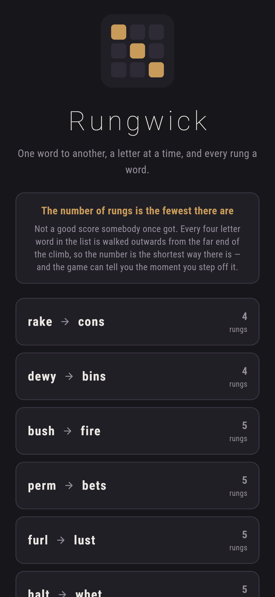
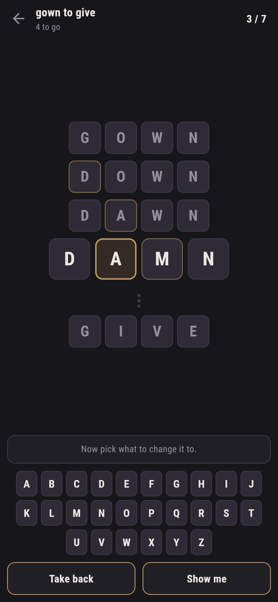
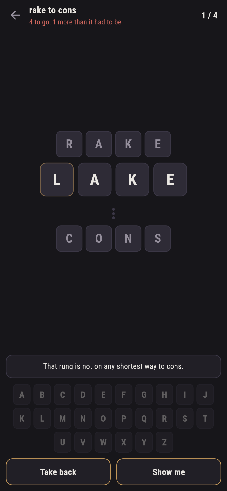
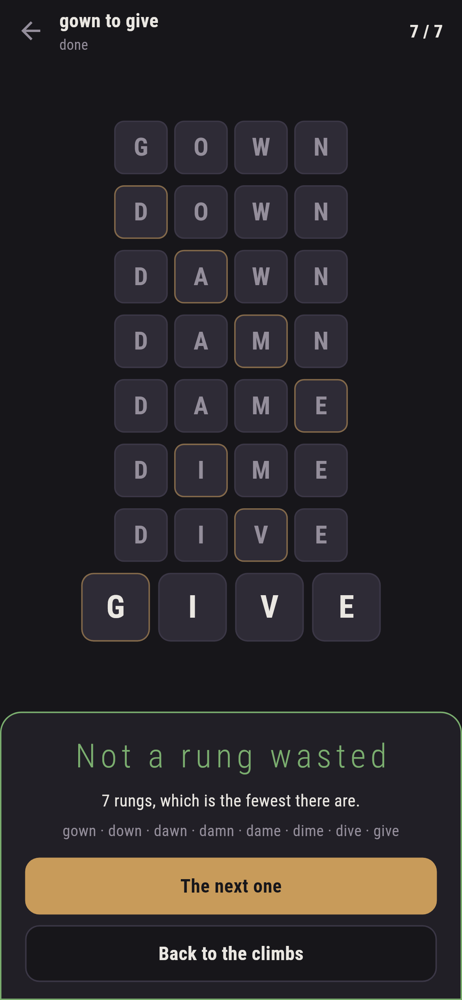
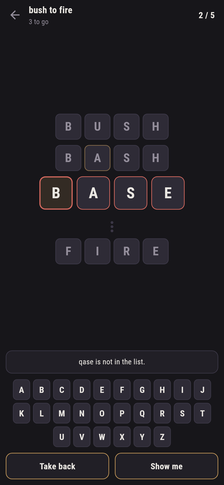

# Rungwick

A word ladder for phones, in Flutter, for Android and iOS.

Get from one word to another by changing a letter at a time, and every rung on
the way has to be a word. **gown, down, dawn, damn, dame, dime, dive, give.**
The number on a climb is the fewest rungs there are.

| | | | |
|---|---|---|---|
|  |  |  |  |

## The number is the shortest way there is

Not a good score somebody once got. Every four-letter word in the list is a
point on a graph, joined to the ones a letter away from it, and the number on
a climb is the shortest path across it, found by walking outwards from the
far end. `test/ladder_test.dart` fails if the number printed on a climb is not
that:

```dart
final found = ladder.climb(ladder.numberOf(climb.from), ladder.numberOf(climb.to));
expect(found!.length - 1, climb.rungs, reason: '$climb is wrong');
```

One walk answers for every word at once, which is what makes everything else
here cheap. The same distances give the count in the corner (*4 to go*), the
hint, and the one below.

## It tells you the moment you have wandered off


`rake → lake` is a word and a rung, and there is no shortest way to *cons*
that goes through it. The game says so at once rather than after five more
rungs and a growing suspicion:

> That rung is not on any shortest way to cons.

Because the distance from every word to the end is already known, this is one
subtraction: rungs climbed plus rungs still needed, against the number on the
climb. You can carry on, and any ladder that gets there wins, but you will
finish over par and the game will say by how much.

## Changing one letter is the interaction, not a rule

Tap the letter you want to change, then tap what to change it to. Two taps,
and the rule that exactly one letter changes is true by construction rather
than something the game has to check and complain about. All that is left for
it to say is whether what you made is a word:

> brim is not in the list.

The letters are not dimmed to show which ones would work. Knowing which single
changes make words is the entire puzzle, and a game that hands that over has
nothing left in it.

## The list is Latchword's list

Both games are in this collection, and two word games disagreeing about
whether something is a word is worse than either of them being wrong. So
`tool/build_words.dart` reads the list Latchword ships and keeps the four and
five letter words out of it, 2442 and 4667 of them.

Choosing the climbs is the part a machine cannot do. `make ladders` finds
pairs and prints the shortest way through each:

```
$ make ladders
  bush -> fire  5 steps  11 on a shortest ladder  tightest 1
      bush bash base bare fare fire
  shed -> tame  6 steps  7 on a shortest ladder  tightest 1
      shed seed send sand sane same tame
```

What the tool cannot judge is whether every rung is a word anybody would think
of. A ladder whose shortest way through goes by a word nobody knows reads as
impossible however short it is, so the ten that ship were picked by eye out of
what it turned up: written by hand, checked by machine.

## The graph

Finding a word's neighbours by comparing it against all 2442 others is 2442
comparisons a step. Bucketing on patterns (`?ake`, `r?ke`, `ra?e`, `rak?`)
finds them in four lookups, because two words in the same bucket are one
letter apart by construction.

The result is flattened into one long array of neighbours with an index of
where each word's run starts, rather than a list of lists: three thousand
small objects for a thing that is read a million times is three thousand
objects too many.

## Running it

```
make deps    # flutter pub get
make test    # everything
make analyze
make shots   # render the screens into build/showcase, redraw the logo
make words   # rebuild the word lists from Latchword's
make ladders # look for pairs that make a good climb
make apk     # release APK
make ios     # release iOS build, unsigned
```

## Tests

`flutter test` runs the list (sorted, no repeats, all the right length), the
graph (that every neighbour really is one letter away and that being
neighbours goes both ways, checked by hand against the definition), the walk
outwards (nought steps to itself, agreeing with the ladder walked from the
other end, and -1 for what it cannot reach, since some words have no
neighbour at all), and every climb against its number, twice: that the shortest way through
is that many rungs, and that every rung of it is a word.

Then the game through the screen: the two taps that change a letter, a word
the list does not have, a word already on the ladder, taking a rung back, and
the warning when a rung goes nowhere, plus every climb finished in par by
following what **Show me** says, which is the claim the game is sold on made
the way a player would find it false.

| | |
|---|---|
|  |  |
