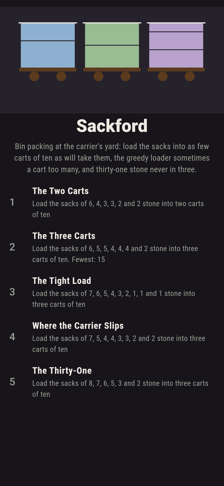
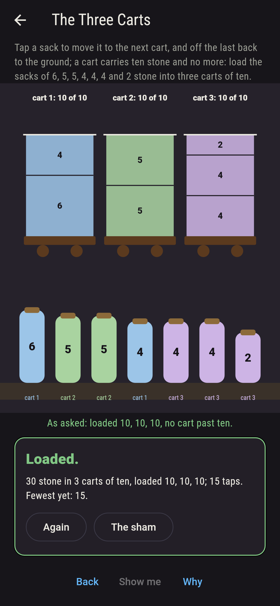
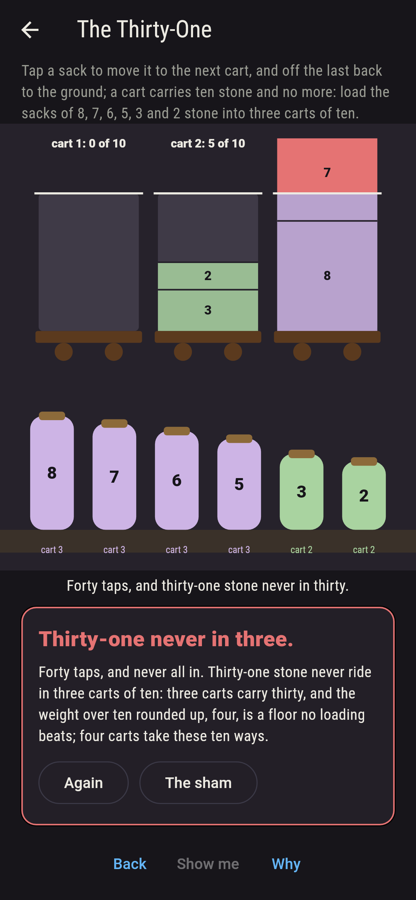
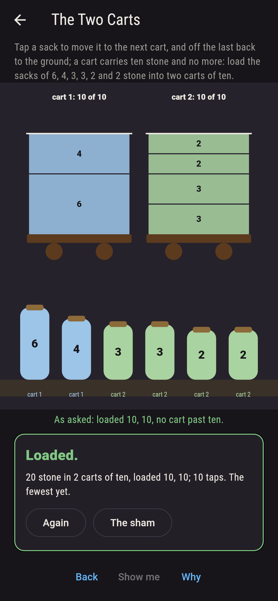
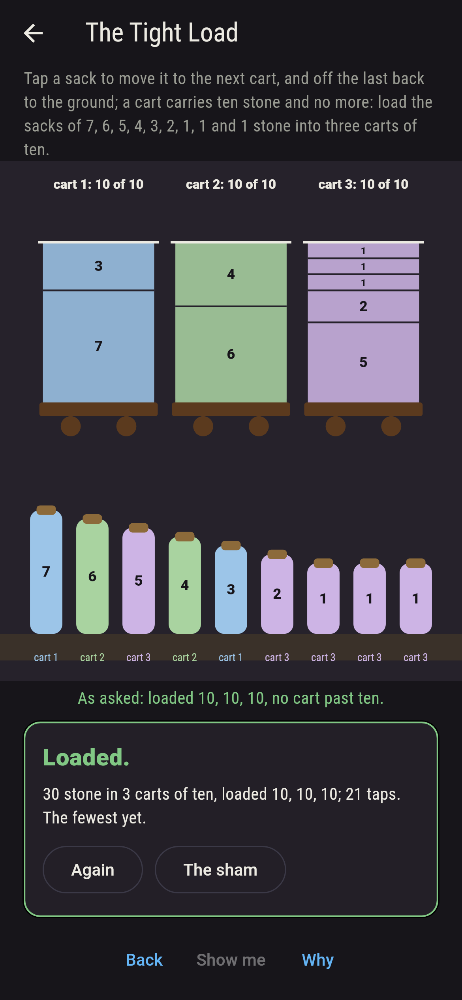
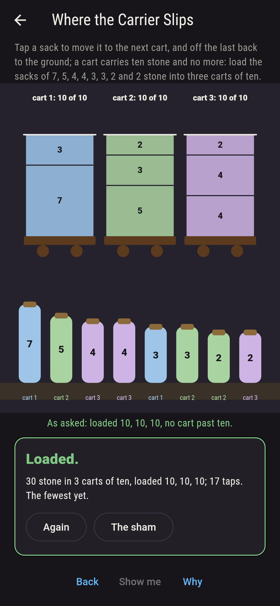
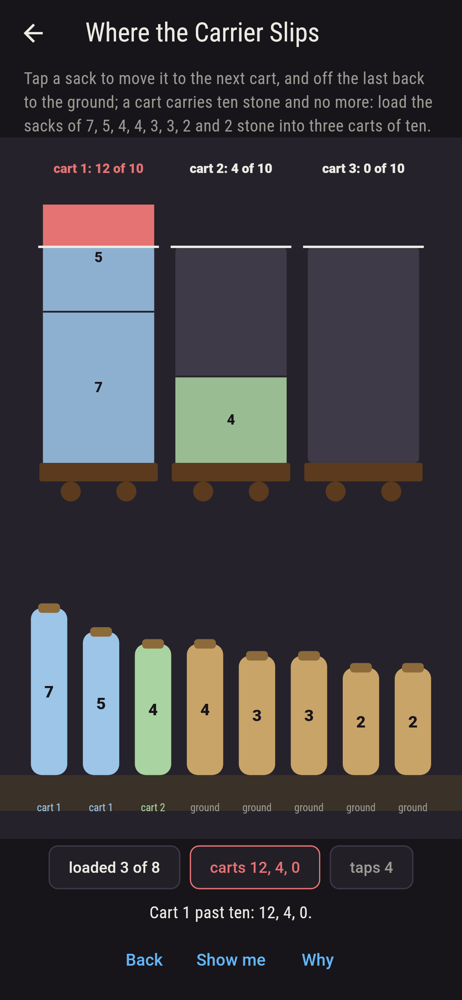
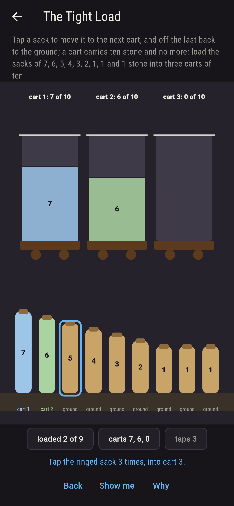
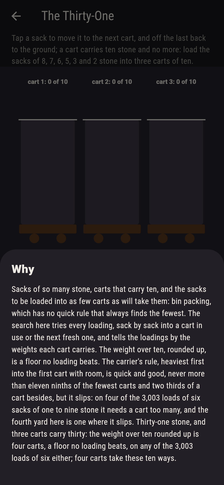

# Sackford


Bin packing at the carrier's yard. Sacks of so many stone, carts
that carry ten, and the sacks to be loaded into as few carts as
will take them; tap a sack to move it to the next cart, and off
the last back to the ground. There is no quick rule that always
finds the fewest carts, so the search here tries every loading,
sack by sack into a cart in use or the next fresh one, and tells
the loadings by the weights each cart carries. The weight over ten,
rounded up, is a floor no loading beats. The carrier's rule,
heaviest first into the first cart with room, is quick and good,
never more than eleven ninths of the fewest carts and two thirds
of a cart besides, but it slips: on four of the 3,003 loads of six
sacks of one to nine stone it needs a cart too many, and the fourth
yard here is one where it does, thirty stone that fit three carts
one way only while the carrier's rule wants four.

## The yards

1. **The Two Carts** - load the sacks of 6, 4, 3, 3, 2 and 2 stone into two carts of ten
2. **The Three Carts** - load the sacks of 6, 5, 5, 4, 4, 4 and 2 stone into three carts of ten
3. **The Tight Load** - load the sacks of 7, 6, 5, 4, 3, 2, 1, 1 and 1 stone into three carts of ten
4. **Where the Carrier Slips** - load the sacks of 7, 5, 4, 4, 3, 3, 2 and 2 stone into three carts of ten
5. **The Thirty-One** - load the sacks of 8, 7, 6, 5, 3 and 2 stone into three carts of ten

Twenty stone go into two carts two ways; the six, five, five, four,
four, four and two into three carts one way, every cart full to the
brim; the tight load of nine sacks five ways; and the seven, five,
four, four, three, three, two and two into three carts one way, the
seven with a three, the five with the other three and a two, the
fours with the other two, while the carrier's rule drops the seven
with a three and the five with a four and is left with a two for a
fourth cart. The Thirty-One is labeled hopeless on its tile, and
the floor is the why: three carts carry thirty.

## Two voices

The game never asserts what it has not computed, and it computes
everything at least twice:

* **The search** tries every loading of every yard, sack by sack
  into a cart in use or the next fresh one, no cart past ten, and
  tells the loadings by the weights each cart carries, so two sacks
  of a weight swapped are one loading; every count on the sham is
  the search's, and it counts the sacks told apart as well.
* **The floor and the carrier's rule** search nothing: the weight
  over ten rounded up is the fewest carts there can be, and the
  carrier's rule loads heaviest first into the first cart with room;
  on every load of six sacks of one to nine stone, 3,003 loads, the
  search's fewest never beats the floor, meets it on 2,201, and the
  carrier's rule needs a cart too many on four and never more than
  eleven ninths of the fewest and two thirds, which is Johnson's
  bound.

`tool/check_carts.dart` runs the lot and refuses the bake on any
disagreement.

## The checker's ledger

What `dart run tool/check_carts.dart` printed for the build this
README shipped with, word for word:

```
every loading of every yard searched, sack by sack into a cart in use or the next fresh one, no cart past ten stone, and told by the weights each cart carries: the sacks of six, four, three, three, two and two go into two carts 2 ways, the six, five, five, four, four, four and two into three 1 way, every cart full, the seven, six, five, four, three, two, one, one and one into three 5 ways, and the seven, five, four, four, three, three, two and two into three 1 way, where the carrier's rule, heaviest first into the first cart with room, needs a fourth; the eight, seven, six, five, three and two, thirty-one stone, go into three carts no way and into four 10 ways, the floor being the weight over ten rounded up; and on every load of six sacks of one to nine stone, 3,003 loads, the fewest carts never beat the floor, meet it on 2,201, and the carrier's rule needs a cart too many on 4 and never more than eleven ninths of the fewest and two thirds

 1 The Two Carts            load the sacks of 6, 4, 3, 3, 2 and 2 stone into two carts of ten: 2 loadings do it
 2 The Three Carts          load the sacks of 6, 5, 5, 4, 4, 4 and 2 stone into three carts of ten: 1 loading does it
 3 The Tight Load           load the sacks of 7, 6, 5, 4, 3, 2, 1, 1 and 1 stone into three carts of ten: 5 loadings do it
 4 Where the Carrier Slips  load the sacks of 7, 5, 4, 4, 3, 3, 2 and 2 stone into three carts of ten: 1 loading does it
 5 The Thirty-One           load the sacks of 8, 7, 6, 5, 3 and 2 stone into three carts of ten: none, and the floor said so first
```

## Screenshots

| The sham | The three carts | The thirty-one admitted |
| --- | --- | --- |
|  |  |  |

| The two carts | The tight load | Where the carrier slips | Mid-loading | Show me | The why |
| --- | --- | --- | --- | --- | --- |
|  |  |  |  |  |  |

Screenshots are drawn by `test/showcase_test.dart` at real phone
sizes with the app's own painter, then copied into `docs/` as they
came out; every sack in them was loaded by a tap, so nothing
pictured is a yard the game could not reach. The logo and every
launcher icon come out of `test/mark_test.dart` the same way: the
mark is the three carts full to the brim.

## Building

```
flutter test          # 46 tests, the search among them
dart run tool/check_carts.dart
flutter build apk     # or: flutter build ios
```
