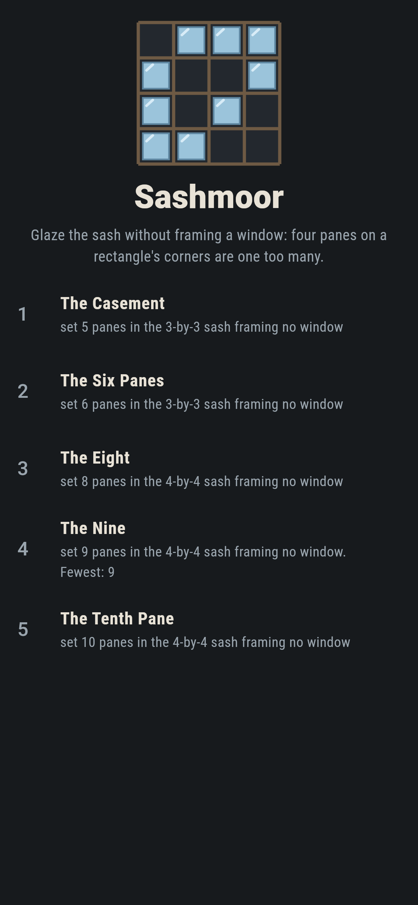
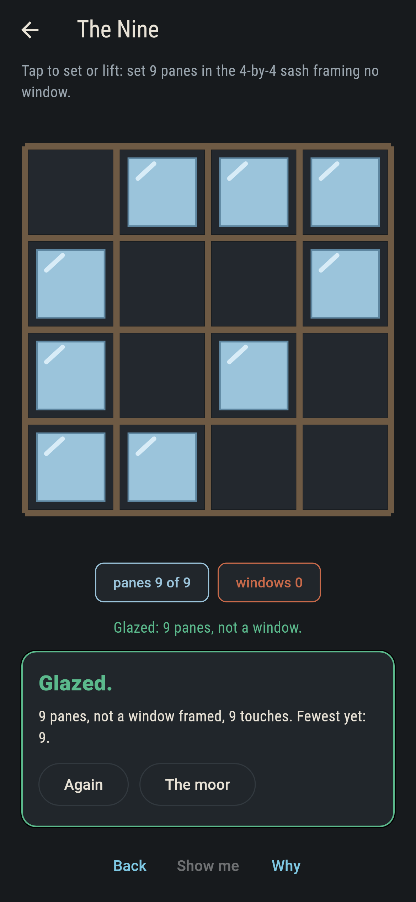
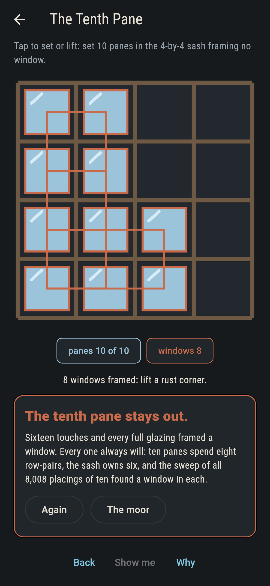
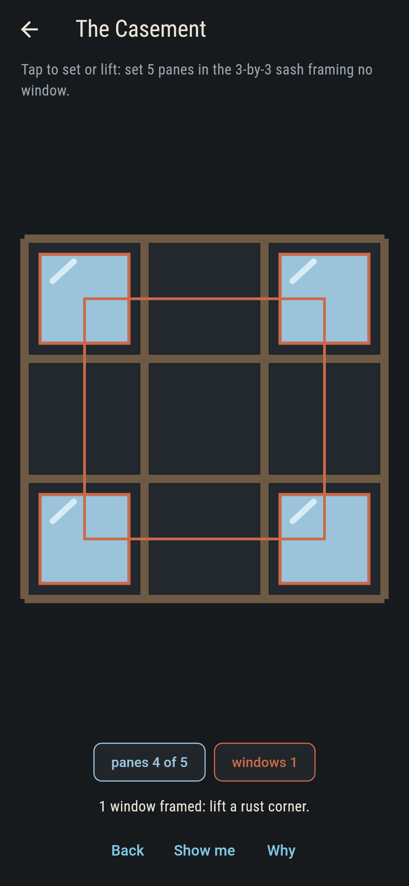
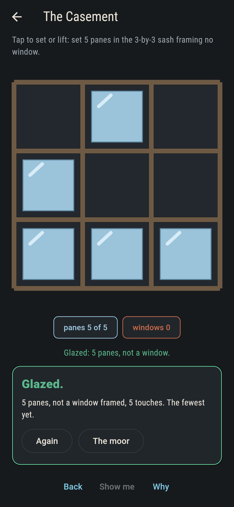
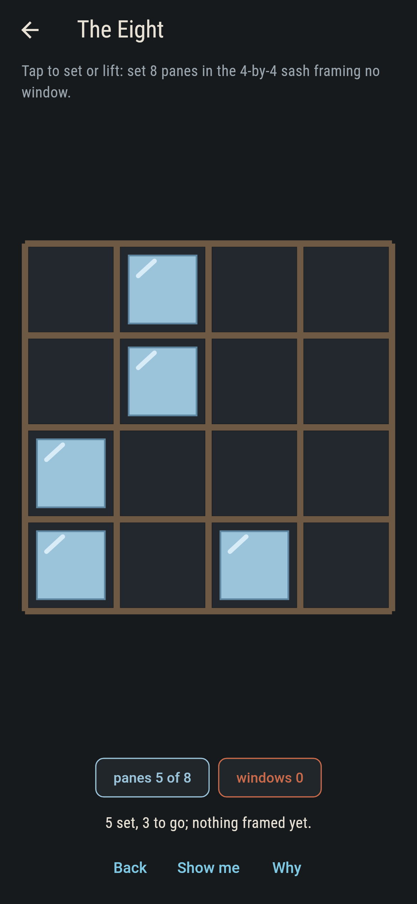
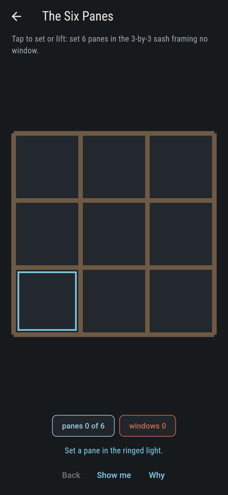
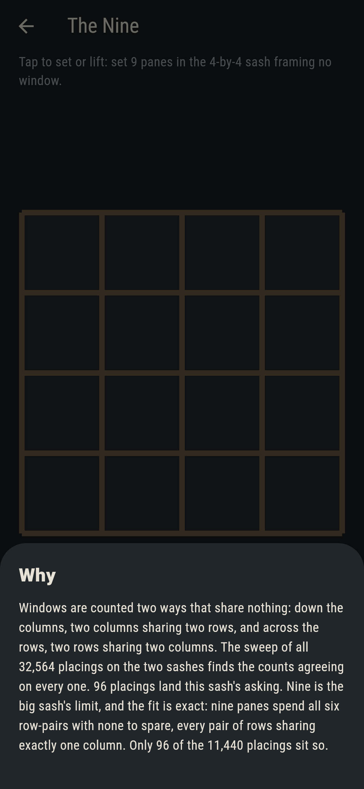

# Sashmoor


Glaze a sash pane by pane without ever framing a window: four
panes on the corners of an upright rectangle are one too many,
and the sash calls the frame out in rust the moment it happens.
How many panes a sash can take is a hard little question with a
soft answer on these two: nine on the four-by-four, six on the
three-by-three, and the game knows both to the placing.

## The sashes

1. **The Casement** - set 5 panes in the 3-by-3 sash framing no window
2. **The Six Panes** - set 6 panes in the 3-by-3 sash framing no window
3. **The Eight** - set 8 panes in the 4-by-4 sash framing no window
4. **The Nine** - set 9 panes in the 4-by-4 sash framing no window
5. **The Tenth Pane** - set 10 panes in the 4-by-4 sash framing no window

The Six Panes and The Nine are the two sashes at their limits,
and The Nine is exact in a way worth seeing: nine window-free
panes spend all six row-pairs with none to spare, every pair of
rows sharing exactly one column. The Tenth Pane cannot be set at
all, and the reason fits on your fingers: ten panes split across
four columns spend at least eight row-pairs, and the sash owns
six.

## Two voices

The game never asserts what it has not computed, and it computes
everything twice:

* **Down the columns**: every pair of columns, the rows they
  share, and a window for every shared pair.
* **Across the rows**: every pair of rows, the columns holding
  both, and C(shared, 2) windows between them.

The sweep lays every placing of five, six and seven panes on the
little sash and eight, nine and ten on the big one, all 32,564 of
them, and holds the two counts equal on every placing, with the
row-pair arithmetic checked besides. `tool/check_panes.dart` runs
the lot and refuses the bake on any disagreement.

## The checker's ledger

What `dart run tool/check_panes.dart` printed for the build this
README shipped with, word for word:

```
every placing of five, six and seven panes on the little sash and eight, nine and ten on the big one, all 32,564: windows counted down the columns and across the rows agree on every placing, ten panes must spend eight row-pairs where the sash owns six, and every window-free nine spends all six exactly

 1 The Casement     set 5 panes in the 3-by-3 sash framing no window: 81 placings of the sweep land it
 2 The Six Panes    set 6 panes in the 3-by-3 sash framing no window: 6 placings of the sweep land it
 3 The Eight        set 8 panes in the 4-by-4 sash framing no window: 1,512 placings of the sweep land it
 4 The Nine         set 9 panes in the 4-by-4 sash framing no window: 96 placings of the sweep land it
 5 The Tenth Pane   set 10 panes in the 4-by-4 sash framing no window: no placing does, by the sweep and by arithmetic both
```

## Screenshots

| The moor | The nine landed | The tenth pane admitted |
| --- | --- | --- |
|  |  |  |

| A window called out | The casement glazed | Mid-glaze | Show me | The why |
| --- | --- | --- | --- | --- |
|  |  |  |  |  |

Screenshots are drawn by `test/showcase_test.dart` at real phone
sizes with the app's own painter, then copied into `docs/` as they
came out; every pane in them was tapped, so nothing pictured is a
sash the game could not reach. The logo and every launcher icon
come out of `test/mark_test.dart` the same way: the mark is the
nine landed.

## Building

```
flutter test          # 49 tests, the sweep among them
dart run tool/check_panes.dart
flutter build apk     # or: flutter build ios
```
